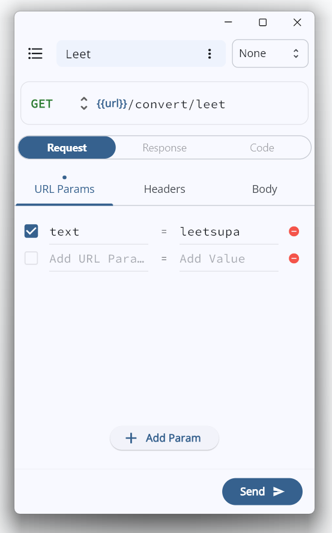
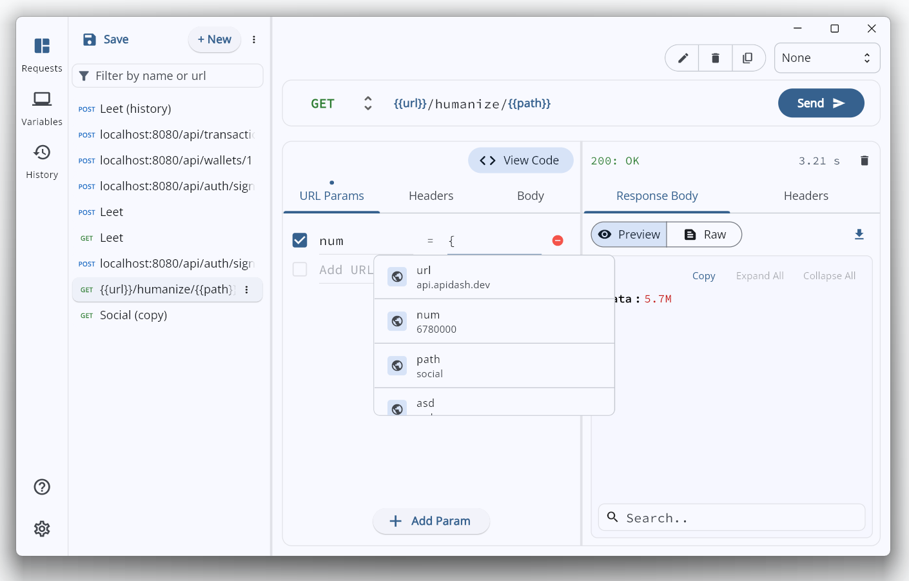
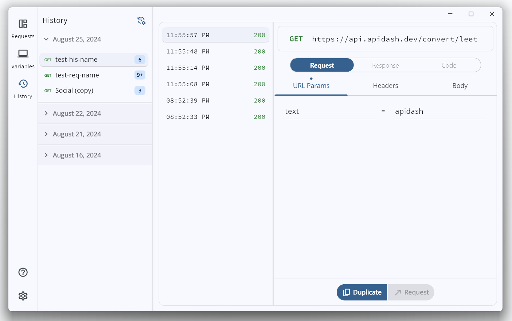
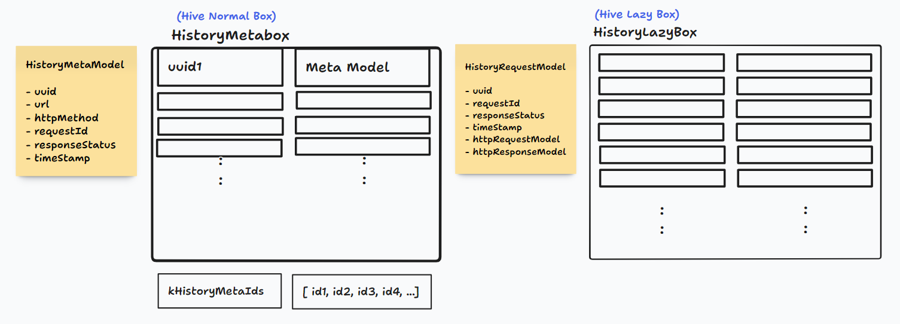

# GSoC'24 - Android/iOS support for API Dash

> Final report summarizing my contributions to the project as part of GSoC'24

## Project Details

1. **Contributor** : Ragul Raj M
2. **Mentors** : Ashita P, Ankit M
3. **Organization**: API Dash
4. **Project**: Android/iOS support for API Dash

#### Quick Links

- [GSoC Project Page](https://summerofcode.withgoogle.com/programs/2024/projects/exbL7COY)
- [Code Repository](https://github.com/foss42/apidash)
- [Discussion Logs](https://github.com/foss42/apidash/discussions/406)

## Proposed Objectives

1. Extend application support to Android & iOS.
2. Add Environment Manager feature with unit testing & widget testing.
3. Add History of Requests feature with unit testing & widget testing.
4. Support for Integration testing.

## Objectives Summary

The primary goal was to adapt existing desktop features to work with limited screen space ensuring that API Dash remains intuitive, user-friendly, and accesibile on both Android and iOS platforms. Thus the application should auto adjust to narrow layouts on resizing even on desktop platforms.
In addition, we aimed to add some important core features such as environment variables management, and history of requests which are essential for an API Client and are currently missing.

## Objectives Completed

### Responsive & Adaptive Layout (Android & iOS)



Restructured the app layout with responsive breakpoints to automatically adjust based on available width. Adapted existing components to work with touch inputs, ensuring proper accessibility in Android & iOS. The UI compoents for all new features added are inherently written to be responsive.

### Environment Manager



Added a way for users to manage variables with multiple environment support. Made existing fields support environment variables with custom highlighting indicating the status (availability) of the variable and popover to show current value and environment and trigger suggestions of available variables as user types a variable name. Added code to extend the feature to hold secret variables.

Extended the package [multi_trigger_autocomplete](https://pub.dev/packages/multi_trigger_autocomplete) to support custom `triggerEnd` values and handling triggers that could be a substring of another like `{` and `{{`.

### History of Requests



Implemented a comprehensive request history feature that enables users to review all the requests and responses they've sent and received in the past. The history is organized with proper grouping of similar requests and sorted by timestamps for easy navigation. Users have the ability to navigate to the original request or duplicate any request directly from the history, carrying over all specific configurations, allowing them to edit the request.

Additionally, added an option for users to customize their request history retention period. They can choose from predefined periods—one week, one month, three months, or keep the history indefinitely. This setting ensures that the request history is automatically cleared according to the user's preference, maintaining a clean and efficient history log.

### Integration Tests

In addition to testing each model, utility and widget added with the new features, I implemented end-to-end integration tests for both existing and new functionalities. These integration tests are written in a modular way, allowing for easy reuse of user actions across different tests.

## Pull Request Report

<table>
    <thead>
        <tr>
            <th>Feature</th>
            <th>Pull Requests</th>
        </tr>
    </thead>
    <tbody>
        <tr>
            <td rowspan="3">Android & iOS Support</td>
        </tr>
        <tr>
            <td>
            <a href="https://github.com/foss42/apidash/pull/227">feat: mobile support</a>
            </td>
        </tr>
        <tr>
            <td>
            <a href="https://github.com/foss42/apidash/pull/408">feat: desktop responsiveness</a>
            </td>
        </tr>
        <tr>
            <td rowspan="4">Environment Manager</td>
        </tr>
         </tr>
            <td>
            <a href="https://github.com/foss42/apidash/pull/412">feat: environment manager</a>
            </td>
        </tr>
        <tr>
            <td>
            <a href="https://github.com/foss42/apidash/pull/429">fix: environment field issues</a>
            </td>
        </tr>
        <tr>
            <td>
            <a href="https://github.com/foss42/apidash/pull/434">test: environment manager tests</a>
            </td>
        </tr>
        <tr>
            <td rowspan="3">History of Requests</td>
        </tr>
         </tr>
            <td>
            <a href="https://github.com/foss42/apidash/pull/430">feat: history of requests</a>
            </td>
        </tr>
        <tr>
            <td>
            <a href="https://github.com/foss42/apidash/pull/436">test: history of requests tests</a>
            </td>
        </tr>
        <tr>
            <td rowspan="5">Integration Tests</td>
        </tr>
         </tr>
            <td>
            <a href="https://github.com/foss42/apidash/pull/444">test: integration tests for env manager</a>
            </td>
        </tr>
        <tr>
            <td>
            <a href="https://github.com/foss42/apidash/pull/446">test: integration tests for history of requests</a>
            </td>
        </tr>
        <tr>
            <td>
            <a href="https://github.com/foss42/apidash/pull/450">test: integration tests for request editor</a>
            </td>
        </tr>
        <tr>
            <td>
            <a href="https://github.com/foss42/apidash/pull/455">test: common runner file for integration test</a>
            </td>
        </tr>
        <tr>
            <td rowspan="7">UI fixes</td>
        </tr>
            <td>
            <a href="https://github.com/foss42/apidash/pull/417">fix: color, deprecations and tests</a>
            </td>
        </tr>
        <tr>
            <td>
            <a href="https://github.com/foss42/apidash/pull/420">feat: about dialog</a>
            </td>
        </tr>
        <tr>
            <td>
            <a href="https://github.com/foss42/apidash/pull/423">fix: renderflex overflow issues in pane</a>
            </td>
        </tr>
        <tr>
            <td>
            <a href="https://github.com/foss42/apidash/pull/426">fix: resizing split views</a>
            </td>
        </tr>
        <tr>
            <td>
            <a href="https://github.com/foss42/apidash/pull/433">fix: refactored ui</a>
            </td>
        </tr>
        <tr>
            <td>
            <a href="https://github.com/foss42/apidash/pull/454">Fix UI inconsistencies in mobile</a>
            </td>
        </tr>
        <tr>
            <td rowspan="2">Documentation</td>
        </tr>
        <tr>
            <td>
            <a href="https://github.com/foss42/apidash/pull/457">doc: added user guides</a>
            </td>
        </tr>
    </tbody>
</table>

## Challenges Faced

### 1. Implementing Environment Suggestion field

#### Task

1. Implement a field that displays suitable variable suggestions when the user types the trigger character `{` or `{{`.
2. Selecting the suggestion should replace the characters in the field with variable.
3. The variable in the field should have appropriate styling (highlighted) according to the variable's availability in the active environment.
4. Hovering the variable should show a Popover with the value the variable will get replaced with and which environment it belongs to.

#### Attempts, Problems and Solution

**1. Attempt:**

I initially found [mention_tag_text_field](https://pub.dev/packages/mention_tag_text_field) which handled both the triggering and allowed custom styling. I configured the field provided by the package and used [flutter_portal](https://pub.dev/packages/flutter_portal) to display suggestions and popover on hovering.

**Problems:**

- I couldn't make the field work for both triggers `{` and `{{` since the former is a substring of latter so, it always matches the trigger to `{`.
- The field didn't support copying and pasting of its content with the variable.

**2. Attempt:**

Used [multi_trigger_autocomplete](https://pub.dev/packages/multi_trigger_autocomplete) for handling triggers, and [extended_text_field](https://pub.dev/packages/extended_text_field) for custom styling the variable. Using separate packages gave me more control and helped in the separation of concerns.

**Problems:**

- [multi_trigger_autocomplete](https://pub.dev/packages/multi_trigger_autocomplete) implicitly added a `" "` and didn't allow customizing it.
- It too couldn't choose the correct trigger among `{` and `{{`.

**Final Solution:**

I had to extend the [multi_trigger_autocomplete](https://pub.dev/packages/multi_trigger_autocomplete) package to allow having custom end Character (`triggerEnd`) instead of `" "` and also choose the right trigger when multiple triggers match the user typed string.

> Link to forked repository: [foss42/multi_trigger_autocomplete](https://github.com/foss42/multi_trigger_autocomplete)

### 2. Loading History of Requests Optimally

#### Issue

The history of requests stores all instances of requests and responses sent by the user, so loading all instances into memory can cause significant overhead.

#### Solution



Use a normal [Box](https://pub.dev/documentation/hive/latest/hive/Box-class.html) to store metadata of all request history, while using a [LazyBox](https://pub.dev/documentation/hive/latest/hive/LazyBox-class.html) to load the full request and response data. Ensure proper concurrency between the history requests stored in both boxes.

Implement auto-clearing to automatically remove old history requests on app start, and allow users to select their preferred request history retention period.

### 3. Writing Integration Tests

#### Issue

I encountered an issue where the integration test preview was hanging at the 'Test starting' splash screen. Initially, I assumed it was related to Hive setup, so I created a simple counter app using Hive and Riverpod to test it out. However, the integration tests worked fine in that app. Running the test on Android also resulted in the same issue, confirming that it wasn't caused by any window-related packages specific to Desktop.

Runing the test with `flutter drive` gave the following logs.

```
...
VMServiceFlutterDriver: Isolate found with number: 986834591817471
VMServiceFlutterDriver: Isolate is paused at start.
VMServiceFlutterDriver: Attempting to resume isolate
...
```

Investigating these logs online, I found related issues.

- [integration_test package pauses isolates and calling pumpAndSettle() never finishes.](https://github.com/flutter/flutter/issues/73355)
- [flutter_driver pauses all isolates at their startup (even ones started from compute()), rather than only pausing initial isolate](https://github.com/flutter/flutter/issues/24703)
- [Integration test example boilerplate to support async main](https://github.com/flutter/flutter/issues/88549)
- [Can't get past splash screen after integration_test migration](https://stackoverflow.com/questions/67762969/cant-get-past-splash-screen-after-integration-test-migration)
- [Flutter Driver hangs at splash screen](https://stackoverflow.com/questions/64797858/flutter-driver-hangs-at-splash-screen)

#### Solution

With the help of mentors gathered a list of popular open source flutter apps which have migrated to `integration_test`. Looked into how [immich](https://github.com/immich-app/immich/tree/main/mobile/integration_test) are writing their integration tests and mimicked their setup process.

### 4. Package and SDK upgrades

The [multi_split_view](https://pub.dev/packages/multi_split_view) introduced breaking changes that disrupted the split views in API Dash's application. To address this, we had to carefully evaluate and choose the most appropriate solution from three different options.

While implementing the new features, a Flutter SDK upgrade introduced deprecations and theme color changes that disrupted the application's appearance. As a result, I had to address the deprecations and adjust some widget stylings to maintain the original look and feel.

## Future Work

### Environment secrets

The environment manager feature can be extended to support secret variables whose values are obscured in the UI.

### Isolate auto-clearing

The auto-clearing of requests currently happens at app start and can potentially delay the loading of the app. Optimizing this process by running the auto-clear operation asynchronously after the UI has loaded or moving it to a isolate could improve startup performance.

## Design and Prototypes Link

1. [Initial Mobile App Design](https://www.figma.com/file/6gsFPwN1NRv7XuVpXZ9FrP/apidash_mobile-DenserMeerkat?type=design&node-id=0%3A1&mode=design&t=uumUAO9f7BfcWAag-1)
2. [History of Request Hive box Schema](https://www.tldraw.com/s/v2_c_k5WBraUFDTsARPpQxNAVa?v=0,400,1536,730&p=kdBoBzSnWE6NZ5xjvaLmB)
3. [History of Request UI Design](https://www.tldraw.com/s/v2_c_k5WBraUFDTsARPpQxNAVa?v=0,100,1537,730&p=page)
