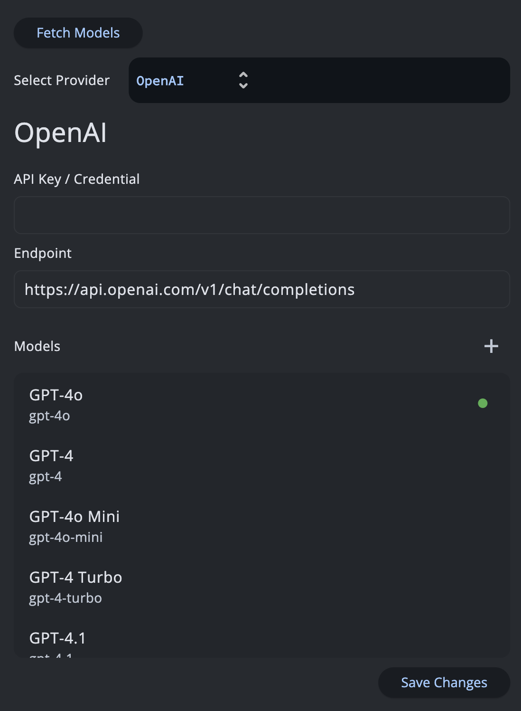

# GSoC'25 - AI-Powered Dynamic UI and Tool Generator with SSE & API Request Support

> Final report summarizing my contributions to the project as part of GSoC'25

## Project Details
1. **Contributor** : Manas M Hejmadi
2. **Mentors** : Ashita P, Ankit M
3. **Organization**: API Dash
4. **Project**: AI-Based API Response to Dynamic UI and Tool Generator (with SSE & AI Requests Support )

#### Quick Links
- [GSoC Project Page](https://summerofcode.withgoogle.com/myprojects/details/hhUUM8wl)
- [Code Repository](https://github.com/foss42/apidash)
- [Discussion Logs](https://github.com/foss42/apidash/discussions/852)

## Proposed Objectives
1. Refactor Apidash’s core networking components into a standalone reusable and testable package.
2. Add Streaming & Server-Sent Events (SSE) support to the Apidash client.
3. Integrate native AI request handling into the Apidash client.
4. Develop an AI-powered API-to-Flutter UI generator for seamless UI creation.
5. Build an API tool generator to help agentic AI applications connect with API endpoints.

## Objectives Summary
The primary goal is to extend API Dash with capabilities that go beyond traditional API client functionality. This includes adding streaming and Server-Sent Events (SSE) support, introducing native AI-powered request handling, and refactoring the core networking components into a modular package for better maintainability and reusability.
In addition, we aim to leverage AI to build higher-level features such as an API-to-Flutter UI generator and an API tool generator to simplify integration for agentic AI applications. Together, these objectives position API Dash as a modern, intelligent, and extensible platform for both developers and AI-driven workflows.

## Objectives Completed

### Refactored API Dash's core networking architecture into a standalone package named `better_networking`

We envisioned `better_networking` to be the go-to package for everything related to networking for a flutter application. It contains very easy to use handlers for making all types of HTTP & GraphQL Requests along with advanced features such as Request cancellation and so on. Initially this was tightly coupled with the apidash codebase under `apidash_core`. I had to decouple it and make platform wide changes to accomodate the new package approach. This also allowed us to write better tests for it and reach 95+% code coverage.

This is an example of how better_networking simplifies request handling


```dart
final model = HttpRequestModel(
  url: 'https://api.example.com/data',
  method: HTTPVerb.post,
  headers: [
    NameValueModel(name: 'Authorization', value: 'Bearer <token>'),
  ],
  body: '{"key": "value"}',
);

//Sending HTTP Requests
final (resp, duration, err) = await sendHttpRequest(
  'unique-request-id',
  APIType.rest,
  model,
);

// To cancel the request
cancelHttpRequest('unique-request-id');
```


---

### Added SSE and Streaming Support to the Client

SSE Support was a long pending [issue](https://github.com/foss42/apidash/issues/116) (since 2024) and hence the mentors asked me to see if i was able to implement SSE support into `better_networking` and simultaneously into `apidash` itself. The implementations suggested by other contributors in the past involved creation of SSE as a completely new request type.
However, I did not agree with this approach as SSE is not a fundamentally separate request type like GraphQL. Hence, I wrote up a quick demo with SSE implemented within the existing apidash foundation code. The mentors were impressed with this approach as it was far more maintainable and sensible than creating new models for it.

Rewrote the original implementation of `sendHttpRequest` in terms of this new SSE handler
```dart
Future<(HttpResponse?, Duration?, String?)> sendHttpRequest(
  String requestId,
  APIType apiType,
  HttpRequestModel requestModel, {
  SupportedUriSchemes defaultUriScheme = kDefaultUriScheme,
  bool noSSL = false,
}) async {
  final stream = await streamHttpRequest(
    requestId,
    apiType,
    requestModel,
    defaultUriScheme: defaultUriScheme,
    noSSL: noSSL,
  );
  final output = await stream.first;
  return (output?.$2, output?.$3, output?.$4);
}
```
This way, everything stays unified and we reduce the amount of duplication
 
---

### Added Agents and AI Requests Support
With the rapid rise of Generative AI, it became clear that API Dash required a dedicated AI request interface with support for agentic systems. Based on this need, my mentors tasked me with developing a comprehensive AI Requests feature, along with an integrated agent building framework for future agentic integrations within the apidash application


The new AI Requests feature supports key capabilities such as remote model import and selection, multi-provider integration, along with support for streaming responses.



The newly created genai package enables users to build their own agents with features like prompt templating and more, making it simple and efficient to create powerful in-app agents.


#### Sample Agent Code

```dart
//simple_func_agent.dart

class SimpleFuncGenerator extends APIDashAIAgent {
  @override
  String get agentName => 'SIMPLE_FUNCGEN';

  @override
  String getSystemPrompt() {
    return """You are a function generator.
Given API details (REQDATA) and a programming language (TARGET_LANGUAGE),
create a method named `func` that performs the API call.
Return only the code.
""";
  }

  @override
  Future<bool> validator(String aiResponse) async {
    return aiResponse.contains("func");
  }

  @override
  Future outputFormatter(String validatedResponse) async {
    validatedResponse = validatedResponse
        .replaceAll(RegExp(r'```[a-zA-Z]*\n?'), '')
        .replaceAll('```', '');
    return {
      'FUNC': validatedResponse,
    };
  }
}

```
---

### Created the API Tool Generator
As mentioned in my original GSoC proposal, i wanted to use the newly created agentic architecture provided by `genai` package to build an API Tool Generator. 
The in-app agent takes the API request details and converts it into standard tool call code from multiple providers such as `openai`, `gemini`, `langchain` and so on


---

### Implemented the API Schema to Flutter UI Generator

The Proof of Concept (PoC) for this was already shown during the initial GSoC period. Once the agentic infrastructure had been developed under `genai` package. All that was left to do was to convert the PoC into production ready code along with handling all the errors. 


we could convert the above API response into a Flutter UI that looks something like this and then export the code. We are free to make any natural language modifications if necessary too.


This makes use of the Server Driven UI Concept powered by [Stac](https://stac.dev/)

---

## Pull Request Report

| Feature                                       | Pull Requests                                                                 |
|-----------------------------------------------|-------------------------------------------------------------------------------|
| Refactoring into Better Networking Package    | [better networking refactoring and package creation](https://github.com/foss42/apidash/pull/857) |
| SSE & Streaming Support                       | [SSE and streaming support for better networking](https://github.com/foss42/apidash/pull/861) |
| Combined: genai package + Native AI Requests Feature | [genai package and AI Requests feature](https://github.com/foss42/apidash/pull/870) |
| AI UI Designer & Tool Generator               | [AI UI Designer + Tool Generator implementation](https://github.com/foss42/apidash/pull/874) |
| Documentation                                 | [doc: GSoC Final Report Creation](https://github.com/foss42/apidash/pull/878)                                           |


## Challenges Faced

- SDUI Dilemma (cannot use hosted rendering server, cannot use Reflection, cannot bundle flutter sdk), hence had to rely on Server Driven UI using Stac
- Stac has no support for returning errors
- Larger UIs tend to generate too long Stac code which gets clipped and leads to faulty output
- Since we cannot fine tune or use external models (for data safety), we have to rely solely on Good System prompting to get the Stac code right. This is by far the biggest challenge and that is why we have restricted ourselves to a small subset of Stac widgets. We will expand on this in the future


## Future Work
- Expand on the available Stac SDUI Widgets so that more detailed UIs can be generated from API complex responses
- Integration tests for AI Requests Feature and the ToolGen, UIGen Features


## Design and Prototypes Link
- [API Tool Generation Research Document ](https://docs.google.com/document/d/17wjzrJcE-HlSy3i3UdgQUEneCXXEKb-XNNiHSp-ECVg)
- [AI UI Designer prototype](https://github.com/synapsecode/AI_UI_designer_prototype)
- [FlutRun (My custom remote flutter component rendering service)](https://github.com/synapsecode/FlutRun)