# GSoC'25 - AI-Based API Response to Dynamic UI and Tool Generator

> Final report summarizing my contributions to the project as part of GSoC'25

## Project Details
1. **Contributor** : Manas M Hejmadi
2. **Mentors** : Ashita P, Ankit M, Ragul Raj M
3. **Organization**: API Dash
4. **Project**: AI-Based API Response to Dynamic UI and Tool Generator

#### Quick Links
- [GSoC Project Page](https://summerofcode.withgoogle.com/programs/2025/projects/hhUUM8wl)
- [Code Repository](https://github.com/foss42/apidash)
- [Discussion Logs](https://github.com/foss42/apidash/discussions/852)

## Project Description

The primary objective of this project was to extend the API Dash client with new generative AI capabilities that go far beyond the scope of traditional API testing clients. This will position API Dash as an OpenSource AI-Native API Testing client.

Our initial vision was to develop an AI-powered agent capable of transforming raw API responses into structured UI schemas and fully functional UI components that could be directly exported and used in frontend applications. Additionally, we wanted to enable dynamic customization of UI components through natural language prompts, allowing developers to customise the design and layout according to their personal preference. This UI code could then be exported and used directly in their Flutter projects. 

As mentioned in the project proposal, we were also aiming to create a one-click `API Request to Tool` generation pipeline, allowing external AI agents to independently interact with APIs. This is a crucial requirement for modern agentic workflows and the idea was that API Dash must be ready to serve these needs.

However, during the planning phase it became clear that these ambitious features required strong foundational infrastructure to work at a production level. Under the guidance of my mentors, we identified and implemented several core architectural improvements, such as:

- Refactoring the networking layer into a modular, standalone package to enhance testability and maintainability.
- Adding streaming support via Server-Sent Events (SSE) to enable real-time AI interactions.
- Introducing AI request handling and a dedicated AI primitives package. This ensures that any future API Dash feature that would need generative ai, can directly import this primitives package instead of implementing everything again. this saves both time and effort.

All in all, these completion of these improvements will establish API Dash as a modern, industry ready platform for developers and AI-driven workflows alike.


## Feature Description

###  `better_networking` package creation & project-wide refactor

`Package Link`: https://pub.dev/packages/better_networking

`Associated Pull Request`: [#857](https://github.com/foss42/apidash/pull/857)

Initially, the entire networking constructs that API Dash relied on was fully written inside a module named `apidash_core`. 
The networking code was fairly advanced including support for GraphQL, request cancellations and a lot of other good features. However, as it was tightly coupled with API Dash, we were unable to allow the rest of the flutter developer community to use these features. We believe in giving back to the open source community whenever we can and hence the mentors and I decided to refactor everything into a new package. 
During discussions, I came up with the name `better_networking` and we envisioned it to  be the go-to package for everything related to networking for a flutter application.

This is an example of how better_networking simplifies request handling


```dart
final model = HttpRequestModel(
  url: 'https://api.example.com/data',
  method: HTTPVerb.post,
  headers: [
    NameValueModel(name: 'Authorization', value: 'Bearer <token>'),
  ],
  body: '{"key": "value"}',
);

//Sending HTTP Requests
final (resp, duration, err) = await sendHttpRequest(
  'unique-request-id',
  APIType.rest,
  model,
);

// To cancel the request
cancelHttpRequest('unique-request-id');
```

This proved to be a great decision, as we were able to separate it completely, publish it on [pub.dev](https://pub.dev/packages/better_networking), and achieve over 95% code coverage through isolated testing.

Code coverage before refactor:
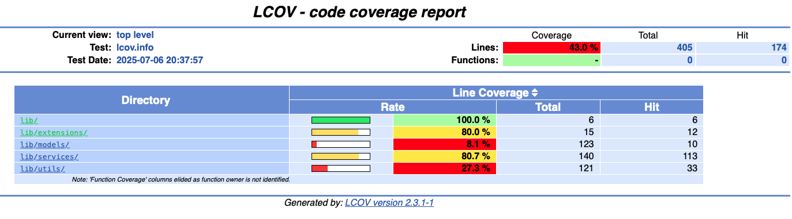

Code coverage after Refactor:
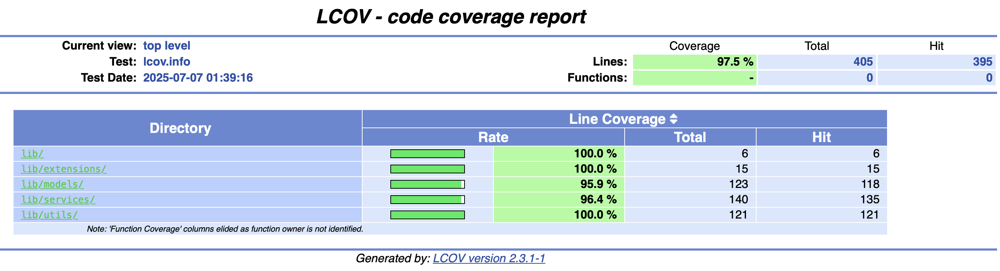

---

### Added SSE and Streaming Support to the Client
`Associated Pull Request`: [#861](https://github.com/foss42/apidash/pull/861)

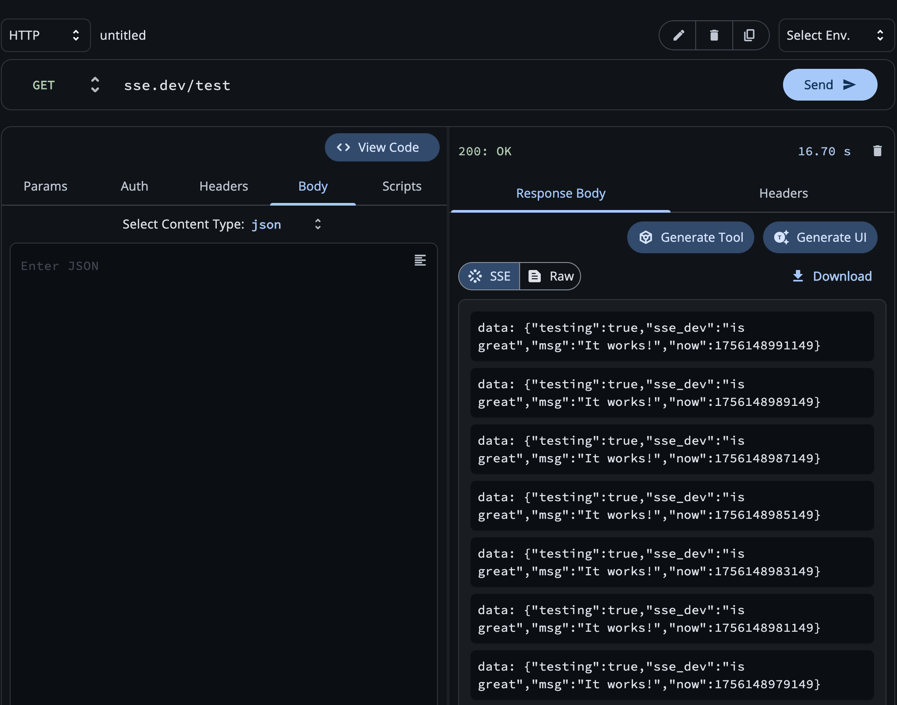

SSE Support was a long pending [issue](https://github.com/foss42/apidash/issues/116) (since 2024). Once I completed the initial version of better_networking, the mentors asked me to look if SSE support can be added within the package and by extension into API Dash, as AI responses are usually transmitted in this format. After doing some research and a review into the existing PRs by other contributors for this feature, I noticed that everyone created new Request and Response Models for SSE in code.

However, I did not agree with this approach as SSE is just a different content-type is not a fundamentally separate request type like GraphQL. 
To demonstrate this, I wrote up a quick demo with SSE baked into the existing API Dash foundations.

This new mechanism is very simple and elegant. Basically, every request in API Dash is executed in streaming mode using `StreamedResponse` in dart. If the response headers specify a content-type marked as streaming, the listener remains active and statefully saves all incoming values into the sseOutput attribute of the response model. If the content-type does not match any supported streaming type, the listener terminates and the output is returned immediately. In this way, the existing request/response model can handle both Streaming and Normal HTTP Requests

This is an example of how I rewrote the original implementation of `sendHttpRequest` in terms of this new SSE handler
```dart
Future<(HttpResponse?, Duration?, String?)> sendHttpRequest(
  String requestId,
  APIType apiType,
  HttpRequestModel requestModel, {
  SupportedUriSchemes defaultUriScheme = kDefaultUriScheme,
  bool noSSL = false,
}) async {
  final stream = await streamHttpRequest(
    requestId,
    apiType,
    requestModel,
    defaultUriScheme: defaultUriScheme,
    noSSL: noSSL,
  );
  final output = await stream.first;
  return (output?.$2, output?.$3, output?.$4);
}
```
The mentors were impressed with this approach as it was far more maintainable and sensible than creating new models specifically for SSE.
This way, everything stays unified and we reduce the amount of duplication
 
---

### Added Agents and AI Requests Support

`Associated Pull Request`: [#870](https://github.com/foss42/apidash/pull/870)

`Package Link`: https://pub.dev/packages/genai

Since my project involved sending AI API requests, the next step involved adding support for AI requests and an interface for building agentic systems in Dart & Flutter. Hence, I started developing a comprehensive AI Requests feature.

The user initiates a new request by selecting “AI”, then chooses a model and provides the required credentials through the Authorization tab. The request can be further configured by specifying system and user prompts and adjusting parameters such as `temperature`, `topP`, and `streaming or non-streaming mode`. Upon submission, the response is generated and presented either as cleaned plaintext/Markdown or in raw format, based on the user’s selection.


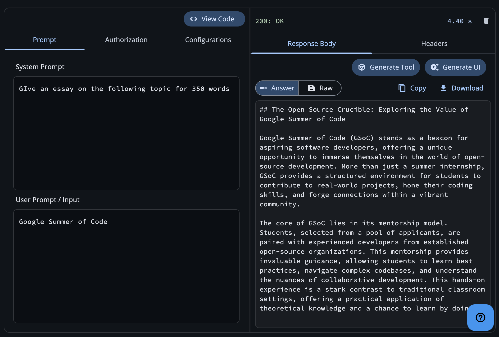
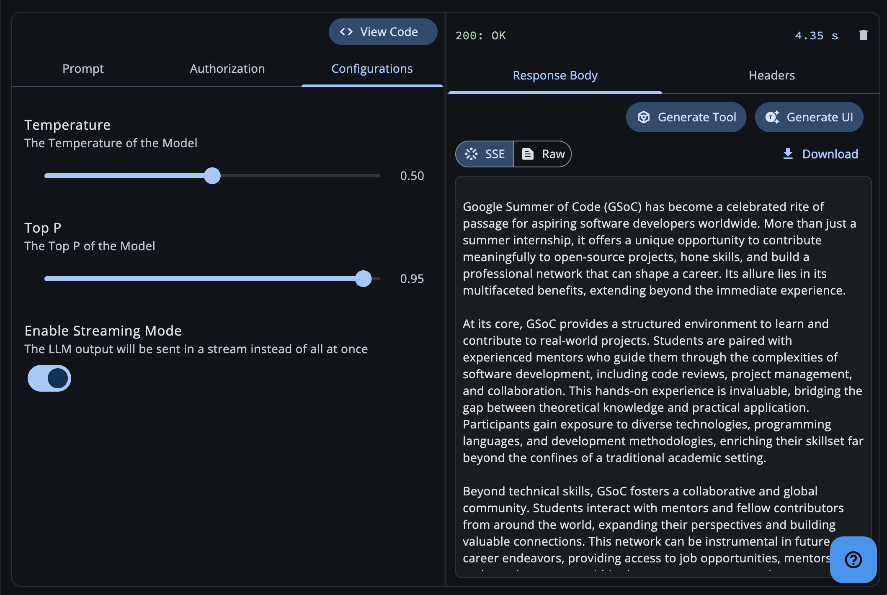

My initial implementation used tightly coupled LLM providers (e.g., gemini, openai) with specific models (e.g., gemini-2.0-flash) through hardcoded enums. These enums were directly referenced in code, which on closer review proved unsustainable. Given the rapid pace of innovation in LLMs, models become obsolete quickly, and maintaining hardcoded enums would require frequent code changes and was looking quite impractical.
Furthermore, using hardcoded enums prevents runtime dynamic loading, restricting users to only the models we explicitly provide. This limits flexibility and creates a poor experience, especially for advanced users who may need access to less common or custom models.

To address this, we adopted a remote model fetch system, where model identifiers are stored in a `models.json` file within the public API Dash repository. Clients fetch this file at runtime, enabling over-the-air updates to model availability. In addition, we added support for custom model identifiers directly within the ModelSelector, giving users full flexibility to configure their own models.

Currently, we support several standard providers—such as Google Gemini, OpenAI, Anthropic, and Ollama—which offers a strong baseline of options while still allowing advanced customization.

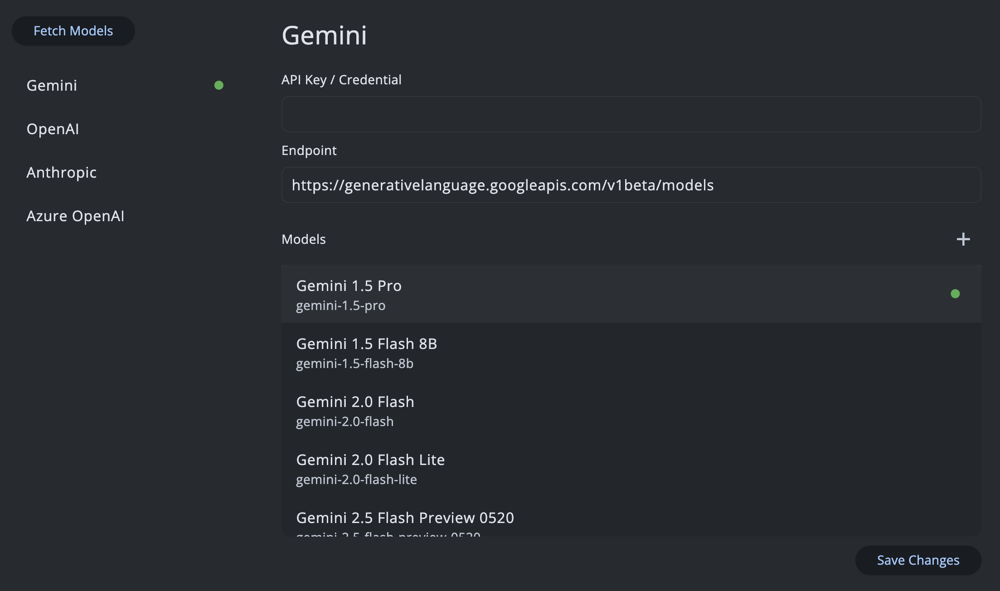

The AI Requests feature is built on top of the foundational genai package, which serves as the core layer for all AI-related functionality within API Dash.
This package provides the complete set of API callers, methods, and formatters required to abstract away the complexities of interacting with AI tool APIs. By exposing a generalized interface across multiple providers, it eliminates the need to handle provider-specific details directly.
As a result, developers can easily build features that leverage generative AI without worrying about low-level implementation details—leaving the intricacies of API communication and formatting to the genai package.

Example of simplified usage (model-agnostic, works with any LLM out of the box)
```dart
final request = AIRequestModel(
  modelApiProvider: ModelAPIProvider.gemini, // or openai, anthropic, etc.
  model: "gemini-2.0-flash",
  apiKey: "<YOUR_API_KEY>",
  url: kGeminiUrl,
  systemPrompt: "You are a helpful assistant.",
  userPrompt: "Explain quantum entanglement simply.",
  stream: false, // set true for streaming
);
await callGenerativeModel(
  request,
  onAnswer: (ans) => print("AI Output: $ans"),
  onError: (err) => print("Error: $err"),
);
```

#### Agentic Infrastructure

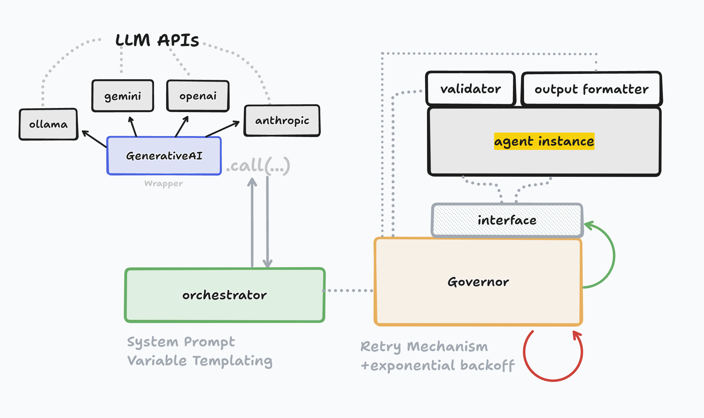

When developing AI-powered features in any application, the process typically involves steps such as system prompting, data validation, and output formatting. However, repeating this workflow for multiple features while taking care of errors and retry logic quickly becomes very cumbersom. To simplify this, we designed a well-defined architecture for building AI agents directly within code.

The core idea is straightforward: an AI agent in API Dash is simply a Dart file containing a class that extends the base class `APIDashAIAgent`, defined as:
```dart
abstract class AIAgent {
  String get agentName;
  String getSystemPrompt();
  Future<bool> validator(String aiResponse);
  Future<dynamic> outputFormatter(String validatedResponse);
}
```
This base class provides the necessary hooks for implementing an agent. Developers can either rely on the default implementations or override these handlers with custom logic. The result is a fully abstracted, self-contained agent that can be invoked seamlessly from within the application.

These agents operate within an orchestrator and governor framework that manages everything behind the scenes. This design ensures that developers only need to invoke the agent, while background processes handle concerns such as automatic retries, exponential backoff, and error recovery seamlessly. This saves a lot of time and effort and allows developers to spend more time on improving their actual feature implementation.


#### Sample Agent Code

```dart
//simple_func_agent.dart

class SimpleFuncGenerator extends AIAgent {
  @override
  String get agentName => 'SIMPLE_FUNCGEN';

  @override
  String getSystemPrompt() {
    return """you are a programming language function generator. 
    your only task is to take whatever requirement is provided and convert
    it into a valid function named func in the provided programming language

    LANGUAGE: :LANG:
    REQUIREMENT: :REQUIREMENT:
"""; //suports templating via :<VARIABLE>:
  }

  @override
  Future<bool> validator(String aiResponse) async {
    return aiResponse.contains("func");
  }

  @override
  Future outputFormatter(String validatedResponse) async {
    validatedResponse = validatedResponse
        .replaceAll(RegExp(r'```[a-zA-Z]*\n?'), '')
        .replaceAll('```', '');
    return {
      'FUNC': validatedResponse,
    };
  }
}

//Calling an agent
 final res = await APIDashAgentCaller.instance.call(
    SimpleFuncGenerator(),
    ref: ref,
    input: AgentInputs(variables: {
      'REQUIREMENT': 'take the median of the given array',
      'TARGET_LANGUAGE': 'python3',
    }),
  );

```

---

### Created the API Tool Generator
As proposed in my GSoC proposal, I set out to implement an API Tool Call Generator within the application. It consists of an in-app agent that processes API request details and converts them into standardized tool-call code compatible with providers such as OpenAI, Gemini, LangChain, and others.

This feature is fully built on top of the agentic foundation established by `genai`. Once a user executes an API request and receives a response, they can click “Generate Tool”, which opens a tool generation dialog. Here, the user selects their preferred agent framework along with the target output language (currently Python or Node.js). The client then consolidates all request details, sends them to an LLM, and generates the corresponding function callers. These are subsequently integrated into a predefined, well-researched API Tool template, ensuring reliability and consistency.

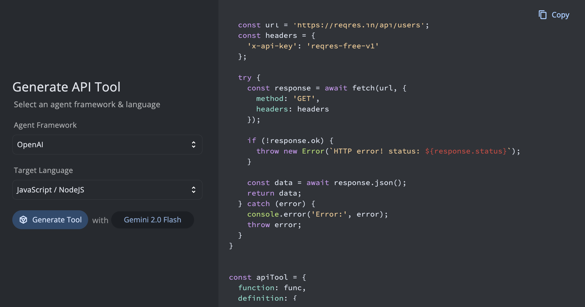

Here's the generated tool code
```python
import requests
def func():
    """
    Retrieves a list of users from the reqres.in API.
    """
    url = "https://reqres.in/api/users"
    headers = {
        "X-Api-Key": "reqres-free-v1"
    }
    try:
        response = requests.get(url, headers=headers)
        response.raise_for_status()
        return response.json()
    except requests.exceptions.RequestException as e:
        print(f"Request failed: {e}")
        return None

api_tool = {
    "function": func,
    "definition": {
        "name": "GetUsers",
        "description": "Retrieves a list of users from the reqres.in API.",
        "parameters": {
            "type": "object",
            "properties": {},
            "required": [],
            "additionalProperties": False
        }
    }
}

__all__ = ["api_tool"]
```

---

### Implemented the API Schema to Flutter UI Generator

With the foundational infrastructure in place, I was finally getting closer to my GSoC goal of building the AI UI Designer.

The purpose of this feature is straightforward yet powerful—take API responses and automatically transform them into suitable UI components, while also providing the ability to modify the design through natural language instructions. Additionally, the generated UI can be exported as Flutter code, enabling seamless integration into frontend applications.

A Proof of Concept (PoC) for this functionality had already been demonstrated during the initial phase of GSoC. The remaining work involved converting the PoC into production-ready code, addressing error handling, improving stability, and ensuring it could scale as a fully integrated feature within API Dash.

This marks a significant milestone, as the AI UI Designer bridges the gap between raw API responses and usable frontend components—removing boilerplate work and streamlining the developer workflow.

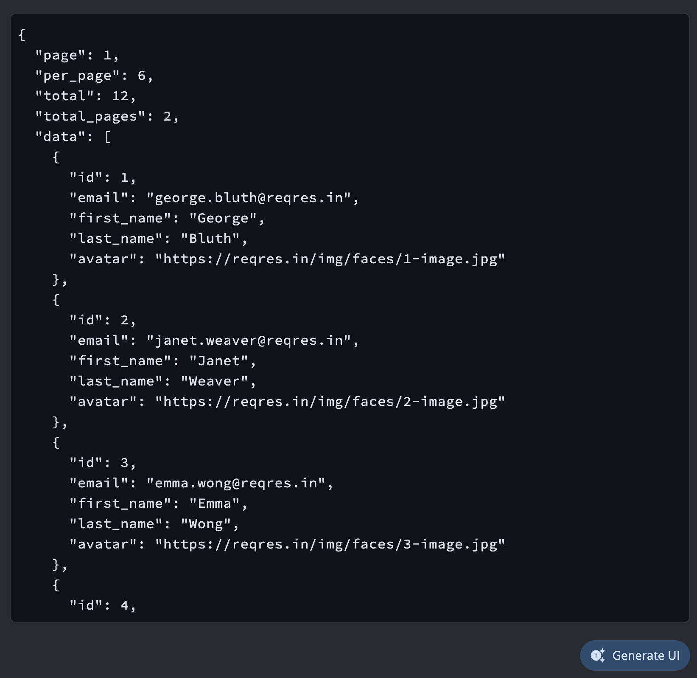

With the AI UI Designer, the response returned from the above API can be automatically converted into a Flutter widget. This widget is generated and rendered using the Server-Driven UI (SDUI) approach, powered by the [Stac](https://pub.dev/packages/stac) package.

This is what the generated component looks like:

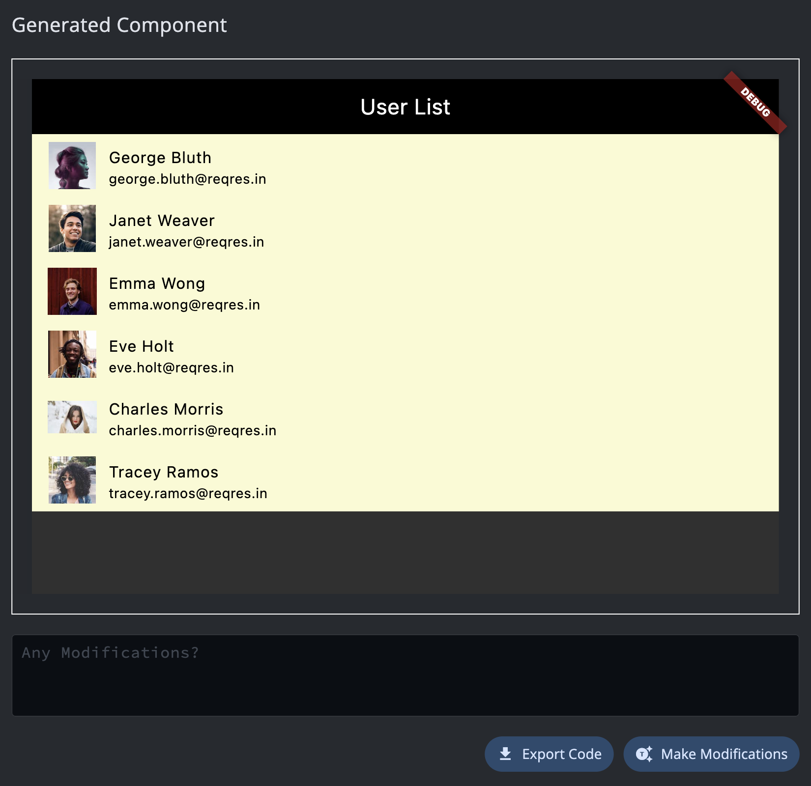

The prompts that were used to achieve this final result:

> 1. Use a ListTile based layout instead of cards and add uniform padding
> 2. Make the page background as light yellow and change the appbar's background color to black and foreground color to white

### Additional Examples of Generated UI Components

Here's the Entire Creation Flow

https://github.com/user-attachments/assets/a4074f28-2aaa-471a-b9bb-623d731b7515

#### Example 1
`GET` https://rickandmortyapi.com/api/character/[1,2,3,4,5,6,7]
```json
[
  {
    "id": 1,
    "name": "Rick Sanchez",
    "status": "Alive",
    "species": "Human",
    "type": "",
    "gender": "Male",
    "origin": {
      "name": "Earth (C-137)",
      "url": "https://rickandmortyapi.com/api/location/1"
    },
    "location": {
      "name": "Citadel of Ricks",
      "url": "https://rickandmortyapi.com/api/location/3"
    },
    "image": "https://rickandmortyapi.com/api/character/avatar/1.jpeg",
    "episode": [
      "https://rickandmortyapi.com/api/episode/1",
      "https://rickandmortyapi.com/api/episode/2",
      "https://rickandmortyapi.com/api/episode/3",
    ],
    "url": "https://rickandmortyapi.com/api/character/1",
    "created": "2017-11-04T18:48:46.250Z"
  },
  {
    "id": 2,
    "name": "Morty Smith",
    "status": "Alive",
    "species": "Human",
    "type": "",
    "gender": "Male",
    "origin": {
      "name": "unknown",
      "url": ""
    },
    "location": {
      "name": "Citadel of Ricks",
      "url": "https://rickandmortyapi.com/api/location/3"
    },
    "image": "https://rickandmortyapi.com/api/character/avatar/2.jpeg",
    "url": "https://rickandmortyapi.com/api/character/2",
    "created": "2017-11-04T18:50:21.651Z"
  },
  ...
]
```
The Generated Component Preview looks like 

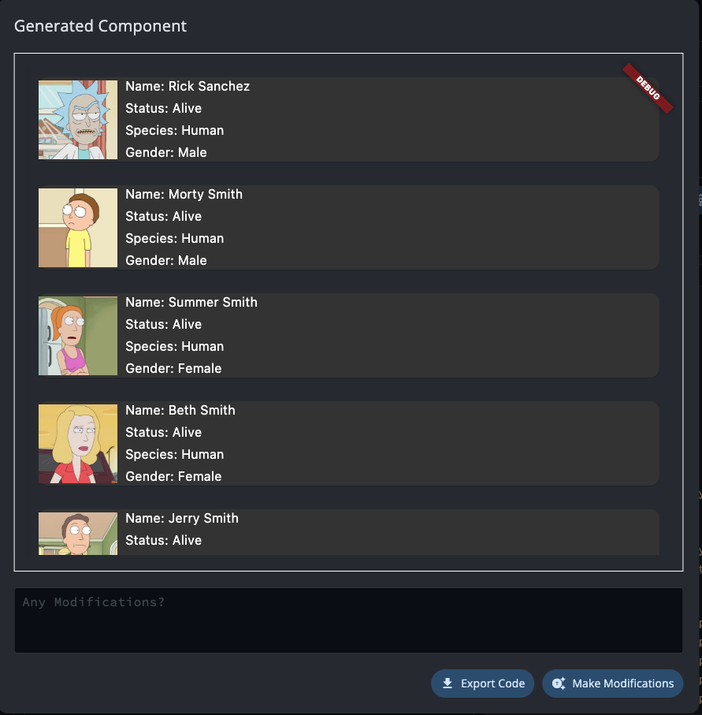


#### Example 2
`GET` https://api.nasa.gov/planetary/apod?date=&start_date=&end_date=&count=&thumbs
```json
{
  "copyright": "Marina Prol",
  "date": "2025-08-30",
  "explanation": "A young crescent moon can be hard to see. That's because when the Moon shows its crescent phase (young or old) it can never be far from the Sun in planet Earth's sky. But even though the sky is still bright, a slender sunlit lunar crescent is clearly visible in this early evening skyscape. The telephoto snapshot was captured on August 24, with the Moon very near the western horizon at sunset. Seen in a narrow crescent phase about 1.5 days old, the visible sunlit portion is a mere two percent of the surface of the Moon's familiar nearside. At the Canary Islands Space Centre, a steerable radio dish for communication with spacecraft is tilted in the direction of the two percent Moon. The sunset sky's pastel pinkish coloring is partly due to fine sand and dust from the Sahara Desert blown by the prevailing winds.",
  "hdurl": "https://apod.nasa.gov/apod/image/2508/IMG_4081.jpeg",
  "media_type": "image",
  "service_version": "v1",
  "title": "A Two Percent Moon",
  "url": "https://apod.nasa.gov/apod/image/2508/IMG_4081_1024.jpeg"
}
```
Generated UI:

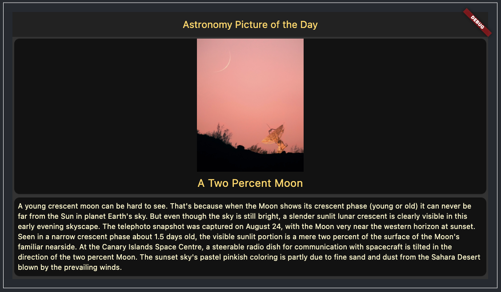

Modification Prompts:
```
- separate the single card layout into (image+title) in one card and
description in another card
- Resize the image to be 300x300 with a fit of "contain"
- implement dark theme in the whole page with the cards being darker
- app bar must be dark themed with yellow font colour
- the title "A Two Percent Moon" should be centered and yellow coloured
- description text can be light yellow coloured with decent padding
remove any copyright
```

Exported Flutter Code:
```dart
class SDUIWidget extends StatelessWidget {
  @override
  Widget build(BuildContext context) {
    return Scaffold(
      backgroundColor: const Color(0xFF333333),
      appBar: AppBar(
        backgroundColor: const Color(0xFF222222),
        title: const Text(
          "Astronomy Picture of the Day",
          style: TextStyle(
            color: Color(0xFFFFDA63),
          ),
        ),
      ),
      body: SingleChildScrollView(
        child: Column(
          mainAxisAlignment: MainAxisAlignment.start,
          crossAxisAlignment: CrossAxisAlignment.stretch,
          children: [
            Card(
              color: const Color(0xFF121212),
              child: Column(
                mainAxisAlignment: MainAxisAlignment.start,
                crossAxisAlignment: CrossAxisAlignment.stretch,
                children: [
                  Image.network(
                    "https://apod.nasa.gov/apod/image/2508/IMG_4081_1024.jpeg",
                    width: 300,
                    height: 300,
                    fit: BoxFit.contain,
                  ),
                  const Padding(
                    padding: EdgeInsets.fromLTRB(8, 8, 8, 8),
                    child: Text(
                      "A Two Percent Moon",
                      style: TextStyle(
                        color: Color(0xFFFFDA63),
                        fontSize: 24,
                      ),
                      textAlign: TextAlign.center,
                    ),
                  ),
                ],
              ),
            ),
            Card(
              color: const Color(0xFF121212),
              child: SingleChildScrollView(
                child: Column(
                  mainAxisAlignment: MainAxisAlignment.start,
                  crossAxisAlignment: CrossAxisAlignment.start,
                  children: [
                    const Padding(
                      padding: EdgeInsets.fromLTRB(8, 8, 8, 8),
                      child: Text(
                        "A young crescent moon can be hard to see. That's because when the Moon shows its crescent phase (young or old) it can never be far from the Sun in planet Earth's sky. But even though the sky is still bright, a slender sunlit lunar crescent is clearly visible in this early evening skyscape. The telephoto snapshot was captured on August 24, with the Moon very near the western horizon at sunset. Seen in a narrow crescent phase about 1.5 days old, the visible sunlit portion is a mere two percent of the surface of the Moon's familiar nearside. At the Canary Islands Space Centre, a steerable radio dish for communication with spacecraft is tilted in the direction of the two percent Moon. The sunset sky's pastel pinkish coloring is partly due to fine sand and dust from the Sahara Desert blown by the prevailing winds.",
                        style: TextStyle(
                          color: Color(0xFFFFFACD),
                          fontSize: 16,
                        ),
                      ),
                    ),
                  ],
                ),
              ),
            ),
          ],
        ),
      ),
    );
  }
}
```

Click here to view the [Complete Process Demo](https://youtu.be/QCW9Vt_PcYE)

#### Example 3
`GET`: https://api.postalpincode.in/pincode/560078
```json
[
  {
    "Message": "Number of pincode(s) found:4",
    "Status": "Success",
    "PostOffice": [
      {
        "Name": "J P Nagar",
        "Description": null,
        "BranchType": "Sub Post Office",
        "DeliveryStatus": "Delivery",
        "Circle": "Karnataka",
        "District": "Bangalore",
        "Division": "Bangalore South",
        "Region": "Bangalore HQ",
        "Block": "Bangalore South",
        "State": "Karnataka",
        "Country": "India",
        "Pincode": "560078"
      },
      {
        "Name": "JP Nagar III Phase",
        "Description": null,
        "BranchType": "Sub Post Office",
        "DeliveryStatus": "Non-Delivery",
        "Circle": "Karnataka",
        "District": "Bangalore",
        "Division": "Bangalore South",
        "Region": "Bangalore HQ",
        "Block": "Bangalore South",
        "State": "Karnataka",
        "Country": "India",
        "Pincode": "560078"
      },
      {
        "Name": "Kumaraswamy Layout",
        "Description": null,
        "BranchType": "Sub Post Office",
        "DeliveryStatus": "Non-Delivery",
        "Circle": "Karnataka",
        "District": "Bangalore",
        "Division": "Bangalore South",
        "Region": "Bangalore HQ",
        "Block": "Bangalore South",
        "State": "Karnataka",
        "Country": "India",
        "Pincode": "560078"
      },
      {
        "Name": "Yelachenahalli",
        "Description": null,
        "BranchType": "Sub Post Office",
        "DeliveryStatus": "Non-Delivery",
        "Circle": "Karnataka",
        "District": "Bangalore",
        "Division": "Bangalore South",
        "Region": "Bangalore HQ",
        "Block": "Bangalore South",
        "State": "Karnataka",
        "Country": "India",
        "Pincode": "560078"
      }
    ]
  }
]
```
Generated UI:

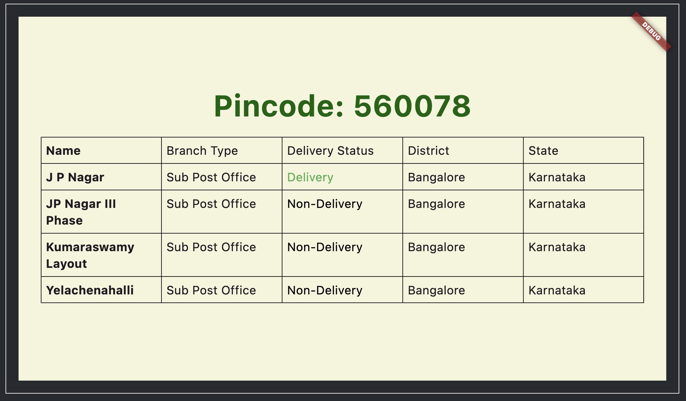

Modification Prompts Used:
```- remove any scrollviews
- use a Table for the data (name, branch type, delivery status, district, state only)
- add padding to each text element in table cells
- bold the names of the city areas except "Bangalore"
- make the font size 3x and dark green and bold
- add a right and left margin to table of 20px
- vertically center everything
- light green background
- bold the names of the areas except "Bangalore"
- increase the font size of table cell contents by 25%
```

Click here to view the [Complete Process Demo](https://youtu.be/T3-yp6ZHltA)

#### Example 4
`GET` https://dogapi.dog/api/v2/breeds
```json
{
  "data": [
    {
      "id": "667c7359-a739-4f2b-abb4-98867671e375",
      "type": "breed",
      "attributes": {
        "name": "Alaskan Klee Kai",
        "description": "The Alaskan Klee Kai is a small to medium-sized breed of dog that was developed in Alaska in the 1970s. It is an active and intelligent breed that is loyal and friendly. The Alaskan Klee Kai stands between 13-17 inches at the shoulder and has a double-coat that can come in various colors and patterns.",
        "life": {
          "max": 15,
          "min": 12
        },
        "male_weight": {
          "max": 7,
          "min": 6
        },
        "female_weight": {
          "max": 7,
          "min": 6
        },
        "hypoallergenic": false
      },
      "relationships": {
        "group": {
          "data": {
            "id": "8000793f-a1ae-4ec4-8d55-ef83f1f644e5",
            "type": "group"
          }
        }
      }
    },
   	...
  ],
  ...
}
```
Generated UI:

https://github.com/user-attachments/assets/5ac6794e-c92d-41f3-9e6e-4ffa544827b1

Modification Prompts Used:
```
- remove scrollview
- convert into 3x3 gridview with all children having childAspectRatio of 1.3
- make the elements in each card of grid view fit its entire card
and make background as dark theme
- Add some padding for each card and also change the background color of the cards to a random one between light yellow, light green, light blue, light purple and light red
- for each text item inside the cards, wrap it with its own card with slightly dark and transparent background color , let font colour be white
- dont separare the cards for the key and value, kep it together and add padding to the inner cards also
```

Exported Source Code: [Link](./codes/example4.dart)

Click here to view the [Complete Process Demo](https://youtu.be/ZXADJOCR9L8)

#### Example 5
`GET` https://emojihub.yurace.pro/api/search?q=dog
```json
[
  {
    "name": "dog face",
    "category": "animals and nature",
    "group": "animal mammal",
    "htmlCode": [
      "&#128054;"
    ],
    "unicode": [
      "U+1F436"
    ]
  },
  {
    "name": "dog",
    "category": "animals and nature",
    "group": "animal mammal",
    "htmlCode": [
      "&#128021;"
    ],
    "unicode": [
      "U+1F415"
    ]
  },
  {
    "name": "hot dog",
    "category": "food and drink",
    "group": "food prepared",
    "htmlCode": [
      "&#127789;"
    ],
    "unicode": [
      "U+1F32D"
    ]
  }
]
```
Generated UI:

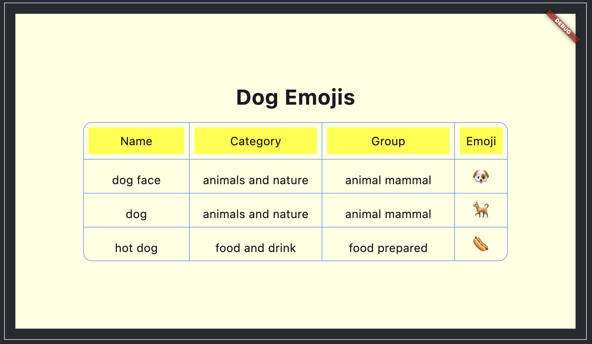


Exported Source Code: [Link](./codes/example5.dart)

Modification Prompts Used:
```
- remove the HTML code and convert the whole thing into a table with headers (name, Category, group, emoji). Also add a scaffold with light yellow background color & convert the unicode into EMOJIs
- increase the font size by 2.5x & put the table in the center horizontally and vertically
- let the table be bigger and not width constrained
- add padding for each table cell of 10px
- the shading added to the table header must be yellow color
- add a big size text boldened that says "Dog Emojis" Above the table, centered, spaced by 20px on the bottom
```

Click here to view the [Complete Process Demo](https://youtu.be/HBFjmSUHSxM)

---

## Complete Pull Request Report


| Feature | PR | Issue | Status | Comments |
|---|---|---|---|---|
|Proof of Concept & Proposal Doc|[#755](https://github.com/foss42/apidash/pull/755)||Merged||
|FIX: `<optimized out>` exception|[#780](https://github.com/foss42/apidash/pull/780)|[#782](https://github.com/foss42/apidash/issues/782)|Merged||
|AI Requests Feature Initial Implementation|[#850](https://github.com/foss42/apidash/pull/850)||Closed|multiple modifications suggested|
|AI Requests Feature Fine tuning|[#856](https://github.com/foss42/apidash/pull/856)||Closed|SSE and Separate Networking layer was deemed necessary before this PR|
|`better_networking` Package Creation|[#857](https://github.com/foss42/apidash/pull/857)||Merged|
`genai` package foundations|[#859](https://github.com/foss42/apidash/pull/859)||Closed|Mentor requested for a new PR after making some changes|
|SSE Feature Foundations|[#860](https://github.com/foss42/apidash/pull/860)||Closed|Mentor requested changes and rebase to main branch|
|SSE & Streaming Support|[#861](https://github.com/foss42/apidash/pull/861)|[#116](https://github.com/foss42/apidash/issues/116)|Merged||
|`genai` & AI Requests Feature|[#870](https://github.com/foss42/apidash/pull/870)|[#871](https://github.com/foss42/apidash/issues/871)|Merged||
|`genai` package: Testing|[#882](https://github.com/foss42/apidash/pull/882)||Merged||
Foundations: Agents & AI UI Designer + Tool Generation |[#874](https://github.com/foss42/apidash/pull/874)||Closed|Mentor requested to make a new PR that was based on top of main branch code|
|AI UI Designer & Tool Generator|[#880](https://github.com/foss42/apidash/pull/880)|[#617](https://github.com/foss42/apidash/issues/617), [#884](https://github.com/foss42/apidash/issues/884)|Merged||
|Final Report Documentation|[#878](https://github.com/foss42/apidash/pull/878)||Merged||
---

## Challenges Faced

#### Incomplete Responses after SSE implmentation
After migrating to SSE, API Dash was designed to first listen to a stream and return immediately if the content type wasn’t streaming-related. This worked fine until I discovered an edge case with very long responses: the HTTP protocol splits such responses into multiple packets. Because of the initial stream design, only the first packet was returned, resulting in incomplete outputs.
To fix this, I implemented a manual chunking mechanism where all incoming packets are collected until the stream ends, after which they are concatenated into the complete response. This resolved the issue and ensured correctness for long streaming outputs.

#### Component Rendering Dilemma
The core feature of the AI UI Designer is an in-app dynamic component renderer. Implementing this is challenging because Dart does not support full runtime reflection for Flutter widgets. In other words, a Flutter program cannot directly execute or render dynamically generated Flutter code at runtime.
I experimented with the available reflection mechanisms in Dart, but they are limited to the language itself and do not extend to Flutter’s widget tree. As a result, I was only able to render very basic elements such as Text widgets. Anything more complex was practically impossible to achieve with Dart’s restricted reflection capabilities.

Next, I considered using the Dart SDK to build the code into a Flutter Web app and display it to the user through a localhost iframe. However, this would require bundling the Dart SDK with the application, making it significantly heavier. Moreover, it would involve writing platform channel code for macOS, Windows, and other platforms, which would be highly impractical. 

Disappointed with these limitations, I devised a new approach: instead of attempting in-app rendering, I generated the Flutter code and sent it to an external service that could immediately build and deploy it as a Flutter web application, which could then be displayed within an iframe. I implemented this as a project called [FlutRun](https://github.com/synapsecode/AI_UI_designer_prototype) and successfully demonstrated it to the mentors.
As API Dash is a privacy-first API client that prohibits sending user requests to any external servers (with the exception of user specified AI API calls), even routing requests to our own servers is restricted which made this solution impractical to implement.

Lastly, after some research and discussions with my mentors, I was introduced to the concept of **Server-Driven User Interfaces (SDUI)**. The core idea is to represent UI as a parseable structure (such as JSON) and then dynamically render it using a rendering pipeline written in Flutter. This approach proved to be both practical and efficient. In fact, I came across the Stac package, which implemented this concept seamlessly, and that ultimately became the solution we adopted.

#### Lack of Error Handling in Stac 
Stac (the JSON-based representation of Flutter UIs) is opinionated and differs slightly from native Flutter code. As a result, when LLMs generate Stac code, they often produce small mistakes.

The challenge is that the Stac framework surfaces these mistakes only as console errors—they don’t bubble up as exceptions to the caller. I attempted to capture them using Flutter’s ErrorZones and similar mechanisms, but without success.

This limitation is significant because I wanted to implement a reset feature: if the LLM generates invalid Stac code, the app should be able to roll back to the last known good state. With the current design, this isn’t feasible. I even reached out to the Stac founders, who confirmed that proper error bubbling is planned but won’t be available anytime soon.

The only real workaround right now would be to fork Stac and patch it manually—something I’m still debating. For the time being, we’ve mitigated the issue by tuning the system prompt and restricting generations to a small, well-understood subset of Stac. This approach has been working decently so far.
  Have also discussed with the maintainer's of Stac regarding this issue:
  
  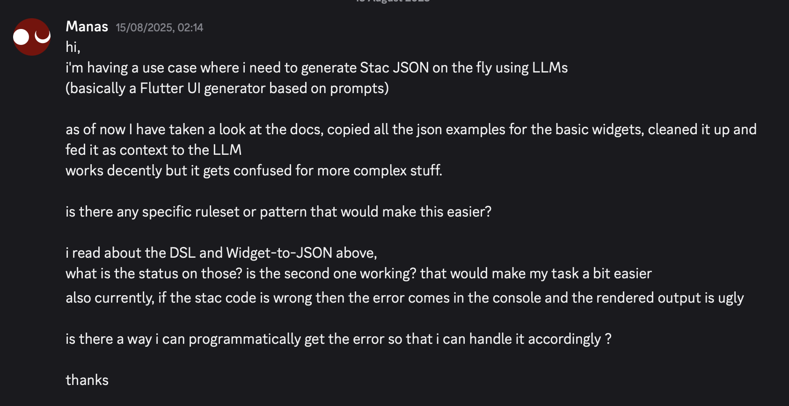
  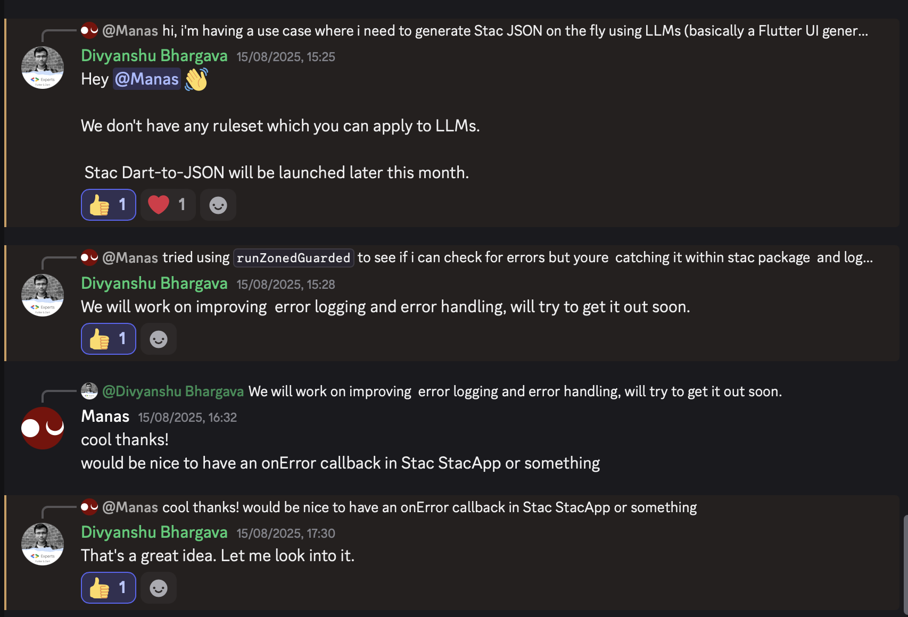

#### Stac Code Clipping
When the API response is highly complex, agents may generate a verbose UI specification. This can cause the resulting Stac JSON to become so large that it exceeds the LLM’s output context window, resulting in clipped (incomplete) JSON.
The problem is difficult to detect because Stac lacks proper error handling, so truncated JSON cannot be validated reliably. When this occurs, the system encounters an ugly visual crash.
Unlike plain text, JSON cannot be trivially streamed or concatenated in parts, since partial structures may break schema integrity. At present, this remains an open issue without a clean solution.

#### Limitations of Prompting
Because of the platform’s privacy-first design, we cannot send user response data to external models. As a result, we must rely entirely on system prompts to enable this feature.
Stac code is highly specialized, and while fine-tuning an existing Flutter-focused or JSON-focused model would have been an effective approach, this option is not permitted under our constraints. This creates a significant challenge, since system prompting alone has limited capacity before context loss begins to degrade output quality.
Our temporary solution is to restrict the feature to a smaller subset of Stac. However, a long-term solution will be necessary to overcome these limitations and support the full scope of functionality.

---

## Future Work
- **Error Handling in Stac**
Stac’s current error handling is limited, making debugging and reliability difficult. A future step would be to improve structured error messages and fallback behaviors for invalid or incomplete code paths.

- **Expanding Restricted Stac SDUI Widget Library**
At present, the Stac-driven UI generation supports only a subset of widget types. This restricts the richness of UIs generated from complex API responses. Future work can focus on extending the widget library to cover advanced layout controls, interactive inputs, and custom components. This expansion will allow the system to handle more nuanced use cases and generate production-grade UIs directly from structured data.

- **Integration Tests for AI Features**
Automated testing remains critical to ensure reliability and prevent regressions in AI-driven workflows. Integration tests will be built for tool generation and AI UI Designer

---

## Design and Prototypes Link
- [API Tool Generation Research Document ](https://docs.google.com/document/d/17wjzrJcE-HlSy3i3UdgQUEneCXXEKb-XNNiHSp-ECVg)
- [AI UI Designer prototype](https://github.com/synapsecode/AI_UI_designer_prototype)
- [FlutRun (My custom remote flutter component rendering service)](https://github.com/synapsecode/FlutRun)

---

## Conclusion
Google Summer of Code 2025 with API Dash has been a truly amazing experience. My work throughout this project centered on building the core infrastructure that will be the heart of API Dash's next-gen features, and I believe I have successfully laid a strong foundation. I look forward to seeing future contributors build upon it and take the project even further.

---
