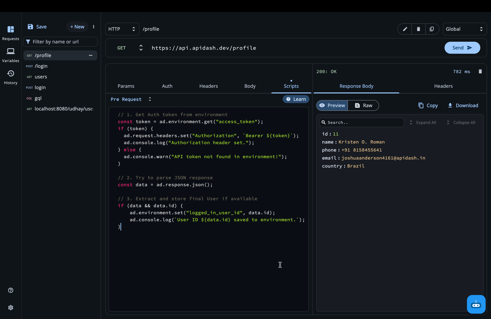
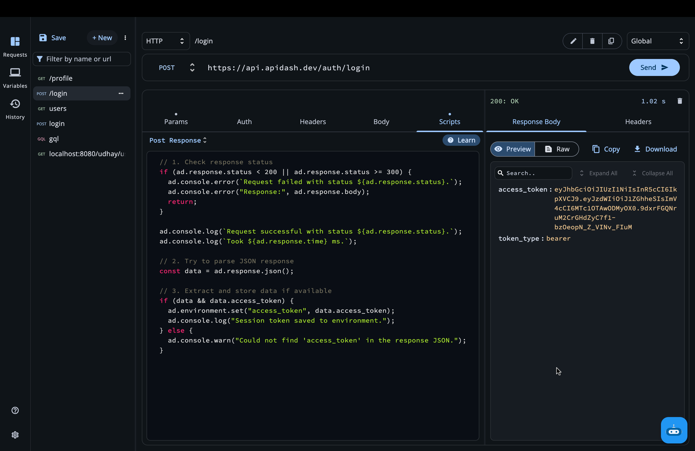
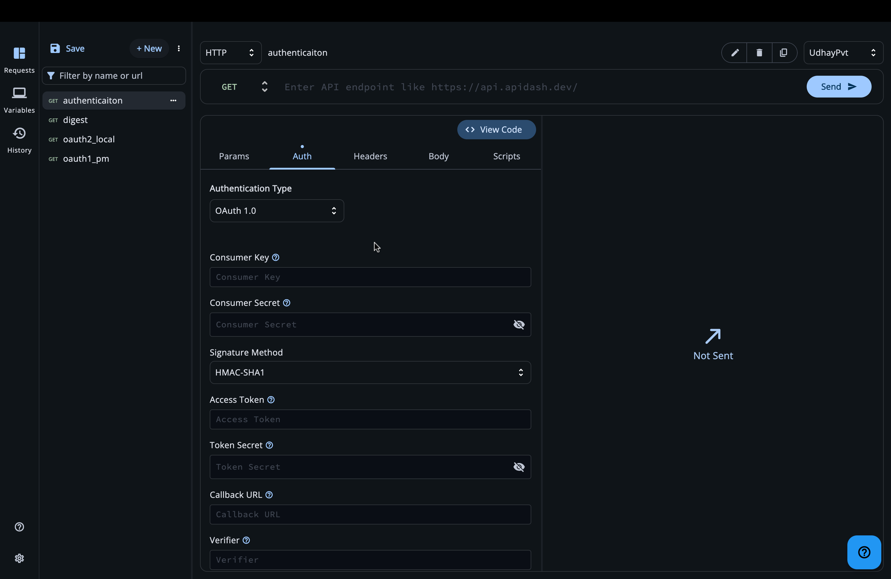
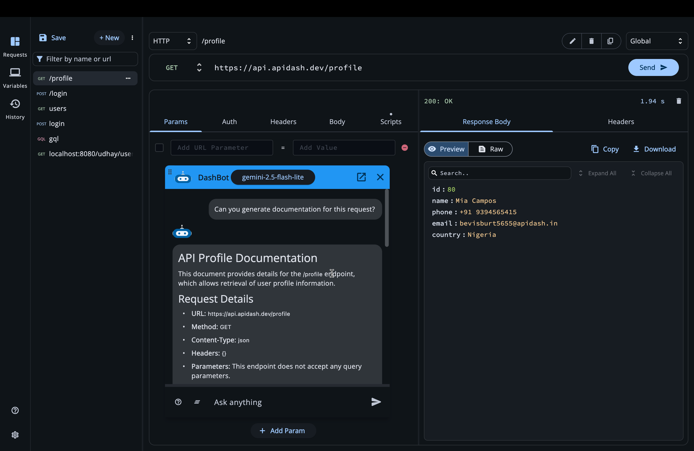
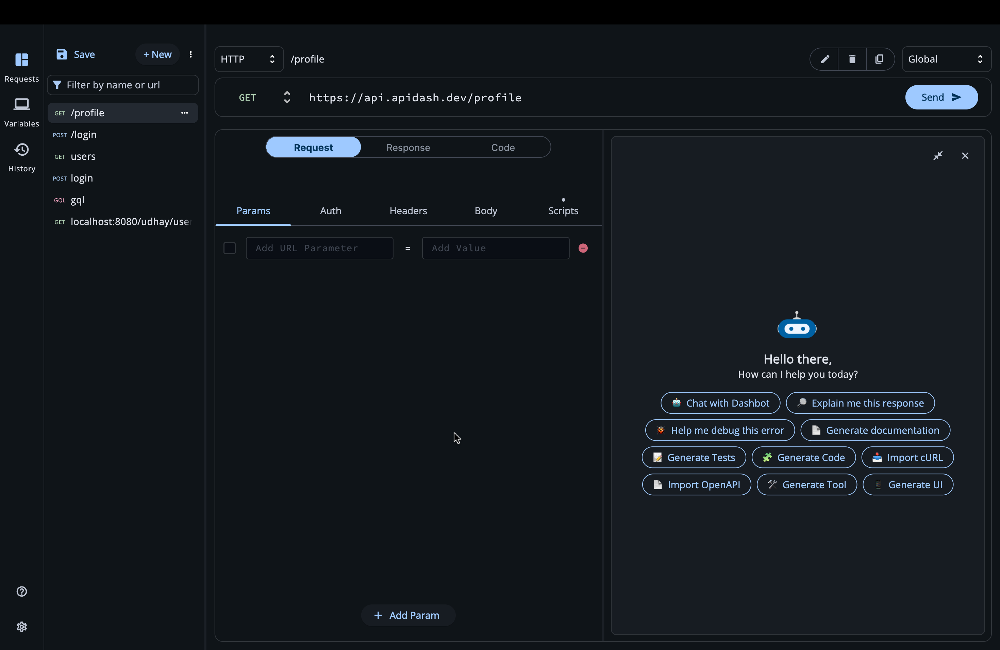
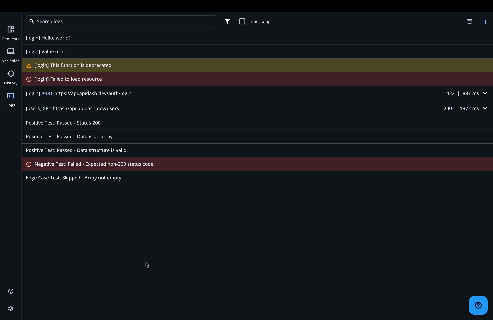
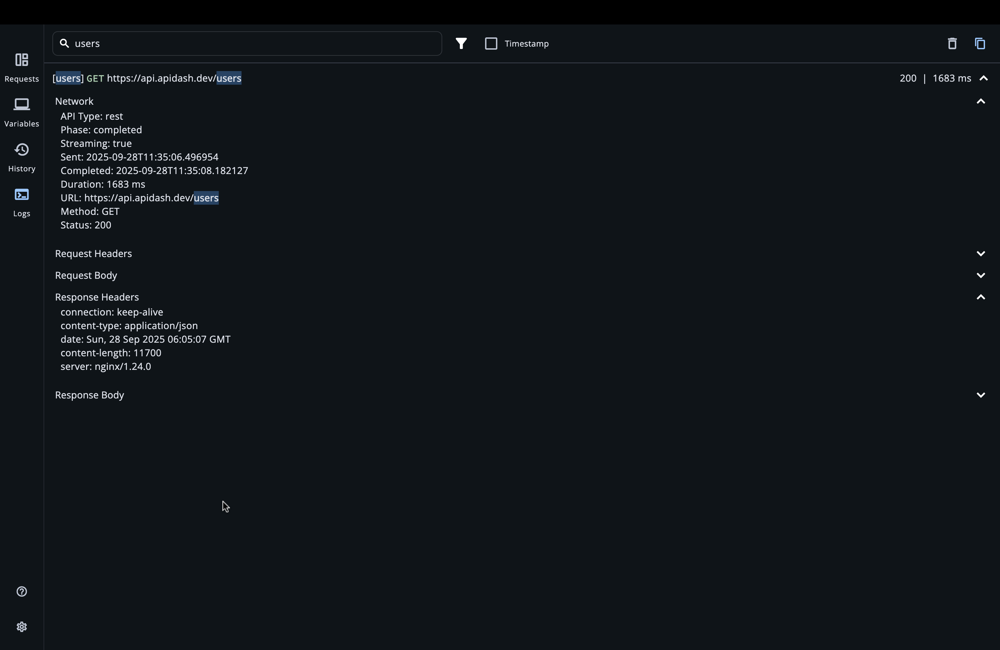

# GSoC'25 — API Dash: Dashbot and API Authentication

> Final report summarizing my contributions to API Dash as part of GSoC'25.

## Project Details

1. **Contributor** : Udhay Adithya J
2. **Mentors** : Ashita P, Ankit M, Ragul Raj M
3. **Organization** : API Dash
4. **Project** : Dashbot and API Authentication

#### Quick Links: 

- [GSoC Project Page](https://summerofcode.withgoogle.com/programs/2025/projects/1Yf6TmCm)
- [Code Repository](https://github.com/foss42/apidash)
- [Discussion Logs](https://github.com/foss42/apidash/discussions/851)

## Project Description
This project had two clear goals: build a solid foundation for everyday API work and add a helpful in‑app assistant (Dashbot). I focused first on the basics so later features would be stable instead of fragile.

Core pieces I added: authentication, scripting, OAuth, Dashbot, and logging. Each solves a common pain: setting up auth without hacks, automating request tweaks, handling real OAuth flows, getting guided help without leaving the app, and seeing what actually happened under the hood.

Authentication (Basic, API Key, Bearer, JWT, Digest) uses one shared model and a handler that adds the right headers or query params only when sending. It supports environment variables everywhere and saves values locally so people don’t keep re‑typing secrets.

Pre‑request and post‑response scripting gives a small JavaScript sandbox with a stable `ad` object to read or change the request, response, and environment. This lets users do things like dynamic tokens, timestamps, or chaining values from one response into the next.

OAuth 1.0 and 2.0 support covers the practical cases: signing existing OAuth 1.0 requests and the three common OAuth 2.0 grant types with caching and a desktop callback server. Clear [limitations](./../../dev_guide/oauth_authentication_limitations.md) explain what edge providers might not support.

Dashbot focuses on “structured help”: every answer is a detailed explanation plus optional actions (import cURL/OpenAPI, generate code or tests, modify the current request, explain a response).

The Logs tab pulls together script logs, system messages, and other events so users can quickly see what ran, what changed, and why something failed. It makes debugging faster.

## Authentication: Basic, API Key, Bearer, JWT, Digest

`Associated Pull Request`: [#855](https://github.com/foss42/apidash/pull/855), [#866](https://github.com/foss42/apidash/pull/866)

`Documentation`: [authentication.md](../../user_guide/authentication.md)

I started by adding the everyday authentication methods so that anyone using API Dash can set up their credentials without workarounds. Inside the request editor there is now an Authorization tab where you can choose the auth type and fill the required fields. Internally this work lives in the `better_networking` package so it can be reused across the app. I created a single model that holds all supported types and I wrote a handler that reads the selected type and adds the right headers or query params to the request at the time of sending. I also added environment variable support for every input so secrets can be managed in one place, and I used Hive to cache values so they persist across sessions. I wrote tests for these code paths and a user guide that explains everything in plain language.

The core model is `AuthModel` in `packages/better_networking/lib/models/auth/api_auth_model.dart`. It stores the selected `APIAuthType` and the data objects for each specific method. This lets the UI and the request layer work with a single source of truth. The handler `handleAuth` in `packages/better_networking/lib/utils/auth/handle_auth.dart` looks at the chosen type and updates the request right before sending. For,
- **Basic Auth**, it builds the base64 string and sets the Authorization header. 
- **Bearer Auth**, it sets `Authorization: Bearer <token>`. 
- **API Key Auth**, it either adds a header or a query parameter based on the user’s choice.
- **JWT Auth**, it generates a signed token based on the selected algorithm and places it in the header or the URL.
- **Digest Auth**, it supports both the direct mode where the realm and nonce are already known and the two‑step mode where API Dash sends one request, reads the server’s challenge from `WWW-Authenticate`, computes the response, and then adds the final Authorization header.

This feature has been designed in such a manner that users can adopt it without much learning curve. I also updated the UI to follow the API Dash design system so it feels consistent with the rest of the app. You can see the user guide [Authentication.md](./../../user_guide/authentication.md). It has simple explanations with images for each method.

Here is a small example that shows how the handler attaches a Bearer token to the headers. The handler reads the `AuthModel` and adds the correct `Authorization` header to the outgoing `HttpRequestModel`.

```
// packages/better_networking/lib/utils/auth/handle_auth.dart
case APIAuthType.bearer: {
	final bearerAuth = authData.bearer!;
	updatedHeaders.add(
		NameValueModel(
			name: 'Authorization',
			value: 'Bearer ${bearerAuth.token}',
		),
	);
	updatedHeaderEnabledList.add(true);
	break;
}
```

For JWT, the handler generates a signed token using the helper in `jwt_auth_utils.dart` and then puts it in the place you selected. If you choose header, the value is `Bearer <jwt>`. If you choose query, the key defaults to `token` unless you specify another one.

```
// packages/better_networking/lib/utils/auth/handle_auth.dart
case APIAuthType.jwt: {
	final jwtAuth = authData.jwt!;
	final jwtToken = generateJWT(jwtAuth);
	if (jwtAuth.addTokenTo == 'header') {
		final headerValue = jwtAuth.headerPrefix.isNotEmpty
				? '${jwtAuth.headerPrefix} $jwtToken'
				: jwtToken;
		updatedHeaders.add(NameValueModel(name: 'Authorization', value: headerValue));
		updatedHeaderEnabledList.add(true);
	} else if (jwtAuth.addTokenTo == 'query') {
		final paramKey = jwtAuth.queryParamKey.isNotEmpty ? jwtAuth.queryParamKey : 'token';
		updatedParams.add(NameValueModel(name: paramKey, value: jwtToken));
		updatedParamEnabledList.add(true);
	}
	break;
}
```

Digest support follows the standard flow. If the server already provided `realm` and `nonce` then API Dash computes the header directly. If not, API Dash sends one initial request, reads the `WWW-Authenticate` header, fills the missing fields, computes the hash, and then adds `Authorization: Digest ...` to the real request. The helper code for parsing and computing the header is in `packages/better_networking/lib/utils/auth/digest_auth_utils.dart`.

Environment variables are available in all auth fields. This means you can write something like `{{API_KEY}}` in the UI and API Dash will resolve it from the active environment before sending. Values are cached using Hive so you don’t need to retype them every time.

All this work is covered by tests and documented for users. I also created the first version of the Authentication user guide and kept it simple and visual so anyone can follow it.

<p align="center">
  
  <br>
  <em>Authentication Tab</em>
</p>

<p align="center">
  
  <br>
  <em>Authentication Methods</em>
</p>

## Pre‑request and Post‑response Scripting

`Associated Pull Request`: [#846](https://github.com/foss42/apidash/pull/846), [#865](https://github.com/foss42/apidash/pull/865)

`Documentation`: [scripting_user_guide.md](../../user_guide/scripting_user_guide.md)


I wanted API Dash to support scripting like other clients so people can prepare data before a request and verify or transform data after a response. We chose JavaScript because it is the common standard. We use a JS engine that runs natively in Flutter, and we give the script a simple `ad` object to work with so the script can read and change the request, access the response, and work with environment variables. The same approach works for REST and GraphQL.

The JS setup lives in `lib/utils/js_utils.dart` as a long template string named `kJSSetupScript`. Before running the user’s code we inject three JSON strings: one for the request, one for the response (only for post‑response), and one for the active environment. Inside the setup, we parse these into JS objects and build the `ad` helper. The helper exposes functions like `ad.request.headers.set(...)`, `ad.request.params.set(...)`, `ad.request.url.set(...)`, and similar helpers for environment. There is also `ad.console` that forwards console messages to the app so users can see logs.

On the Dart side I wrote `executePreRequestScript` and `executePostResponseScript` in `lib/services/flutter_js_service.dart`. These functions convert models to JSON, run the JS code along with the setup script, and parse the result back. For pre‑request the function returns a new `RequestModel` with the modified `HttpRequestModel`. For post‑response it can update the response and the environment. When there is no active environment selected, the function skips updates safely. This keeps the behavior predictable and simple for users.

Here is a short example that shows how a pre‑request script can set a header and a query parameter from environment values.

```dart
// user script (runs after kJSSetupScript)
const token = ad.environment.get('API_TOKEN');
if (token) {
	ad.request.headers.set('Authorization', `Bearer ${token}`);
}
const region = ad.environment.get('REGION');
if (region) {
	ad.request.params.set('region', region);
}
```

For post‑response scripts, the script can check status codes and write results back into the environment for later requests. The `ad.console` methods like `log`, `warn`, and `error` are forwarded to API Dash so users can see what happened. This was missing at first and it made debugging hard, so later I added a proper Logs tab in the app to show these messages clearly.

The scripting UI has its own tab in the request editor. It also supports GraphQL requests so the same scripting patterns work there too. While building this I evaluated code editors for Flutter. I tried `flutter_code_editor`, but it had visual issues with folding and scrolling when switching tabs with big scripts. I documented the problem in the discussion linked from the pull request. I may replace or fix this in the future to make long scripts smoother to edit.

<p align="center">
  
  <br>
  <em>Pre-request Script Tab</em>
</p>

<p align="center">
  
  <br>
  <em>Post-response Script Tab</em>
</p>

## OAuth 1.0 and OAuth 2.0

`Associated Pull Request`: [#867](https://github.com/foss42/apidash/pull/867)

`Documentation`: [authentication.md](../../user_guide/authentication.md)

After adding support for the first set of authentication methods, I worked on OAuth 1.0 and OAuth 2.0 authentication. This was new territory for me. I learned the flows step by step. OAuth 1.0 in API Dash focuses on signing requests with the values you provide. I followed the approach where we do not run a full three‑legged OAuth 1.0 flow inside the app, the user pastes the Access Token and Token Secret, so the feature is simple and reliable. The signing logic is in `packages/better_networking/lib/utils/auth/oauth1_utils.dart`, and the data model is in `packages/better_networking/lib/models/auth/auth_oauth1_model.dart`.

OAuth 2.0 was more challenging because the official `oauth2` Dart package follows the RFC strictly. Many providers are fine with that, but some legacy servers return token responses in non‑JSON formats or have other differences. Because of that, I wrote a small developer note at [oauth_authentication_limitations.md](../../dev_guide/oauth_authentication_limitations.md) to be clear about what works and what does not. API Dash sends `Accept: application/json` to token endpoints and expects JSON. On desktop we also need a free port between 8080 and 8090 for the temporary callback server. If all ports are used, the auth flow fails and the UI explains why.

I implemented the three common grant types: Authorization Code, Client Credentials, and Resource Owner Password. We cache credentials to a file so you don’t have to repeat the flow on every request. For desktop, we open your default browser and listen locally for the callback for a short time, then close the temporary server. For mobile, we use the standard in‑app flow. The helper code is in `packages/better_networking/lib/utils/auth/oauth2_utils.dart` and it uses a callback server from `packages/better_networking/lib/services/oauth_callback_server.dart`. The models are in `packages/better_networking/lib/models/auth/auth_oauth2_model.dart`.

Here is a short excerpt that shows how the Authorization Code grant adds the access token to the request after the flow completes. The handler appends `Authorization: Bearer <token>` to your request headers so you can send the request right away.

```dart
// packages/better_networking/lib/utils/auth/handle_auth.dart
case APIAuthType.oauth2: {
	// ... run the selected grant flow and get the client
	updatedHeaders.add(
		NameValueModel(
			name: 'Authorization',
			value: 'Bearer ${res.$1.credentials.accessToken}',
		),
	);
	updatedHeaderEnabledList.add(true);
	break;
}
```

If the provider returns a refresh token, the credentials file stores it so the client can refresh when needed. When a user wants to reset the session, deleting the credentials file clears the token state and the UI resets too. I also made sure the error messages are simple so people know exactly why a flow failed and what to try next.

<p align="center">
  
  <br>
  <em>OAuth 1.0</em>
</p>

<p align="center">
  
  <br>
  <em>OAuth 2.0</em>
</p>

## Dashbot: In‑app API Assistant

`Associated Pull Request`: [#887](https://github.com/foss42/apidash/pull/887), [#903](https://github.com/foss42/apidash/pull/903)

`Documentation`: [dashbot_user_guide.md](../../user_guide/dashbot_user_guide.md
)

Dashbot is the assistant layer I added so users could stay inside the client while doing the things that normally force them to copy/paste between tools: asking “why did this response look like that?”, importing a cURL snippet someone shared, pulling in an OpenAPI spec, generating tests, or quickly turning a request into runnable code. Instead of building another free‑form chat box, I designed it around the idea of “structured help”: every answer comes back as a short human explanation plus a list of clear actions the app can apply (or that you can ignore). This keeps the experience predictable—no mysterious side effects—and lets you move faster because repetitive edits (like adding headers or creating a new request from an import) become one click.

You can keep Dashbot docked as a normal tab or pop it out into a small floating panel that you can drag to the part of the screen that’s least distracting. It remembers its size and position while you work. Conversations are scoped to the request you have selected, so switching between requests feels like switching between focused “threads.” If no request is selected, you still have a global space for general API questions. Messages carry optional action buttons: apply imported cURL, create from OpenAPI, add a header the assistant suggested, insert generated tests into your post‑response script, pick a language for code generation, and so on.

The responses are strict JSON behind the scenes, but what matters for you is that if there’s nothing actionable you just see the explanation; if there is something actionable you see lightweight buttons under the assistant’s reply. Below is a simplified example of the structure the assistant returns (you never have to write this yourself):

```json
{
	"explanation": "Parsed the cURL command. It adds 2 headers and changes the body to JSON.",
	"actions": [
		{"action": "apply_curl", "target": "httpRequestModel", "field": "apply_to_selected", "value": {"method": "POST", "url": "https://api.example.com/users"}},
		{"action": "apply_curl", "target": "httpRequestModel", "field": "apply_to_new", "value": {"method": "POST", "url": "https://api.example.com/users"}}
	]
}
```

One of the most immediately useful flows is pasting a raw cURL command. A user can drop in a long multi‑line snippet and Dashbot parses the method, URL, headers, body, form data, and query parameters. It ignores things that are about transport or terminal behavior (redirect flags, silent/verbose, retry counts, output files) because those don’t belong inside a static request description. It then shows a concise diff between what was already selected and what the cURL contains—method changes, new headers, removed headers, body type changes, size differences—plus two actions: overwrite the current request or create a new one. You can inspect the explanation, choose an action, and you’re done. No manual re‑typing.

The OpenAPI flow feels similar. A user can paste an entire spec (JSON or YAML) or even just paste a URL to one. Dashbot parses it, summarizes the API (title, version, number of endpoints, methods present), highlights interesting routes like auth or health endpoints, and then offers to “import now.” From there you can pick operations and turn them into real requests in the collection. Behind the scenes it also tries to extract a stable base URL and turn that into an environment variable automatically, so the generated requests are environment‑friendly. The same environment extraction also happens for cURL imports so hostnames don’t get duplicated everywhere.

Code generation and test generation use the current request (and response if present) as context. If you just ask “generate code” it first offers a language list instead of guessing; if you mention a language directly (like “generate python code”) it goes straight to the result. Tests come back as snippets you can drop into your scripting layer so they run after a response. Documentation generation produces a structured description of the request and response that you can copy into internal docs or a README.

Reliability mattered while building this. If the assistant ever produces malformed data I simply show you the explanation and skip actions. If parsing a cURL or OpenAPI spec fails, you get a clear message why and what to try next (wrong quoting, invalid JSON/YAML, network failure, etc.). This defensive approach meant I could iterate on prompts and model behavior without risking accidental silent changes to your collection.

Here is a tiny extract of the “explain response” style the assistant is guided to follow—clear summary, focused bullets:

```text
Summary: The request succeeded (200) and returned a list of users.
- Status indicates a normal success path.
- Body contains an array; each item has id, email, role.
- No error fields detected; latency is normal.
- Consider caching if this endpoint is called frequently.
Next steps: paginate if the list grows; filter server‑side to reduce payload size.
```

And a quick illustration of the language selection flow for code generation:

```json
{
	"explanation": "Choose a language to generate client code.",
	"actions": [
		{"action": "show_languages", "target": "codegen", "value": ["JavaScript (fetch)", "Python (requests)", "Dart (http)", "Go (net/http)"]}
	]
}
```

Once I pick one, the follow‑up reply contains the code plus (when useful) a short note about required dependencies. Because every reply is structured, adding future abilities (like running a suggested retry automatically, or batching several changes) is a matter of teaching the assistant a new action name and wiring a small handler—no redesign needed.

Overall Dashbot now feels less like a chat experiment and more like a focused productivity surface: explain, debug, import, generate, adapt—always grounded in the exact request a user is looking at, always explicit about what can change, and always safe to ignore if only context is needed. It already saves users time daily and leaves clear room for future additions such as streaming output, richer operation pickers, or multi‑step guided fixes.

<p align="center">
  
  <br>
  <em>Dashbot Window</em>
</p>

<p align="center">
  
  <br>
  <em>Dashbot Tab</em>
</p>


## Logs Tab

`Associated Pull Request`: [#890](https://github.com/foss42/apidash/pull/890)

While building scripting and Dashbot, I realized users need a clear place to see what is happening behind the scenes. I designed a simple terminal‑style Logs tab that collects important messages in one view. It shows JavaScript console output from pre/post scripts, system messages from the JS runtime, and other app events in order. You can scan quickly, search by text, and focus on warnings or errors using filters. Colors make the severity easy to spot.

On the JavaScript side, the `ad.console` helper in the setup script forwards logs back to Dart using a small bridge. The calls below are part of `kJSSetupScript` in `lib/utils/js_utils.dart` and they send messages for info, warning, and error.

```dart
// lib/utils/js_utils.dart (inside kJSSetupScript)
console: {
	log: (...args) => {
		try { sendMessage('consoleLog', JSON.stringify(args)); } catch (_) {}
	},
	warn: (...args) => {
		try { sendMessage('consoleWarn', JSON.stringify(args)); } catch (_) {}
	},
	error: (...args) => {
		try { sendMessage('consoleError', JSON.stringify(args)); } catch (_) {}
	}
}
```

On the Dart side, I wired the JS bridge to receive these messages. The handler currently prints them and includes a note to route them into the in‑app terminal UI. This is in `lib/services/flutter_js_service.dart`.

```dart
// lib/services/flutter_js_service.dart
// TODO: These log statements can be printed in a custom api dash terminal.
void setupJsBridge() {
	jsRuntime.onMessage('consoleLog', (args) {
		// [JS LOG]: message
	});
	jsRuntime.onMessage('consoleWarn', (args) {
		// [JS WARN]: message
	});
	jsRuntime.onMessage('consoleError', (args) {
		// [JS ERROR]: message
	});
	jsRuntime.onMessage('fatalError', (args) {
		// [JS FATAL ERROR]: message, error, stack
	});
}
```

This design keeps the scripting API simple for users. You can call `ad.console.log(...)`, `ad.console.warn(...)`, or `ad.console.error(...)` in scripts and then open the Logs tab to see what happened, including any fatal errors with their stack traces from the JS engine. Internally, logs are captured centrally so the UI can show them in order, highlight severity, and allow quick filtering or clearing. This has already helped me and early users debug scripts and understand OAuth/token flows faster.

<p align="center">
  
  <br>
  <em>Logs Tab</em>
</p>

<p align="center">
  
  <br>
  <em>Logs Search</em>
</p>


## Challenges

#### Code Editor Stability Issues

Editor stability for long scripts. The code editor I tried had folding and scroll issues when working with large scripts. It looked broken and made editing hard. I minimized the folding features and documented the issue for a future fix or replacement. The scripting API remains stable regardless of the editor widget.

#### OAuth2 Callback URL

Reliably getting the authorization response (code / state / error) back into API Dash across desktop and mobile required multiple iterations. Initial attempts relied solely on an in‑app web view + custom scheme via `flutter_web_auth_2`; this worked on mobile but intermittently failed to deliver the redirect parameters on desktop. So, after discussing this issue with the mentors the final solution is a platform‑aware dual strategy:

1. Desktop (macOS / Windows / Linux): Start a lightweight ephemeral `OAuthCallbackServer` bound to the first free port in 8080–8090 and construct a redirect URL like `http://localhost:{port}/callback`. Open the provider authorization URL in the system browser (`open` / `xdg-open` / `rundll32`). When the provider redirects, the local server captures the full query string (authorization code, state, or error), responds with a small HTML page, and then can be stopped. This avoids dependence on custom URL scheme registration on desktop and satisfies providers that insist on HTTP(S) redirect URIs.
2. Mobile (Android / iOS): Use a custom deep link scheme `apidash://oauth2/callback`. 
Runtime selection logic chooses localhost server vs custom scheme based on `PlatformUtils.shouldUseLocalhostCallback`. If the localhost range is exhausted, a clear error explains that no free port was found. Distinct timeout (3‑minute) and cancellation messages differentiate user‑initiated cancellations (closing the tab) from connectivity issues. This hybrid approach produced consistent, debuggable behavior and simplified future maintenance.

#### Dashbot Actions

Designing a scalable, reliable action system for Dashbot was harder than just “have the model suggest buttons.” Early experiments let the model respond in free‑form text with sentences like “You can add a header X” or “Click here to import,” which left the app guessing: Is this actionable? Which part of the request does it touch? Should it overwrite or create? Even when we asked for JSON, the model would drift—renaming keys, nesting arrays differently, mixing prose inside the array, or outputting partial code before the closing brace. That made parsing brittle and limited how many action types we could safely introduce.

The turning point was enforcing a strict, minimal JSON envelope in the system prompts:

```json
{
	"explanation": "<plain concise human summary>",
	"actions": [ { /* zero or more strictly typed action objects */ } ]
}
```

Every action object must follow a controlled schema (conceptually):

```json
{
	"action": "apply_curl | apply_openapi | show_languages | add_header | update_header | delete_header | update_body | update_method | update_url | import_now_openapi | download_doc | add_test | code | other",
	"target": "httpRequestModel | codegen | test | attachment | doc | <future>",
	"field": "optional granular field identifier (e.g. header_name, body, method, select_operation)",
	"value": <JSON value whose shape depends on action>,
	"meta": { "optional auxiliary data" }
}
```

Key constraints baked into the prompt:
1. No markdown fences, no commentary outside the single root object.
2. Do not invent new top‑level keys.
3. Omit `actions` or make it an empty array if there is nothing actionable (never force a placeholder).
4. Keep `explanation` short, neutral, and free of ASCII art / emojis.
5. For lists (e.g. language picker) put the array under `value` of a single `show_languages` action.

On the client side the parser performs: (a) fast JSON parse, (b) basic structural validation (must have `explanation` string, `actions` array if present), (c) per‑action normalization mapping `action` + `target` (or `targetType`) to an internal `ChatActionType` enum. Unknown or malformed actions are silently dropped—only valid ones surface as buttons/widgets. This “accept strictly, degrade gracefully” strategy eliminated UI breakage when the model drifts slightly.


## Pull Requests Summary

| Feature | PR | Issue | Status | Comments |
|---|---|---|---|---|
|gsoc application for dashbot|[#722](https://github.com/foss42/apidash/pull/722)|[#621](https://github.com/foss42/apidash/issues/621)|Merged||
|Add pre-request and post-response scripting|[#846](https://github.com/foss42/apidash/pull/846)|[#557](https://github.com/foss42/apidash/issues/557)|Merged||
|Initial implementation of DashBot|[#854](https://github.com/foss42/apidash/pull/854)|[#621](https://github.com/foss42/apidash/issues/621)|Closed|Started working on authentication features|
|add basic authentication features|[#855](https://github.com/foss42/apidash/pull/855)|[#610](https://github.com/foss42/apidash/issues/610), [#611](https://github.com/foss42/apidash/issues/611), [#612](https://github.com/foss42/apidash/issues/612), [#613](https://github.com/foss42/apidash/issues/613), [#614](https://github.com/foss42/apidash/issues/614)|Merged||
|fix ui state not being consistent with the original request model|[#862](https://github.com/foss42/apidash/pull/862)||Merged||
|add oauth support|[#863](https://github.com/foss42/apidash/pull/863)||Closed|Mentor requested a rebase on top of main branch|
|add tests for pre-request scripts and post-response scripts|[#865](https://github.com/foss42/apidash/pull/865)||Merged||
|add env vars support for auth text fields|[#866](https://github.com/foss42/apidash/pull/866)||Merged||
|add oauth authentication support|[#867](https://github.com/foss42/apidash/pull/867)|[#615](https://github.com/foss42/apidash/issues/615), [#481](https://github.com/foss42/apidash/issues/481)|Merged||
|Dasbot UI|[#885](https://github.com/foss42/apidash/pull/885)||Closed|We decided to move dashbot inside apidash|
|core functionalities of dashbot|[#887](https://github.com/foss42/apidash/pull/887)|[#121](https://github.com/foss42/apidash/issues/121), [#620](https://github.com/foss42/apidash/issues/620), [#621](https://github.com/foss42/apidash/issues/621)|Merged||
|in app terminal logger|[#890](https://github.com/foss42/apidash/pull/890)|[#905](https://github.com/foss42/apidash/pull/905)|Merged||
|add dashbot user guide doc|[#903](https://github.com/foss42/apidash/pull/903)||Merged|||
|GSoC 25 Report: Udhay Adithya|[#904](https://github.com/foss42/apidash/pull/904)||Merged||

## Future Work

- **Add persistent Dashbot chat history with save + export capabilities** Right now Dashbot conversations exist only in memory for the current run. A future milestone is to persist sessions (per request and global) across restarts and allow users to export chats (e.g., JSON for automation, Markdown/plain text for documentation or sharing).

---

## Research Links

- [OAuth 2.0 Redirect URI Handling](https://gist.github.com/Udhay-Adithya/f7c3174e4e1c7799ee5016974e996e67)
- [Authentication Data Format](https://gist.github.com/Udhay-Adithya/ae09c2e9e306f0ce877d452999bb1789)
- [Authentication Schema](https://gist.github.com/Udhay-Adithya/3215d0ac511a0893d901eb58c6aab059)
- [Pre/Post Request Scripting](https://gist.github.com/Udhay-Adithya/da7a0282e9e1ef66c1d4a3f0f22ab840)
---

## Conclusion

Google Summer of Code 2025 with API Dash has been an absolutely transformative journey. I'm incredibly proud that I was able to build a strong foundation for API Dash by implementing various core features that will serve as the heart of the application for all upcoming developments. The authentication system, scripting capabilities, OAuth implementation, Dashbot, and logging infrastructure I've built will enable countless future features and improvements.

This experience has been far more than just writing code—it's been a journey of tremendous personal and professional growth. I learned the importance of being consistent every single day, showing up with dedication and focus. More importantly, I developed a deep appreciation for code quality and attention to detail, understanding that every line of code I write is going to be shipped into production and used by real developers around the world. This responsibility taught me to think more carefully, test more thoroughly, and document more clearly.

Coming from a background of working solo on personal projects, this opportunity also introduced me to the invaluable experience of teamwork and collaboration. I learned the art of patience when waiting for code reviews, the importance of clear communication when discussing technical decisions, and how to work effectively with mentors and the broader community. These soft skills—teamwork, patience, and communication—have been just as transformative as the technical knowledge I gained. This is truly what made me a better person overall, not just a better developer.

I'm truly grateful for getting this incredible opportunity to contribute to such an amazing project. Most of all, I want to extend my heartfelt thanks to my wonderful, amazing and caring, mentors— Ashita P, Ankit M, and Ragul Raj M. Your guidance, patience, and support made this entire journey possible. You created an environment where I could learn, experiment, fail, and succeed, all while feeling supported every step of the way.

Looking ahead, I'm excited to see how future contributors will build upon this foundation and take API Dash to new heights.

## 2026 GSoC Extension
- Updated from 2025 proposal
- ML model integration notes
