# GSoC'26 Final Report - API Dash as an MCP Server: Agentic Testing and GenUI Visualizations

> Final report summarizing my contributions to API Dash as part of GSoC'26.

## Project Details

1. **Contributor:** Abdelrahman El-Borgy
2. **Mentors:** Ashita P., Ankit M., Manas Hejmadi
3. **Organization:** API Dash
4. **Project:** API Dash as an MCP Server: Agentic Testing and GenUI Visualizations

#### Quick Links: 
* [GSoC Project Page](https://summerofcode.withgoogle.com/programs/2026/projects/RQmFSAnm)
* [Code Repository](https://github.com/foss42/apidash)
* [NPM Package: `apidash-mcp`](https://www.npmjs.com/package/apidash-mcp)

---

## Project Description

This project focused on bridging the gap between artificial intelligence and API testing by building the official **Model Context Protocol (MCP)** server for API Dash, alongside a native **In-App Agentic Testing Console**. 

Previously, utilizing AI for API debugging required constant context switching: copying payloads, pasting them into a chat window, asking the LLM for help, and copying the fixed payload back to your testing client. 

To solve this, I authored and published the `apidash-mcp` package. This server acts as a seamless background bridge between external AI assistants (like VS Code Copilot, Claude, Roo Code, or Cline) and the native API Dash Flutter engine. Furthermore, I engineered a native Agentic Testing Dashboard directly within the API Dash app itself. 

This dual-approach lays the foundation for true "Agentic API Testing." Whether you are working from your IDE via the MCP server or natively inside the API Dash app, AI can now autonomously draft HTTP requests, read OpenAPI specifications, execute them through your local machine, and visually render the results in a clean, Material 3 interface.

---

## Features

The project is divided into two core experiences: the external MCP Server integration and the native In-App Agentic Testing Co-Pilot.

### Part 1: MCP Server & SPA Workbench

#### 1. Prompt-Driven HTTP Requests
You can send HTTP requests purely through natural language prompts. The results are immediately displayed in the SPA workbench instead of a raw text terminal.
<p align="center">
  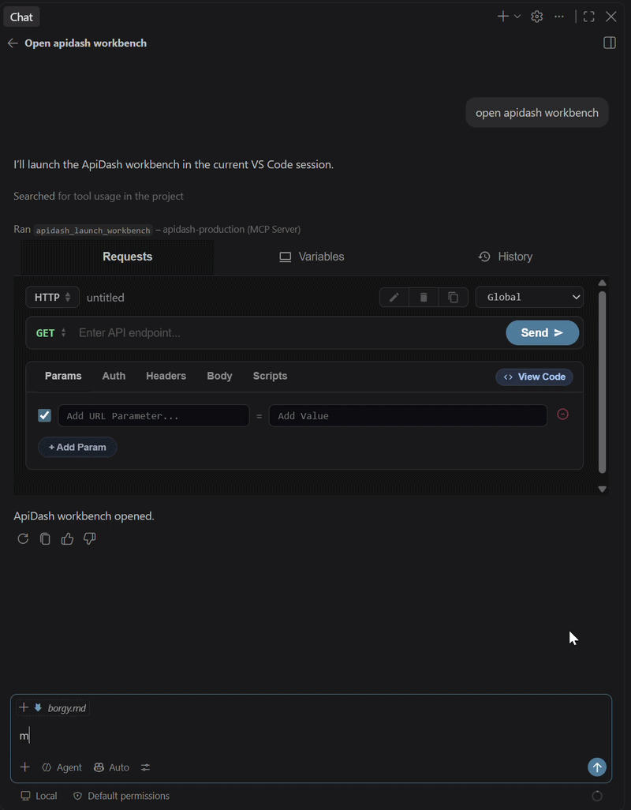
  <br>
  <em>Drafting and executing a POST request via prompt</em>
</p>

#### 2. Interactive SPA Workbench
You are not restricted to just chat. You can modify request details directly within the MCP app SPA workbench UI and resend it without typing a new prompt to the LLM.
<p align="center">
  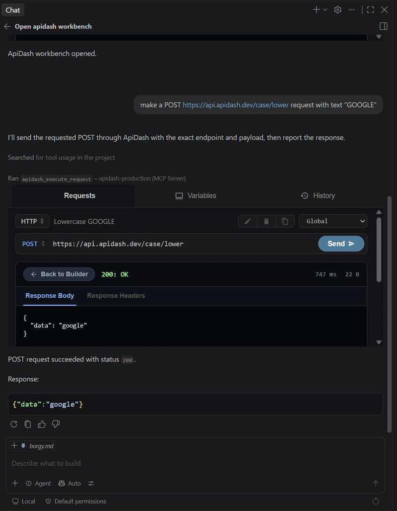
  <br>
  <em>Modifying request parameters and resending directly via the UI</em>
</p>

#### 3. Request Management
Keep your workspace organized. You can easily name, edit, and copy your API requests directly within the interface for quick reuse.
<p align="center">
  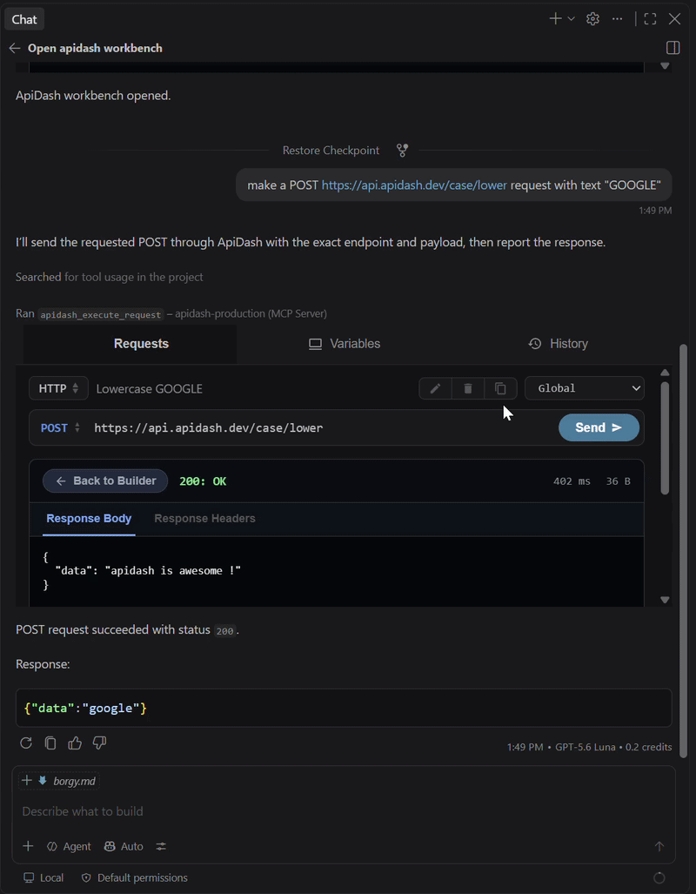
  <br>
  <em>Renaming, duplicating, and clearing requests to organize the workspace</em>
</p>

#### 4. Agentic Auto-Fix for Failed Requests
If you encounter a failed request, you can ask the LLM what went wrong directly. The LLM will diagnose the issue, autonomously fix the request parameters, resend it, and display the successful result. 
<p align="center">
  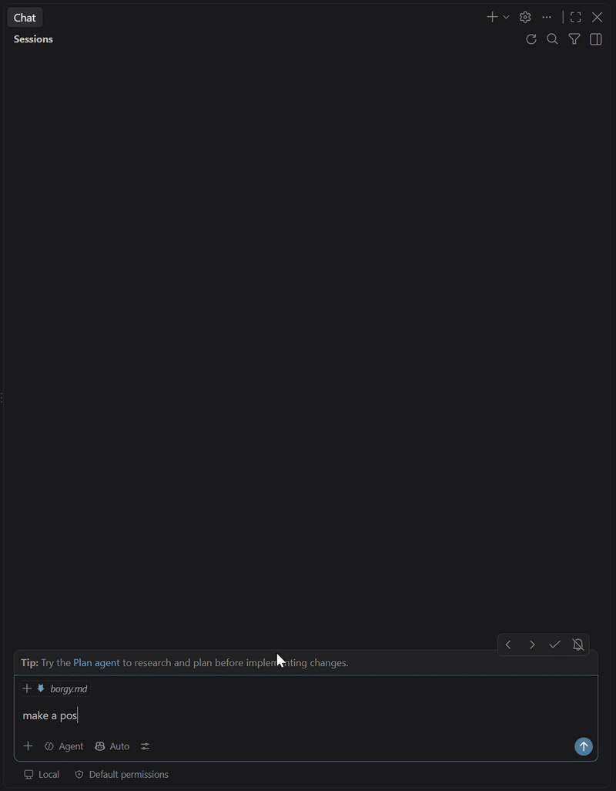
  <br>
  <em>The LLM autonomously diagnosing and resolving a 4xx/5xx faulted request</em>
</p>

#### 5. Persistent Request History
Never lose a test. All your requests are automatically saved in a dedicated History tab, powered by a local Hive database, allowing you to get back to past executions whenever you need them.
<p align="center">
  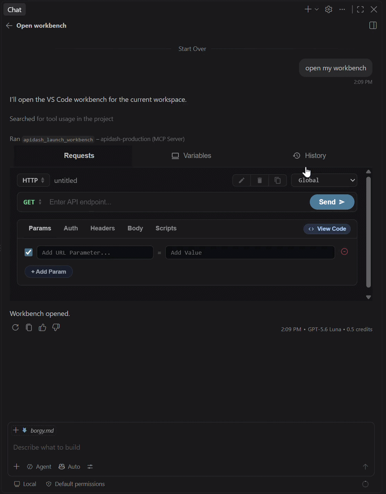
  <br>
  <em>Browsing the local Hive-powered execution history ledger</em>
</p>

#### 6. Intent-Based Navigation
The MCP server understands UI navigation intents. Providing a direct prompt like *"show my history"* tells the LLM to redirect you to the intended tab of the SPA automatically.
<p align="center">
  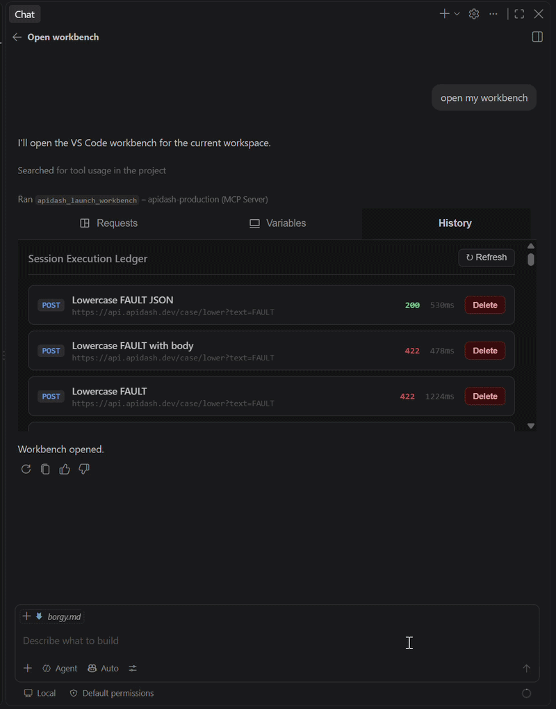
  <br>
  <em>Directing the SPA UI tabs via conversational user intents</em>
</p>

#### 7. Environment Variables Configuration
A dedicated Variables tab lets you set up new environments and securely manage your environment variables right from the workbench.
<p align="center">
  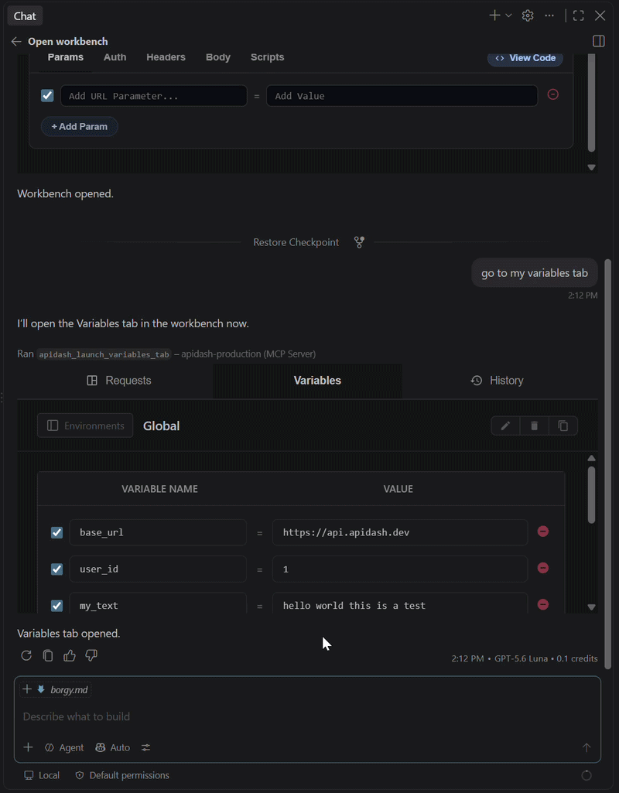
  <br>
  <em>Executing requests utilizing securely configured environment variables</em>
</p>

#### 8. Advanced Environment Controls
Seamlessly edit, delete, and duplicate your environments to quickly switch between local, staging, and production setups during your testing sessions.
<p align="center">
  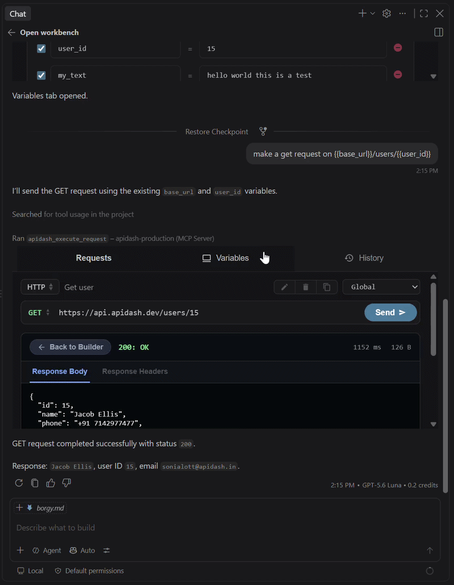
  <br>
  <em>Managing and swapping between local, staging, and production environments</em>
</p>

---

### Part 2: Native In-App Agentic Testing Console

#### 1. Instant AI & Target Configuration
Easily configure your Gemini API key and target API URL directly within the clean, Riverpod-powered dashboard. The interface is designed for rapid setup, ensuring you can start generating tests securely and immediately.
<p align="center">
  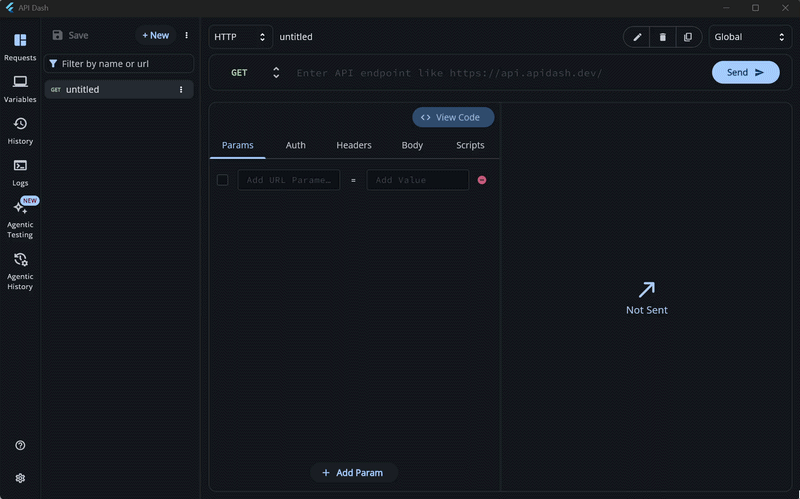
  <br>
  <em>Setting up Gemini API credentials and target endpoint URL</em>
</p>

#### 2. Prompt-Driven Test Suite Generation
Write your testing goal in a natural prompt format. The AI Co-Pilot automatically fetches your target's OpenAPI specifications (`openapi.json` or `swagger.json`), combining them with your workspace variables to generate a complete, chained testing suite plan.
<p align="center">
  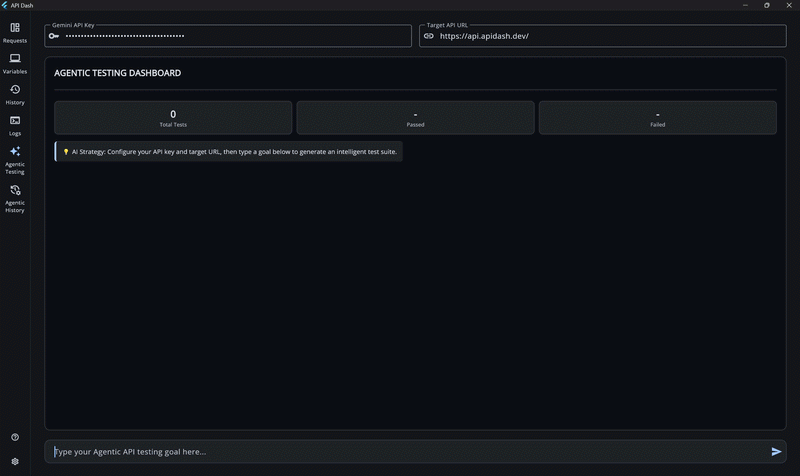
  <br>
  <em>Generating a full, OpenAPI-contextualized test plan from a single prompt</em>
</p>

#### 3. One-Click Suite Execution & Dashboard Summary
Once the test plan is generated, a single click on "Run Tests" executes the entire chained sequence natively. A live dashboard summary instantly calculates passes, fails, and totals, while heavily optimized background isolates prevent any UI thread stutter during execution.
<p align="center">
  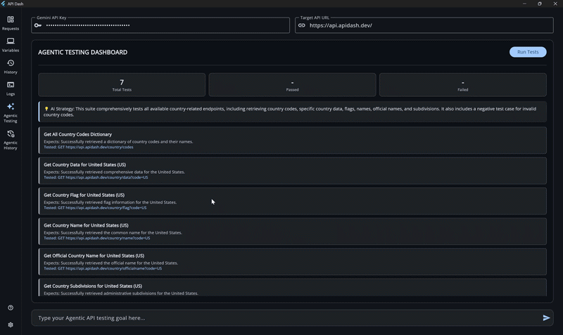
  <br>
  <em>Executing the generated suite with native performance and live statistical summaries</em>
</p>

#### 4. Request Inspection & Workspace Duplication
Click on any generated test card to preview its exact parameters, payloads, and response headers. From this detailed view, you can duplicate the AI-generated request directly into your main Requests tab for manual modification and deeper inspection.
<p align="center">
  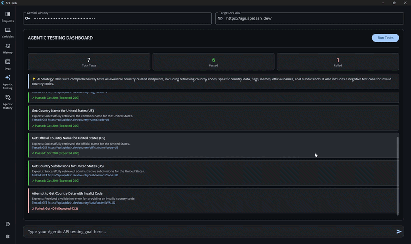
  <br>
  <em>Previewing an agentic request and copying it to the main workspace</em>
</p>

#### 5. Dedicated Agentic History & Seamless Navigation
Agentic executions are saved to a separate, dedicated Hive database (`internal_agent_history`) using batched writes to maximize performance.

The Agentic History sidebar groups these historical requests by their AI-generated Suite Name, keeping your normal testing history completely clutter-free. 

Furthermore, you enjoy full control and smooth navigation through your past agentic executions. The history pane integrates seamlessly with API Dash's native widgets, providing out-of-the-box syntax highlighting, raw/preview tabs, and fluid data retrieval.

<p align="center">
  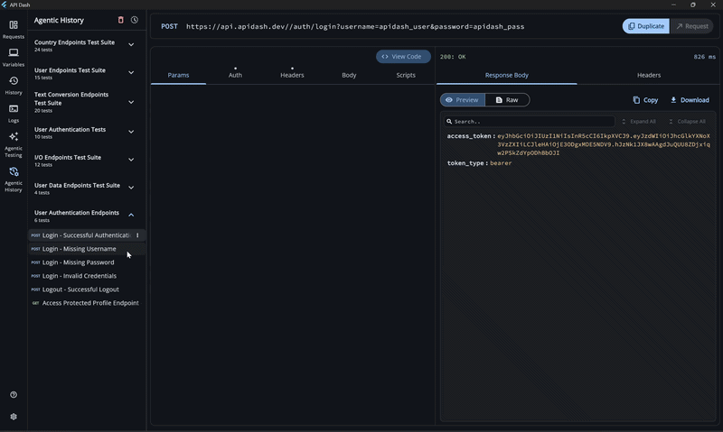
  <br>
  <em>Viewing test executions neatly grouped by Suite Name in the dedicated history pane</em>
</p>
---

## How to Setup the MCP Environment (Part 1 Only)

Because the external MCP server (Part 1) communicates directly with the native API Dash Flutter engine, setup requires the native application to be installed and discoverable by your system. 

*(Note: The Native In-App Agentic Testing Console from Part 2 requires no external setup—it works entirely within the API Dash application).*

### Prerequisites
* **Node.js:** (v18 or higher) with `npx` installed.
* **API Dash Desktop App:** The latest native application must be installed on your machine.
* **MCP Client:** An AI assistant (e.g., VS Code Copilot, Roo Code, goose).

### Step 1: Configure the API Dash Path
The server needs to know where your `apidash` executable is located. You can configure this in one of two ways:

**Option A: Add to System PATH (Recommended)**

If API Dash is in your global system PATH, the server finds it **automatically**.
* **Windows:** Add the folder containing `apidash.exe` to your System/User `Path` via Environment Variables.
* **macOS/Linux:** Add `export PATH="$PATH:/path/to/apidash_folder"` to your `~/.zshrc` or `~/.bashrc`.

**Option B: Configure via `APIDASH_PATH`**
If you prefer not to modify your system PATH, you can pass the exact executable path inside your AI client's MCP configuration JSON in the next step.

### Step 2: Client Configuration (VS Code Example)
Add the server to your client's configuration file (e.g., `mcp.json`). 

* If you used **Option A**, omit the `"env"` block:
```json
{
  "servers": {
    "apidash": {
      "command": "npx",
      "args": [
        "-y",
        "apidash-mcp@latest"
      ]
    }
  }
}
```

*(Note: On Windows, remember to escape backslashes `\\` in the path).*

**The GUI Setup Alternative:**
If you prefer not to edit JSON files manually, most modern AI clients in VS Code offer a user interface to configure tools:
1. Open your AI extension's side panel.
2. Navigate to the **Tools** or **MCP Servers** section and click **Add New MCP Server**.
3. Enter `npx` as the command and `-y apidash-mcp@latest` as the arguments. Save the configuration.

### Step 3: Restart and Test
Restart your AI client to spin up the bridge. You can now prompt it: *"Use API Dash to send a GET request to https://api.publicapis.org/entries and summarize the results."*

---

## Pull Requests Summary

| Feature | PR | Status | Comments |
|---|---|---|---|
| Initial MCP Server setup & NPM package scaffolding | [#1700](https://github.com/foss42/apidash/pull/1700) | Closed | Updated PR - [#1737](https://github.com/foss42/apidash/pull/1737) |
| Implementation of Agentic API Testing tools | [#1711](https://github.com/foss42/apidash/pull/1711) | Closed | Updated PR - [#1737](https://github.com/foss42/apidash/pull/1737) |
| SPA Workbench integration for visual data rendering | [#1720](https://github.com/foss42/apidash/pull/1720) | Closed | Updated PR - [#1737](https://github.com/foss42/apidash/pull/1737) |
| Resolve a RenderFlex overflow in AI dialog on Android | [#1329](https://github.com/foss42/apidash/pull/1329) | Merged | Merged during the GSoC coding period. |
| Enable streaming responses in dashbot | [#1344](https://github.com/foss42/apidash/pull/1344) | Under Review | Currently under review. |
| NPM package release | [#82](https://github.com/foss42/poc-experiments/pull/82) | Merged | Added npm package source code files into the POC repository. |
| MCP server & MCP App final code release with documentation. | [#1737](https://github.com/foss42/apidash/pull/1737) | Under Review | Finalized the NPM publish pipeline and user guides. |
| In-App Agentic Testing Co-Pilot & History Integration | [#1783](https://github.com/foss42/apidash/pull/1783) | Under Review | Built a native, Riverpod-powered Agentic Testing dashboard utilizing the Gemini API for OpenAPI contextualization and chained test suite generation. |

---

## Technical Blog

During the coding period, I published a midterm progress blog detailing the initial development phases of the `apidash-mcp` server. It covers the architectural decisions made when building the foundation and adding the SPA MCP app to enhance testing workflows. You can read the full article here: [Midterm Progress: Building API Dash MCP Server](https://dev.to/foss42/building-api-dash-mcp-server-adding-spa-mcp-app-10b4).

---

## Future Work

* **Multi-LLM Strategy Pattern:** With the In-App Agentic Testing Co-Pilot successfully running chained endpoint testing via Gemini, the next step is to implement a provider Strategy Pattern. This will allow developers to swap seamlessly between Google Gemini, OpenAI, or local models like Ollama without modifying the core execution architecture.

---

## Conclusion

Google Summer of Code 2026 with API Dash has been an incredibly rewarding journey. Building the `apidash-mcp` package and the native Agentic Testing Console challenged me to think beyond traditional user interfaces and dive deep into the emerging world of Agentic AI and clean architecture. I am proud to have built a tool suite that empowers developers to integrate API Dash seamlessly into both their IDE AI workflows and native desktop experiences.

This experience taught me the rigor required to publish public packages, the importance of robust state management (Riverpod), and how to optimize heavy Flutter workloads using isolates. Collaborating with my mentors and the API Dash community has vastly improved my technical communication and architectural decision-making. 

I am deeply grateful to Ashita P, Ankit M, and Ragul Raj M for their constant support, code reviews, and mentorship. I look forward to continuing my contributions to open source and seeing how the community leverages these new agentic capabilities.
