# GSoC '26 Final Report — WebSocket, MQTT & gRPC Support + CLI for API Dash

> Final report summarizing my contributions to API Dash during GSoC '26 — turning it from a REST client into a multi-protocol one, and bringing it to the terminal.

## Project Details

1. **Contributor:** Nikhil Ludder ([@badnikhil](https://github.com/badnikhil))
2. **Mentors:** Ashita Prasad, Ankit Mahato, Ragul Raj M
3. **Organization:** [API Dash](https://apidash.dev) (foss42)
4. **Project:** WebSocket, MQTT & gRPC protocol support + a cross-platform CLI

#### Quick Links

* **GSoC Project Page:** [summerofcode.withgoogle.com/programs/2026/projects/8mOJR8XY](https://summerofcode.withgoogle.com/programs/2026/projects/8mOJR8XY)
* **Proposal:** [WebSocket, MQTT, gRPC and CLI](../../proposals/2026/gsoc/application_Nikhil_mqtt-websockets-grpc.md)
* **Pull Requests:** [my apidash PRs](https://github.com/foss42/apidash/pulls/badnikhil) · [my api PRs](https://github.com/foss42/api/pulls/badnikhil) — full list in the [Pull Requests](#pull-requests) section

---

## Project Description

API Dash started life as a REST/GraphQL API client. My GSoC project extends it into a genuinely **multi-protocol** client — adding **WebSocket**, **MQTT**, and **gRPC** as first-class request types — and then takes API Dash beyond the desktop window with a **pure-Dart command-line interface** and an interactive **TUI**.

Every new protocol is integrated into API Dash's existing architecture — **Riverpod** for state, **Hive** for persistence, and the shared `apidash_design_system` widgets for a consistent UI — so a WebSocket, MQTT, or gRPC request behaves, saves, and looks like any other request in the app. Requests are executed through the app's own networking engine (`better_networking`), which meant the CLI could reuse that *same* engine and share the desktop's workspace, guaranteeing the terminal and the GUI behave identically.

The work spans **two repositories**:

* **[foss42/apidash](https://github.com/foss42/apidash)** — the Flutter client: the three protocols, the CLI + TUI, the supporting pure-Dart refactor, and end-user documentation.
* **[foss42/api](https://github.com/foss42/api)** — matching **local test servers** (one-command Docker rigs, each with automated round-trip tests) so every protocol can be exercised end to end without depending on flaky public endpoints.

---

## Features

### Part 1 — WebSocket ([#1694](https://github.com/foss42/apidash/pull/1694))

#### 1. Persistent connections & a live message log
WebSocket becomes a request **type**: enter a `ws://` / `wss://` URL, hit **Connect**, and keep a single two-way connection open. Sent and received frames stream into a live, auto-scrolling, **filterable** log with timestamps and direction icons, and the log is capped per connection (`maxConnectionMessages`) so high-volume streams stay responsive.

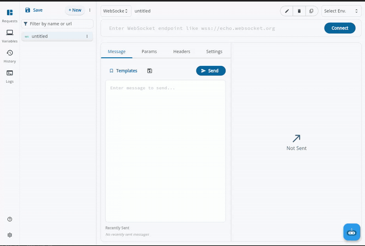

#### 2. Application-level heartbeat
An optional custom repeating **keep-alive** message keeps connections alive through proxies and load balancers that drop idle sockets. The interval is configurable and can be changed live on an open connection.

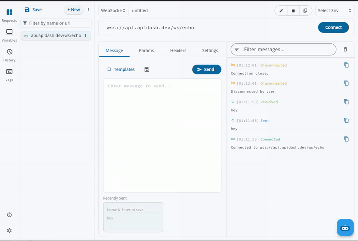

#### 3. Reusable message templates + Recently Sent
Common payloads (a login, a subscribe command, a ping) can be saved as **templates** and reused across sessions, and a **Recently Sent** strip refills the input with a click for quick resends.

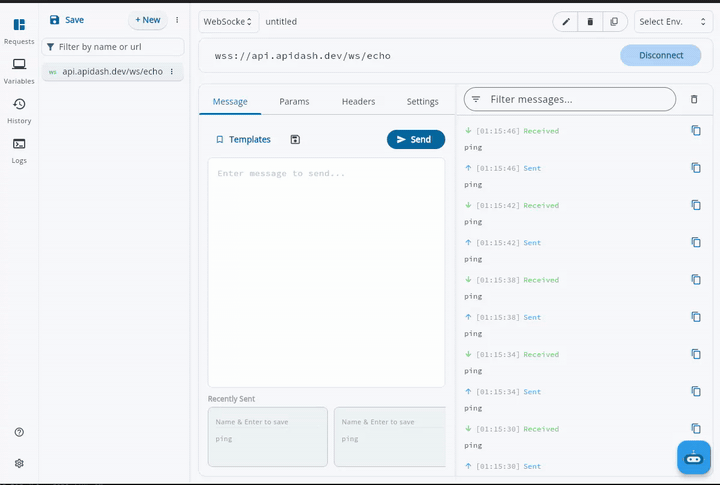

#### 4. Auto-reconnect, auth & history
Optional **auto-reconnect** retries dropped connections; headers/auth are applied on the handshake; and every session is saved to **history** for read-only review, with Dashbot aware of WebSocket requests too.

---

### Part 2 — MQTT ([#1757](https://github.com/foss42/apidash/pull/1757))

#### 1. MQTT v3.1.1 **and** v5
A version selector switches the whole request between **MQTT v3.1.1** and **MQTT v5**, gating the v5-only settings so the v3 experience stays simple.

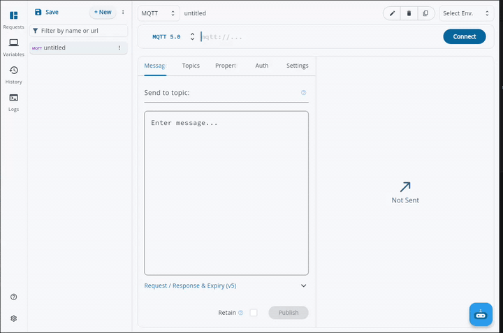

#### 2. Secure, flexible connections
Connect with a client id, keep-alive, and clean session/start; over plain TCP, **TLS**, or **MQTT-over-WebSocket**; with optional **username/password** auth — covering the real ways brokers are deployed.

#### 3. Topics: per-topic QoS & wildcards
Subscribe to multiple topics at once, each with its **own QoS (0 / 1 / 2)**, and use wildcards (`+` / `#`) to match topic trees.

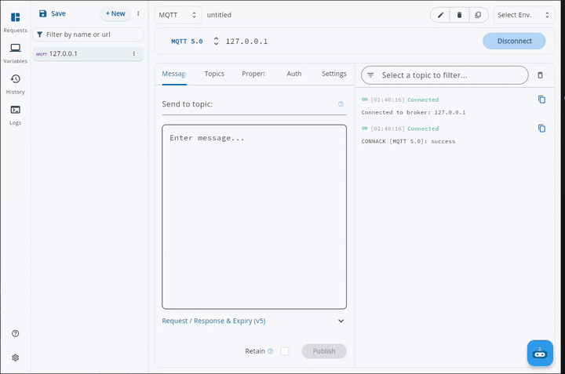

#### 4. Publishing with retain
Publish messages to any topic with a chosen QoS and the **retain** flag, then watch responses arrive in the live message view.

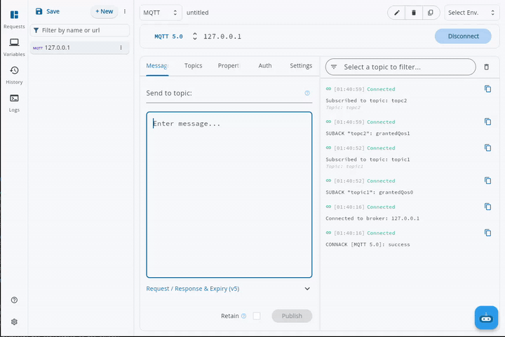

#### 5. MQTT v5 features
The v5 path surfaces v5-specific capabilities such as **User Properties**, so v5 request/response metadata can actually be tested from the app.

#### 6. Learn-as-you-go help overlays
Because MQTT has a lot of concepts, every control (QoS, retain, wildcards, clean session, v5 settings…) carries a **plain-language help overlay** explaining what it does — the request pane doubles as a teaching tool.

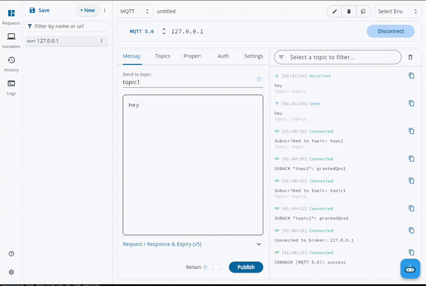

---

### Part 3 — gRPC ([#1764](https://github.com/foss42/apidash/pull/1764))

#### 1. Connection
Connect by `host:port` (no scheme) — plaintext gRPC over HTTP/2, with the port defaulting to `50051` if omitted.

#### 2. Method discovery — two ways
Discover a server's services and methods either through server **Reflection** (the URL-bar **Reflect** button; tries v1, falls back to v1alpha, and surfaces errors) or by importing a **`.proto`** file (**Settings → Fetch services**) for servers without reflection.

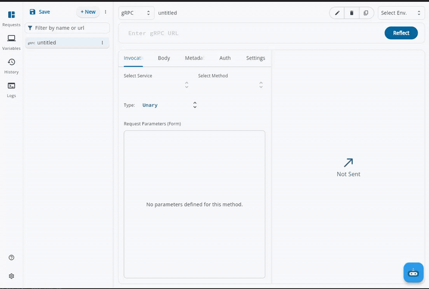

#### 3. All four call types
Full support for **unary**, **server-streaming**, **client-streaming**, and **bidirectional** calls — including pushing multiple messages onto an open request stream and half-closing it (`Send message` / `Finish sending`).

#### 4. Composing the request message
The Protobuf request message can be filled in a **typed form** (one input per field, matched to its type) or written as raw **JSON** on the Body tab — the two stay in sync.

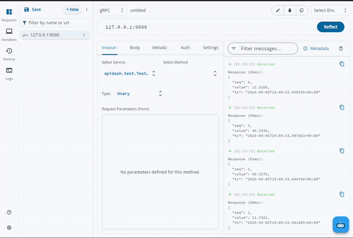

#### 5. Metadata & auth
Send call **metadata** (gRPC's headers), and use the shared **Auth** tab (Bearer / Basic / API-key / JWT) which is automatically turned into the right metadata.

#### 6. Streamed responses & response metadata
Responses stream into a live view, and the server's **response metadata** — both **initial** and **trailing** — is shown alongside, so the full gRPC response surface is inspectable. Every request is saved to history.

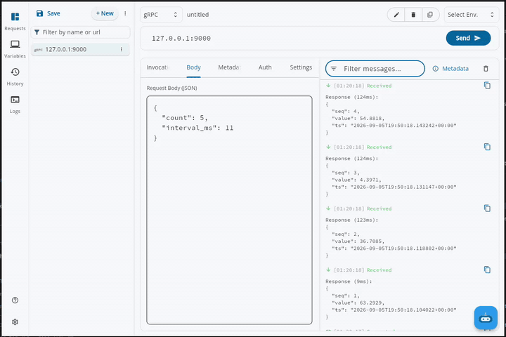

---

### Part 4 — CLI & Interactive TUI ([#1792](https://github.com/foss42/apidash/pull/1792))

#### 1. A pure-Dart binary that reuses the real engine
The CLI compiles to a single standalone binary with **no Flutter at runtime**, and runs every request through API Dash's own `better_networking` engine — so results match the desktop app exactly. It reads the **same workspace** the desktop app writes, so requests you build in the GUI are runnable from the terminal.

#### 2. A full command set
`send` (ad-hoc requests), `run` (a saved request by name/id), `list`, `env` (+ a global `--env` for `{{var}}` substitution), `graphql`, `ai`, and `--stream` (SSE) — covering the HTTP-family protocols.

#### 3. Agent- & CI-friendly
Every command supports **`--json`** structured output, runs fully non-interactively, and returns **stable, documented exit codes** — so it drops cleanly into scripts, CI pipelines, and AI agents.

#### 4. Interactive TUI
Running `apidash` (or `apidash tui`) opens a terminal UI to **browse** saved requests, then **Run** one, **edit** it in place (URL / method / headers / body / params), or **generate a curl command** — all against the shared workspace.

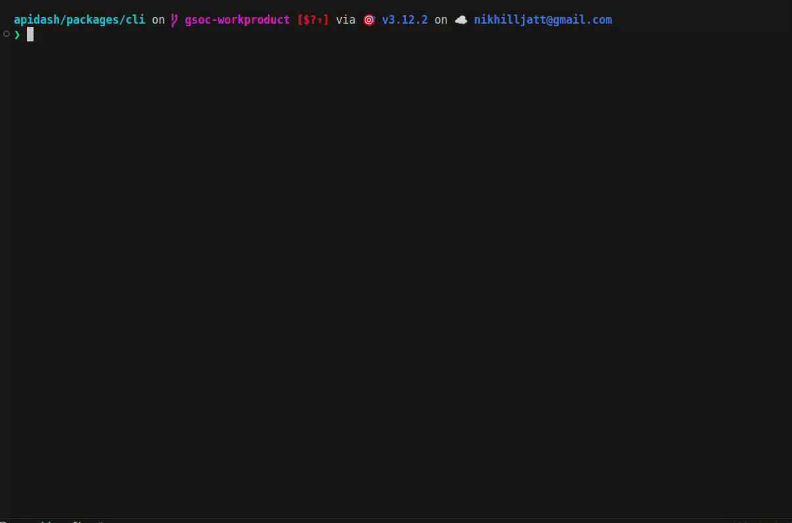

---

### Part 5 — Foundations & Test Infrastructure

#### 1. Pure-Dart refactor of the core packages ([#1637](https://github.com/foss42/apidash/pull/1637))
A `dart compile` binary can't link Flutter, so I refactored `apidash_core` / `better_networking` to be **Flutter-free at runtime** — the foundation that made the CLI possible — and added an OAuth2 abstraction layer along the way. (The `freezed` v3 migration, [#1644](https://github.com/foss42/apidash/pull/1644), was part of keeping the models current.)

#### 2. Backend test servers ([foss42/api](https://github.com/foss42/api))
These protocols can't be plain FastAPI routes (HTTP/2 + Protobuf + long-lived streams for gRPC; a real broker for MQTT), so each ships as a **one-command Dockerized rig** with realistic data:
* **WebSocket** echo endpoints — [#89](https://github.com/foss42/api/pull/89), [#92](https://github.com/foss42/api/pull/92).
* **MQTT broker rig** — Eclipse Mosquitto + a test publisher; listeners for plaintext, WebSocket, TLS (self-signed) and username/password auth; scenarios for a JSON ticker, retained messages, echo (with v5 request/response), and Last-Will — [#93](https://github.com/foss42/api/pull/93).
* **gRPC test server** — a custom `apidash.test.TestService` (grpcio) with reflection, all four call types, metadata echo, auth (`SecureEcho`), and error-code coverage, plus a **pytest round-trip suite** — [#94](https://github.com/foss42/api/pull/94); auth + response metadata + tests + a self-contained-folder restructure in [#97](https://github.com/foss42/api/pull/97).

#### 3. User documentation ([#1705](https://github.com/foss42/apidash/pull/1705))
Each protocol ships a beginner-friendly end-user guide under `doc/user_guide/` (concepts → step-by-step → troubleshooting → FAQ); the **gRPC guide** ships in #1764 and the **CLI guide** in #1792.

---

## Challenges & Design Decisions

* **Reuse the real engine, never reimplement.** Both the protocol UIs and the CLI route through `better_networking` / the shared connection manager, so the terminal and the GUI are guaranteed to behave identically — the CLI even reuses the app's request models and importers rather than parsing anything itself.
* **Making a truly pure-Dart CLI.** The hardest constraint: a compiled Dart binary can't link Flutter. This drove the Flutter-free refactor of the core packages (#1637); where a package still pulled Flutter transitively (e.g. `genai`'s widget barrel), the CLI narrow-imports only its Flutter-free subtrees.
* **gRPC discovery, kept simple.** Two clear paths — the **Reflect** button for reflection-enabled servers, and **Settings → Fetch services** for a `.proto` — instead of one confusing toggle.
* **MQTT's breadth without the overwhelm.** A version selector gates v5-only settings, and plain-language help overlays explain each control, so the feature depth doesn't intimidate newcomers.
* **Test rigs as self-contained projects.** Per maintainer review, each rig lives in its own folder with its own `tests/`, `requirements-dev.txt`, and `README.md`, kept separate from the main API's suite.

---

## Pull Requests

**Client — [foss42/apidash](https://github.com/foss42/apidash)**

| PR | Title |
| --- | --- |
| [#1694](https://github.com/foss42/apidash/pull/1694) | WebSocket support |
| [#1705](https://github.com/foss42/apidash/pull/1705) | User docs for the new protocols |
| [#1644](https://github.com/foss42/apidash/pull/1644) | Migrate models to freezed v3 |
| [#1696](https://github.com/foss42/apidash/pull/1696) | Add `Agents.md` |
| [#1678](https://github.com/foss42/apidash/pull/1678) | Magic-byte previewer selection fix |
| [#1637](https://github.com/foss42/apidash/pull/1637) | Pure-Dart refactor of core packages |
| [#1757](https://github.com/foss42/apidash/pull/1757) | MQTT support |
| [#1764](https://github.com/foss42/apidash/pull/1764) | gRPC support |
| [#1792](https://github.com/foss42/apidash/pull/1792) | CLI (pure-Dart) + interactive TUI |

**Test servers — [foss42/api](https://github.com/foss42/api)**

| PR | Title |
| --- | --- |
| [#89](https://github.com/foss42/api/pull/89), [#92](https://github.com/foss42/api/pull/92) | WebSocket echo endpoints |
| [#93](https://github.com/foss42/api/pull/93) | MQTT broker rig |
| [#94](https://github.com/foss42/api/pull/94) | gRPC test server |
| [#97](https://github.com/foss42/api/pull/97) | gRPC rig: auth, response metadata, tests, restructure |

---

## Skills Demonstrated

Flutter & Dart (Riverpod, Hive, freezed, `dart compile` / CLI / TUI); protocol internals — WebSocket, MQTT v3.1.1 / v5, and gRPC (HTTP/2, Protobuf, server reflection, the four streaming modes); pure-Dart package architecture; Python server work (grpcio, paho-mqtt, FastAPI, Eclipse Mosquitto) with Docker; and clear technical writing.

---

## Conclusion

API Dash is now a genuinely multi-protocol API client — REST/GraphQL alongside **WebSocket, MQTT, and gRPC**, all sharing one consistent UI and persistence layer — with a **pure-Dart CLI and interactive TUI** that bring the same engine to the terminal, and a complete set of **local test servers** and **user documentation** behind them. Thank you to my mentors — **Ashita Prasad, Ankit Mahato, and Ragul Raj M** — and to the wider API Dash community for the reviews and guidance throughout GSoC '26.
