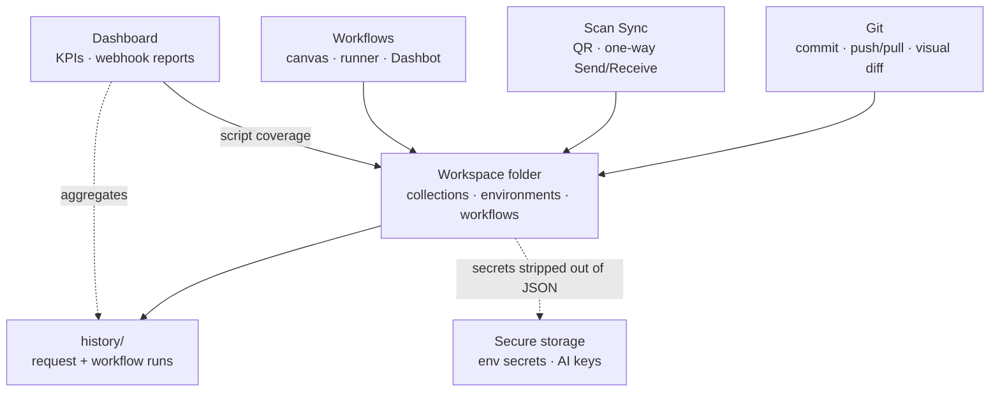
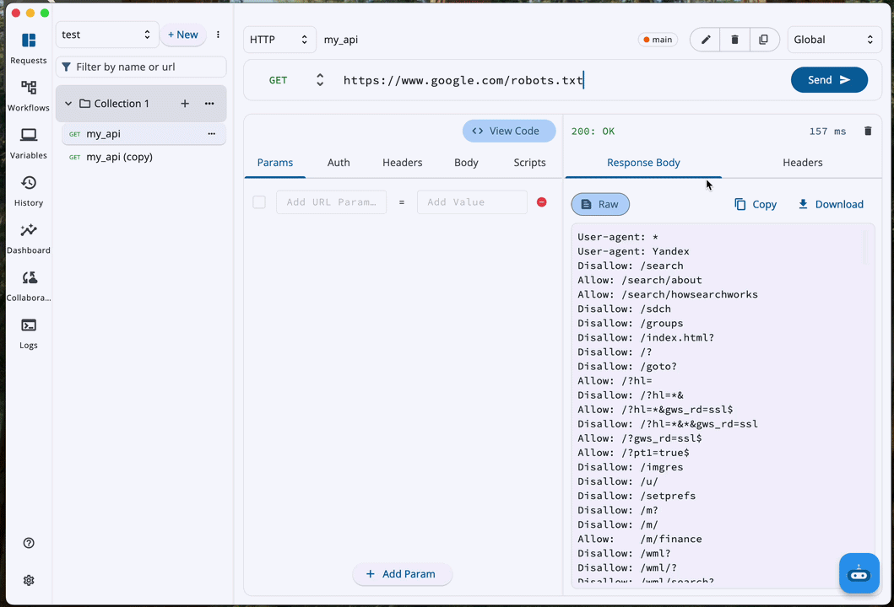
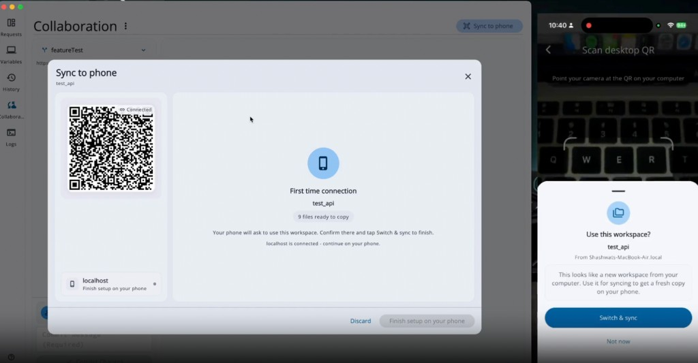
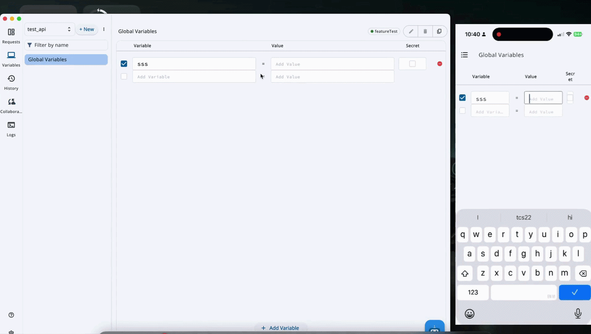
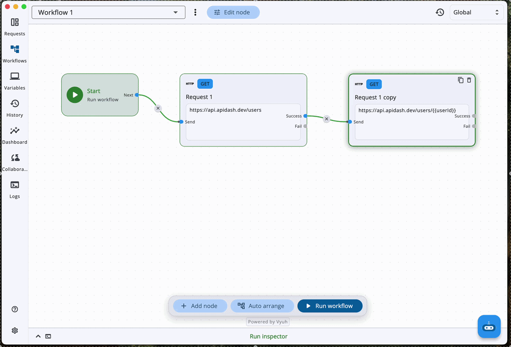
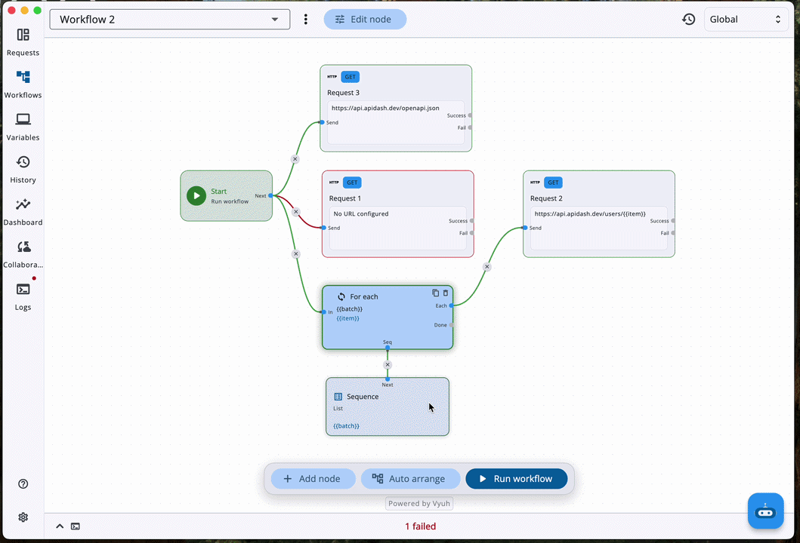
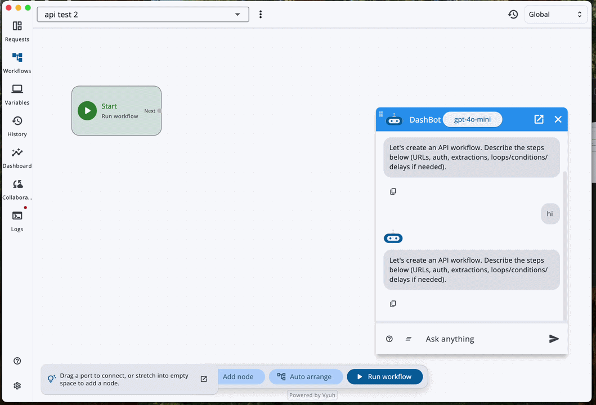
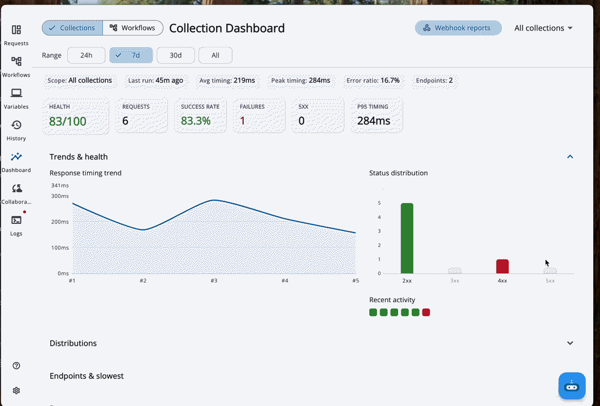

# GSoC'26 Final Report: Git Support, UI Workflow Builder & Collection Dashboard

> Final report summarizing my contributions to API Dash as part of Google Summer of Code 2026.

## Project Details

1. **Contributor:** [Shashwat Pratap Singh](https://github.com/ShashwatXD)
2. **Mentors:** Ankit Mahato, Ashita Prasad, Ragul Raj M, Manas Hejmandi
3. **Organization:** [API Dash](https://github.com/foss42/apidash)
4. **Project:** [Git Support, UI Workflow Builder & Collection Dashboard](https://summerofcode.withgoogle.com/programs/2026/projects/Qnk4Mkow)

#### Quick Links

- [GSoC Project Page](https://summerofcode.withgoogle.com/programs/2026/projects/Qnk4Mkow)
- [Project Discussion](https://github.com/foss42/apidash/discussions/1689)
- [Code Repository](https://github.com/foss42/apidash)
- [Proposal](https://github.com/foss42/apidash/pull/1474) · [Idea doc](https://github.com/foss42/apidash/pull/1258)

---


## Table of Contents

1. [Project Description](#project-description)
2. [System Architecture](#system-architecture)
3. [Foundation: Filesystem Workspaces](#foundation-filesystem-workspaces)
4. [Layer 1: Git Collaboration & Scan Sync](#layer-1-git-collaboration--scan-sync)
5. [Layer 2: Visual Workflow Builder](#layer-2-visual-workflow-builder)
6. [Layer 3: Analytics Dashboard](#layer-3-analytics-dashboard)
7. [Related: Multi-Provider LLM Settings](#related-multi-provider-llm-settings)
8. [Challenges & Design Decisions](#challenges--design-decisions)
9. [Pull Requests](#pull-requests)
10. [Skills Demonstrated](#skills-demonstrated)
11. [Future Work](#future-work)
12. [Conclusion](#conclusion)

---


## Project Description

API clients are strongest when a team can **version** collections, **move work between devices**, **automate multi-step API flows**, and **see whether those APIs are healthy**, in a local-first tool.

This project delivers that stack for API Dash on one shared substrate: a **filesystem workspace** (pretty-printed JSON on disk). On top of it:


| Layer                             | Outcome                                                                            |
| --------------------------------- | ---------------------------------------------------------------------------------- |
| **Git Collaboration & Scan Sync** | Desktop Git on the workspace root; LAN QR one-way sync with a phone                |
| **Visual Workflow Builder**       | Node-based multi-step flows with a runner, history, and Dashbot-assisted authoring |
| **Analytics Dashboard**           | Request and workflow health from existing history, plus combined webhook reports   |


---


## System Architecture

Each feature is a **layer over one workspace folder**. Features sit on top, the folder is the source of truth in the middle, and local-only data sits under it.




Read it top down: Git versions the folder, Sync transfers it between devices, Workflows run graphs stored in it, and the Dashboard measures what those runs produced. `history/` lives inside the folder but is excluded from Git and Sync, and secret values are pulled out of the JSON into OS-backed storage, so pushing or syncing a workspace cannot leak them. `.apidash/` keeps workspace identity and Sync baselines.


| Code             | Path                                                                            |
| ---------------- | ------------------------------------------------------------------------------- |
| Storage          | `lib/services/storage/workspace_storage.dart`                                   |
| Lifecycle        | `lib/services/workspace_service.dart`, `lib/providers/workspace_lifecycle.dart` |
| Autosave / watch | `lib/providers/auto_save.dart`, `lib/providers/workspace_disk_sync.dart`        |
| Git              | `lib/git/services/git_service.dart`, `lib/git/pages/collaboration_page.dart`    |
| Sync             | `lib/sync/transport/`, `lib/sync/sync_apply.dart`                               |
| Workflows        | `lib/workflow/`; Dashbot: `workflow_apply_service.dart`                         |
| Dashboard        | `lib/dashboard/`                                                                |


---


## Foundation: Filesystem Workspaces

`Associated Pull Request`: [#1695](https://github.com/foss42/apidash/pull/1695)

Collections, environments, workflows, and history live as pretty-printed JSON in a workspace folder (optional media sidecars for binary responses). App settings remain in SharedPreferences. Secret env values and AI API keys are stripped from JSON and stored in a per-workspace secure-storage blob, so Git push and Scan Sync never carry those secrets.

### On-disk layout

```
<workspace>/
  collections/
    collection_index.json
    <Collection Name>/                 # folder name == collection id
      request_index.json
      <slug>_<8hex>/                   # makeStorageId(name)
        request.json
        response.json                  # may include "bodyFile"
        response_body.<ext>            # optional
  environments/
    environment_index.json
    global.json
    <envId>.json                       # secret values empty on disk
  workflows/
    workflow_index.json
    <Workflow Name>.json               # lean graph json
  history/                             # local only (Git/Sync excluded)
    request_history/
    workflow_history/
  .apidash/
    workspace.json                     # workspace id / name
    sync.json                          # Sync baseline hashes
```


#### Multi-collection catalog and request identity

Each collection is a directory. Each request is a `slug_<hex>` subdirectory with `request.json` / `response.json`. Indexes avoid full-tree walks while still discovering folders that appear after clone or Sync.

#### Request-level autosave

Edits debounce (~1s) and flush the active collection, catalog, and environments. Manual sidebar Save was removed. Collaboration ops still flush explicitly before commit / pull / Sync apply so disk matches memory.

#### Secure secrets

Env secret fields and AI `apiKey` values are emptied or stripped on write and rehydrated on load from secure storage. Copying a folder does not move those secrets.

#### Desktop and mobile roots

Desktop: user-picked folder. Mobile: Documents sandbox, with path rebase when the OS container identity changes.

#### Workspace selector onboarding

First launch and workspace switches go through a selector: **New local**, **Open**, or **Clone** a remote Apidash workspace, then load the collection catalog. Recent workspaces stay on the sidebar for quick reopen.

  
*Selector → New / Open / Clone → collection catalog*

#### Atomic writes and write journal

JSON uses temp file + rename. A short journal lets `Directory.watch` ignore self-writes so autosave and disk sync do not fight.

#### Media response sidecars

Optional `response_body.<ext>` with a `bodyFile` pointer. Read/delete resolve only basenames that stay inside the request directory.

---


## Layer 1: Git Collaboration & Scan Sync

`Associated Pull Request`: [#1734](https://github.com/foss42/apidash/pull/1734) (builds on [#1695](https://github.com/foss42/apidash/pull/1695))  
`Documentation`: [Collaboration Guide](../../user_guide/collaboration_guide.md)

Desktop Collaboration is the hub for Git and Sync. Mobile Collaboration is Sync-only. Both backends reuse the same change-tree and visual-diff UI.


|           | Git                                | Scan Sync                              |
| --------- | ---------------------------------- | -------------------------------------- |
| Transport | Remotes (GitHub, GitLab, …)        | Same Wi‑Fi WebSocket + QR              |
| Semantics | Full VCS history                   | One Send or Receive, then session ends |
| Platforms | Desktop                            | Desktop host + mobile client           |
| Shared UI | `GitChangesTree`, visual/raw diffs | Same chrome via `sync_change_adapter`  |


### Git (Desktop)


#### Workspace as repo root via system Git

The workspace folder is the repository root. `GitService` uses `Process.run` against system `git`, so Credential Manager / SSH agents apply. Interactive prompts are off (`GIT_TERMINAL_PROMPT=0`).

**Tracked Apidash paths:** `collections/`, `environments/` (except `*.local.json`), `workflows/`, and `.gitignore` (written on init).  
**Init ignore template:** `history/`, `.apidash/`, `environments/*.local.json`, OAuth credential JSON, `*.tmp`, OS junk.

#### Clone and setup guide

Clone validates Apidash indexes on the remote. For an existing local workspace, the Collaboration setup guide walks **install Git →** `git init` **→ add remote → first fetch/push**, so a folder becomes a shareable repo without leaving the app.

  
*Init workspace repo → add remote*

#### Status, commit, fetch, pull, push

Porcelain v2 status drives ahead/behind and the change list. Apidash paths (plus `.gitignore`) are auto-selected for commit. **Check remote** is `fetch` only. **Pull** is emphasized when behind. Mutating ops flush autosave and call `reloadWorkspaceFromDisk` after pull / checkout / restore / reset.

#### Visual JSON diffs

Field-level visual diffs for requests, responses, indexes, environments, and workflows (changed fields only), plus raw unified toggle. Workflow diffs include node/edge add/remove and position changes.

  
*Visual / Raw diff → commit → push*

### Scan Sync (LAN QR)


#### One-way apply sessions

Desktop hosts `SyncSessionServer` (default port `4571`, ~5 min listen, one peer; second peer → HTTP 409). Phone joins via QR (`host`, `port`, `token`, workspace meta) over cleartext LAN `ws://`; the token is the session capability.

#### Wire protocol


| Step      | Messages                                                         |
| --------- | ---------------------------------------------------------------- |
| Handshake | `hello` → `helloAck`                                             |
| Diff      | both send `manifest` (`path` → `sha256:…`)                       |
| Transfer  | `fileRequest` / `fileContent`, or bulk writes in `applyComplete` |
| End       | `applyComplete` / `error` / `bye`                                |


Syncable paths: `collections/`, `environments/`, `workflows/` only. History and `.apidash/` never go on the wire.

#### First pair vs incremental

First pairing is phone-driven adopt/replace. Later sessions with the same workspace id and a stored baseline are incremental. Same id without baseline still replaces; it does not fake an incremental merge.

  
*First pair: desktop QR host ↔ phone Switch & sync*

**Baseline correctness:** after apply, both sides persist the **agreed** map from `applyComplete`. Re-hashing only the local tree left asymmetric baselines (empty Send / Receive on both with no real edits). Receive rebuilds baseline from post-write local hashes.

  
*Incremental session: change tree → visual diff → apply*

### Collaboration UI


#### Branches, restore, reset

Create/switch branches; restore a commit; reset workspace (`reset --hard` + clean untracked, keep ignored). Overflow: reveal folder / open in VS Code.

#### Git status badge

Dirty / ahead / behind in the editor, deep-linked to Collaboration.

#### Sync unsynced indicator

Outgoing drift vs stored baseline without opening a session.

#### Mobile scope

Scan, adopt, apply only. No full Git client on phone.

---


## Layer 2: Visual Workflow Builder

`Associated Pull Request`: [#1781](https://github.com/foss42/apidash/pull/1781)  
`Documentation`: [Workflows Guide](../../user_guide/workflows_guide.md)

Multi-step API scenarios become versionable documents plus an interactive canvas. Desktop edits fully. Medium/mobile layouts **view and run** the same files (including workflows received via Sync).

### Lean on-disk shape

```json
{
  "name": "Login Flow",
  "description": "optional",
  "nodes": [
    { "id": "start", "type": "start", "label": "Start", "position": { "x": 80, "y": 180 } },
    {
      "id": "node_ab12",
      "type": "request",
      "label": "Login",
      "position": { "x": 320, "y": 180 },
      "request": {
        "id": "req_…",
        "httpRequestModel": { "method": "post", "url": "https://api.apidash.dev/…" }
      },
      "extract": [{ "var": "token", "path": "access_token" }]
    }
  ],
  "edges": [
    { "id": "e1", "from": "start", "to": "node_ab12", "out": "next" }
  ]
}
```

Filename stem = id = display name.

#### Schema for Git and Dashbot

One flat document humans and models can emit. Request + `extract` live on the node. Methods normalize to lowercase enums on load/apply.

#### Vyuh canvas, Riverpod source of truth

[`vyuh_node_flow`](https://pub.dev/packages/vyuh_node_flow) for pan/zoom/ports/wires. `WorkflowVyuhAdapter` hydrates ephemerally; persistence goes through `WorkflowDocument` in Riverpod. Stretch-to-add uses `onConnectEnd`.

#### Chaining via extractions

Paths such as `data.0.id` become scoped `{{vars}}` for later HTTP/AI steps. Env vars apply at run time; extractions win on name clash.

  
*Chained requests → Run → inspector + run-path*

#### Implicit parallel and AND-join

Multiple outs on one handle run concurrently. Convergence waits on reachability, then merges variables; conflicts fail the run. Condition True/False stays exclusive.

#### Loops and Sequence

One loop node: for-each and repeat. Sequence produces lists for for-each only (Seq port), not a generic add-node type.

  
*Parallel Workflows*

#### Dashbot Generate Workflow

Describe → `apply_workflow` → confirm Create New / Change Current → lean JSON on disk. Apply accepts `connections` as an alias for `edges`, auto-chains when edges are missing, and auto-arranges.

  
*Dashbot prompt → confirm → canvas*

#### Run inspector and run-path

Step chips with request/response detail. Live or historical runs paint running / completed / failed / untaken paths on the canvas.

#### Medium/mobile view-and-run

Inspect mode: no Add / Arrange / Dashbot. Sync’d workflows can still be run on a phone.

#### Workflow history

`history/workflow_history/` (Git/Sync excluded), drawer → inspector.

#### AI credentials on workflows

Same strip-on-disk / hydrate-in-memory pattern as collection AI requests.

#### Stretch-to-add and connection editing

Port-into-empty-space creation and connection cleanup on top of Vyuh.

---


## Layer 3: Analytics Dashboard

`Associated Pull Request`: [#1791](https://github.com/foss42/apidash/pull/1791) (builds on [#1781](https://github.com/foss42/apidash/pull/1781))  
`Documentation`: [Dashboard Guide](../../user_guide/dashboard_guide.md)

The Dashboard aggregates `history/request_history` and `history/workflow_history`. Collection health score: `75% × successRate + 25% × (1 − errorRatio)` with success = status `< 400`.

#### Collections and Workflows health

Time range `24h` / `7d` / `30d` / `All`, optional filter. Collections: health, success, volume, failures, latency. Workflows: run outcomes and failing nodes.

#### Trends and diagnostics

Trends open by default. Distributions, hot/slow endpoints, recent 4xx/5xx (→ History), workflow node failures.

  
*KPIs, scope controls, and trends*

#### Combined webhooks

One `type: dashboard` payload for Collections and Workflows: JSON, Slack Block Kit, or Discord embeds. Preview, copy, send now, interval auto-send.

  
*Webhook preview → Send → success*

#### Script coverage

Post-response scripts treated as tests; coverage % and missing list.

#### Execution history deep links

Opens History or Workflows with the matching run inspector.

#### Mobile/medium Dashboard

Same metrics pipeline; no second analytics engine.

---


## Related: Multi-Provider LLM Settings

`Associated Pull Request`: [#1779](https://github.com/foss42/apidash/pull/1779)

Multi-provider LLM configuration (`aiProviders`), settings UI / model selector, and genai model-manager support for live and known models. Dashbot workflow generation and other AI request surfaces share one configuration path instead of a single hard-wired provider. Delivered in parallel with the workspace stack.

---


## Challenges & Design Decisions


#### Workspace folder as the shared substrate

Versioning, phone handoff, workflows, and analytics all need the same durable tree. A pretty-printed workspace folder gives honest diffs, offline use, and Sync manifests. Cost: atomic IO, path safety, disk watch vs autosave races, and mobile path rebase.

#### System `git` CLI instead of an embedded git library

Matches Credential Manager / SSH agents and cuts library maintenance. Cost: desktop-only Git, non-interactive auth, and careful CLI error mapping.

#### One-way Scan Sync instead of CRDT

LAN QR needs a simple trust model: pair, apply once, close. The hard bug was baseline agreement after one-way apply. Fix: both peers store the agreed `applyComplete` map; receive rebuilds from post-write local hashes.

#### Shared change UI for two backends

Git porcelain and Sync hashes look different internally. Mapping Sync into `GitChange` keeps one change-tree and one add/mod/delete visual language.

#### Lean workflow JSON vs full editor graph schema

Persisting ports and sizes would pollute Git and force Dashbot to invent layout. Riverpod `WorkflowDocument` is source of truth; Vyuh is a view. Parallelism is implicit on multi-out handles with reachability AND-join.

#### Passive disk watch vs Git/Sync reload

Finder edits must not wipe selection. Pull and Sync apply need an authoritative reload after autosave flush. Mute/suppress flags keep self-writes and hydration from fighting each other.

---


## Pull Requests

Delivery order:

1. [#1695](https://github.com/foss42/apidash/pull/1695) Storage / filesystem workspaces
2. [#1734](https://github.com/foss42/apidash/pull/1734) Git + Scan Sync
3. [#1781](https://github.com/foss42/apidash/pull/1781) Workflow Builder
4. [#1791](https://github.com/foss42/apidash/pull/1791) Analytics Dashboard
5. [#1779](https://github.com/foss42/apidash/pull/1779) Multi-provider LLM settings


| PR                                                   | What it landed                                                                                   | Status       |
| ---------------------------------------------------- | ------------------------------------------------------------------------------------------------ | ------------ |
| [#1695](https://github.com/foss42/apidash/pull/1695) | Workspace layout, autosave, multi-collection, secure secrets, atomic IO, disk watch              | Under review |
| [#1734](https://github.com/foss42/apidash/pull/1734) | System Git, visual diffs, QR Sync, shared change UI, reload discipline                           | Open         |
| [#1781](https://github.com/foss42/apidash/pull/1781) | Lean workflows, Vyuh canvas, runner (parallel/loop/Sequence), Dashbot apply, mobile view-and-run | Open         |
| [#1791](https://github.com/foss42/apidash/pull/1791) | KPIs, trends, coverage, combined webhooks                                                        | Open         |
| [#1779](https://github.com/foss42/apidash/pull/1779) | Multi-provider LLM config and model selector                                                     | Open         |


---

## Skills Demonstrated


| Skill                         | Evidence                                                                               |
| ----------------------------- | -------------------------------------------------------------------------------------- |
| Local-first persistence       | Workspace layout, autosave, atomic IO, disk watch, secure secrets                      |
| Developer tooling / VCS       | System Git, porcelain parsing, clone validation, structured visual diffs               |
| Sync protocols                | QR capability tokens, WebSocket host/client, manifest/diff/apply, baseline correctness |
| Graph execution               | Lean schema, parallel fan-out, reachability join, loops/Sequence, merge conflicts      |
| AI product surfaces           | Dashbot confirm-before-write apply; multi-provider LLM settings                        |
| Observability UX              | History-backed metrics and combined webhook exporters                                  |
| Cross-platform product design | Desktop Git + Sync; mobile Sync and workflow view-and-run                              |
| Engineering hygiene           | Stacked delivery, user guides, subsystem unit tests                                    |


---


## Future Work

- Grow mobile Workflows from view-and-run to full authoring.
- Add optional scheduled workflow runs and richer Dashbot apply (partial edits, safer multi-file proposals).

---


## Conclusion

This project makes API Dash collaborative, automatable, and observable on a single local workspace.

Teams can version collections with **Git**, move a desk workspace to a phone with **Scan Sync**, author and run multi-step **Workflows** (including Dashbot-assisted generation), and monitor health on the **Dashboard** with outbound reports. Multi-provider **LLM settings** keep AI surfaces on one configuration path. The durable result is one pretty-printed workspace that is reviewable, syncable, runnable, and measurable while staying local-first.

I thank my mentors and the API Dash community for their reviews and guidance. I look forward to iterating with real-world usage.

---

