# GSoC'26 Final Report: Git Support, UI Workflow Builder & Collection Dashboard

> Final report summarizing my contributions to API Dash as part of Google Summer of Code 2026.

## Project Details

1. **Contributor:** [Shashwat Pratap Singh](https://github.com/ShashwatXD)
2. **Mentors:** Ankit Mahato, Ashita Prasad, Ragul Raj M, Manas Hejmandi
3. **Organization:** [API Dash](https://github.com/foss42/apidash)
4. **Project:** [Git Support, UI Workflow Builder & Collection Dashboard](https://summerofcode.withgoogle.com/programs/2026/projects/Qnk4Mkow)

#### Quick Links

- [GSoC Project Page](https://summerofcode.withgoogle.com/programs/2026/projects/Qnk4Mkow)
- [Project Discussion](https://github.com/foss42/apidash/discussions/1689)
- [Code Repository](https://github.com/foss42/apidash)
- [Proposal](https://github.com/foss42/apidash/pull/1474) · [Idea doc](https://github.com/foss42/apidash/pull/1258)

---


## Table of Contents

1. [Project Description](#project-description)
2. [System Architecture](#system-architecture)
3. [Part 1: Filesystem Workspaces](#part-1-filesystem-workspaces)
4. [Part 2: Git Collaboration](#part-2-git-collaboration)
5. [Part 3: Scan Sync](#part-3-scan-sync)
6. [Part 4: Visual Workflow Builder](#part-4-visual-workflow-builder)
7. [Part 5: Analytics Dashboard](#part-5-analytics-dashboard)
8. [Part 6: Multi-Provider LLM Settings](#part-6-multi-provider-llm-settings)
9. [Challenges & Design Decisions](#challenges--design-decisions)
10. [Pull Requests](#pull-requests)
11. [Skills Demonstrated](#skills-demonstrated)
12. [Future Work](#future-work)
13. [Conclusion](#conclusion)

---


## Project Description

This project adds four capabilities to API Dash: **versioning** collections, **moving a workspace between devices**, **automating multi-step API flows**, and **reporting on API health**. All of them run locally, with no server component.

Before this project, API Dash stored everything in a binary Hive database. That made collections impossible to read, review, or put under version control. This project rebuilds the storage layer as a **filesystem workspace**, plain pretty-printed JSON in a folder you choose, and then builds four features on top of that one shared substrate.


| Part                        | What it does                                                                             |
| --------------------------- | ---------------------------------------------------------------------------------------- |
| **Filesystem Workspaces**   | Your collections, environments, and workflows as readable JSON files on disk             |
| **Git Collaboration**       | Commit, push, pull, branch, and field-level visual diffs, from inside the app            |
| **Scan Sync**               | Move a desktop workspace to your phone over Wi-Fi by scanning a QR code                  |
| **Visual Workflow Builder** | A node canvas for multi-step API scenarios, with a runner and Dashbot-assisted authoring |
| **Analytics Dashboard**     | Health, trends, and script coverage from local history, plus webhook reports             |


Everything stays local-first. Nothing is uploaded, and secrets never enter the JSON files.

---


## System Architecture

Each feature is a **layer over one workspace folder**. Features sit on top, the folder is the source of truth in the middle, and local-only data sits under it.

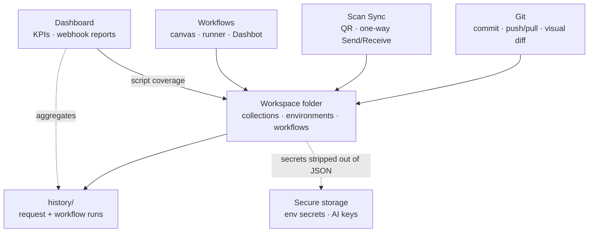


Read it top down: Git versions the folder, Sync transfers it between devices, Workflows run graphs stored in it, and the Dashboard measures what those runs produced. `history/` lives inside the folder but is excluded from Git and Sync, and secret values are pulled out of the JSON into OS-backed storage, so pushing or syncing a workspace cannot leak them. `.apidash/` keeps workspace identity and Sync baselines.


| Code             | Path                                                                            |
| ---------------- | ------------------------------------------------------------------------------- |
| Storage          | `lib/services/storage/workspace_storage.dart`                                   |
| Lifecycle        | `lib/services/workspace_service.dart`, `lib/providers/workspace_lifecycle.dart` |
| Autosave / watch | `lib/providers/auto_save.dart`, `lib/providers/workspace_disk_sync.dart`        |
| Git              | `lib/git/services/git_service.dart`, `lib/git/pages/collaboration_page.dart`    |
| Sync             | `lib/sync/transport/`, `lib/sync/sync_apply.dart`                               |
| Workflows        | `lib/workflow/`; Dashbot: `workflow_apply_service.dart`                         |
| Dashboard        | `lib/dashboard/`                                                                |


---


## Part 1: Filesystem Workspaces

`Associated Pull Request`: [#1695](https://github.com/foss42/apidash/pull/1695)

Every other part builds on this layer. A workspace is a directory of pretty-printed JSON that any editor can open.

### 1. Choose a workspace when the app starts

The workspace location is chosen by the user rather than fixed by the app. The selector offers **New workspace**, **Open** an existing folder, or **Clone** one from a Git remote, then loads the collection catalog. Recent workspaces remain in the sidebar for reopening.

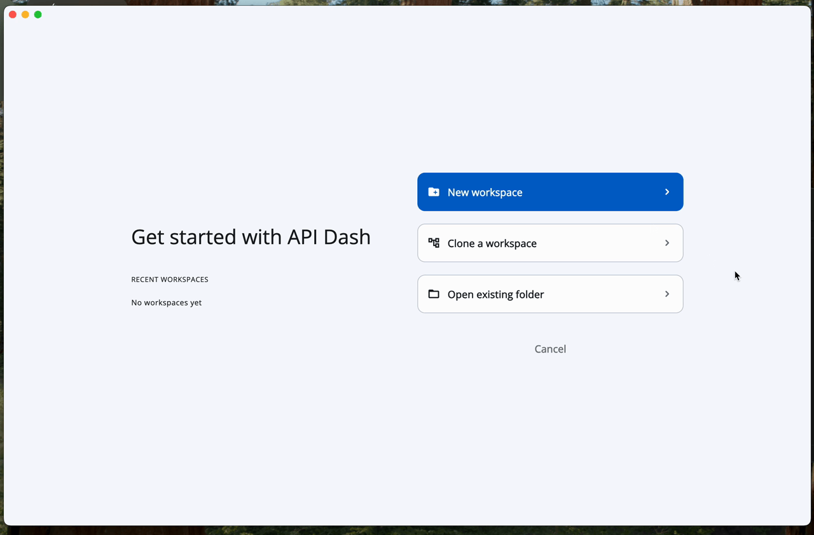  
*Name a workspace, choose its folder, and the app opens with it loaded*

### 2. Everything is readable JSON on disk

Each collection is a directory and each request is its own subdirectory, so a reviewer can understand a change by reading the file, with no app required.

```
<workspace>/
  collections/
    collection_index.json
    <Collection Name>/                 # folder name == collection id
      request_index.json
      <slug>_<8hex>/                   # makeStorageId(name)
        request.json
        response.json                  # may include "bodyFile"
        response_body.<ext>            # optional
  environments/
    environment_index.json
    global.json
    <envId>.json                       # secret values empty on disk
  workflows/
    workflow_index.json
    <Workflow Name>.json               # lean graph json
  history/                             # local only (Git/Sync excluded)
    request_history/
    workflow_history/
  .apidash/
    workspace.json                     # workspace id / name
    sync.json                          # Sync baseline hashes
```

**Under the hood:** index files let the app find collections and requests without walking the whole tree, while still discovering folders that appear after a Git clone or a Sync apply.

### 3. Request-level autosave

There is no Save button any more. Edits debounce for about a second and then flush the active collection, catalog, and environments. Collaboration actions still flush explicitly before a commit, pull, or Sync apply, so what is on disk always matches what you see.

### 4. Secrets never enter the JSON

Environment secret values and AI `apiKey` fields are emptied or stripped on write and rehydrated from OS-backed secure storage on load. As a result a Git push cannot carry a key, and copying the workspace folder elsewhere does not copy its secrets.

### 5. Atomic writes and media sidecars

JSON is written to a temp file and renamed into place, so a crash mid-write cannot corrupt a collection. A short write journal lets the desktop file watcher ignore the app's own writes, so autosave and disk-watching do not fight each other. Binary response bodies are stored as `response_body.<ext>` sidecars referenced by a `bodyFile` pointer, resolved only to basenames that stay inside the request directory.

**Platform roots:** desktop uses a folder you pick; mobile uses the Documents sandbox, with a path rebase when the OS container identity changes between launches.

---


## Part 2: Git Collaboration

`Associated Pull Request`: [#1734](https://github.com/foss42/apidash/pull/1734) (builds on [#1695](https://github.com/foss42/apidash/pull/1695))
`Documentation`: [Collaboration Guide](../../user_guide/collaboration_guide.md)

Because the workspace is a folder of JSON, it can be a Git repository. The Collaboration page is a Git client scoped to that workspace: it operates on Apidash paths and the operations a collection actually needs, rather than exposing the full Git surface.

### 1. Turn a workspace into a shareable repo

If the folder is not a repo yet, a three-step guide handles it: verify Git is installed, run `git init`, then connect a remote. The whole sequence runs inside the app.

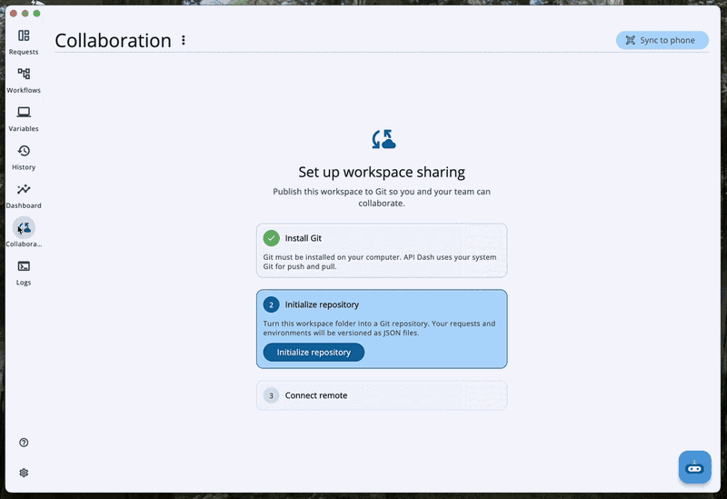  
*The guide initializes the repo, takes a remote URL, and confirms the connection*

### 2. See exactly which fields changed

A unified JSON diff reports brace and indentation noise alongside the one field that actually changed. Changes are therefore rendered field by field for requests, responses, indexes, environments, and workflows, showing only what moved, with the raw unified view one toggle away. Workflow diffs also report added and removed nodes and edges.

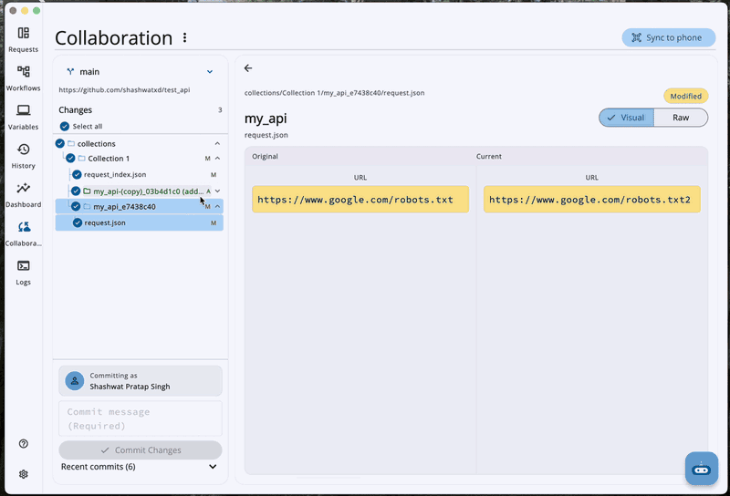  
*Pick a changed request and read the old and new values side by side*

### 3. Commit and push without leaving the app

Your Apidash paths are pre-selected, so committing is: write a message, commit, push. **Check remote** does a fetch only, and **Pull** is emphasized when you are behind.

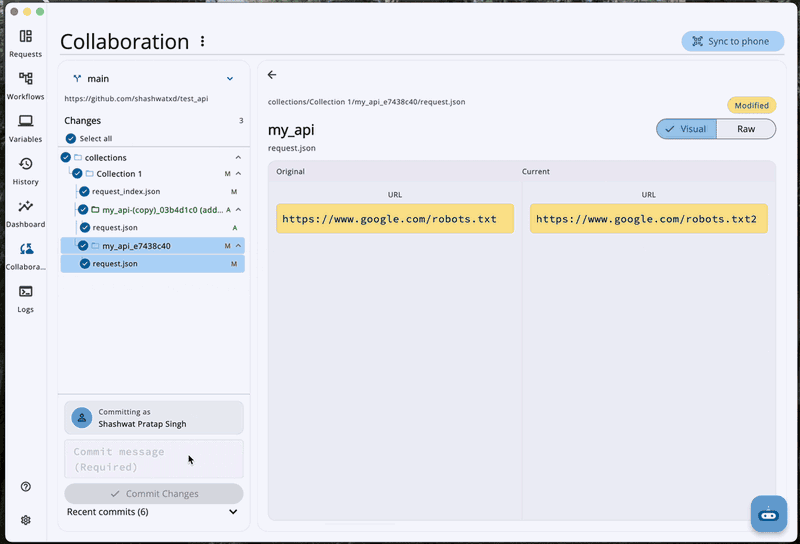  
*After the commit the workspace goes clean and Push origin appears, one commit ahead*

### 4. Branches, restore, and reset

Create and switch branches, restore an earlier commit, or reset the workspace (`reset --hard` plus cleaning untracked files, while keeping ignored ones). An overflow menu can reveal the folder or open it in VS Code.

### 5. Git status badge

The editor shows dirty, ahead, and behind counts, deep-linked to the Collaboration page.

**Under the hood**

- `GitService` shells out to the **system `git`** binary via `Process.run`, so existing Credential Manager and SSH agent configuration applies. Interactive prompts are disabled with `GIT_TERMINAL_PROMPT=0`, and status is parsed from porcelain v2.
- Tracked paths are `collections/`, `environments/` (except `*.local.json`), `workflows/`, and the `.gitignore` written at init. That template excludes `history/`, `.apidash/`, local env files, OAuth credential JSON, `*.tmp`, and OS junk.
- Mutating operations flush autosave first and call `reloadWorkspaceFromDisk` afterwards, so memory matches disk after a pull, checkout, restore, or reset.
- Cloning checks that the remote actually contains Apidash indexes before adopting it.

---


## Part 3: Scan Sync

`Associated Pull Request`: [#1734](https://github.com/foss42/apidash/pull/1734)

Git covers team collaboration, but routing a workspace to a phone through a remote is heavy for a one-off transfer. Scan Sync moves it directly over the local network: the desktop hosts a session and renders a QR code, the phone scans it, and the syncable paths are copied. No account or cloud service is involved.

### 1. Pair by scanning a QR code

The desktop opens a session and shows a QR holding its host, port, a session token, and workspace details. The phone scans it, and the desktop reports how many files are ready to copy while the phone asks whether to adopt the workspace.

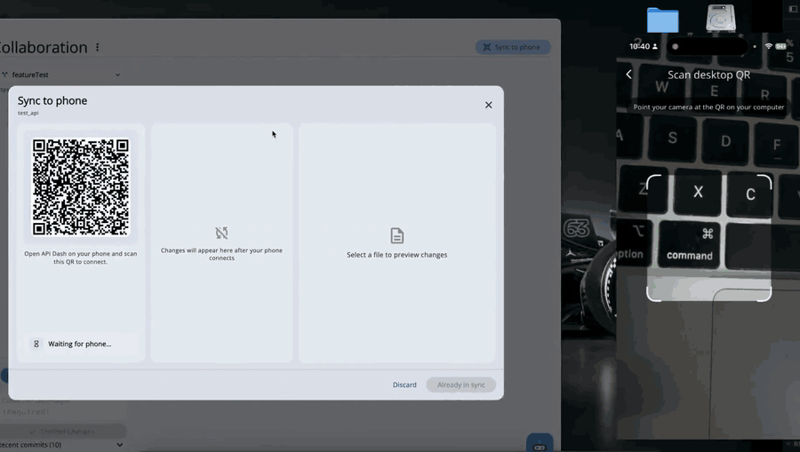  
*The desktop waits on the QR, the phone scans and confirms, and the workspace lands on the phone*

### 2. Change something on the phone

Once the workspace has landed, the phone is not a read-only viewer. Requests and environment values can be edited there, and the phone counts what it has changed against the last synced copy, so you know there is something to send before you open a session.

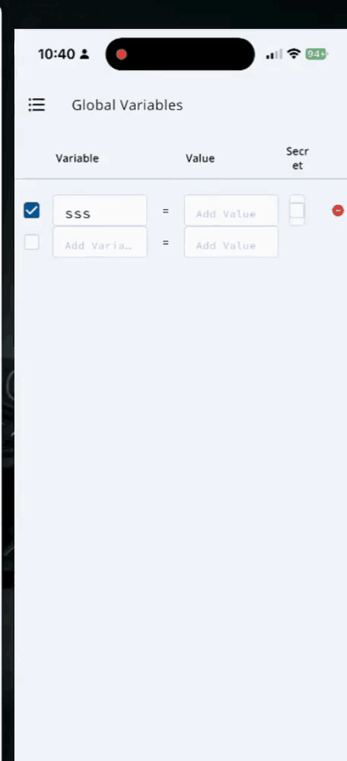  
*An empty environment variable gets filled in on the phone, and the sync screen then reports one change waiting*

### 3. Review the change list before anything is written

Sync reuses the same change tree and diff UI as Git, so you can see precisely which requests and environments differ between the two devices before committing to anything.

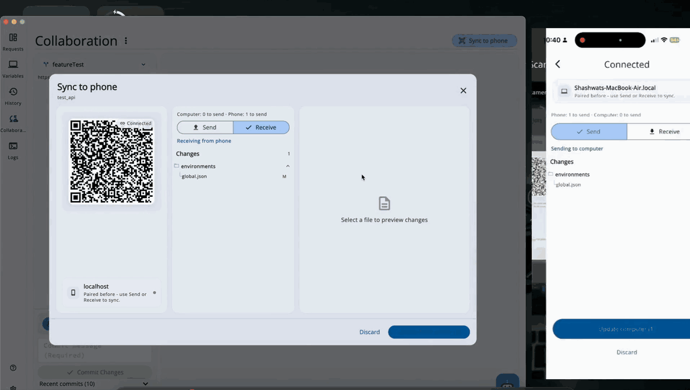  
*A returning session finds one changed file; the same change reads as a field diff or as raw JSON against the last synced copy*

### 4. Apply in one direction, then the session ends

You choose the direction, send to phone or receive from phone, and it applies once. The session is not persistent and no background service keeps listening.

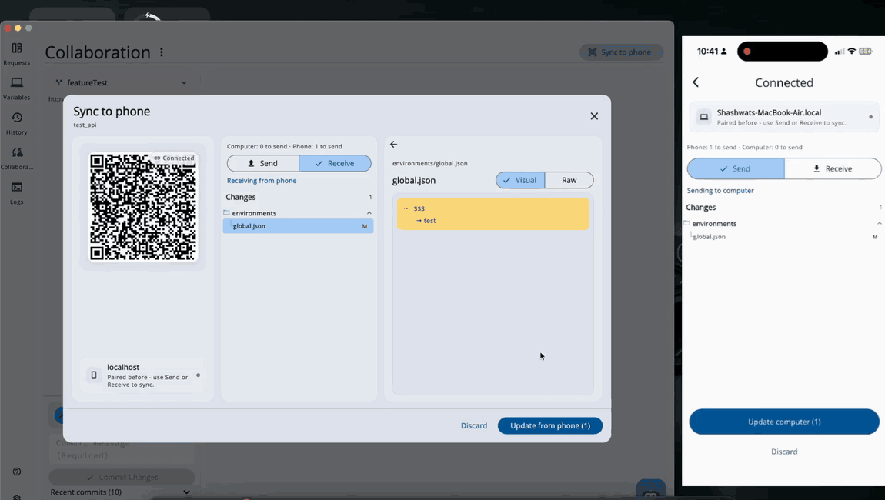  
*Update from phone writes the change and closes the session, and the new value is there in Global Variables*

### 5. Wire protocol

**Under the hood:** the desktop hosts `SyncSessionServer` (default port `4571`, roughly a 5-minute listen window, exactly one peer, and a second peer gets HTTP 409). The phone joins over cleartext LAN `ws://`, and the QR token is the session capability.


| Step      | Messages                                                         |
| --------- | ---------------------------------------------------------------- |
| Handshake | `hello` → `helloAck`                                             |
| Diff      | both sides send a `manifest` (`path` → `sha256:…`)               |
| Transfer  | `fileRequest` / `fileContent`, or bulk writes in `applyComplete` |
| End       | `applyComplete` / `error` / `bye`                                |


Only `collections/`, `environments/`, and `workflows/` are syncable. History and `.apidash/` never go on the wire. First pairing is a phone-driven adopt/replace; later sessions with the same workspace id and a stored baseline are incremental. The same id without a baseline still replaces, rather than pretending to merge.

**Mobile scope:** the phone can scan, adopt, and apply. It is deliberately not a full Git client.

---


## Part 4: Visual Workflow Builder

`Associated Pull Request`: [#1781](https://github.com/foss42/apidash/pull/1781)
`Documentation`: [Workflows Guide](../../user_guide/workflows_guide.md)

Multi-step scenarios (log in, take the token, fetch a list, act on each item) had no representation in API Dash. The Workflow Builder stores them as versionable JSON documents and executes them from a node canvas.

### 1. Chain requests on a canvas

Nodes are dragged out and wired together, and a value from one response can be extracted for the next. An extraction such as `data.0.id` becomes a scoped `{{var}}` readable by every later step, so an id from one response can be referenced directly instead of copied by hand.

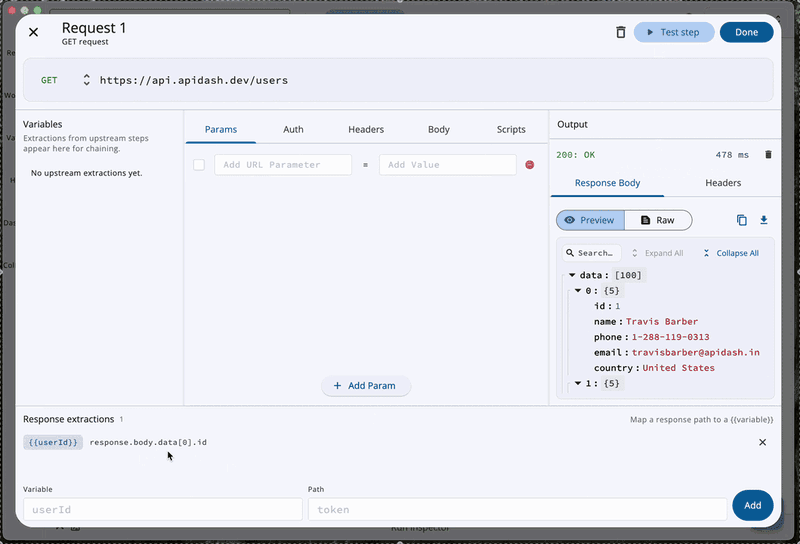  
*Name an extraction from the first response, then wire it into the request that follows*

### 2. Run it and inspect every step

A run paints its path on the canvas, colouring each node as running, completed, failed, or never taken. Step chips underneath open the real request and response for any step, and a past run replays into the same view.

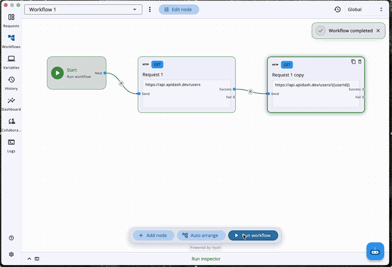  
*Run it, then open any step to see what was actually sent and returned*

### 3. Turn a list into a loop

A Sequence node holds a list, and one loop node walks it as either **for-each** or **repeat**. Hitting an endpoint once per id in an array becomes two nodes instead of a script.

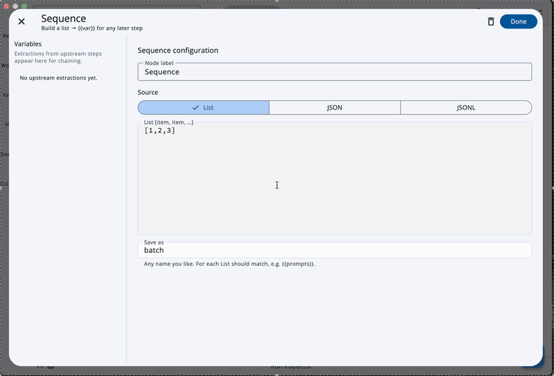  
*Sequence saves the list as a variable; the loop node walks it one item at a time*

### 4. Run branches in parallel

There is no "parallel" node to add. Wire several edges out of one handle and those branches run at the same time. Where they meet again, the run waits for every branch that could still arrive, then merges their variables; a real conflict fails the run instead of quietly picking a winner. Condition nodes stay exclusive, True or False and never both.

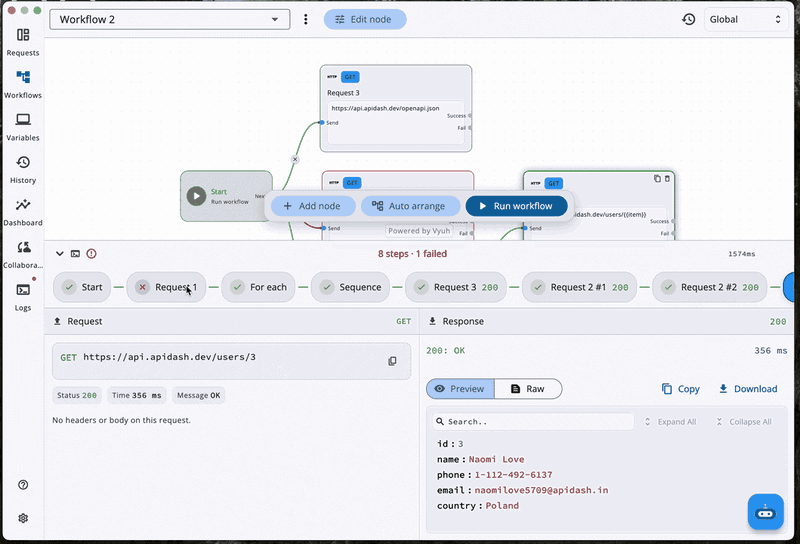  
*Branches run together, and each one's response is a separate chip in the inspector*

### 5. Describe a workflow and let Dashbot build it

Type what you want in plain English. Dashbot proposes a workflow and asks whether to create a new one or change the current one. It never writes to your workspace without confirmation. Once you confirm, the proposal becomes real nodes and edges, auto-arranged and ready to run.

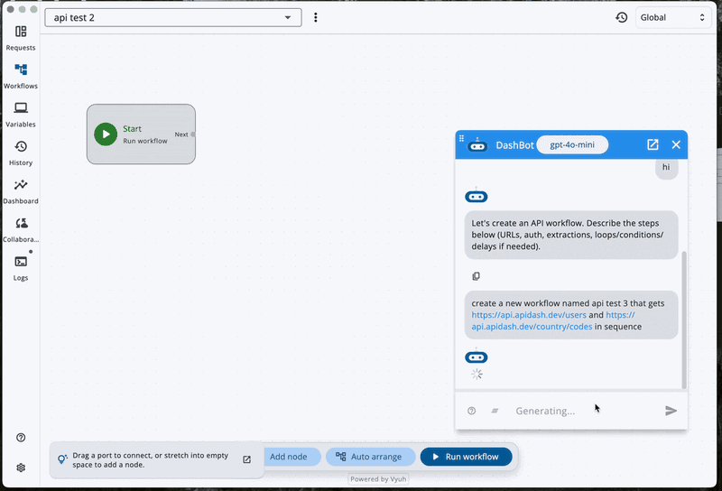  
*Describe the flow, confirm the proposal, and the generated workflow runs*

### 6. View and run on a phone

Medium and mobile layouts open the same files in inspect mode: no Add, Arrange, or Dashbot, but workflows received over Sync can still be run from your phone.

### 7. Lean on-disk shape

**Under the hood:** a workflow is one flat JSON document that both humans and language models can write. The request and its extractions live on the node, and the filename stem is both the id and the display name.

```json
{
  "name": "Login Flow",
  "description": "optional",
  "nodes": [
    { "id": "start", "type": "start", "label": "Start", "position": { "x": 80, "y": 180 } },
    {
      "id": "node_ab12",
      "type": "request",
      "label": "Login",
      "position": { "x": 320, "y": 180 },
      "request": {
        "id": "req_…",
        "httpRequestModel": { "method": "post", "url": "https://api.apidash.dev/…" }
      },
      "extract": [{ "var": "token", "path": "access_token" }]
    }
  ],
  "edges": [
    { "id": "e1", "from": "start", "to": "node_ab12", "out": "next" }
  ]
}
```

Ports, sizes, and other editor bookkeeping are deliberately absent, because persisting those would pollute every Git diff and force Dashbot to invent layout.

- The canvas is [`vyuh_node_flow`](https://pub.dev/packages/vyuh_node_flow) for pan, zoom, ports, and wires. `WorkflowVyuhAdapter` hydrates it ephemerally while `WorkflowDocument` in Riverpod stays the source of truth.
- Dashbot's apply accepts `connections` as an alias for `edges`, auto-chains when edges are missing, and auto-arranges.
- Runs are recorded under `history/workflow_history/`, excluded from Git and Sync.
- AI credentials on workflow nodes use the same strip-on-disk, hydrate-in-memory pattern as collection AI requests.

---


## Part 5: Analytics Dashboard

`Associated Pull Request`: [#1791](https://github.com/foss42/apidash/pull/1791) (builds on [#1781](https://github.com/foss42/apidash/pull/1781))
`Documentation`: [Dashboard Guide](../../user_guide/dashboard_guide.md)

The Dashboard reads the run history already stored in the workspace and reports collection and workflow health from it. It issues no new requests and sends nothing anywhere unless you configure a webhook.

### 1. Collection health and trends

A time range (`24h`, `7d`, `30d`, or `All`) scopes a health score, success rate, request volume, failures, and average latency. Below that are response-time distributions, the hottest and slowest endpoints, and recent 4xx/5xx responses.

Health score is `75% × successRate + 25% × (1 − errorRatio)`, where success means a status below 400.

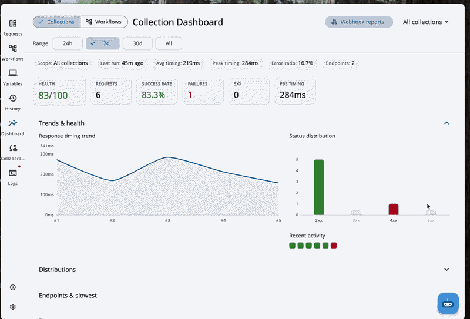  
*A health score for the collection, then the trend and the endpoints behind it*

### 2. Script coverage

Post-response scripts act as assertions, so the Dashboard reports them as coverage: the percentage of requests that have one, and which requests do not.

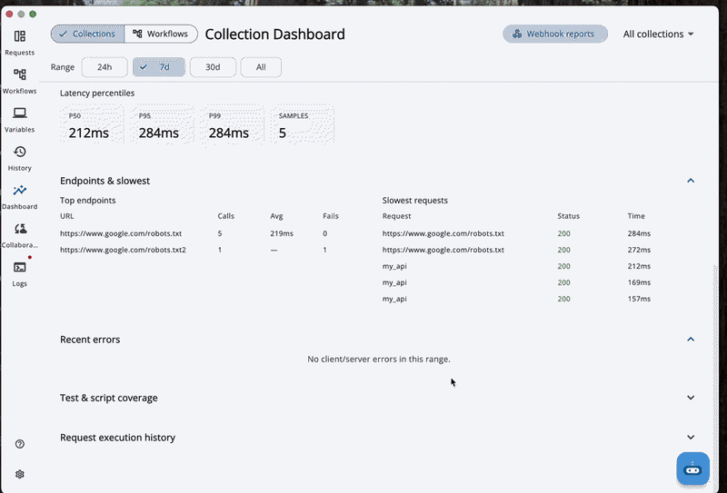  
*The coverage number, and the exact requests that have no script yet*

### 3. Workflow health

Workflows get their own view: how many runs passed or failed, how long they took, and which nodes break most often.

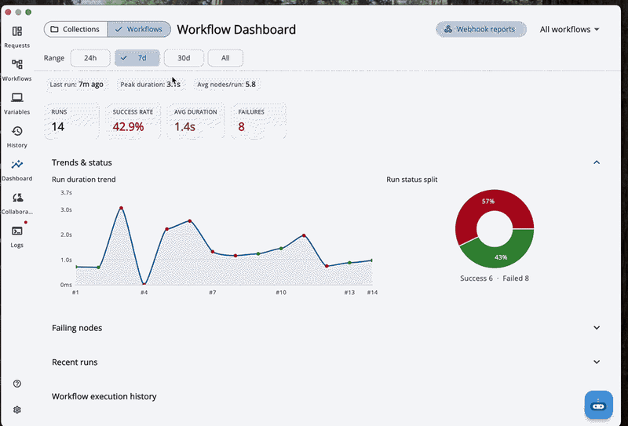  
*Runs split into passed and failed, with a duration trend and the nodes at fault*

### 4. Build a webhook report

One `type: dashboard` payload covers both Collections and Workflows, and can be formatted as raw JSON, Slack Block Kit, or Discord embeds. You can preview the exact payload, copy it, send it now, or have it auto-send on an interval.

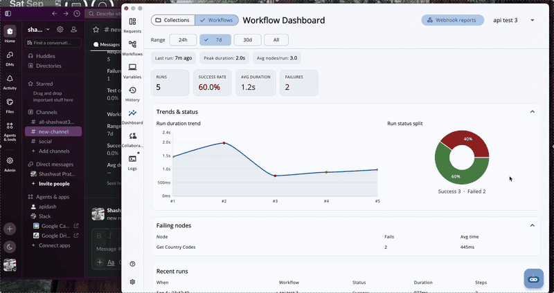  
*Pick a format and preview the exact payload before sending*

### 5. Delivery to Slack and Discord

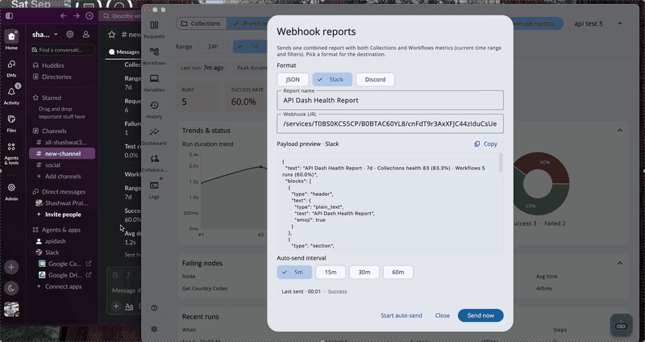  
*Send now, and the health report shows up as an embed in the channel*

### 6. Deep links from metrics to runs

Clicking a failure or a slow endpoint opens History or Workflows with the matching run inspector already loaded. Mobile and medium layouts reuse the same metrics pipeline, so there is no second analytics implementation to keep in sync.

---


## Part 6: Multi-Provider LLM Settings

`Associated Pull Request`: [#1779](https://github.com/foss42/apidash/pull/1779)

Delivered in parallel with the workspace stack: multi-provider LLM configuration (`aiProviders`), a settings UI and model selector, and genai model-manager support for both live and known models. Dashbot's workflow generation and every other AI surface now share one configuration path instead of a single hard-wired provider.

---


## Challenges & Design Decisions


#### Workspace folder as the shared substrate

Versioning, phone handoff, workflows, and analytics all need the same durable tree. A pretty-printed workspace folder gives honest diffs, offline use, and Sync manifests. Cost: atomic IO, path safety, disk watch versus autosave races, and mobile path rebase.

#### System `git` CLI instead of an embedded git library

Matches Credential Manager and SSH agents, and avoids maintaining a bundled git implementation. Cost: Git is desktop-only, auth must be non-interactive, and CLI errors need careful mapping.

#### One-way Scan Sync instead of CRDT

A QR-based LAN session needs a trust model that is simple to reason about: pair, apply once, close. The hard bug was baseline agreement after a one-way apply. Re-hashing only the local tree left the two peers with asymmetric baselines, which showed up as an empty Send *and* an empty Receive despite real edits. The fix: both peers persist the **agreed** map from `applyComplete`, and a receive rebuilds its baseline from post-write local hashes.

#### Shared change UI for two backends

Git porcelain output and Sync manifest hashes look nothing alike internally. Mapping Sync into `GitChange` keeps one change tree and one add/modify/delete visual language, so users learn the screen once.

#### Lean workflow JSON vs full editor graph schema

Persisting ports and sizes would pollute Git and force Dashbot to invent layout. Riverpod's `WorkflowDocument` is the source of truth and Vyuh is only a view. Parallelism is implicit on multi-out handles with a reachability AND-join.

#### Passive disk watch vs Git/Sync reload

An edit made in Finder must not wipe your selection, but a pull or Sync apply *does* need an authoritative reload after autosave flushes. Mute and suppress flags keep self-writes and hydration from fighting each other.

---


## Pull Requests

Delivery order:

1. [#1695](https://github.com/foss42/apidash/pull/1695) Storage / filesystem workspaces
2. [#1734](https://github.com/foss42/apidash/pull/1734) Git + Scan Sync
3. [#1781](https://github.com/foss42/apidash/pull/1781) Workflow Builder
4. [#1791](https://github.com/foss42/apidash/pull/1791) Analytics Dashboard
5. [#1779](https://github.com/foss42/apidash/pull/1779) Multi-provider LLM settings


| PR                                                   | What it landed                                                                                   | Status       |
| ---------------------------------------------------- | ------------------------------------------------------------------------------------------------ | ------------ |
| [#1695](https://github.com/foss42/apidash/pull/1695) | Workspace layout, autosave, multi-collection, secure secrets, atomic IO, disk watch              | Under review |
| [#1734](https://github.com/foss42/apidash/pull/1734) | System Git, visual diffs, QR Sync, shared change UI, reload discipline                           | Open         |
| [#1781](https://github.com/foss42/apidash/pull/1781) | Lean workflows, Vyuh canvas, runner (parallel/loop/Sequence), Dashbot apply, mobile view-and-run | Open         |
| [#1791](https://github.com/foss42/apidash/pull/1791) | KPIs, trends, coverage, combined webhooks                                                        | Open         |
| [#1779](https://github.com/foss42/apidash/pull/1779) | Multi-provider LLM config and model selector                                                     | Open         |


---


## Skills Demonstrated


| Skill                         | Evidence                                                                               |
| ----------------------------- | -------------------------------------------------------------------------------------- |
| Local-first persistence       | Workspace layout, autosave, atomic IO, disk watch, secure secrets                      |
| Developer tooling / VCS       | System Git, porcelain parsing, clone validation, structured visual diffs               |
| Sync protocols                | QR capability tokens, WebSocket host/client, manifest/diff/apply, baseline correctness |
| Graph execution               | Lean schema, parallel fan-out, reachability join, loops/Sequence, merge conflicts      |
| AI product surfaces           | Dashbot confirm-before-write apply; multi-provider LLM settings                        |
| Observability UX              | History-backed metrics and combined webhook exporters                                  |
| Cross-platform product design | Desktop Git + Sync; mobile Sync and workflow view-and-run                              |
| Engineering hygiene           | Stacked delivery, user guides, subsystem unit tests                                    |


---


## Future Work

- Grow mobile Workflows from view-and-run to full authoring.
- Add optional scheduled workflow runs and richer Dashbot apply (partial edits, safer multi-file proposals).

---


## Conclusion

This project makes API Dash collaborative, automatable, and observable on a single local workspace.

Teams can version collections with **Git**, move a desk workspace to a phone with **Scan Sync**, author and run multi-step **Workflows** (including Dashbot-assisted generation), and monitor health on the **Dashboard** with outbound reports. Multi-provider **LLM settings** keep AI surfaces on one configuration path. The durable result is one pretty-printed workspace that is reviewable, syncable, runnable, and measurable while staying local-first.

I thank my mentors and the API Dash community for their reviews and guidance. I look forward to iterating with real-world usage.

---

