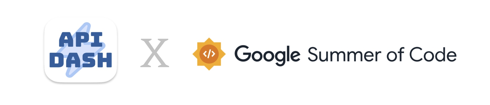

# AI-Based API Response to Dynamic UI and Tool Generator 

###  Personal Information  
- **Full Name:** Manas M Hejmadi
- **Contact Info:** manashejmadi@gmail.com `+918904995101`
- **Discord Handle:** `synapse_45006`
- **Github Profile:** https://github.com/synapsecode
- **Resume:** [Link](https://manashejmadi.vercel.app/images/MANAS_RESUME.pdf)
- **Website:** [Link](https://manashejmadi.vercel.app/)
- **Time Zone**: GMT +05:30

### University Information
- **University Name:** Dayananda Sagar College of Engineering (DSCE), Bengaluru
- **Program Enrolled In:** BE in Computer Science & Engineering (CSE)  
- **Year:** Pre-final Year (Third Year)  
- **Expected Graduation Date:** May 2026

### Motivation & Past Experience

1. Have you worked on or contributed to a FOSS project before? Can you attach repo links or relevant PRs? 
	- **ANS**: Have worked on large codebases but no direct experience with contribution.
2. What is your one project/achievement that you are most proud of? Why?
	- **ANS**: I am most proud of my microblogging application, _Microblogger_. It was a large project I undertook with the goal of learning Flutter, and through it, I gained a deep understanding of the framework. What makes me most proud is the Instagram-like story editor that I built within the app. It was a challenging feature that required creative problem-solving, and successfully implementing it taught me a lot.
3. What kind of problems or challenges motivate you the most to solve them?
	- **ANS**:  I am particularly motivated by challenges that address real pain points for users, as solving these issues has a direct, meaningful impact. I thrive on problems that require creative and efficient solutions, especially when they need to scale effectively. Additionally, I enjoy opportunities that allow me to take ownership of the project and make critical decisions that shape the direction of the solution.
4. Will you be working on GSoC full-time? In case not, what will you be studying or working on while working on the project?
	- **ANS**: Yes, I will primarily be working full-time on GSoC. Occasionally, I may have exams, course projects, or job/internship responsibilities, but they will not impact my commitment to GSoC.
5. Do you mind regularly syncing up with the project mentors?
	- **ANS**:  I am available after 5PM IST and can get on calls when needed
6. What interests you the most about API Dash?
	- **ANS**: It has a clean and minimalist design with a super fast startup time. It does exactly what it's meant to and gets straight to the point! Plus, Flutter and Dart hold a special place for me since they helped me land my first gig. I've really been enjoying using API Dash.
7. Can you mention some areas where the project can be improved?
	- **ANS**: One feature that I wanted to include is code to collection generation. Where, we just put the flask code (for example) into the textbox and the LLM agent automatically creates relevant Requests and Collections. This would speed up development and testing time.


## Project Details  

- **Project Title:** AI-Based API Response to Dynamic UI ( & API Tool Generator )
-  **Issue:** [#617](https://github.com/foss42/apidash/issues/617)
- **Issue Description:**  Develop an AI Agent which transforms API responses into dynamic, user-friendly UI components, enabling developers to visualize and interact with data effortlessly. By analyzing API response structures—such as JSON or XML—the agent automatically generates UI elements like tables, charts, forms, and cards, eliminating the need for manual UI development. One can connect an API endpoint, receive real-time responses, and instantly generate UI components that adapt to the data format. It must also support customization options, allowing developers to configure layouts, styles, and interactive elements such as filters, pagination, and sorting. Finally, users must be able to easily export the generated UI and integrate it in their Flutter or Web apps.


- **Abstract:**  
  This project introduces an AI-powered agent that **automates the transformation of API responses into structured UI schemas and functional UI components** across various frontend frameworks. Using Large Language Models (LLMs), the system eliminates the need for manual UI creation by intelligently analyzing API responses and generating corresponding UI structures. Additionally, it enables **dynamic modification of UI components** based on user prompts, allowing for customization in design, layout, and behavior. By seamlessly integrating these capabilities into a unified workflow, the project streamlines frontend development, reducing manual effort and accelerating the UI generation process with a **single-click solution.**
 The project also aims to create a simple one-click API Request to Tool Generation pipeline that can enable external AI agents to interact with APIs without any manual coding.

- **Project Goals:**  
  - Conversion from API Response into functional UI components such as tables, charts and forms.
  - Provide customisation options for layout, styles, and interactive elements.
  - Allow users to **modify UI components through natural language prompts**
  - **One Click Export** of the generated UI into code
  -  Creation of an AI-Based Automatic API Tool Generator 
 
## Proposal Description

### Deliverables

 1. **Internal AI Service** A Layer inside the apidash application that acts as a centralised gateway to local LLMs like **ollama** and other LLM Providers like **ChatGPT**, Claude and Gemini. This enables us to have a simple, modular and flexible approach to integrating agents which can help in future AI-driven implementations within the application.
 2. **API Response Analyser Agent:** Extracts the meaning of the API response and converts it into an internal schema representation for further processing
 3. **Stac Generator Agent:** Converts this generated internal schema along with other metadata into SDUI (Server Driven UI) to aid in visualisation. 
 4. **Stac Modifier Agent:** This agent accepts Stac Code generated from the previous step and can make any modification as needed by the user via Natural language prompts
 5.  **SDUI To Code Agent** This agent accepts Stac Code generated from the previous step and converts it into working framework-specific code (eg: Flutter)
 6.  **Updated API Dash Client:** The changes needed on the API Dash Client would be modifications to the settings page and creation of a new Dialog with 5-6 new screens (examples provided below)
 7. **API Tool Generation Agent & UI:** This agent processes an API request and transforms it into a specific tool format that can be utilized by agentic frameworks.
 
### Technical Details


### Internal AI Service Architecture

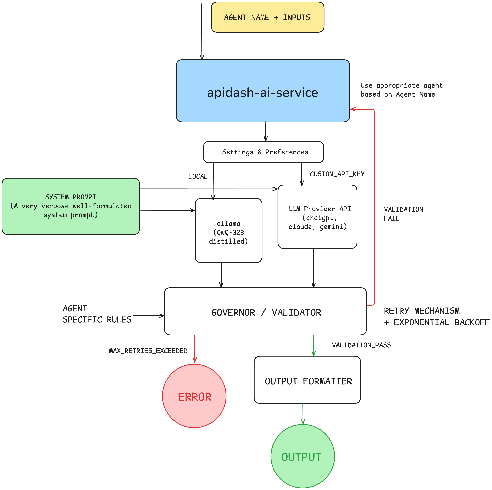

Parts of the Centralised Internal AI Agent Service Architecture
1. **Input Layer:** the input to each agent will be a JSON/XML input along with an Agent Name. The Agent name will be used to specify which agent we want to call internally.
2. **Orchestrator:** this part takes the inputs and looks at settings, preferences and other contextual data to decide whether to send the request to an internal ollama agent or to a LLM provider like chatgpt, claude or gemini. This layer can also include things like rate limiting to prevent overuse.	
	```dart
	//Inside the APIDashAIService implementation
	static Future<String?> _orchestrator(
	  APIDashAIAgent agent, { String? query, Map? variables }
	) async {
	  String sP = agent.getSystemPrompt();
	  //Perform Templating
	  if (variables != null) {
		for (final v in variables.keys) {
		  sP = sP.substitutePromptVariable(v, variables[v]);
		}
	  }
	  final customKey = await _getUserCustomAPIKey();
	  //Implement any Rate limiting logic as needed
	  if (customKey == null) {
		//Use local ollama implementation
		return await _call_ollama(systemPrompt: sP, input: query ?? '');
	  } else {
		//Use LLMProvider implementation
		return await _call_provider(
		  provider: customKey.$1,
		  apiKey: customKey.$2,
		  systemPrompt: sP,
		  input: query ?? '',
		);
	  }
	}	
	```

3. **System Prompt:** The System Prompt is a large block of text that sets the overall context and specifies what task the agent must perform. This prompt is unique to each agent and will be constantly iterated upon to ensure the best possible results. *(Regular discussions with mentors needed to fine-tune this)*
4. **Agentic Model**:
	- **ollama**:  Ollama is a way to run LLMs locally on the host machine. This will be the default option for each agent unless specified otherwise by the user/input. We will be making use of the ollama_dart package to implement this.
		```dart
		//Inside the APIDashAIService implementation
		static Future<String?> ollama(
			String systemPrompt,
			String input, [
			String model = 'llama3',
	  ]) async {
			//check Ollama Avaiability
			final result = await Process.run('curl', ['http://localhost:11434/api/tags']);
			if (result.exitCode != 0) {
			  print('OLLAMA_NOT_ACTIVE');
			  return null;
			}
			final inpS = input == '' ? '' : '\nProvided Inputs:$input';
			final client = OllamaClient();
			final generated = await client.generateCompletion(
			  request: GenerateCompletionRequest(
				model: model,
				prompt: "$systemPrompt$inpS",
			  ),
			);
			return generated.response;
	  }		
	  ```
  
	- **API Providers**: LLM services like ChatGPT, Claude and Gemini offer their services via AI endpoints too. By enabling this option in apidash, we are giving power-users the ability to add their favourite LLM's API Keys and use our services via that LLM
		```dart
		static Future<String?> _call_provider({
			required LLMProvider provider,
			required String apiKey,
			required String systemPrompt,
			required String input,
	  }) async {
			switch (provider) {
			  case LLMProvider.gemini:
				return await APIDashCustomLLMService.gemini(
					systemPrompt, input, apiKey);
			 ...
			}
	  }
	  
		static Future<String?> gemini(
			String systemPrompt,
			String input,
			String apiKey,
	  ) async {
			final inpS = input == '' ? '' : '\nProvided Inputs:$input';
			String combinedInput = "$systemPrompt$inpS";
			final url = Uri.parse(
				'https://generativelanguage.googleapis.com/v1beta/models/gemini-2.0-flash:generateContent?key=$apiKey');
			final response = await http.post(
			  url,
			  headers: {'Content-Type': 'application/json'},
			  body: jsonEncode({
				'contents': [
				  {
					"parts": [
					  {"text": combinedInput}
					]
				  }
				]
			  }),
			);
			if (response.statusCode == 200) {
			  final data = jsonDecode(response.body);
			  return data['candidates']?[0]?['content']?['parts']?[0]?['text'];
			} else {
			  print("GEMINI_ERROR: ${response.statusCode}");
			  return null;
			}
	  }
		```
5. **Validator:** LLMs are prone to hallucinations/wrong results. This layer aims to solve that issue by allowing users to create their own validation schemes. If the response validation is successful, we can move to the next step or else we send it to the governor which takes care of the whole retry mechanisms.
6.  **Governor (Retry Mechanism):** If the validation is unsuccessful, the governor attempts to retry the AI request with an **Exponential Backoff** (successive-delays such as 200ms, 400ms, 800ms, 1.6s, 3.2s and so on). Even after 5 retry attempts if the response is not valid, then we return with a `MAX_RETRIES_EXCEEDED` error.
	```dart
	//Inside the APIDashAIService implementation
	static Future<dynamic> governor(APIDashAIAgent agent) async {
		int RETRY_COUNT = 0;
		List<int> backoffDelays = [200, 400, 800, 1600, 3200];
		do {
		  try {
			final res = await orchestrator(agent);
			if (res == null) {
			  RETRY_COUNT += 1;
			} else {
			  if (await agent.validator(res)) {
				return agent.outputFormatter(res);
			  } else {
				RETRY_COUNT += 1;
			  }
			}
		  } catch (e) {
			print(e);
		  }
		  // Exponential Backoff
		  if (RETRY_COUNT < backoffDelays.length) {
			await Future.delayed(Duration(
			  milliseconds: backoffDelays[RETRY_COUNT],
			));
		  }
		  RETRY_COUNT += 1;
		 } while (RETRY_COUNT < 5);
	}
	```

8. **Output Formatter:** This is a function that allows us to specify in what way we want our agent to return the validated AI response. This is useful for downstream processing and keeps things elegant.

### Internal AI Service Proposed Implementation
```dart
enum LLMProvider { chatgpt, claude, gemini }

class APIDashAIService {
  static call_ollama(...) async {...}
  static call_provider(...) async {...}
  static getUserCustomAPIKey() async {
	//if custom key option in settings enabled, return the key and provider
	//else return null
	return (LLMProvider.chatgpt, '....');
  }
  static Future<...> orchestrator(...) async {...}
  static Future<dynamic> governor(APIDashAIAgent agent) async {...}
}
```

### Modular AI Agent Blueprint (Abstract Class)
```dart
abstract class APIDashAIAgent {
  String get agentName;
  String getSystemPrompt();
  Future<bool> validator(String aiResponse);
  Future<dynamic> outputFormatter(String validatedResponse);
}
extension SystemPromptTemplating on String {
  String substitutePromptVariable(String variable, String value) {
	return this.replaceAll(":$variable:", value);
  }
}
```
Calling any agent from the frontend can be done like this:
```dart
final agent = DummyAgent(); //extends APIDashAIAgent
final ans = await APIDashAIService.callAgent(
	agent, 
	variables: {
		'VAR_API_RESPONSE': resp_data, //SystemPrompt Templating
	}
);
```

### Agent Implementations

#### Agent: API_RESPONSE_ANALYZER
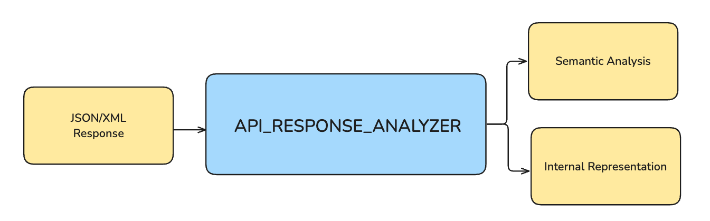

- The API response is first parsed correctly according to its type (JSON / XML) and is then sanitised
-  The Agent then goes through the whole response and generates relevant semantic context. This context will be very helpful in determining what is actually needed in the final UI
-   The semantic context along with the sanitized response is then sent over to the LLM to be converted into a YAML based intermediate-representation. This step is essential because it allows us to semantically include/exclude response data leading to good UI generation.
```dart
class ResponseAnalyzerAgent extends APIDashAIAgent {
  ...
  @override
  String getSystemPrompt() {
	return """You are an intelligent response analyzer agent...""";
  }

  @override
  Future<bool> validator(String aiResponse) async {
	//Specific validations to check if the generation was correct
	return true;
  }
  
  @override
  Future outputFormatter(String validatedResponse) {
	//separator specified in system prompt
   final sa, ir = validatedResponse.split('~~~~~'); 
   return {
	'SEMANTIC_ANALYSIS': sa.trim(),
	'INTERNAL_REPRESENTATION': ir.trim()
   }
  }
}
```

#### Agent: STAC_GEN (SDUI Representation Generator) 
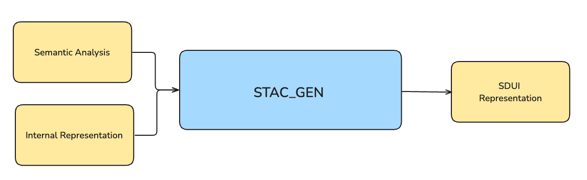
-   Using the internal schema and additional context, the SDUI Stac Generator Agent determines the most appropriate UI component for the data. For example, if the data structure is a `List<List>`, it can generate a table and so on. This data is converted into a SDUI (Server Driven UI) representation called `Stac` from the [Stac](https://pub.dev/packages/stac) flutter package.
-   The agent can further refine this decision based on factors such as data type, layout, and design preferences.
-   The generated Stac code is basically a json representation of a flutter component and this can be used to create lightning-fast previews
```dart
class StacGenBot extends APIDashAIAgent {
  @override
  String getSystemPrompt() {
	return """You are an expert agent whose sole job is to generate Flutter-SDUI Stac Code""";
  }
  //Similar implementation as above but the validator & outputFormatter logic changes
}
```


#### Agent: STAC_MODIFIER (UI Customization using Natural Language)
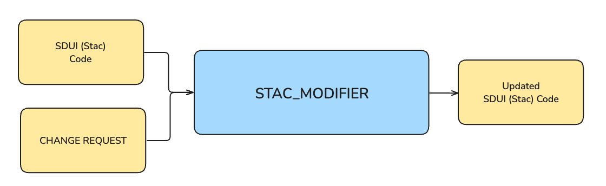

-   The generated SDUI code can be previewed in a Component Preview Window, allowing users to inspect the result.
-   The Stac Modifier Agent is an optional feature that allows users to modify the generated SDUI using natural language prompts. This iterative process enables users to refine the UI to meet their exact needs. This is fairly easy to do as most LLMs can already do this very well. We just have to use good system prompting to get it right
-   Common customisations like layout changes, pagination, and sorting can be added through buttons, making the customisation process seamless for users.

```dart
class StacModifierAgent extends APIDashAIAgent {
  @override
  String getSystemPrompt() {
	return """You are an intelligent Code Modifier Agent who matches the client's needs""";
  }
  //Similar implementation as above but the validator & outputFormatter logic changes
}
```
#### Agent: STAC2CODE (Conversion from SDUI Code to Framework Code)
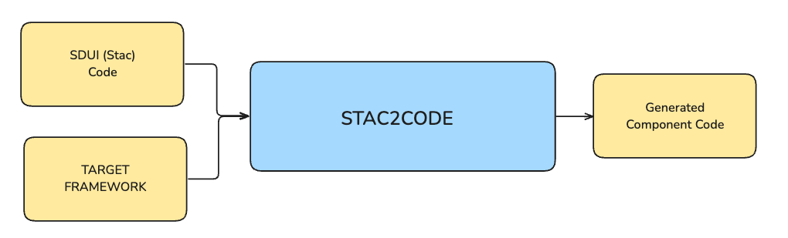
- The generated SDUI code cannot be executed on the user's machine, hence we must convert this into actual flutter code.
- This is fairly easy to do as Stac is almost a one-one representation of flutter code  just in JSON
- This property also makes it fairly easy to convert to other languages as the LLM can understand the context through the JSON SDUI and just convert it into another framework like NextJS code. This allows future extensibility.
```dart
class Stac2CodeAgent extends APIDashAIAgent {
  @override
  String getSystemPrompt() {
	return "You are an expert agent who accepts Stac SDUI code and converts it into Flutter..";
  }
  //Similar implementation as above but the validator & outputFormatter logic changes
}
```


### Live UI Preview Implementation
One of the most important features of this entire AI UI Designer pipeline is the implementation of the UI Preview Engine. This allows the user to see how the generated component looks and can help them identify what changes may be needed.
Creation of a dynamic UI rendering system from Flutter code is very hard due to flutter's limitations (**reflection** is not allowed, **flutter_eval** has minuscule coverage, **remote flutter widgets** or webviews need external server support etc)

Hence the last option was to use **SDUI (Server Driven User Interface)** using [Stac](https://pub.dev/packages/stac) 
This gives us a lot of flexibility as it is very similar in naming convention to Flutter and is hence easier to convert to Flutter Code using an LLM, it also has much greater coverage.
We will also be using a regular JSON based rendering approach as a fallback incase Stac is very unstable.

## System Architecture & Flow

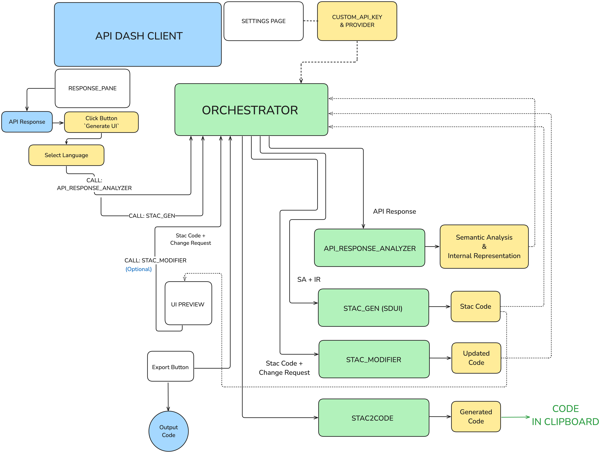

### Sample API Response
This is a sample response given when I hit a [DEMO API](https://reqres.in/api/users?page=0)
```json
{
  "total_pages": 2,
  "data": [
    {
      "id": 1,
      "email": "george.bluth@reqres.in",
      "first_name": "George",
      "last_name": "Bluth",
      "avatar": "https://reqres.in/img/faces/1-image.jpg"
    },
   ...
  ]
}
```
This is subsequently sent to our frontend prompt where we accept the target framework, let's assume the user has selected `Flutter` 
This response will first be sent into our Semantic Agent which tries to pick out what this response means.


----------


### Generated Semantic Response

*This JSON response represents a paginated list of user data. The 'data' field is an array containing user objects. Each user object includes 'id', 'email', 'first_name', 'last_name', and 'avatar'. The 'page', 'per_page', 'total', and 'total_pages' fields provide pagination information. The 'support' object can be omitted as it is not directly related to the user data itself. A suitable UI would be a List View to display the user information. Details should include the avatar (as an image), first name, last name, and email. The 'id' is useful internally, but may not be needed in the display. Pagination controls (e.g., next/previous page buttons or page number selection) are required to navigate through the pages of data.*


### Generated YAML-Based Internal Representation
```yaml
- type: column
  elements:
    - type: row
      elements:
        - type: image
          src: "https://reqres.in/img/faces/1-image.jpg"
          shape: circle
          width: 60
          height: 60
        - type: column
          elements:
            - type: text
              data: "George Bluth"
              font: "segoe-ui"
              color: blue
            - type: text
              data: "george.bluth@reqres.in"
              font: "segoe-ui"
              color: gray
       ...
```
### Generated Stac Representation (For SDUI Preview)
```json

{
  "type": "scaffold",
  "backgroundColor": "#002b36",
  "appBar": {
    "type": "appBar",
    "backgroundColor": "#073642",
    "title": {
      "type": "text",
      "data": "User List",
      "style": {
        "color": "#839496"
      }
    }
  },
  "body": {
    "type": "listView",
    "children": [
      {
        "type": "card",
        "margin": {
          "left": 8,
          "top": 4,
          "right": 8,
          "bottom": 4
        },
        ...
```
Now that the output is in Stac, It can easily be sent to the next bot **STAC_MODIFER**) (optional) which can easily make any changes that you request via *Natural Language*
### Generated Flutter Code
```dart
Scaffold(
  backgroundColor: const Color(0xFF002b36),
  appBar: AppBar(
	backgroundColor: const Color(0xFF073642),
	title: const Text(
	  "User List",
	  style: TextStyle(
		color: Color(0xFF839496),
	  ),
	),
  ),
  body: ListView(
	children: [
	  Card(
		margin: const EdgeInsets.fromLTRB(8, 4, 8, 4),
		elevation: 2,
		color: const Color(0xFF073642),
		...
```

### Sample Output (Flutter)
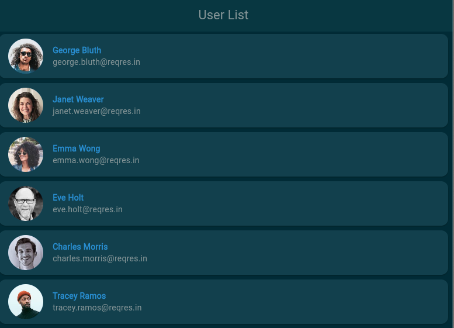


## Sample UI 

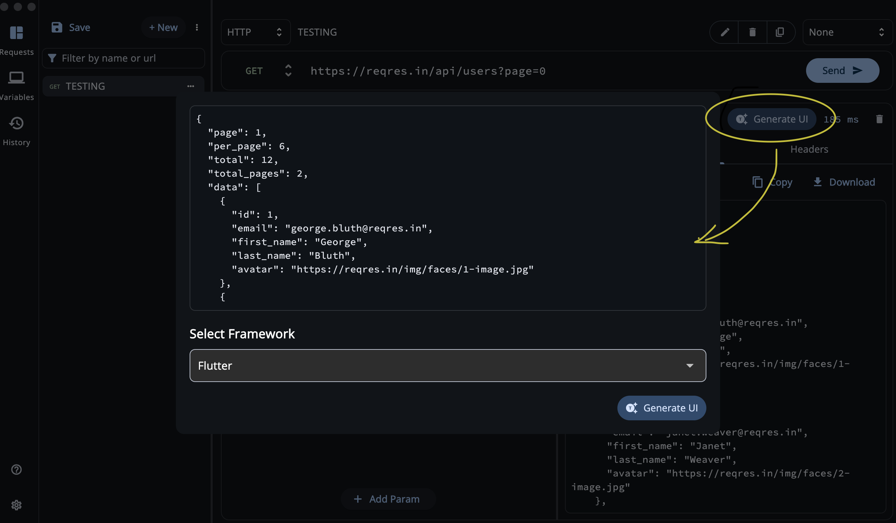
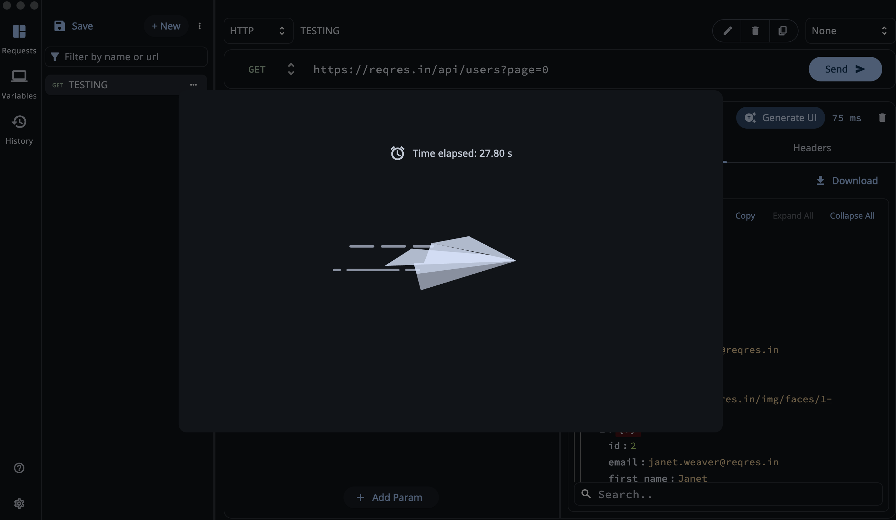
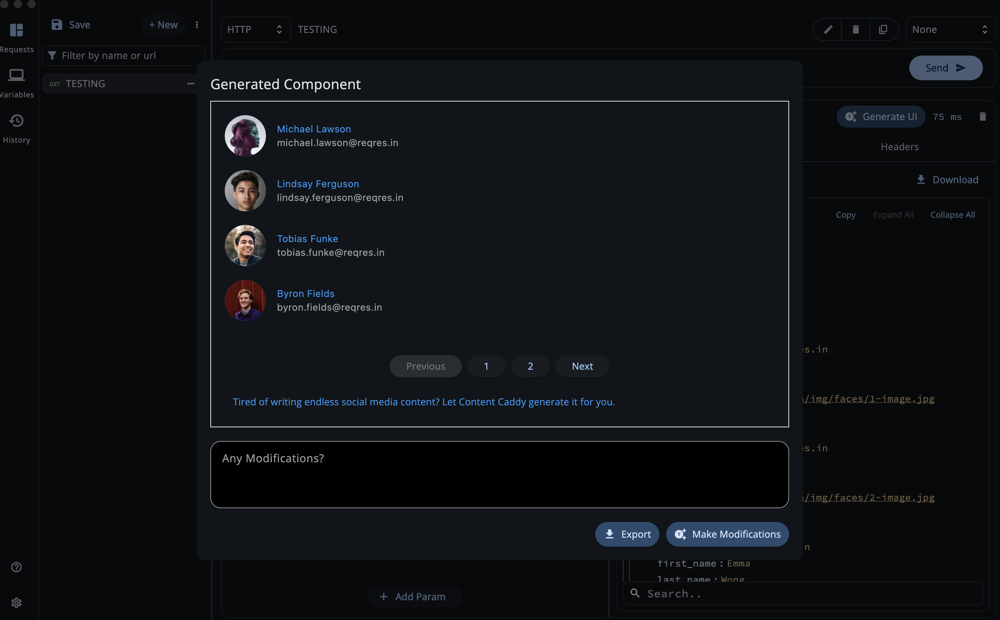
If any modifications are made, it will go back to loading screen and come back to this page with the relevant modifications.
When Export is clicked, the relevant generated code is **copied to clipboard** and the dialog closes!

### Proof of Concept (PoC)
A Simple and elegant prototype has been created for the entire pipeline. It hightlights the whole process of Response Sentiment Analysis, YAML-based Intermediate Representation, JSON based SDUI generation and Final Code Export.
Prototype link: [https://github.com/synapsecode/AI_UI_designer_prototype](https://github.com/synapsecode/AI_UI_designer_prototype)

---
# Automated API Tool Generation

An API Tool Generator basically is a system to automatically generate functions or methods from a given API description which enables AI agents to interact with APIs on their own without any manual coding from our end.

This functionality is particularly useful for developers working on AI-driven applications, as it simplifies integrating external APIs into agent workflows, enhancing efficiency and reducing development time.

## Implementation Details

Since this is an agent application itself, we can reuse the `APIDashAIAgent` abstract class mentioned above to implement our agents needed for this task. This highlights its modular and easy-to-use nature.

`Supported Agentic Frameworks`: **OpenAI**, **LangChain**, Anthropic, **Gemini**,  Mistral, Microsoft Autogen
`Supported Programming Languages`: Python, JavaScript 

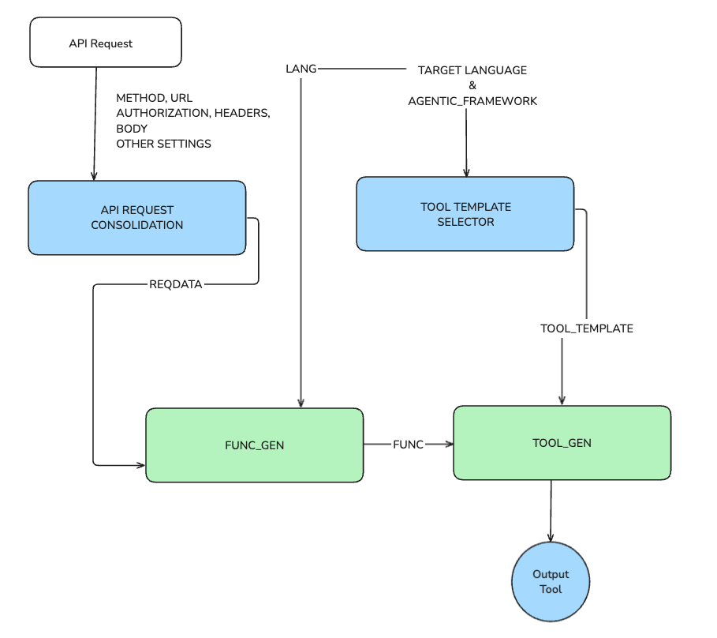

- **Step 1: API Request Consolidation:** We accept the incoming API Request and add all of the relevant data (method, url, headers, auth etc) into a single text object named `REQDATA` this will be useful for the previous steps.
- **Step 2: Tool Template Selector:** After doing some research, it appears that *API Tools* have a very limited number of templates.
		`example`: Tool Format used by Anthropic, Mistral, Gemini, OpenAI etc for python
	```python
	def func(...):
		#Provided API being called in the language specific way
		
	api_tool = {
		"function": func,
		"definition": {
			"name": TOOL_NAME,
			"description": TOOL_DESCRIPTION,
			"parameters": {
				"type": "object",
				"properties": {
					ARG_NAME: {
						"type": ARG_TYPE,
						"description": ARG_DESC
					},
				   ...
				},
				"required": [ALL_REQUIRED_ARGUMENT_NAMES],
				"additionalProperties": False #Anthropic Specific
			}
		}
	}

	__all__ = ["api_tool"] #Export the Tool
	```
	example: Tool Format used by Langchain
	```python
	from langchain.tools import StructuredTool
	class InputSchema(BaseModel): #Pydantic Model
		title: str = Field(..., description="...")
		...
	def func(...):
		#Provided API being called in the language specific way
	api_tool = StructuredTool.from_function(
		func=func,
		name="<TOOL_NAME>",
		description="<TOOL_DESC>",
		args_schema=InputSchema,
	)
	__all__ = ["api_tool"] #Exporting the Tool
	```
	and so on. Hence, We can easily store these as templates and substitute the variable values as needed.
- **Step 3: Func Gen:** We use the `APIDashAIAgent` class to create another agent called FUNC_GEN which accepts the `REQDATA` & Target language and converts it into a Function that calls the api
	example:
	```python
	import requests
	def func(data):
		try:
			response = requests.post("...", data=data)
			response.raise_for_status()
			return response.json()
	    except requests.exceptions.RequestException as e:
			print(f"Error: {e}")
		return {"error": "An error occurred while calling API"}
	```
- **Step 4: Tool Generation:** This simple agent takes the function generated from the previous step along with the selected template and combines them. `REQDATA` is used to fill in the variables with contextual data.
- **Step 5: Tool Export:** The complete tool code can now be exported and used by the user as needed
 
## Week-wise Breakdown

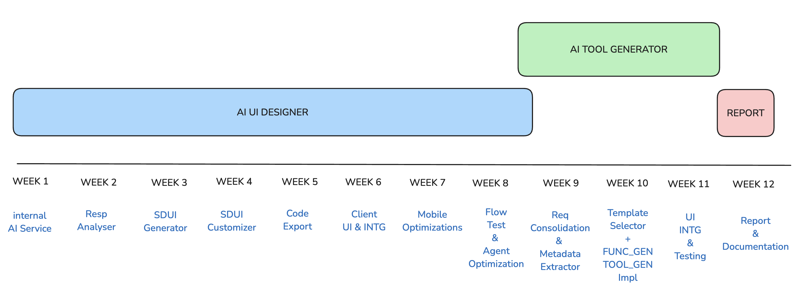

### Week 1 (Internal AI Service Development)
- Discuss Future Agentic needs for Smarter code structuring
- Implement the APIDashAIService & APIDashAIAgent core classes
- implement the call_ollama and call_provider LLM accessing functions
- Implement the proposed governor and orchestrator logic
- Implement Variable Replacement Feature for dynamic system prompts

 **DELIVERABLE**:  A Working version of the APIDashAIService with functional calls to both ollama and external LLM providers along with a working retry mechanism


###  Week 2 (Response Analyser Agent Development)
- Write a detailed System Prompt to extract Semantics from a Response
- Test Semantic output against various responses & tweak system prompt
- Write a detailed System Prompt to create a YAML-based internal representation UI Schema from a given API Response and test it against various responses
- Enhance the agent to intelligently omit unnecessary parts of the response in UI
-  Implement Validation & Formatting rules for the Semantic Analyser and IR-Gen bots

 **DELIVERABLE**:  A Working version of the complete Response Analyser agent that can accept a given API response and give both the complete Semantic Description & the YAML-based internal representation

###  Week 3 (Stac-SDUI Generator Agent Development)

- Iterate and decide on a robust system prompt that converts SA & IR into Flutter-SDUI 	 `Stac` Representation for UI Previewing
- Creation of a Stac-Error Detector to aid in retry mechanism for faulty generations 
- Write custom validation logic to deal with Stac's  nuances (eg: `bold` is not allowed as a fontWeight in Stac)
- Talk to Stac's team and apidash mentors to decide how to support certain widgets that are not available in the SDUI representation (eg: `ClipRRect`)
- Test out multiple API responses to see if the generated SDUI matches mentors' expectations, if not tweak the system prompt iteratively until satisfactory

 **DELIVERABLE**:  An agent that accepts the SA & IR from the previous step and converts it into an SDUI compatible "Stac" representation which is a JSON Server Driven UI Representation which can be useful for the upcoming Live Preview Feature
  
###  Week 4 (Natural Language UI Customization & Preview)

- Implement a bot named `StacModifier` that can make the user-requested changes on the fly to the previously generated `Stac` SDUI code
- Develop the Component Preview View using a custom implementation called `StacRenderer`
- Implement Validation & Formatting rules along with `Content Moderation` & `Guard-railing` rules to prevent unwanted modifications
- Test against various types of modification requests to ensure that the bot is capable of making a wide variety of changes 

 **DELIVERABLE**:  A working agent that accepts the previously generated SDUI representation along with the user's natural language prompt to make any requested changes on the fly. (eg: Convert this UI into a solarized theme, should result in the solarized version appearing as a UI preview)

###  Week 5 (Code Export: SDUI → Flutter Code)

- Create the System Prompt for an agent named `Stac2Code` to convert SDUI-JSON into valid Flutter Code
- Create the necessary Validation & output formatting code (eg: removing triple backtick notation and so on) to ensure that the generated component is ready to be directly copy-pasted into the user's IDE
-  As SDUI is a JSON representation, once the code generation is stable, we can explore the conversion of it into other frameworks like NextJS too. 
- Run the Code export action on a varity of generated `Stac` representations to see if the resultant Flutter code works as expected in a reliable manner

 **DELIVERABLE**:  By the end of the week, we will have an agent that converts the previously generated SDUI code into a fully working Flutter Component (that can be tested on Online IDEs). This will mark the end of the AI-UI-Designer pipeline requirements

###  Week 6 (APIDash Client Specific UI Changes)

- Create the UI & implementation in the settings page to have an option to select your AI Engine (ollama or custom) and in case it is custom, add an option to pass your API Key and select the provider
- Write the implementation to persist this data and use it for all other agentic actions (LLMKeystore Implementation)
- Work on the secure storage of these API Keys to prevent leaks and theft
- Create the UI screens as shown above in the Sample UI Section
- Integrate the whole UI generation pipeline into the frontend and delete any prototype UI screens created during prior development

 **DELIVERABLE**:  By the end of the week, we will have a new api dash client with the settings UI modified to include a `AI Engine` selector and a `LLM Api Key` field.
 Additionally we will have the UI implemented for the whole UI generation pipeline created and integrated with the described agents.

###  Week 7 (Mobile Specific Changes)

- Since apidash works on mobile too, this week will be used to convert all the existing desktop-styled UI components into mobile friendly UI components
- ollama is not accessible via localhost on a phone, hence on mobile devices we must include a textbox in the settings page so that the user can paste their hosted ollama instance link (they must also be able to select their model of choice)
- Creation of a tab based layout in the UI Previewer screen to ensure that the UI Preview and code display are not too crammed up.
- The export code button should ideally open up the mobile-os specific share sheet to make it easier to share the generated component code
- Additional Tasks that were pending or put into backlog from the earlier weeks can be completed here.

 **DELIVERABLE**:  By the end of the week, the complete working pipeline that was available on desktop will also be available on a mobile platform (Android, iOS). The UI will be modified to better fit the smaller screen size and the feature will now be ready for next week's complete flow testing

###  Week 8 (Complete Flow Testing & Agent Optimization)

- For each bot created in the pipeline, we must rigorously run manual tests on different types of inputs and check if they match the expectations. The data generated from these tests must be noted down in a separate report
- Discuss with mentors to implement proper code testing strategy to ensure that the whole pipeline is tested both on a unit basis and entire flow basis. This allows us to eventually pass this whole feature into an automated testing suite
- The agents that need tweaking/optimization will have their System prompts modified to yield better results. 
- All the code written until now should be carefully inspected for side-effects, possible loopholes and so on. Work with the mentors to make the written code classified as `production-ready`

 **DELIVERABLE**:  By the end of the week, we will have clarity on an automated testing strategy along with written tests as well as a manual testing report. This will give an idea if the entire pipeline is working according to the mentors' expectations or not.

###  Week 9 (Request Consolidation & Metadata Extractor)

- Implement input parsing logic to extract METHOD, URL, HEADERS, BODY, PARAMS, AUTH, etc., and consolidate into `REQDATA`
- Accept inputs `AGENTIC_FRAMEWORK` and `TARGET_LANGUAGE` and implement the UI to do so
- Implement Changes to the AI UI Designer to accomodate pagination, sorting, filtering and other features requested in the project description. This should be easy to do for an LLM agent as they are standard code actions.


 **DELIVERABLE**:  A working module that accepts API specifications and user inputs, and outputs a unified REQDATA. 

###  Week 10 (Template Selector and FUNC_GEN, TOOL_GEN Implementation)

- Design reusable templates for tool definitions across frameworks: OpenAI, Gemini, Mistral, Anthropic, LangChain, and Autogen.
- Implement a simple rule-based tool selector which can select the relevant template based on  `AGENTIC_FRAMEWORK` and `TARGET_LANGUAGE`
- Creation of the **FUNC_GEN** Bot that can convert a given API Request into a piece of language-specific code which calls the API and returns its value
- Creation of the **TOOL_GEN** Bot that can convert the selected Template and Generated Function into a fully functional API Tool 

 **DELIVERABLE**:  A Rule based Tool Selector that can reliably return the relevant template based on inputs and the complete FUNC_GEN and TOOL_GEN working agents

###  Week 11 (UI Integration & Tool Testing)

- Integrate this newly created pipeline with the existing apidash application
- Test with multiple examples to confirm that both of the bots are working properly
- Any pending tasks from the previous weeks can be completed here

 **DELIVERABLE**:  The Entire Product fully working & Tested: AI UI Designer + API Tool Generator

###  Week 12 (Report & Documentation)
- The Documentation for the entire pipeline to be written in this period along with the final GSoC Report. 
 
 **DELIVERABLE**:  Technical Documentation & GSoC Report
 
---

## Relevant Skills and Experience

  
### Skills

- Languages: Dart, Python, Java, Javascript, Typescript, Go
- Frameworks / Libraries: Flutter, Flask, FastAPI, SpringBoot, ReactJS, NextJS, Tailwind
- Databases & Tools: PostgreSQL, Supabase, Firebase, MongoDB, Git, Docker, Cloudflare Workers, Dify.ai, n8n

  

### Experience

-   Lead Developer at [Crezam](https://crezam.com) (AI Powered assessments and interview platform); Extensive work on Flutter for Mobile, Web and MacOS platforms
-   Flutter Developer for [Atlas Knowledge](https://atlas.fm/) which is a bookmark based second-brain
-   Flutter Developer at [FitchoiceWorld](https://www.fitchoiceworld.com/) which is a fitness centre booking & wellness application
-   I have a lot of experience with Flutter Web and MacOS including creation of platform specific code and then calling them via bridges/interop channels.
- Experience with using Agentic tools such as Dify to handle GenAI specific tasks
    


## Projects

- **Microblogger**
	- A full scale social media application built using Flutter and Flask which includes a wide variety of posts, stories and interactive content fully built from scratch. The whole process was thoroughly documented under my 100 days of code challenge
	- Github: [https://github.com/synapsecode/MicrobloggerV1](https://github.com/synapsecode/MicrobloggerV1)
	- Public Build Log: [https://tulip-quality-7a5.notion.site/Microblogger-Builds-0b6f44eece5b419ca57f8a431e03ad2c](https://tulip-quality-7a5.notion.site/Microblogger-Builds-0b6f44eece5b419ca57f8a431e03ad2c)

 
- **FFPNS (Flutter Firebase PushNotifications Service)**
	- A package that I created to make it extremely simple to integrate firebase push notifications into a fluter app with minimal setup & advanced features such as background message handling and so on
	- Github: [https://github.com/synapsecode/ffpns](https://github.com/synapsecode/ffpns)
  

### More About Me
I’m Manas M. Hejmadi, a third-year Computer Science & Engineering student at DSCE. With a strong foundation in **Mobile & Desktop Development**, **Backend Engineering**, **Microservices** and **AI Integrations**, I am passionate about building good software at a rapid pace.
I have nearly **6 years of experience in Flutter**, along with extensive experience in other technologies such as **Flask**, **NodeJS**, **NextJS**, **Celery**, **Docker**, **SpringBoot**, **Java**, and **Svelte**. Currently, I lead a team of 3 developers at [Crezam](https://www.crezam.com/), where we are focused on revolutionizing the hiring process through **AI-powered assessments and interviews.**
I also actively participate in hackathons and tech events, earning second place in **IIT Roorkee’s App Innovation Challenge**. I am particularly interested in leveraging AI agents to create more powerful, user-centric applications.
