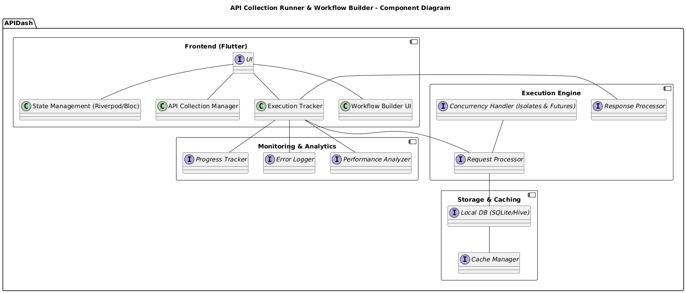
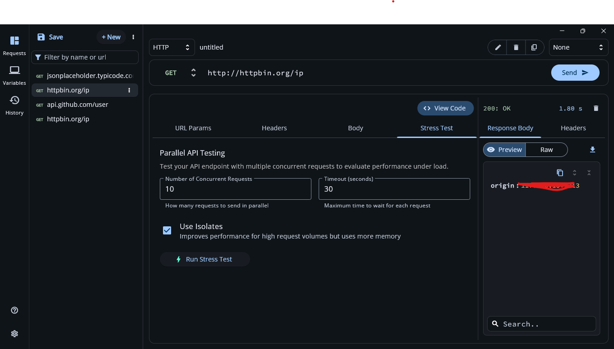
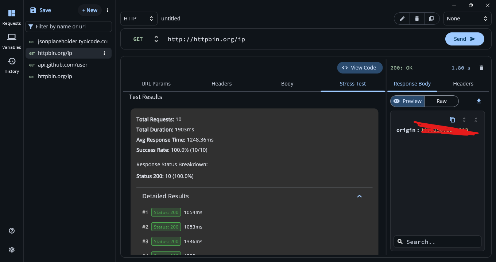
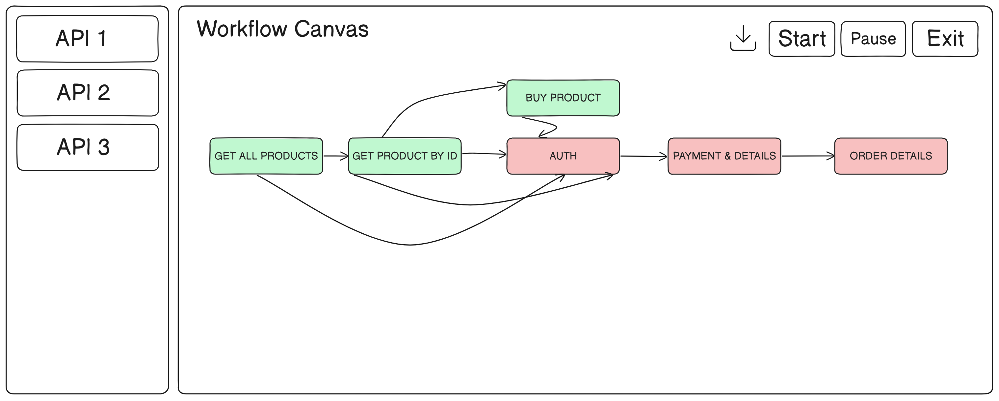
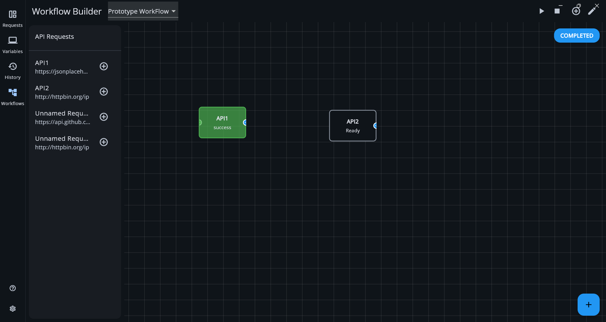

### GSoC Proposal

## About

**Full Name**: Abhinav Sharma  

**Contact Info**: abhinavs1920bpl@gmail.com, +91 9479960041  

**Discord Handle**: abhinavs1920  

**GitHub Profile**: [github.com/abhinavs1920](https://github.com/abhinavs1920)  

**Twitter, LinkedIn, Other Socials**: [linkedin.com/in/abhinavs1920](https://linkedin.com/in/abhinavs1920)  

**Time Zone**: Indian Standard Time (IST)  

**Resume**: [https://bit.ly/4iEPEkZ](https://bit.ly/4iEPEkZ)  

## University Info

**University Name**: ABV-Indian Institute of Information Technology and Management, Gwalior  

**Program**: Btech. Information Technology  

**Year**: 3rd Year  

**Expected Graduation Date**: May 2026  

## Motivation & Past Experience

**Have you worked on or contributed to a FOSS project before?**  
Yes, I have contributed to various FOSS projects, including APIDash. Here are some relevant PRs and repository links:  
- [Implemented Fake Data Providers for API Dash to streamline testing](https://github.com/foss42/apidash/pull/777)
- [Feature that allows users to configure and use a proxy for their HTTP requests within the API Dash](https://github.com/foss42/apidash/pull/544)  
- [Support for running multiple API requests in parallel](https://github.com/foss42/apidash/pull/734)  
- [Support for fetching environment variables directly from the OS in API Dash](https://github.com/foss42/apidash/pull/662) 
- [Implementation of in-app update check feature for APIDash](https://github.com/foss42/apidash/pull/660)  
- [Updated the .env.template to use SERVER_CLIENT_ID instead of GOOGLE_SIGNIN_ANDROID_CLIENT_ID](https://github.com/AOSSIE-Org/Monumento/pull/229)  
- [Addressed the issue of unhandled exceptions when loading environment variables from a .env file](https://github.com/AOSSIE-Org/Monumento/pull/215)  
- [Dependency upgradation in Talawa](https://github.com/PalisadoesFoundation/talawa/pull/2353)  

**What is your one project/achievement that you are most proud of? Why?**  
As part of the core engineering team, I collaborated with product managers and designers to prototype Neo, an AI-powered productivity assistant. My key contribution was architecting the natural language processing (NLP) pipeline that powers its automation features. Working closely with backend engineers, I developed models to extract user intent, deadlines, and emotional cues from voice/text inputs, which enabled features like smart scheduling and action plan generation. To ensure scalability, I integrated hybrid logic (ML models + rule-based systems).

The cross-functional effort paid off – our team’s prototype was showcased on Shark Tank India, securing funding from 3 investors. This experience taught me how to balance technical innovation with product thinking in fast-paced, collaborative environments.

[App URL](https://play.google.com/store/apps/details?id=xyz.neosapien.neo) 

Earlier, I engineered MapIt (a Flutter-based location-note app) to solve spatial memory challenges. It integrated geofencing, Google Maps, and battery-efficient background services. The complex dance of optimizing Dart Isolates for asynchronous geolocation tracking – ensuring notifications fired reliably even with the app closed – taught me valuable lessons in state management and performance tuning.

Both projects pushed me to solve critical technical hurdles: Neo demanded scalable architecture for real-time voice/data processing, while MapIt required deep platform-level understanding of Android/iOS background execution limits. Together, they reflect my focus on building systems that augment human capabilities through thoughtful technical design.

[Project URL](https://github.com/etackel/mapit_mobile) 


**What kind of problems or challenges motivate you the most to solve them?**  
I love working with Flutter and creating automation solutions for real-world problems that help users worldwide. The ability to build applications that streamline workflows, reduce manual effort, and enhance user experience excites me the most. I strive to solve practical problems that users face daily by developing scalable and user-friendly applications. My passion lies in integrating different technologies, optimizing performance, and refining processes to improve developer productivity. Whether it's automating API testing, optimizing background processes, or designing intuitive UI/UX solutions, I always aim to create impactful applications that make a difference.  

**Will you be working on GSoC full-time?**  
Yes, I will be dedicating my full time to GSoC till end of July, then after that I would be able to give 15-20 hours per week due to my coursework.  

**Do you mind regularly syncing up with the project mentors?**  
Not at all, I am comfortable with regular sync-ups.  

**What interests you the most about API Dash?**  
The ability to create automated API workflows excites me. I am particularly interested in designing an intuitive UI/UX for API testing and workflow automation. API Dash is built using Flutter, a lightweight, multi-platform framework that ensures smooth performance across different operating systems. With frequent updates and contributions from a dedicated open-source community, API Dash evolves continuously to meet developer needs. It offers a seamless alternative to API testing tools like Postman, focusing on simplicity, efficiency, and scalability. Being part of a project with an active and growing contributor base excites me, as it presents opportunities to improve developer workflows and enhance automation capabilities in API testing.  

**Can you mention some areas where the project can be improved?**  
- Enhanced error handling mechanisms in API requests.  
- More detailed analytics and logging for API testing.  
- Ability to export and share API test results easily.  
- Sync API test cases using authentication providers such as OAuth, Google Sign-In, and GitHub authentication.  
- Implement a search bar for different features, improving navigation and usability.  
- Expand the Testing Suite with additional validation mechanisms.  
- Enhance the Workflow Builder with better API chaining and conditional logic.  
- Improve the Collection Runner with parallel execution and scheduled runs.  
- Implement an API Monitor with real-time tracking and alert notifications.

## Proposal Title

**Enhancing API Testing Suite in APIDash: Collection Runner, Workflow Builder & Monitoring**

## Abstract

APIDash is an open-source lightweight API testing and management tool built using Flutter. In this project, I will extend its capabilities by integrating an advanced API Testing Suite, featuring:

- **Collection Runner** – I plan to implement the ability to execute batch API requests sequentially or in parallel.

- **Workflow Builder** – I aim to create a drag-and-drop UI for creating API request workflows with conditional logic.

- **API Monitoring & Analytics** – I will develop real-time monitoring, failure alerts, and execution insights.

By integrating these features, I will enhance APIDash to provide an end-to-end API testing solution, improving efficiency and usability for developers.

## Detailed Description

### Key Features by Priority:

#### P0 (Must-Have Core Features):
- **Collection Runner**: I plan to develop functionality to automate batch API executions, along with variable data payload sending ability.
- **API Validation Testing**: I intend to implement schema validation and assertion checks.
- **Workflow Builder**: I aim to create a drag-and-drop API request chaining interface.
- **Monitoring System**: I will implement a system to track API responses and errors.

#### P1 (High-Value Additions):
- **Performance Testing**: I aim to create tools to measure API performance under load.
- **Integration Testing**: I need to ensure seamless interactions between APIs.
- **Security Testing**: I plan to develop features to identify vulnerabilities & secure endpoints, along with detection of security breaches like script injection.
- **Scalability Testing**: I will implement features to ensure APIs scale efficiently.
- **Automated fake data generation**: I plan to implement functionality to generate diverse and random data to send with the API requests.

#### P2 (Extended Capabilities):
- **Sync with authentication providers**: I plan to integrate authentication services for seamless API test management.
- **Implement a global search bar**: I aim to add functionality for quick navigation and feature discovery.
- **Export API test results**: I plan to implement functionality to export API test results in various formats, such as CSV, JSON, or PDF.
- **Performance Insights** - Create load testing tools with flexible metrics integration (Prometheus optional) for monitoring and alerting.

**AI-Enhanced Features (if time permits):**

- **AI-Assisted Test Case Generation**: I plan to develop functionality to automatically generate diverse and random API test cases by analyzing historical API data or API documentation, ensuring extensive coverage of edge cases.

- **Predictive Performance Optimization**: I aim to implement predictive analytics to forecast API load impacts and dynamically adjust test parameters for optimal performance.

### Tech Stack:

- **Frontend**: Flutter (Dart)
- **State Management**: Riverpod, Provider
- **Backend**: Firebase or Node.js/Golang (if required for logging and monitoring)
- **Testing Framework**: Postman alternatives, automated test scripts
- **AI-Model**: Gemini or similar (If Required)
- **Monitoring & Alerting Toolkit**: Prometheus



### Integration with APIDash Architecture

The proposed features will integrate seamlessly with APIDash's existing architecture:

**State Management**: I plan to use APIDash's Riverpod-based state management pattern by creating new providers for Collection Runner and Workflow states, following patterns in existing files like `lib/providers/collection_state_provider.dart` and `lib/providers/selected_request_provider.dart`.

**Data Persistence**: I aim to use APIDash's Hive implementation with new type adapters for workflow models and test results, maintaining the existing pattern in `lib/services/local_db_service.dart`.

**UI Components**: I will build on the APIDash Design System components, ensuring consistent styling by extending widgets from `apidash_design_system` package. New UI elements will follow the existing Material Design implementation.

**Cross-Platform Support**: I plan to ensure all new features work across desktop, mobile, and web platforms by avoiding platform-specific code and using Flutter's responsive design patterns to adapt layouts for different screen sizes.

## Project Plan for Enhancing APIDash

### Phase 1: Research & Planning (Weeks 1-2)
**Objective:**  
My first task will be to analyze the existing APIDash codebase, identify integration points, and finalize the technical approach.

#### Week 1: Codebase Analysis & Technical Research
**Codebase Understanding:**  
- I plan to thoroughly analyze APIDash's architecture, including request execution, storage, and UI components.  
- My goal is to identify reusable components to minimize redundant implementation.

**Integration Points Identification:**  
- It's essential for me to locate areas where new features (API collection management, batch execution, workflow automation) can be integrated.  
- I need to identify dependencies and potential conflicts with existing modules.

#### Week 2: UI/UX Planning & Tech Stack Finalization
**Technical Approach Finalization:**  
- I'm going to define data structures for API collections and workflows.  
- My approach includes evaluating local storage solutions (such as SQLite or Hive) versus cloud-based options, considering potential future expansion to cloud synchronization.  
- I need to carefully assess appropriate tools for batch execution, such as threading, isolates, or queue-based execution. The current approach involves utilizing isolates and Future.then() for concurrent API testing. Please see PR [Stress Testing](https://github.com/foss42/apidash/pull/734)

**UI/UX Design:**  
- I'll be creating wireframes for new UI components like API collection manager, workflow builder, and test suite dashboards.  
- My designs must align with APIDash's existing UI framework.

### Phase 2: Enhancing API Collection Management (Weeks 3-4)
**Objective:**  
My focus here is to improve how APIs are grouped, labeled, and managed in APIDash.

#### Week 3: Storage & Metadata Enhancements
**Data Structure Implementation:**  
- I intend to define models for storing API collections, including metadata (labels, groups, tags, last-run status).  
- My implementation must ensure efficient data retrieval by utilizing indexes and caching mechanisms. I plan to cache the most frequently executed queries to enhance performance and reduce redundant computations. I also aim to implement a self flush mechanism for cache to reduce memory overhead.

**Database Integration:**  
- It's my responsibility to implement data persistence with Hive/SQLite for offline access.  
- I have to optimize queries for fast lookups and filtering.

#### Week 4: UI/UX Implementation & Testing
**UI Enhancements:**  
- My plans include implementing drag-and-drop organization of APIs within collections.  
- I aim to add robust search and filtering features.

**Testing & Optimization:**  
- I'll conduct customisable unit and integration tests to validate data consistency while providing standard performance metrics.  
- My goal is to optimize rendering performance for large collections.

### Phase 3: Implementing Collection Runner (Weeks 5-6)
**Objective:**  
I'm tasked with building a new Collection Runner feature from scratch to enable batch execution of API collections in sequential and parallel modes. This feature doesn't currently exist in APIDash and will be developed completely as part of this GSoC project. I've already created a prototype for its implementation.

#### Week 5: Execution Engine Enhancements
**Batch Execution System Design:**  

- I need to implement task queues for running multiple API requests by extending the existing HTTP client functionality in `lib/services/api_client.dart` to handle batched requests.

- My approach involves ensuring concurrency control using isolates, leveraging Flutter's compute API for background processing similar to other computationally intensive operations in APIDash.

**Status Tracking Mechanism:**  
- As part of this implementation, I must store execution logs, timestamps, and error responses.  
- I intend to provide a real-time execution progress tracker by rendering each API response as soon as it is received, rather than waiting for all requests to complete. I'm planning to handle responses in the background and update the UI incrementally. This ensures a smooth user experience, especially for large batch executions, by preventing UI freezes and displaying progress dynamically.

#### Week 6: UI/UX Integration & Testing
**UI Enhancements:**  
- It's crucial that I display live execution logs.  
- I aim to provide options for retries and error handling.

**Testing & Performance Optimization:**  
- My testing strategy includes running stress tests for handling large API collections.  
- I plan to optimize response rendering speed in UI by implementing lazy loading and streamlined UI updates.

Current Prototype:





### Phase 4: Developing Workflow Builder (Weeks 7-8)

**Objective:**  
For this phase, I'm planning to implement a drag-and-drop workflow builder for automating API requests, using a Directed Acyclic Graph (DAG) to represent and manage dependencies between nodes.

#### Week 7: Backend & Data Modeling
**Workflow Engine Implementation**  
In this approach, my goal is to represent each API request as a node in the DAG, and edges will indicate the sequence in which requests should execute.

- I need to display successful requests in green (indicating an HTTP 200 status), while failed requests will be shown in red, instantly signaling an error state.
- My implementation includes a central state repository using Riverpod providers that stores API request outputs (headers, bodies, tokens) in memory during workflow execution. This state repository will follow APIDash's existing pattern of immutable state objects while providing a mechanism for downstream nodes to access upstream outputs.

Here's an implementation of the topological sort algorithm that will be used for executing API workflows in the correct order:

```dart
List<ApiNode> topologicalSort(List<ApiNode> nodes) {
  final sortedNodes = <ApiNode>[];
  final inDegree = Map<ApiNode, int>.fromIterable(nodes, value: (_) => 0);
  
  // Calculate in-degree for each node
  for (final node in nodes) {
    for (final dep in node.dependencies) {
      inDegree[dep] = (inDegree[dep] ?? 0) + 1;
    }
  }
  
  // Initialize queue with nodes having no dependencies
  final queue = nodes.where((n) => inDegree[n] == 0).toList();
  
  // Process nodes in topological order
  while (queue.isNotEmpty) {
    final node = queue.removeLast();
    sortedNodes.add(node);
    
    // Update in-degree of dependencies
    for (final dep in node.dependencies) {
      inDegree[dep] = (inDegree[dep] ?? 0) - 1;
      if (inDegree[dep] == 0) queue.add(dep);
    }
  }
  
  return sortedNodes;
}
```
- I'm planning to implement execution controls with start, pause, and exit flags, allowing the workflow to be initiated, temporarily halted, or completely terminated without losing progress.

**Conditional Execution Support**  
A key part of my design incorporates if-else branching based on API response conditions. For instance, if a request fails, the workflow can either retry, skip subsequent steps, or halt altogether.

- I also want to enable looping and re-execution of failed requests when appropriate, ensuring the workflow can handle transient errors or timeouts gracefully.



### Week 8: UI/UX Development & Testing

**Drag-and-Drop Interface Implementation**  
My approach involves providing an interactive canvas where users can drag and drop API request nodes, then connect them with directional edges to define execution order.

- I'm planning to implement nodes that offer a floating prompt on click, displaying request and response details in real time for quick debugging and validation.

**Testing & Debugging**  
It's critical that I validate complex workflows involving multiple requests, dependencies, and branching conditions.

- My testing strategy includes monitoring memory consumption and performance, ensuring large or long-running workflows do not degrade the user experience.
- I aim to include an export feature that saves the workflow's execution results in JSON format, allowing teams to share and review outcomes easily.

Current Prototype:



### Phase 5: API Testing Suite (Weeks 9-10)
**Objective:**  
In this phase, I need to develop a completely new API Testing Suite to validate API responses with schema validation and assertions. This functionality will be built from the ground up as it's not currently implemented in APIDash.

#### Week 9: Validation & Assertion Mechanisms
**Schema Validation Implementation:**  
- My plans include supporting JSON Schema validation.  
- I'm committed to ensuring compliance with OpenAPI specifications. [Schema Guidelines](https://spec.openapis.org/oas/latest.html#schema)

**Response Assertion System:**  
- My implementation will allow users to define conditions like status code checks, response time limits.  
- I intend to implement support for regex-based validations. [Helpful Resource](https://confluence.atlassian.com/proforma/regex-validation-1087521274.html) 

#### Week 10: Performance & Security Testing
**Load Testing Module:**  
- As part of this work, I'll create simulations for high-traffic scenarios.  
- My testing framework will measure API response latency and throughput.

Below is a sample implementation of the load testing scheduler that will generate request timestamps based on the test configuration:

```dart
List<int> generateRequestTimestamps(LoadTestConfig config) {
  final timings = <int>[];
  
  // Handle concurrent users simulation
  if (config.type == LoadTestType.concurrentUsers) {
    // For concurrent users, all requests start at the same time
    timings.addAll(List.filled(config.value, 0));
  }
  
  // Handle requests-per-second simulation
  if (config.type == LoadTestType.rps) {
    // Calculate interval between requests in milliseconds
    final interval = (1000 / config.value).round();
    // Generate evenly spaced timestamps
    timings.addAll(List.generate(config.value, (i) => i * interval));
  }
  
  return timings;
}
```

**Security Testing Integration:**  
- I intend to build systems to detect vulnerabilities like CORS misconfigurations, exposed secrets.  
- My goal is to provide warnings for common API security flaws.  
- I plan to implement detection of injections of malware scripts.

### Phase 6: Monitoring & Analytics (Weeks 11-12)
**Objective:**  
- For this phase, I'm focused on creating a simple monitoring UI with request history, error counts, and response time displays using Flutter charts package for visualization, integrated within the existing tabbed request details interface.

#### Week 11: Monitoring System Design
**Identify Key Metrics:**  
- My monitoring system needs to track response times, error rates, and API usage trends.  
- I'm planning to design low-overhead logging mechanisms. My approach includes implementing asynchronous logging and batching techniques. I'll design a singleton LogHandler to buffer log messages in-memory and periodically flush them to persistent storage (e.g., Hive or SQLite) using a timer, ensuring non-blocking operations. I plan to utilize Dart's logging package with log levels to limit verbosity, reducing unnecessary overhead.

**Architecture Planning:**  
- In my architecture, I'll store analytics data using APIDash's existing Hive-based persistence layer, extending the current data models to include metrics and monitoring information. This maintains consistency with the app's architecture while leveraging Hive's fast key-value lookups for time-series metrics. 
- I want to implement a buffer-based collection approach for monitoring data that batches metrics before storage, utilizing Dart's Isolates for background processing to prevent UI thread blocking. This approach reduces disk I/O operations and keeps memory usage minimal.

#### Week 12: UI Development & Alerting System
**Dashboard Implementation:**  
- My UI development includes building a real-time monitoring dashboard.  
- I plan to provide visual graphs and filtering options.

**Alerting System:**  
- As part of the alerting framework, I'll implement notifications for users of failures via email, in-app alerts, or webhooks (if required in the future extension).  
- I want to allow customizable alert thresholds.

### Phase 7: Testing & Optimization (Weeks 13-14)
**Objective:**  
My focus during this phase is to conduct final testing, fix performance bottlenecks, and optimize UI/UX.

#### Week 13: Unit & Integration Testing
**Unit Testing Coverage:**  
- My testing plan involves implementing comprehensive unit tests using Flutter's test package, focusing on critical components like execution engine, data transformations, and UI state management. I aim to target key modules rather than arbitrary coverage percentages, with mock HTTP responses for API-dependent tests.
- I need to thoroughly validate API execution logic.

**End-to-End Testing:**  
- It's essential that I test workflows in real-world scenarios.  
- I plan to identify and fix unexpected edge cases.

#### Week 14: Performance Optimization
**Optimize Execution Engine:**  
- My optimization strategy includes reducing API execution time through parallelization and caching.

**Improve UI Responsiveness:**  
- I'm committed to optimizing large collection handling.  
- I aim to enhance loading speeds with efficient state management.

### Phase 8: Documentation & Submission (Week 15)
**Objective:**  
My final phase focuses on preparing final documentation and demonstration materials.

**Developer Documentation:**  
- I'll write detailed API and system architecture documentation.

**Final Demo & Submission:**  
- I need to prepare a comprehensive video walkthrough.  
- I'll submit codebase with release notes and test results.

### Expected Outcomes
- A fully functional API testing suite with workflow automation capabilities.
- An intuitive UI/UX for managing API collections and tests.
- Comprehensive documentation for end users and developers.

### Project Scope and Flexibility

To ensure project completion within the GSoC timeline, I've prioritized features as follows:

**Core Deliverables (Must-Have):**
- Collection Runner with basic sequential and parallel execution
- Simple Workflow Builder with linear API chaining
- Basic API validation testing
- Security testing features
- Automated fake data generation for API testing to reduce manual work

**Extended Goals (If Time Permits):**
- Advanced workflow conditionals and branching
- Performance testing capabilities
- Flexible metrics integration: Giving users options to either set up their own Prometheus server to scrape metrics from APIDash's exposed endpoint or use APIDash's built-in visualization of these metrics without requiring a full Prometheus server setup

**Stretch Goals (Post-GSoC):**
- AI-enhanced features
- Advanced monitoring and analytics

Throughout the project, I will be working closely with mentors, maintaining frequent sync-ups and regular communication. I understand the importance of collaboration and will ensure that my implementation aligns with APIDash's vision by staying in constant touch with the mentor team for guidance, feedback, and code reviews.

For me, this prioritization ensures the right features are delivered at time.

Looking forward to contributing!
