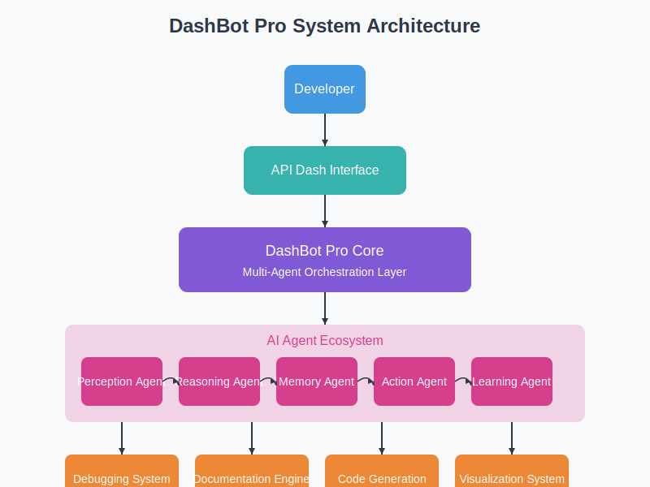
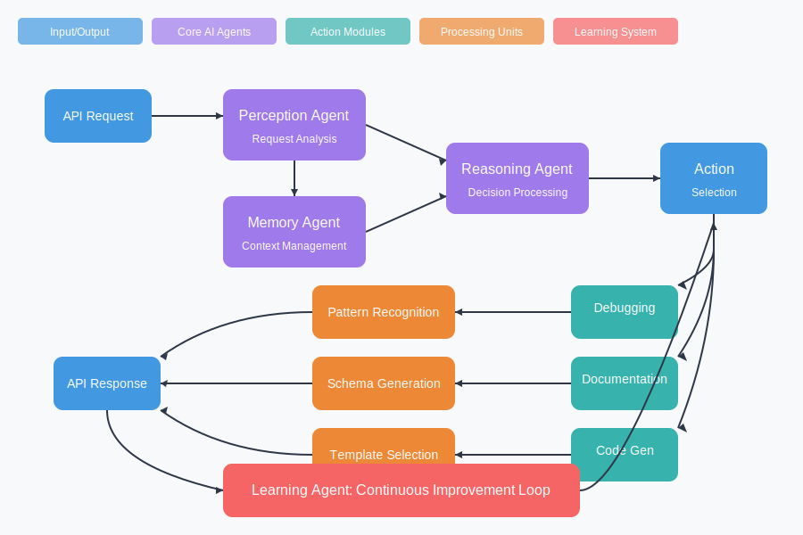
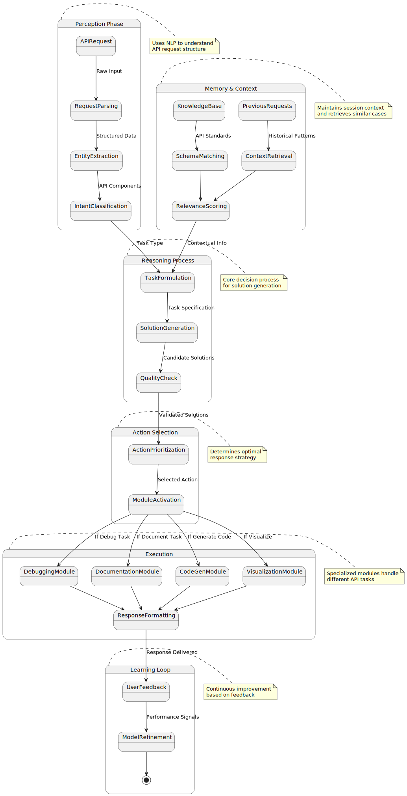

# API Dash Intelligent Assistant (DashBot)

### **Proposal by Aman Gupta, IIT Mandi(175005)**  
**Email:** aman07112006@gmail.com  
**Phone:** +91-7597759385  
**GitHub:** [Click Here](https://github.com/Aman071106)  
**LinkedIn:** [Click Here](https://www.linkedin.com/in/aman-gupta-730694323/)
**Discord Handle:** amanguptacd_46920
#### **Institute:** IIT- Mandi(B.Tech in Computer Science and Engineering)
**Resume Link**: [Click Here](https://github.com/Aman071106)  
---

## 1. Executive Summary

**DashBot Pro** represents a paradigm shift in API development ecosystems by seamlessly integrating an advanced AI-powered assistant directly into API Dash. This intelligent system goes beyond traditional development tools by providing contextual understanding, proactive debugging, automated documentation, and intelligent code generation—all while continuously learning from developer interactions to deliver increasingly personalized support.

By harnessing cutting-edge AI agent architecture and machine learning pipelines, DashBot Pro will transform API Dash into a comprehensive development companion that anticipates needs, solves complex issues, and accelerates development workflows across the entire API lifecycle.

---

## 2. Technical Expertise & Qualifications

### Core Technical Competencies:

| Domain | Technologies & Skills |
|--------|----------------------|
| **Full-Stack Development** | Flutter, Kotlin, Node.js, Express, TypeScript |
| **Blockchain & Smart Contracts** | Solidity|
| **Cloud & Backend** | Firebase, MongoDB, PostGreSQL, mySQL, AWS|
| **Data Science & ML** | Python, NumPy, Pandas, Scikit-learn |
| **AI/NLP & Intelligent Agents** | LangChain, Transformers, NLTK, spaCy, GPT integration, Pathway, FetchAI |
| **API Development** | REST, OpenAPI, OAuth |
| **Competitive Programming and DSA** | C++, Python, Advanced DSA |

### Relavant and Notable Achievements and Projects:

- **🏆 Third Place, Fetch.ai AI Agent Hackathon (2025)**: Developed an autonomous rag powered finance assitant in 48 hours showcasing exceptional ai agents and api handling
- **🚀 Developer in Institute App-Vertex**: Integrated external APIs with Flutter app

---

## 3. Project Vision & Innovative Approach

### Transformative Impact:

DashBot Pro will revolutionize the API development experience by:

1. **Reducing Debug Time** through intelligent pattern recognition and proactive error detection
2. **Automation of Documentation Tasks** via contextual understanding and dynamic example generation
3. **Accelerating Integration Speed** through framework-specific code generation with best practices
4. **Enabling Data-Driven API Design** through visual insights and interactive flow diagrams
5. **Providing Continuous Learning** that adapts to individual developer styles and preferences

### Conceptual Innovation:

The core innovation lies in DashBot Pro's **Multi-Agent Collective Intelligence System**. Unlike traditional assistants that use a single large model, DashBot Pro employs specialized AI agents that collaborate to handle specific aspects of API development—from semantic understanding to code generation—creating a comprehensive, adaptive system greater than the sum of its parts.

---

## 4. Technical Architecture & System Design

### Core AI Agent Ecosystem:

DashBot Pro is built on a multi-agent architecture where specialized agents collaborate to deliver comprehensive API assistance:

1. **Perception Agent**: Analyzes API requests/responses, extracting semantic meaning and identifying patterns
2. **Reasoning Agent**: Processes information from the Perception Agent to draw conclusions and formulate responses
3. **Memory Agent**: Maintains contextual information about past interactions and API behaviors
4. **Action Agent**: Executes specific tasks based on reasoning outputs (code generation, documentation, etc.)
5. **Learning Agent**: Continuously improves system performance by analyzing interaction outcomes

### Architectural Components:

#### 1. **Cognitive Understanding Engine** 
- **Semantic Parser**: Extracts intent and entities from API requests and responses
- **Context Manager**: Maintains session state and historical knowledge
- **Intent Classifier**: Determines the developer's goals (debug, document, test, etc.)
- **Entity Recognition**: Identifies API endpoints, parameters, and response patterns

#### 2. **Advanced Debugging System**
- **Pattern Recognition Module**: Identifies common error signatures across similar APIs
- **Root Cause Analyzer**: Traces errors to their source through dependency chains
- **Solution Generator**: Provides targeted fixes based on error patterns and context
- **Learning Feedback Loop**: Improves solutions based on resolution success rates

#### 3. **Intelligent Documentation Engine**
- **Schema Extractor**: Automatically derives API structures from usage patterns
- **Example Generator**: Creates contextually relevant request/response examples
- **Markdown Processor**: Produces clean, structured documentation
- **Interactive Visualizer**: Generates dynamic API maps and relationship diagrams

#### 4. **Smart Code Generation System**
- **Framework Detector**: Identifies target frameworks and languages
- **Code Template Engine**: Maintains optimized patterns for different ecosystems
- **Best Practices Enforcer**: Ensures generated code follows security and performance guidelines
- **Adaptation Module**: Learns from developer code modifications to improve future generations

#### 5. **Visual Analytics Dashboard**
- **Performance Metrics Engine**: Tracks API latency, error rates, and usage patterns
- **Network Flow Visualizer**: Creates interactive diagrams of API dependencies
- **Anomaly Detection**: Highlights unusual patterns or potential issues
- **Trend Analysis**: Provides insights on API usage evolution over time

---

## 5. Technical Workflow & Component Interaction

### System Interaction Flow:

The diagram above illustrates the sophisticated workflow of DashBot Pro:

1. **Input Processing Stage**:
   - API requests/responses are intercepted by the system
   - The Perception Agent processes raw data to extract meaningful patterns
   - Context is established by the Memory Agent for consistent understanding

2. **Analysis & Decision Stage**:
   - The Reasoning Agent evaluates the processed information
   - Pattern matching against known API behaviors and error signatures
   - Decision trees determine optimal response strategies

3. **Execution Stage**:
   - The Action Agent implements the selected strategy
   - Tasks are distributed to specialized modules (debugging, documentation, etc.)
   - Results are formatted for developer consumption

4. **Learning Stage**:
   - The Learning Agent records interaction outcomes
   - Feedback loops improve future performance
   - Model weights are adjusted based on success metrics

### Agent Communication Protocol:

The multi-agent system employs a sophisticated communication protocol:

1. **Message Passing System**: Structured JSON objects enable seamless agent-to-agent communication
2. **Priority Queue**: Ensures critical tasks (like error resolution) receive immediate attention
3. **Shared Memory Space**: Maintains global context accessible to all agents
4. **Task Delegation Framework**: Dynamically assigns responsibilities based on agent specialization
5. **Conflict Resolution Mechanism**: Mediates when agents produce contradictory outputs

---

## 6. Technology Stack & Implementation Details

### Core Technologies:

| Category | Technologies |
|----------|-------------|
| **AI/ML Foundation** | PyTorch, TensorFlow, Hugging Face Transformers, LangChain |
| **Backend Infrastructure** | Node.js, FastAPI|
| **Frontend Integration** | Flutter |
| **API Processing** | OpenAPI Tools, GraphQL Codegen, REST Clients |
| **DevOps & Monitoring** | GitHub Actions |
| **Testing Framework** | Jest, Pytest, Cypress, k6 |

### Implementation Architecture:

The system implements a modular architecture with clear separation of concerns:

1. **Core Engine Layer**:
   - AI model orchestration
   - Agent communication protocols
   - State management system

2. **Service Layer**:
   - API analysis services
   - Documentation generation
   - Code synthesis modules
   - Debugging pipelines

3. **Integration Layer**:
   - API Dash plugin system
   - Event listeners and hooks
   - UI/UX components
   - Data visualization systems

4. **Infrastructure Layer**:
   - Model serving infrastructure
   - Data persistence mechanisms
   - Caching and performance optimization
   - Security and access control

---

## 7. Enhanced Project Timeline (12 Weeks, 175 Hours)

| Week | Focus Area | Key Deliverables | Technical Goals |
|------|------------|------------------|-----------------|
| 1 | **Project Foundation** | - Repository structure - CI/CD pipeline - Development environment | - Establish architecture fundamentals - Configure AI agent frameworks - Set up data collection pipeline |
| 2 | **Cognitive Engine (Alpha)** | - Base semantic parser - Initial context management - Agent communication protocol | - Implement entity recognition for API components - Create basic intent classification system - Establish multi-agent message passing |
| 3 | **Debugging System (Alpha)** | - Error pattern recognition - Basic root cause analysis - Solution template engine | - Train initial error classification models - Implement dependency chain analysis - Develop solution retrieval system |
| 4 | **Debugging System (Beta)** | - Advanced pattern detection - Interactive debugging flows - Solution effectiveness tracking | - Enhance error signature database - Implement correction suggestion engine - Create feedback collection system |
| 5 | **Documentation Engine (Alpha)** | - Schema extraction system - Basic example generation - Markdown rendering | - Develop API structure analyzer - Create documentation templates - Implement content organization system |
| 6 | **Documentation Engine (Beta)** | - Interactive diagram generation - Context-aware examples - Documentation versioning | - Integrate graph visualization library - Enhance example relevance algorithms - Implement documentation comparison tools |
| 7 | **Visualization System** | - Performance metrics dashboard - Network flow diagrams - Anomaly detection | - Develop metrics collection system - Create interactive visualization components - Implement statistical anomaly detection |
| 8 | **Code Generation (Alpha)** | - Framework detection - Base template system - Language-specific generators | - Create language detection models - Develop code template framework - Implement syntax validation |
| 9 | **Code Generation (Beta)** | - Multi-framework support - Best practices enforcement - Code optimization | - Expand framework-specific libraries - Implement security validation rules - Create performance optimization suggestions |
| 10 | **AI/NLP Enhancement** | - Advanced NLP processing - Context refinement - Learning system integration | - Fine-tune language models on API datasets - Enhance contextual understanding - Implement reinforcement learning from feedback |
| 11 | **Performance Optimization** | - System benchmarking - Latency reduction - Resource utilization | - Implement model quantization - Optimize inference pipelines - Create caching strategies |
| 12 | **Final Integration** | - Comprehensive testing - Documentation - Deployment package | - Perform end-to-end testing - Create user documentation - Prepare release package |

### Weekly Check-in Process:
- **Code Review**: Monday submissions for mentor feedback
- **Progress Reports**: Wednesday updates with metrics and blockers
- **Planning Sessions**: Friday meetings for next week's objectives

---

## 8. Evaluation Metrics & Success Criteria

### Quantitative Metrics:

| Dimension | Target Metrics |
|-----------|---------------|
| **Performance** | - Response time < 500ms for 90% of queries - Memory usage < 250MB for primary components - Support for processing 100+ API endpoints simultaneously |
| **Accuracy** | - >85% correct error diagnosis - >90% documentation completeness - >95% syntactically correct code generation |
| **Usability** | - <5 minutes setup time - >80% positive user feedback - >70% reduction in documentation time |
| **Learning** | - >15% improvement in accuracy after 1000 interactions - Adaptation to user-specific patterns within 20 uses |

### Qualitative Goals:

1. **Intuitive Integration**: Seamless workflow that feels like a natural extension of API Dash
2. **Developer Trust**: Build confidence through accurate suggestions and transparent reasoning
3. **Knowledge Transfer**: Enable learning through contextual explanations, not just solutions
4. **Workflow Enhancement**: Create a development experience that anticipates needs and eliminates friction

---

## 9. Beyond GSoC: Future Roadmap

### Post-GSoC Development:

1. **Enterprise Feature Expansion**:
   - Team collaboration features
   - Custom model training for organization-specific APIs
   - Advanced security validation tools

2. **Ecosystem Integration**:
   - CI/CD pipeline integration
   - IDE plugins (VS Code, IntelliJ)
   - Slack/Discord/Teams integrations

3. **Advanced Capabilities**:
   - API evolution recommendations
   - Automated performance optimization
   - Security vulnerability scanning

### Community Development Plan:

- **Open Source Model Contributions**: Releasing specialized API-focused models
- **Developer Education**: Creating comprehensive guides for API best practices
- **Contributor Program**: Establishing framework for community extensions

---

## 10. Conclusion & Personal Commitment

**DashBot Pro** represents more than just a technical solution—it's a fundamental rethinking of how developers interact with APIs. By creating an intelligent ecosystem of AI agents that work together to understand, debug, document, and generate code, this project promises to transform API development from a technical challenge into a creative partnership between developer and machine.

As the architect of this vision, I bring not only technical expertise across the full development stack but also a proven track record in AI agent development, competitive algorithm design, and real-world API integration. My experience winning the Fetch.ai AI Agent Hackathon demonstrates my ability to create sophisticated agent systems that deliver practical value.

I am fully committed to making DashBot Pro a flagship project for GSoC 2025, with the goal of creating a tool that becomes an indispensable part of the modern developer's toolkit. Beyond the technical implementation, I am deeply passionate about improving developer experience and eliminating the friction points that slow innovation.
I can contribute around 15-18 hours per week.

With your support, DashBot Pro will become a transformative addition to the API Dash ecosystem and a showcase of what's possible when cutting-edge AI meets practical development needs.

---
