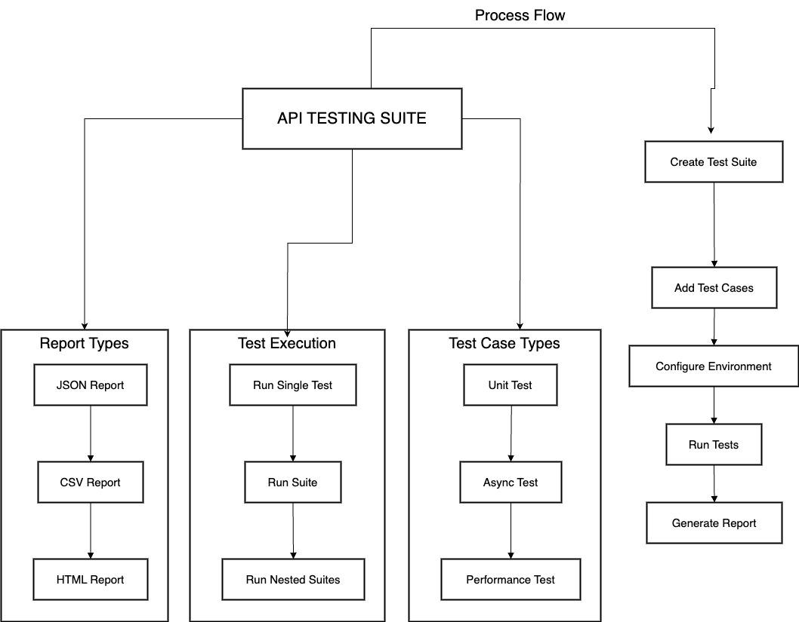
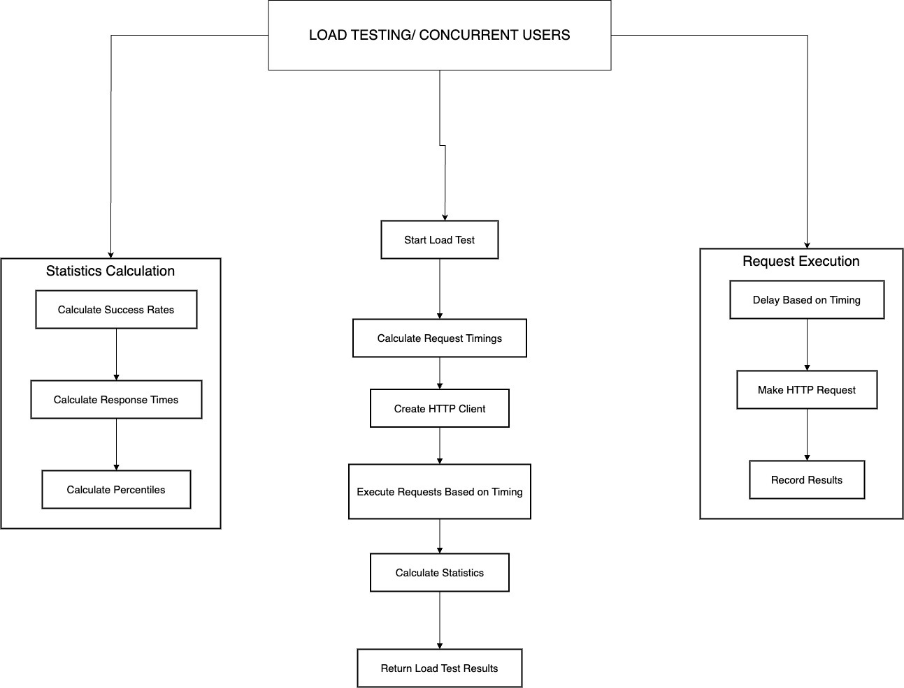

### About 
1. Full Name: Mohit Kumar Singh 
3. Contact info :8538948208, tihom4537@gmail.com
6. Discord handle : tihom__37
9. GitHub profile link : https://github.com/tihom4537
10. LinkedIn: https://www.linkedin.com/in/mohit-kumar-singh-268700254
11. Time zone: IST (GMT+5:30)
12. Link to a resume (PDF, publicly accessible via link and not behind any login-wall): https://drive.google.com/file/d/1j11dbTE2JYhsXkBP7Jg4wxhY-bnTt425/view?usp=drivesdk

### University Info

1. University name : National Institute Of Technology, Hamirpur
2. Program you are enrolled in (Degree & Major/Minor): B.Tech in Electrical Engineering 
3. Year :Prefinal Year(3rd Year)-2023
5. Expected graduation date: 2024

### Motivation & Past Experience

Short answers to the following questions (Add relevant links wherever you can):
1. Have you worked on or contributed to a FOSS project before? Can you attach repo links or relevant PRs? 
-While I haven't had the opportunity to contribute to a FOSS project yet, I am keenly interested in open-source development and actively exploring avenues to participate.

2. What is your one project/achievement that you are most proud of? Why?
-Artist Connection Platform
I designed and developed a comprehensive artist connection platform that facilitates collaboration between artists and clients. This project represents my most significant achievement as I independently handled the entire development lifecycle from conception to deployment.
As the sole developer, I implemented both the frontend using Flutter and the backend using Laravel. The platform features a robust set of functionalities including:
* Secure upload and management of large media files (videos and images) to AWS S3
* Dynamic artist work profiles with portfolio showcasing
* Phone number verification through OTP authentication
* Secure payment processing through Razorpay integration
* Real-time communication via Firebase notification system
The infrastructure deployment leverages multiple AWS services:
* EC2 instances for backend hosting
* S3 buckets for asset management
* Relational Database Service (RDS) for data storage
* Load Balancer for traffic management and high availability
This project demonstrates my ability to handle complex technical challenges across the full stack while delivering a production-ready solution. The application is currently active with a growing user base across both mobile platforms.
Links
* Android: https://play.google.com/store/apps/details?id=in.primestage.onnstage&pcampaignid=web_share
* iOS: https://apps.apple.com/in/app/primestage-artist-booking-app/id6736954597
* GitHub (Frontend): https://github.com/hunter4433/artistaFrontend-.git
* GitHub (Backend): https://github.com/hunter4433/artistaFrontend-.git

3. What kind of problems or challenges motivate you the most to solve them?
-I am particularly motivated by smart and efficient system design challenges, especially those that focus on scalability and seamless handling of user load. I find it exciting to work on products and applications that are built to scale, ensuring they can handle growing demands without compromising performance. The opportunity to design systems that are both robust and efficient drives my passion for solving complex technical problems

4. Will you be working on GSoC full-time? In case not, what will you be studying or working on while working on the project?
-I will be working full-time till mid-term evaluation(july 14) as I will be having summer vacation after 1st week of May till 1st week of July, thereafter also I will contribute the 3-4 hours daily as i Will be involved with my academic curricullum too.

6. Do you mind regularly syncing up with the project mentors?
-I don't mind regular sync-ups with project mentors at all. In fact, I welcome the opportunity for consistent communication and feedback throughout the project.

7. What interests you the most about API Dash?
-I have worked with API creation, management, and load testing in previous projects, which has given me insight into their industrial importance. What particularly interests me about API Dash is its comprehensive approach to API monitoring,Code generation and visualization. I'm excited about the opportunity to contribute to a tool that helps developers track and improve API performance in real-time.

8. Can you mention some areas where the project can be improved?
-It lacks Integration with tools such as  CI/CD pipelines and version control systems like GitHub. We can offer similar integrations to help teams manage and automate API testing and monitoring.


# API Testing Suite Implementation - GSoC Proposal

## 1. Proposal Title
API Testing Suite, Workflow Builder, Collection Runner & Monitor Implementation for API Dash Framework

Related Issues - #96 #100 #120

## 2. Abstract
This project aims to implement a comprehensive API Testing Suite within the existing API Dash framework. Modern API development requires robust testing tools to ensure reliability, performance, and security. The proposed testing suite will provide developers with a powerful solution for creating, managing, and executing various types of API tests through a flexible and intuitive interface. By implementing features such as a hierarchical test organization structure, asynchronous test execution, JavaScript-based test scripting, and detailed reporting capabilities, this project will significantly enhance the API development workflow within the API Dash ecosystem.

## 3. Detailed Description

### Project Objectives
The API Testing Suite implementation will focus on the following key objectives:

- **Test Case Management**: Develop a comprehensive system for creating and managing test cases with support for multiple test types, environment variables, and execution history.
- **Test Suite Organization**: Implement a hierarchical structure for organizing tests with nested suites, suite-level environment variables, and advanced execution controls.
- **Test Execution Engine**: Create a powerful engine for running tests asynchronously with configurable timeouts, progress monitoring, and status checking.
- **Test Scripting Interface**: Build a flexible scripting interface using JavaScript/Chai for custom validation logic and assertion-based testing.
- **Reporting System**: Implement detailed reporting capabilities with multiple output formats and comprehensive test result metrics.

### Workflow Architecture
The API Testing Suite follows a logical workflow that enables systematic API testing:



This diagram illustrates the complete testing process from creating test suites to generating reports, along with the different types of tests supported and execution modes available in the implementation.

### Technical Implementation Plan

#### 1. Test Case Management Module
The core of the project will focus on creating a robust test case management system that supports:

- Multiple test types including response validation, environment variables, performance, and security tests
- Comprehensive test case properties (name, description, enable/disable functionality)
- Environment variable integration
- Test script association
- Execution history tracking

**Implementation Details:**
- Create `test_case_model.dart` to define the core data structure
- Develop test result tracking mechanisms
- Implement environment variable management within test cases

#### 2. Test Suite Organization
The project will implement a hierarchical test suite structure allowing:

- Creation and management of test suites
- Support for nested test suites (suite of suites)
- Suite-level environment variables
- Advanced test execution controls including stop on failure option, test reordering, duplication, and search

**Implementation Details:**
- Develop `test_suite_model.dart` to define suite structure
- Implement state management via `test_suite_provider.dart`
- Create UI components for navigating and managing suite hierarchy

#### 3. Test Execution Engine
A powerful test execution engine will be implemented that supports:

- Individual test execution
- Suite and nested suite execution
- Asynchronous test support with configurable timeouts
- Status checking endpoints
- Progress monitoring

**Implementation Details:**
- Create `test_runner_service.dart` to handle execution logic
- Implement asynchronous test handling mechanisms
- Develop result collection functionality

#### 4. Test Scripting Interface
The project will provide a flexible scripting interface using JavaScript/Chai that supports:

- Assertion-based testing
- Environment variable access
- Asynchronous operation handling
- Custom validation logic

**Implementation Details:**
- Create `test_script_model.dart` for script definition
- Implement script execution context
- Develop result handling mechanisms

#### 5. Reporting System
A comprehensive reporting system will be implemented supporting:

- Multiple report formats (JSON, CSV, HTML)
- Detailed report contents including test results, execution times, error messages, and performance metrics

**Implementation Details:**
- Create report generation services
- Implement formatters for different output types
- Develop result visualization components

### API Load Testing Capabilities
Building on the core testing framework, the implementation will include advanced load testing capabilities:

- **Multiple Testing Methodologies**:
  - Concurrent Users Simulation
  - Requests Per Second (RPS) Testing
  - Total Requests Testing
  - Duration-Based Testing



- **Performance Metrics**:
  - Success and failure rates
  - Average response times
  - 95th and 99th percentile response times
  - Throughput (requests per second)
  - Individual request timestamps and status codes

- **Configuration Options**:
  - HTTP methods (GET, POST, PUT, DELETE)
  - Custom headers and request bodies
  - Load patterns with configurable ramp-up and ramp-down periods

The solution implements intelligent request scheduling as demonstrated in this core algorithm:

```dart
List<int> _calculateRequestTimings(LoadTestConfig config) {
 final timings = <int>[];
 switch (config.type) {
   case LoadTestType.concurrentUsers:
   // For concurrent users, we want to send all requests at once
     timings.addAll(List.filled(config.value, 0));
     break;
   case LoadTestType.requestsPerSecond:
   // For RPS, we need to space out requests evenly
     final interval = (1000 / config.value).round();
     timings.addAll(List.generate(config.value, (i) => i * interval));
     break;
   case LoadTestType.totalRequests:
   // For total requests, we'll spread them over 1 minute
     final interval = (60000 / config.value).round();
     timings.addAll(List.generate(config.value, (i) => i * interval));
     break;
   case LoadTestType.durationBased:
   // For duration-based, we'll send requests throughout the duration
     final interval = (config.value * 1000 / 100).round(); // 100 requests
     timings.addAll(List.generate(100, (i) => i * interval));
     break;
 }
 // Add ramp-up and ramp-down periods
 if (config.rampUpTime > 0) {
   final rampUpInterval = config.rampUpTime * 1000 / timings.length;
   for (var i = 0; i < timings.length; i++) {
     timings[i] += (i * rampUpInterval).round();
   }
 }
 if (config.rampDownTime > 0) {
   final rampDownInterval = config.rampDownTime * 1000 / timings.length;
   for (var i = 0; i < timings.length; i++) {
     timings[i] += ((timings.length - i) * rampDownInterval).round();
   }
 }
 return timings;
}
```

### API Collection and Workflow Management
The implementation will include a sophisticated system for API management through collections and visual workflows:

- **Collections Management**:
  - Organized grouping of related API requests
  - Import/export capabilities
  - Filtering and search functionality

- **Visual Workflow Builder**:
  - Drag-and-drop interface for workflow creation
  - Support for various node types (requests, delays, variables, conditions)
  - Interactive connector lines between nodes
  - Conditional branching based on response data

- **Variable Management**:
  - Dynamic variable substitution in URLs, headers, and request bodies
  - Environment-specific variable sets
  - Automatic variable extraction from responses

The implementation includes a robust execution engine for workflows:

```dart
Future<CollectionRunResult> _executeWorkflow(
    ApiWorkflow workflow,
    Map<String, dynamic> variables,
    ) async {
  // Sort nodes by position for execution order
  final sortedNodes = workflow.nodes.toList()
    ..sort((a, b) => a.position.y.compareTo(b.position.y));
  // Execute nodes in sequence
  for (final node in sortedNodes) {
    final result = await _executeNode(node, variables);
    // Process result and update variables
  }
  // Return workflow execution results
  return CollectionRunResult(/* ... */);
}
```

### Testing Strategy
The project will include comprehensive testing of all components:

- Unit tests for the test runner (`test_runner_test.dart`)
- Integration tests for the test suite provider (`test_suite_provider_test.dart`)
- End-to-end tests to validate the full testing workflow

### Integration with Existing System
The API Testing Suite will integrate seamlessly with the existing API Dash features, providing:

- Improved API testing workflow
- Better test organization
- Enhanced test automation
- Detailed test reporting
- Consistent user experience

### Benefits to the Community
This implementation will benefit the community by:

- Improving API quality through comprehensive testing
- Reducing development time with automated testing
- Enhancing debugging capabilities with detailed reporting
- Supporting a wider range of testing scenarios
- Providing a more complete development ecosystem within API Dash

## 4. Weekly Timeline

| Week | Date Range | Activities | Deliverables |
|------|------------|------------|-------------|
| **1-2** | **May 8 - June 1** | • Review existing API Dash framework • Set up development environment • Finalize design documents • Create initial project structure | • Project repository setup • Detailed design document • Initial framework |
| **3** | **June 2 - June 8** | • Implement test case model • Create basic test case properties • Design test case UI | • Basic test case data structure • UI wireframes |
| **4** | **June 9 - June 15** | • Implement environment variable handling • Develop test case management UI • Create test result models | • Environment variable system • Test case management interface |
| **5** | **June 16 - June 22** | • Implement test suite models • Create suite hierarchy structure • Begin suite-level variable implementation | • Test suite data structure • Initial hierarchy navigation |
| **6** | **June 23 - June 30** | • Complete suite-level variable implementation • Develop test ordering functionality • Create suite management UI | • Suite management interface • Test ordering system |
| **7** | **July 1 - July 7** | • Begin test runner service implementation • Develop basic test execution logic • Implement test status tracking | • Basic test execution engine • Status tracking system |
| **8** | **July 8 - July 14** | • Complete test runner service • Implement asynchronous test handling • Create progress monitoring UI • Prepare midterm evaluation | • Working test execution engine • Progress monitoring interface • Midterm evaluation report |
| **9** | **July 18 - July 24** | • Begin JavaScript/Chai integration • Create script model • Implement basic assertion handling | • Script data structure • Basic script execution |
| **10** | **July 25 - July 31** | • Complete script execution context • Implement advanced assertions • Develop environment variable access in scripts | • Complete scripting interface • Variable access in scripts |
| **11** | **August 1 - August 7** | • Begin reporting system implementation • Create report models • Implement JSON/CSV formatters | • Report data structure • Basic formatters |
| **12** | **August 8 - August 14** | • Complete reporting system • Implement HTML reports • Develop visualization components • Create export functionality | • Complete reporting system • Multiple export formats |
| **13** | **August 15 - August 21** | • Integrate load testing capabilities • Implement test collections • Begin workflow builder implementation | • Load testing functionality • Collections management |
| **14** | **August 22 - August 25** | • Complete workflow builder • Perform comprehensive testing • Fix bugs and optimize performance | • Complete workflow system • Passing test suite |
| **15** | **August 25 - September 1** | • Finalize documentation • Create tutorial content • Prepare final submission • Submit final evaluation | • Complete API Testing Suite • Comprehensive documentation • Final project report |

### Technical Skills and Qualifications
- Proficient in Dart and Flutter development
- Experience with API testing methodologies
- Understanding of asynchronous programming concepts
- Familiarity with JavaScript and testing frameworks
- Knowledge of state management in Flutter applications

### Expected Outcomes
Upon completion, the API Testing Suite will provide:
- Comprehensive test management capabilities
- Flexible test organization structures
- Powerful test scripting options
- Detailed testing reports
- Intuitive workflow builder interface

This implementation will significantly enhance the API Dash framework, making it a more complete solution for API development and testing.