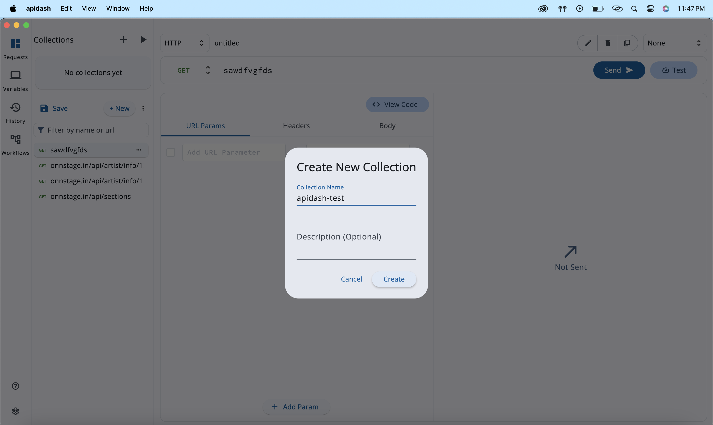

# **API Testing Suite Implementation \- GSoC Proposal 2025**

                                      
                                     **ORGANISATION: APIDASH**

## 

**Table of Contents**

1. **Personal Information,University Information,**  
   **Motivation & Past Experience** ............................................... 2-4

2. **Proposal Title,Abstract** ......................................................... 4

3. **Detailed Description** ............................................. 5-26

   * Project Objectives .................................................. 5

   * Workflow Visualization and Execution System ............ 5-14  
   *   
   * Collection Runner And Monitoring ............................ 15-19

   * API Load/Performance Testing Capabilities ................................ 20-24

   * Different Types of API Testing SUITE ...................... 24-26

4. **Weekly Timeline** .................................................. 26-27

5. **Technical Skills and Qualifications,Expected Outcomes** .......................... 28

   

## 

## 

## 

## **Personal Information**

* **Full Name:** Mohit Kumar Singh  
* **Contact:** 8538948208, tihom4537@gmail.com  
* **Discord:** tihom\_\_37  
* **GitHub:** [https://github.com/tihom4537](https://github.com/tihom4537)  
* **LinkedIn:** [https://www.linkedin.com/in/mohit-kumar-singh-268700254](https://www.linkedin.com/in/mohit-kumar-singh-268700254)  
* **Time Zone:** IST (GMT+5:30)  
* **Resume:** [View Resume](https://drive.google.com/file/d/1j11dbTE2JYhsXkBP7Jg4wxhY-bnTt425/view?usp=drivesdk)

## **University Information**

* **University:** National Institute Of Technology, Hamirpur  
* **Program:** B.Tech in Electrical Engineering  
* **Year:** Prefinal Year (3rd Year) \- 2023  
* **Expected Graduation:** 2024

## **Motivation & Past Experience**

### **FOSS Project Experience**

While I haven't had the opportunity to contribute to a FOSS project yet, I am keenly interested in open-source development and actively exploring avenues to participate.

### **Proudest Project Achievement**

**Artist Connection Platform**

I designed and developed a comprehensive artist connection platform that facilitates collaboration between artists and clients. This project represents my most significant achievement as I independently handled the entire development lifecycle from conception to deployment.

As the sole developer, I implemented both the frontend using Flutter and the backend using Laravel. The platform features a robust set of functionalities including:

* Secure upload and management of large media files (videos and images) to AWS S3  
* Dynamic artist work profiles with portfolio showcasing  
* Phone number verification through OTP authentication  
* Secure payment processing through Razorpay integration  
* Real-time communication via Firebase notification system

The infrastructure deployment leverages multiple AWS services:

* EC2 instances for backend hosting  
* S3 buckets for asset management  
* Relational Database Service (RDS) for data storage  
* Load Balancer for traffic management and high availability

This project demonstrates my ability to handle complex technical challenges across the full stack while delivering a production-ready solution. The application is currently active with a growing user base across both mobile platforms.

Note: There is still need of improvement in the codebase like state management needs to improve. I am learning and will implement soon.

**Links:**

* Android: [PlayStore](https://play.google.com/store/apps/details?id=in.primestage.onnstage&pcampaignid=web_share)  
* iOS: [App Store](https://apps.apple.com/in/app/primestage-artist-booking-app/id6736954597)  
* GitHub (Frontend): [https://github.com/hunter4433/artistaFrontend-.git](https://github.com/hunter4433/artistaFrontend-.git)  
* GitHub (Backend): [https://github.com/hunter4433/artistaFrontend-.git](https://github.com/hunter4433/artistaFrontend-.git)

### **Motivating Problems**

I am particularly motivated by smart and efficient system design challenges, especially those that focus on scalability and seamless handling of user load. I find it exciting to work on products and applications that are built to scale, ensuring they can handle growing demands without compromising performance. The opportunity to design systems that are both robust and efficient drives my passion for solving complex technical problems.

### **GSoC Time Commitment**

I will be working full-time till mid-term evaluation (July 14\) as I will be having summer vacation after 1st week of May till 1st week of July. Thereafter, I will contribute 3-4 hours daily as I will be involved with my academic curriculum too.

### **Mentor Sync-ups**

I don't mind regular sync-ups with project mentors at all. In fact, I welcome the opportunity for consistent communication and feedback throughout the project.

### **Interest in API Dash**

I have worked with API creation, management, and load testing in previous projects, which has given me insight into their industrial importance. What particularly interests me about API Dash is its comprehensive approach to API monitoring, code generation, and visualization. I'm excited about the opportunity to contribute to a tool that helps developers track and improve API performance in real-time.

### **Project Improvement Areas**

It lacks integration with tools such as CI/CD pipelines and version control systems like GitHub. We can offer similar integrations to help teams manage and automate API testing and monitoring.

## **1\. Proposal Title**

API Testing Suite, Workflow Builder, Collection Runner & Monitor Implementation for API Dash Framework

**Related Issues:** \#96 \#100 \#120

## **2\. Abstract**

This project is about building a smart and flexible API testing tool that helps developers test their APIs in many ways—like checking if they work correctly (validation), if different APIs talk to each other properly (integration), how secure they are, how fast they respond under heavy use (performance), and how well they scale.

The tool includes an easy drag-and-drop **workflow builder** to create chains of API calls, a **collection runner** to run sets of APIs, and a **monitor** to track results. Users can test APIs in different environments (dev, staging, etc.), select specific APIs to run, and run them in loops or with delays.

It also includes a **load testing feature** that simulates many users hitting an API at once, with options to ramp up traffic gradually. It shows useful metrics like response time, success/failure rate, and system behavior every second.

Planned improvements include support for parallel execution, dynamic data between steps, reusable node templates, undo-redo features, and visual reports. The goal is to make API testing easier, more powerful, and ready for real-world needs.

## **3\. Detailed Description**

### **Project Objectives**

**Visual Workflow Builder**: Allow users to create chained API flows using a drag-and-drop interface with nodes like requests, conditions, and transformers.  
**Flexible Execution Engine**: Run workflows sequentially now, with plans to support concurrent execution, configurable delays, and selective iterations.  
**Dynamic Data & Reusability**: Pass data between nodes using variables, and enable saving reusable node templates for efficiency.  
**Environment & Config Management**: Inject environment variables dynamically and configure test runs with custom settings like environment, delay, and selected APIs.  
**Performance & Load Testing**: Simulate high traffic with virtual users and ramp-up logic. Collect metrics like latency, throughput, and error rate in real-time.  
**Error Handling & Monitoring**: Ensure resilient test execution with live logs, on-error paths, and uninterrupted collection runs.  
**Detailed Reporting**: Track per-request results and overall performance with exportable reports for analysis and debugging.  
**Security Support**: Handle custom headers, SSL configs, and token auth for secure API testing.

**Future Enhancements**: Add CSV/JSON dataset input, undo/redo, scheduled monitoring, visual reports, and dashboard insights post-POC.

## 

## **\# Workflow Visualization and Execution System**

* This module aims to build a visual API Workflow Builder within API Dash to simplify API testing and automation. Users can design, manage, and execute multi-step API flows using a no-code, drag-and-drop interface. The POC demonstrates core functionality like visual editing and live execution. Future work will focus on scaling this with dynamic data handling, iterations, external integrations, and real-time reporting.

* The implementation leverages the flutter\_flow\_chart package for visualizing workflow elements and connections, combined with custom execution logic for running workflow sequences. Here's the integrated implementation:

Proof of Concept:

  
**Core Architecture (Flutter Flow Chart Integration)**  

class WorkflowCanvas extends ConsumerStatefulWidget {  
  final Workflow workflow;  
  final Function(Workflow) onWorkflowChanged;  
    
  const WorkflowCanvas({  
    required this.workflow,  
    required this.onWorkflowChanged,  
  });  
    
  @override  
  ConsumerState\<WorkflowCanvas\> createState() \=\> \_WorkflowCanvasState();  
}

class \_WorkflowCanvasState extends ConsumerState\<WorkflowCanvas\> {  
  late Dashboard \_dashboard;  
  final Map\<String, FlowElement\> \_nodeToElementMap \= {};  
    
  @override  
  void initState() {  
    \_initializeDashboard();  
    super.initState();  
  }  
    
  void \_initializeDashboard() {  
    \_dashboard \= Dashboard(  
      minimumZoomFactor: 1.25,  
      defaultArrowStyle: ArrowStyle.curve,  
    );  
      
    widget.workflow.nodes.forEach((node) {  
      final element \= \_createFlowElement(node);  
      \_dashboard.addElement(element);  
      \_nodeToElementMap\[node.id\] \= element;  
    });  
      
    widget.workflow.connections.forEach(\_addConnectionToDashboard);  
  }  
}

This setup initializes the flow chart canvas using flutter\_flow\_chart's Dashboard and maintains node-element mapping for bidirectional synchronization.

## 

* ## **Visual Element Creation**

FlowElement \_createFlowElement(WorkflowNode node) {  
  return FlowElement(  
    id: node.id,  
    position: node.position,  
    size: const Size(120, 60),  
    text: node.name,  
    kind: \_getElementKind(node.type),  
    handlers: \_getHandlers(node),  
    style: FlowElementStyle(  
      borderColor: Colors.blue.shade800,  
      textStyle: const TextStyle(fontSize: 12),  
    ),  
  );  
}

ElementKind \_getElementKind(String nodeType) {  
  switch (nodeType) {  
    case 'condition': return ElementKind.diamond;  
    case 'start': return ElementKind.oval;  
    default: return ElementKind.rectangle;  
  }  
}

Utilizes flutter\_flow\_chart's ElementKind enumeration for different node visual representations.

## 

* ## **Execution Engine Integration**

1\.Combines workflow execution logic with visual feedback using flutter\_flow\_chart's element styling capabilities.

class WorkflowExecutor {  
 final Dashboard \_dashboard;  
 final Workflow \_workflow;  
 final Map\<String, FlowElement\> \_elementMap;

 void runWorkflow() {  
   \_dashboard.elements.forEach((element) \=\> \_resetElementStyle(element));  
   \_executeNode(\_findStartNode());  
 }

 Future\<void\> \_executeNode(WorkflowNode node) async {  
   final element \= \_elementMap\[node.id\];  
   \_updateElementStyle(element, Colors.blue); // Highlight executing node

   switch (node.type) {  
     case 'request':  
       await \_handleHttpRequest(node);  
       break;  
     case 'condition':  
       await \_evaluateCondition(node);  
       break;  
   }

   \_followConnections(node);  
   \_updateElementStyle(element, Colors.green); // Mark completed  
 }  
}

**2\.**This is the core function that sequentially triggers each node based on type. It ensures orderly execution and follows connections based on outcomes.

Future\<void\> executeNode(WorkflowNode node) async {  
 if (\!\_isExecuting) return;  
   
 \_currentExecutingNode \= node;  
 onLogUpdate('\> Executing node: ${node.name}\\n');  
 onNodeChange(node);  
   
 await Future.delayed(Duration(milliseconds: 300)); // UI smoothness  
   
 try {  
   switch (node.type) {  
     case 'start':  
       followConnection(node, 'trigger');  
       break;  
     case 'request':  
       await executeRequestNode(node);  
       break;  
     case 'condition':  
       executeConditionNode(node);  
       break;  
     case 'transform':  
       executeTransformNode(node);  
       break;  
     default:  
       followConnection(node, 'output');  
   }  
 } catch (e) {  
   onLogUpdate(' ERROR: ${e.toString()}\\n');  
   followConnection(node, 'error');  
 }  
   
 if (\_currentExecutingNode \== node && \_isExecuting) {  
   onLogUpdate('\> Workflow execution completed.\\n');  
   stopExecution();  
 }  
}

**3\.** This function handles the HTTP request logic for each request-type node. It builds the request, sends it, waits for a response, and follows the appropriate connection.

Future\<void\> executeRequestNode(WorkflowNode node) async {  
 final method \= node.data\['method'\] ?? 'GET';  
 final url \= node.data\['url'\] ?? '';  
 if (url.isEmpty) {  
   followConnection(node, 'error');  
   return;  
 }  
   final request \= HttpRequestModel(  
   method: \_convertToHTTPVerb(method),  
   url: url,  
   headers: \_getHeadersFromNodeData(node),  
   body: node.data\['body'\] ?? '',  
   bodyContentType: \_getContentTypeFromNodeData(node),  
 );  
 final collectionNotifier \= ref.read(collectionStateNotifierProvider.notifier);  
 final requestId \= node.id;  
  if (collectionNotifier.hasId(requestId)) {  
   collectionNotifier.update(id: requestId, ...);  
 } else {  
   collectionNotifier.addRequestModel(request, name: node.name);  
 }  
 await collectionNotifier.sendRequest();  
 await Future.delayed(Duration(seconds: 1));  
 final result \= collectionNotifier.getRequestModel(requestId);  
 final status \= result?.responseStatus;  
 if (status \!= null && status \>= 200 && status \< 300\) {  
   followConnection(node, 'success');  
 } else {  
   followConnection(node, 'error');  
 }  
}

* **Bidirectional Synchronization**

// Model → Canvas updates  
void \_handleModelUpdate() {  
 widget.workflow.nodes.forEach((node) {  
   final element \= \_nodeToElementMap\[node.id\];  
   element.position \= node.position;  
   element.text \= node.name;  
 });  
 \_dashboard.refresh();  
}

// Canvas → Model updates  
void \_handleCanvasInteraction(FlowElement element) {  
 final node \= widget.workflow.nodes.firstWhere((n) \=\> n.id \== element.id);  
 widget.onWorkflowChanged(node.copyWith(  
   position: element.position,  
   name: element.text,  
 ));  
}  
Maintains consistency between the visual representation and data model using flutter\_flow\_chart's position tracking[1](https://pub.dev/packages/flutter_flow_chart).

* ## **Connection Management**

void \_addConnectionToDashboard(WorkflowConnection conn) {  
 \_dashboard.addNextById(  
   \_nodeToElementMap\[conn.sourceNodeId\]\!,  
   conn.targetNodeId,  
   ArrowParams(  
     thickness: 2,  
     color: \_getConnectionColor(conn.type),  
     startArrowPosition: Alignment.centerRight,  
     endArrowPosition: Alignment.centerLeft,  
   ),  
 );

Implements workflow connections using flutter\_flow\_chart's arrow customization features.

## 

## **Technical Highlights**

1. Visual-Execution Parity: Real-time synchronization between canvas elements and workflow model  
2. Interactive Editing: Leverages flutter\_flow\_chart's built-in drag/drop and connection handlers  
3. Performance: Utilizes Dashboard's batched updates and zoom capabilities for large workflows

This implementation demonstrates a robust integration of visual workflow design (using flutter\_flow\_chart) with executable business logic, providing both design-time visualization and runtime execution capabilities.

## **Technical Challenges I faced and its Solutions**

### **Challenge 1: Synchronizing Visual Elements with Data Model**

To maintain consistency between the visual canvas and the underlying data model, I implemented a bidirectional update system:

1. When users interact with visual elements, the corresponding nodes in the data model are updated  
2. When the data model changes, the visual elements are recreated or updated automatically

### **Challenge 2: Handling Complex Node Types**

Different node types (request, condition, transform) require different visual representations and behaviors. My implementation uses a type-based factory system to create appropriate visual elements and handlers for each node type.

### **Challenge 3: Live Workflow Execution**

The workflow executor must be able to:

1. Run workflows in real-time  
2. Provide visual feedback on execution state  
3. Handle different node types with specialized execution logic  
4. Support stopping and resuming workflow execution

## **Future Enhancements**

1. **Undo/Redo System**: Add comprehensive undo/redo capability for all workflow operations  
2. **Node Templates**: Implement a system for creating and reusing node templates  
3. **Subworkflows**: Support for nested workflows to handle complex scenarios  
4. **Performance Optimization**: Optimize rendering for large workflows with many nodes

## 

## 

## 

## **\#Collection Runner And Monitoring**

## This module facilitates the execution of API test collections in a controlled, environment-aware manner, ensuring efficient and reliable test runs. It allows users to configure tests with flexibility, providing real-time progress tracking, error handling, and  result analysis. Built with Riverpod for state management, the system ensures smooth, sequential execution of API requests while offering detailed post-run insights. The Proof of Concept (POC) includes these core functionalities.     

##  The future vision includes enhancing scalability and providing comprehensive monitoring features for deeper visibility into API performance and behavior during tests.

Proof of Concept:

1. Create collection:

## 

2. Collection Runner Configuration  
* select/deselect request in collection  
* Set the number of iteration  
* Set Delay time

## 

3. ## Result Screen:    

## Key Features and Technical Highlights

## **1\. Environment-Aware Execution**

Dynamically injects environment variables into requests:

final activeEnvId \= ref.read(activeEnvironmentIdStateProvider);  
final substitutedRequest \= collectionStateNotifierRef  
    .getSubstitutedHttpRequestModel(request.httpRequestModel);

Why It Matters: Enables testing different environments (dev/staging/prod) without code changes.

## 

## **2\. Configurable Test Runs**

Supports complex execution scenarios through CollectionRunConfig:

int iterations     // Number of test repetitions  
Set\<String\> selectedRequestIds  // Selective request execution  
int delayMs        // Pause between requests

Use Case: Run stress tests (high iterations) or debug specific endpoints (selected requests).

## **3\. Sequential Execution Engine**

Implements reliable test sequencing:

for (var i \= 0; i \< config.iterations; i++) {  
  for (var requestId in collection.requests) {  
    if (\!config.selectedRequestIds.contains(requestId)) continue;  
    // Execute request  
  }  
}

Design Choice: Ensures predictable execution order while supporting request filtering.  
NOTE: For now, the implementation uses sequential execution, but I plan to switch to concurrent/parallel execution—similar to the approach used in Performance Load Testing—for better efficiency when running large API collections.

## **4\. Comprehensive Result Tracking**

Captures 8 essential metrics per request:  
RunResult(  
  requestId: ...,      // Unique identifier  
  requestName: ...,    // Human-readable name  
  url: ...,            // Final executed URL  
  method: ...,         // HTTP verb  
  statusCode: ...,     // Response status  
  responseTimeMs: ..., // Latency measurement  
  responseSize: ...,   // Payload size analysis  
  error: ...           // Failure details  
)

Diagnostic Value: Provides complete audit trail for compliance and debugging.

## **6\. Real-Time Progress Reporting**

Live updates through state management:

collectionRunResultsNotifier.startRun(...);  
collectionRunResultsNotifier.addResult(...);  
collectionRunResultsNotifier.finishRun();

User Experience: Enables live dashboards showing test progress and intermediate results.

## **7\. Automated Post-Run Navigation**

Seamless UX flow upon completion:

await Navigator.of(context).push(  
  MaterialPageRoute(builder: (\_) \=\> CollectionRunResultsScreen())  
);

Workflow Optimization: Directs users to analysis tools immediately after test completion.

## Technical Architecture Highlights

1.State Management Integration

* Uses Riverpod's ref for reactive state  
  * Connects to multiple providers:

                  ref.read(settingsProvider)  
                 ref.read(collectionStateNotifierProvider)

       2\.     Request Execution Pipeline

3\. Performance Considerations

* Async/await for non-blocking I/O  
  * Configurable delays prevent resource exhaustion  
  * Isolated result recording prevents UI jank

## Proposed Enhancements:

1. Parallel request execution  
2. Client-side metrics aggregation  
3. Automated retry mechanisms.  
   

## 

## 

## 

## 

## 

## 

## 

## **\#API Load Testing Capabilities:**

This tool helps test how well a system handles heavy traffic. You can control how many users to simulate, how long the test runs, and whether the load increases slowly or all at once. It sends requests in parallel, just like real users would, and tracks important things like speed, errors, and how many requests go through every second. It also handles failures smoothly and gives you useful data to check your system’s performance over time.  
The Proof of concept includes the core Features.

1.New elements Added to Dashboard.

Configuration of performance screen along with result:  
                I have used FL\_Chart for Dynamic Chart visualisation  
****

## **1\. Configurable Load Testing Parameters**

The runLoadTest method accepts critical configuration options:

Future\<List\<PerformanceTestResult\>\> runLoadTest({  
 required String url,  
 required String method,      // HTTP method (GET/POST/etc)  
 required Map\<String, String\> headers,  
 String? body,                // Request payload  
 required int virtualUsers,   // Max concurrent users  
 required int durationSeconds,// Test duration  
 required bool rampUp,        // Gradual load increase  
 required int rampUpDurationSeconds,  
})

Why It Matters: Enables testing different scenarios (e.g., sudden traffic spikes vs gradual growth).

## **2\. Intelligent Ramp-Up Implementation**

Dynamically adjusts user count during test:  
      int currentUsers \= rampUp  
              ? ((timer.tick /rampUpDurationSeconds) \* virtualUsers).floor()  
               : virtualUsers;

Example: With virtualUsers: 100 and rampUpDuration: 10s, starts with 10 users and adds 10 users/second until reaching 100\.  
Benefit: Mimics real-world traffic patterns and helps identify scaling thresholds.

## **3\. Concurrent Request Simulation**

Uses Timer.periodic to generate load:  
  // Spawns currentUsers requests every second

Timer.periodic(const Duration(seconds: 1), (timer) {  
 if (timer.tick \>= durationSeconds) {  
   timer.cancel();  
   return;  
 }  
   
 int currentUsers \= rampUp  
   ? ((timer.tick / rampUpDurationSeconds) \* virtualUsers).floor()  
   : virtualUsers;  
     
 for (int i \= 0; i \< currentUsers; i++) {  
   \_makeRequest(  
     url: url,  
     method: method,  
     headers: headers,  
     body: body,  
   ).then((responseTime) {  
     if (responseTime \>= 0\) {  
       completedRequests++;  
       responseTimes.add(responseTime);  
     } else {  
       failedRequests++;  
     }  
       
     results.add(PerformanceTestResult(  
       totalRequests: completedRequests \+ failedRequests,  
       requestsPerSecond: (completedRequests \+ failedRequests) / timer.tick,  
       avgResponseTime: responseTimes.isEmpty  
         ? 0  
         : responseTimes.reduce((a, b) \=\> a \+ b) / responseTimes.length,  
       minResponseTime: responseTimes.isEmpty  
         ? 0  
         : responseTimes.reduce((a, b) \=\> a \< b ? a : b),  
       maxResponseTime: responseTimes.isEmpty  
         ? 0  
         : responseTimes.reduce((a, b) \=\> a \> b ? a : b),  
       errorRate: failedRequests / (completedRequests \+ failedRequests) \* 100,  
       timestamp: DateTime.now(),  
     ));  
   });  
 }  
});

Technical Insight: Creates realistic concurrency by spawning multiple async requests per second.

## **4\. Comprehensive Metrics Collection**

Tracks 7 critical performance indicators:

PerformanceTestResult(  
  totalRequests: ...,  
  requestsPerSecond: ...,    // Throughput  
  avgResponseTime: ...,      // Mean latency  
  minResponseTime: ...,      // Best-case performance  
  maxResponseTime: ...,      // Worst-case latency  
  errorRate: ...,            // % of failed requests  
  timestamp: DateTime.now(),  
)

Analysis Ready: Provides both granular and aggregated data for performance profiling.

## **6\. Real-Time Metrics Calculation**

Dynamically computes statistics as results stream in:

avgResponseTime: responseTimes.isEmpty  
  ? 0  
  : responseTimes.reduce((a, b) \=\> a \+ b) / responseTimes.length,  
min/maxResponseTime: ... // Uses reduce to find extremes

Efficiency: Uses streaming calculations to avoid storing all response times in memory.

## **7\. Granular Results Reporting**

Returns second-by-second test results:

List\<PerformanceTestResult\> results=\[ \];  
//Adds new result every second  
results.add(PerformanceTestResult(...));

Use Case: Enables creating time-series visualizations of system performance.

## 

## Technical Advantages

1. Scalable Design: Asynchronous implementation handles hundreds of concurrent users.  
2. Precision Timing: Uses Stopwatch for millisecond-accurate measurements.  
3. Adaptive Load: Ramp-up logic tests both steady-state and scaling scenarios.  
4. Diagnostic Capabilities: Clear error rate tracking helps identify stability issues.

## 

## 

## 

## 

## 

## 

## **\#Different Types of API Testing SUITE**

FLOW DIAGRAM:  

### **Test Case Management Module**

The core of the project will focus on creating a robust test case management system that supports:

* Multiple test types including response validation, environment variables, performance, and security tests  
* Comprehensive test case properties (name, description, enable/disable functionality)  
* Environment variable integration  
* Test script association  
* Execution history tracking

### **Test Suite Organization**

The project will implement a hierarchical test suite structure allowing:

* Creation and management of test suites  
* Support for nested test suites (suite of suites)  
* Suite-level environment variables  
* Advanced test execution controls including stop on failure option, test reordering, duplication, and search

### **Test Execution Engine**

A powerful test execution engine will be implemented that supports:

* Individual test execution  
* Suite and nested suite execution  
* Asynchronous test support with configurable timeouts  
* Status checking endpoints  
* Progress monitoring

### **Test Scripting Interface**

The project will provide a flexible scripting interface using JavaScript/Chai that supports:

* Assertion-based testing  
* Environment variable access  
* Asynchronous operation handling  
* Custom validation logic

### **Reporting System**

A comprehensive reporting system will be implemented supporting:

* Multiple report formats (JSON, CSV, HTML)  
* Detailed report contents including test results, execution times, error messages, and performance metrics

### **Testing Strategy**

The project will include comprehensive testing of all components:

* Unit tests for the test runner (`test_runner_test.dart`)  
* Integration tests for the test suite provider (`test_suite_provider_test.dart`)  
* End-to-end tests to validate the full testing workflow

### **Integration with Existing System**

The API Testing Suite will integrate seamlessly with the existing API Dash features, providing:

* Improved API testing workflow  
* Better test organization  
* Enhanced test automation  
* Detailed test reporting  
* Consistent user experience

### **Benefits to the Community**

This implementation will benefit the community by:

* Improving API quality through comprehensive testing  
* Reducing development time with automated testing  
* Enhancing debugging capabilities with detailed reporting  
* Supporting a wider range of testing scenarios  
* Providing a more complete development ecosystem within API Dash

## 

## 

## 

## 

## 

## 

## 

## 

## 

## 

## **4\. Weekly Timeline**

| Week | Date Range | Activities | Deliverables |
| ----- | ----- | ----- | ----- |
| **1-2** | **May 8 \- June 1** | • Review existing API Dash framework • Set up development environment • Finalize design documents • Create initial project structure | • Project repository setup • Detailed design document • Initial framework |
| **3** | **June 2 \- June 8** | • Implement test case model • Create basic test case properties • Design test case UI | • Basic test case data structure • UI wireframes |
| **4** | **June 9 \- June 15** | • Implement environment variable handling • Develop test case management UI • Create test result models | • Environment variable system • Test case management interface |
| **5** | **June 16 \- June 22** | • Implement test suite models • Create suite hierarchy structure • Begin suite-level variable implementation | • Test suite data structure • Initial hierarchy navigation |
| **6** | **June 23 \- June 30** | • Complete suite-level variable implementation • Develop test ordering functionality • Create suite management UI | • Suite management interface • Test ordering system |
| **7** | **July 1 \- July 7** | • Begin test runner service implementation • Develop basic test execution logic • Implement test status tracking | • Basic test execution engine • Status tracking system |
| **8** | **July 8 \- July 14** | • Complete test runner service • Implement asynchronous test handling • Create progress monitoring UI • Prepare midterm evaluation | • Working test execution engine • Progress monitoring interface • Midterm evaluation report |
| **9** | **July 18 \- July 24** | • Begin JavaScript/Chai integration • Create script model • Implement basic assertion handling | • Script data structure • Basic script execution |
| **10** | **July 25 \- July 31** | • Complete script execution context • Implement advanced assertions • Develop environment variable access in scripts | • Complete scripting interface • Variable access in scripts |
| **11** | **August 1 \- August 7** | • Begin reporting system implementation • Create report models • Implement JSON/CSV formatters | • Report data structure • Basic formatters |
| **12** | **August 8 \- August 14** | • Complete reporting system • Implement HTML reports • Develop visualization components • Create export functionality | • Complete reporting system • Multiple export formats |
| **13** | **August 15 \- August 21** | • Integrate load testing capabilities • Implement test collections • Begin workflow builder implementation | • Load testing functionality • Collections management |
| **14** | **August 22 \- August 25** | • Complete workflow builder • Perform comprehensive testing • Fix bugs and optimize performance | • Complete workflow system • Passing test suite |
| **15** | **August 25 \- September 1** | • Finalize documentation • Create tutorial content • Prepare final submission • Submit final evaluation | • Complete API Testing Suite • Comprehensive documentation • Final project report |

## **Technical Skills and Qualifications**

* Proficient in Dart and Flutter development  
* Experience with API testing methodologies  
* Understanding of asynchronous programming concepts  
* Familiarity with JavaScript and testing frameworks  
* Knowledge of state management in Flutter applications

## **Expected Outcomes**

Upon completion, the API Testing Suite will provide:

* Comprehensive test management capabilities  
* Flexible test organization structures  
* Powerful test scripting options  
* Detailed testing reports  
* Intuitive workflow builder interface

