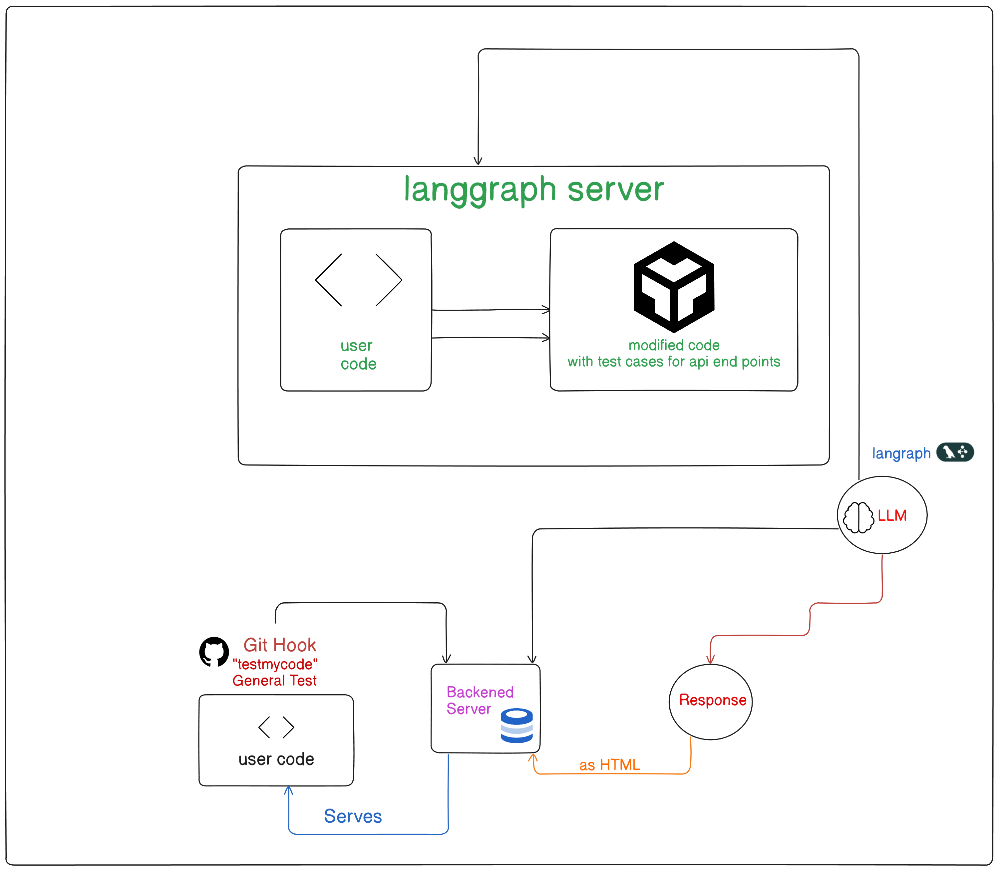

# GSoC’25 Proposal – Api Dash
## AI Agent for API Testing & Tool Generation

---

## Personal Details

- **Name:** Bhushan Bharat
- **Course:** BTech CSE
- **Email:** [bhushanbharat6958@gmail.com](mailto:bhushanbharat6958@gmail.com)
- **GitHub:** [bbl-sh](https://github.com/bbl-sh), [john221wick](https://github.com/john221wick)
- **LinkedIn:** [Bhushan Bharat](https://www.linkedin.com/in/bhushan-bharat-51ba4825b/)
- **Phone:** 7909073248
- **Country:** INDIA
- **Resume/CV:** [Resume Link](https://drive.google.com/file/d/1di1XTSOw8C9xMpKPW94LQwbRaHlXkzLj/view?usp=drive_link)
- **Portfolio:** [Portfolio](https://portfolio-bhushans-projects-ab4d9b37.vercel.app/)
- **Demo:** [Demo Link](https://youtu.be/il35dcY8U4k?si=Yo7A6U1owad6kfan)
---

## Short Answers

### 1. Have you worked on or contributed to a FOSS project before?
**No**, this will be my first contribution to a FOSS project.

### 2. What is your one project/achievement that you are most proud of? Why?
Building an LLM and training it with PyTorch distributed (both GPT and LLaMA 3.2), although it's not complete yet. Additionally, I’ve developed an automated CI/CD agent, local research system, and Leetcode-style judge using the Judge0 API for real-time code execution.

### 3. What kind of problems or challenges motivate you the most to solve them?
I am most motivated by challenges involving:
- Automation
- AI-driven problem solving
- Integration of advanced AI technologies with real-world software engineering

### 4. Will you be working on GSoC full-time?
**Yes**, I will work on GSoC full-time.

### 5. Do you mind regularly syncing up with the project mentors?
**No**, I am eager to have regular communication and feedback from mentors.

### 6. What interests you the most about API Dash?
I’m particularly drawn to API Dash's ability to:
- Streamline API testing and debugging
- Integrate AI seamlessly into development workflows

### 7. Can you mention some areas where the project can be improved?
- Better multi-language support
- Enhanced UI/UX
- Deeper AI integration for automated insights and optimization

---

## Project Proposal Information

### Proposal Title
**AI Agent for API Testing & Tool Generation**

---
**Demo:** [Demo Link](https://youtu.be/il35dcY8U4k?si=Yo7A6U1owad6kfan)

### Abstract
This project introduces an AI agent to automate API testing and generate tools using LangGraph. It connects GitHub hooks to a FastAPI-powered backend, enabling automatic test case generation for API endpoints and returning detailed reports to the developer on commit.

---

### Detailed Description

**Demo:** [Demo Link](https://youtu.be/il35dcY8U4k?si=Yo7A6U1owad6kfan)

The system utilizes:
- A **GitHub commit hook** (triggered by `"generateTest"` in the commit message)
- A **bash (curl) script** to send code to the backend
- A **FastAPI** backend managed with **LangGraph** to execute node-based API test generation workflows

#### Key Components:
- **LangGraph nodes:** Each node performs distinct testing or analysis tasks
- **Scalability:** Easy to add new nodes for more advanced tests
- **Report generation:** Summarized results delivered back to user

#### Future Enhancements:
- Comprehensive node definitions
- Support for advanced test cases
- Rich reporting dashboard
- Authentication and secure GitHub interactions

#### Technologies Used:
- Bash scripting
- Python
- LangGraph
- FastAPI
- Docker/Kubernetes (for deployment)

---

### Weekly Timeline

| Phase       | Dates             | Tasks                                              |
|-------------|-------------------|----------------------------------------------------|
| Bonding     | May 2025          | Understand system, sync with mentors               |
| Week 1–4    | June 1 – June 30  | Basic API testing and tool generation pipeline     |
| Week 5–8    | July 1 – July 31  | Extend node functionality for diverse test cases   |
| Week 9–12   | Aug 1 – Aug 31    | Add cursor support and refine LangGraph nodes      |
| Week 13–16  | Sept 1 – Sept 30  | Improve report generation and feedback mechanisms  |
| Week 17–20  | Nov 1 – Nov 30    | Add authentication and secure API interactions     |
| Week 21–24  | Dec 1 – Dec 31    | Final polish, demo deployment, and user testing    |

---

### Major Milestones

- ✅ Prototype pipeline with test case generation – **June 30, 2025**
- ✅ Expanded node functionality and test types – **September 30, 2025**
- ✅ Fully operational AI-driven API testing tool – **December 30, 2025**

---

### Additional Information
My background in:
- AI/ML
- DevOps/MLOps
- Full-stack development
…makes me a strong fit to execute this project successfully. I see this as an opportunity to build something impactful and learn alongside an expert open-source community.

**I’m excited to grow, contribute, and build something meaningful with ApiDash!**

---
