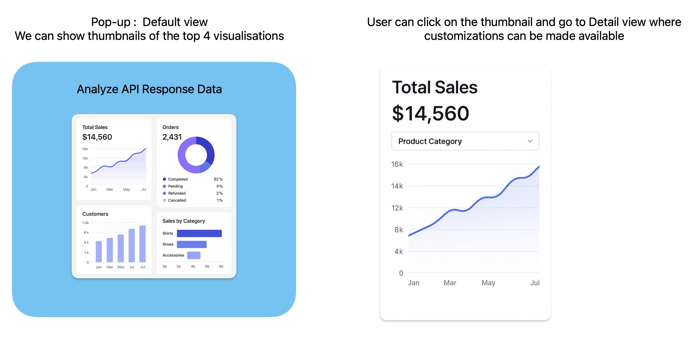

### About

1. Full Name - Mohammed Ayaan
2. Contact info (email, phone, etc.) - ayaan.md.blr@gmail.com, 99025 87579
3. Discord handle - ayaan.md
4. Home page (if any)
5. Blog (if any)
6. GitHub profile link - https://github.com/ayaan-md-blr
7. Twitter, LinkedIn, other socials - https://www.linkedin.com/in/md-ayaan-blr/
8. Time zone - UTC+05:30
9. Link to a resume - https://drive.google.com/file/d/1kICrybHZfWLkmSFGOIfv9nFpnef14DPG/view?usp=sharing

### University Info

1. University name - PES University Bangalore
2. Program you are enrolled in (Degree & Major/Minor) - BTech (AI/ML)
3. Year - 2023
4. Expected graduation date - 2027

### Motivation & Past Experience

Short answers to the following questions (Add relevant links wherever you can):

1. **Have you worked on or contributed to a FOSS project before? Can you attach repo links or relevant PRs?**

   No. My first experience is with apidash. I have raised a PR for issue #122(https://github.com/foss42/apidash/pull/730) and
   had a good learning. Fairly comfortable with the process now
   and looking forward to contribute and work towards merging the PR in the apidash repo.

2. **What is your one project/achievement that you are most proud of? Why?**

   I am proud of my self-learning journey in the AI area so far. I am equipped with considerable predictive and generative AI concepts and related tools/apis.
   I started with the perception that AI is new, exciting but extremely difficult. I overcame this challenge using multiple learning resources and balancing with
   my college academics and have been able to achieve much more than my peer group in terms of learning.
   Looking forward to learning and contributing to the open source space and add a new level to my learning journey.

3. **What kind of problems or challenges motivate you the most to solve them?**

   DSA related problems challenged me the most which also pushed me to solve them. I was able to solve complex problems in trees, graphs,
   recursion which I found very interesting.
   I am also part of the avions (college club related to aviation and aerospace) where we are building working models of airplanes. It is very challenging and at the
   same time motivating to make those models from scratch and fly them.

4. **Will you be working on GSoC full-time? In case not, what will you be studying or working on while working on the project?**

   Yes I can contribute full time. I dont have any other engagements since it will be my summer break.

5. **Do you mind regularly syncing up with the project mentors?**

   Definitely not. This is the opportunity I am looking forward to where I can work with the bright minds and gain guidance and knowledge. I would be available for
   any form of communication as required by the assignment.

6. **What interests you the most about API Dash?**

   The simplicity of the gitrepo attracted me to this project. It is very easy to understand and very well written.

7. **Can you mention some areas where the project can be improved?**

   Developer documentation w.r.t to the components, system design, best practices, coding standards, testing standards will increase the productivity of contributors.
   Also I feel there can be improvement in the look and feel of the user interface in terms of making it appear attractive and also enhance usability.

### Project Proposal Information

**1. Proposal Title** - AI UI Designer for APIs (#617)

**2. Abstract:**
Develop an AI Agent which transforms API responses into dynamic, user-friendly UI components, enabling developers to visualize and interact with data effortlessly.
I plan to address this by building a new component ai_ui_agent which uses ollama models suitable for codegen (codellama or deepseek probably) to generate the flutter
widgets which can be plugged into apidash ui. We can use third party component fl_chart for the charts generation.

**3. Detailed Description**
A rough ui mockup can be as below.
This popup will be rendered on click of the "data analysis" button on the response widget.
The default view of the popup can have thumb nails based on the visualizations applicable for the api response.
(Example prompt - List the charts to analyze the data in the given json)
On selection of each item in the drop down corresponding chart with customizations can be displayed.
Export component (link/button) can be provided on this pop up which will export the flutter component as a zip file.

To implement this we need to carry out the below tasks in order -
**Task1: LLM model evaluation and prompt design**
Evaluate the Ollama supported LLMs with good code generation capability.
We need to attempt several prompts which give us the output as required.
We need the prompt to

- List the suitable widgets (data table/ chart/ card/ form) for the given json data.
- The prompts should be fine tuned to generate different types of widgets as chosen by user.
- The prompts should also have placeholders for customizations (Searching, sorting, custom labels in charts)
- The prompts should be fine tuned to provide the look and feel of the apidash ui.
- The prompts should give good performance as well as provide accuracy of output.
  At the end of this task we should have working prompts as per the requirement.

**Task2: Build ai_ui_agent component**

- Build the ai*ui_agent component in the lib folder of the repo which encapsulates both the back end logic and ui widgets.
  At the end of this task we expect a working component with the below structure :
  **ai_ui_agent** - features
  \_ai_ui_agent_codegen.dart*
  (This will contain the fine tuned prompts for code generation)
  _exporter.dart_
  (This will contain the logic to export the generated flutter widget) - providers
  _ai_ui_agent_providers.dart_
  (Will hold the generated flutter code as state/ available for download) - services
  _ai_ui_agent_service.dart_
  (Will invoke the ollama service using ollama*dart package) - widgets
  \_ai_ui_widget.dart*
  (container widget for the generated code)
  (any other widgets required for customizations/styles) - utils
  _validate_widget.dart_
  (This should perform some basic validation/compilation to ensure the generated component can get rendered/exported successfully)
  _ai_ui_agent.dart_
  **Task3: Integrating this component with the response_pane widget**
  _screens/home_page/editor_pane/details_card/response_pane.dart_
  (Add a new button named "Data Analysis". on click - render the ai_ui_widget in a pop up.)
  **Task4: Writing unit and integration tests**
  **Task5: Perform functional testing with different apis and response formats.**
  This will be crucial to ensure it works with different apis with different json structures.
  This task may involve fine tuning/fixing the prompts as well.
  **Taks6: Updating the dev guide and user guide**

## 4. Week Project Timeline

### Week 1: Community Bonding and project initiation

- Engage with mentors and the community to understand project expectations.
- Finalize project requirements and milestones.
- Set up development environment (Ollama, Flutter, APIDash).
- **Outcome**: Working APIDash application, Working Ollama setup.

### Week 2-3: Task1: Evaluate Ollama codegen model and prompts creation

- Use sample json responses as input to Ollama model and develop basic prompts to generate Flutter chart components.
- Test the generated Flutter compoents for fitment into apidash standards.
- Document observations and gather mentor feedback.
- Enhance the initial prompts - provide customization placeholders, applying apidash specific styles/themes
- Repeat this step and finalize the expectations from mentor.
- **Outcome**: Finalized prompts to use for ai_ui_agent

### Week 4-5: Task2: Build ai_ui_agent

- Code backend using the prompts and models from Task1.
- Plan and implement unit/component tests for backend.
- **Outcome** - ai_ui_agent_codegen.dart, ai_ui_agent_providers.dart, ai_ui_agent_service.dart

### Week 6: Task3: ui components, exporter.

- Code front end components and configuration (eg: fl_chart)
- Plan and implement unit tests for ui widgets.
- Implement code to export the generated component.
- Plan and implement unit tests for exporter.
- **Outcome** - ai_ui_widget.dart, screens/home_page/editor_pane/details_card/response_pane.dart, exporter.dart

### Week 7-8: Task4: Unit and integration testing

- Enhance the tests written in Week4 & 5 to increase code coverage, negative scenarios and corner cases.
- Implement integration tests and capture basic performance metrics.
- **Outcome** - Unit test dart files, code coverage report

### Week 9: Task5: Functional testing

- Run manual end to end tests with different apis and response formats.
- **Outcome**: Bug fixes, Prompt Tuning.

### Week 10: Task6: Wrap up

- Final demo and mentor feedback.
- Update the dev guide, user guide and other documents.
- Create demo videos and presentations.
