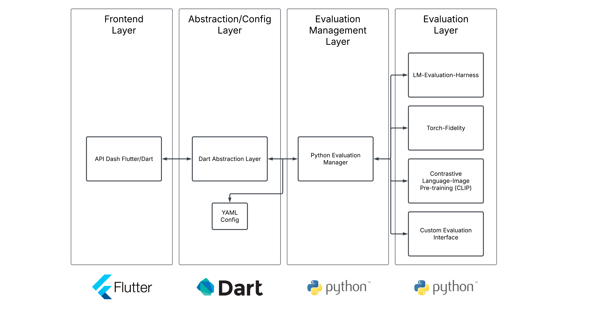
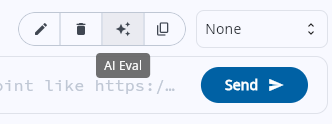
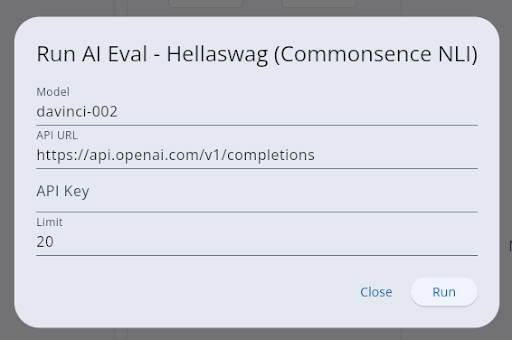
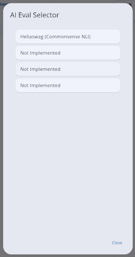
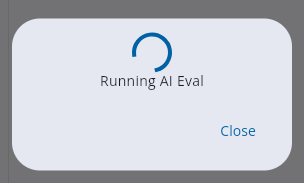
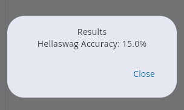

# AI API Eval Framework For Multimodal Generative AI
## Personal Details

**Full Name:** Nideesh Bharath Kumar

**Email:**  [bknideesh@gmail.com](mailto:bknideesh@gmail.com)

**Phone Number:**  +1-224-333-1045

**GitHub profile link:** [https://github.com/nb923](https://github.com/nb923)

**Location:** New Jersey, United States of America

**Time zone:** EST (GMT-5)

**Link to a resume (PDF, publicly accessible via link and not behind any login-wall):** [https://drive.google.com/file/d/1ajcP2LG4qC4k0HCHrqTacib-cK9jJmfQ/view?usp=sharing](https://drive.google.com/file/d/1ajcP2LG4qC4k0HCHrqTacib-cK9jJmfQ/view?usp=sharing)

## University Info

**University name:** Rutgers University–New Brunswick

**Program you are enrolled in (Degree & Major/Minor):** B.S. Computer Science, Artificial Intelligence Track

**Year:** Junior Year (Third Year)

**Expected graduation date:** May 2026

## Motivation & Past Experience

### Have you worked on or contributed to a FOSS project before? Can you attach repo links or relevant PRs?

Yes, I have begun contributing to FOSS projects recently, but I am still a beginner. I started getting involved this month after discovering the huge open-source community on Github and learning about Google SoC. I have already submitted a few pull requests to projects like Kubeflow and Musicblocks. Additionally, I solved part of the Flatpak packaging guide issue in API Dash. This PR was merged and I am currently working on the next step to integrate it with Flathub.

-   [Kubeflow PR #4055](https://github.com/kubeflow/website/pull/4055) – Kubeflow pull request
    
-   [Musicblocks PR #4569](https://github.com/sugarlabs/musicblocks/pull/4569) – Musicblocks pull request
    
-   [API Dash Issue #546](https://github.com/foss42/apidash/issues/546) – API Dash issue regarding Flatpak packaging
    
-   [API Dash PR #688](https://github.com/foss42/apidash/pull/688) – API Dash pull request regarding Flatpak packaging
    

### What is your one project/achievement that you are most proud of? Why?

I’m most proud of the Nutricart, a smart shopping cart project that uses computer vision to identify items for billing and to calculate nutritional information. This project challenged me to lead a less experienced team, learn new technologies, and drive a complex, fast-paced project to an award at the HackRU Spring 2025 Hackathon.

We as a team took an ambitious goal of creating a smart shopping cart that involved multiple technical areas, from machine learning to designing systems. I was the only member in the team that had experience with setting up databases, working with APIs, and training machine learning models. On top of this, a significant part of my responsibility was to work with Terraform, a tool I had never used before, to orchestrate the infrastructure of the system effectively.

I organized the team by distributing tasks among the members, including tasks like model training, frontend development, and database set up. After setting up and deploying an API server quickly, I dove into learning Terraform, using it to set up and connect the MongoDB Atlas and FastAPI endpoints. While I did my tasks, I also floated around helping train the TensorFlow model for image detection, setting up MongoDB Atlas, and managing API requests in the Swift frontend.

With our teamwork and my efforts in learning and implementing Terraform, we won the Best Use of Terraform Award at the hackathon. This achievement validated my technical skills, highlighted my ability to lead a diverse team in a fast-paced environment, and reinforced my confidence in working on multifaceted projects with diverse challenges.

-   [NutriCart Repo](https://github.com/nb923/NutriCart) – Smart shopping cart project
    

### What kind of problems or challenges motivate you the most to solve them?

I am motivated by challenges that push me out of my comfort zone and create real-world impacts. I love learning new skills and solving problems that affect people’s lives, whether it is by helping them directly or developing tools that they can rely on. For example, at the CS Base Climate Hack, my first ever hackathon, I pushed myself through the unfamiliar territory of APIs and Flutter, learning the new technologies through project-based experience. Despite the learning curve, I played a key role in developing the eco-friendly directions app interfacing the Google Maps API. On top of learning these new technologies, our team won the Best Overall Project award.

-   [BreatheEasy Repo](https://github.com/Joeweh/BreatheEasy) - Eco-friendly directions project
    

### Will you be working on GSoC full-time? In case not, what will you be studying or working on while working on the project?

If selected, I will be working on GSoC full-time. I am able to put in around 40 hours per week on this project, and I am open to putting in more hours if the project demands it.

### Do you mind regularly syncing up with the project mentors?

Regularly syncing up with the project mentors is perfectly fine with me. Any form of digital communication works for me. I can also ensure transparency in my work by updating a shared public progress document that shows the mentors exactly how much progress has been made and provides resources for future documentation of the feature.

### What interests you the most about API Dash?

What interests me the most about API Dash is its innovative use of Flutter, the simplicity it brings to handling complex tasks with a feature-rich suite, and the community is brings. Although I have used Flutter before, API Dash shows the true potential of developing multiplatform applications using Flutter, displaying an amazing UI/UX while staying feature-rich for developers on any platform. I also appreciate that API Dash takes a step above tools like Postman by not only providing cutting-edge AI features, but also enabling simplicity in API testing and development. Additionally, my experience working with the project has been amazing; its documentation and community videos makes building the project, resolving issues, and developing features straightforward.

### Can you mention some areas where the project can be improved?

Although API Dash already provides a well-structured codebase and solid documentation, more detailed insights of specific individual widgets, the code flow of each feature, and how all the features work together would help beginner contributors better understand the project.

Additionally, through my API eval project research and prototyping, I have seen firsthand the importance of thoroughly testing endpoints and implementing capabilities for endpoint testing. However, the cost and rate limiting of APIs is a major problem. By using an API explorer with cached responses and standard benchmarks, API Dash can provide a comprehensive suite of endpoint testing capabilities that address these issues.

## Project Proposal Information

### Proposal Title and Abstract

**Title:** AI API Eval Framework For Multimodal Generative AI

**Abstract:**

This project is to develop a Dart-centered evaluation framework designed to simplify the testing of generative AI models across multiple types (text, image, code). This will be done by integrating evaluation toolkits: lm-harness for text, torch-fidelity and CLIP for images, and HumanEval/MBPP with CodeBLEU for code. This project will provide a unified config layer which can support standard and custom benchmark datasets and evaluation metrics. This will be done by providing a user-friendly interface in API Dash which allows the user to select model type, dataset management (local or downloadable), and evaluation metrics (standard toolkit or custom script), and other API config details. On top of this, real-time visual analytics will be provided to visualize the progress of the metrics as well as parallelized batch processing of the evaluation.

### Detailed Description

**Key Features:**

1. **Unified Evaluation Configuration:**
   - A config file in YAML will serve as the abstraction layer, which will be generated by the user's selection of model type, dataset, and evaluation metrics. This will redirect the config to either use lm-harness, torch-fidelity and CLIP, or HumanEval and MBPP with CodeBLEU. Additionally, custom evaluation scripts and datasets can be attached to this config file which can be interpreted by the systems.
   - This abstraction layer ensures that whether any of these specifications are different for the eval job, all of it will be redirected to the correct resources while still providing a centralized layer for creating the job. Furthermore, these config files can be stored in history for running the same jobs later.

2. **Intuitive User Interface:**
   - When starting an evaluation, users can select the model type (text, image, or code) through a drop-down menu. The system will provide a list of standard datasets and use cases. The user can select these datasets, or attach a custom one. If the user does not have this dataset locally in the workspace, they can attach it using file explorer or download it from the web. Furthermore, the user can select standard evaluation metrics from a list or attach a custom script.

3. **Standard Evaluation Pipelines:**
   - The standard evaluation pipelines include text, image, and code generation.
   - For text generation, lm-harness will be used, and utilize custom datasets and tasks to measure Precision, Recall, F1 Score, BLEU, ROUGE, and Perplexity. Custom integration of datasets and evaluation scores can be done through interfacing the lm-harness custom test config file.
   - For image generation, torch-fidelity can be used to calculate Fréchet Inception Distance and Inception Score by comparing against a reference image database. For text to image generation, CLIP scores can be used to ensure connection between prompt and generated image. Custom integration of datasets and evaluation scores can be done through a custom interface created using Dart.
   - For code generation, tests like HumanEval and MBPP can be used for functional correctness and CodeBLEU can be used for code quality checking. Custom integration will be done the same way as image generation, with a custom interface created using Dart for functional test databases and evaluation metrics.

4. **Batch Evaluations:**
   - Parallel Processing will be supported by async runs of the tests, where a progress bar will monitor the number of processed rows in API Dash.
5. **Visualizations of Results:**
   - Visualizations of results will be provided as the tests are running, providing live feedback of model performance, as well as a general summary of visualizations after all evals have been run.
   - Bar Graphs: These will be displayed from a range of 0 to 100% accuracy to visualize a quick performance comparison across all tested models.
   - Line Charts: These will be displayed to show performance trends over time of models, comparing model performance across different batches as well as between each model.
   - Tables: These will provide detailed summary statistics about scores for each model across different benchmarks and datasets.
   - Box Plots: These will show the distribution of scores per batch, highlighting outliers and variance, while also having side-by-side comparisons with different models.

6. **Offline and Online Support:**
   - Offline: Models that are offline will be supported by pointing to the script the model uses to run, and datasets that are locally stored.
   - Online: These models can be connected for eval through an API endpoint, and datasets can be downloaded with access to the link.

**Architecture:**

-   Frontend Layer: This layer will be the main API Dash app UI. It will use Flutter/Dart to build a UI for users to select the AI evaluation test specifications and obtain details such as API key, model name, API link, and other details. This layer will also display the real-time charts of the evaluations and final metrics.
    
-   Abstraction/Config Layer: This layer will be using Dart to take the details from the frontend and filling out the YAML template for API Evaluations. This will provide specifications for which evaluation system, which model, what scoring methodologies, where the datasets should be obtained, whether batch evaluations should be enabled or disabled, etc. This layer will also relay the results from the evaluation management layer as real-time and final metrics are relayed.
    
-   Evaluation Management Layer: This layer will use Python to interface the evaluation layer, which consists of packages that are mostly written in Python. It will take the YAML file and configure the correct evaluation, acting as the “operator” of the system. Furthermore, as metrics are obtained from the evaluation layer, this layer will feed back into the Dart layer.
    
-   Evaluation Layer: This layer consists of common packages for evaluation such as lm-evaluation-harness, torch-fidelity, CLIP, and also provides a custom template for custom implementations of evaluations. This layer will also have custom scripts written in Python to add additional functionality to the packages to connect to the overall API Dash. For example, scripts to provide live data, interface custom API links, etc.
    

Other than the frontend layer, all of the other layers will be packaged to support the current architecture of API Dash.

**Prototype:**

The current prototype:

-   [API Dash AI Evaluation Prototype](https://github.com/nb923/apidash) - Prototype Repo

This prototype contains a custom UI implementation of the AI evaluation layer, letting the API Dash interface to run AI API tests. Currently it only supports the davinci-002 model from OpenAI and the Hellaswag test. All the information is already prefilled other than the OpenAI API key, which needs to be provided.

The top right corner has a new button for API evaluations as show in the picture below:

When selected, it prompts a selection of tests:

Hellaswag is the only implemented test currently. When selected, it prompts a menu with model name, API URL, API key, and limit of dataset rows being tested. I recommend setting the limit to 20 to reduce API usage.

When run is selected, it prompts a loading screen as the lm-evaluation-harness processes this request through a custom implementation of the provided models.

After the evaluation is finished, it provides a quick value for the accuracy. This is a simple prototype and a limit of rows on the test is set; so, this metric should be taken with a grain of salt.

Key changes are:

-   Added button in the editor_title_actions.dart file
    
-   Added UI and config layer logic in request_editor_top_bar.dart
    
-   Added lm-evaluation-harness package under apidash/lib
    
-   Added evaluate.<!-- -->py in this folder for the evaluation management layer
    
-   Added apidash.<!-- -->py to provide an interface for API Dash based models in lm-evaluation-harness
    

This implementation provides basic logic, but is not directly transferable to all APIs yet. Further specifics of the implementation can be found in the repo link above.

To run it, follow the API Dash local setup steps and also create a venv inside the lm-evaluation-harness folder based on the requirements.txt. You will need an OpenAI API key to test this, I can provide one on request if necessary.

### Timeline

**Pre-GSoC**

Implement prototypes of different datasets and models in the current prototype above using lm-evaluation-harness, and also implement prototypes using torch-fidelity, CLIP, and custom scripts. These will be quick prototypes that will not be neat code, however create an understanding of how the evaluation frameworks work and how to interface them using the architecture above.

**Community Bonding**

Learn about the code base of API Dash, learn about the procedures of generation sustainable code, and submit some simpler PRs to gain an understanding of the framework that API Dash follows in their open source methodology. Additionally, work on discussing with the team on the architecture, diving deeper into the implementation as prototypes have already been built, and understanding exactly what specifications the community wants for this feature.

  

NOTE: Each layer of the architecture is planned to take 3 week sprints. For example, 3 weeks will be planned to work on the frontend (for prototyping, developing, and testing).

**Week 1-3**

Understand the structure of how UI elements and logic are used to build up the API Dash application. Then, plan out draft UIs using Figma and create prototypes of the UI in the project. Present these prototypes to see which one works the best for this feature.

Start implementing the chosen prototype in depth, providing safety for invalid inputs and clean coding practices. Also, provide an easy gateway for the Dart layer to interact with this UI layer. Some features this UI layer will include are the evaluation selection, real-time graphs of metrics, final metrics, etc.

Add rigorous test cases to cover all blindspots in the UI. Make sure all invalid inputs are covered and the diverse type of outputs and inputs this interface can recieve will all be handled by this framework. Fix any bugs that arise during this week.

**Week 4-6**

Start drafting potential YAML configurations for the inputs recieved from the UI layer. Create custom prototypes for these implementations, and request feedback to see which one works best. On top of this, make Dart scripts that can generate these YAML files and provide and recieve data from the evaluation management layer.

Start implementing the chosen prototype in, making sure to create efficient implementations that will also be able to handle a variety of inputs from the UI and a variety of inputs from the evaluation management layer.

Add test cases to cover all blindspots and fix any bugs that arise during this time. Be sure to add integration tests between the UI and abstraction/config layer.

**Week 7-9**

Similar to the previous week, start drafting the evaluation management layer in Python based on the specifications. Make sure this can work with all four evaluation frameworks from the architecture, and can clean and provide the abstraction/config layer with clean and consistent real-time data. Provide potential prototypes for this framework.

Start implementing the chosen prototype based on feedback, make sure to take into account all the details specified before. Then, add test cases to cover all blindspots. Make sure to add integration tests between the abstraction/config layer and this layer.

**Week 10-12**

Plan interfaces with the evaluation packages and the custom template for custom evaluation frameworks the user can provide. Implement the selected prototype, and make sure to add integration and E2E tests. As this week is easier because most packages are already implemented, also work on the documentation of the features built.

**Week 13**

Potential last week to fix up any minor bugs and work on features in case of any delay.

### Milestones

-   Implement Frontend Layer
    
-   Implement Abstraction/Config Layer
    
-   Implement Evaluation Management Layer
    
-   Implement Evaluation Layer
    

Each milestone should take around 3 weeks and the pacing of the milestones will determine if the project should be extended, scoped up/down, or continued at the current pace.
