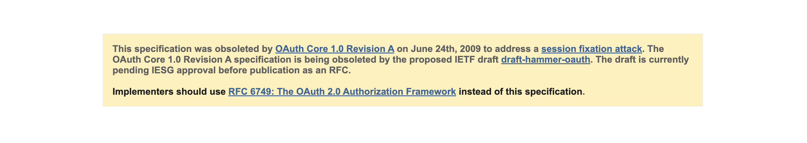

### About 

1. Full Name
- Papa Kofi Boahen
3. Contact info (email, phone, etc.)
- Email: papakofiboahen@gmail.com
- Phone: +233538966851
6. Discord handle
- .papakofi
7. Home page (if any)
- [Link to homepage](https://devportfolio-sepia-eight.vercel.app/)
9. GitHub profile link 
- [GitHub Profile](https://github.com/StormGear)
10. Twitter, LinkedIn, other socials
- [X](https://x.com/kofiishere)
- [LinkedIn](https://www.linkedin.com/in/papakofiboahen)
- [DevPost](https://devpost.com/papakofiboahen)
11. Time zone
- GMT+0 Abidjan/Accra
12. Link to a resume (PDF, publicly accessible via link and not behind any login-wall)
- [Link to Resume](https://drive.google.com/drive/folders/1C3aLqlWrBX4TVh9E3YesPQuqb_aE5lw6?usp=sharing)

### University Info

1. University name
- Academic City University - [School Website](https://acity.edu.gh/)
2. Program you are enrolled in (Degree & Major/Minor)
- BSc Computer Engineering Minor: Telecommunications
3. Year 
- 2022
5. Expected graduation date
- June 2025

### Motivation & Past Experience

Short answers to the following questions (Add relevant links wherever you can):
1. Have you worked on or contributed to a FOSS project before? Can you attach repo links or relevant PRs? 
- I have been gradually learning and introducing myself to open source software development. 
- I have started out contributing to the APIDash project which I found quite interesting due to the fact that is was been written in Dart.
- Currently, I have been able to get two PRs merged. One of the PRs was a contribution to the documentation on the installation steps for macOS users. Here is a link to the merged [PR](https://github.com/foss42/apidash/pull/521)
- The other was a contribution towards adding insomnia importer to the APIDash project. This contribution led to the closing of a **High priority** issue of the repo. Here is a link to the merged [PR](xhttps://github.com/foss42/apidash/pull/525)
##### Other ways I have contributed to the Open Source Community
- As the Google for Developers on Campus Club Lead, I held two events introducing students to open source software. The first event which I led myself, teaching students basic Git and GitHub concepts. The second “Introduction to Open Source” event, I partnered with other universities within my country where we invited professional software engineers and open source maintainers to speak on open source development. 
- I have given technical talks within the developer community. Notable amongst these is my talk at the Google DevFest, Accra and Google I/O Extended events. At DevFest, I gave a talk on how to automate mobile app deployments to App Stores. Here is a link to the [Youtube Live](https://www.youtube.com/watch?v=DDFoWo0YO-k&t=6332s) event.

2. What is your one project/achievement that you are most proud of? Why?
- In my country alone, 12,710 tons of municipal solid waste is generated daily, however only about 10% of this is collected and disposed of properly. We have set out to build a digital platform that enables users to order for and schedule trash takeouts seamlessly. We are still in the prototyping phase and are working hard to build and to acquire investor support. My role includes developing mobile applications and occasionally working on the backend. I also have business and entrepreneurship roles. We have participated in entrepreneurship training and have been able to secure some funding to kickstart the project. The app is currently released on PlayStore and AppStore would be launched to end users soon. This has potential to address a pressing challenge within my country and beyond.

3. What kind of problems or challenges motivate you the most to solve them?
- Socio-Economic challenges motivate me to address some of them within my capacity. Coming from a third-world country, there are several socio-economic challenges that need to be addressed. I strongly believe that technology is instrumental in addressing some of our most pressing needs. It is also important to equip engineers in order to enhance their ability to tackle these issues. 
4. Will you be working on GSoC full-time? In case not, what will you be studying or working on while working on the project?
- I can and would make arrangements to work on GSoC full-time. Continuous learning is imperative for any developer. I will be enhancing my skillset during GSoC as well as learning more about distributed systems and artificial intelligence.
6. Do you mind regularly syncing up with the project mentors?
- I will be available to sync up regularly with the project mentors for needed guidance and to speak on how the project is progressing.

7. What interests you the most about API Dash?
- API Dash is a promising API client, being built using Flutter really defines what's possible with Flutter. It is promising for both the Flutter and the Developer community. The promise of incorporating AI in future releases is also very exciting. The responsiveness of API Dash maintainers is also really good.

8. Can you mention some areas where the project can be improved?
- API Dash is on a good course. I have seen the **Roadmap** as well as other interesting ideas in the pipeline for GSoC. I would like to add that API Dash could have a web client and support live collaboration amongst teams.

### Project Proposal Information

1. Proposal Title
-  Adding Support for API Authentication Methods and API Dash Feature Improvements
2. Abstract: A brief summary about the problem that you will be tackling & how.
- Authentication Methods Overview
1. Basic Authentication

Simple username/password transmission
Credentials encoded in Base64
Sent via HTTP Authorization header.

2. API Key Authentication

Single token for identifying application/user
Can be sent via Request headers or
Query parameters

3. Bearer Token Authentication

Uses access tokens for authorizationypically JWT-based
Stateless authentication mechanism.

4. JWT Bearer Token

Self-contained authentication token contains encoded user claims
Cryptographically signed which also supports token expiration and validation

5. Digest Authentication

Challenge-response authentication protocol which 
prevents sending plain-text credentials.


6. OAuth 1.0

This is complex requiring multiple request-response cycles
which provides secure delegated access. 

7. OAuth 2.0

Supports various grant types allowomg third-party service authorization such as signing in with Google, Apple or Facebook.

Along with these, I intend on working on some of the API Dash Feature Improvements such as
- Adding support for more content types in request
- Importing from/Exporting to OpenAPI/Swagger specification 
- JSON body syntax highlighting, beautification, validation

3. Detailed Description

### Implementation Phases
1. Initial Assessment

- Read technical documentations to gain insights on implementing these authentication strategies securely

2. Security Hardening

Implement HTTPS
Using secure token transmission
Add additional encryption layers
Implement robust error handling

3. Validation and Testing

- Unit testing authentication flows 
- Simulating various authentication scenarios

- Implementation of theses would require the use of some of these packages at least <br/>
*http:* For making HTTP requests <br/>
*dart_jsonwebtoken:* JWT token handling <br/>
*flutter_secure_storage:* Secure token storage <br/>
*oauth1:* OAuth 1.0 implementation <br/>
*crypto:* Cryptographic operations

1. Basic Authentication
- For this implementation, I would essential create a class with a simple method
```dart
Future<http.Response> makeBasicAuthRequest(
    String url, 
    String username, 
    String password
  )
```
-- This method accepts the url for the request as well as the password needed for the request. <br>
-- The username:password combination is then encoded to base64.
-- This encoding would further be attached and sent as an `Authorization` Request in the HTTP headers like so `Basic $credentials` with $credentials representing the base64 encoded value.

2. API Key Authentication

```dart
 Future<http.Response> makeRequestWithHeaderApiKey(
    String url, 
    String apiKey
  )
```
- apiKey is supplied via the `X-API-Key` HTTP header 

```dart
 Future<http.Response> makeRequestWithQueryApiKey(
    String url, 
    String apiKey
  )
```
- In the method, the apikey is supplied via a query parameter like so:
`'$url?api_key=$apiKey'`.
- This offers a different approach of including api key for a request.

3. Bearer Token Authentication
```dart
  Future<http.Response> makeRequestWithBearerToken(
    String url, 
    String token
  )
```
- token is supplied via the `Authorization` HTTP header like so `Bearer $token`
4. JWT Bearer
- A class with methods for generating JWT and verifying JWT
```dart
 String generateJwt(String userId)
```
- Using the userId, or some alternative parameter, the [dart_jsonwebtoken](https://pub.dev/packages/dart_jsonwebtoken) can be used to generate and sign JWT
- After generation and signing, the JWT has to be verified. The docs for `dart_jsonwebtoken` provides a good overview of how that could be achieved

```dart
try {
  // Verify a token (SecretKey for HMAC & PublicKey for all the others)
  final jwt = JWT.verify(token, SecretKey('secret passphrase'));

  print('Payload: ${jwt.payload}');
} on JWTExpiredException {
  print('jwt expired');
} on JWTException catch (ex) {
  print(ex.message); // ex: invalid signature
}
```

5. Digest Authentication
- Digest Auth provides more secure form of authentication. We could make use of the [crypto](https://pub.dev/packages/crypto) dart package, which provides several implementations for hashing algorithms. This authentication mechanism also prevents sending plain-text credentials.
An example of creating a hash is shown below:
```dart
 final ha1 = md5.convert(
      utf8.encode('$username:$password')
    ).toString();
```

6. OAuth 1.0
- This Dart library contains key implementations necessary for implementing authentication with OAuth 1.0 [OAuth1](https://pub.dev/packages/oauth1). Some key steps in using OAuth1 is as follows:
```dart
 // Get temporary credentials
 final tempCredentials = await authorization.requestTemporaryCredentials(
      'https://callback-url.com'
    );

// Redirect user to authorization page
final authorizationUrl = authorization.getResourceOwnerAuthorizationUrl(
    tempCredentials
);

// After user authorization, get token credentials
final tokenCredentials = await authorization.requestTokenCredentials(
    tempCredentials, 
    verifier
);
```
where `authorization` is an instance of the Authorization class which is created with client credentials and platform definition (Platforms include X, Apple, Google etc) provided by the aforementioned library. 
It is important to note however that the OAuth1.0 is being deprecated in favor of the 2.0 framework. Learn more [oauth1](https://oauth.net/core/1.0/) <br/>



7. OAuth 2.0
- This is a modern authorization framework. Here is the docs for using the framework, [Oauth 2.0](https://oauth.net/2/) A typical class implementing OAuth would be as shown
```dart
class OAuth2Service {
  final String clientId;
  final String clientSecret;
  final String redirectUri;
  final String authorizationEndpoint;
  final String tokenEndpoint;

  OAuth2Service({
    required this.clientId,
    required this.clientSecret,
    required this.redirectUri,
    required this.authorizationEndpoint,
    required this.tokenEndpoint
  });

  // Generate authorization URL
  String getAuthorizationUrl() {
    return '$authorizationEndpoint?'
      'client_id=$clientId&'
      'redirect_uri=$redirectUri&'
      'response_type=code&'
      'scope=profile';
  }
}
```
`clientId`: A unique identifier issued to your application when you register it with the OAuth provider. <br>
`clientSecret`: A confidential secret known only to your application and the authorization server <br>
`redirectUri`: The URL where the authorization server redirects the user after they approve/deny the authorization request <br>
`authorizationEndpoint`: The URL at the authorization server where users are redirected to begin the OAuth flow. <br>
`tokenEndpoint`: The URL at the authorization server used to exchange authorization codes for access tokens.

- Most these implementations would be made using Classes, unit and integration tests would be made for these classes and their methods. Integration testing would also be considered where appropriate.


4. Weekly Timeline: A rough week-wise timeline of activities that you would undertake.

- A week-wise timeline is shown below

| Week | Primary Focus | Key Activities | Deliverables/Outcomes |
|------|--------------|----------------|----------------------|
| Week 1 | Project Setup & Initial Research | - Review technical documentation for authentication strategies | - Comprehensive research report |
| | | - Environment setup and dependency configuration | - Development environment setup |
| Week 2 | Basic Authentication | - Implement `makeBasicAuthRequest` method | - Writing Basic Authentication class |
| | | - Create secure base64 encoding functionality | - Unit tests for Basic Authentication |
| | | - Add HTTPS implementation and security layers | - Basic security documentation |
| Week 3 | API Key Authentication | - Implement header-based API key authentication | - API Key Authentication class |
| | | - Implement query parameter-based API key authentication | - Writing API key authentication methods |
| | | - Create secure storage mechanism for API keys | - Unit tests for API key methods |
| Week 4 | Bearer Token Authentication | - Implement `makeRequestWithBearerToken` method | - Bearer Token Authentication class |
| | | - Create token validation and verification | - Unit tests for token validation |
| | | - Implement secure token storage | - Token security documentation |
| Week 5 | JWT Implementation (Part 1) | - Set up `dart_jsonwebtoken` integration | - JWT generation functionality |
| | | - Implement JWT generation method | - JWT verification method |
| | | - Create token expiration handling | - Initial JWT testing framework |
| Week 6 | JWT Implementation (Part 2) | - Implement error handling for JWT validation | - Complete JWT Authentication class |
| | | - Add refresh token functionality | - Unit tests for JWT functionality |
| | | - Create comprehensive JWT documentation | - JWT implementation documentation |
| Week 7-8 | Digest Authentication | - Implement Crypto package integration | - Working Digest Authentication class |
| | | - Create secure hash generation for credentials | - Hash verification functionality |
| | | - Implement nonce and challenge handling | - Unit and integration tests |
| Week 9 | OAuth 1.0 Implementation | - Set up OAuth1 package integration | - OAuth 1.0 implementation class |
| | | - Implement temporary credentials request flow | - Authorization URL generation |
| | | - Create token credentials handling | - OAuth 1.0 testing framework |
| Week 10-11 | OAuth 2.0 Implementation | - Create OAuth2Service class | - Complete OAuth 2.0 implementation |
| | | - Implement authorization URL generation | - Token endpoint integration |
| | | - Add client ID/secret management | - OAuth 2.0 flow documentation |
| Week 12 | Security Hardening | - Implement additional encryption layers | - Security audit report |
| | | - Add robust error handling across all authentication methods | - Updated security documentation |
| | | - Create secure token transmission mechanisms | - Security hardening test suite |
| Week 13 | Integration Testing | - Create integration tests for all authentication flows | - Integration testing framework |
| | | - Simulate various authentication scenarios | - Test coverage report |
| | | - Fix issues discovered during testing | - Integration test documentation |
| Week 14 | Performance Optimization | - Analyze authentication performance | - Performance optimization report |
| | | - Implement caching mechanisms where appropriate | - Updated authentication classes |
| | | - Optimize token refresh procedures | - Performance test results |
| Week 15 | Documentation & Project Closure | - Create comprehensive API documentation | - Complete API documentation |
| | | - Develop usage examples and guides | - Implementation examples |
| | | - Finalize project and prepare for deployment | - Final project delivery report |

In summary this is an overview of the weekly timelines: <br>
*Weeks 1-4:* Setup, research, and implementation of simpler authentication methods (Basic Auth, API Key, Bearer Token) <br>
*Weeks 5-8:* Implementation of more complex authentication systems (JWT, Digest Authentication)
*Weeks 9-11:* OAuth implementations (both 1.0 and 2.0) <br>
*Weeks 12-15:* Security hardening, testing, optimization, and documentation


