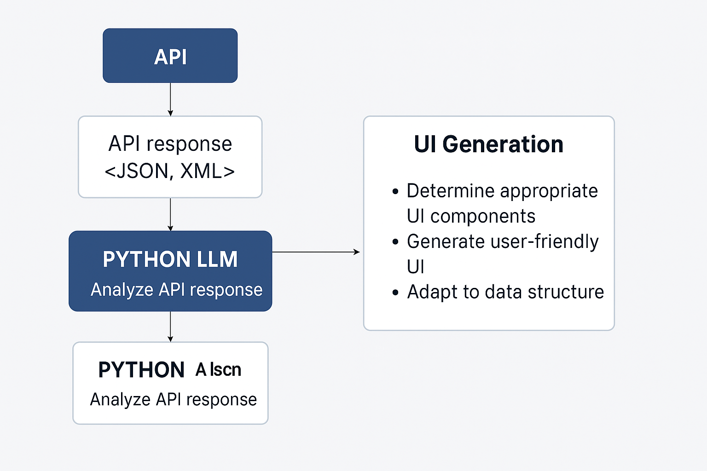

## About
1. **Full Name**: Syed Abdullah
2. **Email**: [syedabdullah199758@gmail.com](mailto:syedabdullah199758@gmail.com)
3. **Phone**: +92 334 1157461
4. **Discord Handle**: syedabdullah1270
5. **Website**: [syedabdullah58-dev.github.io/react-portfolio](https://syedabdullah58-dev.github.io/react-portfolio/)
6. **GitHub**: [github.com/SyedAbdullah58-dev](https://github.com/SyedAbdullah58-dev)
7. **Blog**: [https://medium.com/@syedabdullah58]
8. **LinkedIn**: [linkedin.com/in/syed-abdullah-07b84912b](https://www.linkedin.com/in/syed-abdullah-07b84912b/)
9. **Time Zone**: GMT+5 (Karachi/Islamabad)
10. **Resume**: https://drive.google.com/file/d/1J3HQDiwuWCu2AjkMH0Kqd68hhr0PmGOx/view?usp=sharing

## University Info
1. **University Name**: University of Engineering and Technology, Taxila
2. **Program**: Bachelor's in Software Engineering
3. **Year**: Graduated (2017–2021)
4. **Expected Graduation Date**: 2021
5. **Current Status** Currently I am an early stage professional but quite new to open source.
---

## Motivation & Past Experience

1. **FOSS Contributions**: While my main contributions have been in professional and freelance capacities, some public code is available on my GitHub: [github.com/SyedAbdullah58-dev](https://github.com/SyedAbdullah58-dev). Due to NDAs, many projects are confidential, but you can also view my [freelance profiles](https://www.upwork.com/freelancers/~01b92bf0ea00b68dd5?viewMode=1) and [Fiverr](https://www.fiverr.com/syed_abdulla?up_rollout=true) for client feedback and types of work.
2. **Most Proud Project**: I'm most proud of contributing to the revamp of a legacy ERP system for a U.S. based client. I worked on the architecture, built REST APIs in .NET Core, and integrated microservices with a gateway pattern. The complexity and impact of the project, plus client satisfaction, make it a standout.
3. **Motivating Challenges**: I thrive on solving architectural problems, especially when integrating systems, improving performance, or creating clean developer experiences through APIs and workflows.
4. **GSoC Full-Time Commitment**: Yes, I can commit to GSoC full-time as I am currently managing my freelance workload accordingly.
5. **Syncing with Mentors**: Not at all — I welcome regular syncs and mentorship sessions to keep aligned and improve faster.
6. **Interest in API Dash**: The emphasis on developer experience, API documentation, and testing resonates with my interests and past experience. It's an exciting challenge to help shape a tool used by other developers.
7. **Suggestions for API Dash Improvement**:
    - Improve nested API response visualization

### Project Proposal Information

1. **Proposal Title**  
   AI-Powered Dynamic UI Generator from API Responses

2. **Abstract**  
   This project aims to create an AI agent that analyzes JSON or XML API responses and automatically generates intuitive UI components such as tables, charts, forms, toggles, and cards. The goal is to eliminate manual UI creation for API response visualization and allow developers to preview and export UI components directly into Flutter or Web apps. The agent interprets data structures, predicts the appropriate UI layout, and outputs a standardized schema that can be dynamically rendered.
3. **Detailed Description**

The core idea is to build an AI-driven engine that understands the structure and semantics of API data. Based on this analysis, the engine creates a layout schema which defines how the data should be visualized. This schema is then consumed by a dynamic UI renderer (implemented in Flutter) which generates the corresponding UI elements.

This project removes the manual effort of interpreting API response formats and building UI accordingly. By analyzing JSON or XML responses in real-time, our AI agent intelligently maps fields to suitable widgets and layouts (e.g., lists, charts, toggles, etc.). The output schema becomes a blueprint for a Flutter frontend, which renders a dynamic interface based on the schema, enabling developers to instantly preview and export ready-to-use UI code.

#### Architecture Diagram:

```
            +-------------------------+
            |     API Response       |
            |   (JSON or XML data)   |
            +-----------+-------------+
                        |
                        v
     +------------------+------------------+
     | AI Schema Generator (Python logic) |
     |  - Rule-based analysis             |
     |  - Data profiling / heuristics     |
     |  - Future LLM integration          |
     +------------------+------------------+
                        |
                        v
                +-------+--------+
                | UI Schema JSON |
                +-------+--------+
                        |
                        v
           +------------+-------------+
           | Flutter Dynamic Renderer |
           |  - Tables, Charts, Cards |
           |  - Toggles, Sliders, etc |
           +--------------------------+
```

#### Key Features:
- **AI-Based Schema Generator**: A Python script that intelligently analyzes API responses and maps fields to appropriate UI components.
- **Component Variety**: Supports text, toggles, dropdowns, sliders, date pickers, and real bar charts using `fl_chart`.
- **Real-Time UI Rendering**: The schema is used directly in Flutter to render a live, interactive UI.
- **Extensibility**: Designed to scale with support for nested data, user-defined widgets, themes, and layout preferences.
- **Backend Ready**: AI agent can be exposed via FastAPI to serve UI schemas as an API service.
- **LLM Integration Ready**: Future integration with language models (like GPT or Claude) to semantically interpret field names.
- **Export UI**: Planned support to export generated UI to usable Flutter widget code.
- **Adaptive UI Layout**: Based on structure, renders data in a table, card, or chart layout intelligently.

### Proof of Concept (PoC)
- Code has been added to the repository.
- The schema generator is written in Python (`ai_ui_schema_generator.py`).
- The Flutter frontend dynamically renders the UI based on the schema.
- Sample chart, dropdown, and toggle components are shown based on input data.
- Below is a preview of the PoC UI output:


check that on the basis of data, different widgets are rendered. for Name it renders Text, Age got Bar chart, Record is Active or not got switch button, Drop down for statuses and for Score it rendered Slider.
To understand more visually, I have added to flow diagrams  


4. **Weekly Timeline (10 Weeks)**

**Community Bonding (Before Coding Phase)**
- Finalize use cases and visual goals with mentors.
- Prepare sample datasets and edge-case examples.

**Week 1: Schema Generator (JSON)**
- Finalize and modularize Python script for analyzing JSON.
- Define rule-based mapping for component generation.
- Create reusable utilities for type detection and layout.

**Week 2: XML Support + Schema Validation**
- Add support for parsing and analyzing XML API responses.
- Define schema structure, validation rules, and JSON format standard.

**Week 3: FastAPI Server + Mock Endpoints**
- Wrap schema generator in a FastAPI backend.
- Provide endpoints to analyze uploaded data and return UI schema.

**Week 4: Flutter Dynamic Renderer Integration**
- Connect Flutter app to backend API.
- Render widgets dynamically using schema.
- Handle component types: text, toggle, dropdown, slider, date.

**Week 5: Charts and Layout Customization**
- Integrate `fl_chart` for rendering bar charts and pie charts.
- Add layout selector in schema (table, card, list).

**Week 6: Export-to-Code + UI Preview Panel**
- Implement code generation logic from schema.
- Preview Flutter widget code side-by-side.

**Week 7: Nested Structure Support + Styling Configs**
- Support nested arrays, objects, and grouped cards.
- Add styling configuration: color themes, spacing, etc.

**Week 8: Filters, Sorting, and Pagination Controls**
- Extend schema to include metadata for UI controls.
- Build UI logic to handle these interactions.

**Week 9: LLM Integration + Smart Inference**
- Use OpenAI/Hugging Face model to analyze field semantics.
- Predict ideal widgets beyond rule-based logic.

**Week 10: Final Polish + Testing + Documentation**
- Complete UI polish, error handling, schema validation.
- Write documentation and usage guide.
- Record demo and submit final evaluation + blog post.
