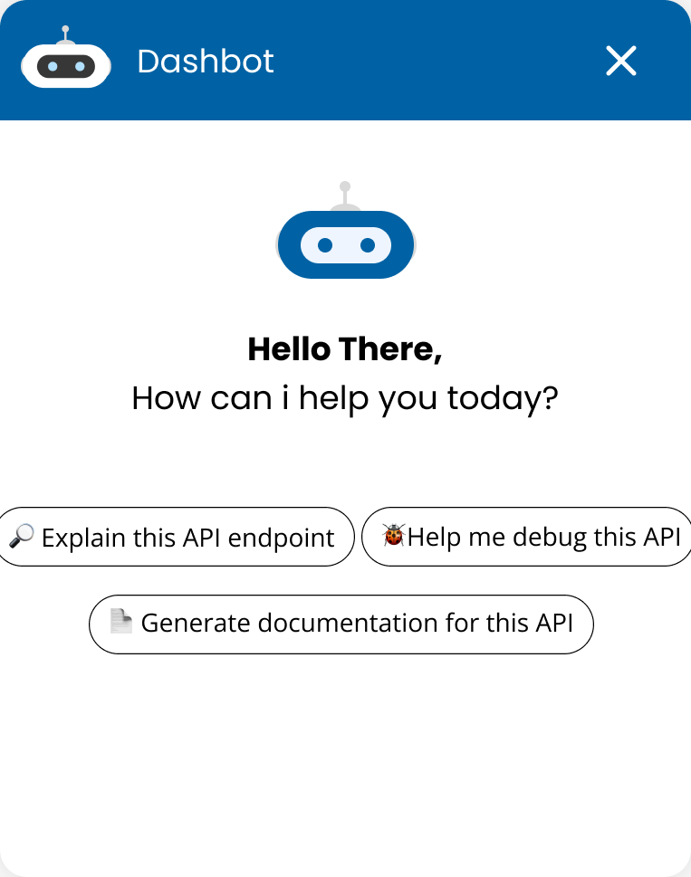
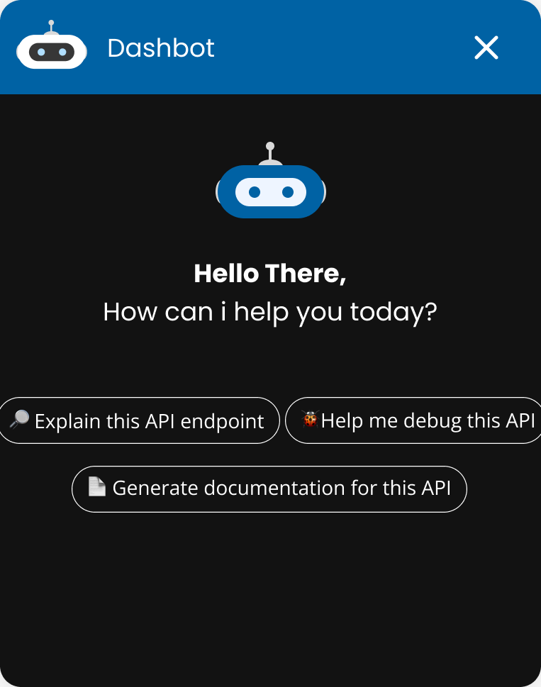
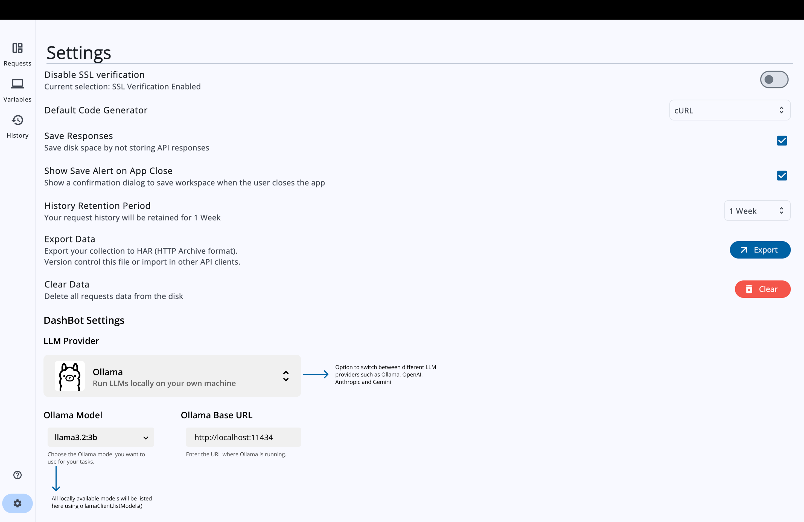
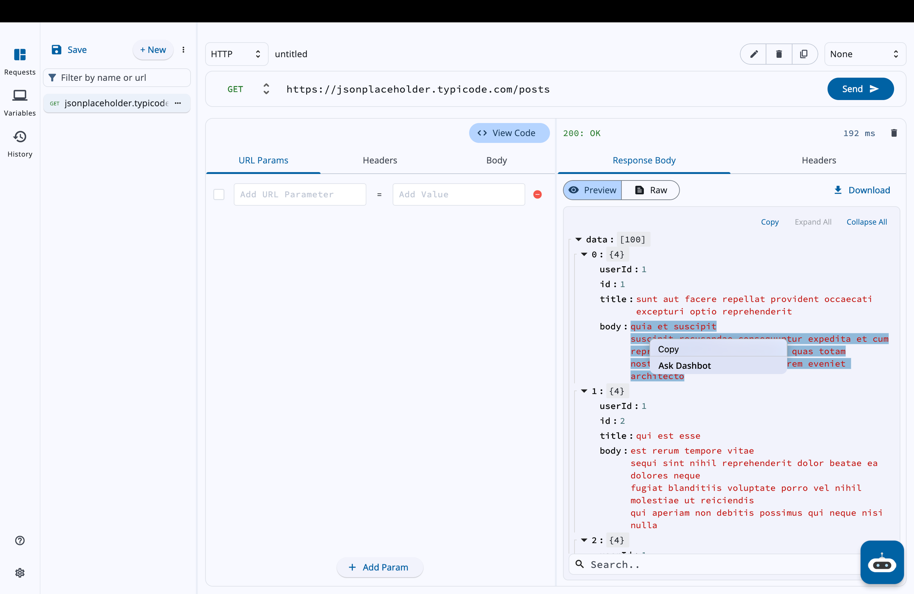
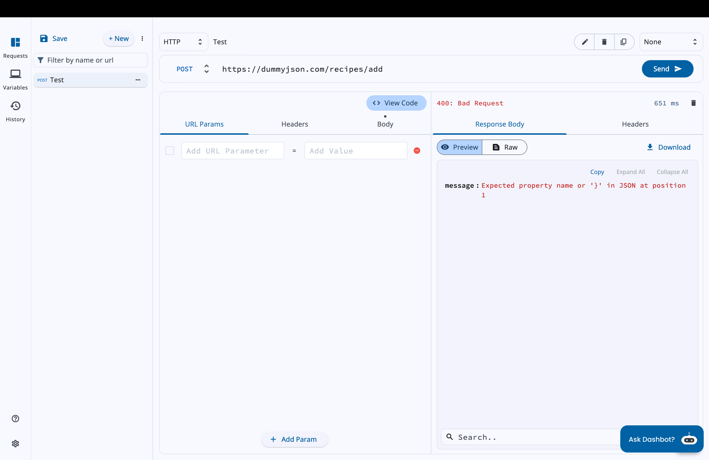
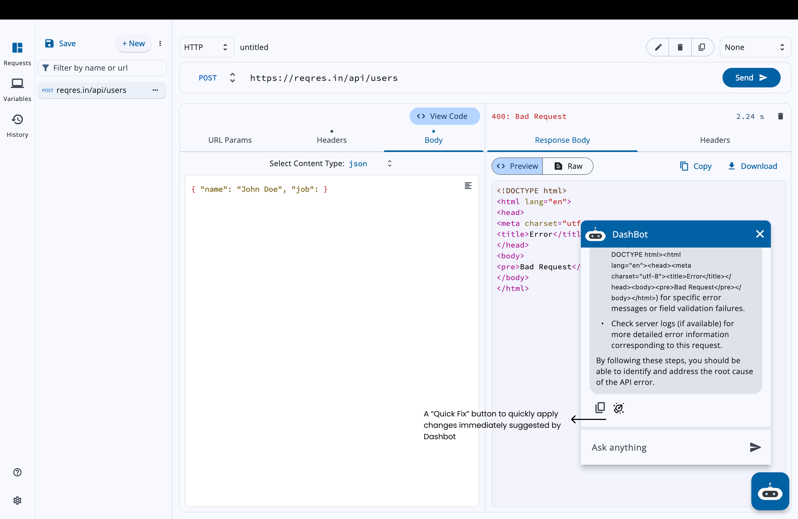
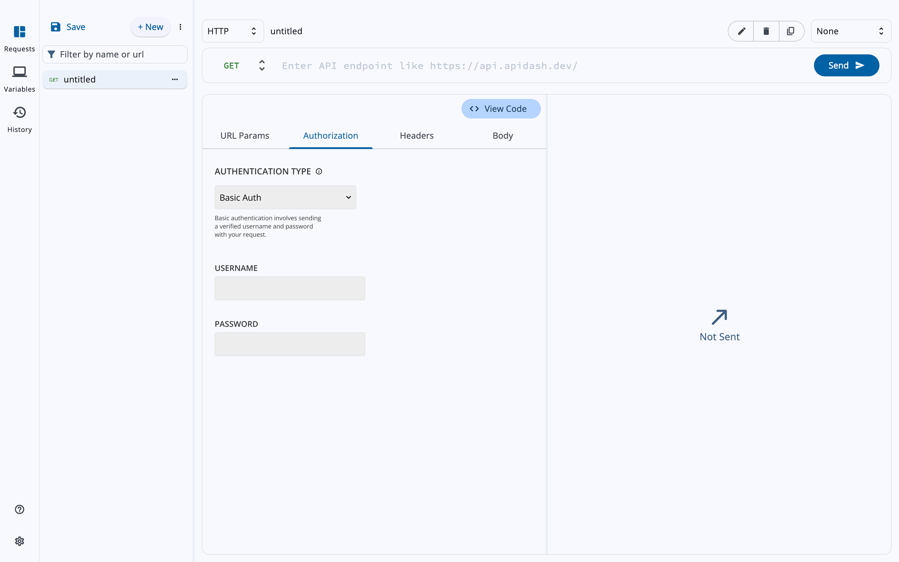
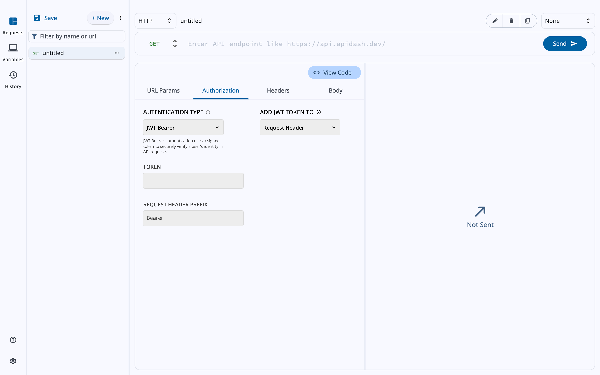

### **ABOUT**

* Name: Udhay Adithya J
* Email: [udhayxd@gmail.com](mailto:udhayxd@gmail.com)
* Discord: udhay_adithya
* Website: https://udhay-adithya.me
* Github: [Udhay-Adithya](https://github.com/Udhay-Adithya)
* LinkedIn: [udhay-adithya](https://www.linkedin.com/in/udhay-adithya/)
* Timezone:  India Standard Time (IST), UTC+5:30
* Location: Amravati, Andhra Pradesh, India.
* Resume : [Adithya Resume.pdf](https://github.com/Udhay-Adithya/Udhay-Adithya/releases/latest/download/Adithya.Resume.pdf)

### **UNIVERSITY INFO**

* University: [Vellore Institute of Technology](https://vitap.ac.in/), Andhra Pradesh
* Degree: Bachelor of Technology
* Major: Computer Science & Engineering
* Year: Sophomore, 2nd Year
* Expected Graduation: 2027

### Motivation & Past Experience

### 1. Have you worked on or contributed to a FOSS project before? Can you attach repo links or relevant PRs?

I haven't contributed to open-source projects before this, so API Dash marks my first practical experience with open-source contribution. So far, I have made a total of four PRs—three of which have been merged, while the other one got rejected. Here are the relevant PRs:

([#698](https://github.com/foss42/apidash/pull/698)): docs(codegen): add detailed instructions for ureq

([#695](https://github.com/foss42/apidash/pull/695)): docs(codegen): add detailed instructions for reqwest 

([#671](https://github.com/foss42/apidash/pull/671)): feat: add onboarding screen (#651)

([#674](https://github.com/foss42/apidash/pull/674)): fix: remove drawerEdgeDragWidth property


### 2. What is your one project/achievement that you are most proud of? Why?  

The project I am most proud of is **VIT-AP Companion**, a mobile application I built to help students at my university easily access their academic portal and other essential resources. This project holds special value to me because it was the first real-world application I developed, and I learned Flutter specifically to make this app.

When I noticed that students at my university struggled with the non-mobile-friendly, web-based academic portal, I decided to take the initiative and create a solution.

The app provided features like:
- Fast access to all features in the academic portal(Attendance, Timetable, Grades, Marks, Outing, Faculty Details and Exam Schedules) via a clean and simple mobile UI.
- Notifications and updates for upcoming classes and exams.
- Community page where students can engage with each other through posts.

It was particularly fulfilling because it solved a direct pain point for students and helped improve their day-to-day academic experience. Not only did this project boost my technical skills, but it also strengthened my problem-solving and user-centric development mindset. It became the stepping stone for my journey into building impactful, real-world applications.

**Github**: [vit_ap_student_app
](https://github.com/Udhay-Adithya/vit_ap_student_app/tree/testing)

### 3. What kind of problems or challenges motivate you the most to solve them?  
I am highly motivated by challenges that require practical, real-world problem-solving—especially when the solution can directly impact people. Tasks that demand attention to detail, optimization, or seamless user experience captivate me. I enjoy working on projects that not only push my technical limits but also have a tangible purpose and add value, rather than being purely theoretical.


### 4. Will you be working on GSoC full-time? In case not, what will you be studying or working on while working on the project?  
I will not be working full-time initially, as I will also be attending university classes during the early stages of the GSoC timeline. However, my university's flexible course scheduling system will help me dedicate a substantial amount of time each week to the project alongside my coursework.

Once my summer vacation begins(20-June-2025), I will be able to transition to working full-time on GSoC, fully committing to the project without any academic distractions.


### 6. Do you mind regularly syncing up with the project mentors?  
Not at all! I highly value feedback and mentorship. I am more than willing to have regular sync-ups with project mentors. I am available across multiple communication platforms such as email, Discord, Slack, and LinkedIn, and I am comfortable joining calls or screen shares whenever needed to ensure smooth collaboration and continuous improvement.


### 7. What interests you the most about API Dash?  
What excites me the most about API Dash is its aim to streamline the testing and visualization of APIs directly within the Dart ecosystem. As a Flutter and Dart enthusiast, contributing to a tool that helps developers improve their workflow and productivity resonates with me. I am particularly interested in how API Dash enhances the developer experience and promotes efficiency when working with APIs, which is crucial in modern app development.


### 8. Can you mention some areas where the project can be improved?  

DashBot's UI/UX can be significantly enhanced by implementing several modern features to improve user interaction and satisfaction. One key improvement is the introduction of a **Resizable and Draggable Chat Window**, allowing users to adjust the chat interface according to their preferences and screen space, creating a more personalized and efficient workspace.  

**Integrating Voice Input** can also change the way users interact with DashBot. By enabling voice commands, users can perform tasks hands-free, which is particularly beneficial in scenarios where typing is inconvenient or impossible. This feature not only adds convenience but also makes DashBot more accessible to users with disabilities, aligning with inclusive design principles and expanding its utility in diverse environments.  

Additionally, a **Security & Compliance Advisor** can enhance DashBot’s capabilities by providing:  
- **Vulnerability Scanning:** Automatically identifying security risks such as missing authentication, exposed sensitive data, and other vulnerabilities.  
- **Auto-Remediation:** Offering actionable suggestions to fix issues like CORS misconfigurations or insecure headers.

### **PROJECT TITLE : DashBot and API Authentication**

### **ABSTRACT:**

This proposal seeks to develop DashBot - the AI assistant for API Dash which supercharges developer productivity by helping developers automate tedious tasks, follow best practices, interact & obtain contextual suggestions, all via natural-language input. DashBot will be designed in a modular and extensible manner and provide the following list of features:

- Explain responses & identify any discrepancy
- Debug requests based on Status codes & Error messages
- Generate API documentation
- Understand API and generate tests
- Generate plots & visualizations for API responses along with ability to customize
- Generate API integration frontend code for frontend frameworks like React, Flutter, etc.

For each of the tasks you are benchmark evaluations will also be done so that it is easier for end users to choose the right backend LLM.

Upon successful completion of this project, we will have
a fully function DashBot integrated with API Dash [#621](https://github.com/foss42/apidash/issues/621) and a new tab “Authorization” in the Home Page of API Dash to handle different API Authentication Methods.


### **DETAILED DESCRIPTION**

DashBot will be developed as a modular feature using an iterative approach, leveraging the `MVVM (Model-View-ViewModel)` architecture pattern with `Riverpod` for state management. This architecture ensures clean separation of concerns, efficient data flow, and seamless UI updates, enabling scalable and maintainable code.

To support multiple LLM providers, DashBot will integrate with `Gemini`, `OpenAI`, `Anthropic`, and `Ollama`. This multi-provider support allows users to select their preferred LLM backend, whether cloud-based or local. An abstraction layer will be implemented to unify interactions with these providers, ensuring consistent API responses and reducing vendor lock-in.

For core features like debugging API requests, generating documentation, and creating tests, advanced prompting techniques such as `Few-shot prompting` and `ReAct (Reasoning and Acting)` will be employed. Few-shot prompting will provide the LLM with contextual examples to refine responses, while ReAct will enable step-by-step reasoning and tool invocation, ensuring accurate and actionable outputs.

API response visualizations will be built using the `fl_chart` library, which supports customizable line, bar, pie, scatter, and radar charts. This integration will allow users to interactively analyze API data and identify trends.

**Benchmark evaluations** for each LLM provider will be conducted. Here are the key metrics that will be considered for benchmarking different models,

- **Explain responses**
  - Discrepancy Detection Rate: Does the LLM correctly identify discrepancies?
  - Explainability Score: Are explanations understandable to developers?
  - Edge Case Handling: Can it handle ambiguous or incomplete responses?

- **Debug errors**
  - Error Classification Accuracy: Does the LLM correctly identify the error source?
  - Fix Implementation Rate: Are fixes actionable and contextually appropriate?
  - Ambiguity Handling Test: Can it categorize errors (e.g., syntax vs. logic)?

- **Generate Documentation**
  - Coverage Score: Does the documentation cover all endpoints, parameters, and responses?
  - Readability Assessment: Is the documentation clear and well-structured?
  - Standard Compliance Check: Does it adhere to standards?

- **Generate Tests**
  - Test Coverage Report: Percentage of API endpoints and edge cases covered
  - Test Execution Success Rate: Do tests pass/fail correctly when run?
  - Adaptability Test: Are tests structured for easy updates?

- **Generate Visualizations**
  - Data Fidelity Check: Does the plot correctly represent the data?
  - Aesthetic Scoring: Is the visualization clear and professional?
  - Customization Flexibility Test: Can users tweak parameters?

- **Generate Frontend Code**
  - Code Execution Test: Does the code compile and function as expected?
  - Best Practice Adherence: Does it follow best practices?
  - Maintainability Score: Is the code clean and maintainable?

### **Implementing other essential features:**

Adding Support for various API Authentication Methods such as,
- **Basic authentication:** Sending a verified username and password with API request
- **API Auth:** Basic authentication [#610](https://github.com/foss42/apidash/issues/610)
- **API key:** Sending a key-value pair to the API either in the request headers or query parameters Add API Auth: API key [#611](https://github.com/foss42/apidash/issues/611)
- **Bearer token:** Authenticate using an access key, such as a JSON Web Token (JWT) Add API Auth: Bearer token [#612](https://github.com/foss42/apidash/issues/612)
- **JWT Bearer:** Generate JWT bearer tokens to authorize requests Add API Auth: JWT Bearer [#613](https://github.com/foss42/apidash/issues/613)
- **Digest Auth:** Client must send two requests. First request sent to the server receives a nonce value, which is then used to produce a one-time-use hash key to authenticate the request Add API Auth: Digest Auth [#614](https://github.com/foss42/apidash/issues/614)
- **OAuth 1.0** Add API Auth: OAuth 1.0 [#615](https://github.com/foss42/apidash/issues/615)
- **OAuth 2.0:** Implement OAuth 2.0 authentication [#481](https://github.com/foss42/apidash/issues/481)

Required dependencies,

- [anthropic_sdk_dart](https://pub.dev/packages/anthropic_sdk_dart)
- [googleai_dart](https://pub.dev/packages/googleai_dart/versions)
- [openai_dart](https://pub.dev/packages/openai_dart)
- [ollama_dart](https://pub.dev/packages/ollama_dart)
- [flutter_riverpod](https://pub.dev/packages/flutter_riverpod)
- [fpdart](https://pub.dev/packages/fpdart)
- [fl_charts](https://pub.dev/packages/fl_chart)
- [riverpod_annotation](https://pub.dev/packages/riverpod_annotation)
- [riverpod_lint](https://pub.dev/packages/riverpod_lint)
- [riverpod_generator](https://pub.dev/packages/riverpod_generator)
- [custom_lint](https://pub.dev/packages/custom_lint)
- [oauth1](https://pub.dev/packages/oauth1)
- [oauth2](https://pub.dev/packages/oauth2)

## **FOLDER STRUCTURE**
```
lib/
│── features/
│   ├── feature_1/            
│   │   ├── repository/       # Data layer for feature_1
│   │   │   ├── feature_1_repository.dart
│   │   ├── viewmodel/        # Business logic for feature_1
│   │   │   ├── feature_1_viewmodel.dart
│   │   ├── view/             # UI layer for feature_1
│   │   │   ├── pages/      # Reusable widgets for this feature
│   │   │   │   ├── feature_1_screen.dart
│   │   │   ├── widgets/      # Reusable widgets for this feature
```

## **USAGE**

DashBot can be accessed from the home screen of API Dash using a floating action button at the bottom right corner.

<div 
    style="display: flex; justify-content: center; gap: 10px;">
    
    
</div>
<h5 style="text-align: center; font-weight: bold;">
    DashBot Pop-up Window
</h5>


<h5 style="text-align: center; font-weight: bold;">
    DashBot Home Screen View
</h5>


<h5 style="text-align: center; font-weight: bold;">
    DashBot Settings
</h5>


<h5 style="text-align: center; font-weight: bold;">
    Access Dashbot Through Context Menu
</h5>


<h5 style="text-align: center; font-weight: bold;">
    Debug Suggestion by DashBot
</h5>


<h5 style="text-align: center; font-weight: bold;">
    Quick Fix API Errors
</h5>


<h5 style="text-align: center; font-weight: bold;">
    Basic Authentication
</h5>


<h5 style="text-align: center; font-weight: bold;">
    JWT Bearer Authentication
</h5>

****


## **MILESTONES AND DELIVERABLES**

I propose to divide the project into four milestones/deliverables to produce a sequential progress report through the GSoC.
> They are NOT of equal sizes/time requirements.

#### **Milestone #1: Architecture Setup & Multi-LLM Integration.**

This milestone will lay the foundation of `DashBot`, building an interactive, draggable and responsive interface for DashBot.

Integrate support for multiple LLM providers with the option to switch between LLMs.

#### **Milestone #2: Core Feature Implementation**  
This milestone focuses on integrating the major features and is expected to be the most time-intensive phase of development.  

- Implement error debugging based on status codes and error messages.  
- Documentation generator supporting Markdown and HTML formats.  
- Build a test generator to create unit and integration tests from API specifications.
- Enhance LLM responses using Few-shot prompting and ReAct techniques.  
- API response visualizations (line, bar, pie, scatter, radar charts)
- Generating API integration frontend code for frontend frameworks.

#### **Milestone #3: Benchmarking & Optimization**

This milestone will involve running benchmark evaluations for all LLM providers by comparing the result of key metrics from each model mentioned in the [Detailed Description](#detailed-description) section.

#### **Milestone #4: API Authentication Methods** 

This milestone will add a new tab "Authorization" in the home page of API Dash where users can perform various API Authentication Methods such as,
- Basic authentication
- API Auth
- API key
- Bearer token
- JWT Bearer
- Digest Auth
- OAuth 1.0
- OAuth 2.0

## **[GSOC 2025 TIMELINE](https://developers.google.com/open-source/gsoc/timeline) FOR REFERENCE**


**May 8 - 18:00 UTC**
* Accepted GSoC contributor projects announced

**May 8 - June 1**
* Community Bonding Period | GSoC contributors get to know mentors, read documentation, and get up to speed to begin working on their projects

**June 2**
* Coding officially begins!

**July 14 - 18:00 UTC**
* Mentors and GSoC contributors can begin submitting midterm evaluations

**July 18 - 18:00 UTC**
* Midterm evaluation deadline (standard coding period)

**July 14 - August 25**
* Work Period | GSoC contributors work on their project with guidance from Mentors

**August 25 - September 1 - 18:00 UTC**
* Final week: GSoC contributors submit their final work product and
their final mentor evaluation (standard coding period)

## **PREDICTED PROJECT TIMELINE**
* **Community Bonding Period (May 8 - June 1)**

    This is the period where I will get to know my mentors better. I will also ask questions and attempt to clarify the doubts and queries in my mind, to get a clear understanding of the project. Although Google recommends this 3-week bonding period to be entirely for the introduction of GSoC Contributors into their projects, since we are going to build a brand new feature, I propose to begin coding from the 2nd or 3rd week of this period, thus adding a head start.

* **Coding Period (June 2 - July 14)**
    * **Week 1 (June 2 - June 8)**

      - Build an interactive, draggable and responsive interface for DashBot.
      - Add support for Local and Remote LLM providers along with integrated support for switching between local and remote LLM providers.

      **Deliverables:**
      A fully interactive, draggable, and responsive UI for DashBot, with support for switching between providers.


    * **Week 2 (June 9 - June 15)**
    
      - Implement API Response explanation generation.
      - Implement error debugging based on status codes and error messages.

      **Deliverables:**
      Dashbot capable of providing explanations for API Responses and debugging errors based on status code and error messages.

    * **Week 3 (June 16 - June 22)**
    
      - Develop a documentation generator supporting Markdown and HTML formats.
      - Develop a Test generator to create unit and integration tests from API specifications is done.
		
      **Deliverables:**
      Dashbot capable of generating documentation and tests from API Specifications.


    * **Week 4 (June 16 - June 22)**
    
      - Adding integration for API response visualization.
      - Adding integration for frontend code generation for frontend frameworks.

      **Deliverables:**
      Dashbot capable of visualizing api responses and code generation for frontend frameworks.

    * **Week 5 (June 23 - June 29)**

      - A significant portion of the week will be dedicated to testing all integrations thoroughly and addressing any bugs or issues identified.
      - Mentor Reviews are requested.

      **Deliverables:**
      Ensure that Dashbot is capable of performing all action mentioned in the previous weeks and ready for running benchmarks.


    * **Week 6 (June 30 - July 6)**

      - Changes follow, from Mentor Review, if required.
      - Running benchmark evaluation evaluating LLMs for API Response Explanation and API Error Debugging, Documentation generation, Test Generation, API Visualization and Frontend code generation for frontend frameworks.

      - Final Mentor Review before Mid-term Evaluation is submitted.

      **Deliverables:**
      Benchmarking results of various LLMs for Response Explanation and API Error Debugging, Documentation generation, Test Generation, API Visualization and Frontend code generation for frontend frameworks.

* **Midterm Evaluation Submission (July 14 - July 18)**
    * Projects are submitted to the mentors and the GSoC portal.

* **Work Period (July 14 - August 25)**
    * **Week 7 (July 14 - July 20)**
      
      - Extending support for Dashbot in Android/iOS devices.
      - Finishing up Dashbot.

      **Deliverables:**
      A fully functional Dashbot across all platforms.

    * **Week 8 (July 21 - July 27)**

      - Start developing basic API Authentication methods: Basic authentication, API Auth, API key.

      **Deliverables:**
      Defined API authentication parameters and initial implementation of basic authentication methods.

    * **Week 9 (July 28 - August 3)**

      - Implement API Authentication methods: Bearer token, JWT Bearer.
      - Develop a mechanism to allow switching authentication parameters between the request header and body.
      - Mentor Reviews are requested.

      **Deliverables:**
      Fully implemented Bearer Token and JWT Bearer authentication, along with a configurable authentication parameter placement (header/body).

    * **Week 10 (August 4 - August 10)**

      - Develop OAuth API Authentication methods: OAuth 1.0 and OAuth 2.0.

      **Deliverables:**
      A Fully working “Authorization” tab in the Home Page of API Dash with support for various API Authntication Methods.

    * **Week 11 (August 11 - August 17)**

      - Implement test cases for different authentication methods, including Basic Auth, API Key, Bearer Token, and JWT and OAuth.
		
	  **Deliverables:**
    Comprehensive test cases covering unit, integration, functional, and end-to-end authentication scenarios.

    * **Week 12 (August 18 - August 24)**

      Final checks are made, and any supporting documents (such as example usage markdown files, benchmarkings, ) are written.
      The project Report is written and all tracking issues are labelled appropriately.

* **Final Week (August 25 - September 1)**
    * The final project and the report are submitted to the mentors and on the GSoC portal.


## **ABOUT ME**

I’m Udhay Adithya, an undergraduate student with a deep passion for technology and software development. My programming journey began at the age of 15 when I started writing scripts for small Python-based games and developing basic applications. However, during my high school years in a hostel, I had no access to a PC or laptop, which temporarily paused my learning.

Upon entering university, I found the perfect opportunity to dive back into programming, expanding my knowledge across multiple domains. I developed Python-based chatbots and web scrapers to fetch academic details from my university’s portal. To enhance the student experience, I also built a mobile app that provides seamless access to our academic portal, making navigation and information retrieval much easier.

Beyond mobile and web development, I have explored the world of augmented reality, publishing interactive effects for Facebook, Instagram, and Messenger using Meta Spark AR Studio. These effects have collectively gained over a billion impressions, showcasing my ability to create engaging digital experiences.

I strongly believe in "learning by doing" and thrive on challenges that push my limits. I am deeply committed to working on projects that add value and make a meaningful impact. Perfection and attention to detail are fundamental to my work ethic—I strive to complete every project with dedication rather than just getting it done.

My efforts and innovations have led me to be a finalist in the prestigious 5G and 6G Hackathon conducted by the Ministry of Communications and Department of Telecommunications (DoT) India. Additionally, I have always been passionate about open-source contributions, recognizing them as a powerful way to gain and share knowledge. Though I previously struggled to find the right time and project, I now see open-source as an exciting and fulfilling avenue to give back to the community.

With a mindset driven by curiosity and persistence, I continue to explore, build, and contribute—always trying my best  to create solutions that matter.

 

## **WHY YOU SHOULD ACCEPT MY PROPOSAL**

Contributing to open-source has always been a goal of mine, as it provides a unique opportunity to learn, improve, and collaborate with like-minded developers. While I have gained significant knowledge through self-driven projects, I have always wanted to contribute meaningfully to an open-source initiative. This project aligns perfectly with my interests and skills, making it an ideal opportunity for me to grow as a developer while making a real impact.

If selected for this initiative, I am committed to dedicating my time and effort not just during GSoC but beyond it. My approach to projects has always been driven by a passion for perfection, attention to detail, and a strong desire to create solutions that add value. I believe in seeing things through to completion rather than just working on them superficially.

This project is not just a "summer internship" for me—it is a crucial step in my journey as a developer. It will allow me to contribute to something meaningful while refining my skills and learning from the community. My level of commitment and enthusiasm for this project will be reflected in my contributions, ensuring that I leave a lasting impact while continuously growing as an open-source developer.