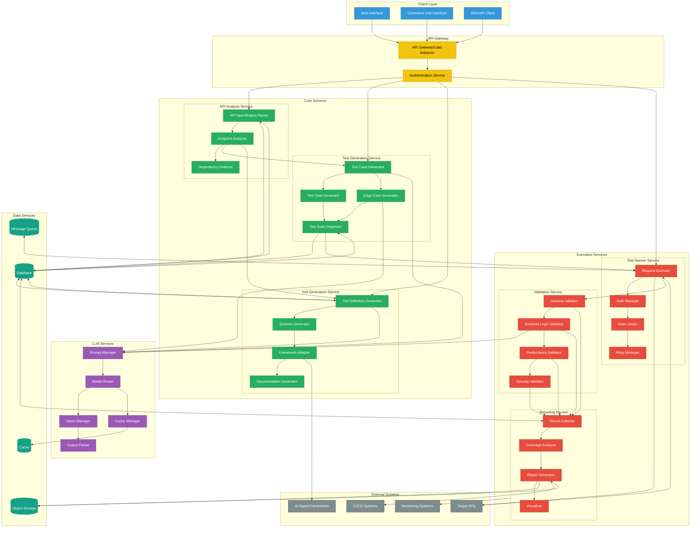
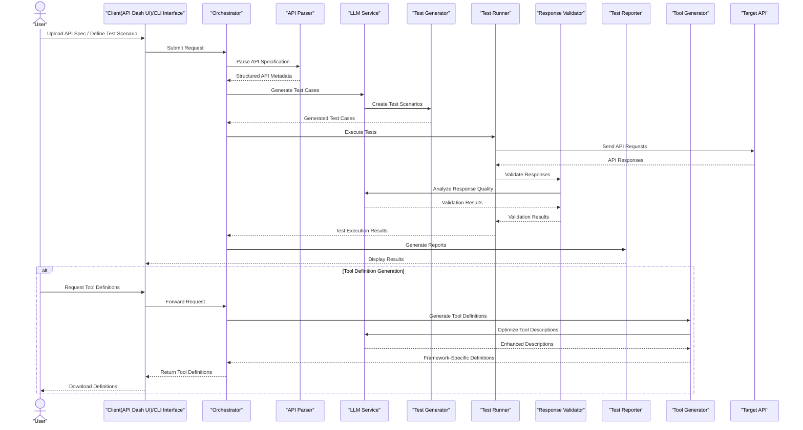

# AI Agent for API Testing and Automated Tool Integration  

## Personal Information  
- **Full Name:** Akshay Waghmare  
- **University Name:** Indian Institute of Information Technology, Allahabad (IIIT Allahabad)  
- **Program Enrolled In:** B.Tech in Electronics and Communication Engineering (ECE)  
- **Year:** Pre-final Year (Third Year)  
- **Expected Graduation Date:** May 2026

## About Me
I’m Akshay Waghmare, a pre-final year B.Tech student at IIIT Allahabad, majoring in Electronics and Communication Engineering. With a strong foundation in full-stack development and backend architecture, I have hands-on experience in technologies like **Next.js**, **Node.js**, **Spring Boot**, **Kafka**, **RabbitMQ**, and **Flutter**. I’ve interned at **Screenera.ai** and **Webneco Infotech**, working on building scalable, high-performance applications. My open-source contributions span organizations like **Wikimedia Foundation**, **C2SI**, and **OpenClimateFix**, and I’ve mentored aspiring developers at **OpenCode IIIT Allahabad**. I’ve also participated in several competitions, achieving **AIR 12** in the **Amazon ML Challenge**, **Goldman Sachs India Hackathon (National Finalist)**, and **Google GenAI Hackathon**. I’m passionate about AI, cloud technologies, and innovative software solutions, especially in automating tasks with AI agents and leveraging **Large Language Models (LLMs)** for smarter workflows.
## Project Details  
- **Project Title:** AI Agent for API Testing and Automated Tool Integration  
- **Description:**  
  This project leverages Large Language Models (LLMs) to automate API testing by generating intelligent test cases, validating responses, and converting APIs into structured tool definitions for seamless integration with AI agent frameworks like **crewAI, smolagents, pydantic-ai, and langgraph**.  

- **Key Features:**  
  - Automated API discovery and structured parsing from OpenAPI specs, Postman collections, and raw API calls.  
  - AI-powered test case generation, including edge cases and security testing.  
  - Automated API request execution and intelligent validation using machine learning.  
  - Seamless tool integration with AI frameworks for advanced automation.  
  - Benchmark dataset & evaluation framework for selecting the best LLM backend for end users.
 

# Proposed Idea : AI Agents for API Testing & Tool Definition Generator

I propose a approach leveraging Large Language Models to utilise both API testing and framework integration. My solution combines intelligent test generation with automated tool definition creation, all powered by contextually-aware AI.

The core of my approach is a unified pipeline that first parses and understands API specifications at a deep semantic level, then uses that understanding for two key purposes: generating comprehensive test suites and creating framework-specific tool definitions. This dual-purpose system will dramatically reduce the manual effort typically required for both tasks while improving quality and coverage.

For the API testing component, We will focus on areas where traditional testing tools fall short - particularly intelligent edge case detection and business logic validation. By leveraging LLMs' ability to reason about APIs contextually, the system will identify potential issues that rule-based generators miss. The test generation will cover functional testing with parameter variations, edge cases including boundary values and invalid inputs, security testing for authentication and injection vulnerabilities, and even performance testing scenarios.

For the framework integration component, We will then develop a flexible adapter system that generates properly typed tool definitions with appropriate validation rules for each target framework. This means developers can instantly convert their APIs into tool definitions for crewAI, langchain, pydantic-ai, langgraph, and other frameworks without manually rewriting specifications and validation logic.

To address the benchmarking requirement in the project description, After that we can create a standardized dataset of diverse API specifications and implement a comprehensive evaluation framework. This will measure multiple dimensions including accuracy of generated tests and tools, API coverage percentage, relevance to the API's purpose, edge case detection ability, and cost efficiency across different LLM providers. This will enable users to make informed decisions about which model best fits their specific needs.

## System Architecture

The system architecture consists of several key components working together to form a pipeline:

1. **API Specification Parser**: This component handles multiple API specification formats (OpenAPI, GraphQL, gRPC, etc.) and normalizes them into a unified internal representation. I'll build on existing parsing libraries but extend them with custom logic to extract semantic meaning and relationships between endpoints.

2. **LLM Integration Layer**: A provider-agnostic abstraction supporting multiple LLM services with intelligent routing, caching, and fallback mechanisms. Prompt templates will be version-controlled and systematically optimized through iterative testing to achieve the best results.

3. **Test Generation Engine**: This core component uses LLMs to analyze API specifications and generate comprehensive test suites. For large APIs that might exceed context limits, I'll implement a chunking approach that processes endpoints in logical batches while maintaining awareness of their relationships.

4. **Test Execution Runtime**: Once tests are generated, this component executes them against target APIs, handling authentication, implementing appropriate retry logic, respecting rate limits, and collecting comprehensive response data for validation.

5. **Response Validation Service**: This combines traditional schema validation with LLM-powered semantic validation to catch subtle issues in responses that might comply with the schema but violate business logic or contain inconsistent data.

6. **Tool Definition Generator**: This component converts API specifications into properly structured tool definitions for various AI frameworks, handling the specific requirements and patterns of each target framework.

7. **Benchmark Framework**: The evaluation system that assesses LLM performance on standardized tasks with detailed metrics for accuracy, coverage, relevance, and efficiency.

All components will be implemented in Python with comprehensive test coverage and documentation. The architecture will be modular, allowing for component reuse and independent scaling as needs evolve.

For frontend integration, I can either develop integration points with your existing Flutter-based application or implement a CLI interface. The backend will expose a clear API that can be consumed by either approach. I'd welcome discussion on which option would better align with your current infrastructure and team workflows - the CLI would offer simplicity for CI/CD integration, while Flutter integration would provide a more seamless experience for existing users.

## System Workflow and Interactions
To illustrate how the components of my proposed system interact, I've created a sequence diagram showing the key workflows:

This diagram demonstrates the four key workflows in the system:

1. API Specification Analysis - The system ingests and parses API specifications, then uses LLM to understand them semantically.
2. Test Generation - Using the parsed API and LLM intelligence, the system creates comprehensive test suites tailored to the API's functionality.
3. Test Execution - Tests are run against the actual API, with responses validated both technically and semantically using LLM-powered understanding.
4. Tool Definition Generation - The system leverages its understanding of the API to create framework-specific tool definitions that developers can immediately use.

The LLM service is central to the entire workflow, providing the intelligence needed for deep API understanding, smart test generation, semantic validation, and appropriate tool definition creation.

## Clarifying Questions

I have some questions for more understanding:

1. Which AI frameworks are highest priority for tool definition generation? Is there a specific order of importance for crewAI, langchain, pydantic-ai, and langgraph?

2. Do you have preferred LLM providers that should be prioritized for integration, or should the system be designed to work with any provider through a common interface?

3. Are there specific types of APIs that should be given special focus in the benchmark dataset (e.g., e-commerce, financial, IoT)?

4. How will the frontend be planned? Will it be a standalone interface, an extension of an existing dashboard, or fully integrated into an API testing - API Dash client ?

