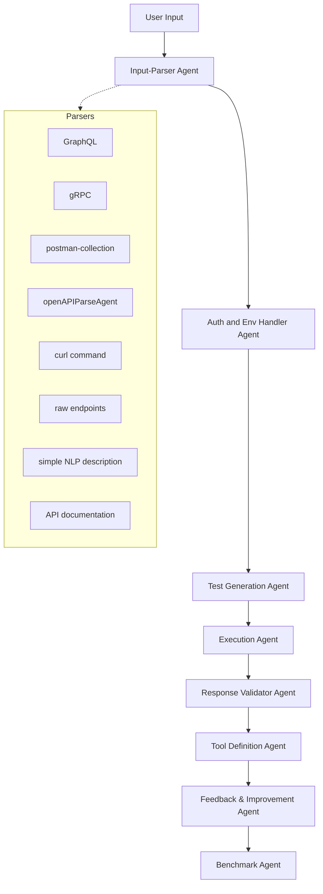
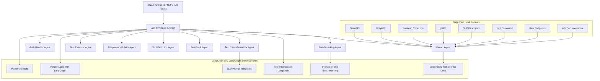
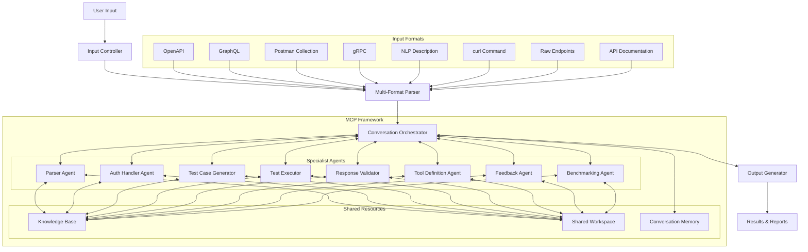

## ApiTestingAgent

### Initial Idea Submission

## Personal Information  
- **Full Name:** Himanshu Rana 
- **University Name:** Chandigarh University, Mohali, Punjab 
- **Program Enrolled In:** B.Tech in Computer science  
- **Graduation Date:** May 2024

## About Me:
I am a software developer focused on **AI automation**, **LLM-powered applications**, and backend development. My recent work centers on building intelligent agents that automate complex workflows, interact with APIs, and streamline CRUD operations using natural language. I’m also experienced in deploying **RAG-based systems** and integrating LLMs into production-ready tools. I'm an AI enthusiast, recently attended **BUILD WITH AI** event in Udaipur, Rajastan.

## Project Details  

### Project Title : API Tester and Tool Generator Agent

### **Description**  
*APITester and Tool Generator Agent* is a modular AI agent system that automates API testing and transforms APIs into structured tool definitions using Large Language Models (LLMs). It supports diverse input formats such as OpenAPI, GraphQL, Postman collections, gRPC, curl commands, raw endpoints, and natural language descriptions. By breaking down the pipeline into intelligent agents, the system streamlines test case generation, automated execution, validation, and tool generation for seamless integration with frameworks like crewAI, smolagents, langgraph, and pydantic-ai.

### **Key Features**

- **Multi-Format API Input Support:** Understands and parses OpenAPI, GraphQL, Postman, gRPC, NLP descriptions, and curl commands.  
- **LLM-Based Test Case Generator:** Automatically creates comprehensive test scenarios including edge cases and integration tests.  
- **Autonomous Test Execution & Validation:** Executes API calls, validates responses, and monitors correctness, performance, and schema adherence.  
- **Tool Definition Output:** Converts parsed APIs into usable tool schemas for integration with agent frameworks like crewAI and langgraph.  
- **Benchmarking Agent:** Evaluates LLM performance on test generation, validation accuracy, and tool-building quality to help users choose the best model.

# Idea description:
Initially I'm just providing a few underlying architectures, below architecture is basic like waterfall model, an end to end pipeline. it's not flexible for future enahncements.

## Agent Architecture 1:

1. **User Input**
   - Starting point for API testing requests in various formats

2. **Input-Parser Agent**
   - Processes user input into structured data
   - Supports multiple formats: GraphQL, gRPC, Postman, OpenAPI, cURL, raw endpoints, NLP descriptions

3. **Authentication Manager Agent**
   - Auto-detects auth from specs or prompts user
   - Supports API Keys, Bearer Tokens, OAuth 2.0, custom parameters
   - Injects credentials into requests

4. **TestCase Generator Agent**
   - Creates test scenarios from specs, NLP context, and edge cases
   - Generates structured test cases with inputs and expected outputs

5. **Test Executor Agent**
   - Runs tests via appropriate clients (httpx, grpcurl, GraphQL)
   - Measures response time, status codes, headers, schema compliance

6. **Validator Agent**
   - Verifies response schema, HTTP codes, required fields
   - Analyzes error handling patterns

7. **Tool Definition Generator Agent**
   - Creates Pydantic models and callable signatures
   - Produces code-ready API interfaces

8. **Feedback & Improvement Agent**
   - Recommends error handling, documentation, and security improvements
   - Identifies coverage gaps

9. **Benchmark Agent**
   - Evaluates across LLM backends (GPT-4, Claude 3, Gemini, Mistral)
   - Measures accuracy, intelligence, coverage, tool quality, latency, cost

## Architecture Diagram:

## Architecture 2: 

# Tool-Based Agentic Architecture: Workflow Summary

## 1. Input Layer

The Input Layer serves as the entry point of the system, accommodating various API specification formats:

- OpenAPI specifications
- GraphQL schemas
- Postman collections
- gRPC protocol buffers
- cURL commands
- Natural language descriptions
- Raw endpoint definitions

## 2. Main Agent: API Testing Agent

The API Testing Agent functions as the central coordinator within the architecture:

- Orchestrates workflow by routing tasks to appropriate specialized sub-agents
- Makes intelligent decisions based on input type and current system state
- Maintains overall testing context and objectives
- Coordinates information flow between sub-agents

## 3. Sub-Agents (Tools)

### Parser Agent
- Transforms diverse input formats into structured, testable components
- Normalizes different specification syntaxes into a unified internal representation
- Extracts endpoints, parameters, request/response formats, and schemas

### Auth Handler Agent
- Identifies authentication requirements from API specifications
- Prompts users for missing credentials when necessary
- Securely manages and injects authentication parameters
- Supports multiple auth methods (API Keys, JWT, OAuth 2.0, custom parameters)

### Test Case Generator Agent
- Creates comprehensive test scenarios using LLM-powered logic
- Considers edge cases, validation requirements, and business logic
- Generates structured test cases with inputs and expected outputs
- Prioritizes tests based on API complexity and criticality

### Test Executor Agent
- Runs generated test cases against live API endpoints
- Utilizes appropriate clients based on API type (httpx, grpcurl, GraphQL clients)
- Captures comprehensive metrics: response time, status codes, headers
- Handles retry logic and connection issues gracefully

### Response Validator Agent
- Verifies API responses against expected outcomes
- Validates schema compliance and data integrity
- Analyzes error handling patterns and response consistency
- Flags unexpected behaviors or deviations from specifications

### Tool Definition Agent
- Generates programmatic interfaces for tested APIs
- Creates reusable components for frameworks (crewAI, smolagent, etc.)
- Produces Pydantic models and callable signatures
- Ensures generated definitions match API behavior

### Feedback Agent
- Gathers and processes user input following test execution
- Identifies improvement opportunities for future test runs
- Adapts testing strategies based on historical performance
- Maintains a knowledge base of API-specific insights

### Benchmarking Agent
- Evaluates API performance across multiple dimensions
- Measures latency, correctness, reliability, and consistency
- Compares performance across different LLM backends
- Generates actionable insights for API optimization

## 4. LangChain / LangGraph Enhancements

### Memory Module
- Preserves context between agent interactions
- Maintains historical information across testing steps
- Enables coherent multi-step reasoning
- Supports stateful operations throughout the workflow

### Router Logic (LangGraph)
- Dynamically determines workflow paths based on previous results
- Implements conditional branching for complex testing scenarios
- Handles error cases and recovery paths
- Optimizes testing flow for efficiency

### LLM Prompt Templates
- Powers intelligent generation capabilities within agents
- Provides structured guidance for test case creation
- Ensures consistent interaction patterns
- Optimizes token usage and response quality

### Tool Interfaces
- Exposes agents as callable tools within the LangChain ecosystem
- Standardizes input/output patterns for interoperability
- Facilitates composition of complex testing workflows
- Enables reuse across different testing scenarios

### VectorStore Retriever
- Extracts relevant information from API documentation
- Enhances understanding of API semantics and use cases
- Supports context-aware test generation
- Improves accuracy of generated test cases

### Benchmarking & Evaluation Modules
- Provides automated analysis of API performance
- Generates comprehensive reports on correctness and reliability
- Identifies performance bottlenecks and optimization opportunities
- Supports data-driven API improvement decisions

##  Advantages Over Chained Pipeline Architecture

| Feature | Tool-Based Agentic Flow | Chained Pipeline |
|---------|-------------------------|------------------|
| **Dynamic Control** | LLM and Router decide next step contextually | Fixed step sequence |
| **Interactive Flow** | Can pause mid-way (e.g., for auth), resume on input | Needs complex workaround |
| **Modular Agents** | Each agent is plug-n-play, reusable | Hardcoded logic; tight coupling |
| **Skippable Steps** | Irrelevant tools can be skipped | All steps run, needed or not |
| **Human-in-the-Loop** | Naturally prompts for missing info (auth, clarification) | Not supported |
| **Flexible Branching** | LangGraph handles dynamic routing easily | Branching logic is cumbersome |
| **Better Memory** | Maintains state/context between agents | Manual context-passing needed |
| **Scalability** | New tools or agents can be added independently | Pipeline redesign needed |
| **Fine-Grained Testing** | Each tool can be unit tested separately | Testing requires end-to-end runs |
| **LLM-Driven Intelligence** | LLM chooses tools, generates test cases | LLM use is limited or step-bound |

# API Testing Agent with MCP Architecture

## Overview

- The API Testing Agent is a next-generation solution leveraging Multi-agent Conversational Processes (MCP) to automate API testing and tool generation. - This architecture dramatically enhances traditional approaches by enabling collaborative intelligence among specialized agents working in concert to test APIs and generate reusable tool definitions.

## Architecture Diagram

## Key Components

### MCP Framework
The Multi-agent Conversational Process framework serves as the intelligent core of the architecture, enabling direct communication and collaboration between specialized agents.

### Conversation Orchestrator
Manages conversations between agents, prioritizes discussions, and ensures efficient information flow while preventing circular dialogues.

### Specialist Agents
- **Parser Agent**: Transforms diverse input formats into structured data
- **Auth Handler Agent**: Manages authentication requirements and credentials
- **Test Case Generator**: Creates comprehensive test scenarios
- **Test Executor**: Runs tests against live API endpoints
- **Response Validator**: Verifies responses against expected outcomes
- **Tool Definition Agent**: Generates programmatic interfaces
- **Feedback Agent**: Gathers insights and improvement opportunities
- **Benchmarking Agent**: Evaluates API performance across dimensions

### Shared Resources
- **Knowledge Base**: Repository of API specifications and documentation
- **Shared Workspace**: Common area for artifacts, test cases, and results
- **Conversation Memory**: Persistent storage of agent interactions and insights

## Workflow

1. **Input Processing**
   - User submits API specification in any supported format
   - Input Controller routes to Multi-Format Parser
   - Parser normalizes input into standard internal representation

2. **Conversation Initialization**
   - Conversation Orchestrator analyzes parsed input
   - Relevant agents are activated based on the testing needs
   - Initial context is populated in Shared Workspace

3. **Collaborative Testing**
   - Agents engage in multi-turn conversations to plan testing approach
   - Parser and Auth Handler discuss authentication requirements
   - Test Generator proposes test scenarios based on API structure
   - Test Executor and Validator coordinate validation strategies

4. **Dynamic Execution**
   - Test cases are executed with real-time feedback
   - When issues arise, relevant agents automatically engage
   - Agents collectively troubleshoot errors and adapt testing strategy
   - Multiple testing cycles can run in parallel for different endpoints

5. **Tool Generation**
   - Tool Definition Agent monitors testing progress
   - Collaborates with Parser and Validator to understand API behavior
   - Generates framework-specific tool definitions based on observed patterns
   - Output formats support crewAI, smolagents, langgraph, and pydantic-ai

6. **Benchmarking & Optimization**
   - Benchmarking Agent evaluates LLM performance across testing dimensions
   - Provides recommendations for optimal model selection
   - Generates comparative analytics across different backends

7. **Result Synthesis**
   - Output Generator compiles findings from all agent conversations
   - Produces comprehensive reports on API behavior, test results, and tool definitions
   - Delivers actionable insights for API improvement

## Advantages Over Previous Approaches

| Feature | MCP Architecture | Traditional Pipeline | Tool-Based Architecture |
|---------|------------------|----------------------|-------------------------|
| **Collaboration** | Agents work together through direct dialogue | Sequential processing only | Limited to tool calls |
| **Error Handling** | Collaborative troubleshooting | Predefined fallbacks | Main agent must handle all errors |
| **Processing Model** | Parallel agent conversations | Linear execution | Star topology with bottlenecks |
| **Adaptability** | Dynamic workflow adjustment | Fixed process flow | Limited branching options |
| **Knowledge Sharing** | Immediate across all agents | Sequential passing | Through central coordinator only |
| **Human Integration** | Natural dialogue with any agent | Process interruption | Limited to main agent |
| **Iterative Testing** | Continuous refinement cycles | Single-pass execution | Requires multiple complete runs |
| **Self-Improvement** | Learns from conversations | Static approach | Limited learning capabilities |
| **Complex APIs** | Strong reasoning about interdependencies | Struggles with complex state | Limited by main agent capabilities |
| **Scalability** | New agents easily integrated | Requires pipeline redesign | Tool registration overhead |

## Real-World Application Example

When testing a complex e-commerce API with authentication, inventory management, and payment processing:

1. **Parser Agent** recognizes the API has three interdependent service areas
2. **Auth Handler** identifies OAuth2 requirements and requests credentials
3. **Test Generator** and **Parser** discuss dependency order: auth → inventory → payment
4. **Test Executor** runs auth tests while **Test Generator** prepares inventory tests
5. When inventory tests reveal unexpected behavior, **Validator** and **Test Generator** immediately refine test cases
6. **Tool Definition Agent** observes patterns and generates specialized e-commerce API tools
7. **Benchmarking Agent** determines Claude 3 Opus performs best for this specific API's complexity
8. All insights are captured in the Knowledge Base for future testing sessions

This collaborative approach enables handling complex, interdependent API ecosystems that would overwhelm traditional testing architectures.

## Implementation Path

1. **Foundation Layer**
   - Implement conversation protocol and shared workspace
   - Create Multi-Format Parser with support for all input formats

2. **Agent Development**
   - Build specialist agents with conversational capabilities
   - Develop reasoning models for each agent's domain

3. **Orchestration Logic**
   - Create conversation management and routing rules
   - Implement priority and resource allocation systems

4. **Integration & Testing**
   - Integrate with existing LLM backends
   - Develop benchmark suite for architecture evaluation

5. **User Interface**
   - Build interface for observing agent conversations
   - Create intervention points for human guidance

The MCP-based API Testing Agent represents a significant advancement in automated API testing technology, moving beyond simple sequential processes to enable truly collaborative, intelligent testing that adapts to API complexity and improves over time.

## SUMMARY:

## Architecture 1: Pipeline Architecture
* **Structure**: Linear waterfall model with fixed agent sequence
* **Flow**: Input-Parser → Auth Manager → TestCase Generator → Executor → Validator → Tool Generator → Feedback → Benchmark
* **Strengths**: Simple implementation, predictable flow
* **Weaknesses**: Rigid process, limited flexibility, difficult to modify
* **Best for**: Simple APIs with predictable testing requirements

## Architecture 2: Tool-Based Agentic Architecture
* **Structure**: Central coordinator with specialized tool-agents
* **Flow**: Central agent dynamically calls appropriate sub-agents based on context
* **Strengths**: Dynamic control, modular design, skippable steps, human-in-the-loop capability
* **Enhancements**: LangChain/LangGraph for memory, routing, and interfaces
* **Best for**: Moderately complex APIs requiring flexible testing approaches

## Architecture 3: MCP Architecture
* **Structure**: Collaborative agent network with direct inter-agent communication
* **Components**: Conversation Orchestrator, Specialist Agents, Shared Resources
* **Strengths**: Parallel processing, collaborative problem-solving, knowledge sharing, adaptive workflows
* **Unique features**: Agent-to-agent dialogue, shared workspace, continuous refinement cycles
* **Best for**: Complex, interdependent API ecosystems requiring sophisticated testing strategies

## Questions/Doubts
### Question: Are we going to write backend of this agent in python? 
### Question: If yes,  Are we going to use Langgraph/Langchain to implement this?
### Doubt: If we are going to use python I can start working and complete it by 8th may. pleae revert..

