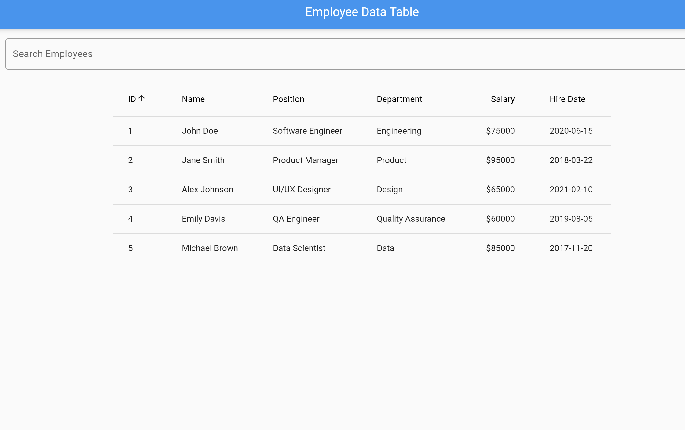
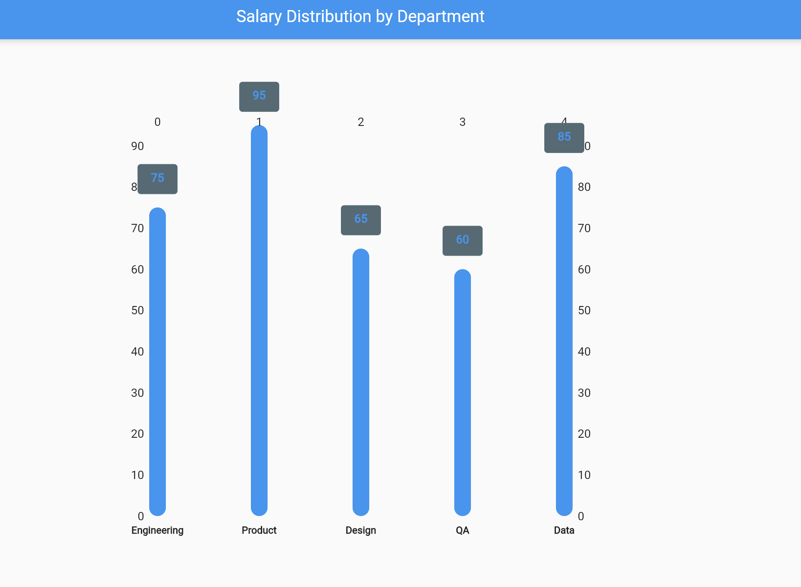

### Initial Idea Submission

Full Name: Mohammed Ayaan  
University name: PES University Bangalore  
Program you are enrolled in (Degree & Major/Minor): BTech (AI/ML)  
Year: 2nd year (2023-2027)  
Expected graduation date: 2027  

Project Title: AI UI Designer for APIs  
Relevant issues: #617

Idea description:

My assumption here is that the requirement is to provide an advanced preview for API responses
which are of type json/xml.

Proposed solution -

When the API responses are of type xml/json we can show additional advanced preview action buttons on the
response widget. eg : Data table, Chart, Summary

# 12-Mar-2025 - Proof of concept/ update

I executed a quick proof of concept using chatgpt and the results were amazing.

=> I was able to generate entire flutter widget with customizations. This essentially means that our static widget screens now
can be mere placeholders/containers which render the widgets given by the llm codegen service.

=> We need not restrict on the type of charts we can support. We can in fact take guidance from llm on what
kind of charts can be helpful in analyzing the data and pick may be the best 5 types

=> However we need to have control on the look and feel and apidash ui standards. These can be provided
as inputs to the prompt. eg: top/bottom margins should be 5%, bar graph color must be blue, or width of
bars must be 5 px etc.
Sample charts generated using json data.

We can design a fixed layout as per apidash ui standards (font, colors, themes) for each of the
visualization. This would comprise the static content by reusing the existing widgets. This will ensure
uniform look and feel for all users.  
for eg: datatable_page.dart, chart_page.dart, summary_page.dart

Dynamic data based on the json/xml input would come from the codellama service. for eg: visualizations_service.dart.
This service will interface with the codellama server by providing the json/xml as input and
return the generated html/dart widget code or may be just the collections which needs to be placed in
the placeholders in static screen widgets. This can be evaluated and decided as per the support provided
by the codellama service.

To ensure the kind of output(html/dart code or the transforming the json/xml data) we need,
we can provide the llm with few shot prompts as examples.

On click of Data table =>  
call visualization_service.dart to get the dynamic content from json/xml as required for data table.  
Render the widget. Widget to provide capabilities to sort and search  
On click of Chart =>  
We can ask for additional inputs like which type of chart, on what columns etc.  
call visualization_service.dart to get the dynamic content from json/xml as required for chart widget.  
Render the widget. Multiple chart types can be supported like bar graph, pie, bubble etc.  
On click of Summary =>  
We can provide some options like top 5 data points(eg: positive reviews/ratings), group by
or outliers, book summary, weather report etc  
call visualization_service.dart to get the dynamic content from json/xml as required for summary widget.

Additionally I can perhaps also contribute to the har importer project. I do have some exposure to har formats.  
I will analyze and update the idea shortly.
