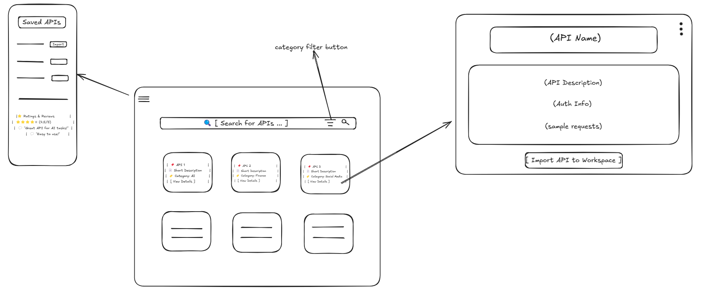

# API Explorer Wireframe  

## 📌 Overview  

This document presents the wireframe design for the **API Explorer** feature in API Dash. The API Explorer will allow users to:  

- **Discover public APIs** across various categories.  
- **View API details**, including authentication methods and sample requests.  
- **Import APIs into their workspace** for seamless testing.  

---

## 🎨 Wireframe Design  

The wireframe includes three main sections:  

### **1️⃣ Homepage (API Listing Page)**  

- **🔍 Search Bar**: Users can search for APIs.  
- **📂 Category Filters**: AI, Finance, Weather, etc., to filter APIs.  
- **📌 API Cards**: Displays API name, short description, category, and a "View Details" button.  
- **➡️ Navigation**: Clicking “View Details” opens the API Details Page.  

### **2️⃣ API Details Page**  

- **📌 API Name & Description**  
- **🔑 Authentication Info** (API key required or not).  
- **📂 API Endpoints & Sample Requests**  
- **📋 "Copy API Key" Button**  
- **📥 "Import API to Workspace" Button**  

### **3️⃣ Sidebar (Optional)**  

- **📂 Saved APIs List** (Previously imported APIs).  
- **⭐ Ratings & Reviews Section** (User feedback if implemented).  

---

## 🖼️ Wireframe Link  

🔗 **View the wireframe on Excalidraw**:  
[API Explorer Wireframe](https://excalidraw.com/#json=71K2EyrjsTEv1HXRMTRqB,iw86qFoQz9coZwkuAcXPUQ)  

*(Optional: If you exported an image, add it here)*  
  

---

## 🚀 Next Steps  

1. **Review the wireframe and suggest changes (if any).**  
2. Once approved, start coding the **frontend UI** (homepage, details page, sidebar).  

Looking forward to feedback! 🔥  
