### Initial Idea Submission

**Full Name**: Mohammed Affan Shaikhsurab  
**University name**: KLS GOGTE INSTITUTE OF TECHNOLOGY  
**Program you are enrolled in (Degree & Major/Minor)**: Computer Science of Engg                                    
**Year**: 4th (Final Year) 
**Expected graduation date**: Dec 2025 

---

**Project Title**: AI-Driven API Security Auditor for API Dash  
**Relevant issues**:  
- [#481: OAuth 2.0 Implementation](https://github.com/foss42/apidash/issues/481)  
- [#96: API Testing Suite](https://github.com/foss42/apidash/discussions/96)  
- [#100: Stress Testing APIs](https://github.com/foss42/apidash/issues/100)  
- [#609: API Authentication Methods](https://github.com/foss42/apidash/issues/609)  

---

### Idea Description  
**Objective**:  
Integrate an **AI-powered security auditing system** into API Dash to proactively detect vulnerabilities (e.g., SQLi, XSS, insecure auth) during API testing and provide actionable mitigation steps. This feature will empower developers to build secure APIs by combining automated scans with AI-driven insights, aligning with API Dash’s focus on testing and observability.

#### Approach & Implementation  
1. **AI Vulnerability Detection**:  
   - Train lightweight ML models (e.g., ONNX runtime for Flutter) to analyze request/response patterns for common vulnerabilities:  
     - **Injection Attacks**: Detect SQLi, NoSQLi, or command injection patterns in query parameters/body.  
     - **Broken Authentication**: Flag weak tokens, misconfigured OAuth 2.0 flows, or exposed credentials.  
     - **Sensitive Data Exposure**: Identify unencrypted PII/API keys in responses using regex/NLP.  
   - Integrate with existing auth methods (e.g., OAuth 2.0, JWT) to validate token security.  

2. **Real-Time Security Feedback**:  
   - Add a **Security Insights** panel in the response viewer, highlighting risks with severity levels (Critical/High/Medium).  
   - Suggest fixes (e.g., "Use parameterized queries to prevent SQLi") and link to OWASP guidelines.  

3. **Automated Penetration Testing**:  
   - Deploy an AI agent to simulate attacks (e.g., fuzzing, payload injection) during stress testing ([#100](https://github.com/foss42/apidash/issues/100)).  
   - Generate reports with CVSS scores and compliance status (GDPR, HIPAA).  

4. **Custom Rule Engine**:  
   - Allow users to define org-specific security policies (e.g., "All endpoints must use HTTPS").  
   - Use AI to auto-suggest rules based on API usage patterns.  

5. **Integration with Workflows**:  
   - Add security checks as a step in the **Workflow Builder** ([#120](https://github.com/foss42/apidash/issues/120)).  
   - Block unsafe requests in CI/CD pipelines via CLI integration.  

Certainly! Below is a **detailed, phase-wise breakdown** of how to implement the **AI-Driven API Security Auditor** for API Dash, including technical strategies, tools, and alignment with the project’s existing infrastructure:

---

```mermaid
sequenceDiagram
    participant User
    participant APIDashFrontend
    participant SecurityAuditor
    participant ML_Models
    participant ExternalAPIServer
    participant OWASP_ZAP

    User->>APIDashFrontend: Sends API Request (e.g., GET /users)
    APIDashFrontend->>SecurityAuditor: Forward Request for Security Check

    SecurityAuditor->>SecurityAuditor: Preprocess Request Data
    SecurityAuditor->>ML_Models: Detect SQLi/XSS in Params
    ML_Models-->>SecurityAuditor: Returns Vulnerability Score
    SecurityAuditor->>SecurityAuditor: Validate Auth Tokens (e.g., JWT/OAuth)
    SecurityAuditor->>ML_Models: Check for Sensitive Data Exposure
    ML_Models-->>SecurityAuditor: Returns Risk Level

    alt Vulnerability Detected
        SecurityAuditor->>APIDashFrontend: Alert with Severity (🔴 Critical)
        APIDashFrontend->>User: Display Security Insights Panel
        User->>APIDashFrontend: View Fix Suggestions (e.g., "Sanitize Input")
    else No Issues
        SecurityAuditor->>ExternalAPIServer: Forward Validated Request
        ExternalAPIServer-->>SecurityAuditor: Return API Response
        SecurityAuditor->>ML_Models: Analyze Response for Data Leaks
        ML_Models-->>SecurityAuditor: Flag Sensitive Data (e.g., PII)
        SecurityAuditor->>APIDashFrontend: Forward Response + Security Summary
        APIDashFrontend->>User: Show Response with Security Badges (🟢 Safe)
    end

    loop Automated Penetration Testing (Optional)
        SecurityAuditor->>SecurityAuditor: Generate Fuzzed Payloads
        SecurityAuditor->>ExternalAPIServer: Send Malicious Requests (e.g., SQLi)
        ExternalAPIServer-->>SecurityAuditor: Capture Response/Errors
        SecurityAuditor->>OWASP_ZAP: Validate Against Baseline
        OWASP_ZAP-->>SecurityAuditor: Return Compliance Report
        SecurityAuditor->>APIDashFrontend: Update Security Dashboard
    end
```

### **Phase 1: Data Collection & Model Training**
#### **Objective**: Build a dataset and train lightweight ML models for vulnerability detection.
1. **Dataset Creation**:
   - **Source Data**: 
     - Use public datasets like [OWASP Top 10 API Security Risks](https://owasp.org/API-Security/), [CVE](https://cve.mitre.org/), and synthetic API traffic (both secure and vulnerable).
     - Partner with tools like [Burp Suite](https://portswigger.net/burp) or [OWASP ZAP](https://www.zawasp.org/) to collect labeled attack patterns.
   - **Synthetic Data Generation**: 
     - Scripts to simulate attacks (e.g., SQLi payloads in query params, JWT tokens with weak signatures).
   - **Format**: Structured JSON logs of API requests/responses annotated with vulnerability types (e.g., `{"request": {"url": "...", "headers": {...}, "body": "admin' OR 1=1-
-"}, "label": "SQLi"}`).

2. **Model Selection**:
   - **Injection/XSS Detection**: 
     - Use **BiLSTM** or **Transformer-based models** (e.g., DistilBERT) to analyze request parameters/body for malicious patterns.
   - **Authentication Flaws**:
     - Train a **binary classifier** to detect weak tokens (e.g., short expiration, missing scopes) using JWT/OAuth metadata.
   - **Sensitive Data Exposure**:
     - **Regex + NLP**: Combine regex for patterns (e.g., `\b\d{3}-\d{2}-\d{4}\b` for SSNs) and NLP to flag context (e.g., "password" in responses).

3. **Optimization for Edge**:
   - Convert models to **ONNX/TFLite** for Flutter compatibility.
   - Use **quantization** to reduce model size (e.g., 8-bit integers for weights).

---

### **Phase 2: Integration with API Dash Core**
#### **Objective**: Embed security analysis into API Dash’s request/response lifecycle.
1. **Real-Time Analysis Engine**:
   - **Hook into Request Flow**:
     - Intercept requests before sending and responses after receiving using API Dash’s middleware system.
     - Example: Extend `RequestHandler` to call `SecurityAuditor.scan(request)`.
   - **Modular Design**:
     - Create a `security` module with plugins for different checks (e.g., `SqlInjectionScanner`, `TokenAnalyzer`).

2. **UI Integration**:
   - **Security Insights Panel**:
     - Add a tab next to "Response" showing vulnerabilities (e.g., "🛑 SQL Injection detected in 'username' parameter").
     - Use color-coded badges (🔴 Critical, 🟠 High) and collapsible sections for details.
   - **Actionable Suggestions**:
     - Link fixes to code snippets (e.g., "Use `parameterized queries`") and OWASP guidelines.

---

### **Phase 3: Automated Penetration Testing**
#### **Objective**: Simulate attacks and generate compliance reports.
1. **AI Attack Agent**:
   - **Fuzzing Engine**:
     - Generate malicious payloads (e.g., `` for XSS) using templates from [FuzzDB](https://github.com/fuzzdb-project/fuzzdb).
     - Integrate with **stress testing** (#100) to send concurrent malicious requests.
   - **Response Analysis**:
     - Check for anomalies (e.g., 500 errors on SQLi attempts, exposed stack traces).

2. **Compliance Reporting**:
   - **CVSS Scoring**:
     - Calculate severity using [CVSS v3.1](https://www.first.org/cvss/) formulas.
   - **GDPR/HIPAA Checks**:
     - Flag endpoints returning unencrypted PII (e.g., emails, health data) using regex/NLP.

---

### **Phase 4: Custom Rule Engine & Workflows**
#### **Objective**: Allow users to define and automate security policies.
1. **Custom Rules**:
   - **DSL for Policies**:
     - Use YAML/JSON for user-defined rules (e.g., `{ "rule": "force_https", "condition": "request.url.protocol == 'http'", "severity": "high" }`).
   - **AI-Powered Suggestions**:
     - Analyze historical requests to recommend rules (e.g., "All POST endpoints should have CSRF tokens").

2. **Workflow Integration**:
   - **Security Step in Workflow Builder**:
     - Add a "Run Security Audit" node in the drag-and-drop UI (#120).
   - **CI/CD Pipeline**:
     - CLI command `apidash audit --collection=mycollection` to run tests and export SARIF/JSON reports.

---

### **Phase 5: Performance & Privacy Optimization**
#### **Objective**: Ensure minimal latency and data privacy.
1. **Edge Inference**:
   - Run models **on-device** using TensorFlow Lite (no cloud dependency).
   - Cache frequent request patterns to reduce recomputation.

2. **Privacy**:
   - **Local Processing**: Never send raw API data to external servers.
   - **Anonymization**: Strip sensitive fields (e.g., `Authorization` headers) before analysis.

---

### **Phase 6: Testing & Validation**
1. **Unit Tests**:
   - Validate detectors (e.g., assert SQLi model flags `' OR 1=1--`).
2. **Integration Tests**:
   - Test end-to-end workflow (request → audit → report).
3. **User Testing**:
   - Collaborate with beta testers to refine false positives/UX.

---

### **Tools & Libraries**
- **ML**: TensorFlow Lite, Hugging Face Transformers.
- **Security**: OWASP ZAP (for baseline comparisons), `regex` package.
- **Flutter**: `flutter_onnx` for model inference, Riverpod for state management.

---

### **Alignment with API Dash Roadmap**
- **L1 Priorities**: 
  - Enhances **API Testing Suite** (#96) with security-specific checks.
  - Complements **OAuth 2.0** (#481) by validating token security.
- **L2 Priorities**: 
  - Lays groundwork for **Security Testing** in Idea 7.
  - Extends **Workflow Builder** (#120) with security automation.

---

*This is an initial basic template idea. I would love to improve the steps and methodology.*

#### Benefits to API Dash  
- **Differentiation**: First open-source API client with built-in AI security auditing.  
- **User Value**: Reduces risks of data breaches and compliance violations.  
- **Roadmap Synergy**: Strengthens testing features while leveraging AI/authentication modules.  

#### Challenges & Mitigation  
- **Performance Overheads**: Optimize models for edge inference (e.g., quantization).  
- **False Positives**: Use ensemble models and allow user feedback to improve accuracy.  

This idea fills a critical niche in API security and aligns with API Dash’s vision of a comprehensive, AI-enhanced testing toolkit. I’d love to refine this with maintainers! 🔒✨  
