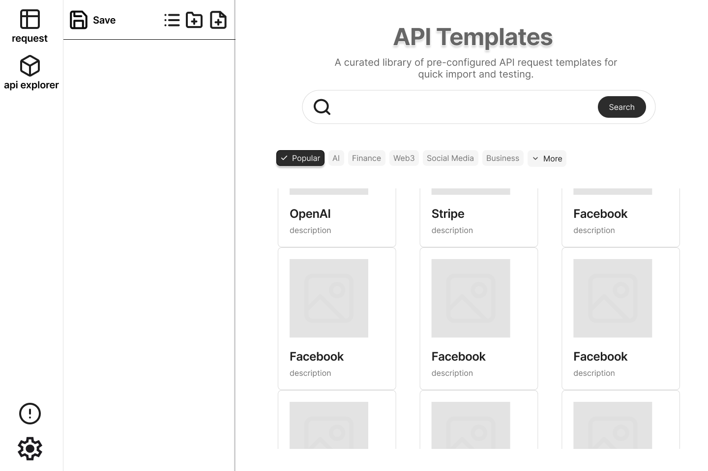
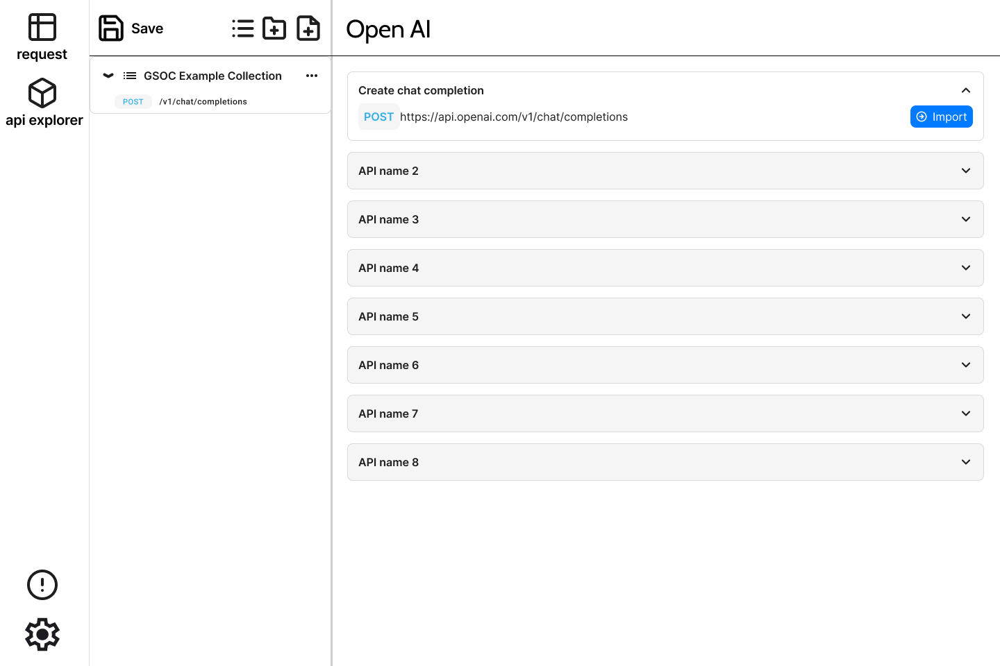

### Initial Idea Submission

**Full Name:** April Lin  
**University Name:** University of Illinois Urbana-Champaign  
**Program (Degree & Major/Minor):** Master in Electrical and Computer Engineering  
**Year:** first year
**Expected Graduation Date:** 2026  

**Project Title:** API Explorer  
**Relevant Issues:** [https://github.com/foss42/apidash/issues/619](https://github.com/foss42/apidash/issues/619)

**Idea Description:**

I have divided the design of the API explorer into three major steps:

1. **Designing the UI**  
2. **Designing the API template model**  
3. **Using AI tools to automatically extract API information from a given website**

---

## 1. UI Design (User Journey)

In this step, I primarily designed two interfaces for the API explorer: the first is the main API Explorer interface, and the second is a detailed interface for each API template.

### API Explorer

1. **Accessing the API Explorer**  
   - In the left-hand sidebar, users will find an “API Explorer” icon.  
   - Clicking this icon reveals the main API template search interface on the right side of the screen.

2. **Browsing API Templates**  
   - At the top of the main area, there is a search bar that supports fuzzy matching by API name.  
   - Directly beneath the search bar are category filters (e.g., AI, Finance, Web3, Social Media).  
   - Users can click “More” to view an expanded list of all available categories.  
   - The page displays each template in a **card layout**, showing the API’s name, a short description, and (optionally) an image or icon.

### API Templates

1. **Selecting a Template**  
   - When a user clicks on a card (for example, **OpenAI**), they navigate to a dedicated page for that API template.  
   - This page lists all the available API endpoints or methods in a collapsible/expandable format (e.g., “API name 2,” “API name 3,” etc.).  
   - Each listed endpoint describes what it does—users can select which methods they want to explore or import into their workspace.

2. **Exploring an API Method**  
   - Within this detailed view, users see request details such as **HTTP method**, **path**, **headers**, **body**, and **sample response**.  
   - If the user wants to try out an endpoint, they can import it into their API collections by clicking **import**.
   - Each method will include all the fields parsed through the automated process. For the detailed API field design, please refer to **Step Two**.

---

## 2. Updated Table Design

Below is the model design for the API explorer.

### **Base Table: `api_templates`**
- **Purpose:**  
  Stores the common properties for all API templates, regardless of their type.

- **Key Fields:**  
  - **id**:  
    - Primary key (integer or UUID) for unique identification.  
  - **name**:  
    - The API name (e.g., “OpenAI”).  
  - **api_type**:  
    - Enumerated string indicating the API type (e.g., `restful`, `graphql`, `soap`, `grpc`, `sse`, `websocket`).  
  - **base_url**:  
    - The base URL or service address (applicable for HTTP-based APIs and used as host:port for gRPC).  
  - **image**:  
    - A text or string field that references an image (URL or path) representing the API’s logo or icon.  
  - **category**:  
    - A field (array or string) used for search and classification (e.g., "finance", "ai", "devtool").  
  - **description**:  
    - Textual description of the API’s purpose and functionality.  

### **RESTful & GraphQL Methods Table: `api_methods`**
- **Purpose:**  
  Manages detailed configurations for individual API requests/methods, specifically tailored for RESTful and GraphQL APIs.

- **Key Fields:**  
  - **id**:  
    - Primary key (UUID).  
  - **template_id**:  
    - Foreign key linking back to `api_templates`.  
  - **method_type**:  
    - The HTTP method (e.g., `GET`, `POST`, `PUT`, `DELETE`) or the operation type (`query`, `mutation` for GraphQL).  
  - **method_name**:  
    - A human-readable name for the method (e.g., “Get User List,” “Create Order”).  
  - **url_path**:  
    - The relative path appended to the `base_url` (for RESTful APIs).  
  - **description**:  
    - Detailed explanation of the method’s functionality.  
  - **headers**:  
    - A JSON field storing default header configurations (e.g., `Content-Type`, `Authorization`).  
  - **authentication**:  
    - A JSON field for storing default authentication details (e.g., Bearer Token, Basic Auth).  
  - **query_params**:  
    - A JSON field for any default query parameters (optional, typically for RESTful requests).  
  - **body**:  
    - A JSON field containing the default request payload, including required fields and default values.  
  - **sample_response**:  
    - A JSON field providing an example of the expected response for testing/validation.  

---

## 3. Automated Extraction (Parser Design)

I think there are two ways to design the automated pipeline: the first is to use AI tools for automated parsing, and the second is to employ a rule-based approach.

### **AI-Based Parser**  
- For each parser type (OpenAPI, HTML, Markdown), design a dedicated prompt agent to parse the API methods.  
- The prompt includes model fields (matching the data structures from [Step Two](#2-updated-table-design)) and the required API category, along with the API URL to be parsed.  
- The AI model is instructed to output the parsed result in **JSON format**, aligned with the schema defined in `api_templates` and `api_methods`.

### **Non-AI (Rule-Based) Parser**  
- **OpenAPI**: Use existing libraries (e.g., Swagger/OpenAPI parser libraries) to read and interpret JSON or YAML specs.  
- **HTML**: Perform DOM-based parsing or use regex patterns to identify endpoints, parameter names, and descriptions.  
- **Markdown**: Utilize Markdown parsers (e.g., remark, markdown-it) to convert the text into a syntax tree and extract relevant sections.

## Questions

1. **Database Selection**  
   - Which type of database should be used for storing API templates and methods? Are there any specific constraints or preferences (e.g., relational vs. NoSQL, performance requirements, ease of integration) we should consider?

2. **Priority of Automated Parsing**  
   - What is the preferred approach for automated parsing of OpenAPI/HTML files? Would an AI-based parsing solution be acceptable, or should we prioritize rule-based methods for reliability and simplicity?

3. **UI Interaction Flow**  
   - Can I add a dedicated “api explorer” menu in the left navigation bar for api explorer?
