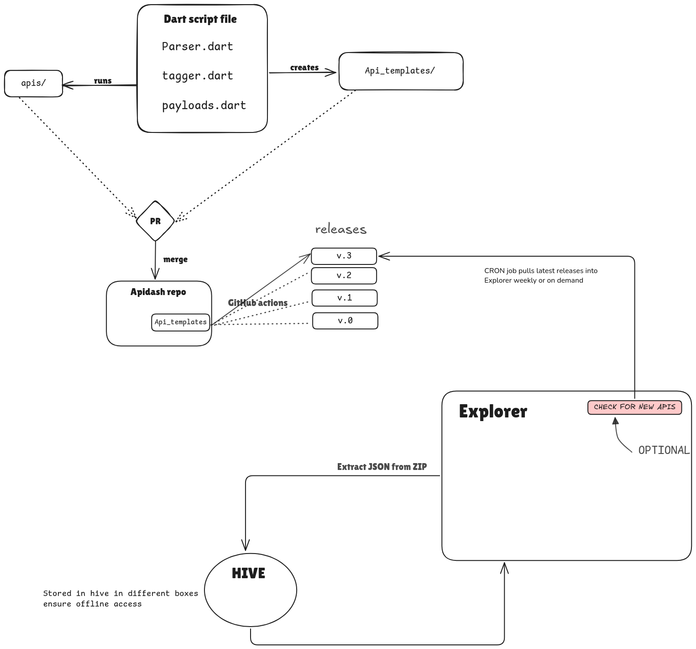

# **Initial Idea Submission : API Explorer**

**Full Name:** BALASUBRAMANIAM L  
**University Name:** Saveetha Engineering College  
**Program (Degree & Major/Minor):** Bachelor of technology Machine Learning  
**Year:** First year  
**Expected Graduation Date:** 2028

**Project Title:** API Explorer  
**Relevant Issues:** [https://github.com/foss42/apidash/issues/619](https://github.com/foss42/apidash/issues/619)

## **Project Overview**

Our goal is to enhance API Dash by adding an API Explorer feature. This feature allows users to discover, browse, search, and import pre-configured API endpoints for testing and exploration. All API templates will be maintained in YAML, JSON, HTML, and Markdown formats within a dedicated folder in the existing Apidash GitHub repository.

In the initial phase, contributors can manually add new API definition files (YAML, JSON, HTML, and MD) to the repo, run a local Dart script to process them into structured JSON format, and then commit and push the updated files. A Dart cron job will periodically check for new or modified API files and process them automatically. In the future, we plan to automate this process fully with GitHub Actions.

---

### **Key Concepts**

- **File Addition:**  
  Contributors add new API files (YAML, JSON, HTML, or MD) to a designated folder (`/apis/`) in the Apidash repository.

- **Local Processing:**  
  A local Dart script (e.g., `process_apis.dart`) runs to:
  - Read the files.
  - Parse and extract essential API details (title, description, endpoints, etc.).
  - Auto-generate sample payloads when examples are missing.
  - Convert and save the processed data as JSON files in `/api_templates/`.

- **Automated Fetching & Processing with Dart Cron Job:**  
  - A Dart cron-like package will schedule the script to fetch and process **new and updated** API files **weekly or on demand**.
  - This reduces the need for constant manual execution and ensures templates stay up to date.

- **Version Control:**  
  Contributors create a PR with both the raw YAML files and the generated JSON files to GitHub.

- **Offline Caching with Hive:**  
  - The Flutter app (API Explorer) will fetch JSON templates and store them using **Hive**.
  - This ensures **fast loading and offline access**.

- **Fetching Updates via GitHub Releases (ZIP files):**  
  - Instead of fetching updates via the GitHub API (which has rate limits), we can leverage **GitHub Releases**.
  - A new release will be created weekly or when at least 10 updates are made.
  - The Flutter app will download and extract the latest ZIP release instead of making multiple API calls.

---

### **Step-by-Step Workflow**

1. **Adding API Files:**
   - A contributor creates or updates an API file (e.g., `weather.yaml`) in the `/apis/` folder.

2. **Running the Local Processing Script (Manually):**
   - A Dart script (`process_apis.dart`) is executed locally:
     `dart run process_apis.dart`
   - The script:
     - Reads YAML files from `/apis/`.
     - Identifies the file format (YAML, JSON, HTML, MD).
     - Parses the content accordingly.
     - Extracts essential API details (title, description, endpoints, etc.).
     - Generates structured JSON templates in `/api_templates/`.

3. **Review, Commit, and PR Submission:**
   - Contributors review the generated JSON files.
   - They commit both raw API definition files and generated JSON files.
   - Submit a **Pull Request (PR)** for review.

4. **Offline Storage with Hive (Flutter Frontend):**
   - The Flutter app fetches JSON templates and stores them in Hive.
   - This ensures users can access API templates even when offline.

5. **Fetching Updates via GitHub Releases:**
   - A new **GitHub Release** (ZIP) will be created weekly or when at least 10 updates are made.
   - The Flutter app will **download and extract** the latest ZIP instead of making multiple API calls.
   - This approach avoids GitHub API rate limits and ensures a smooth user experience.

---

## **Future Automation with GitHub Actions**

In the future, we can fully automate this process:

- A GitHub Action will trigger on updates to `/apis/`.
- It will run the Dart processing script automatically.
- The action will commit the updated JSON templates back to the repository.
- A GitHub Release will be generated periodically to bundle processed files for easier access.
- This ensures **continuous and consistent updates** without manual intervention.

---

## **Conclusion**

This Approach provides a simple and controlled method for processing API definitions. The use of a **Dart cron job** reduces manual effort by fetching and processing updates on a scheduled basis, while **Hive storage** ensures fast offline access in the Flutter app. Using **GitHub Releases (ZIP)** allows fetching updates efficiently without hitting rate limits. Once validated, we can transition to **GitHub Actions** for complete automation. This approach aligns well with our project goals and scalability needs.

**I look forward to your feedback and suggestions on this approach. Thank you!**
