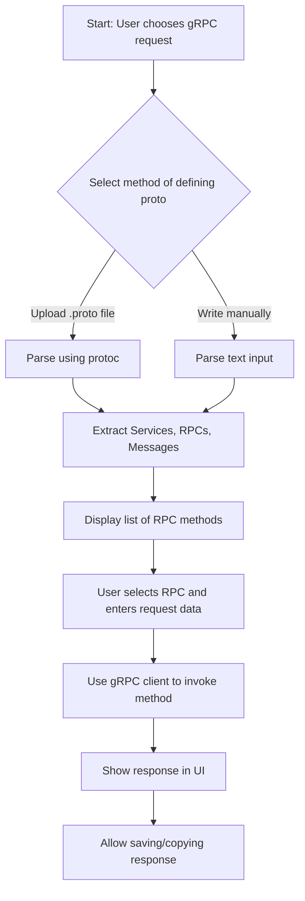

### Initial Idea Submission

**Full Name:**  NIKHIL

**University Name:**  KIET Group of Institutions

**Program (Degree & Major/Minor):**  Btech in AIML

**Year:**  2024

**Expected Graduation Date:**  2028

---

## Project Title: Adding gRPC Support to API Dash

---

### Relevant Issues:
 - [#14](https://github.com/foss42/apidash/issues/14)

---

##  Idea Description

 My idea is to add grpc support to apidash allowing developers to test gRPC APIs directly from the tool.

This feature will allow the user to either:
- Import a `.proto` file, or
- Write their own `.proto` definition within the tool.

The system will then:
- Parse the proto definition
- Show a list of services and methods
- Auto-generate UI for inputting message data
- Allow sending requests and receiving responses using a gRPC client

---

##  Key Features to Implement

- [x] Support for uploading `.proto` files  
- [x] In-app code editor to define `.proto` schemas  
- [x] Parser to read proto files and extract Services, RPCs, and Message types  
- [x] Dynamic input generation based on request message fields  
- [x] gRPC client integration using `grpc-dart`  

---

##  Flowchart: gRPC Support Workflow



---

##  Explanation of gRPC & Protocol buffer

gRPC is a high-performance RPC framework that uses Protobuf to serialize structured data. In a gRPC setup:

- `.proto` files define the structure of data and services provided by the server.
- Server implements the services defined in the `.proto`
- Client uses the same `.proto` to make typed function calls over the network

---
I have provided a simple proto file to show how the call will work 

##  Sample .proto File

```
syntax = "proto3";

package math;

service MathService {
  rpc Square (Number) returns (Number);
}

message Number {
  int32 value = 1;
}

```

---

## ⚙️ How the `.proto` File is Used

1. **Service:** Defines available RPC methods (like `SayHello`)
2. **Message:** Defines input/output structure (`HelloRequest`, `HelloReply`)
3. The client reads the `.proto`, knows how to create a valid request, and what the response will look like

---

##  Dart Client Snippet Using gRPC

```
import 'package:grpc/grpc.dart';
import 'src/generated/math.pbgrpc.dart';

void main() async {
  final channel = ClientChannel(
    'localhost',
    port: 50051,
    options: const ChannelOptions(credentials: ChannelCredentials.insecure()),
  );

  final stub = MathServiceClient(channel);

  try {
  //function called
    final response = await stub.square(Number()..value = 9);
  // response recieved
    print('Square: ${response.value}');
  } catch (e) {
// issue with response
    print('Caught error: $e');
  }

  await channel.shutdown();
}

```

 The usage may look like local function calls but the execution happens on server side actually

---

##  Dynamic UI Generation from Proto

When parsing a message like:

```proto
message UserProfile {
  string name = 1;
  int32 age = 2;
  repeated string hobbies = 3;
}
```

form will be generated like:

```
Name: [__________]
Age:  [____]
Hobbies:
- [__________]
- [__________]
[ + Add more ]
```

Or we can keep the ui like we have for headers or params.

---

## packages

| package            | Purpose                          |
|-----------------|-------------------------------------|
| `grpc-dart`     | Making gRPC calls in Dart           |
| `protoc_plugin` | Generating Dart files from `.proto` |
| `dart:convert`  | Handling JSON<->Proto conversions   |

---

## Idea of frontend (Textual)

```
+------------------------------------------------+
|            gRPC  - API Dash                |
+------------------------------------------------+
| [ Upload Proto ]  [ Write Proto ]              |
|                                                |
| [ Select Service: Greeter ]                    |
| [ Select Method: SayHello ]                    |
|                                                |
| Request:                                       |
|   {                                            |
|     "name": "Nikhil"                           |
|   }                                            |
|                                                |
| [ Send Request ]                               |
|                                                |
| Response:                                      |
|   {                                            |
|     "message": "Hello Nikhil"                  |
|   }                                            |
+------------------------------------------------+
```

---

##  Testing Plan

- Test with multiple `.proto` files and services
- Validate proto parser and UI rendering
- Verify end-to-end request → response flow
- Add unit tests for parsing, UI generation, and client connection

---


