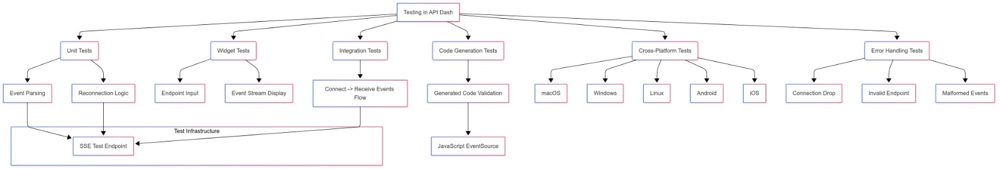

1. Full Name: MD. Rafsanul Islam Neloy
2. Email: rafsanneloy@gmail.com
3. Phone: +880 1325161428
4. Discord handle: rafsanneloy (756821234259460157)
5. GitHub: https://github.com/RafsanNeloy
6. LinkedIn: https://www.linkedin.com/in/md-rafsanul-neloy
7. Time zone: GMT +6 (Bangladesh)
8. Resume: https://drive.google.com/file/d/1_7YC1meQ0juyK80Bvp4A_9bmbfKqZcB7/view?usp=drive_link

### University Info

1. University name: Ahsanullah University Of Science & Technology
2. Program you are enrolled in (Degree & Major/Minor): B.Sc in CSE
3. Year: 4(Final Year)
5. Expected graduation date: 14/05/2026

### Motivation & Past Experience

### **Short Answers:**  

1. **Have you worked on or contributed to a FOSS project before?**  
   No, I haven't contributed to a FOSS project before, but I'm eager to start with this GSoC opportunity.  

2. **What is your one project/achievement that you are most proud of? Why?**  
   One of my proudest achievements is developing an **Angry Birds game using iGraphics**. This project pushed me to deeply understand physics-based simulations, collision detection, and game mechanics. It was particularly rewarding because I had to optimize performance while maintaining smooth gameplay, and it solidified my problem-solving skills in real-time rendering.  

3. **What kind of problems or challenges motivate you the most to solve them?**  
   I am most motivated by challenges that involve **performance optimization, real-time data processing, and system scalability**. Whether it's reducing execution time, handling large-scale data efficiently, or ensuring seamless communication in distributed systems, I find solving such problems both intellectually stimulating and rewarding.  

4. **Will you be working on GSoC full-time?**  
   Yes, I plan to dedicate my full time to GSoC. I want to immerse myself in the project, actively contribute to discussions, and ensure high-quality deliverables.  

5. **Do you mind regularly syncing up with the project mentors?**  
   Not at all! Regular sync-ups are essential for feedback and guidance. I believe structured discussions will help me align with project expectations, identify potential roadblocks early, and ensure smooth progress.  

6. **What interests you the most about API Dash?**  
   What excites me the most about API Dash is its **cross-platform support and extensibility**. The idea of having a unified API testing tool that supports multiple protocols across desktop and mobile platforms is fascinating. Additionally, the opportunity to work on **real-time protocols like WebSocket, SSE, MQTT, and gRPC** aligns perfectly with my interests in high-performance systems.  

7. **Can you mention some areas where the project can be improved?**  
   - **Real-time Collaboration:** Allow users to share and test APIs collaboratively in real time.  
   - **Performance Benchmarking:** Add API request performance insights, such as latency breakdowns and server response analytics.  
   - **Protocol-Specific Debugging Tools:** Enhance error reporting with detailed logs and debugging suggestions for WebSocket, SSE, MQTT, and gRPC failures.  
   - **Mobile UI Optimization:** Improve API Dash’s UX on mobile devices, ensuring a seamless experience on touch interfaces.  

These improvements can make API Dash an even more powerful tool for developers working on modern applications! 🚀
### Key Points
- It seems likely that adding support for WebSocket, SSE, MQTT, and gRPC in API Dash will enhance its capabilities for real-time and high-performance API testing.
- The project involves designing the core library architecture, understanding protocol specifications, and implementing testing, visualization, and code generation features.
- Research suggests that this will benefit developers working on modern applications, especially in web, IoT, and microservices, by providing a unified tool.

---

### Introduction to API Dash and Project Scope
API Dash is an open-source, cross-platform API client built with Flutter, supporting macOS, Windows, Linux, Android, and iOS. It currently allows developers to create, customize, and test HTTP and GraphQL API requests, with features like response visualization and code generation in multiple programming languages. This project aims to extend API Dash by adding support for testing, visualization, and integration code generation for WebSocket, Server-Sent Events (SSE), Message Queuing Telemetry Transport (MQTT), and gRPC protocols.

These protocols are crucial for real-time communication and efficient data exchange, used in applications ranging from web and mobile to Internet of Things (IoT) devices and microservices. By integrating these, API Dash will become a more versatile tool, catering to a broader range of developer needs.

### Project Details and Implementation
The project involves several key steps:
- **Research and Specification Analysis**: Understand the specifications of WebSocket, SSE, MQTT, and gRPC to ensure correct implementation of their communication patterns.
- **Architecture Design**: Design the core library to integrate these protocols, ensuring modularity and compatibility with existing features.
- **Implementation**: Develop protocol handlers using Dart libraries (e.g., `web_socket_channel` for WebSocket, `mqtt_client` for MQTT, `grpc` for gRPC), create user interfaces with Flutter, and extend visualization and code generation features.
- **Testing and Validation**: Write unit and integration tests, test with real-world scenarios, and gather community feedback.
- **Documentation**: Update API Dash documentation with guides and examples for the new protocols.

Each protocol will have specific features:
- **WebSocket**: Support connection establishment, sending/receiving text and binary messages, and real-time visualization.
- **SSE**: Enable connecting to endpoints, displaying incoming events with data and type, and handling automatic reconnection.
- **MQTT**: Allow connecting to brokers, subscribing/publishing to topics, and managing QoS levels and connection status.
- **gRPC**: Import .proto files, select services/methods, input parameters, and display responses, initially focusing on unary calls with potential for streaming.

### Expected Outcomes and Benefits
Upon completion, API Dash will offer full support for testing these protocols, intuitive user interfaces, advanced visualization tools, and code generation in languages like JavaScript, Python, and Java. This will benefit developers by providing a unified tool for diverse API interactions, enhancing productivity and application quality, especially for real-time and high-performance systems.

An unexpected detail is that the project will also involve ensuring cross-platform compatibility, which is crucial for mobile and desktop users, potentially expanding API Dash's user base.

---

### Survey Note: Detailed Analysis of API Testing Support Expansion in API Dash

This note provides a comprehensive analysis of the proposed project to extend API Dash, an open-source API client built with Flutter, by adding support for WebSocket, Server-Sent Events (SSE), Message Queuing Telemetry Transport (MQTT), and gRPC protocols. The project aims to enhance testing, visualization, and integration code generation capabilities, catering to modern application development needs.

#### Background and Context
API Dash, available at [GitHub Repository](https://github.com/foss42/apidash), is designed for cross-platform use, supporting macOS, Windows, Linux, Android, and iOS. It currently facilitates HTTP and GraphQL API testing, with features like response visualization and code generation in languages such as JavaScript, Python, and Java. The project idea, discussed at [API Dash Discussions](https://github.com/foss42/apidash/discussions/565/), addresses the need to support additional protocols essential for real-time communication and high-performance systems, as outlined in related issues: [#15](https://github.com/foss42/apidash/issues/15), [#115](https://github.com/foss42/apidash/issues/115), [#116](https://github.com/foss42/apidash/issues/116), and [#14](https://github.com/foss42/apidash/issues/14).

The protocols in focus—WebSocket, SSE, MQTT, and gRPC—serve diverse purposes:
- **WebSocket** enables full-duplex communication over a single TCP connection, ideal for real-time web applications like chat and live updates.
- **SSE** is a server-push technology for unidirectional updates from server to client, suitable for live data feeds.
- **MQTT**, a lightweight messaging protocol, is designed for IoT devices, supporting publish-subscribe messaging.
- **gRPC**, using HTTP/2 and Protocol Buffers, facilitates high-performance RPC calls with features like bi-directional streaming and load balancing.

This expansion aligns with the growing demand for tools supporting real-time and IoT applications, positioning API Dash as a comprehensive solution.

#### Project Objectives and Scope
The primary objectives include:
1. **Protocol Support Implementation**: Develop modules to handle WebSocket, SSE, MQTT, and gRPC, ensuring compliance with their specifications.
2. **User Interface Enhancements**: Design intuitive UIs for each protocol, maintaining consistency with API Dash's existing design, and supporting features like connection management and message handling.
3. **Visualization Tools**: Create components for displaying requests, responses, and events, with features like syntax highlighting and real-time updates.
4. **Code Generation**: Extend the existing code generation functionality to support these protocols in multiple programming languages, ensuring accuracy and efficiency.
5. **Documentation and Testing**: Provide comprehensive documentation and implement thorough testing to ensure reliability.

The project, with a difficulty rated as medium-high and requiring skills in understanding specs/protocols, UX design, Dart, and Flutter, is estimated at 350 hours, as per the project idea table:

| Feature | Details |
|---------|---------|
| API Types Supported | HTTP (✅), GraphQL (✅), SSE (#116), WebSocket (#15), MQTT (#115), gRPC (#14) |
| Import Collection From | Postman (✅), cURL (✅), Insomnia (✅), OpenAPI (#121), hurl (#123), HAR (#122) |
| Code Generation Languages/Libraries | cURL, HAR, C (libcurl), C# (HttpClient, RestSharp), Dart (http, dio), Go (net/http), JavaScript (axios, fetch, node.js axios, node.js fetch), Java (asynchttpclient, HttpClient, okhttp3, Unirest), Julia (HTTP), Kotlin (okhttp3), PHP (curl, guzzle, HTTPlug), Python (requests, http.client), Ruby (faraday, net/http), Rust (hyper, reqwest, ureq, Actix Client), Swift (URLSession) |
| MIME Types for Response Preview | PDF (application/pdf), Various Videos (video/mp4, video/webm, etc.), Images (image/apng, image/avif, etc.), Audio (audio/flac, audio/mpeg, etc.), CSV (text/csv), Syntax Highlighted (application/json, application/xml, etc.) |
| Download Links | iOS/iPad: [App Store](https://apps.apple.com/us/app/api-dash-api-client-testing/id6711353348), macOS: [Release](https://github.com/foss42/apidash/releases/latest/download/apidash-macos.dmg), Windows: [Release](https://github.com/foss42/apidash/releases/latest/download/apidash-windows-x86_64.exe), Linux (deb, rpm, PKGBUILD): [Installation Guide](https://github.com/foss42/apidash/blob/main/INSTALLATION.md) |

#### Methodology and Implementation Details
The implementation will proceed in phases:
1. **Research and Specification Analysis**: Analyze the specifications of each protocol to understand communication models. For instance, WebSocket uses a single TCP connection for full-duplex communication, while gRPC leverages HTTP/2 and Protocol Buffers for RPC calls.
2. **Architecture Design**: Design the core library to integrate new protocols, ensuring modularity. This involves creating interfaces for protocol handlers and ensuring compatibility with Flutter's cross-platform nature.
3. **Implementation**: Use established Dart packages for efficiency:
   - WebSocket: Leverage `web_socket_channel` for connection and message handling.
   - SSE: Utilize the `http` package for HTTP-based event streaming.
   - MQTT: Use `mqtt_client` for broker connections and publish-subscribe functionality.
   - gRPC: Employ the `grpc` package, handling .proto file parsing and method calls.
   Develop Flutter UIs for each protocol, ensuring responsiveness across platforms, including mobile devices.
4. **Testing and Validation**: Write unit tests for protocol handlers and integration tests for UI interactions. Test with sample APIs and real-world scenarios, such as connecting to public MQTT brokers or gRPC services.
5. **Documentation**: Update the documentation at [GitHub Repository](https://github.com/foss42/apidash) with guides, including examples for connecting to WebSocket endpoints or calling gRPC methods.

| **Type of Test**            | **Description**                                                                 | **Examples for Protocols**                                      |
|-----------------------------|-------------------------------------------------------------------------------|-----------------------------------------------------------------|
| **Unit Tests**              | Test individual components in isolation to verify functionality.              | - Verify WebSocket message encoding/decoding. - Test gRPC .proto file parsing. - Check MQTT QoS level handling. |
| **Widget Tests**            | Validate UI components to ensure user interactions work as expected.          | - Test WebSocket URL input field. - Verify SSE event display. - Check gRPC method selection UI. |
| **Integration Tests**       | Ensure all components work together for the complete feature flow.            | - Test connecting to a WebSocket server, sending a message, and receiving a response. - Verify MQTT subscribe/publish flow. - Validate gRPC unary call end-to-end. |
| **Code Generation Tests**   | Verify that generated code for each protocol in supported languages is correct and functional. | - Ensure WebSocket code in JavaScript uses standard APIs. - Validate Python MQTT code with `paho-mqtt` library. - Check gRPC code generation for Java. |
| **Cross-Platform Tests**    | Run tests on different platforms to ensure compatibility and consistent behavior. | - Test WebSocket on macOS, Windows, Linux, Android, and iOS. - Verify SSE on mobile devices. - Ensure gRPC works across desktop and mobile. |
| **Edge Case and Error Handling Tests** | Test scenarios like connection failures, invalid inputs, and large data sets to ensure stability. | - Test WebSocket connection failure. - Verify SSE handles invalid event streams. - Check gRPC with invalid .proto files. - Test MQTT with wrong broker credentials. |

Specific features for each protocol include:
- **WebSocket**: Connection establishment with URL and headers, sending/receiving messages, and real-time visualization with timestamps.
- **SSE**: Connecting to endpoints, displaying events with data and type, and handling reconnection with retry intervals.
- **MQTT**: Broker connection with authentication, topic subscription/publishing, and QoS level management, with visualization of message history.
- **gRPC**: Importing .proto files, selecting services/methods, inputting parameters, and displaying responses, initially focusing on unary calls with potential for streaming.

#### Expected Outcomes and Impact
The project will deliver:
- Full support for testing WebSocket, SSE, MQTT, and gRPC APIs, enhancing API Dash's versatility.
- Intuitive UIs for protocol interactions, ensuring a seamless user experience across platforms.
- Advanced visualization tools, such as syntax-highlighted message logs and real-time updates, improving data inspection.
- Code generation for integrating APIs in languages like JavaScript, Python, and Java, using standard libraries (e.g., WebSocket API for JavaScript, `requests` for Python MQTT).
- Comprehensive documentation, aiding developers in leveraging new features.

An unexpected detail is the focus on cross-platform compatibility, crucial for mobile users, potentially expanding API Dash's adoption in mobile development. This aligns with its current support for iOS and Android, as seen in download links like [App Store](https://apps.apple.com/us/app/api-dash-api-client-testing/id6711353348).

The benefits include empowering developers working on real-time applications, IoT projects, and microservices, by providing a unified tool. This will enhance productivity and application quality, contributing to the open-source community.

*Testing Diagram*

#### Potential Challenges and Considerations
Several challenges may arise:
- **Protocol Complexity**: Ensuring compliance with specifications, especially for gRPC with Protocol Buffers and streaming calls.
- **User Interface Design**: Balancing intuitive design with the diverse interaction models of each protocol, while maintaining consistency.
- **Performance**: Handling real-time data streams without impacting UI responsiveness, particularly on mobile devices.
- **Code Generation**: Generating accurate code for multiple languages, considering protocol-specific libraries and best practices.
- **Cross-Platform Compatibility**: Ensuring all features work seamlessly across macOS, Windows, Linux, Android, and iOS, addressing platform-specific issues.

Solutions include leveraging established Dart packages, following existing UI patterns, optimizing asynchronous programming, researching language-specific libraries, and extensive platform testing.

#### Conclusion
This project to integrate WebSocket, SSE, MQTT, and gRPC into API Dash will significantly enhance its capabilities, making it a comprehensive tool for API testing and development. It offers valuable experience in protocol implementation, UX design, and cross-platform development, benefiting the open-source community and developers worldwide.

---

### Key Citations

- [API Dash Discussions Project Ideas List](https://github.com/foss42/apidash/discussions/565/)
- [API Dash Issue WebSocket Support](https://github.com/foss42/apidash/issues/15)
- [API Dash Issue MQTT Support](https://github.com/foss42/apidash/issues/115)
- [API Dash Issue SSE Support](https://github.com/foss42/apidash/issues/116)
- [API Dash Issue gRPC Support](https://github.com/foss42/apidash/issues/14)
- [API Dash iOS App Download Page](https://apps.apple.com/us/app/api-dash-api-client-testing/id6711353348)
- [API Dash macOS Release Download Page](https://github.com/foss42/apidash/releases/latest/download/apidash-macos.dmg)
- [API Dash Windows Release Download Page](https://github.com/foss42/apidash/releases/latest/download/apidash-windows-x86_64.exe)
- [API Dash Linux Installation Guide Page](https://github.com/foss42/apidash/blob/main/INSTALLATION.md)

### **4. Weekly Timeline**  

| **Week** | **Tasks** |
|----------|----------|
| **Week 1** | Conduct research on WebSocket, SSE, MQTT, and gRPC specifications. Analyze existing API Dash architecture and finalize technical stack. |
| **Week 2** | Design the core library architecture for integrating new protocols. Outline UI requirements for protocol interactions. |
| **Week 3** | Implement WebSocket support: connection establishment, message sending/receiving, and real-time visualization. Write unit tests. |
| **Week 4** | Implement SSE support: event stream handling, automatic reconnection, and real-time event visualization. Conduct initial testing. |
| **Week 5** | Develop MQTT support: broker connection, topic subscription/publishing, QoS management. Implement visualization for messages. |
| **Week 6** | Implement gRPC support: import .proto files, select services/methods, send requests, and visualize responses. Focus on unary calls first. |
| **Week 7** | Extend code generation features for WebSocket, SSE, MQTT, and gRPC in JavaScript, Python, and Java. Validate generated code. |
| **Week 8** | Conduct integration testing for all protocols. Optimize performance and ensure cross-platform compatibility (macOS, Windows, Linux, Android, iOS). |
| **Week 9** | Improve UI/UX for seamless protocol interactions. Add customization options and refine error handling mechanisms. |
| **Week 10** | Perform extensive testing with real-world APIs. Fix bugs, optimize stability, and ensure smooth user experience. |
| **Week 11** | Finalize documentation, create user guides, and add example implementations. Conduct final performance testing. |
| **Week 12** | Prepare project demo, finalize submission, and gather community feedback for improvements. |

This timeline ensures systematic progress while allowing flexibility for testing and optimization. Let me know if you need any modifications! 🚀
