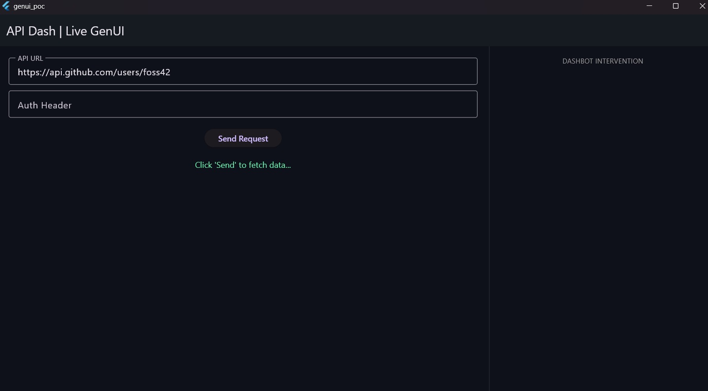
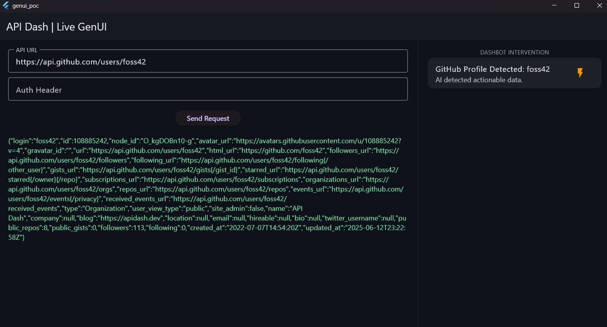
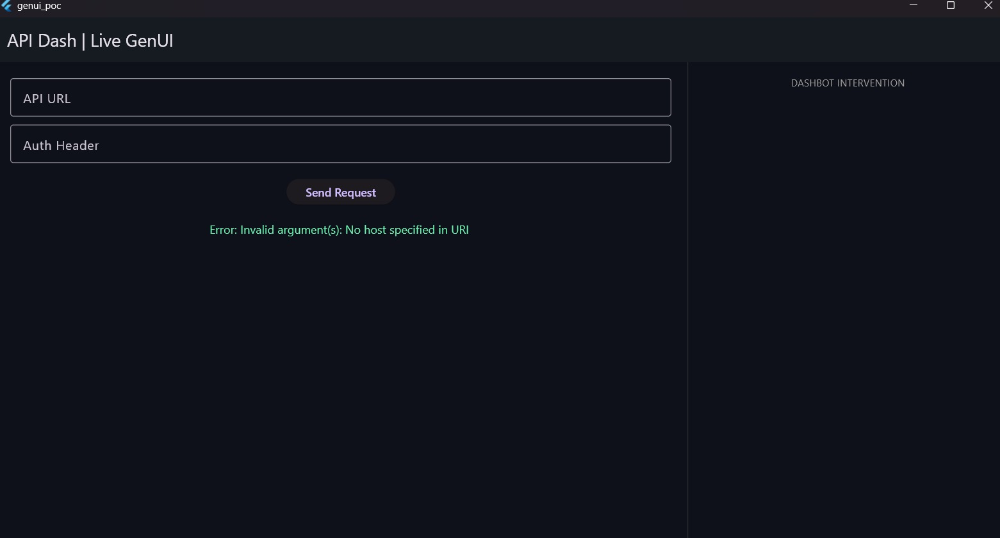

# Application: Banashankari - Intelligent API Orchestration & Generative UI (GenUI)

### About
1. **Full Name:** Banashankari Anegundi
2. **Contact info:** banashankarianegundi@gmail.com | 8660973348
3. **Discord handle:** banashankari
4. **GitHub profile link:**https://github.com/Banashankari21
5. **Socials:** [[Link to your LinkedIn]](https://www.linkedin.com/in/banashankari-anegundi-87629a26b/)
6. **Time zone:** IST (UTC +5:30)
7. **Link to a resume:** (https://drive.google.com/file/d/16Rm_KSbr_6K-u1DiplnDVgdLHvj5rLco/view?usp=sharing)

### University Info
1. **University name:** PES University
2. **Program you are enrolled in:**  B.Tech in Electronics and Communication Engineering / Major
3. **Year:** 4th Year
4. **Expected graduation date:** June 2026

### Motivation & Past Experience

**1. Have you worked on or contributed to a FOSS project before?**
Yes. I am an active contributor to open-source. For API Dash, I recently authored and successfully submitted **PR #1428** (Closes #1390), where I implemented a robust 5-attempt retry mechanism with exponential backoff and strict connection timeouts (using Dio) for `apidash_agent_calls.dart`. 

**2. What is your one project/achievement that you are most proud of? Why?**
I am most proud of building the end-to-end "Production ready medical chatbot with RAG and fine tuning and deploying on AWS and github actions" and "dynamic risk based authentication engine with handson on Docker and big data streaming, kafka and redis, as well as the standalone Flutter Proof of Concept (PoC) for this GenUI proposal. Building the GenUI PoC taught me how to intercept network responses and dynamically map them to actionable UI states using strict type-safe models (`ActionIntent`), bridging the gap between raw data and user experience.
GITHUB LINK for Dynamic risk based authentictaion engine -- https://github.com/Banashankari21/Dynamic_RiskBased_Authentication_Engine
GITHUB LINK for PRODUCTION GRADE Medical chatbot -- https://github.com/Banashankari21/MedBot

**3. What kind of problems or challenges motivate you the most to solve them?**
I am highly motivated by Developer Experience (DX) challenges. I enjoy building fault-tolerant systems (like network retry layers) and turning complex, passive data streams (like raw JSON error responses) into intuitive, interactive, and actionable interfaces. 

**4. Will you be working on GSoC full-time?**
Yes, I am fully committed to working 30-40 hours per week during the GSoC coding period.

**5. Do you mind regularly syncing up with the project mentors?**
Not at all. I actively welcome it. Regular communication is crucial for aligning architectural decisions, and I plan to provide weekly progress updates and attend the community syncs.

**6. What interests you the most about API Dash?**
API Dash is incredibly fast and native, but what interests me most is its potential to be an "Active Workspace." Instead of just being a tool that sends and receives data, API Dash has the architecture to actively assist the developer in debugging and visualizing that data through AI.

**7. Can you mention some areas where the project can be improved?**
Currently, when a developer encounters an API error (e.g., a 401 Unauthorized) or receives a complex JSON payload, the tool simply renders the raw text. The developer must manually parse the issue. API Dash can be improved by adding an intelligent orchestration layer that passively analyzes these responses and generates contextual UI widgets to help fix the issue or visualize the payload immediately.

### Project Proposal Information

**1. Proposal Title:** Integrating Generative UI (GenUI) and Intelligent API Error Orchestration for idea #5 Open Responses and Generative UI

**2. Abstract:** A project to transform API Dash into an "Active Workspace." By introducing an `AIOrchestratorService` to passively analyze HTTP responses, the app will dynamically generate UI components ("Dashbot Interventions"). This will help users immediately fix common errors (like 401 Auth issues with a "Repair Auth" card) or preview data payloads directly within the workspace, significantly reducing debugging friction.

**3. Detailed Description:**
Building upon the resilient network layer I implemented in PR #1428, this project introduces a middleware orchestrator and a GenUI rendering engine.
GITHUB LINK OF PR raised : https://github.com/foss42/apidash/pull/1428

* **A. The Intent Engine (`gen_ui_models.dart`):** I will introduce a strict, type-safe data structure to categorize API responses (e.g., `enum ActionIntent { repairAuth, livePreview, none }`).
* **B. The AI Orchestrator (`ai_orchestrator_service.dart`):** Exposed as a Riverpod `Provider`, this service will act as a passive middleware layer analyzing responses after the network call completes. It evaluates the `statusCode` and response `body` to output an `AIActionSchema` without blocking the main HTTP response stream.
* **C. State Management via Riverpod:** The workspace state will be expanded to include an `activeIntervention` state. The UI will actively listen to this `StateNotifier` and slide in the intervention panel seamlessly.
* **D. The GenUI Widget Factory:** An `InterventionWidgetFactory` will return specific Flutter widgets based on the intent:
    * `AuthRepairCard`: Automatically populates missing Bearer tokens or headers.
    * `DataPreviewCard`: Renders JSON sub-trees into readable UI elements (e.g., visualizing a GitHub profile).

*Note: I have already built and tested a functional standalone PoC of this exact logic using Flutter, which is demonstrated in the attached images.*
PoC GITHUB LINK : https://github.com/Banashankari21/genui_poc

## 3. Proof of Concept (PoC)
I have developed a functional prototype demonstrating how the "Dashbot" identifies actionable data from a raw JSON response.

### Initial State
The user sends a request to a known endpoint. The workspace remains clean and focused.

### Active Intervention
When the Orchestrator detects a GitHub profile pattern, it triggers a GenUI card in the intervention panel, offering immediate insights and potential actions.

### Error Handling
The system gracefully handles invalid states, ensuring that the Orchestrator only triggers when actionable patterns are identified.

**4. Weekly Timeline(90 Hours / Medium Project):**

* **Community Bonding (May):** Finalize Riverpod architecture specifications. Deep-dive into the Open Responses spec and A2UI whitepaper to ensure the data models are vendor-neutral. Refactor PoC logic to align with the apidash_core architectural style.

* **Phase 1 (Weeks 1-3):** Standardized Parsing. Implement the OpenResponseParser to handle structured AI outputs. Integrate this as an asynchronous middleware in the API Dash request execution flow. Write foundational Unit Tests for the parser.

* **Phase 2 (Weeks 4-6):** A2UI Foundation. Design the DashbotIntervention UI container following Google’s A2UI guidelines. Implement the ActionIntent.repair flow for AI-driven error correction (Auth/Headers).

* **Midterm Evaluation (Week 7):** Complete end-to-end integration where a standardized Open Response triggers a functional A2UI fix card.

* **Phase 3 (Weeks 8-10):** GenUI SDK & Portability. Implement ActionIntent.livePreview. Build rich visualization templates (JSON Trees, Markdown, Profile Cards) designed for exportability so users can use them in their own Flutter/Web apps.

* **Phase 4 (Weeks 11-13):** Testing & Portability Docs. Write comprehensive Widget Tests for all GenUI SDK components. Finalize "Export to Flutter" documentation, record a high-quality video walkthrough, and submit the final PR.

**5. Architecture & System Design **
* The proposed system follows a modular, middleware-driven architecture. Instead of a hard-coded response view, the system introduces an Intelligent Orchestration Layer that acts as a bridge between raw data and standardized Generative UI.

**Key Components:**

* Open Responses Parser: Standardizes varying LLM outputs (Gemini, OpenAI, etc.) into a vendor-neutral format.

* A2UI Intent Mapper: Analyzes the standardized response to determine the user's intent (e.g., "User needs to fix a header" or "User needs to visualize a profile").

* GenUI SDK Factory: Dynamically generates Flutter widgets that are both interactive within API Dash and portable for use in external apps.

**#Idea 5**
**1. Implement the Open Responses Middleware**
* The core of this idea is interoperability. Your first task is to build a parser that can take a response from any LLM provider (OpenAI, Gemini, Anthropic) and map it to a single, vendor-neutral format.

* Action: Create a ResponseParser that identifies "Tool Calls" or structured JSON within a response and converts it into a standardized OpenResponse object.

* Goal: Ensure that the UI components don't care which AI model generated the data.

**2. Orchestrate with A2UI Guidelines**
* Google’s A2UI (Agent-to-UI) provides the blueprint for how an AI should "intervene" in a user interface.

* Action: Build an AIOrchestratorService that "listens" to the incoming API response. If it detects an error (like a 401 Unauthorized) or a specific data pattern (like a list of users), it should trigger a GenUI Intent.

* Goal: Move from "showing a raw error" to "offering a fix button."

**3. Build Portable GenUI Widgets**
* The "Generative UI" part involves using the Flutter GenUI SDK to render these intents.

* Action: Develop a factory that returns dynamic widgets based on the intent. For example:

* AuthRepairCard: A widget that appears on a 401 error to let the user update their Bearer token instantly.

* DataPreviewCard: A widget that turns a massive JSON blob into a clean, readable profile card or data table.

* Goal: These widgets should be modular so that users can copy the code and use the same UI in their own Flutter apps.

**4. Key Skills to Demonstrate**
* To succeed in this contribution, you should highlight your proficiency in:

* State Management: Using Riverpod to handle the "Active" state of the workspace.

* Pattern Matching: Writing robust logic to parse complex JSON and identify "Intervention" points.

* Flutter Architecture: Ensuring your code follows the clean architecture already present in API Dash (as you did in PR #1428).
