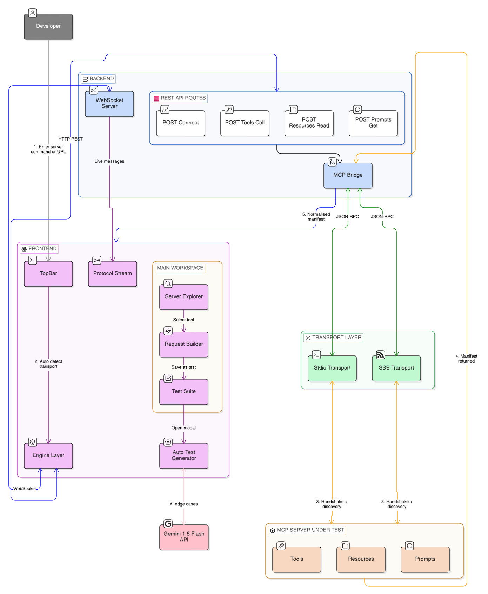

### Initial Idea Submission

Full Name: Aviral Sapra
University name: Indian Institute of Information Technology and Management (ABV-IIITM), Gwalior
Program you are enrolled in (Degree & Major/Minor): Integrated IT + M.Tech
Year: 3rd Year
Expected graduation date: June 2028

Project Title: MCP DevTools — A Full-Featured Testing Workbench for Model Context Protocol Servers and Clients
Relevant issues: <Add links to the relevant issues>

Idea description:

The Model Context Protocol (MCP) has grown from an Anthropic experiment to critical AI infrastructure in under a year — over 97 million monthly SDK downloads, 10,000 active servers, and first-class support across ChatGPT, Cursor, Gemini, Microsoft Copilot, and Visual Studio Code ([MCP Blog, 2025](http://blog.modelcontextprotocol.io/posts/2025-12-09-mcp-joins-agentic-ai-foundation/)). Yet despite this explosive growth, the developer tooling story is bleak. Testing options for MCP tools are severely limited — cryptic error messages, environment setup issues, and a developer experience that simply does not meet the bar the ecosystem needs ([Victor Dibia, 2025](https://newsletter.victordibia.com/p/no-mcps-have-not-won-yet)). The best existing tool, MCP Inspector, lacks features for team-based testing, historical tracking, or CI/CD integration — it is a development tool, not a complete testing platform ([Testomat.io, 2025](https://testomat.io/blog/mcp-server-testing-tools/)).

**MCP DevTools** closes this gap — [View Demo / Video Walkthrough](https://drive.google.com/file/d/1QQSDyTnR_Xdv_sZ7IEkMbjmRbY4b9y58/view?usp=sharing). It is a full-featured GUI testing workbench built specifically for the MCP ecosystem — what API Dash is for REST, built from the ground up for MCP. It connects to any server via stdio or SSE, auto-discovers all tools and resources, and generates 50+ tests across 5 categories (happy path, negative, boundary, resource, and AI-powered edge cases) in a single click. A Gemini integration reads each tool's schema and generates creative domain-specific tests no developer would write manually. Every JSON-RPC message streams live in a real-time protocol inspector. The result: point it at any MCP server and within 60 seconds you have a complete, runnable test suite — with zero manual test writing required.

### Problem Statement

The MCP ecosystem currently has:

- 10,000+ MCP servers on npm/GitHub with no dedicated testing/debugging tool
- No way to validate server compliance against the official spec
- No automated test generation
- No protocol-level inspection of raw JSON-RPC messages

Developers building MCP servers are forced to manually test by connecting to Claude Desktop and typing prompts, guess whether their server handles edge cases correctly, and debug blindly without seeing the raw protocol messages.

### Proposed Solution & Architecture

**MCP DevTools** is a React + Express application that acts as a bridge between the developer and any MCP server.

How it works:

1. Developer enters a command (`npx @mcp/server-filesystem /tmp`) or URL (`/sse`)
2. Frontend auto-detects transport — starts with `http` → SSE, everything else → stdio
3. Backend spawns the process or opens the stream via the MCP SDK
4. MCP handshake — initialize, capabilities exchange, tool/resource/prompt discovery
5. Manifest returned — all tools appear in the explorer, server auto-saved to localStorage
6. Developer explores tools, runs them, saves results as tests
7. Auto-test modal generates 50+ tests across 5 categories in one click
8. Gemini AI reads each tool's schema and generates creative domain-specific edge cases
9. Protocol stream shows every raw JSON-RPC message in real time via WebSocket

### Key Research Insights

1. **The ecosystem has no dedicated testing infrastructure** — the MCP ecosystem has over 10,000 active servers yet not a single purpose-built testing workbench exists
2. **Developer experience is critically poor** — testing options are "severely limited" with cryptic error messages and environment issues ([Victor Dibia, 2025](https://newsletter.victordibia.com/p/no-mcps-have-not-won-yet))
3. **Existing tools are incomplete** — MCP Inspector "lacks features for team-based testing, historical tracking, or CI/CD integration" ([Testomat.io, 2025](https://testomat.io/blog/mcp-server-testing-tools/))
4. **Protocol-level bugs are invisible** — without raw JSON-RPC visibility, developers cannot diagnose serialization, timing, or transport issues
5. **AI models generate better edge cases** — LLMs understand tool schemas semantically and infer creative edge cases that humans miss

### Key Differentiators

| Feature | MCP Inspector | Claude Desktop | **MCP DevTools** |
|---------|:---:|:---:|:---:|
| Visual GUI | No (CLI only) | Yes, but not for testing | Yes — purpose-built |
| Protocol Visibility | Partial | None | Full real-time stream |
| Auto-Test Generation | No | No | Yes — 5 categories, 50+ tests |
| AI-Powered Testing | No | No | Yes — Gemini integration |
| Assertion Engine | No | No | Yes — Status + Latency + Content |
| Destructive Op Guard | No | No | Yes — auto-detected & skipped |
| Saved Servers | No | Basic | Yes — auto-save + color coded |
| Boundary Testing | No | No | Yes — injection, Unicode, overflow |
| Resource Testing | No | No | Yes — dedicated category |

### Future Roadmap

| Phase | Features |
|-------|---------|
| **Phase 1 — Built** | Connect via stdio & SSE · Tool/Resource/Prompt explorer · Request builder · Protocol stream · Saved servers · Auto-test generation (5 categories) · Gemini AI edge cases |
| **Phase 2 — Next** | Test suite export/import · Visual pass/fail dashboards · Latency distribution (p50/p95/p99) · MCP spec compliance score card · CLI for CI/CD |
| **Phase 3 — Vision** | GitHub Actions integration · Multi-server manifest diff · Automated security scanner · Community plugin system |
