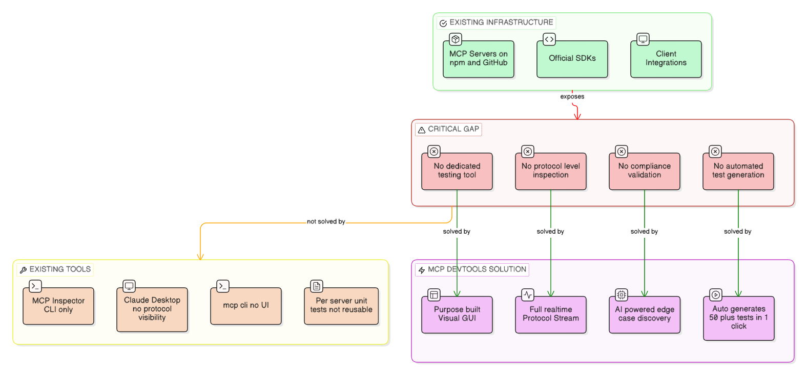

### Initial Idea Submission

Full Name: Aviral Sapra
University name: Indian Institute of Information Technology and Management (ABV-IIITM), Gwalior
Program you are enrolled in (Degree & Major/Minor): Integrated IT + M.Tech
Year: 3rd Year
Expected graduation date: June 2028

Project Title: MCP DevTools — A Full-Featured Testing Workbench for Model Context Protocol Servers and Clients

Idea description:

The Model Context Protocol (MCP) has grown from an Anthropic experiment to critical AI infrastructure in under a year — over 97 million monthly SDK downloads, 10,000 active servers, and first-class support across ChatGPT, Cursor, Gemini, Microsoft Copilot, and Visual Studio Code ([MCP Blog, 2025](http://blog.modelcontextprotocol.io/posts/2025-12-09-mcp-joins-agentic-ai-foundation/)). Yet despite this explosive growth, the developer tooling story is bleak. Testing options for MCP tools are severely limited — cryptic error messages, environment setup issues, and a developer experience that simply does not meet the bar the ecosystem needs ([Victor Dibia, 2025](https://newsletter.victordibia.com/p/no-mcps-have-not-won-yet)). The best existing tool, MCP Inspector, lacks features for team-based testing, historical tracking, or CI/CD integration — it is a development tool, not a complete testing platform ([Testomat.io, 2025](https://testomat.io/blog/mcp-server-testing-tools/)).

**MCP DevTools** closes this gap — [View Demo / Video Walkthrough](https://drive.google.com/file/d/1QQSDyTnR_Xdv_sZ7IEkMbjmRbY4b9y58/view?usp=sharing). It is a full-featured GUI testing workbench built specifically for the MCP ecosystem — what API Dash is for REST, built from the ground up for MCP. It connects to any server via stdio or SSE, auto-discovers all tools and resources, and generates 50+ tests across 5 categories (happy path, negative, boundary, resource, and AI-powered edge cases) in a single click. A Gemini integration reads each tool's schema and generates creative domain-specific tests no developer would write manually. Every JSON-RPC message streams live in a real-time protocol inspector. The result: point it at any MCP server and within 60 seconds you have a complete, runnable test suite — with zero manual test writing required.

### Problem Statement

The MCP ecosystem currently has:

- 10,000+ MCP servers on npm/GitHub with no dedicated testing/debugging tool
- No way to validate server compliance against the official spec
- No automated test generation
- No protocol-level inspection of raw JSON-RPC messages

Developers building MCP servers are forced to manually test by connecting to Claude Desktop and typing prompts, guess whether their server handles edge cases correctly, and debug blindly without seeing the raw protocol messages.

### Who Actually Needs This? — Developer Persona Analysis

Testing is not one-size-fits-all. We identified two distinct personas with very different needs:

**Junior Developer** — Building their first MCP server:
- "My server works in Claude Desktop but breaks in Cursor — why?" — They need **MCP Spec Compliance Checking** to tell them exactly what their server does wrong
- "Am I even returning the right JSON-RPC format?" — They need **protocol-level visibility** to learn what happens under the hood
- "I copy-pasted an MCP server template but half the tools throw errors" — They need **automated happy-path and negative testing** to catch issues instantly

**Senior Developer** — Maintaining production MCP servers:
- "Did my latest commit break any tool responses?" — They need **regression testing** and **manifest diff** across versions
- "Is my server secure? Can someone inject malicious inputs via tool arguments?" — They need **security surface analysis** — automated mapping of what the server CAN do and what's exploitable
- "How does my server behave under 50 concurrent tool calls?" — They need **chaos/resilience testing** — concurrent requests, mid-call disconnections, malformed JSON-RPC payloads
- "I need this in my CI/CD pipeline" — They need **CLI export** and **GitHub Actions integration**

| Need | Junior Dev | Senior Dev | MCP DevTools |
|------|:---:|:---:|:---:|
| "Does my server work at all?" | Yes (Critical) | Yes (Baseline) | **Auto-test generation** — 50+ tests in one click |
| "Does it follow the MCP spec?" | Yes (Critical) | Yes (Important) | **Spec Compliance Checker** — validates protocol conformance |
| "What's happening at the protocol layer?" | Yes (Learning tool) | Yes (Debugging) | **Protocol Inspector** — real-time JSON-RPC stream |
| "Did my change break anything?" | No (Not yet) | Yes (Critical) | **Manifest Diff** — compare server versions side-by-side |
| "Is my server secure?" | No (Unaware) | Yes (Critical) | **Security Surface Analysis** — flags risky capabilities |
| "Does it survive production load?" | No (Not yet) | Yes (Critical) | **Chaos Testing** — concurrent calls, disconnections, malformed payloads |
| "Can I automate this in CI?" | No (Not needed) | Yes (Critical) | **CLI Export** — run test suites in GitHub Actions |

### Proposed Solution & Architecture

**MCP DevTools** is a React + Express application that acts as a bridge between the developer and any MCP server.

How it works:

1. Developer enters a command (`npx @mcp/server-filesystem /tmp`) or URL (`/sse`)
2. Frontend auto-detects transport — starts with `http` → SSE, everything else → stdio
3. Backend spawns the process or opens the stream via the MCP SDK
4. MCP handshake — initialize, capabilities exchange, tool/resource/prompt discovery
5. Manifest returned — all tools appear in the explorer, server auto-saved to localStorage
6. Developer explores tools, runs them, saves results as tests
7. Auto-test modal generates 50+ tests across 5 categories in one click
8. Gemini AI reads each tool's schema and generates creative domain-specific edge cases
9. Protocol stream shows every raw JSON-RPC message in real time via WebSocket




### Key Research Insights

1. **The ecosystem has no dedicated testing infrastructure** — the MCP ecosystem has over 10,000 active servers yet not a single purpose-built testing workbench exists
2. **Developer experience is critically poor** — testing options are "severely limited" with cryptic error messages and environment issues ([Victor Dibia, 2025](https://newsletter.victordibia.com/p/no-mcps-have-not-won-yet))
3. **Existing tools are incomplete** — MCP Inspector "lacks features for team-based testing, historical tracking, or CI/CD integration" ([Testomat.io, 2025](https://testomat.io/blog/mcp-server-testing-tools/))
4. **Protocol-level bugs are invisible** — without raw JSON-RPC visibility, developers cannot diagnose serialization, timing, or transport issues
5. **AI models generate better edge cases** — LLMs understand tool schemas semantically and infer creative edge cases that humans miss
6. **Security is completely unaddressed** — no existing tool analyses what capabilities an MCP server exposes or flags risky operations (file writes, code execution, network access)
7. **Resilience testing does not exist** — no tool tests how servers handle concurrent requests, disconnections, or malformed payloads — all common in production

### Five Advanced Testing Pillars (Beyond Basic Test Generation)

Our analysis showed that basic "send request -> check response" testing only catches ~30% of production issues. The remaining 70% come from spec violations, security gaps, and resilience failures. MCP DevTools addresses this with 5 advanced pillars:

#### 1. MCP Spec Compliance Checker

Not just "does the tool respond?" but "does the server follow the MCP specification correctly?"

| Check | What It Validates | Why It Matters |
|-------|------------------|----------------|
| Handshake conformance | `initialize` → `initialized` sequence follows spec | Servers that skip steps work in Claude but break in other clients |
| Capability reporting | Server declares capabilities it actually supports | Prevents ghost features that crash when called |
| Tool schema validity | Tool schemas match JSON Schema specification | Malformed schemas cause silent failures in clients |
| Error format compliance | Errors use standard JSON-RPC error codes | Non-standard errors are invisible to client error handling |
| Response structure | `content[]` array with valid types (`text`, `image`, `resource`) | Wrong structure causes rendering failures |

**Result:** A **compliance scorecard** — "Your server is 85% compliant. 3 issues found: missing error codes on tool X, non-standard capability declaration, invalid schema on tool Y."

#### 2. Security Surface Analysis

Automatically maps what an MCP server CAN do and flags risks:

| Risk Level | Capability | Example | Flag |
|:---:|-----------|---------|------|
| Critical | Code execution | `execute_command`, `run_script` | Can execute arbitrary code on host |
| Critical | File write/delete | `write_file`, `delete_file` | Can modify/destroy data |
| High | Network access | `fetch_url`, `http_request` | Can exfiltrate data or SSRF |
| High | Database write | `insert_record`, `drop_table` | Can corrupt data stores |
| Low | Read-only | `read_file`, `list_directory` | Information disclosure only |

**Result:** A **security report** — "This server has 2 critical-risk tools (execute_command, write_file), 1 high-risk tool (fetch_url), and 5 low-risk tools. Recommendation: sandbox critical tools before production deployment."

#### 3. Chaos & Resilience Testing

Tests how servers behave under real-world stress, not ideal conditions:

| Test | What It Does | Expected Server Behavior |
|------|-------------|-------------------------|
| Concurrent burst | Sends 10-50 tool calls simultaneously | Should handle gracefully, no crashes |
| Mid-call disconnect | Drops connection during a tool execution | Should clean up resources, no orphaned processes |
| Malformed JSON-RPC | Sends invalid JSON-RPC messages | Should return proper error, not crash |
| Rapid reconnect | Connects → disconnects → reconnects 10 times rapidly | Should accept reconnection without state leaks |
| Timeout bombing | Sends a call, then immediately sends another before first completes | Should queue or reject, not corrupt state |

**Result:** A **resilience report** — "Server survived 45/50 concurrent calls (90%). 5 calls timed out at >5s. Server crashed on malformed JSON-RPC (critical bug). Reconnection test: passed 10/10."

#### 4. Contract Testing

Developers define what a tool SHOULD do, and MCP DevTools continuously verifies it:

```
Contract: "get_weather"
  When called with { city: "London" }:
    Status must be "success" (Verified)
    Response must contain "temperature" (Verified)
    Response must contain "humidity" (Verified)
    Latency must be < 2000ms (Verified)
```

This is like **snapshot testing for MCP** — if a server update changes the response shape, the contract catches it immediately.

**Result:** "3/4 contracts passing. Contract 'get_weather → contains humidity' FAILED — field was renamed to 'relative_humidity' in v2.1."

#### 5. Server Diff Testing

Compare two versions of the same server, or two entirely different servers:

```
╔════════════════════════════════════════════════════════════════╗
║                    Server Manifest Diff                       ║
╠════════════════════════════════════════════════════════════════╣
║ Server A: my-server@1.0.0          Server B: my-server@2.0.0 ║
╠════════════════════════════════════════════════════════════════╣
║ Tools:                                                        ║
║   + [ADDED]   search_files        (new in v2)                ║
║   ~ [CHANGED] read_file           params changed (1→2)       ║
║   - [REMOVED] get_file_info       (deprecated)               ║
║                                                               ║
║ Resources:                                                    ║
║   ~ [CHANGED] config://settings   mimeType changed           ║
╚════════════════════════════════════════════════════════════════╝
```

**Result:** "Version 2.0.0 added 1 tool, modified 1 tool (breaking: new required param), removed 1 tool (breaking for clients using it), and changed 1 resource format."

### Key Differentiators

| Feature | MCP Inspector | Claude Desktop | **MCP DevTools** |
|---------|:---:|:---:|:---:|
| Visual GUI | No (CLI only) | Yes, but not for testing | Yes — purpose-built |
| Protocol Visibility | Partial | None | Full real-time stream |
| Auto-Test Generation | No | No | Yes — 5 categories, 50+ tests |
| AI-Powered Testing | No | No | Yes — Gemini integration |
| Assertion Engine | No | No | Yes — Status + Latency + Content |
| Spec Compliance Check | No | No | Yes — scorecard with issue breakdown |
| Security Surface Analysis | No | No | Yes — risk-level capability mapping |
| Chaos/Resilience Testing | No | No | Yes — concurrent, disconnect, malformed |
| Contract Testing | No | No | Yes — snapshot-style behavior verification |
| Server Diff | No | No | Yes — manifest + response comparison |
| Destructive Op Guard | No | No | Yes — auto-detected & skipped |
| Saved Servers | No | Basic | Yes — auto-save + color coded |
| Boundary Testing | No | No | Yes — injection, Unicode, overflow |
| Resource Testing | No | No | Yes — dedicated category |

### Future Roadmap

| Phase | Features |
|-------|---------|
| **Phase 1 — Built** | Connect via stdio & SSE · Tool/Resource/Prompt explorer · Request builder · Protocol stream · Saved servers · Auto-test generation (5 categories) · Gemini AI edge cases · Destructive operation guard |
| **Phase 2 — Next** | MCP Spec Compliance Checker (scorecard) · Security Surface Analysis (risk mapping) · Contract Testing (snapshot verification) · Server Diff Testing (manifest comparison) · Test suite export/import (JSON) · Visual pass/fail dashboards · Latency distribution (p50/p95/p99) |
| **Phase 3 — Vision** | Chaos & Resilience Testing (concurrent, disconnect, malformed) · CLI runner for CI/CD · GitHub Actions integration · Multi-server regression suite · Community plugin system · Team collaboration features |
