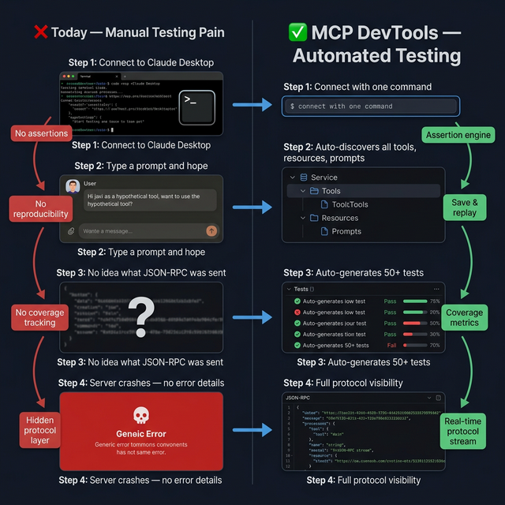
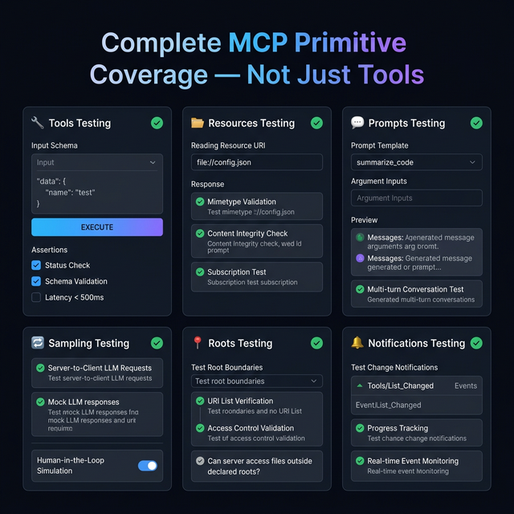
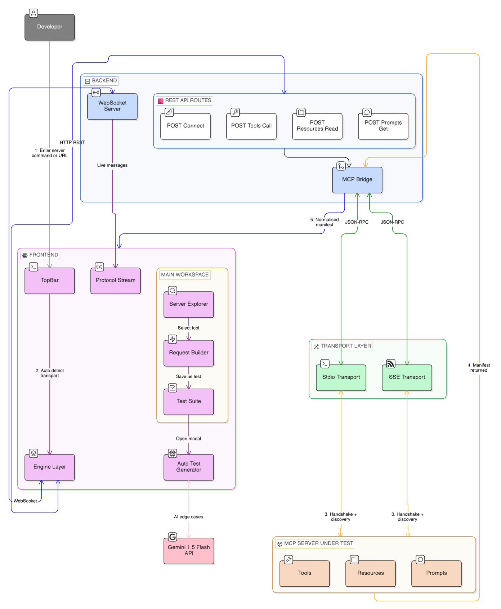
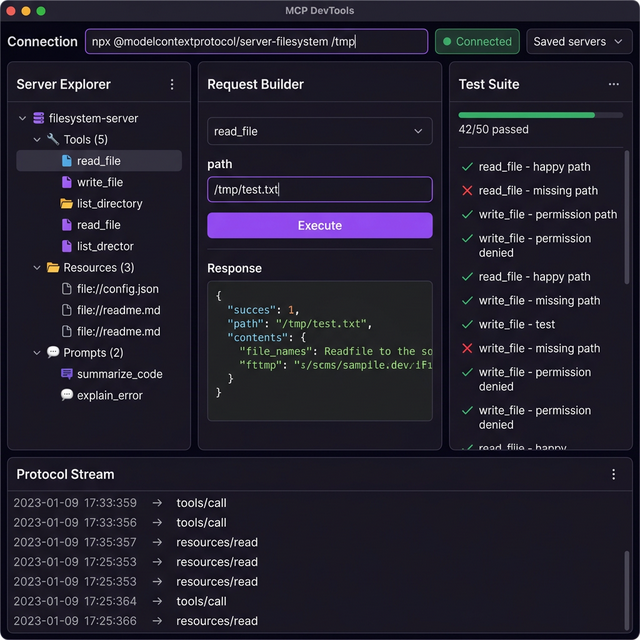

### Initial Idea Submission

Full Name: Aviral Sapra
University name: Indian Institute of Information Technology and Management (ABV-IIITM), Gwalior
Program you are enrolled in (Degree & Major/Minor): Integrated IT + M.Tech
Year: 3rd Year
Expected graduation date: June 2028

Project Title: MCP DevTools — A Full-Featured Testing Workbench for Model Context Protocol Servers and Clients

---

### Idea Description

The Model Context Protocol (MCP) has grown from an Anthropic experiment to critical AI infrastructure in under a year — over 97 million monthly SDK downloads, 10,000 active servers, and first-class support across ChatGPT, Cursor, Gemini, Microsoft Copilot, and Visual Studio Code ([MCP Blog, 2025](http://blog.modelcontextprotocol.io/posts/2025-12-09-mcp-joins-agentic-ai-foundation/)). Yet despite this explosive growth, the developer tooling story is bleak. Testing options for MCP tools are severely limited — cryptic error messages, environment setup issues, and a developer experience that simply does not meet the bar the ecosystem needs ([Victor Dibia, 2025](https://newsletter.victordibia.com/p/no-mcps-have-not-won-yet)). The best existing tool, MCP Inspector, lacks features for team-based testing, historical tracking, or CI/CD integration — it is a development tool, not a complete testing platform ([Testomat.io, 2025](https://testomat.io/blog/mcp-server-testing-tools/)).

**MCP DevTools** closes this gap — [View Demo / Video Walkthrough](https://drive.google.com/file/d/1QQSDyTnR_Xdv_sZ7IEkMbjmRbY4b9y58/view?usp=sharing). It is a full-featured GUI testing workbench built specifically for the MCP ecosystem — what API Dash is for REST, built from the ground up for MCP. It connects to any server via stdio or SSE, auto-discovers **all six MCP primitives** (Tools, Resources, Prompts, Sampling, Roots, and Notifications), and generates 50+ tests across 5 categories in a single click. A Gemini integration reads each primitive's schema and generates creative domain-specific tests no developer would write manually. Every JSON-RPC message streams live in a real-time protocol inspector.

---

### The Problem — What Developers Face Today



Right now, if you build an MCP server, your "testing workflow" looks like this:

1. **Connect to Claude Desktop** and type a prompt — hope the LLM calls your tool
2. **No visibility** into what JSON-RPC messages were actually sent or received
3. **No assertions** — you eyeball the response and decide if it "looks right"
4. **No coverage** — you have no idea which tools, resources, or prompts were tested
5. **No reproducibility** — you can't save and replay a test. Every run is manual

This is the equivalent of testing a REST API by opening a browser and typing URLs. The MCP ecosystem has 10,000+ servers but **zero dedicated testing infrastructure**.

#### The "Vibe Testing" Problem

Developers today do what the community calls "vibe testing" — they connect to an LLM client, run a few prompts to see if the server responds, and ship it. There's no way to:
- Know if the server follows the MCP specification correctly
- Test edge cases (what happens if a tool gets empty args? wrong types? 10,000-char strings?)
- Detect if a server update broke existing tool responses
- Test Resources, Prompts, Sampling, or Roots at all (LLM clients only invoke Tools)
- Run tests in CI/CD pipelines

---

### How Is MCP DevTools Different From MCP Inspector?

This is the most important question — and the answer is fundamental: **MCP Inspector is a manual debugger. MCP DevTools is a testing platform.** They serve entirely different purposes.

| Dimension | MCP Inspector | MCP DevTools |
|-----------|:---:|:---:|
| **Purpose** | Debug during development | Test before shipping |
| **Workflow** | Connect → manually click → visually check | Connect → auto-discover → auto-generate tests → run suite → get report |
| **Test persistence** | None — every session starts fresh | Save, replay, export, share test suites |
| **Assertions** | None — developer eyeballs the response | Built-in: status, schema, latency, content matching |
| **Test generation** | None — developer creates each request | Auto-generates 50+ tests from server manifest |
| **Coverage tracking** | None | Shows which primitives/tools are tested and which aren't |
| **CI/CD support** | None | CLI export + GitHub Actions integration |
| **Protocol visibility** | Partial connection logs | Full bidirectional JSON-RPC stream with filtering |
| **MCP primitive coverage** | Tools + Resources + Prompts (interactive) | All 6: Tools, Resources, Prompts, Sampling, Roots, Notifications |
| **Security analysis** | None | Risk-level mapping of server capabilities |
| **Regression testing** | None | Manifest diff + contract testing across versions |

**Analogy:** MCP Inspector is like Chrome DevTools' Network tab — you can see requests happening live and manually trigger them. MCP DevTools is like Postman + Jest — you build test suites, add assertions, run them automatically, save them, and put them in CI.

#### What Inspector Doesn't Solve (And We Do)

**Developer Pain #1: "My server works in Claude but breaks in Cursor"**
→ Inspector can't explain why. MCP DevTools runs a **Spec Compliance Checker** that validates the handshake sequence, capability reporting, schema validity, error codes, and response structure against the official MCP spec — and produces a scorecard telling you exactly what's wrong.

**Developer Pain #2: "I have no idea if my server handles edge cases"**
→ Inspector requires you to manually type every test input. MCP DevTools reads your server's tool schemas and **auto-generates** happy path, negative (missing args, wrong types), boundary (injection, Unicode, overflow), resource, and AI-powered edge case tests — 50+ tests with zero manual effort.

**Developer Pain #3: "My latest commit broke something but I don't know what"**
→ Inspector has no history. MCP DevTools supports **manifest diff** (compare tool/resource/prompt definitions across server versions) and **contract testing** (define expected behavior, detect when it changes).

**Developer Pain #4: "I can't put this in my CI pipeline"**
→ Inspector is browser-only. MCP DevTools exports test suites as JSON and provides a CLI runner for GitHub Actions integration.

---

### Testing All Six MCP Primitives — Not Just Tools

The MCP specification defines **six core primitives**. Most tools (including MCP Inspector in practice) focus primarily on Tools. MCP DevTools tests **all six**:



#### 1. 🔧 Tools (Model-Controlled)
Executable functions the server exposes. The most common primitive.

**What we test:**
- Happy path: call with valid args → assert success + schema match
- Negative: missing required args, wrong types, null values → assert proper error codes
- Boundary: SQL injection strings, Unicode, 10K-char payloads, empty objects → assert no crash
- Latency: response time under threshold
- Destructive guard: auto-detect tools like `delete_file`, `drop_table` and skip them by default

#### 2. 📁 Resources (Application-Controlled)
Read-only data the server exposes via URIs (files, database records, API responses).

**What we test:**
- URI resolution: does each declared resource URI actually resolve?
- Content type: does the response match the declared `mimeType`?
- Content integrity: is the returned content valid (parseable JSON, valid UTF-8, etc.)?
- List stability: does `resources/list` return consistent results across calls?
- Subscription: if the server supports `subscribe`, does it fire `notifications/resources/updated` when content changes?
- Template URIs: for `resource://user/{id}`, test with valid IDs, invalid IDs, missing IDs

#### 3. 💬 Prompts (User-Controlled)
Reusable templates that guide LLM interactions, with dynamic arguments.

**What we test:**
- Argument validation: are required arguments enforced? Do optional args have defaults?
- Message generation: does the prompt produce valid `messages[]` array with correct roles?
- Multi-turn structure: for multi-message prompts, is the conversation flow coherent?
- Resource embedding: if the prompt references embedded resources, do they resolve?
- Edge cases: empty arguments, extremely long arguments, special characters in args

#### 4. 🔄 Sampling (Server → Client)
The reverse direction — the server requests LLM completions FROM the client.

**What we test:**
- Request format: does the sampling request follow the `createMessage` spec?
- Mock LLM response: provide configurable mock responses and verify server handles them
- Timeout handling: what happens if the "LLM" doesn't respond?
- Human-in-the-loop simulation: test the approval/rejection flow
- Context inclusion: verify `includeContext` behavior (none/thisServer/allServers)

#### 5. 📍 Roots (Client → Server)
Boundaries that define where the server can operate (filesystem paths, workspace URIs).

**What we test:**
- Boundary enforcement: does the server respect declared root boundaries?
- Access outside roots: attempt to read/write outside declared roots → assert rejection
- Root change notification: if client changes roots, does server re-discover correctly?
- Multiple roots: test with overlapping, nested, or conflicting root URIs

#### 6. 🔔 Notifications (Bidirectional)
Real-time events between client and server (progress, capability changes, resource updates).

**What we test:**
- `tools/list_changed`: modify server config → verify notification fires
- `resources/list_changed`: add/remove resource → verify notification
- `progress` notifications: for long-running tools, verify progress tokens and incremental updates
- Notification format: validate each notification matches the JSON-RPC notification spec (no `id` field)
- Event ordering: verify notifications arrive in correct sequence

---

### Proposed Solution & Architecture

**MCP DevTools** is a React + Express application that bridges the developer and any MCP server.



**How it works:**

1. Developer enters a command (`npx @mcp/server-filesystem /tmp`) or URL (`http://localhost:3000/sse`)
2. Frontend auto-detects transport — starts with `http` → SSE, everything else → stdio
3. Backend spawns the process or opens the stream via the official MCP SDK (`@modelcontextprotocol/sdk`)
4. MCP handshake — `initialize` → `initialized`, capabilities exchange, discovery of all primitives
5. Full manifest returned — tools, resources, prompts all appear in the Explorer panel
6. Developer can explore any primitive, test it manually via the Request Builder, and save results
7. **Auto-Test Generator** reads the manifest and produces 50+ tests across 5 categories
8. **Gemini AI** reads each tool/resource/prompt schema and generates creative domain-specific edge cases
9. **Protocol Stream** shows every raw JSON-RPC message bidirectionally in real time via WebSocket



---

### Five Advanced Testing Pillars

Basic "send request → check response" testing only catches ~30% of production issues. The rest come from spec violations, security gaps, and resilience failures. MCP DevTools addresses this with 5 advanced testing pillars:

#### Pillar 1 — MCP Spec Compliance Checker

Not "does the tool respond?" but "does the server follow the MCP specification correctly?"

| Check | What It Validates | Why It Matters |
|-------|------------------|----------------|
| Handshake conformance | `initialize` → `initialized` sequence follows spec | Servers that skip steps work in Claude but break in other clients |
| Capability reporting | Server declares capabilities it actually supports | Prevents ghost features that crash when called |
| Tool schema validity | Tool schemas match JSON Schema specification | Malformed schemas cause silent failures in clients |
| Error format compliance | Errors use standard JSON-RPC error codes (-32600, -32601, etc.) | Non-standard errors are invisible to client error handling |
| Response structure | `content[]` array with valid types (`text`, `image`, `resource`) | Wrong structure causes rendering failures in clients |

**Output:** A compliance scorecard — "Your server is 85% spec-compliant. 3 issues: missing error code on `read_file`, non-standard capability declaration, invalid schema on `search`."

#### Pillar 2 — Security Surface Analysis

Automatically maps what an MCP server CAN do and flags risks:

| Risk Level | Capability | Example Tools | What's Flagged |
|:---:|-----------|---------|------|
| 🔴 Critical | Code execution | `execute_command`, `run_script` | Can execute arbitrary code on host |
| 🔴 Critical | File write/delete | `write_file`, `delete_file` | Can modify/destroy data |
| 🟡 High | Network access | `fetch_url`, `http_request` | Can exfiltrate data or SSRF |
| 🟡 High | Database mutation | `insert_record`, `drop_table` | Can corrupt data stores |
| 🟢 Low | Read-only | `read_file`, `list_directory` | Information disclosure only |

**Output:** "This server has 2 critical-risk tools, 1 high-risk tool, and 5 low-risk tools. Recommendation: sandbox critical tools before production."

#### Pillar 3 — Chaos & Resilience Testing

Tests how servers behave under real-world stress:

| Test | What Happens | Expected Behavior |
|------|-------------|-------------------|
| Concurrent burst | 10-50 simultaneous tool calls | Handle gracefully, no crashes |
| Mid-call disconnect | Drop connection during execution | Clean up resources, no orphaned processes |
| Malformed JSON-RPC | Send invalid payloads | Return proper error codes, don't crash |
| Rapid reconnect | Connect → disconnect → reconnect 10× | Accept reconnection without state leaks |
| Timeout bombing | Send call before previous completes | Queue or reject gracefully |

**Output:** "Server survived 45/50 concurrent calls (90%). Crashed on malformed JSON-RPC (critical). Reconnection: 10/10 passed."

#### Pillar 4 — Contract Testing

Define expected behavior, verify it continuously:

```
Contract: "get_weather"
  When called with { city: "London" }:
    ✅ Status must be "success"
    ✅ Response must contain "temperature"
    ❌ Response must contain "humidity"  ← renamed to "relative_humidity" in v2.1
    ✅ Latency must be < 2000ms
```

Like snapshot testing for MCP — if a server update changes behavior, the contract catches it.

#### Pillar 5 — Server Diff

Compare versions or different servers side-by-side:

```
Server A: my-server@1.0.0    vs    Server B: my-server@2.0.0

Tools:
  + [ADDED]   search_files        (new in v2)
  ~ [CHANGED] read_file           required params: 1 → 2 (BREAKING)
  - [REMOVED] get_file_info       (BREAKING for existing clients)

Resources:
  ~ [CHANGED] config://settings   mimeType: application/json → text/yaml

Prompts:
  + [ADDED]   debug_error         (new prompt template)
```

---

### Key Differentiators

| Capability | MCP Inspector | Claude Desktop | **MCP DevTools** |
|---------|:---:|:---:|:---:|
| Purpose | Manual debugger | AI chat client | **Testing platform** |
| All 6 MCP primitives | Tools + Resources + Prompts | Tools only (LLM-driven) | **All 6: Tools, Resources, Prompts, Sampling, Roots, Notifications** |
| Auto-test generation | ❌ | ❌ | **✅ 50+ tests from manifest** |
| Assertion engine | ❌ | ❌ | **✅ Status + Schema + Latency + Content** |
| Test persistence | ❌ Fresh every session | ❌ | **✅ Save, replay, export** |
| CI/CD integration | ❌ Browser-only | ❌ | **✅ CLI export + GitHub Actions** |
| Protocol visibility | Partial logs | ❌ | **✅ Full bidirectional JSON-RPC stream** |
| Spec compliance check | ❌ | ❌ | **✅ Scorecard** |
| Security surface analysis | ❌ | ❌ | **✅ Risk-level mapping** |
| Chaos/resilience testing | ❌ | ❌ | **✅ Concurrent, disconnect, malformed** |
| Contract testing | ❌ | ❌ | **✅ Snapshot behavior verification** |
| Server manifest diff | ❌ | ❌ | **✅ Version comparison** |
| Destructive op guard | ❌ | ❌ | **✅ Auto-detected & skipped** |
| AI-powered edge cases | ❌ | ❌ | **✅ Gemini integration** |

---

### Future Roadmap

| Phase | Features |
|-------|---------|
| **Phase 1 — Built** | Connect via stdio & SSE · Tool/Resource/Prompt explorer · Request builder · Protocol stream · Saved servers · Auto-test generation (5 categories) · Gemini AI edge cases · Destructive operation guard |
| **Phase 2 — Next** | MCP Spec Compliance Checker · Security Surface Analysis · Contract Testing · Server Diff · Sampling & Roots & Notifications testing · Test export/import · Latency dashboards (p50/p95/p99) |
| **Phase 3 — Vision** | Chaos & Resilience Testing · CLI runner for CI/CD · GitHub Actions integration · Multi-server regression · Community plugin system · Team collaboration |
