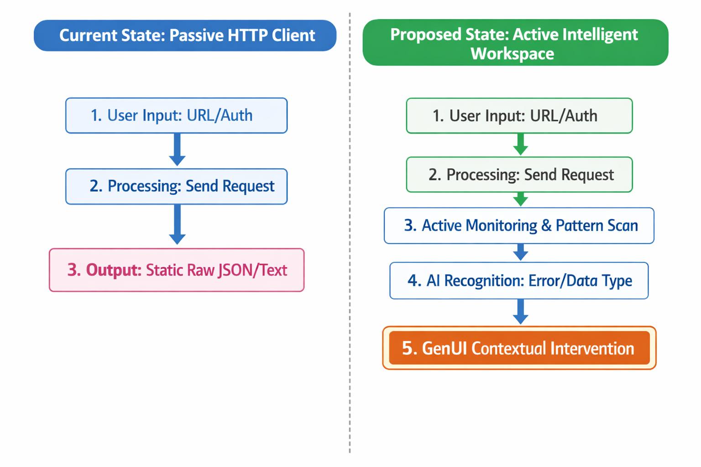

### Initial Idea Submission

**Full Name:** Banashankari Anegundi

**University name:** PES University

**Program you are enrolled in (Degree & Major/Minor):**  B.Tech ECE

**Year:** 4th Year

**Expected graduation date:**  June 2026

**Project Title:** Idea 5 - Intelligent API Orchestration & Generative UI (GenUI)
**Relevant issues:** https://github.com/foss42/apidash/issues/1227

**Idea description:**
Building upon my previous contribution in **PR #1428** (Resilient Network Layer), this project aims to transform API Dash from a passive HTTP client into an **Active Intelligent Workspace**. The core objective is to implement a vendor-neutral middleware that bridges raw API responses with rich, interactive UI components using the **Open Responses** specification and **Google’s A2UI (GenUI SDK)**.

#### **Technical Approach:**
1. **Standardized Parsing:** I will implement an `OpenResponseParser` that maps multi-provider LLM outputs (Gemini, OpenAI, Anthropic) into a common `ResponseObject`. This ensures that the UI layer remains interoperable regardless of the backend AI provider.
2. **A2UI Orchestration:** An `AIOrchestratorService` (managed via **Riverpod**) will monitor incoming responses. Using A2UI guidelines, it will identify "Intervention Intents"—such as detecting a 401 error to offer an `AuthRepairCard` or detecting a specific JSON schema to offer a `DataPreviewCard`.
3. **GenUI SDK Implementation:** I will develop a modular **Widget Factory** leveraging Flutter's GenUI SDK. These widgets will be designed for **portability**, allowing API Dash users to view a visualization and instantly export the corresponding Flutter code for use in their own applications.

#### **Proof of Concept (PoC):**
I have already validated this architecture by building a standalone PoC in `lib/services/agentic_services`. This prototype successfully intercepts API responses to trigger dynamic UI interventions, demonstrating that the logic is both feasible and performant within the current API Dash codebase.
https://github.com/Banashankari21/genui_poc

#### **Architecture Overview:**

