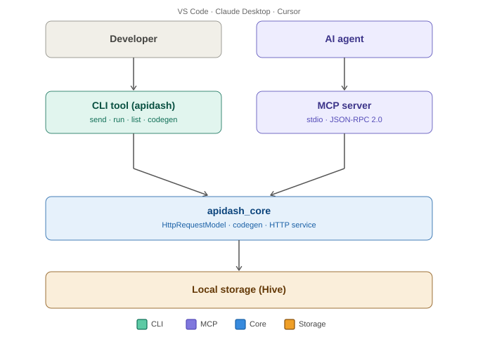
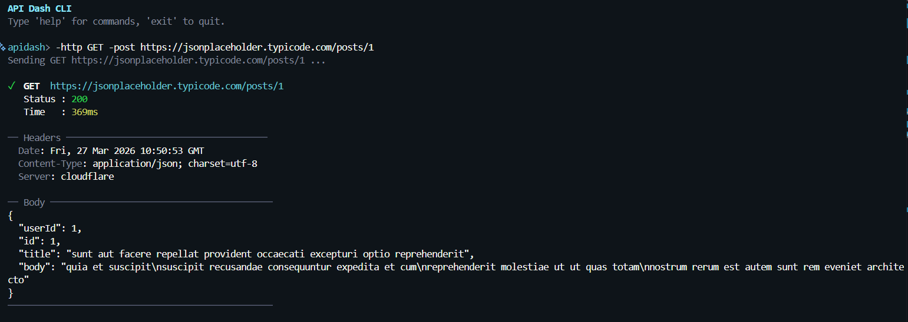
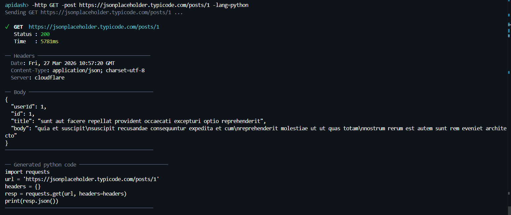
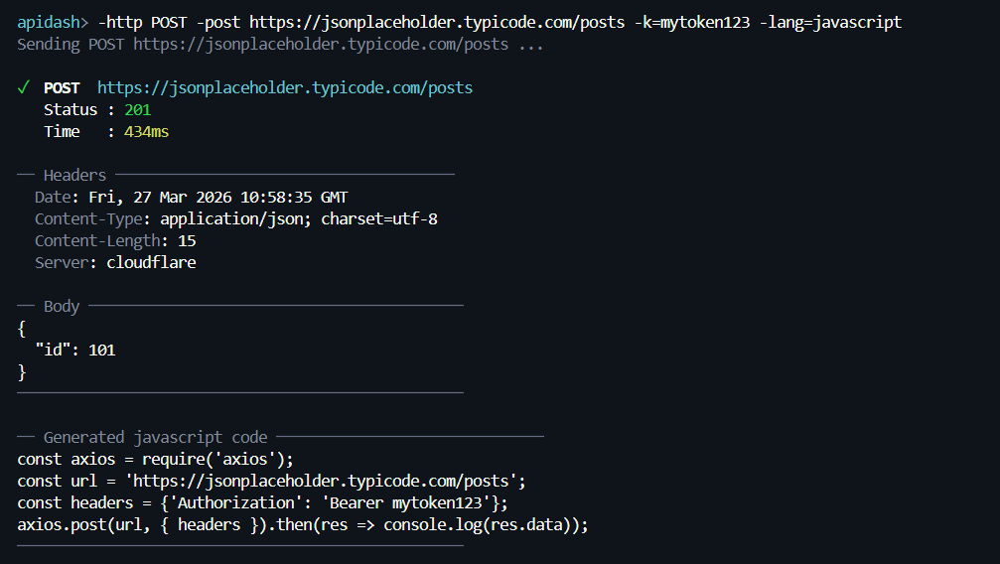
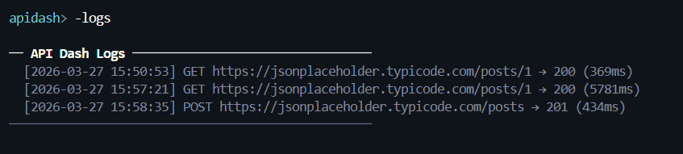
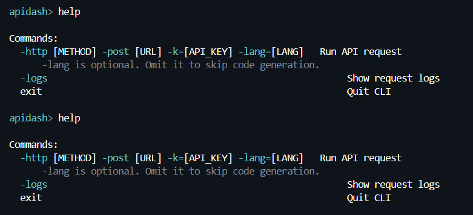
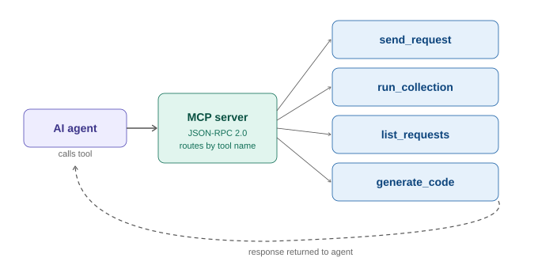

# GSoC 2026 Proposal: CLI & MCP Support for API Dash

## About

- **Full Name:** Farheen Imam
- **Email:** farheenimam331@gmail.com
- **Discord Handle:** haileyfranchette_999
- **GitHub Profile:** [https://github.com/farheenimam](https://github.com/farheenimam)
- **LinkedIn:** [farheenimam](https://www.linkedin.com/in/farheen-imam/)
- **Time Zone:** UTC+5
- **Resume:** [Resume Linked](https://drive.google.com/file/d/1Xa6LpvZ7gThDmiXYAk_DayS1q-9PaIzF/view?usp=sharing)

---

## University Info

- **University Name:** Shaheed Zulfikar Ali Bhutto Institute of Science and Technology University

- **Program:** Bachelor of Science in Computer Science (BSCS)
- **Year:** 3rd Year
- **Expected Graduation Date:** 2027

---

## Motivation & Past Experience

**1. Have you worked on or contributed to a FOSS project before? Can you attach repo links or relevant PRs?**

Not yet in terms of merged PRs, but I've been going through the API Dash codebase locally, setting it up, reading through `apidash_core`, and understanding how the request models, collections, and codegen fit together. I'm working on my first contribution before submitting this proposal and will link the PR here once it's up.

**2. What is your one project/achievement that you are most proud of? Why?**

A Python-based automation tool I built that translates Korean web novels, formats chapters, and compiles them into Google Docs, then sends an email notification once the process completes. I focused on making the workflow reliable by handling failures in translation and document updates. This project helped me understand automation pipelines and API integrations — all of which are directly relevant to this project.

Project link: https://github.com/farheenimam/n8n-automations

**3. What kind of problems or challenges motivate you the most to solve them?**

The problems that motivate me the most are the ones I face in my everyday life where no clear solution exists. In those situations, I enjoy combining existing tools and technologies to create something useful and often fun. I like taking what already exists and connecting them in a way that makes them more powerful and practical.

**4. Will you be working on GSoC full-time? In case not, what will you be studying or working on while working on the project?**

Not full-time since I'm a 3rd year student so university runs in parallel. I can commit around 15 hours a week consistently, which covers the 90 hours comfortably over the coding period. I'll plan around any exams well in advance and keep mentors informed of tight weeks.

**5. Do you mind regularly syncing up with the project mentors?**

Not at all. I'm on Discord and happy to do weekly check-ins. I can also post progress updates in the PR thread each week so there's a written record of where things stand.

**6. What interests you the most about API Dash?**

What interests me most about API Dash is its clean and well-structured codebase. The separation in `apidash_core` makes it easy to understand and build on, and with guidance from the mentors, I was able to navigate it comfortably. I also work a lot with APIs and model integrations, so API Dash fits naturally into my workflow. The CLI project aligns well with this, as it would make testing APIs faster and more accessible directly from the terminal.

**7. Can you mention some areas where the project can be improved?**

The main gap is that API Dash only works through the GUI. You can't run a collection in a CI pipeline, you can't script around it, and AI agents have no way to call into it. A CLI and MCP server would fix all three without touching any existing behaviour. Beyond this project, the HAR export and collection runner features are really well done but easy to miss so better discoverability there would help new users.

**8. Have you interacted with and helped the API Dash community? (GitHub/Discord links)**

Yes, I've joined the API Dash Discord, introduced myself, also joined the weekly connect and have been reading through the #gsoc-foss-apidash channel to follow ongoing discussions. I went through the 2026 ideas thread.
I'm working on my first GitHub contribution (link to be added once the PR is up).

---

## Project Proposal Information

### Proposal Title
CLI & MCP Support for API Dash

### Abstract

This project adds two things to API Dash: a CLI tool and an MCP server. The CLI (`apidash`) lets developers send requests, run collections, and generate integration code from the terminal, useful for scripting and headless environments such as CI/CD pipelines where no GUI is available. The MCP server exposes those same capabilities as tools that any MCP-compatible AI agent (VS Code Copilot, Claude Desktop, Cursor) can call. Both are built on top of the existing `apidash_core` package, reusing the HTTP service, data models, and well-tested code generators that are already there.

---

### Detailed Description

#### Overall Architecture

The diagram below shows how everything fits together. Both the CLI and MCP server sit on top of `apidash_core`, they share the same service layer, so there's no duplicated HTTP or codegen logic.



*Fig 1 — Developer uses the CLI directly; AI agents connect through the MCP server. Both delegate to `apidash_core` and read from the same local Hive store.*

---

#### CLI Tool

A Dart executable (`bin/apidash.dart`) built using the `args` package. All flags support both long and short forms — for example `--lang` / `-l`, `--id` / `-i`, `--env` / `-e`, `--collection` / `-c` — to keep terminal use fast.

```
-http [METHOD] -post [URL] -k=[API_KEY] -lang=[LANG]   # send a request and generate code
-logs                                                  # show request logs
```

Sample output — `apidash run`:

```
Running: Smoke Tests (4 requests)
✓  GET    /users        200   87ms
✓  POST   /users        201  134ms
✗  PUT    /users/1      422  198ms   ← status check failed
✓  DELETE /users/1      204   91ms
────────────────────────────────────
3 passed · 1 failed        exit: 1
```

Exit code `1` on any failure makes it usable directly in GitHub Actions and other CI systems without any extra wrapper.

**On storage:** API Dash persists data locally using Hive. The CLI will attempt to initialise the same store via `Hive.init(path)`, this works in pure Dart without Flutter bindings. If any part of the existing box setup is tied to Flutter's app lifecycle, a thin shared storage abstraction will be introduced so both the GUI and CLI read from the same data. This will be confirmed with mentors during the bonding period.

**On request IDs:** The `--id` / `-i` flag refers to the internal identifiers API Dash already assigns to each saved request. Running `apidash list` displays these IDs so users know what to pass.

**On collections:** API Dash already organises requests into collections and folders. The `run` command works on these existing groupings, no new data structures needed.

**On code generation:** `apidash_core` already has well-tested generators for Python, JavaScript, Dart, Kotlin, cURL, HAR, and more. The `codegen` command calls these directly and prints to stdout. The language is specified via `--lang` / `-l` (e.g. `-l=python`, `-l=javascript`).

**On error handling:** The CLI will handle network errors, invalid IDs, and malformed requests gracefully, clear error messages printed to stderr and non-zero exit codes so scripts and CI pipelines can detect failures reliably.

**On testing:** Unit tests will cover each CLI command and MCP tool handler. Integration tests will cover end-to-end request execution using real HTTP calls.

#### Mockups
Basic request — no code generation:

Request with code generation:

POST request with API key and JavaScript code gen:

View logs after running a few requests:

Help command:



---

#### MCP Server

The MCP server runs over stdio, the standard transport used by VS Code Copilot, Claude Desktop, Cursor, and most MCP clients. It implements JSON-RPC 2.0 over stdin/stdout.



*Fig 2: An AI agent calls a tool by name. The MCP server routes it to the right handler, which delegates to `apidash_core`, and returns the response back to the agent.*

Registered tools:

| Tool | Description |
|------|-------------|
| `send_request` | Send a saved request by ID. Returns status code, headers, and body. |
| `run_collection` | Run all requests in a named collection or folder. Returns pass/fail per request. |
| `list_requests` | List saved requests, optionally filtered by collection. |
| `generate_code` | Output integration code in any language API Dash already supports. |

Other transports (SSE, HTTP) are out of scope for this 90-hour project and can be added later.

**VS Code (`settings.json`):**

```json
{
  "mcp": {
    "servers": {
      "apidash": {
        "command": "apidash",
        "args": ["mcp"]
      }
    }
  }
}
```

**Claude Desktop (`claude_desktop_config.json`):**

```json
{
  "mcpServers": {
    "apidash": {
      "command": "apidash",
      "args": ["mcp"]
    }
  }
}
```

---

#### Code Structure

```
bin/
  apidash.dart                      ← entry point

lib/
  cli/
    cli_runner.dart
    commands/
      send_command.dart
      run_command.dart
      list_command.dart
      codegen_command.dart

  mcp/
    server.dart                     ← stdio transport, JSON-RPC dispatcher
    tools/
      send_request_tool.dart
      run_collection_tool.dart
      list_requests_tool.dart
      generate_code_tool.dart
      ai_send_request_tool.dart     ← stretch goal only
```

All new files only. No existing files in `lib/`, `packages/apidash_core/`, or the GUI are modified.

---

#### Stretch Goals (if time allows)

- `ai_send_request` MCP tool — an agent describes a new API request in plain English, the tool creates a dynamic `HttpRequestModel` and sends it via `apidash_core`. Only attempted if core work finishes ahead of schedule.
- SSE transport for the MCP server.

---

### Weekly Timeline

| Week | Dates | Tasks |
|------|-------|-------|
| Community Bonding | May 1 – May 26 | Set up locally, study `apidash_core` in depth (request models, Hive box structure, collections, codegen), confirm storage access approach with mentors, read `args` and `dart_mcp` docs, raise a small contribution PR |
| Week 1–2 | May 27 – Jun 9 | CLI entry point and argument routing. `list` command, initialise storage, read saved requests and collections, print formatted output |
| Week 3–4 | Jun 10 – Jun 23 | `send` command, load `HttpRequestModel` by ID, execute via HTTP service in `apidash_core`, print status and response |
| Week 5 | Jun 24 – Jun 30 | `run` command, iterate requests in a collection or folder, print pass/fail table, exit code 1 on any failure |
| Midterm | Jul 1 – Jul 7 | CLI fully working with unit tests and USAGE.md. Demo shared with mentors. |
| Week 6 | Jul 8 – Jul 14 | `codegen` command, call existing generators in `apidash_core`, print to stdout, support all languages the GUI already supports |
| Week 7–8 | Jul 15 – Jul 28 | MCP server over stdio. Register all 4 tools with proper JSON schemas. Wire to same service layer as CLI. |
| Week 9 | Jul 29 – Aug 11 | Integration tests for all MCP tools. Test end-to-end in VS Code and Claude Desktop. Fix edge cases. |
| Week 10 | Aug 12 – Aug 25 | Buffer for polish and edge cases. Final docs, CHANGELOG entry, demo video. Stretch goal if ahead of schedule. |