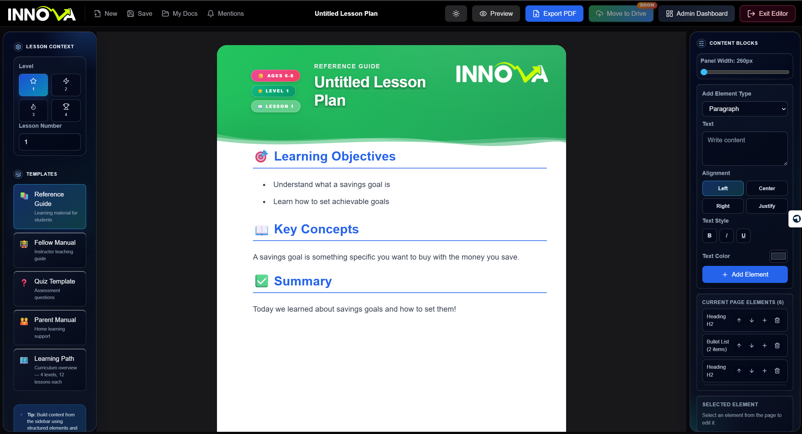
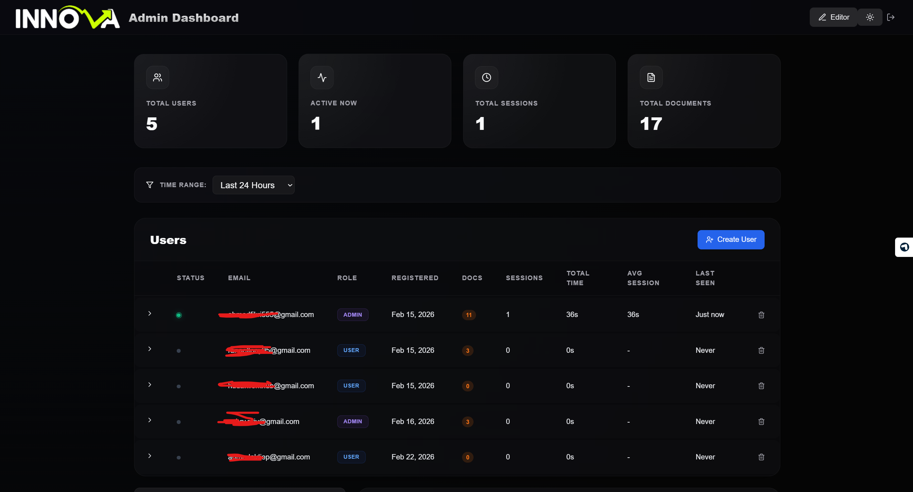
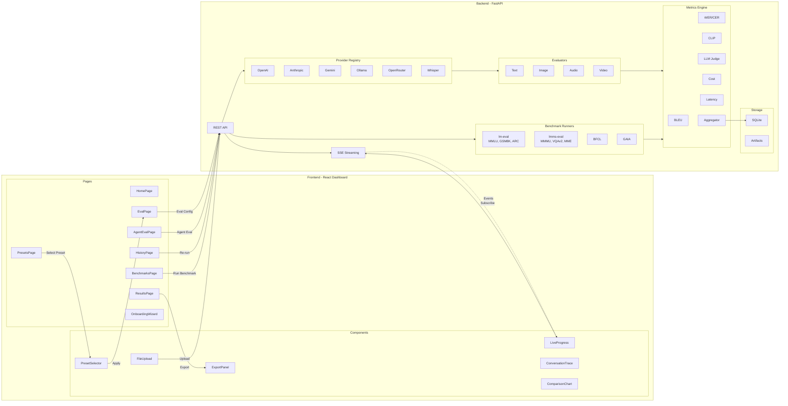

# GSoC 2026 Application: Ahmed Fikri Mahmoud - Multimodal AI and Agent API Evaluation Framework

> **Working PoC**: See implementation PR [#1545](https://github.com/foss42/apidash/pull/1545) and code in this proposal.

---

## About

1. **Full Name**: Ahmed Fikri Mahmoud
2. **Contact info (public email)**: dev.fikrii@gmail.com
3. **Discord handle in our server (mandatory)**: ahmed.fikri
4. **GitHub profile link**: https://github.com/Fikri-20
5. **Twitter, LinkedIn, other socials**: https://www.linkedin.com/in/ahmed-fikri/
6. **Time zone**: Africa/Cairo (UTC+2)

---

## University Info

1. **University name**: Mansoura University
2. **Program you are enrolled in (Degree & Major/Minor)**: B.Sc. Computer Engineering
3. **Year**: 4th Year
4. **Expected graduation date**: July 2026

---

## Motivation & Past Experience

### 1. Have you worked on or contributed to a FOSS project before? Can you attach repo links or relevant PRs?

Yes. I have made significant contributions to open source projects:

**Jenkins Plugin Modernizer Tool** (https://github.com/jenkins-infra/plugin-modernizer-tool)

- **Core contributer for `2966.v32e57de5e2fb_` Release (latest release)**: Led the release engineering effort for this major version release
- **Pull Requests**: https://github.com/jenkins-infra/plugin-modernizer-tool/pulls?q=is%3Apr+author%3AFikri-20
- **Release**: https://github.com/jenkins-infra/plugin-modernizer-tool/releases/tag/2966.v32e57de5e2fb_
- Experience working with a large-scale open source Java project with multiple contributors
- Collaborated with maintainers from various organizations to ship production software

**MCPJam Inspector** (https://github.com/MCPJam/inspector/pull/663)

- Added inspection capabilities for the MCPJam multimodal AI evaluation framework, specifically improvements to the result parsing and display functionality

**API Dash PoC** (My Own Work)

- Built the proof-of-concept for this GSoC project demonstrating multimodal AI provider evaluation with FastAPI backend and React frontend
- Implements provider abstraction, SSE streaming, SQLite persistence, and evaluation metrics

### 2. What is your one project/achievement that you are most proud of? Why?

**1. Innova Content Pipeline — Full Content Platform for My EdTech Startup**
It's in production, so i can't relate to the rebo, but you could check it's existent on my github account, and I'll put snaps of the Content pipeline here:

> **This is the project I'm most proud of** — it's a real product used by real people every day Internally at Innova.

**Innova** is an edtech startup, and I built our entire content operation platform from scratch. It's the complete editorial environment for managing all our education employees — from content creation to publishing.

What I built:

- **Block-based document editor** with 5 templates (quiz, learning-path, reference-guide, parent-manual, fellow-manual)
- **Express + MongoDB backend** with JWT auth, refresh token rotation, role-based access control
- **Admin dashboard** with user management, session tracking, activity analytics
- **PDF export pipeline** — Puppeteer Core + serverless function for generating downloadable documents
- **Auto-save every 3 seconds** — never lose work, with metadata sync to backend
- **Curriculum JSON import** for learning paths with specialized export layouts

**Screenshots:**

_Content Editor — Block-based document creation with templates_

_Admin Dashboard — User management and analytics_

_Why I'm proud_: I designed and built this entire platform **solo**. From database schema design to the block editor architecture, from the auth system to the PDF rendering pipeline. My teammates use it daily to create, manage, and export curriculum content. This is a production system with real users — not a side project.

---

**2. ProdHub — Open-Source Privacy-First Activity Tracker**
https://github.com/Fikri-20/ProdHub

> **100% free and open source** — anyone can self-host it, track their workflow, and own their data.

A privacy-first, self-hosted activity tracker with GitHub-style heatmap dashboard. Complete system includes:

- **Desktop Agent** (Electron) — auto-reads config, zero-setup
- **Browser Extension** — one-click install, tracks browsing activity
- **VS Code Extension** — developer productivity tracking
- **Fastify API** with SQLite persistence
- **Next.js Dashboard** with heatmap visualization
- **Zero-config setup** — runs locally, no cloud, no accounts

_Why I'm proud_: Built the entire system from zero to production-ready. **This is an open project** — I've already received interest from contributors and will be welcoming PRs soon.

### 3. What kind of problems or challenges motivate you the most to solve them?

I am most motivated by problems that **democratize technology** - making complex tools accessible to more developers.
I' most motivate by building _full-functional production level_ software solutions that make complex tools accesible to more people (either people I work with or not)

Specifically:

- **Fragmented tooling**: When developers need multiple disjointed tools to accomplish one goal, I want to unify them
- **Accessibility barriers**: When powerful capabilities (like AI evaluation) are locked behind CLI expertise or vendor dashboards, I want to make them available via intuitive UIs
- **Local-first solutions**: I believe in giving developers the ability to run powerful models locally, reducing dependency on cloud services

This is why the Multimodal AI Evaluation Framework excites me - it tackles all three: it unifies fragmented AI evaluation tools, makes multimodal AI accessible via a web UI, and prioritizes local model support.

**Technical challenges I enjoy solving:**

- Designing clean abstractions that make complex systems extensible (like the ProviderAdapter pattern)
- Building async systems that handle concurrent operations efficiently
- Creating intuitive UIs that make powerful functionality accessible to non-experts

### 4. Will you be working on GSoC full-time? In case not, what will you be studying or working on while working on the project?

Yes, I will be working on GSoC **alongside my startup commitments** during the coding period (May-August 2026).

I currently spend **~30 hours per week** on my edTech startup **Innova**, where I built the entire content pipeline platform. During GSoC, I will **dedicate an additional 30 hours per week** exclusively to this project — giving me **60 total hours per week** of focused work capacity.

My schedule:

- **GSoC work**: 30 hours/week on Multimodal AI Evaluation Framework
- **Startup work**: 30 hours/week on Innova (edTech content platform)

I am available for daily sync calls and async communication via Discord/GitHub.

### 5. Do you mind regularly syncing up with the project mentors?

I welcome regular syncs with mentors. I have already demonstrated this commitment through:

- Active participation in Weekly Connect calls
- Engaging in Discord discussions about the project architecture
- Asking clarifying questions and incorporating feedback into my proposal

I am available for weekly video calls and async communication via Discord/GitHub.

### 6. What interests you the most about API Dash?

API Dash solves a real problem: **unified API testing**. As someone who has worked with multiple API clients (Postman, Insomnia, curl), I appreciate that API Dash brings this to an elegant, open-source Flutter application.

What excites me most about the Multimodal AI Evaluation Framework idea is that it extends API Dash's core philosophy into the AI space:

- **Same philosophy**: Unified interface for testing multiple API providers
- **Same workflow**: Upload → Configure → Send → Compare → Export
- **Same values**: Open source, developer-friendly, accessible to all

Additionally, I see opportunities to contribute to API Dash core:

- The Flutter app could benefit from **plugin architecture** for AI provider integrations
- A **request history search** feature would help users find past API calls faster
- The **collection management** could include evaluation templates for common API testing scenarios

### 7. Can you mention some areas where the project can be improved?

Based on my analysis of the API Dash project:

**For API Dash (Flutter app):**

1. **Plugin Architecture**: A plugin system for AI provider integrations would allow extending the app beyond HTTP APIs
2. **Request History Search**: Advanced search/filtering for past requests would improve workflow
3. **Collection Sharing**: Better import/export for sharing API collections with teammates
4. **Environment Variables UI**: More sophisticated environment variable management with groups and inheritance

**For the Multimodal AI Evaluation Framework (this project):**

1. **Multimodal Evaluation**: Treat text, image, audio, and video as first-class citizens with dedicated metrics
2. **Local Model Priority**: As Ankit emphasized, local models via Ollama/OpenRouter should be first-class
3. **Developer Experience**: Clear error messages when things go wrong (e.g., "Ollama not running? Run: `ollama serve`")
4. **Customer-Ownership Mindset**: Every feature should be built for the end user - intuitive UI, helpful guidance
5. **Preset System**: Pre-built evaluation configurations for quick starts

### 8. Have you interacted with and helped API Dash community? (GitHub/Discord links)

Yes, I have been actively engaged with the API Dash community through Discord:

1. **[GSoC 2026 Discussion](https://discordapp.com/channels/920089648842293248/920089648842293251/1485154000587194398)** - Discussed project requirements and architecture for the Multimodal AI Evaluation Framework

2. **[Provider Integration Question](https://discordapp.com/channels/920089648842293248/920089648842293251/1485255346216767598)** - Asked clarifying questions about integrating multiple AI providers

3. **[Weekly Connect Call](https://discordapp.com/channels/920089648842293248/940195305620664330/1485928614527635506)** - Participated in the Weekly Connect call to discuss project expectations and mentorship

---

## Why I Am the Right Person

### Technical Skills

I have the specific technical skills required for this project:

| Skill                  | Evidence                                                                |
| ---------------------- | ----------------------------------------------------------------------- |
| **Python/FastAPI**     | Built the PoC backend with FastAPI, async Python, aiosqlite             |
| **React/TypeScript**   | Built the PoC frontend with React 18, TypeScript, Vite, Tailwind CSS    |
| **AI API Integration** | Implemented providers for OpenAI, Anthropic, Gemini, Ollama, OpenRouter |
| **Async Programming**  | Built SSE streaming, concurrent provider execution, job cancellation    |
| **Evaluation Metrics** | Implemented BLEU, WER/CER, LLM-judge, cost tracking metrics             |
| **Testing**            | Experience writing pytest tests for Jenkins Plugin Modernizer (Java)    |

### Relevant Experience

1. **Built the PoC from scratch**: The existing PoC (`poc/`) demonstrates I can architect and implement a full-stack multimodal evaluation system

2. **Provider abstraction expertise**: Designed and implemented the `ProviderAdapter` interface that normalizes requests/responses across 6 different AI providers

3. **Async pipeline experience**: Built the job executor with asyncio, SSE streaming, and cancellation support

4. **Open source collaboration**: Core maintainer for Jenkins Plugin Modernizer Tool v1.10.0 release, with experience coordinating distributed teams

### Full-Stack A-to-Z Delivery

I don't build prototypes — I deliver **production-ready solutions**:

| Project                     | What I Built                                                                            | Customer Ready?                                            |
| --------------------------- | --------------------------------------------------------------------------------------- | ---------------------------------------------------------- |
| **ProdHub**                 | Desktop agent, browser extension, VS Code extension, API, dashboard, SQLite persistence | ✅ Open source, 100% free, self-serve install, zero-config |
| **Innova Content Pipeline** | Block editor, auth system, admin dashboard, PDF export, MongoDB backend                 | ✅ Used daily by my startup team                           |
| **Multimodal AI Eval PoC**  | Provider adapters, evaluators, metrics, SSE streaming, React dashboard                  | ✅ Works end-to-end today                                  |

**What "customer-ready" means to me:**

- Zero-config setup (works out of the box)
- Clear error messages (not stack traces)
- Intuitive UI (no learning curve)
- Production-grade architecture (async, concurrent, persisted)

I build complete systems — not "here's a backend, good luck wiring it to a frontend."

### Commitment

- I am available **30 hours per week** for GSoC during May-August 2026 (plus 30 hours/week on my startup)
- I have **already demonstrated commitment** by building the PoC before submissions opened
- I actively participated in **Weekly Connect calls** and **Discord discussions** with mentors
- I am **receiving mentorship guidance** and incorporating feedback into my proposal
- I spend **30 hours weekly** on my edTech startup Innova — I know how to manage my time across multiple high-impact projects

---

## Project Proposal Information

### 1. Proposal Title

**Multimodal AI and Agent API Evaluation Framework**

### 2. Abstract

AI API evaluation is fragmented: developers must stitch together CLI tools (lm-harness), vendor dashboards, and custom scripts to compare models across providers. API Dash already solves the "unified API interface" problem for HTTP testing—this project extends that same philosophy to AI API benchmarking.

The Multimodal AI and Agent API Evaluation Framework provides a unified web-based platform that:

1. Takes a dataset (text, image, audio, or video inputs with expected outputs)
2. Sends the same inputs to multiple AI providers simultaneously (OpenAI, Anthropic, Gemini, Ollama, OpenRouter)
3. Scores each provider's responses using appropriate metrics (BLEU, WER, LLM-judge, etc.)
4. Streams real-time progress via SSE
5. Displays side-by-side comparison results with cost and latency tracking
6. Persists job history in SQLite for reproducibility

Following mentor guidance from Ashita (co-mentor) and Ankit (core mentor), this proposal prioritizes:

- **Local model support** (Ollama + OpenRouter local models)
- **Multimodal as core** (text, image, audio, video as first-class citizens)
- **Customer-ownership mindset** (developer-friendly, end-user focused)
- **Actionable task breakdown** (per Ashita's advice)

### 3. Detailed Description

#### 3.1 Problem Statement

Developers building with AI APIs face three critical problems:

**Fragmented Tooling**

- lm-harness and lighteval are CLI-only, requiring scripting expertise
- Vendor dashboards (OpenAI Playground, Anthropic Console) are single-provider only
- No tool lets you run the same test across multiple providers and compare results

**Multimodal Blindspots**

- Text evaluation is well-supported (BLEU, ROUGE, exact match)
- Image, audio, and video evaluation require custom pipelines
- Most "multimodal" tools are text-first with other modalities bolted on

**No Cost-Performance Visibility**

- Developers can't easily compare accuracy-per-dollar across providers
- Token counting and cost estimation is manual
- Trade-off decisions (GPT-4 vs Gemini vs local model) are guesswork

#### 3.2 Architecture Overview

The framework uses a **FastAPI backend + React SPA frontend** architecture:

**Data Flow:**

1. **Configure Eval** → EvalPage → REST API
2. **Upload Dataset** → FileUpload → Backend → Artifacts
3. **Run Evaluation** → Job Executor → Fan-out to Providers
4. **Stream Progress** → SSE → LiveProgress
5. **Score Results** → Evaluators → Metrics Engine
6. **View & Export** → ResultsPage → CSV/JSON/PDF

**Key Architectural Decisions:**

| Component | Technology | Rationale |
|-----------|------------|-----------|
| **Frontend** | React 18 + Vite + TypeScript | Fast HMR, type safety |
| **Backend** | FastAPI + asyncio | Async-native, auto OpenAPI docs |
| **Streaming** | Server-Sent Events | Unidirectional, simple, perfect for logs |
| **Database** | SQLite + aiosqlite | Zero-config, no external services |
| **Text Benchmarks** | lm-evaluation-harness | Industry standard, 60+ tasks |
| **Multimodal** | lmms-eval | 100+ VLM benchmarks |
| **Agent Eval** | BFCL + GAIA | Function calling + real-world tasks |
| **Async Jobs** | asyncio + Job Executor | Concurrent provider execution |

#### 3.3 Backend Architecture (Python/FastAPI)

**Provider System**
Each AI provider implements the `ProviderAdapter` interface for unified request/response:

- **OpenAI** (GPT-4o, DALL-E 3, Whisper API)
- **Anthropic** (Claude 3.5 Sonnet, Claude 3 Opus)
- **Google Gemini** (Gemini 1.5 Pro, Flash, Flash-2.0)
- **Ollama** (LLaVA, qwen2.5, Whisper - local models)
- **OpenRouter** (100+ models via single API key)
- **Whisper STT** (faster-whisper for speech-to-text)

**Job Executor (Async Core)**
The `JobExecutor` orchestrates all evaluation work:
- Concurrent provider execution (fan-out to multiple providers)
- SSE progress streaming per job
- Job cancellation support
- Retry logic with exponential backoff

**Evaluation Modalities**

| Modality | Evaluators | Metrics |
|----------|------------|---------|
| **Text** | TextCompletion, TextChat | Exact Match, BLEU, ROUGE, LLM Judge |
| **Image Understanding** | VisionQA, Captioning | CLIP Score, LLM Judge |
| **Image Generation** | ImageGen | FID, IS, CLIPScore |
| **Audio STT** | WhisperSTT | WER, CER |
| **Audio TTS** | SpeechSynthesis | Quality Score (LLM Judge) |
| **Video** | FrameExtractor + VisionQA | CLIP Score, LLM Judge |

**Metric System**

| Category | Metrics |
|----------|---------|
| **Text** | Exact Match, BLEU, ROUGE, LLM Judge |
| **Audio** | WER (Word Error Rate), CER (Character Error Rate) |
| **Vision** | CLIP Score, LLM Judge |
| **Cross-cutting** | Cost (per-token), Latency (TTFT, total), Step counts |

**Benchmark Runners**

| Runner | Benchmarks | Purpose |
|--------|------------|---------|
| **lm-eval harness** | MMLU, GSM8K, ARC, HellaSwag, HumanEval, MBPP, BBH, MATH | Text/LLM standard benchmarks |
| **lmms-eval** | MMMU, VQAv2, ScienceQA, MME, Video-MME | Vision-language benchmarks |
| **BFCL** | Berkeley Function Calling Leaderboard | Tool-use / function calling |
| **GAIA** | General AI Assistants benchmark | Real-world multi-step tasks |

**Agent Evaluation System**

| Component | Function |
|-----------|----------|
| **ConversationCapture** | Middleware to log multi-turn dialogues |
| **ToolCallExtractor** | Parse and store function call traces |
| **StepScorer** | LLM-judge scoring per reasoning step |
| **ConversationReplay** | Visual playback UI for agent reasoning |

**Preset System**

| Feature | Description |
|---------|-------------|
| **Preset CRUD** | Save/load evaluation configurations |
| **Built-in Presets** | MMLU+GSM8K, VQAv2+MMMU, BFCL, HumanEval, Quick Compare |
| **Import/Export** | Share presets as JSON |

#### 3.4 Frontend Architecture (React/TypeScript/Vite)

**Pages**

| Page | Route | Purpose |
|------|-------|---------|
| **HomePage** | `/` | Overview, provider status, quick actions |
| **EvalPage** | `/eval` | Main evaluation workflow (config, upload, run) |
| **ResultsPage** | `/results/:id` | Charts, comparison, export |
| **HistoryPage** | `/history` | Past evaluations, re-run capability |
| **BenchmarksPage** | `/benchmarks` | Standard benchmark runner (MMLU, GSM8K, etc.) |
| **PresetsPage** | `/presets` | Preset management (create, edit, delete) |
| **AgentEvalPage** | `/agent-eval` | Conversation traces, tool-call visualization |
| **OnboardingWizard** | `/onboarding` | First-run setup flow |
| **ProviderSetup** | `/settings/providers` | API key management |

**Key Components**

| Component | Purpose |
|-----------|---------|
| **EvalConfig** | Modality/provider/parameter configuration |
| **FileUpload** | Dataset upload with drag-and-drop, preview, validation |
| **LiveProgress** | Real-time SSE progress, live logs, ETA |
| **PresetSelector** | One-click preset application |
| **ConversationTrace** | Visual replay of agent reasoning steps |
| **ComparisonChart** | Bar charts, box plots, pie charts |
| **ExportPanel** | CSV, JSON, PDF export options |
| **MetricExplanation** | "Why did it score that?" tooltips |
| **ProviderStatusCard** | Health check for each provider |

#### 3.5 Key Features

| Feature                   | Description                                                                           |
| ------------------------- | ------------------------------------------------------------------------------------- |
| Multi-provider comparison | Same inputs sent to all selected providers simultaneously                             |
| Real-time streaming       | SSE-powered live progress during evaluations                                          |
| Multimodal datasets       | text, image, audio, video support                                                     |
| Request parameter control | temperature, max_tokens, system_prompt per provider                                   |
| **Standard Benchmarks**   | MMLU, GSM8K, ARC, HellaSwag, HumanEval, BBH, MATH, MMMU, VQAv2, ScienceQA, BFCL, GAIA |
| Local model priority      | Ollama as first-class provider                                                        |
| Cost tracking             | Per-provider token counts and estimated USD                                           |
| Job history               | SQLite-persisted results with re-run capability                                       |

#### Supported Benchmarks

The framework integrates with industry-standard evaluation benchmarks:

**Text/LLM Benchmarks** (via lm-evaluation-harness):
| Benchmark | What It Tests | Use Case |
|-----------|---------------|----------|
| **MMLU** | 57 subjects (STEM, history, law, ethics) | Core general capability |
| **GSM8K** | Grade school math (2-8 step reasoning) | Math reasoning |
| **ARC** | Complex science reasoning (7,787 questions) | Science reasoning |
| **HellaSwag** | Commonsense sentence completion | Everyday reasoning |
| **HumanEval** | Python code generation (164 problems) | Code generation |
| **MBPP** | Python programming (974 challenges) | Code generation |
| **BBH** | BIG-Bench Hard (23 challenging tasks) | Multi-step reasoning |
| **MATH** | Competition math (AMC, AIME level) | Advanced math |

**Multimodal Benchmarks** (via lmms-eval):
| Benchmark | What It Tests | Use Case |
|-----------|---------------|----------|
| **MMMU** | Multi-discipline visual understanding (charts, diagrams) | Vision-language |
| **VQAv2** | Visual question answering | Vision-language |
| **ScienceQA** | Science Q&A with images | Vision-language |
| **MME** | Perception + cognition (24 subtasks) | Vision-language |
| **Video-MME** | Comprehensive video analysis | Video understanding |
| **LibriSpeech** | Speech recognition (1000hrs) | Audio transcription |

**Agent Evaluation**:
| Benchmark | What It Tests | Use Case |
|-----------|---------------|----------|
| **BFCL** | Function calling accuracy (Berkeley Leaderboard) | Tool-use agents |
| **GAIA** | Real-world multi-step tasks | General agents |
| **WebArena** | Web browsing agents (5 domains) | Web agents |

#### 3.6 Building on the PoC

The existing PoC (in `poc/` directory) already implements:

- ✅ Provider abstraction (OpenAI, Anthropic, Gemini, Ollama, Whisper, OpenRouter)
- ✅ Evaluators for all modalities (text, image, audio, video)
- ✅ Metric plugins (BLEU, WER, LLM-judge, cost)
- ✅ SSE streaming for real-time progress
- ✅ SQLite persistence
- ✅ React dashboard with EvalPage, ResultsPage, HistoryPage, BenchmarksPage
- ✅ lm-eval / lmms-eval integration (MMLU, GSM8K, VQAv2, MMMU, BFCL)

GSoC will productionize and extend the PoC with:

- Complete dataset upload UI with validation
- Preset system for quick-start evaluations
- Actionable error messages
- Full conversation trace capture for agent evaluation
- Metric selection UI
- Enhanced visualizations and export

#### 3.7 Following Mentor Guidance

This proposal was shaped by direct feedback from the API Dash mentors:

1. **Ashita (Co-Mentor)**: Advised to break down the implementation plan into specific, actionable tasks for better visualization and tracking.

2. **Ankit (Core Mentor)**: Emphasized prioritizing local model support. Tested local models through both Ollama and OpenRouter local endpoints.

3. **Ankit (Core Mentor)**: Advised that multimodal data (photos, videos, audio) should be the core priority, not afterthought features.

4. **Customer-Ownership Mindset**: Every design decision considers "would a developer find this intuitive? Would an end user understand the results?"

### 4. Weekly Timeline

> **Note**: The PoC already implements the core provider system, most modality evaluators, SSE streaming, SQLite persistence, React dashboard pages, and lm-eval/lmms-eval integration. The timeline below focuses on **productionization** (error handling, tests, validation), **benchmark expansion** (adding MMMU, BFCL, GAIA, Video-MME), **new features** (presets, agent eval, error guidance), and **polish** (documentation, UI/UX).

#### Phase 1: Production Hardening & Dataset System (Weeks 1-3, ~90 hours)

**Week 1: Environment & Codebase Familiarization (28h)**
| Task | Hours | Description |
|------|-------|-------------|
| T1.1 | 4h | Fork API Dash, set up dev environment, verify PoC runs end-to-end |
| T1.2 | 4h | Review PoC codebase architecture, identify gaps vs production needs |
| T1.3 | 6h | Add comprehensive error handling across all provider adapters |
| T1.4 | 6h | Add request validation and parameter sanitization middleware |
| T1.5 | 8h | Add dataset preview API (first 5 rows) with error reporting |
| **Total** | **28h** | |

**Week 2: Testing & Error Guidance (30h)**
| Task | Hours | Description |
|------|-------|-------------|
| T2.1 | 10h | Write pytest suite for provider adapters (mocked API responses) |
| T2.2 | 8h | Write pytest suite for evaluators and metrics |
| T2.3 | 6h | Implement actionable error messages (Ollama not running? Run: `ollama serve`) |
| T2.4 | 6h | Add API key validation on save (format checking, test call) |
| **Total** | **30h** | |

**Week 3: Dataset Upload + Benchmark Expansion (32h)**
| Task | Hours | Description |
|------|-------|-------------|
| T3.1 | 8h | Complete dataset upload endpoint with validation (schema checking) |
| T3.2 | 6h | Build complete file upload UI with drag-and-drop, progress, cancel |
| T3.3 | 4h | Add dataset deletion and listing endpoints |
| T3.4 | 6h | Add multimodal dataset support (rows with mixed media types) |
| T3.5 | 8h | Integrate additional benchmarks: MMMU, VQAv2, ScienceQA, BFCL, Video-MME via lmms-eval |
| **Total** | **32h** | |

#### Phase 2: New Features (Weeks 4-7, ~140 hours)

**Week 4: Preset System (36h)**
| Task | Hours | Description |
|------|-------|-------------|
| T4.1 | 8h | Design preset data model (saved configs with name, description) |
| T4.2 | 10h | Build preset storage (SQLite table + CRUD endpoints, with schema migrations) |
| T4.3 | 8h | Create built-in presets: "MMLU+GSM8K" (reasoning), "VQAv2+MMMU" (vision), "BFCL" (tool-use), "HumanEval" (code), "Quick Compare" |
| T4.4 | 10h | Build preset selector UI with one-click apply |
| **Total** | **36h** | |

> **Note**: SQLite schema migrations will be handled using Alembic or a lightweight migration system to ensure backwards compatibility.

**Week 5: Agent Evaluation Foundation (36h)**
| Task | Hours | Description |
|------|-------|-------------|
| T5.1 | 8h | Design agent evaluation data model (ConversationTrace, ToolCall, StepScore) |
| T5.2 | 10h | Implement conversation capture middleware (multi-turn dialogue recording) |
| T5.3 | 8h | Integrate **BFCL** (Berkeley Function Calling Leaderboard) for tool-use evaluation |
| T5.4 | 10h | Create conversation replay UI component (visual playback of agent reasoning) |
| **Total** | **36h** | |

**Week 6: Agent Evaluation - Scoring & Metrics (36h)**
| Task | Hours | Description |
|------|-------|-------------|
| T6.1 | 10h | Implement step-by-step LLM-judge scoring for reasoning chains |
| T6.2 | 8h | Add metric selection UI (checkboxes to enable/disable metrics per evaluation) |
| T6.3 | 8h | Implement metric explanation display (why did it score that?) |
| T6.4 | 6h | Integrate **GAIA** benchmark for real-world multi-step task evaluation |
| T6.5 | 4h | Add aggregate statistics view (mean, median, std dev, distribution) |
| **Total** | **36h** | |

**Week 7: Enhanced Visualizations & Export (32h)**
| Task | Hours | Description |
|------|-------|-------------|
| T7.1 | 10h | Build comparison charts (bar charts for side-by-side, box plots for distributions) |
| T7.2 | 8h | Implement cost breakdown visualization (per-provider cost pie chart) |
| T7.3 | 8h | Add CSV export with all per-item scores and provider responses |
| T7.4 | 6h | Add JSON export with full job data for programmatic access |
| **Total** | **32h** | |

#### Phase 3: Polish & Documentation (Weeks 8-12, ~120 hours)

**Week 8: UI/UX Polish (26h)**
| Task | Hours | Description |
|------|-------|-------------|
| T8.1 | 8h | Add responsive design pass (tablet, mobile breakpoints) |
| T8.2 | 6h | Polish dark mode consistency across all components |
| T8.3 | 6h | Add loading skeletons and spinners for async operations |
| T8.4 | 6h | Build empty states with helpful prompts for each page |
| **Total** | **26h** | |

**Week 9: First-Run Experience & Onboarding (26h)**
| Task | Hours | Description |
|------|-------|-------------|
| T9.1 | 8h | Build provider setup wizard (guided API key entry with validation) |
| T9.2 | 8h | Add sample datasets: 5 text, 5 image, 5 audio, 5 video samples |
| T9.3 | 5h | Create quick-start guide overlay for first-time users |
| T9.4 | 5h | Add context-sensitive help tooltips throughout the UI |
| **Total** | **26h** | |

**Week 10: Integration Testing (28h)**
| Task | Hours | Description |
|------|-------|-------------|
| T10.1 | 10h | End-to-end tests (upload dataset → run eval → view results) |
| T10.2 | 10h | Multi-provider comparison test (verify concurrent execution) |
| T10.3 | 8h | Large dataset test (1000+ rows, verify streaming + cancellation) |
| **Total** | **28h** | |

**Week 11: Documentation (20h)**
| Task | Hours | Description |
|------|-------|-------------|
| T11.1 | 8h | Write comprehensive README (setup, usage, troubleshooting) |
| T11.2 | 6h | Create user guide with step-by-step tutorials and screenshots |
| T11.3 | 6h | Document API endpoints in OpenAPI/Swagger at /docs |
| **Total** | **20h** | |

**Week 12: Final Polish & Demo (20h)**
| Task | Hours | Description |
|------|-------|-------------|
| T12.1 | 6h | Write developer guide (how to add new provider, new metric) |
| T12.2 | 6h | Final bug fixes and polish based on testing |
| T12.3 | 8h | Create demo video/gif for project showcase |
| **Total** | **20h** | |

**GRAND TOTAL: 350 hours**

#### Deliverables Summary

**End of Phase 1 (Week 3)**:

- [ ] PoC codebase reviewed and gaps documented
- [ ] Comprehensive error handling across all providers
- [ ] Request validation middleware
- [ ] pytest test suite for providers, evaluators, metrics
- [ ] Actionable error messages (Ollama not running? Run: `ollama serve`)
- [ ] Complete dataset upload UI with drag-and-drop
- [ ] Dataset preview before evaluation
- [ ] Dataset validation with clear error messages
- [ ] Multimodal dataset support (mixed media types)

**End of Phase 2 (Week 7)**:

- [ ] Preset system with SQLite storage
- [ ] Built-in presets: "Vision Quality", "Text Reasoning", "Audio STT", "Quick Compare"
- [ ] Preset selector UI with one-click apply
- [ ] Agent evaluation data model (ConversationTrace, ToolCall, StepScore)
- [ ] Multi-turn conversation capture middleware
- [ ] Tool-call extraction and logging
- [ ] Conversation replay UI
- [ ] Step-by-step LLM-judge scoring
- [ ] Metric selection UI (enable/disable per evaluation)
- [ ] Metric explanation display
- [ ] Aggregate statistics view (mean, median, std dev)
- [ ] Comparison charts (bar, box plots)
- [ ] Cost breakdown visualization
- [ ] CSV and JSON export

**End of Phase 3 (Week 12)**:

- [ ] Responsive design (tablet, mobile)
- [ ] Polished dark mode
- [ ] Loading skeletons and empty states
- [ ] Provider setup wizard
- [ ] Bundled sample datasets for demo
- [ ] First-run guide overlay
- [ ] Context-sensitive help tooltips
- [ ] End-to-end integration tests
- [ ] Comprehensive README
- [ ] User guide with tutorials and screenshots
- [ ] Developer guide (how to add providers, metrics)
- [ ] API documentation at /docs
- [ ] Demo video for project showcase
- [ ] Polished, shippable product

---

## Risk Mitigation

| Risk                                       | Likelihood | Impact | Mitigation                                           |
| ------------------------------------------ | ---------- | ------ | ---------------------------------------------------- |
| API rate limits during multi-provider eval | Medium     | Medium | Implement request throttling and exponential backoff |
| Large dataset OOM                          | Medium     | High   | Stream processing, paginated results                 |
| Ollama not installed                       | High       | Low    | Clear error message with install instructions        |
| Provider API changes                       | Low        | Medium | Adapter pattern isolates vendor code                 |
| Scope creep                                | High       | High   | Weekly checkpoints, scope lock at Week 4             |

---

## Communication Plan

- **Weekly Discord updates** in #gsoc-2026 with completed work and next steps
- **Bi-weekly mentor sync calls** for feedback and course correction
- **Milestone demos** at end of each phase
- **GitHub documentation** updated with each feature
