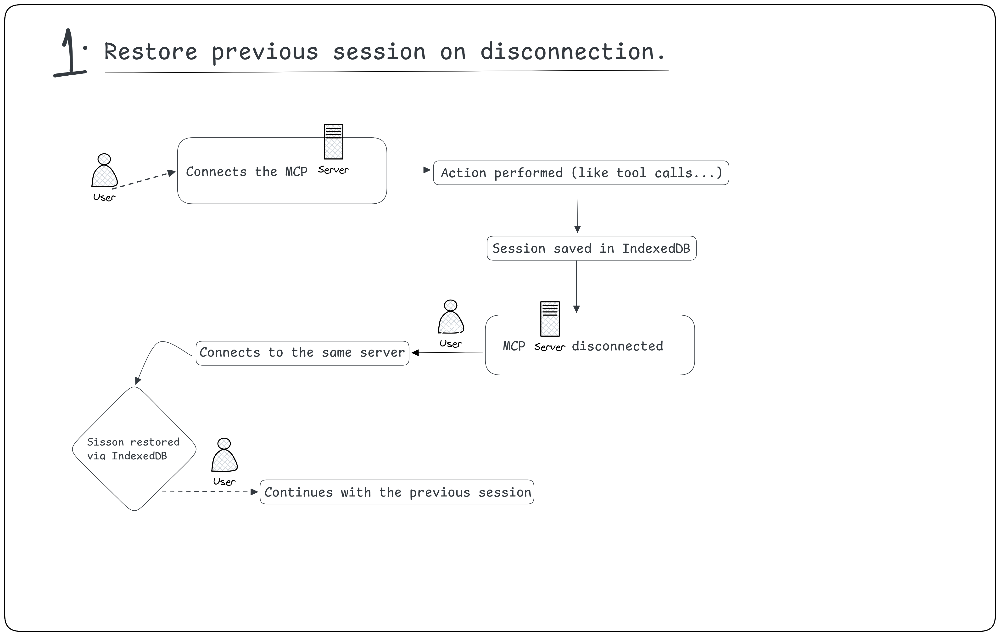
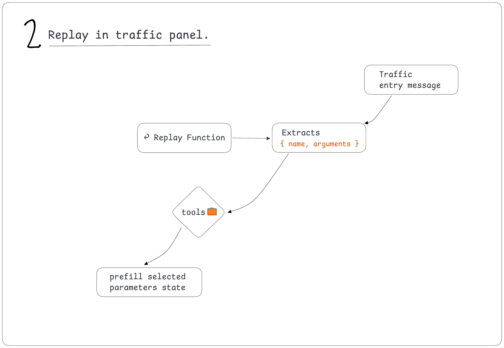
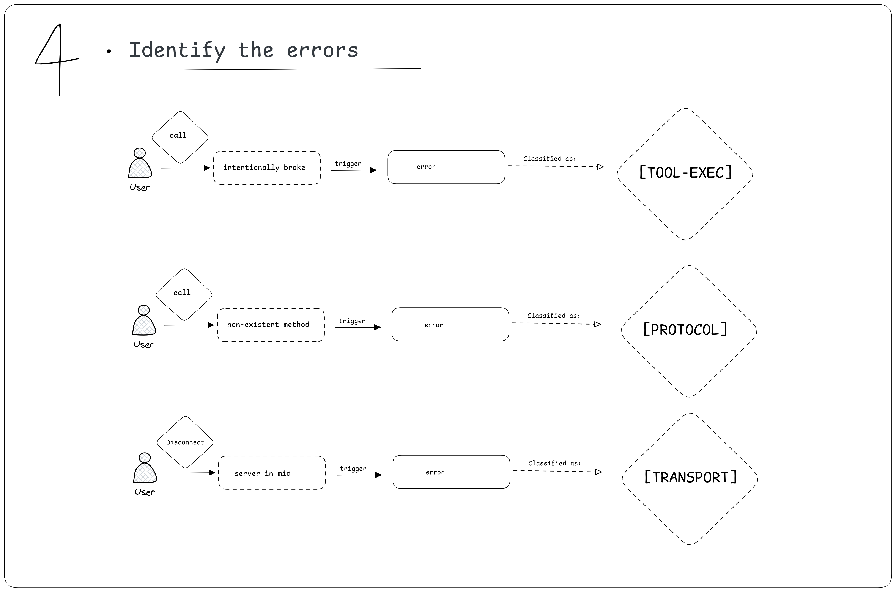
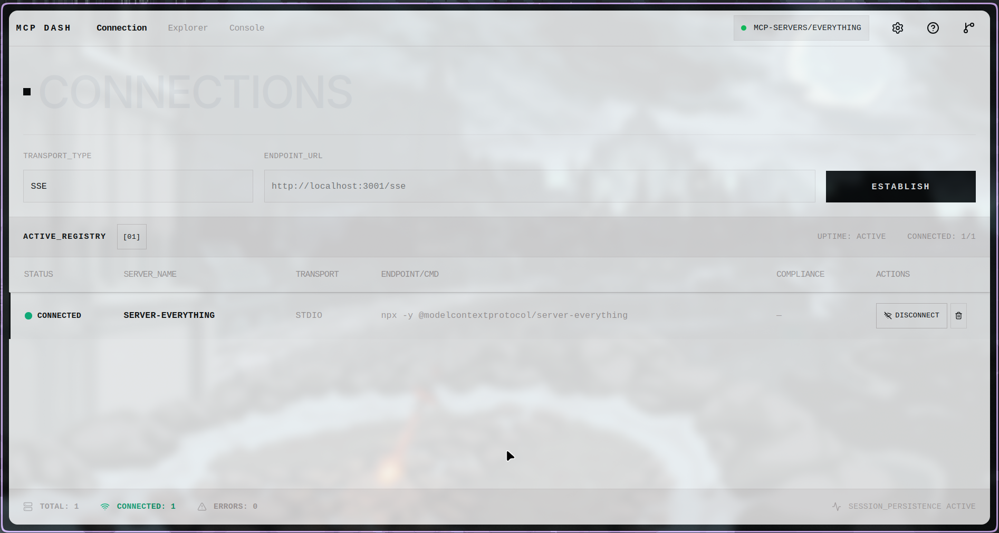
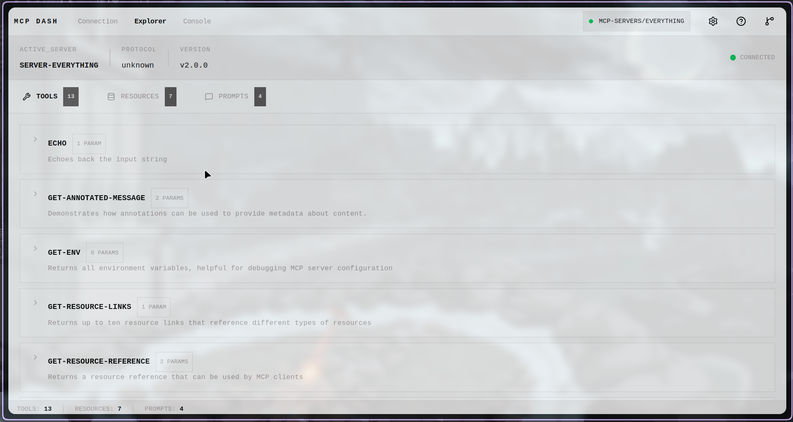

### About

1. Full Name - Gaurav Kumar
2. Contact info (public email) - gauravk16in@gmail.com
3. Discord handle in our server (mandatory) - @tendsgaurav
4. Home page (if any) - [https://gauravk.space](https://gauravk.space)
5. Blog (if any) - NA
6. GitHub profile link - [https://github.com/gauravk16in](https://github.com/gauravk16in)
7. Twitter, LinkedIn, other socials - [https://linkedin.com/in/tendsxgaurav](https://linkedin.com/in/tendsxgaurav)
8. Time zone - GMT +5:30, Asia/Kolkata
9. Link to a resume (PDF, publicly accessible via link and not behind any login-wall) - https://drive.google.com/file/d/1qe3h9zHNJquehfqGAZXAFbnvIgcZl0mq/view?usp=sharing

### University Info

1. University name - R.N.S Institute of Technology, Bangalore
2. Program you are enrolled in (Degree & Major/Minor) - B.E in Computer Science and Engineering
3. Year - 2nd Year
4. Expected graduation date - 2028

### Motivation & Past Experience

Short answers to the following questions (Add relevant links wherever you can):

1. Have you worked on or contributed to a FOSS project before? Can you attach repo links or relevant PRs?

Yes, I’ve contributed to API DASH, which is a FOSS project, and my contributions gave me familiarity with the project’s codebase.


2. What is your one project/achievement that you are most proud of? Why?

In my first year, I observed that when I have to go to the library, I have to ask some of my friends if it is open. Shall I come? Is any space left, or is it fully occupied? And then I go to the library and complete my work, but it wasn’t a permanent solution, and I don’t want to disturb her as she may be studying,g and many of my friends were facing this problem. Some of them come from their room to study and find the library is closed, and returning leads to wasting their time.  
Then, I made https://glimpseio.tech Glimpse - At the moment, IO - In/Out), where I can check if any particular place is open, closed, or at capacity before I actually visit.

Initially, I had a very simple approach-

- Design a QR code for each place.
- Stick on the gate of the particular place.
- When staff opens the door, the check-in by just scanning it and scanning again will be marked as closed.
- Update the capacity (limited to Cafeteria and Library), it counts the number of people present there, subtracts from total_capacity, and shows the live update with Firebase real-time database implementation.
- Later, I added a subscription for the most visited place. It analyzes the student’s check-in and check-out time for a particular place and notifies them when it opens or closes.
- And after a month, people started using GlimpseIO, and my Professor also appreciate me to solve a real problem that was being faced by many and offered me to integrate IOT and AI for better usability.  
   And this was my GlimpseIO story I am most proud of.

3. What kind of problems or challenges motivate you the most to solve them?

Mostly, I like to solve those problems that I start to face repetitively again and again. I try to fix it by iterating suitable approaches and researching on existent solution if any exist on the internet, and ask my friends if they faces too and if they have any solutions or suggestions.  
Right now, I'm working with an automatic smart BIN system that catches any garbage by sensing your hand gesture.  
I'm working on this project with my teammates, and we're trying to discover how we can make it helpful for lazy people, and also add humor (personality) to the BIN to make it playful.

4. Will you be working on GSoC full-time? In case not, what will you be studying or working on while working on the project?

Yes, I’ll be working full-time on GSoC so that I can align my project in the best possible way. However, my university semester exams are scheduled from June 29 to July 2025. During this period,d I will be limited to working for roughly 2-3 hours per day. I will discuss this as exam dates are subject to change.

5. Do you mind regularly syncing up with the project mentors?  
   Not at all, I will be active and happy to connect with my mentors to ask for any feedback or help I need throughout the project.
6. What interests you the most about API Dash?  
   What interests me most is their tendency to stay updated with the latest tech and approach new and most appropriate methods while solving a problem or introducing a new feature. API DASH combines API testing with modern protocol exploration. It helped me find those technical details I was previously unaware of, such as using MIME packages and possibilities of ASCII values in identifying an unknown/ binary file types, as well as debugging platform-specific issues.  
   It all started with my first issue #1021, it shaped my understanding of maintainers' standards, especially @animator.
7. Can you mention some areas where the project can be improved?  
   I think the following areas can improve API DASH and make it even more useful for developers.

- Adding a how-to-use guide, tips, or a sample collection would help beginners get comfortable with API DASH faster.
- Making the request history stronger and being able to compare previous API calls, responses, with timestamps side by side would actually make debugging much easier
- A more flexible previewer for unknown file types would make inspection better.
- Adding a console panel can be ga reat idea for live logging and debugging support.

8. Have you interacted with and helped the API Dash community? (GitHub/Discord links)
   
   
   

### Project Proposal Information

1. Proposal Title - MCP Dash: Building a Testing and Debugging Suite for Model Context Protocol

2. Abstract: A brief summary about the problem that you will be tackling & how.

MCP servers are getting more popular and even becoming the API layer of AI agents. Model Context Protocol is getting popular and being adopted by many companies in a very limited time, and it is becoming the API layer of AI agents. Currently, identifying bugs or testing tools sounds very difficult for a normal user and even a bit confusing for a developer. However, tools like MCP JAM are capable of providing a better user experience, but it focuses more on ChatGPT SDK and UI but still lack basic capabilities.  
While the official inspector tool is stateless and loses every connection and logs on each restart or refresh.  
Using IndexedDB to store the previous session data and reuse it in the next session

The History Panel needs to be redesigned and requires a lot of improvements. As of now, logs are not organized like how it should be; a developer can face this, especially when he or she is dealing with multiple-

- Requests and responses
- Notifications and Errors together.
- Making the panel more structured, configurable, and well-categorized can help understand the root cause and errors faster.
- Designing a replay button that can help them test previous tool calls without manually providing the argument will be going to save a lot of time in case of repetitive test cases.

Getting the raw and unexpected JSON-RPC message creates confusion among developers, and it consumes their time to find the actual problem.  
Beautifying the JSON and rendering a more readable output can fix this problem.  
eg. `"Too small: expected string to have >=1 characters" can be turned into something like this - "title" cannot be empty  `
`“regex mismatch at index 4” can be “email format is invalid”`

Errors are undifferentiated; they need to be classified.  
Setting a colorful tag with the error type can help determine the error faster.  
eg. [TRANSPORT], [PROTOCOL], [TOOL-EXEC]

3. Detailed Description

1. Restore the previous session on disconnection  
   localStorage keeps data only in useState, which gets cleared on every refresh, and developers need to repeat the tool call by giving the required arguments, and this leads to frustration.  
   Using IndexedDB can fix this problem by acting as a persistent, client-side database that can survive browser refresh.  
   Also, IndexedDB is asynchronous, it supports structured queries, and doesn't block rendering; localStorage prevents unexpected freezes.

- For each call, IndexedDB will store the full JSON RPC (req/response/notification) objects by a session ID and chronological call ID.
- The tool should automatically repopulate the UI forms using the latest arg on re-connection and also be able to restore the connection metadata (server address, status of connection ...) from the most recent session.
- eg, sessions store session metadata, calls store req/response pairs.

   
  
2. Improved Traffic/History Panel

- It captures all MCP message types -tools/call, resources/read, prompts/get.
- The purpose is to capture the logs with progress token (when tools/call has a progressToken, show a live progress bar in the tool panel that updates immediately as notifications arrive) and handle the situation better by parsing the MCP communication between client and server.
- It can be able to fetch the history of requests and responses between client and server in a better and structured form. It helps developers understand better what exactly went wrong, which field failed, and why.
- With an auto-incrementing cursor history, entries are stored in IndexedDB. On scrolling the entries, it fetches the entries in batches using cursor-based pagination and allows clearing the history manually.
- Adding a replay button can help in repeating the previous actions performed. One can replay any previous tools/calls by clicking on the replay button from the log history. No need to give the arguments again manually.

   3. Scenario Workflow  
   Design a scenario workflow to streamline the execution and validation of testing scenarios. It enables developers to trigger specific test suites using tool name selectors, or any other method, to monitor real-time execution results and systematically diagnose failures. It can work by integrating validation checks and environment variable verification.

- The UI should allow users to save scenarios, let them run step by step, watch the execution, and allow them to inspect failures with the exact log and clear message.

  

```typescript
type ScenarioResultExpectation = "success" | "error";

interface TestScenario {
  id: string;
  title: string;
  description: string;
  steps: TestStep[];
}

interface TestStep {
  label: string;
  tool: string;
  input: Record<string,unknown>;
  expect: ScenarioResultExpectation;
  notes?: string;
}

const scenario:TestScenario = {
  id: "check-filesys",
  title: "File Sys Check",
  description:
    "Runs a small sequence of tool calls to check whether listing and reading files are working as expected",
  steps: [
    {
      label: "List Available Files",
      tool: "lst_files",
      input: { path: "./" },
      expect: "success",
    },

    {
      label: "Read package.json",
      tool: "read_file",
      input: { path: "./package.json" },
      expect: "success",
    },
  ],
};
```

4. Identify and Categorize Every Error

Add a simple classification layer that categorizes each error to exactly one of three layers based on the JSON RPC error code & method context.  
The classification can be displayed with a colored tag next to each error entry in the traffic panel.  
eg.  
[TRANSPORT - connection timeout, WebSocket/SSE error before JSON-RPC parse],
[PROTOCOL - JSON-RPC error codes −32700 to −32600 parse/invalid request/method not found],  
[TOOL-EXEC- JSON-RPC error code −32000 / custom codes ]



5. Preflight validation

Submitting a tool call with a missing required field. It can be a string value below minLength, or a number above MAX  
gives an inline error under each field before any network requests are made.  
Before makeRequest is dispatched, the validator tries to run the user's input against the tool's inputSchema:

```typescript
function validateArgs(
  args: Record<string, unknown>,

  schema: JSONSchema,
): ValidationError[] {
  // e.g. { field: "title", message: '"title" cannot be empty', constraint: "minLength" } will be returned
}
```

4. Weekly Timeline: A week-wise timeline of activities that you would undertake.

- Starting with setting up the development environment and completing all the necessary toolchain configuration.
- Study the current MCP Inspector architecture and source to map extension points.
- Align the final feature scope with my mentor.
- Finalize about stretch deliverables (will update soon)

Week 1

- Understand and document the current request lifecycle, tool invocation flow, and history logging behavior in the inspector in detail.
- Identify exactly where I need to insert IndexedDB hooks.
- Share all details with my mentor before writing any new code.

Week 2

- Design and implement an IndexedDB persistence layer.
- Define its sessions and call schemas, and write the asynchronous helper function for reading and writing data.
- Adding bounded storage limits and introducing FIFO-based eviction for older entries.

Week 3

Implement session restore:

- Load the last used session on startup
- Repopulate tool forms with the last used arguments and restore the connection metadata.
- Then, adding a logic for schema changes in case of fallback or migration.

Week 4

- Review the codebase, responses, and finding and fixing bugs, updating documentation.
- Write test cases for already implemented features.
- Improving overall UX to date (if required).

Week 5

- Get in touch with the mentor and note down the feedback on current implementations.
- Fix any reviewed comments on the previous PR.
- Running and analyzing test cases.
- Working on the feedback received from my mentor.
- Check for platform-specific issues.

Week 6

Build the Traffic Panel includes-

- Group messages into a structured form
- Rendering formatted JSON
- timestamps, latency display, and
- Cursor-based pagination

Week 7

Add the Replay button for tools/call history entries. Wire stored arguments back to tool forms.  
Capable of handling any type of edge cases, like (tool no longer available, schema changed since the call was made, etc.).

Week 8

Implement live progress token handling. Parse progressToken from tools/call requests, listen for notifications/progress, and render a live progress bar in both the Tools and Traffic panels.

Week 9

Implement error classification. Write the classification function mapping JSON-RPC error codes and method context to [TRANSPORT], [PROTOCOL], [TOOL-EXEC]. Render as colored badges in the traffic panel.

Week 10

Design and implement the Scenario Workflow. Define Scenario and ScenarioStep interfaces, build the save/load UI, and implement step-by-step execution with RT status updates.

Week 11

Refine the scenario execution view with better result reporting, failure summaries, and step-by-step diagnostics. Improve usability, loading indicators, and how empty or error states are displayed across the UI.  
Write unit and integration tests for all required deliverables: persistence, restore, replay, validation, and error classification. Fix all bugs identified in mentor reviews.

Week 12

Final PR, usage documentation, demo video, and handoff notes for maintainer.

**Initial UI Mockup**






Demo Video of MCP DASH (Initial Version Prototype)- https://youtu.be/HfXrkBhgQmc
