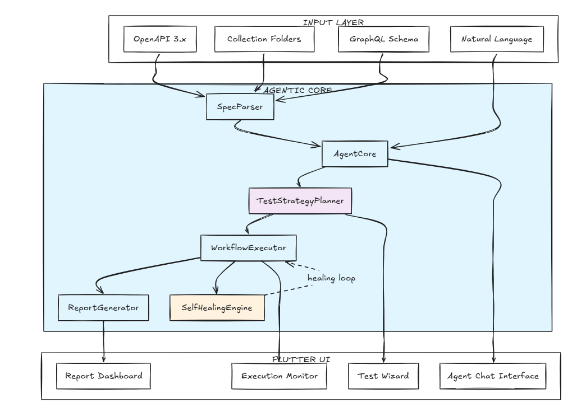
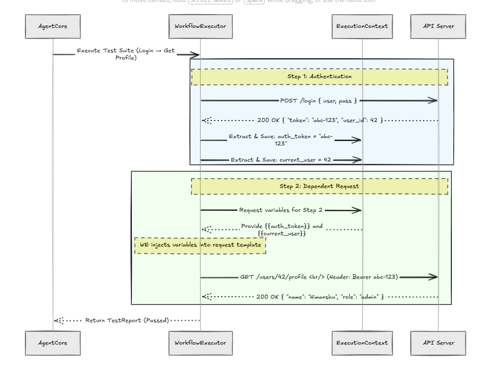
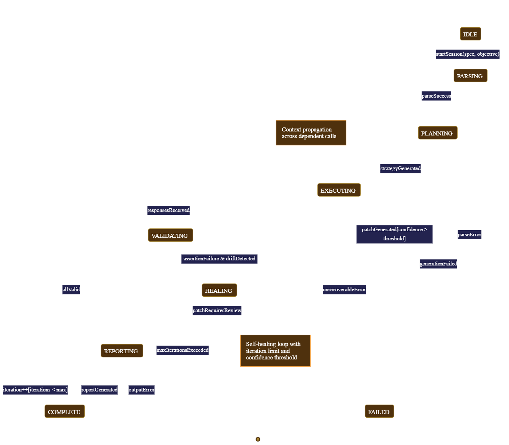
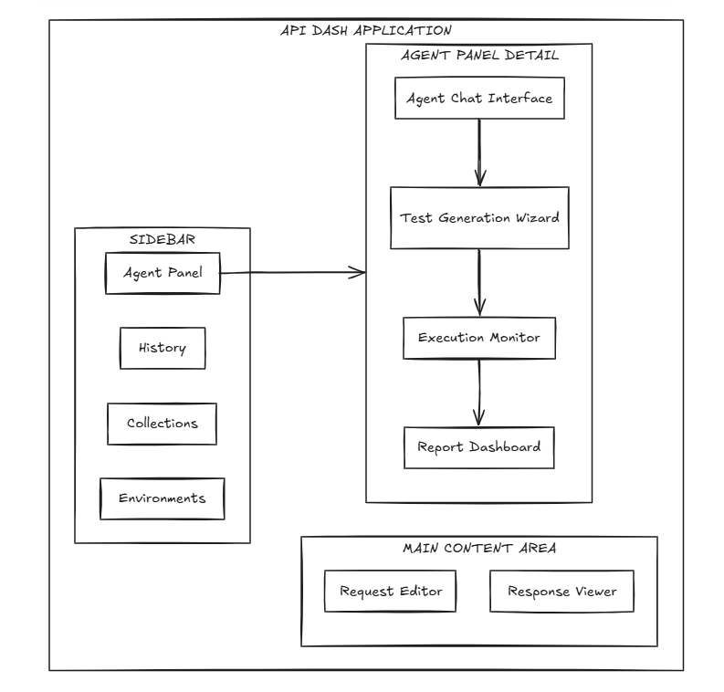
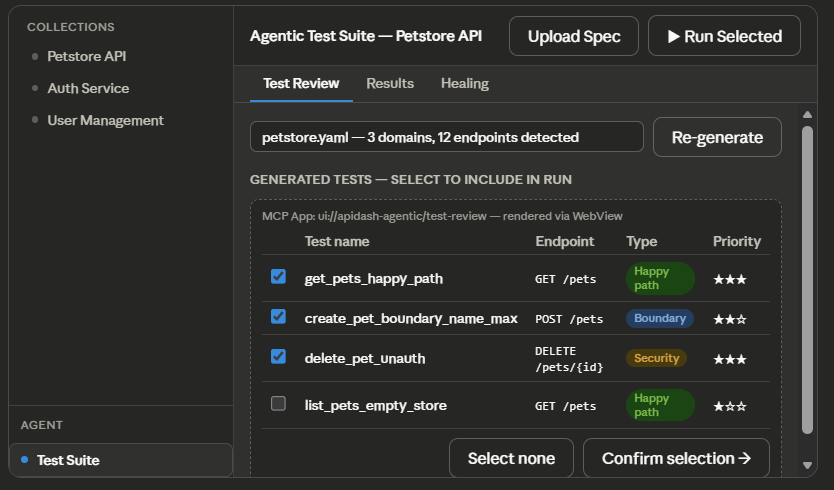
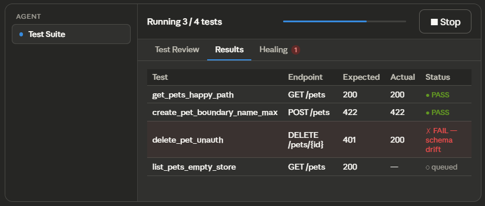
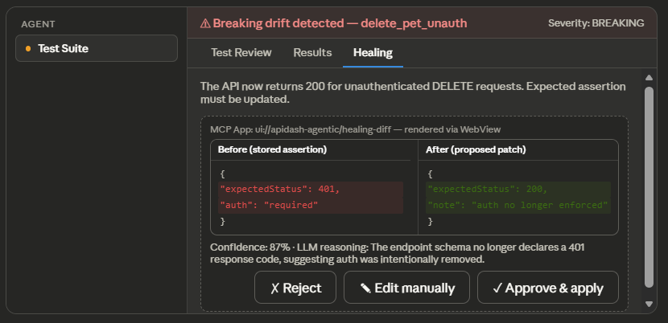

# GSoC 2026 — API Dash Application

---

## About

1. **Full Name:** Himanshu Ravindra Iwanati
2. **Contact Info (public email):** work.himanshu.r.v@gmail.com +91 8329614201
3. **Discord Handle:** hihry
4. **GitHub Profile:** https://github.com/hihry
5. **LinkedIn / Other Socials:** https://www.linkedin.com/in/himanshu-iwanati-87459b282/
6. **Time Zone:** IST (UTC+5:30)
7. **Resume:** https://drive.google.com/file/d/1dMRQg-MAmrrDbJS8tTwCQR0SbrujODSG/view?usp=sharing

---

## University Info

1. **University Name:** Indian Institute of Technology, Kharagpur
2. **Program:** B.Tech, Department of Electrical Engineering
3. **Year:** 3rd Year
4. **Expected Graduation Date:** May 2027

---

## Motivation & Past Experience

**1. Have you worked on or contributed to a FOSS project before? Can you attach repo links or relevant PRs?**

- Yes. I have contributed to multiple open-source projects:

  Yes. My open-source contributions span bug fixes, feature implementations, test coverage, and feature proposals — primarily within the **API Dash** repository (`foss42/apidash`) over the past month, alongside prior work on **MoveIt2**.

- **MoveIt2** ([moveit/moveit2](https://github.com/moveit/moveit2)) — Contributed [PR #3543](https://github.com/moveit/moveit2/pull/3543): improved Doxygen documentation for `composeMultiArrayMessage` in the `moveit_servo` module (`common.cpp` and its header), clarifying parameters, return value, and usage for controllers that accept `std_msgs::msg::Float64MultiArray` messages. Reviewed and approved by two maintainers (`@sea-bass`, `@nbbrooks`) and merged into `main` on November 27, 2025.

**2. What is your one project/achievement that you are most proud of? Why?**

- Built a multi-agent system using **LangGraph** and **Pinecone** that routes user queries
  to the appropriate API, retrieves relevant context via vector search (RAG), and grades
  the retrieved documents using a `binary_score` node. If the score falls below a set
  threshold, the system automatically falls back to **Tavily** for live web search —
  keeping responses grounded and reducing hallucination risk. The pipeline is served via
  **FastAPI**. The key engineering insight was that cost and accuracy in agentic systems
  are best managed through explicit verification steps in the graph, not just prompt tuning.

**3. What kind of problems or challenges motivate you the most to solve them?**

- I am just curious how the world would look like after 5 years of AI, becuase in the last two years itself there is massive growth in the AI itself, solving many complex problems but creates a major issue of security and threat for the users using AI. The problems that AI causes like hallucination, reducings costs and the one of the major issue that is security, are the major problems that motivates me a lot and I thrive on problems that require creative and efficient solutions.

**4. Will you be working on GSoC full-time? If not, what else will you be studying or working on?**

 - Yes, I will be working full-time on GSoC. Occasionally, I may have exams, course projects, or job/internship responsibilities, but they will not impact my commitment to GSoC.

**5. Do you mind regularly syncing up with the project mentors?**

- Not at all — I actively welcome it, can attend calls and dicuss the idea and implementation furthur.

**6. What interests you the most about API Dash?**

- API dash has clean UI, very modular repository structure and the codebase is remarkably easy to navigate. We as developers can actually trace a request from the UI layer to the network layer without getting lost in a forest of nested folders.

**7. Can you mention some areas where the project can be improved?**

- - **Request history and diffing:** API Dash lacks a persistent request history that lets
  users compare responses across multiple executions of the same endpoint. A lightweight
  diff view between two historical responses would be valuable for spotting unintended
  API behaviour changes during development.

**8. Have you interacted with and helped the API Dash community?**

- Yes. My engagement includes:
  Active participation in the API Dash GitHub repository through issue discussions and code review commentary.

**API Dash — Bug Fixes & Code Quality (Merged / Approved)**

| PR | Description | Status |
|---|---|---|
| [#1146](https://github.com/foss42/apidash/pull/1146) | Fix typo: `occured` → `occurred` in `intro_message.dart` | ✅ Approved |
| [#1160](https://github.com/foss42/apidash/pull/1160) | Add tooltip labels to all four navigation rail `IconButton`s | ✅ Approved |


**API Dash — Feature PRs (Technical, Under Review)**

| PR | Description | Significance |
|---|---|---|
| [#1356](https://github.com/foss42/apidash/pull/1356) | Extend Postman Collection models with auth, urlencoded body, and collection variables — fixing silent data loss in the v2.1 importer | 
| [#1171](https://github.com/foss42/apidash/pull/1171) | `test: Add unit tests for import/export IO parsers` (Postman, cURL, HAR, Insomnia) | Addresses a gap in test coverage for the importer subsystem |
| [#1134](https://github.com/foss42/apidash/pull/1134) / [#1130](https://github.com/foss42/apidash/pull/1130) | `feat: Auto-generate meaningful names for imported cURL and HAR requests` | UX improvement for the import workflow |

**API Dash — Feature Issues (Proposals)**

Beyond code, I have actively proposed improvements that align with the project's roadmap:

| Issue | Proposal |
|---|---|
| [#1330](https://github.com/foss42/apidash/issues/1330) | `[FEATURE]: Enhance Postman Collection Importer` — broader follow-up to PR #1356 |
| [#1202](https://github.com/foss42/apidash/issues/1202) | `[Feature]: Enable Streaming Responses in DashBot` — SSE/chunked transfer support for the AI assistant |
| [#1180](https://github.com/foss42/apidash/issues/1180) | `[Feat]: AI-powered smart request suggestions based on URL pattern` |
| [#1170](https://github.com/foss42/apidash/issues/1170) | `test: Add unit tests for import/export IO parsers` — issue tracking test gap before submitting PR #1171 |
| [#1135](https://github.com/foss42/apidash/issues/1135) | `feat: Multi-select requests with bulk delete` (labelled `priority: low`) |
| [#1129](https://github.com/foss42/apidash/issues/1129) | `[Feature]: Auto-generate meaningful names for imported requests (cURL & HAR)` |

---

## Project Details

### 1. Project Title

**Agentic API Testing for API Dash: An Autonomous, Self-Healing Test Generation Framework**

---

### 2. Abstract

Modern API development faces a critical bottleneck: manual test creation consumes 30–50% of developer time while producing brittle, unmaintainable test suites that fracture under the slightest schema evolution. Traditional approaches require developers to manually translate API specifications into executable tests, maintain hardcoded assertions, and continuously repair broken tests when APIs change — a process that scales linearly with API complexity and becomes unsustainable for microservices architectures with hundreds of interdependent endpionts.

This proposal introduces **Agentic API Testing**, a comprehensive AI-powered testing framework natively integrated into API Dash. The system leverages large language models (LLMs) with structured tool-calling capabilities to autonomously parse API specifications (OpenAPI 3.x, Postman Collections, GraphQL schemas), generate intelligent test strategies covering happy paths, edge cases, and security scenarios, execute multi-step workflows with dynamic context propagation, and **self-heal** when APIs evolve — automatically detecting schema drift and updating assertions without human intervention. The framework is further enhanced by **MCP Apps integration**, which provides rich bidirectional UI components (interactive test approval tables, visual diff reviewers) at critical human-in-the-loop decision points inside API Dash's existing DashBot interface.

---

### 3. Detailed Description

#### 3.1 Problem Statement

#### 3.1.1 Schema Drift in Production APIs

**Scenario**: E-commerce platform "ShopFlow" releases API v2.3, changing `order.total` from `number` to `object` with `currency` and `amount` fields. Existing integration tests assert `typeof response.total === 'number'`, causing **100% test suite failure** despite API correctness. Developers spend **8 hours** diagnosing the intentional change. Meanwhile, production monitoring lacks coverage for the new structure, causing **incorrect international charges** before detection.

**Agentic Prevention**: The self-healing engine detects the type migration during canary deployment, generates updated assertions for the new structure, flags the semantic change in `currency` default for human review, and maintains **continuous coverage** without CI breakage.

#### 3.1.2 Broken Authentication Flows in Multi-Step Workflows

**Scenario**: Fintech "PaySecure" implements OAuth 2.0 with PKCE for mobile clients. A **manual test suite** validates each step independently but never exercises the **full chain**: refresh → immediate API call with new token → verify no 401. When the token endpoint begins returning `expires_in` as string `"3600"` rather than number `3600`, the mobile client's parsing fails. **Production users experience random logouts**; **2-star app rating crash**.

**Agentic Prevention**: The workflow executor maintains **execution context** across steps, validating that `access_token` successfully authenticates subsequent requests. Schema validation on the token response catches the type discrepancy.

#### 3.1.3 Undetected Rate Limiting Edge Cases

**Scenario**: SaaS "DataStream" implements tiered rate limits: 100 req/min for free, 1000 req/min for pro. Manual tests verify limits at **steady-state** but miss **burst behavior**: the pro tier's 1000 req/min is enforced as a **100 req/6sec sliding window**, causing **unexpected 429 responses** for legitimate burst patterns. Support spends **40 hours** reproducing before engineering identifies the window implementation. **3 enterprise trials churn** due to reliability concerns.

**Agentic Prevention**: The test strategy planner generates **edge case scenarios** including burst patterns, sliding window verification, and backoff behavior.

---

#### 3.2 Proposed Solution

##### 3.2.1 High-Level System Architecture

The system is composed of six coordinated components:

| Component | Responsibility |
|---|---|
| `AgentCore` | Central orchestrator; session management, state machine enforcement, workflow decomposition |
| `SpecParser` | Normalises OpenAPI 3.x, Postman v2.1, GraphQL, and API Blueprint into a unified `AgentTask` graph |
| `TestStrategyPlanner` | LLM-powered planner generating test strategies across happy path, boundary value, security, and rate-limit scenarios |
| `WorkflowExecutor` | Multi-step API call chain executor with context persistence, dynamic variable substitution, and parallel execution via Dart isolates |
| `SelfHealingEngine` | Detects schema drift, classifies severity, auto-patches compatible changes, and escalates breaking changes for human review |
| `ReportGenerator` | Produces JSON, HTML, and Markdown reports for CI/CD and documentation integration |

##### 3.2.2 System Architecture Overview



The Agentic API Testing system transforms **static API specifications into dynamic, intelligent test suites** through a multi-stage pipeline. Upon specification ingestion, the **SpecParser** normalizes diverse formats into a unified **AgentTask graph**—a directed acyclic graph representing API operations, their dependencies, and data flows, **AgentTask** remember this term as this is an acyclic graph of dependecy endpoints for example lets say to access a website you need to provide auth which is a particular endpoint then and only you would be able to access your account details, a dependency is created between endpoints and in a large Yaml file it might consist of 100 such endpoints creating a acyclic graph.

The **TestStrategyPlanner** then operates on this graph(AgentTask) as a planning problem. Using an LLM with tool-calling capabilities, it generates **test strategies** for each operation considering: happy path validation, boundary value analysis, equivalence class partitioning, error injection, security testing, and performance baseline establishment.

Each strategy is instantiated into **concrete test cases** with generated test data, expected response assertions, and dependency specifications. The result is a **comprehensive, prioritized test suite** that maximizes coverage within execution time constraints.

##### 3.2.3 Data Flow Directionality

Data flows **unidirectionally** from specification to report, with **feedbackloops** for healing and user interaction:

| Flow | Data | Purpose |
|---|---|---|
| Input → SpecParser | Raw JSON/YAML spec files | Normalisation and validation |
| SpecParser → AgentCore | `AgentTask` graph | Structured workflow representation |
| AgentCore → TestStrategyPlanner | Task metadata + user intent | Test strategy generation |
| TestStrategyPlanner → WorkflowExecutor | `APITestCase` instances | Executable test definitions |
| WorkflowExecutor → SelfHealingEngine | Response snapshots + failures | Drift detection input |
| SelfHealingEngine → WorkflowExecutor | Updated assertions + paths | Remediation output |
| WorkflowExecutor → ReportGenerator | Execution traces + results | Structured reporting |
| AgentCore ↔ UI | State updates + user commands | Interactive control |

---

#### 3.3 Core Component Specifications

#### 3.3.1 AgentCore: Orchestration and Workflow Decomposition

The `AgentCore` serves as the **central nervous system**, coordinating all other components. Its responsibilities include:

- **Session management**: Maintaining user context across multiple test generation and execution requests
- **Workflow decomposition**: Breaking complex natural language objectives into discrete, ordered tasks with dependency analysis
- **State machine enforcement**: Ensuring valid transitions between IDLE, PARSING, PLANNING, EXECUTING, VALIDATING, REPORTING, and HEALING states
- **Resource scheduling**: Prioritizing test execution based on risk, coverage gaps, and user-specified urgency
- **Error aggregation**: Collecting and categorizing failures across components for unified reporting

The core implements `event-driven architecture` using Dart’s Stream API, enabling reactive UI updates and parallel processing without blocking.

```dart
// lib/features/agentic/providers/agent_core_provider.dart

import 'package:riverpod_annotation/riverpod_annotation.dart';

part 'agent_core_provider.g.dart';

enum AgentPhase { idle, parsing, planning, executing, healing, failed }

class AgentCoreState {
  const AgentCoreState({
    this.phase = AgentPhase.idle,
    this.currentTask,
    this.generatedTests = const [],
    this.results = const [],
    this.pendingDrift,
    this.errorMessage,
  });

  final AgentPhase phase;
  final AgentTask? currentTask;
  final List<APITestCase> generatedTests;
  final List<TestResult> results;
  final SchemaDrift? pendingDrift;
  final String? errorMessage;

  AgentCoreState copyWith({
    AgentPhase? phase,
    AgentTask? currentTask,
    List<APITestCase>? generatedTests,
    List<TestResult>? results,
    SchemaDrift? pendingDrift,
    String? errorMessage,
  }) => AgentCoreState(
    phase: phase ?? this.phase,
    currentTask: currentTask ?? this.currentTask,
    generatedTests: generatedTests ?? this.generatedTests,
    results: results ?? this.results,
    pendingDrift: pendingDrift ?? this.pendingDrift,
    errorMessage: errorMessage ?? this.errorMessage,
  );
}

@riverpod
class AgentCore extends _$AgentCore {
  // Uses API Dash's existing Riverpod architecture — consistent with
  // lib/providers/collection_providers.dart pattern.
  @override
  AgentCoreState build() => const AgentCoreState();

  static const _validTransitions = <AgentPhase, Set<AgentPhase>>{
    AgentPhase.idle:      {AgentPhase.parsing},
    AgentPhase.parsing:   {AgentPhase.planning, AgentPhase.failed},
    AgentPhase.planning:  {AgentPhase.executing, AgentPhase.failed},
    AgentPhase.executing: {AgentPhase.healing, AgentPhase.failed},
    AgentPhase.healing:   {AgentPhase.executing, AgentPhase.failed},
    AgentPhase.failed:    {AgentPhase.idle},
  };

  void _transitionTo(AgentPhase next) {
    assert(_validTransitions[state.phase]?.contains(next) ?? false,
      'Invalid transition: ${state.phase} → $next');
    state = state.copyWith(phase: next);
  }

  Future<void> submitSpec(String specPath) async {
    _transitionTo(AgentPhase.parsing);
    // SpecParser → AgentTaskGraph → TestStrategyPlanner
  }

  Future<void> runApprovedTests(List<APITestCase> approved) async {
    _transitionTo(AgentPhase.executing);
    state = state.copyWith(generatedTests: approved);
    // WorkflowExecutor → SelfHealingEngine
  }

  void applyHealingPatch(SchemaDrift drift) {
    // Called from healing-diff MCP App via ui/message approval
    _transitionTo(AgentPhase.executing);
    state = state.copyWith(pendingDrift: null);
  }
}
```

#### 3.3.2 SpecParser: Multi-Format Schema Ingestion

The SpecParser abstracts **format heterogeneity** behind a unified interface, supporting:

| Format | Version | Features | Complexity |
|---|---|---|---|
| OpenAPI | 3.0.x, 3.1.x | Full schema, links, callbacks, webhooks | High |
|  Collection folders | v2.1 | Variables, scripts, auth, folders | Medium |
| GraphQL | Introspection | Queries, mutations, subscriptions, fragments | High |
| API Blueprint | 1A | Legacy support for migration scenarios | Low |

Parsing proceeds in three stages:

1. **Syntactic validation** — checks the spec against its format schema (OpenAPI / Postman / GraphQL)
2. **Semantic normalisation** — converts the validated spec into an `AgentTask` graph
3. **Relationship enrichment** — infers dependencies between endpoints (e.g. `POST /users` creates a resource later fetched by `GET /users/{id}`); LLM-assisted for complex cases

```dart
// lib/agents/nodes/spec_parser.dart

/// Abstract interface — each format implements parse() and canParse().
/// canParse() returns a 0.0–1.0 confidence score used for auto-detection.
abstract class SpecParser {
  Future<AgentTaskGraph> parse(SpecSource source);
  double canParse(SpecSource source);
}

/// Auto-selects the highest-confidence parser above [threshold].
/// No manual format hint needed — format is inferred from content heuristics.
class SpecParserResolver {
  SpecParserResolver({this.threshold = 0.7});

  final double threshold;
  final List<SpecParser> _parsers = [
    OpenApiParser(validator: JsonSchemaValidator()),
    PostmanParser(),
    GraphQlParser(),
  ];

  Future<AgentTaskGraph> resolve(SpecSource source) {
    final best = _parsers
        .map((p) => (parser: p, score: p.canParse(source)))
        .where((e) => e.score >= threshold)
        .reduce((a, b) => a.score >= b.score ? a : b);
    return best.parser.parse(source);
  }
}

/// OpenAPI 3.x — validates via JsonSchemaValidator before extracting AgentTasks.
/// Throws [UnsupportedVersionException] for non-3.x specs.
class OpenApiParser implements SpecParser {
  const OpenApiParser({required this.validator});
  final JsonSchemaValidator validator;

  @override
  double canParse(SpecSource source) =>
      source.content.contains('openapi:') ? 0.95 : 0.0;

  @override
  Future<AgentTaskGraph> parse(SpecSource source) async {
    // validate → version guard → extract paths → resolve $ref → build AgentTaskGraph
  }
}

/// Postman Collection v2.1 — handles auth schemes, {{variables}}, folder nesting.
class PostmanParser implements SpecParser {
  @override
  double canParse(SpecSource source) =>
      source.content.contains('collection') ? 0.90 : 0.0;

  @override
  Future<AgentTaskGraph> parse(SpecSource source) async {
    // extract items → resolve {{variables}} → map auth to securityRequirements
  }
}

/// GraphQL introspection — extracts queries, mutations, subscriptions, type system.
class GraphQlParser implements SpecParser {
  @override
  double canParse(SpecSource source) =>
      source.content.contains('__schema') ? 0.90 : 0.0;

  @override
  Future<AgentTaskGraph> parse(SpecSource source) async {
    // parse type system → extract operations → infer field-level dependencies
  }
}
```

#### 3.3.3 TestStrategyPlanner: LLM-Powered Test Strategy Generation

The `TestStrategyPlanner` transforms a parsed spec into a test suite through three steps:

1. **Coverage analysis** — identifies untested paths, parameter combinations, and undocumented response codes
2. **Risk prioritisation** — weights tests by business criticality, security sensitivity, and historical failure rate
3. **Strategy selection** — picks the appropriate test type per endpoint (happy path, boundary value, security probe, etc.)

| Test Type | Trigger | LLM Prompt Focus |
|---|---|---|
| Happy path | All endpoints | Verify nominal behavior with valid inputs |
| Boundary value | Numeric/string parameters | Test min, max, and edge values |
| Error injection | Error-prone operations | Verify graceful failure handling |
| Security probe | Auth-required endpoints | Test authentication bypass, injection, traversal |
| Rate limit | Documented limits | Verify throttling behavior and headers |
| Schema validation | All responses | Validate against specification with strictness tiers |

Planner output is generated via **structured tool-calling APIs**, producing type-safe, parseable
`APITestCase` definitions — no fragile regex extraction.

```dart
// lib/agents/nodes/strategy_planner.dart

/// Generates test strategies using LLM reasoning with structured tool-calling output.
/// Falls back to rule-based generation if LLM output fails validation.
class TestStrategyPlanner {
  TestStrategyPlanner({
    required LlmClient llmClient,
    required PromptTemplateLibrary templates,
    required OutputValidator validator,
    required Logger logger,
  });

  /// Generates prioritised test strategies for all tasks in [taskGraph].
  /// Low temperature (0.2) keeps LLM output deterministic and parseable.
  Future<List<TestStrategy>> generateStrategies({
    required AgentTaskGraph taskGraph,
    UserIntent? intent,
  }) async {
    final List<TestStrategy> strategies = [];

    for (final task in taskGraph.tasks) {
      final prompt = _templates.forTask(task: task, intent: intent);

      // LLM call via tool-calling API → structured JSON, no regex extraction
      final response = await _llmClient.complete(
        prompt: prompt,
        tools: [_testStrategyTool],
        temperature: 0.2,
      );

      final structured =
          response.toolCalls?.first.arguments ?? _fallbackParse(response.text);

      // Validate output against task spec — retry or rule-generate on failure
      final validation = _validator.validate(structured, against: task);
      if (!validation.isValid) {
        _logger.warning('LLM output invalid: ${validation.errors}');
        // TODO: retry with stricter prompt; fall back to rule-based on second failure
        continue;
      }

      strategies.add(TestStrategy.fromJson(structured));
    }

    // Risk prioritisation: business criticality + security sensitivity + failure rate
    return _prioritizeAndDeduplicate(strategies);
  }

  /// Structured tool schema passed to the LLM — enforces type-safe output.
  /// Each test case carries: name, type, parameters, assertions, and dependencies.
  /// Each assertion carries: JSON path target, operator, expected value, severity.
  /// Risk assessment scores: business_criticality, security_sensitivity, failure_rate.
  static final _testStrategyTool = LlmTool(
    name: 'generate_test_strategy',
    // ... full JSON schema definition
  );

  List<TestStrategy> _prioritizeAndDeduplicate(List<TestStrategy> strategies) {
    // Sort by composite risk score: business_criticality * 0.5 + security_sensitivity * 0.3
    // + failure_rate * 0.2. Remove strategies with identical (method, path, type) tuples,
    // keeping the highest-scoring instance.
    final seen = <String>{};
    return strategies
      ..sort((a, b) => b.riskScore.compareTo(a.riskScore))
      ..where((s) => seen.add('${s.method}:${s.path}:${s.type}')).toList();
  }

  Map<String, dynamic>? _fallbackParse(String? text) {
    // Last-resort extraction when tool-calling fails and raw text is returned.
    // Attempts JSON extraction from markdown code fences; returns null if unparseable.
    if (text == null) return null;
    final match = RegExp(r'```(?:json)?\s*(\{[\s\S]*?\})\s*```').firstMatch(text);
    if (match != null) {
      try { return jsonDecode(match.group(1)!) as Map<String, dynamic>; }
      catch (_) { return null; }
    }
    return null;
  }
}
```

### 3.3.4 WorkflowExecutor: The Runtime Engine

The `WorkflowExecutor` is the system's "doer." While the planner decides *what* to test, the executor actually runs the network calls. Because modern APIs are messy, stateful, and sometimes unreliable, the executor is built to handle real-world conditions gracefully through four main features:

#### 1. Shared Memory & State Tracking (`ExecutionContext`)
APIs rarely work in isolation; they are usually chained together. The executor acts as the system's short-term memory during a test run. If Step 1 is a login request that returns an authentication token, the `ExecutionContext` remembers that token and automatically securely attaches it to Step 2 and Step 3. It uses path extractors (like JSONPath) to grab exactly the data it needs from a response to use later.

#### 2. Dynamic Variable Injection
Hardcoded tests are brittle. To fix this, the executor acts like a template engine. Before it fires off a network request, it scans the payload for variables and swaps them out for real data:
* **Chaining:** Tags like `{{step1.response.body.id}}` allow a downstream request to use an ID generated by an upstream request.
* **Environments:** Tags like `{{env.BASE_URL}}` mean the exact same test suite can be run against `localhost` and `production` without changing any code.
* **Mock Data:** Tags like `{{random.email}}` generate fresh, collision-free data on the fly so tests don't fail due to database constraints (like "email already exists").

#### 3. Smooth UI & Background Processing (Dart Isolates)
Because API Dash is a Flutter app, running hundreds of tests could easily freeze the UI. The executor prevents this by splitting the workload:
* Lightweight network waiting (I/O) is handled asynchronously by Dart's standard event loop.
* Heavy computational lifting—like parsing a 5MB JSON response or running complex schema comparisons—is pushed to background threads (**Dart Isolates**). This guarantees the API Dash interface stays smooth and responsive, even during massive test runs.

#### 4. Handling Flaky Networks Gracefully
Real networks drop packets, and staging servers get overloaded. Instead of failing an entire 50-step test suite because of a 1-second timeout, the executor is forgiving:
* **Smart Retries:** It uses "exponential backoff," meaning if a request fails, it waits 1 second, then 2, then 4, before giving up.
* **Circuit Breaking:** If an API endpoint goes completely offline and starts throwing 500 errors, the executor stops hammering it to prevent log flooding and immediately flags the failure. 

The following sequence demonstrates how the executor manages state and dynamic variables across a multi-step integration test:



```dart
class WorkflowExecutor {
  WorkflowExecutor({required this.httpUtils});
  final HttpUtils httpUtils; // from packages/apidash_core/lib/utils/http_utils.dart

  /// Executes [suite] with optional parallel batching.
  /// Context (auth tokens, extracted IDs) is propagated across steps via [ExecutionContext].
  Future<List<TestResult>> executeSuite(
    List<APITestCase> suite, {
    bool parallel = false,
    int maxConcurrency = 5,
  }) async {
    final context = ExecutionContext();

    if (parallel) {
      // Partition into dependency-ordered batches; run each batch concurrently.
      final batches = _dependencyBatches(suite);
      final results = <TestResult>[];
      for (final batch in batches) {
        final batchResults = await Future.wait(
          batch.map((tc) => _executeOne(tc, context)),
        );
        results.addAll(batchResults);
        // Propagate extracted values before next batch
        for (final r in batchResults) context.absorb(r.extractions);
      }
      return results;
    }

    // Sequential path — maintains strict ordering for dependent chains
    final results = <TestResult>[];
    for (final tc in suite) {
      final result = await _executeOne(tc, context);
      context.absorb(result.extractions);
      results.add(result);
    }
    return results;
  }

  Future<TestResult> _executeOne(APITestCase tc, ExecutionContext ctx) async {
    // Resolve {{variable}} templates before building the request
    final resolved = tc.resolveTemplates(ctx);
    final model = resolved.toHttpRequestModel(); // maps to existing RequestModel pattern

    final (response, _, _) = await sendHttpRequest(model); // apidash_core utility
    final passed = _evaluate(response, resolved.assertions);
    final extractions = _extract(response, resolved.extractRules);

    return TestResult(
      testCase: tc,
      response: response,
      passed: passed,
      extractions: extractions,
      isSchemaMismatch: !passed && _looksLikeSchemaDrift(response, resolved),
    );
  }

  bool _looksLikeSchemaDrift(HttpResponseModel response, APITestCase tc) {
    // Schema drift = status code matches but body schema doesn't.
    // Network errors and 5xx are not drift — they're infrastructure failures.
    return response.statusCode == tc.expectedStatus &&
        !_bodyMatchesSchema(response.body, tc.expectedSchema);
  }
}

```

#### 3.3.5 SelfHealingEngine: Schema Drift Detection and Auto-Remediation

The `SelfHealingEngine` implements continuous specification alignment through three detection mechanisms:

- **Structural diff** — compares actual response schemas against expected schemas from the spec or historical snapshots
- **Semantic drift** — identifies changes in field meanings (e.g. `status: "active"` → `status: 1`) through value distribution analysis
- **Behavioral change** — detects modified error codes, header additions, or performance degradation


| Drift Severity | Automated Action | Human Notification |
|---|---|---|
| Cosmetic (whitespace, ordering) | Silent acceptance | None |
| Compatible (new optional fields) | Test update | Summary digest |
| Breaking (required changes) | Proposed patch | Immediate alert with diff |
| Architectural (endpoint removal) | Suite restructuring | Blocking review required |

Healing generates **confidence scores** based on change type, test coverage, and historical accuracy,
routing low-confidence cases to human review regardless of severity.

```dart

/// Detects schema drift from test failures and generates healing patches.
/// Patches are auto-applied, flagged for review, or escalated based on confidence score.
class SelfHealingEngine {
  SelfHealingEngine({
    required SchemaDiffer schemaDiffer,
    required PatchGenerator patchGenerator,
    required ConfidenceScorer confidenceScorer,
    required LlmClient llmClient,
  });

  // Confidence thresholds — tune based on acceptable automation risk
  static const _autoApplyThreshold = 0.85;
  static const _reviewThreshold = 0.60;

  /// Analyses failures, generates patches, and classifies each by confidence score.
  Future<List<HealingPatch>> generatePatches(
    List<TestResult> failures, {
    required ExecutionContext context,
  }) async {
    final List<HealingPatch> patches = [];

    for (final failure in failures) {
      if (!failure.isSchemaMismatch) continue;

      // Diff expected schema vs actual response schema → classifies drift severity
      final drift = await _schemaDiffer.analyze(
        expected: failure.expectedSchema,
        actual: failure.actualResponse.schema,
      );

      final patch = await _patchGenerator.generate(
        drift: drift,
        originalTest: failure.testCase,
      );

      final confidence = _confidenceScorer.score(patch);

      if (confidence >= _autoApplyThreshold) {
        patches.add(patch.copyWith(autoApply: true));
      } else if (confidence >= _reviewThreshold) {
        // Surfaces in healing-diff MCP App for human approve / reject / edit
        patches.add(patch.copyWith(requiresReview: true));
      }
      // Below reviewThreshold → escalate to human, no patch emitted
    }

    return patches;
  }
}
```

#### 3.3.6 ReportGenerator: Multi-Format Output

- **JSON**: Machine-parseable for CI/CD integration, with detailed execution traces and timing
- **HTML**: Rich visualization with collapsible request/response details, coverage heatmaps, and trend comparison
- **Markdown**: Repository-friendly for documentation, PR descriptions, and issue comments

```dart
// lib/agents/nodes/report_generator.dart

enum ReportFormat { json, html, markdown }

/// Generates test reports in multiple output formats.
/// JSON for CI/CD pipelines, HTML for visual review, Markdown for documentation.
class ReportGenerator {
  ReportGenerator({
    required JsonFormatter jsonFormatter,
    required HtmlFormatter htmlFormatter,
    required MarkdownFormatter markdownFormatter,
  });

  Future<String> generate(
    List<TestResult> results, {
    required ReportFormat format,
    ReportOptions? options,
    List<String> errors = const [],
  }) async {
    final report = TestReport.fromResults(results, errors: errors);

    return switch (format) {
      ReportFormat.json     => _jsonFormatter.format(report, options),
      ReportFormat.html     => _htmlFormatter.format(report, options),
      ReportFormat.markdown => _markdownFormatter.format(report, options),
    };
  }

  /// Partial report — emitted when executeSuite fails mid-run.
  /// Preserves all results collected before the failure for debugging.
  Future<String> generatePartial(
    List<TestResult> results, {
    List<String> errors = const [],
  }) =>
      generate(results, format: ReportFormat.json, errors: errors);
}
```
## 4. Technical Implementation Details

### 4.1 Agent Workflow State Machine



#### 4.1.1 State Transition Table

| Transition | Condition | Action |
|---|---|---|
| IDLE → PARSING | User submits specification | Initialize parser, validate format hint |
| PARSING → PLANNING | Parser returns valid AgentTaskGraph | Load templates, initialize LLM client |
| PARSING → FAILED | ParseException or timeout | Log error, notify user with diagnostics |
| PLANNING → EXECUTING | Non-empty strategy generated | Initialize execution context, queue tests |
| EXECUTING → HEALING | Schema mismatch detected with drift pattern | Pause execution, invoke healing analysis |
| HEALING → EXECUTING | Patch validated with confidence ≥ threshold | Apply patch, resume from failed test |
| HEALING → FAILED | Max iterations (default: 3) exceeded | Escalate to human with full context |
| Any → FAILED | Unhandled exception or cancellation | Cleanup resources, preserve partial state |

### 4.2 Error Handling and Fallback Strategies

#### 4.2.1 LLM Output Validation and Retry Logic

| Failure Mode | Detection | Retry Strategy | Escalation |
|---|---|---|---|
| Invalid JSON | ParseException | Retry with stricter temperature (0.0) | After 3 retries: use JSON mode fallback |
| Missing required fields | Schema validation failure | Retry with explicit field enumeration | After 2 retries: rule-based generation |
| Hallucinated endpoints | Unknown taskId references | Cross-reference with input graph | After 2 retries: filter invalid, continue |
| LLM API failure | Timeout, rate limit, 5xx | Exponential backoff with provider switch | After all providers fail: offline mode |

#### 4.2.2 Error Handling and Graceful Degradation

When LLM output is invalid or the provider is unavailable, the system does not fail
entirely — instead it applies a **confidence-gated hybrid fallback** strategy:

- **Partial output salvage** — valid test cases from a partial LLM response are preserved;
  rule-based generation fills only the missing or unparseable cases, avoiding a full
  regeneration cycle.
- **Rule-based baseline** — covers required field presence, type-based boundary values,
  status code enumeration, and security scheme validation, ensuring minimum test coverage
  is always produced regardless of LLM availability.

LLM failures follow a provider fallback chain — **Primary → Secondary → Local Ollama** —
with a configurable retry threshold (default: 3 attempts) and exponential backoff between
retries. Ollama ensures the pipeline remains functional even in fully offline environments.

Caching is applied at the **per-endpoint level** using a SHA index over individual
operation signatures — so a single endpoint change invalidates only that endpoint's
cached output rather than the entire spec, keeping redundant API calls minimal.

### 4.3 Advanced Context Window & Token Optimization

#### 4.3.1 The Challenge: The "Spec Bloat" Problem
Large-scale production APIs (e.g., Stripe, Kubernetes, or internal enterprise microservices) often have OpenAPI specifications exceeding 50,000–100,000 tokens. 
- **Cost & Latency:** Passing the entire specification in every LLM call is financially expensive and slow.
- **Lost in the Middle:** LLMs suffer from "Long Context Recall" issues, where critical details in the middle of a massive prompt are ignored or hallucinated.
- **Redundancy:** Re-sending a 1MB YAML file because a single description string changed is computationally wasteful.

#### 4.3.2 Solution: Multi-Tiered Optimization Strategy

To ensure API Dash remains performant and cost-effective, the `SpecParser` and `AgentCore` implement a three-tiered optimization pipeline:

| Technique | Level | Logic |
| :--- | :--- | :--- |
| **Domain-Aware Batching** | Basic | Groups endpoints by root path (e.g., `/users/**`). |
| **Dependency-Graph Partitioning** | Advanced | Groups endpoints by **Resource Lifecycle** (Producer-Consumer flow). |
| **Semantic Hashing** | Efficiency | Prevents re-generation unless the *functional* schema changes. |

#### 4.3.3 Optimization 1: Dependency-Graph Partitioning
Instead of simple URL-based grouping, the system treats the API as a **Directed Acyclic Graph (DAG)**. 

1. **Extraction:** The `SpecParser` identifies "Producer" endpoints (e.g., `POST /orders` returns an `order_id`) and "Consumer" endpoints (e.g., `GET /shipping/{id}`).
2. **Community Detection:** We apply a simplified clustering algorithm to find "islands" of highly interconnected endpoints.
3. **Contextual Integrity:** By sending a batch that contains a full business workflow (Create → Pay → Ship), the `TestStrategyPlanner` can generate **stateful multi-step integration tests** that simple batching would miss.

#### 4.3.4 Optimization 2: Functional Schema Pruning
Before a batch is sent to the LLM, the `SpecParser` performs **JIT (Just-In-Time) Pruning**:
- **Field Stripping:** If `PATCH /user/status` only modifies two fields, the massive 50-field `User` object definition is pruned to show only those two fields plus required identifiers.
- **Reference Resolution:** Only the `$ref` definitions strictly reachable by the current batch are included, reducing token overhead by up to 60%.

#### 4.3.5 Optimization 3: Semantic Hashing & Prompt Caching
To maximize the efficiency of Anthropic/OpenAI prompt caching:
1. **Normalization:** The system strips comments, whitespace, and non-functional documentation strings (which change frequently but don't affect test logic).
2. **Deterministic Hashing:** A SHA-256 hash is generated for the *functional structure* of each domain batch.
3. **Outcome:** If a developer fixes a typo in a description or reorders JSON fields, the hash remains identical. The `AgentCore` skips the LLM call entirely and retrieves the existing `TestSuite` from the local cache.

## 5. Flutter UI Integration

### 5.1 Agent Panel — Three-State Design

The Agent Panel integrates as a new sidebar destination inside API Dash, surfacing three tab views that correspond to the three active phases of the agentic pipeline.

**Tab 1 — Test Review** (rendered after `TestStrategyPlanner` completes)
The `test-review` MCP App renders inside a sandboxed `WebViewController`. The interface is a toggleable table: each row shows the test name, endpoint (`GET /users/{id}`), type badge (happy path / boundary / security / rate-limit), and a priority indicator derived from the planner's risk score. A "Confirm selection" button sends the approved subset back to `AgentCoreNotifier` via `ui/update-model-context` as a typed JSON list — `AgentCore` transitions to `executing` only with these approved tests. Bulk "Select all" and "Select none" buttons are available.

**Tab 2 — Results** (live-updated during `WorkflowExecutor` execution)
A live-updating table shows each test's execution status. Each row displays: test name, method+path, expected status, actual status, and a pass/fail indicator. A thin progress bar at the toolbar level shows overall completion. When a schema drift is detected mid-run, the Healing tab gains a red badge counter.

**Tab 3 — Healing** (shown when `SelfHealingEngine` escalates a BREAKING or ARCHITECTURAL drift)
The `healing-diff` MCP App renders a side-by-side diff viewer. The left panel shows the original stored assertion (with removed fields highlighted in red). The right panel shows the proposed patch (additions in green). A severity badge, confidence score, and collapsible LLM explanation accompany the diff. The developer chooses from three actions: **Approve** (patch applied, `AgentCore` resumes execution), **Reject** (escalated to FAILED), or **Edit** (opens assertion in a manual editor).



### 5.2 MCP Apps Integration: Bidirectional UI Layer for Agentic Workflows

##### 5.2.1 Why Plain Text Output Fails at Two Critical Pipeline Nodes

The agentic pipeline described above produces two categories of output that are fundamentally ill-suited to plain text rendering inside a chat interface:

**Category 1 — Structured Decision Points**
After `TestStrategyPlanner` generates a test suite of 20–50 test cases, the developer must selectively approve, reject, or reprioritise individual tests before execution begins. Presenting this as a numbered list in the Agent Chat Interface forces the user to type case-by-case exclusions in natural language — a fragile, error-prone interaction pattern that reintroduces exactly the kind of manual effort the framework is designed to eliminate.

**Category 2 — Structured Diff Review**
When `SelfHealingEngine` proposes a patch to a broken assertion, the developer must compare the old and new assertion to make an informed approve/reject decision. A text description of the diff is semantically lossy and cognitively demanding; it fails to surface the spatial relationship between what changed and why.

Both cases share the same root problem: **the information the agent produces is inherently visual and interactive, but the only available output channel is linear text.** The Model Context Protocol (MCP) Apps extension directly addresses this gap.

##### 5.2.2 What MCP Apps Provide

MCP Apps extend the open-source Model Context Protocol with a standardised mechanism for MCP servers to deliver **rich, bidirectional UI components** — HTML rendered as sandboxed iframes natively inside AI hosts — without requiring external web apps, custom authentication, or broken conversational context. Concretely, this means:

- An MCP server tool call can return not just text, but a registered HTML resource to be rendered inline.
- The rendered iframe communicates back to the agent's context via a defined JSON-RPC bridge (`ui/update-model-context`, `ui/message`), completing the bidirectional loop.
- The host (API Dash) injects `hostContext` CSS variables into the iframe, ensuring visual consistency with the surrounding application theme.
- All external network access from inside the iframe is governed by the `_meta.ui.csp` declaration on each registered resource, enforcing sandboxing.

---

##### 5.2.3 Node 1 — `TestStrategyPlanner`: Interactive Test Review & Approval (`test-review` MCP App)

**Problem without MCP Apps:**
The `TestStrategyPlanner` outputs a list of `APITestCase` objects. Displaying these as raw text in the Agent Chat Interface gives the developer no ergonomic way to selectively approve tests without manually typing exclusions. Mistyped or ambiguous natural language exclusions risk silently including unwanted tests in execution.

**Solution with MCP Apps:**
When the `plan_tests` tool fires, the host renders the `test-review` MCP App — a sandboxed HTML table where each generated test case is a toggleable row. The developer interacts with the table and confirms their selection; the iframe then sends the filtered list back into the agent's context via `ui/update-model-context` as structured JSON. `AgentCore` receives this payload and transitions to `EXECUTING` only with the approved test cases.

**MCP App: `test-review`**

| UI Element | Data Source | Interaction |
|---|---|---|
| Test name | `APITestCase.name` | Read-only label |
| Type badge | `APITestCase.type` (happy path, security, boundary…) | Color-coded badge |
| Priority indicator | Planner-assigned risk score | Star/dot indicator |
| Toggle switch | Default: ON | User can disable individual tests |
| Endpoint tag | `APITestCase.method` + `APITestCase.path` | Read-only `GET /users/{id}` |
| Confirm button | Selected subset | Sends `ui/update-model-context` with approved list |
| Select All / None | Bulk action | Shortcut toggles for the entire suite |

---

##### 5.2.4 Node 2 — `SelfHealingEngine`: Visual Diff Review & Patch Approval (`healing-diff` MCP App)

**Problem without MCP Apps:**
When the `SelfHealingEngine` generates a patch for a drifted assertion, the state machine requires human review for `BREAKING` and `ARCHITECTURAL` severity drifts. Presenting the proposed patch as text forces the developer to mentally reconstruct the before/after relationship — a cognitively expensive task, especially for nested JSON schema changes.

**Solution with MCP Apps:**
When `patchRequiresReview` is triggered, the `SelfHealingEngine` invokes the `review_patch` tool. The host renders the `healing-diff` MCP App — a side-by-side diff viewer with color-coded removals (red) and additions (green), structured by assertion path. The developer reviews and makes one of three decisions: **Approve** (patch applied, execution resumes), **Reject** (escalate to FAILED), or **Edit** (open in Test Wizard for manual correction). The decision is sent back to the agent via `ui/message`.

**MCP App: `healing-diff`**

| UI Element | Data Source | Interaction |
|---|---|---|
| Diff header | Endpoint path + HTTP method | Read-only |
| Severity badge | `DriftSeverity` enum | Yellow (compatible) / Red (breaking) |
| Left panel (Before) | Original assertion JSON | Syntax-highlighted, read-only |
| Right panel (After) | Proposed patched assertion | Syntax-highlighted, read-only |
| Changed fields | Diff delta lines | Highlighted in red (removed) / green (added) |
| Confidence score | `SelfHealingEngine.confidenceScore` | Displayed as `87% confidence` indicator |
| Approve button | — | Sends `ui/message` with `{ decision: "approve" }` |
| Reject button | — | Sends `ui/message` with `{ decision: "reject" }` |
| Edit button | — | Opens patched assertion in Test Wizard for manual correction |
| Context note | LLM explanation of why the drift occurred | Collapsible text block |

---

##### 5.2.5 Visual Look

Just to get a visual understanding of how it would look like after when spec file would be parsed and send to generate tests, execution of generated tests and then healing of tests if some endpoints fails due to evolution of schema. This is just the template UI not the actual UI 
to get a better understanding of what is happening.



Tests are generated form the user inputed Spec file, the user have the option to toggle off the tests that they don't want
and then finally approve to execute.



The resulted tests which pass and failed are highlighted, if there is some tests failed due to API change then there is 
a mechanism of self-healing.




##### 5.2.6 Flutter WebView as MCP App Host

API Dash is a Flutter application. The MCP Apps specification defines the **host-side responsibilities**: rendering the sandboxed iframe, mediating the JSON-RPC bridge, and injecting `hostContext` CSS variables. To implement this in Flutter:

- API Dash will embed `webview_flutter` to render MCP App HTML resources.
- The WebView acts as the sandboxed iframe equivalent, with all external network access controlled via the `_meta.ui.csp` declaration on each registered resource.
- A bidirectional JavaScript channel is established at WebView initialisation to relay `ui/update-model-context` and `ui/message` payloads back into the Dart layer, where `AgentCore` consumes them to drive state transitions.

---

### 6 MCP Apps Protocol Integration in Flutter (API Dash as MCP Host)

API Dash is a Flutter application. The MCP Apps specification defines the **host-side responsibilities**: rendering the sandboxed iframe, mediating the JSON-RPC bridge, and injecting `hostContext` CSS variables. To implement this in Flutter:

#### 6.1 Flutter WebView as MCP App Host

API Dash will embed `webview_flutter` to render MCP App HTML resources. The WebView acts as the sandboxed iframe equivalent, with all external network access controlled via the `_meta.ui.csp` declaration on each registered resource.

#### 6.2 DashBot Integration

API Dash's existing **DashBot** AI assistant is the natural host for the `AgentCore` natural language interface described in Section 3.4.2. The MCP Apps layer enhances DashBot's existing capabilities by adding structured visual output at key decision points, without replacing its conversational interface.

| DashBot Existing Capability | Agentic Testing Extension | MCP App Enhancement |
|---|---|---|
| Natural language API queries | Natural language test generation requests | `test-review` MCP App for approval |
| Response explanation | Test failure explanation | `healing-diff` MCP App for patch review |
| Collection browsing | Spec ingestion from collections | `execution-monitor` MCP App for live progress |
| Environment variable hints | Dynamic variable substitution in `WorkflowExecutor` | None (handled internally) |

---

### Proof of Concept — [`hihry/MCP_APP_testing`](https://github.com/hihry/MCP_APP_testing)

To validate the core technical claims of this proposal before GSoC begins, I built a
working TypeScript/Node.js MCP server — `apidash-agent-mcp` — that demonstrates the
full five-stage agentic pipeline end-to-end against the JSONPlaceholder API. For now due to time constraints
I have implemented it in TypeScript/Node.js.

**[▶ Video Demo](https://www.youtube.com/watch?v=yynRa-KTfcY)**

The POC covers spec ingestion, LLM-powered test generation via structured tool-calling
(Claude Haiku), real HTTP execution with assertion evaluation, deterministic schema drift
detection (simulating `id: 1` → `id: "usr_1"`), and both MCP Apps — `test-review` and
`healing-diff` — with the full MCP Apps protocol implemented: `ui/initialize` handshake,
`hostContext` theme injection, `ui/update-model-context` for approval payloads, and
`ui/message` for approve/reject decisions.

Three design decisions from the proposal were directly validated through building this:
prompt caching structure (spec as system prompt, per-endpoint task as user message),
deterministic LLM output normalisation before execution, and the two-step
`generateTests` → `executeSuite` separation that lets the `test-review` MCP App sit
naturally between planning and execution.

---

## Weekly Timeline

> **Total commitment:** 175 hours | **Rate:** ~14 hrs/week across 12 coding weeks  
> **Coding period:** May 29 – Aug 29, 2026

---

### Community Bonding — May 1 – May 28 (~10 hrs, unbilled)

- Deep-dive into `foss42/apidash` codebase — focus on `DashBot`, collection importer, and HTTP client layers
- Align architecture decisions with mentors — finalise node interfaces and data models
- Set up development environment, CI, and test harness
- Document API contracts between all six nodes before writing any implementation code

---

### Weekly Timeline

### Weekly Timeline: Agentic API Testing Framework

**Week 1: SpecParser Foundation (May 29 – Jun 4)**
* **Hours:** 14 hrs
* Implement YAML and JSON loading mechanisms for API specifications.
* Build syntactic validation using `JsonSchemaValidator` to ensure specification integrity.
* Develop a robust `ParseException` hierarchy for precise error handling and user diagnostics.

**Week 2: Semantic Graph & Parsers (Jun 5 – Jun 11)**
* **Hours:** 14 hrs
* Develop the semantic layer to normalise validated specifications into a unified `AgentTaskGraph`.
* Implement `$ref` resolution to handle nested dependencies within OpenAPI documents.
* Create parser stubs for Postman v2.1 and GraphQL, and establish unit test coverage for the parsing subsystem.

**Week 3: AgentCore State Machine (Jun 12 – Jun 18)**
* **Hours:** 14 hrs
* Build the `AgentCore` orchestration using Riverpod, defining the `AgentCoreState` and phase enums.
* Implement strict state transition guards (`_validTransitions`) to enforce the pipeline flow (e.g., PARSING to PLANNING).
* Develop a basic `WorkflowExecutor` stub to test end-to-end state transitions into the EXECUTING phase.

**Week 4: TestStrategyPlanner & Tool Calling (Jun 19 – Jun 25)**
* **Hours:** 14 hrs
* Construct the `LlmClient` abstraction and the `PromptTemplateLibrary` for contextual prompt management.
* Define the structured tool-calling JSON schemas to ensure type-safe LLM outputs and avoid regex parsing.
* Implement generation logic for foundational test strategies: happy path and boundary value scenarios.

**Week 5: Advanced Strategies & Resilience (Jun 26 – Jul 2)**
* **Hours:** 14 hrs
* Extend the planner to generate complex test strategies, including security probes and rate-limit testing.
* Implement the `OutputValidator` to enforce JSON Schema checks on LLM responses, coupled with retry and rule-based fallback logic.
* Integrate a per-endpoint SHA cache to optimize token usage and prevent redundant LLM generation.

**Week 6: Sequential Execution & Templating (Jul 3 – Jul 9)**
* **Hours:** 14 hrs
* Flesh out the `WorkflowExecutor` for sequential test execution and HTTP request dispatching.
* Build the `ExecutionContext` to persist state and extracted variables (e.g., auth tokens) across multi-step API chains.
* Implement dynamic `{{variable}}` template resolution for payload data injection.
* Scaffold the base Flutter Agent panel UI to prepare for MCP rendering.

**Week 7: Parallel Execution & Fault Tolerance (Jul 10 – Jul 16)**
* **Hours:** 14 hrs
* Upgrade the `WorkflowExecutor` to support parallel execution batches utilizing Dart isolates to prevent UI blocking.
* Implement network resilience patterns, including exponential backoff for retries and circuit breaking for dead endpoints.

**Midterm Evaluation (Jul 14 – Jul 18)**
* **Deliverable:** A working demonstration of the pipeline from specification import, through strategy generation, to multi-step execution with context propagation.

**Week 8: SelfHealingEngine Foundation (Jul 17 – Jul 23)**
* **Hours:** 14 hrs
* Implement structural diffing and semantic drift detection to compare expected schemas against actual responses.
* Build the automated patching logic for cosmetic and compatible (non-breaking) schema changes.
* Develop the `ConfidenceScorer` to evaluate patches against auto-apply versus manual review thresholds.

**Week 9: Advanced Healing & Basic Reporting (Jul 24 – Jul 30)**
* **Hours:** 14 hrs
* Extend the healing engine to classify breaking and architectural severities, triggering human escalation.
* Implement the `ReportGenerator` foundation, outputting execution traces in machine-readable JSON.
* Add Markdown report generation for documentation and PR integration.

**Week 10: Rich Reporting & Pipeline Integration (Jul 31 – Aug 6)**
* **Hours:** 14 hrs
* Develop the HTML output format for the `ReportGenerator`, featuring visual coverage heatmaps.
* Implement `generatePartial()` to preserve and output test results during mid-run failures.
* Write comprehensive end-to-end integration tests across all pipeline nodes and document CI/CD usage.

**Week 11: MCP App - Test Review (Aug 7 – Aug 13)**
* **Hours:** 14 hrs
* Integrate `webview_flutter` to act as the sandboxed host for the `test-review` MCP App.
* Build the interactive HTML table UI for developers to select and prioritize generated test cases.
* Establish the `ui/update-model-context` JSON bridge to send approved test lists back to the `AgentCore`.

**Week 12: MCP App - Healing Diff (Aug 14 – Aug 20)**
* **Hours:** 14 hrs
* Develop the `healing-diff` MCP App, featuring a side-by-side visual diff viewer with color-coded drift indicators.
* Implement UI elements for severity badges and confidence score displays.
* Create the `ui/message` bridge to relay developer approve/reject/edit decisions back to the state machine.

**Week 13: UI Polish & DashBot Integration (Aug 21 – Aug 27)**
* **Hours:** 14 hrs
* Complete the native Flutter Agent panel, integrating the natural language chat interface.
* Bind the `stateStream` to the UI for real-time test execution progress tracking.
* Integrate the agentic workflow triggers into the existing DashBot assistant.

**Week 14: Buffer & Final Polish (Aug 28 – Sep 1)**
* **Hours:** 9 hrs
* Conduct final end-to-end integration testing and resolve edge cases.
* Perform performance profiling, particularly around Dart isolate usage and memory management.
* Finalise all project documentation, including the contributor guide.

**Final Evaluation (Sep 1 – Sep 8)**
* **Deliverable:** Submit the final work product, complete mentor reviews, and conduct a public demonstration.
---

### About the Contributor

I am Himanshu Ravindra Iwanati, a third-year B.Tech student in Electrical Engineering
at IIT Kharagpur (expected graduation May 2027). My technical interests span AI/ML systems
engineering, multi-agent architectures, and robotics — areas I pursue well beyond my
core curriculum. I have built multi-agent RAG pipelines using LangGraph and Pinecone,
contributed to MoveIt2 (an industry-standard robotics motion planning framework), and
spent the past month making consistent open-source contributions to API Dash across bug
fixes, feature implementations, and test coverage. This proposal is the natural extension
of that engagement — combining my background in agentic systems with a deep familiarity
with the API Dash codebase I have been actively contributing to.