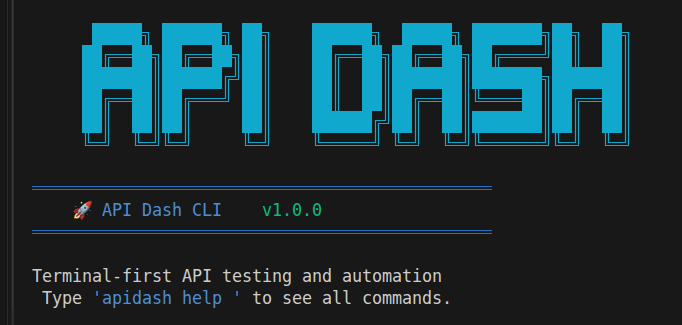

# GSOC'26 Proposal - API Dash : CLI MCP Support

## About Me

1. **Name:** Manar Mohamed Hussien Elhabbal
2. **Email:** manar.elhabbal.dev@gmail.com
3. **Discord:** manarelhabbal
4. **Home Page:** N/A
5. **Blog:** N/A
6. **GitHub:** https://github.com/Manar-Elhabbal7
7. **LinkedIn:** https://www.linkedin.com/in/manar-elhabbal7/
8. **Timezone:** UTC+02:00 (Cairo)
9. **Resume:** [Link](https://drive.google.com/file/d/1CmRfSM-Zhz4g8EaYcGc-F9XmhIxv7chb/view?usp=drive_link)

---

## University Info

1. **University:** Mansoura University — Faculty of Computer and Information Sciences
2. **Program:** B.Sc. in Information Systems
3. **Year:** Third Year
4. **Expected Graduation:** 2027

---

### Motivation & Past Experience

### **1. Have you worked on or contributed to a FOSS project before? Can you attach repo links or relevant PRs?**

Yes, I have worked on a variety of FOSS projects. I contributed to the GSSOC’25 India program, raising 9 merged PRs, and continued making further contributions afterward 
including **bug fixes, feature implementations, tests, workflow automation, and documentation improvements**.

## 🌟 Open Source Contributions


| # | Repository | Contribution | PR Link | Status |
|---|-----------|--------------|--------|--------|
| 1 | taskwarrior | Fix: add obfuscation handling for dependencies in ColumnDepends | [#4072](https://github.com/GothenburgBitFactory/taskwarrior/pull/4072) | Merged |
| 2 | xkaper001/DocPilot | Add GitHub Actions workflow to auto-comment on new issues | [#9](https://github.com/xkaper001/DocPilot/pull/9) | Merged |
| 3 | MasterAffan/OptiFit | Add Unit Tests for Backend | [#57](https://github.com/MasterAffan/OptiFit/pull/57) | Merged |
| 4 | MasterAffan/OptiFit | Bug Report: build fails due to duplicate ndkVersion | [#37](https://github.com/MasterAffan/OptiFit/pull/37) | Merged |
| 5 | MasterAffan/OptiFit | Add Demo Video Section to README | [#35](https://github.com/MasterAffan/OptiFit/pull/35) | Merged |
| 6 | MasterAffan/OptiFit | Add App Icons for All Platforms | [#53](https://github.com/MasterAffan/OptiFit/pull/53) | Merged |
| 7 | SharonIV0x86/CinderPeak | Add examples for CSR-COO storage format | [#47](https://github.com/SharonIV0x86/CinderPeak/pull/47) | Merged |
| 8 | may-tas/TextEditingApp | Edit Text dialog autofocus issue | [#69](https://github.com/may-tas/TextEditingApp/pull/69) | Merged |
| 9 | may-tas/TextEditingApp | Background Color Tray issue solution | [#62](https://github.com/may-tas/TextEditingApp/pull/62) | Merged |
| 10 | may-tas/TextEditingApp | Add more color options | [#53](https://github.com/may-tas/TextEditingApp/pull/53) | Merged |
| 11 | foss42/awesome-generative-ai-apis | Add Humanizer PRO - AI Text Humanizer API | [#359](https://github.com/foss42/awesome-generative-ai-apis/pull/359) | Open |
| 12 | AmrAhmed119/dart-testgen | Delete coverage_import_test.dart after execution | [#58](https://github.com/AmrAhmed119/dart-testgen/pull/58) | Merged |

---

### **2. What is your one project/achievement that you are most proud of? Why?**

I am very proud of my participation in GSSoC'25 (GirlScript Summer of Code). It was my first
open-source experience — I didn't know how to fork a repo or raise a PR, but I taught myself. 
By the end of the program, I had 9 PRs merged, earned 32 points, and
contributed to several different projects.

---

### **3. What kind of problems or challenges motivate you the most to solve them?**

I enjoy solving challenging problems that require creative thinking beyond brute force. I regularly practice on LeetCode and Codeforces, and I’m especially motivated by real-world challenges that push me to learn new concepts. The process of struggling, learning, and eventually solving the problem is what drives me.

---

### **4. Will you be working on GSoC full-time? In case not, what will you be studying or working on while working on the project?**

No, I will be working on GSoC part-time. As a student, I may occasionally have exams or a summer internship at college, which I will note in the timeline. These responsibilities will not affect my contributions to the project, insha'Allah

---

### **5. Do you mind regularly syncing up with the project mentors?**

Not at all  I welcome it. Regular sync-ups are a great opportunity to get feedback, stay on 
track, and learn from the mentors. 

---

### **6. What interests you the most about API Dash?**
API Dash stands out to me for several reasons:

 - Simple and Beautiful UI
API Dash has a clean, simple, and intuitive interface that makes it easy to use, even for beginners.

 - API Dash is truly **cross-platform**, supporting desktop and mobile platforms. This is a rare capability among API clients, as most competitors do not provide mobile support.

 - API Dash is built with **Flutter** and uses Flutter’s **GPU Skia rendering engine**, resulting in a smaller footprint and faster performance.

 - One of the most impressive features is **Dash Bot**, which supports **local LLMs**.  
    This means AI assistance can work **without sending requests to external servers**, making it ideal when working with **sensitive or private data**.

- Multimedia Preview :
    API Dash supports **multimedia previews**, including:
    - Images
    - PDFs
    - Audio
    - Videos

This is a **unique and powerful feature** compared to many other API clients.

- Multi-Language Code Generation:
    API Dash can generate code snippets for **more than 23 programming languages and libraries**, including:

    - Dart
    - Python
    - Node.js
    - and many others

    > This makes it very helpful for developers working across different tech stacks.

- Privacy-Focused Local Operation:
    API Dash works **locally**, helping ensure **privacy and security** while still supporting modern API technologies such as:

    - HTTP
    - GraphQL
    - SSE
    - Streaming
    - AI APIs

- Well-Structured Architecture :
As a developer, what interests me the most is the **well-structured and organized architecture of the codebase**.  
It made it easier for me to understand the project when exploring the source code and helps make the project **maintainable and contributor-friendly**.

---

### ⭐ **Overall Impression:**  
API Dash combines **simplicity, performance, privacy, and powerful developer features**, making it a highly versatile and modern API client.


---

### **7. Can you mention some areas where the project can be improved?**
API Dash's codebase has a few important areas that could be improved and refactored.

-  **test coverage for the core HTTP services is almost nonexistent**.  
The file `better_networking_test.dart` is empty, and `http_service_test.dart` is fully commented out. This means that the core networking layer currently has no automated tests, making it harder to ensure stability and reliability.

- **error handling is too generic**.  
Authentication failures currently return raw strings instead of well-defined exception types. 
so it becomes difficult to distinguish between different problems such as network errors, authentication failures, or response parsing issues.

-  **import failures lack proper feedback**.  
When importing collections from tools like **Postman** or **cURL**, the system sometimes returns `null` if something goes wrong. Since no error message is shown to the user, debugging these import failures will be very hard.

-  **authentication logic is repetitive**.  
In `handle_auth.dart`, similar authentication logic is repeated across multiple authentication types. Refactoring this using a **Strategy pattern** would reduce duplication and make the authentication system cleaner and easier to maintain.

Overall, The code need refactoring and addressing these issues would improve both **code quality and user experience**. Among them, **adding proper test coverage and improving error reporting for imports** should be the highest priority.

---

# Project Proposal Information

## Project Title : CLI & MCP Support

## Abstract
 
API Dash is a beautiful AI-powered open-source cross-platform API client built with Flutter that helps developers create, customize, and test API requests with ease. However, it currently lacks support for **terminal-based workflows** and **integration with AI development assistants**.
 
This project implements two core capabilities:
 
1. **Command Line Interface (CLI):** Enables a focused, automation-friendly subset of API Dash workflows from the terminal: run HTTP requests, import/export collections, and run a collection as a batch. This supports scripting and CI use-cases without requiring the GUI.
 
2. **Model Context Protocol (MCP) Server:** Exposes the same runner capabilities to MCP clients (e.g., Claude Desktop, Cursor, VS Code) so an AI assistant can list collections and execute requests/collections through structured tool calls.
 
Both the CLI and MCP server will share a common core from `apidash_core` to ensure consistent behavior across interfaces. 

---

# Technical Details 

### Technical Approach & Architecture


## Architecture Overview

Before diving into each component separately, it is important to understand
how the CLI and MCP server fit into the broader API Dash ecosystem.

Both the CLI and the MCP server are independent entry points — one built
for developers working in the terminal, the other for AI assistants working
through natural language. Despite their different interfaces, they share the
same underlying engine: `apidash_core`.

This design means that any logic improvement, bug fix, or new feature added
to the core is automatically available to all three surfaces: the GUI app,
the CLI, and the MCP server — with zero duplication.

The diagram below illustrates these relationships:

<p align="center">
  
</p>


---
##  1. CLI Support 
To bring API Dash to the terminal, I will implement a dedicated
`apidash_cli` dart package which will be published on [pub.dev](https://pub.dev).

This package provides a **headless runner** for the most important API testing workflows (request execution + collection execution + import/export) without replicating the full GUI feature set.

Once published, any developer can install it globally with a single command:

```bash
    dart pub global activate apidash_cli
```


### 1. Why This Approach?

| Principle | Description |
|-----------|-------------|
| **Modular Design** | Each command group is encapsulated in a separate module |
| **Package Reuse** | Leverages existing packages (`better_networking`, `curl_parser`, `postman`, `apidash_core`) to avoid code duplication |
| **Monorepo Integration** | Uses Melos for workspace management and dependency coordination |
| **Cross-platform** | Built with the Dart CLI framework to run on Windows, macOS, and Linux |

---

### 2. Packages Structure

```dart
|packages/
├── apidash_cli/
│   ├── bin/
│   │   └── apidash.dart              # CLI entry point (`apidash` command)
│   ├── lib/
│   │   ├── main.dart                 # Package export
│   │   ├── commands/                 # Core command implementations
│   │   ├── models/                   # CLI-specific data models
│   │   ├── utils/                    # Utility functions
│   │   └── services/                 # Business logic services
│   ├── test/
│   │   ├── unit/                     # Unit tests
│   │   └── integration/              # Integration tests
│   ├── example/                      # Usage examples
│   └── pubspec.yaml

```

---

### 3. Technology Stack

| Component | Technology | Justification |
|-----------|------------|---------------|
| CLI Framework | `dart:cli` | Native Dart support, no external dependencies |
| Command Parsing | `args` package | Standard Dart CLI argument parser |
| HTTP Client | `better_networking` (exists) | Consistent with GUI app, well-tested |
| cURL Parsing | `curl_parser` (exists) | Proven reliability, maintained by project |
| Collection Import/Export | `postman`, `insomnia_collection`, `har` (exists) | Zero code duplication |
| Config Storage | `yaml` | Human-readable, industry standard |
| Output Formatting | `console` + `ansi_colors` | Rich terminal output, cross-platform |
| Code Generation | Jinja templates (exists) | Consistent with GUI app |
| Testing | `test` + `mockito` | Standard Dart testing stack |

---

### Core Commands

The CLI follows a simple, predictable structure across all commands:

```bash
apidash <command> [subcommand] [arguments] [options]
```

Every command produces colored, human-readable output by default.
For scripting and automation, pass `--output json` to get
machine-readable output that pipes cleanly into other tools.

> I will discuss with the mentor to identify and prioritize the most
> important commands first. To keep the scope realistic for a 90-hour project,
> I will deliver an MVP command set first, then implement stretch goals only
> if time allows.

---

#### Command Overview (MVP vs Stretch)

| Command | Description |
|---------|-------------|
| **MVP** `apidash init` | Initialize a project/config skeleton |
| **MVP** `apidash request` | Execute a single request (including `curl` parsing) |
| **MVP** `apidash collection` | List/show/run a collection as a batch |
| **MVP** `apidash import` / `apidash export` | Import/export collections (Postman/Insomnia/HAR/OpenAPI as supported) |
| **Stretch** `apidash generate` | Generate client code for a saved request |
| **Stretch** `apidash env` | Manage environment variables |

---

#### 1. Project Initialization

```bash
apidash init [name]
```

Creates a new API Dash project with configuration files and a
standard directory structure pre-filled with templates.

---

#### 2. Request Management *(Most Important)*

```bash
apidash request <url> [options]
```

The core command for sending HTTP requests directly from the terminal.
Supports all major HTTP methods, file-based request bodies, cURL
parsing, and streaming via SSE.

Each command is implemented as a class extending `Command` from the
`args` package. Here is a simplified sketch of how `RequestCommand`
is structured:

```dart
class RequestCommand extends Command {
  @override
  final name = 'request';

  @override
  final description = 'Send an HTTP request';

  RequestCommand() {
    addSubcommand(GetCommand());
    addSubcommand(PostCommand());
    addSubcommand(CurlCommand());
  }
}

class GetCommand extends Command {
  @override
  final name = 'get';

  @override
  final description = 'Send a GET request';

  GetCommand() {
    argParser
      ..addOption('env', abbr: 'e', help: 'Environment to use')
      ..addOption('save', help: 'Save request to collection')
      ..addFlag('watch', help: 'Enable watch mode for SSE');
  }

  @override
  Future<void> run() async {
    final url = argResults!.rest.first;
    final result = await RequestService.get(
      url,
      env: argResults!['env'],
    );
    OutputFormatter.print(result);
  }
}
```

**Subcommands**

| Command | Description |
|---------|-------------|
| `apidash request get <url>` | Send a GET request |
| `apidash request post <url> -d '{"key":"value"}'` | Send a POST request with body |
| `apidash request put <url> --file data.json` | Read request body from a file |
| `apidash request curl <curl-command>` | Parse and execute a cURL command |

**Options**

| Flag | Description |
|------|-------------|
| `-H, --header` | Add a request header |
| `-d, --data` | Add body data |
| `-p, --params` | Add query parameters |
| `-e, --env <name>` | Use a specific environment |
| `--save <name>` | Save request to a collection |
| `--watch` | Watch mode — supports SSE and streaming responses |

**Output example**

```bash
$ apidash request get https://api.example.com/users

  200 OK  GET https://api.example.com/users  143ms

{
  "users": [
    { "id": 1, "name": "Manar" },
    { "id": 2, "name": "Elhabbal" }
  ]
}
```

---

#### 3. Collection Management

```bash
apidash collection [subcommand]
```

Manage saved request collections — list, inspect, run as batch
tests, or export to standard formats.

| Subcommand | Description |
|------------|-------------|
| `apidash collection list` | List all collections |
| `apidash collection show <name>` | Show collection details |
| `apidash collection run <name>` | Run entire collection as a batch test |
| `apidash collection export <name> --format postman\|openapi\|curl` | Export a collection |

---

#### 4. Import / Export

```bash
# Import
apidash import <file> [--format postman|insomnia|har|openapi]

# Export
apidash export <collection-name> --format postman|openapi|curl
```

Reuses existing packages (`postman`, `insomnia_collection`, `har`,
`curl_parser`) from the monorepo — zero additional code required.

---

#### 5. Code Generation

> **Stretch goal:** Implemented only if the MVP (request/collection runner + import/export + MCP MVP + tests) is complete and stable.

```bash
apidash generate <request-name> --language <lang>
```

Generates ready-to-use client code from any saved request using
the existing Jinja templates — consistent with the GUI app output.

 **for example**
| Language | Command |
|----------|---------|
| Dart | `apidash generate my-request --language dart` |
| Python | `apidash generate my-request --language python` |


---

#### 6. Environment Management

> **Stretch goal:** Implemented only if time allows.

```bash
apidash env [subcommand]
```

| Subcommand | Description |
|------------|-------------|
| `apidash env list` | List all environments |
| `apidash env use <name>` | Switch to a specific environment |
| `apidash env add <key> <value>` | Add an environment variable |
| `apidash env remove <key>` | Remove an environment variable |

---

#### 7. AI Integration — DashBot

> **Future scope (not required for MVP):** The CLI/MCP runner is the priority for this project. AI features can be explored later once the headless execution workflow is stable and well-tested.

```bash
apidash ai <prompt>
```

Natural language interface powered by `genai`. DashBot can generate
complete requests from a plain English description, explain response
errors, and suggest fixes — all without leaving the terminal.

The `--debug` flag attaches the last failed request and response to
the prompt automatically, so the AI has the full context it needs to
give a useful answer.

```bash
# Generate a full request from a description
apidash ai "create a POST request to register a new user with name and email"

# Debug the last failed request
apidash ai --debug "why did this request fail?"

# Pipe a response into DashBot for analysis
apidash request get https://api.example.com/users | apidash ai "summarize this response"
```

---

#### 8. History

> **Future scope (not required for MVP):** Nice-to-have for usability, but not needed to deliver the core runner functionality.

```bash
apidash history [subcommand]
```

| Subcommand | Description |
|------------|-------------|
| `apidash history list` | View past requests |
| `apidash history replay <id>` | Re-execute a historical request |

---

## CLI UI

As a user, having a beautiful, colorful, and helpful interface is crucial for a good experience.  
As a developer, this section is particularly interesting for me

The CLI UI will be designed to be:

- **Professional and visually appealing**: using colors, ASCII logos, separators, and formatted tables.
- **Helpful and informative**: displaying quick command references and hints for new users.
- **Simple and maintainable**: structured code in `packages/apidash_cli/utils/banner.dart`.

To achieve this, I will use several Dart packages:

| Package       | Purpose                                           |
|---------------|--------------------------------------------------|
| `ansicolor`   | For colored and styled terminal text            |
| `cli_spinner` | For animated spinners during requests or tasks |
| `cli_table`   | To display commands or data in formatted tables|

The current implementation provides a colorful **ASCII banner** for the CLI:

<p align="center">
  
</p>

I intend to **refactor and enhance this banner** to make it more professional, while keeping the interface simple, clear, and intuitive for users.  


## Interactive Features I intend to add 

Progress Indicators

```
$ apidash process large-dataset.csv
Processing: [████████████████████░░] 85% (1,234/1,450 records)

```
Spinner Animation

```
$ apidash sync
⠋ Connecting to remote server... (2s)
```
Autocomplete features

Confirmations
```
This will delete 12 files. Continue? [y/N]
```

This approach ensures that the CLI not only looks professional but also provides a **friendly and productive user experience** in the terminal.

---

## Challenges & Solutions

#### 1. Cross-platform terminal color support

**Challenge:** ANSI color codes work on macOS and Linux but may
render as raw escape characters on Windows CMD and older PowerShell.

**Solution:** 
- Detect terminal capability at runtime using
`stdout.supportsAnsiEscapes` and fall back to plain text on
unsupported terminals. Windows Terminal and new PowerShell versions
are detected via environment variables like `WT_SESSION`.

---

#### 2. Shared state between CLI and GUI

**Challenge:** The GUI stores collections and environments in its
own local storage format. The CLI must read and write the same data
without any corruption.

**Solution:**
- Use `apidash_core` as the single data access layer
through a shared storage interface. The GUI and CLI each provide
their own implementation — neither reads the other's files directly.

---

#### 3. Streaming responses (SSE) in the terminal

**Challenge:** 
- SSE and streaming APIs send data continuously. The
CLI must display each chunk as it arrives and handle `Ctrl+C`
gracefully without leaving the terminal in a broken state.

**Solution:** 
- Use Dart's `Stream` API to print chunks as they arrive,
combined with a `ProcessSignal.sigint` handler to cancel the stream
cleanly on interrupt.

---

#### 4. MCP protocol versioning

**Challenge:** The MCP protocol is still evolving. A client update
could silently break the server if version mismatches are not handled.

**Solution:** 
- Implement version negotiation during the MCP handshake.
The server declares its supported protocol versions and returns a
clear error if the client requests an unsupported one.

---

#### 5. Testing without a real network

**Challenge:** Tests that hit real APIs are slow and fail in CI
environments with no internet access.

**Solution:** 
- Abstract the HTTP layer behind an interface and inject
a `mockito` mock in tests. This allows full command testing with
controlled responses and no network dependency.

---

#### 6. Large response readability

**Challenge:** Responses with thousands of lines will flood the
terminal and make output unreadable.

**Solution:**
- Truncate output to 50 lines by default and show a
hint with the total line count. 
A `--full` flag prints the complete response, and `--output <file>` saves it to disk instead.

> I inted to discuss these challanges and solutions with the mentor to guide me
> and choose the best solution for them.


---

# 2. MCP Support

## Introduction

Model Context Protocol (MCP) provides a standardized communication layer between AI models, tools, and data sources. instead of manually copying data to an AI assistant, MCP gives the AI **direct, structured access** to your tools — no copy-paste, no context limits.

API Dash will be exposed as an MCP server, meaning AI assistants like Claude Desktop, Cursor, and VS Code can directly execute requests, import collections, generate code, and run tests all through single conversations.

<p align="center">

</p>

---

## Base Protocol & Transport

MCP uses JSON-RPC to encode all messages. Messages MUST be UTF-8 encoded. The protocol defines two standard transports:

| Transport | Description |
|-----------|-------------|
| **stdio** | Client launches the MCP server as a subprocess; communication over stdin/stdout |
| **Streamable HTTP** | Server runs independently; client uses HTTP POST to send messages and GET for SSE to receive server messages |

Clients such as Cursor, Claude Desktop, and VS Code SHOULD support stdio whenever possible. Custom transports are allowed if they preserve the JSON-RPC message format and lifecycle.

---

## Which Transport Will I Use? Why? How?

### Transport Choice: stdio

The API Dash MCP server will use the **stdio** transport for the following reasons:

**1. Fits how MCP clients work** — tools like Cursor and Claude Desktop launch the MCP server as a subprocess and communicate via stdin/stdout. no HTTP server, no port configuration, no CORS.

**2. Simplicity** — one process, one bidirectional channel. no session management, no network binding.

**3. Security** — no network exposure. communication stays entirely inside the host process.

**4. Spec alignment** — the MCP spec explicitly states:
> *"Clients SHOULD support stdio whenever possible"*

targeting stdio maximizes compatibility with all major MCP clients.

**5. Platform scope** — the MCP server runs on desktop platforms (macOS, Windows, Linux) where stdio is fully supported. on mobile platforms (iOS/Android), spawning subprocesses is restricted by the OS and App Store policies — so the MCP server is intentionally scoped to desktop only, where it makes the most sense for developer workflows.

```
┌─────────────────────────────────────────────┐
│     MCP Client (Claude Desktop/Cursor/      │
│              VS Code)                       │
└──────────────────┬──────────────────────────┘
                   │ stdin/stdout
                   │ (newline-delimited JSON-RPC)
┌──────────────────▼──────────────────────────┐
│           apidash_mcp server                │
│         (StdioServerTransport)              │
└──────────────────┬──────────────────────────┘
                   │
┌──────────────────▼──────────────────────────┐
│  apidash_core / better_networking /         │
│  curl_parser / postman                      │
└─────────────────────────────────────────────┘
```

---

## stdio Behavior (per MCP spec)

| Requirement | Implementation |
|-------------|----------------|
| Message framing | Newline-delimited. Each JSON-RPC message is one line; MUST NOT contain embedded newlines |
| Input | Server reads JSON-RPC messages (requests, notifications, batches) from stdin |
| Output | Server writes ONLY valid MCP messages to stdout — nothing else |
| Logging | Diagnostics go to stderr. Clients may capture, forward, or ignore |
| Client responsibility | Client must not write anything to stdin that is not a valid MCP message |

**Lifecycle:**
```
Client                          apidash_mcp
  │                                  │
  │──── launch subprocess ──────────►│
  │──── stdin: InitializeRequest ───►│
  │◄─── stdout: InitializeResult ───│
  │                                  │
  │──── stdin: tool call ───────────►│
  │◄─── stdout: tool result ────────│
  │                                  │
  │──── close stdin ────────────────►│
  │──── terminate subprocess ───────►│
```

---

## Implementation

using the `mcp_dart` package which implements the full MCP spec `2025-11-25` with stdio transport natively — no custom transport code needed.

**Server Entry Point:**
```dart
// packages/apidash_mcp/bin/apidash_mcp.dart
import 'package:mcp_dart/mcp_dart.dart';

void main() async {
  final server = McpServer(
    Implementation(name: 'apidash_mcp', version: '1.0.0'),
    options: ServerOptions(
      capabilities: ServerCapabilities(
        tools: ServerCapabilitiesTools(),
        resources: ServerCapabilitiesResources(),
      ),
    ),
  );

  _registerTools(server);
  _registerResources(server);

  // stdio: reads from stdin, writes to stdout, logs to stderr
  await server.connect(StdioServerTransport());
}
```

---

## Project Structure

```
packages/
├── apidash_core/     # shared core logic
├── apidash_cli/      # CLI commands
└── apidash_mcp/      # MCP server
    ├── bin/
    │   └── apidash_mcp.dart   # entry point
    ├── lib/
    │   └── src/
    │       ├── tools/         # tool definitions
    │       ├── resources/     # resource definitions
    └── pubspec.yaml
```


---

## MCP Tools

To keep the MCP scope aligned with a 90-hour project, the initial tool set focuses on **listing collections** and **executing requests/collections**. Additional tools (codegen, import/export) are stretch goals.

**1. `send_request` — execute a saved API request**
```dart
server.tool(
  'send_request',
  description: 'Execute a saved API Dash request by ID',
  inputSchemaProperties: {
    'request_id': {
      'type': 'string',
      'description': 'The ID of the request to execute',
    },
  },
  required: ['request_id'],
  callback: (args, extra) async {
    final result = await HttpService().sendRequest(args['request_id']);
    return CallToolResult(
      content: [TextContent(text: jsonEncode(result))],
    );
  },
);
```

**2. `list_collections` — list all collections**
```dart
server.tool(
  'list_collections',
  description: 'List all available API Dash collections',
  inputSchemaProperties: {},
  callback: (args, extra) async {
    final collections = await CollectionService().getAll();
    return CallToolResult(
      content: [TextContent(text: jsonEncode(collections))],
    );
  },
);
```

**3. `run_collection` — execute a full collection (batch)**
```dart
server.tool(
  'run_collection',
  description: 'Execute all requests in a collection and return a summary report',
  inputSchemaProperties: {
    'collection_id': {
      'type': 'string',
      'description': 'The ID of the collection to execute',
    },
  },
  required: ['collection_id'],
  callback: (args, extra) async {
    final report = await CollectionRunnerService().run(args['collection_id']);
    return CallToolResult(
      content: [TextContent(text: jsonEncode(report))],
    );
  },
);
```

**Stretch: `generate_code` — generate client code**
```dart
server.tool(
  'generate_code',
  description: 'Generate client code for a saved request',
  inputSchemaProperties: {
    'request_id': {'type': 'string'},
    'language': {
      'type': 'string',
      'enum': ['dart', 'python', 'javascript', 'curl', 'kotlin'],
    },
  },
  required: ['request_id', 'language'],
  callback: (args, extra) async {
    final code = CodegenService().generate(
      args['request_id'],
      args['language'],
    );
    return CallToolResult(content: [TextContent(text: code)]);
  },
);
```

---

## MCP Resources

```dart
// apidash://collections — all collections as AI context
server.resource(
  'apidash://collections',
  description: 'All API Dash collections and requests',
  callback: (uri, extra) async {
    final data = await CollectionService().getAll();
    return ReadResourceResult(
      contents: [TextResourceContents(uri: uri, text: jsonEncode(data))],
    );
  },
);

// apidash://history — recent request logs
server.resource(
  'apidash://history',
  description: 'Recent request/response history (last 20)',
  callback: (uri, extra) async {
    final history = await HistoryService().getLast(20);
    return ReadResourceResult(
      contents: [TextResourceContents(uri: uri, text: jsonEncode(history))],
    );
  },
);
```

---

## Connect to Claude Desktop

```json
{
  "mcpServers": {
    "apidash": {
      "command": "dart",
      "args": ["run", "/path/to/apidash_mcp/bin/apidash_mcp.dart"]
    }
  }
}
```

or using a compiled executable for faster startup:

```bash
dart compile exe bin/apidash_mcp.dart -o apidash_mcp
```

```json
{
  "mcpServers": {
    "apidash": {
      "command": "/path/to/apidash_mcp"
    }
  }
}
```

after connecting, AI assistants can do things like:
> *"run my login request and check if the token is valid"*

> *"generate Python code for all requests in my payments collection"*

> *"find any requests in my history that returned 5xx errors"*

---

## Streamable HTTP (Future Scope)

Streamable HTTP is not in the initial GSoC scope but is documented here for future reference. if added later, it would need to:

- expose a single MCP endpoint supporting both POST and GET
- send `Accept: application/json, text/event-stream` on all requests
- validate `Origin` header to prevent DNS rebinding attacks
- bind to `127.0.0.1` when running locally
- support session management via `Mcp-Session-Id` header

this would unlock remote MCP access and team-shared server scenarios without changing any tool or resource code.

## How I Will Test the MCP Server

I will test `apidash_mcp` using a mix of **automated tests** and the **MCP Inspector**:

- **Automated**: unit tests for tool input validation + integration tests that start the server and execute a small set of tool calls against a controlled local HTTP stub (no external network), verifying JSON-RPC responses and error handling.
- **Manual (Inspector)**: connect the Inspector to `apidash_mcp`, call each tool/resource, and validate response shape, edge cases, and JSON-RPC traces during development and before each milestone.

```bash
npx @modelcontextprotocol/inspector dart run packages/apidash_mcp/bin/apidash_mcp.dart
```
## How I Will Publish It
The `apidash_mcp` package will be published to `pub.dev`, the official Dart/Flutter package registry, making it easily installable with a single command.

### Activate and run globally
```bash
dart pub global activate apidash_mcp
apidash_mcp
```
### Connect from any MCP client

```json
{
  "mcpServers": {
    "apidash": {
      "command": "apidash_mcp"
    }
  }
}
```


## 3. Time Line (90 hours)

## Proposed Timeline (8 Weeks)

### Availability Note (Final Exams: June 1–25)

I will have final exams from **June 1 to June 25**, so my available hours during this period will be reduced. To mitigate scheduling risks, I will front-load **project setup and design** work before and during the early exam window, keep PRs small while exams are ongoing, and schedule the **heavier implementation milestones** (CLI runner + MCP MVP) for after June 25.

During the exam period, I will focus on lower-risk tasks such as writing tests, fixing bugs, improving documentation, and making incremental improvements that do not require long uninterrupted blocks of time.


### Community Bonding Period (May 1 – May 24)
  * Discuss the project scope and technical details with mentors.
  * Gain a deep understanding of the **API Dash** architecture and codebase.
  * Study the technologies and tools used in the project stack.
  * Refine the project timeline and implementation plan based on mentor feedback.


### Week 1 (May 25 – May 31)
- Set up the development environment and workspace tooling
- Finalize MVP scope with mentor (CLI: `init`, `request`, `collection`, `import/export`; MCP: `list_collections`, `send_request`, `run_collection`)
- Implement CLI skeleton (command routing, `--output json`, consistent error/exit-code conventions)
- Create example fixtures (sample collection + local stub server plan) to support later tests

### Week 2 (June 1 – June 7)
> Reduced availability (final exams).

- Implement `apidash init` and configuration loading/validation (small, reviewable PRs)
- Start unit tests for config parsing + command argument validation
- Documentation updates: usage examples + expected output format (human + JSON)

### Week 3 (June 8 – June 14)
> Reduced availability (final exams).

- Implement minimal request execution path behind a stable interface (no feature creep)
- Add basic output formatting + structured errors
- Add unit tests for request model serialization and error cases

### Week 4 (June 15 – June 21)
> Reduced availability (final exams).

- Implement collection loading + `collection list/show` (read-only features first)
- Improve error handling/logging consistency (stdout vs stderr)
- Add integration test scaffolding using a local HTTP stub (no external network)

### Week 5 (June 22 – June 28)
- (June 22–25) Reduced availability (final exams): stabilize existing work, fix bugs, and expand tests
- (After June 25) Implement `collection run` (batch execution) + CLI exit codes suitable for CI
- Prepare MCP package skeleton and tool schema definitions (inputs/outputs)

### Week 6 (June 29 – July 5)
- Implement MCP stdio server MVP (`mcp_dart`) and wire it to the same runner core
- Tools MVP: `list_collections`, `send_request`, `run_collection`
- Manual verification using MCP Inspector + add MCP integration tests

### Week 7 (July 6 – July 12)
- End-to-end testing (CLI + MCP) with deterministic fixtures
- Documentation: install/run, MCP client configuration snippets, troubleshooting
- Performance/stability polish (timeouts, cancellation, clear errors)

### Week 8 (July 13 – July 19)
- Final polishing and refactoring (only after tests are green)
- Stretch goals if time allows (e.g., `generate_code`, `env`) **only if MVP is stable**
- Prepare final submission, demo script, and release notes

<!--  
// use data in apidash? 
//plug to client
//technical details?

-->


