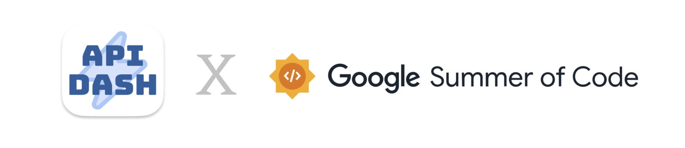
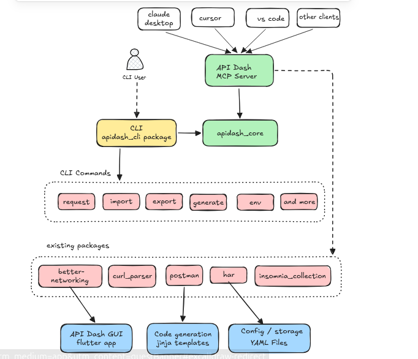
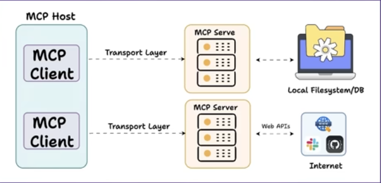

# GSOC'26 Proposal - API Dash : CLI MCP Support

## About Me

- **Name:** Manar Mohamed Hussien Elhabbal  
- **Email:** manar.elhabbal.dev@gmail.com  
- **Discord:** manarelhabbal  
- **GitHub:** https://github.com/Manar-Elhabbal7  
- **LinkedIn:** https://www.linkedin.com/in/manar-elhabbal7/  
- **Timezone:** UTC+02:00 (Cairo)  
- **Resume:** [Link](https://drive.google.com/file/d/1CmRfSM-Zhz4g8EaYcGc-F9XmhIxv7chb/view?usp=drive_link)

---

## University Info

- **University:** Mansoura University  Faculty of Computer and Information Sciences  
- **Program:** B.Sc. in Information Systems  
- **Year:** Third Year  
- **Expected Graduation:** 2027  

---

## Motivation & Past Experience

### Have you worked on or contributed to a FOSS project before?

Yes. I have contributed to several open-source projects through **GSSOC’25 (GirlScript Summer of Code)** and continued contributing afterward.  
My contributions include **bug fixes, feature implementations, unit tests, workflow automation, and documentation improvements**.

### Open Source Contributions

| # | Repository | Contribution | PR Link | Status |
|---|-----------|--------------|--------|--------|
| 1 | taskwarrior | Fix: add obfuscation handling for dependencies in ColumnDepends | [#4072](https://github.com/GothenburgBitFactory/taskwarrior/pull/4072) | Merged |
| 2 | xkaper001/DocPilot | Add GitHub Actions workflow to auto-comment on new issues | [#9](https://github.com/xkaper001/DocPilot/pull/9) | Merged |
| 3 | MasterAffan/OptiFit | Add Unit Tests for Backend | [#57](https://github.com/MasterAffan/OptiFit/pull/57) | Merged |
| 4 | MasterAffan/OptiFit | Bug Report: build fails due to duplicate ndkVersion | [#37](https://github.com/MasterAffan/OptiFit/pull/37) | Merged |
| 5 | MasterAffan/OptiFit | Add Demo Video Section to README | [#35](https://github.com/MasterAffan/OptiFit/pull/35) | Merged |
| 6 | MasterAffan/OptiFit | Add App Icons for All Platforms | [#53](https://github.com/MasterAffan/OptiFit/pull/53) | Merged |
| 7 | SharonIV0x86/CinderPeak | Add examples for CSR-COO storage format | [#47](https://github.com/SharonIV0x86/CinderPeak/pull/47) | Merged |
| 8 | may-tas/TextEditingApp | Fix: Edit Text dialog autofocus issue | [#69](https://github.com/may-tas/TextEditingApp/pull/69) | Merged |
| 9 | may-tas/TextEditingApp | Fix: Background Color Tray issue | [#62](https://github.com/may-tas/TextEditingApp/pull/62) | Merged |
|10 | may-tas/TextEditingApp | Add more color options | [#53](https://github.com/may-tas/TextEditingApp/pull/53) | Merged |
|11 | foss42/awesome-generative-ai-apis | Add Humanizer PRO – AI Text Humanizer API | [#359](https://github.com/foss42/awesome-generative-ai-apis/pull/359) | Open |
|12 | AmrAhmed119/dart-testgen | Delete coverage_import_test.dart after execution | [#58](https://github.com/AmrAhmed119/dart-testgen/pull/58) | Merged |

---

### **2. What is your one project/achievement that you are most proud of? Why?**

I am most proud of participating in **GSSoC'25 (GirlScript Summer of Code)**, which was my first open-source experience.  
At the beginning, I didn’t know how to fork repositories or create pull requests, but I quickly learned these workflows. By the end of the program, I had **9 merged PRs**, earned **32 points**, and contributed to multiple open-source projects.

---

### **3. What kind of problems or challenges motivate you the most?**

I enjoy solving challenging problems that require **creative thinking and deeper analysis** rather than brute-force approaches.  
I am motivated by real-world problems that push me to learn new concepts and improve my problem-solving skills.

---

### **4. Will you be working on GSoC full-time?**

I will be working on GSoC **part-time**. As a university student, I may occasionally have exams or academic commitments during the summer, which will be noted in the timeline.

---

### **5. Do you mind regularly syncing up with the project mentors?**

Not at all. I highly value **regular communication with mentors** as it helps me receive feedback and learn from their experience.

---

### **6. What interests you the most about API Dash?**

API Dash stands out to me for several reasons:

- **Clean and intuitive UI**  
  API Dash provides a simple and user-friendly interface that makes API testing accessible even for beginners.

- **True cross-platform support**  
  Unlike many API clients, API Dash supports both **desktop and mobile platforms**, making it highly flexible for developers.

- **Built with Flutter**  
  Being built with **Flutter and the Skia rendering engine** allows API Dash to deliver fast performance with a relatively small footprint.

- **DashBot with local LLM support**  
  One of the most impressive features is **DashBot**, which supports **local LLMs**. This enables AI assistance without sending data to external servers, making it suitable for **privacy-sensitive workflows**.

- **Multimedia preview support**  
  API Dash can preview **images, PDFs, audio, and video responses**, which is a powerful feature rarely found in many API clients.

- **Multi-language code generation**  
  It can generate code snippets for **more than 23 programming languages and libraries**, including Dart, Python, and Node.js, which is extremely helpful for developers working across different tech stacks.

- **Privacy-focused local operation**  
  Since API Dash runs locally, it helps ensure **privacy and security** while still supporting modern API technologies such as HTTP, GraphQL, SSE, streaming, and AI APIs.

- **Well-structured architecture**  
  The codebase is organized and easy to navigate, which makes it **contributor-friendly and maintainable**, and helped me quickly understand the project structure.

---


### **7. Areas Where the Project Can Be Improved**

While exploring the codebase, I noticed several areas where improvements could strengthen the project:

- **Lack of test coverage**  
  Core HTTP services currently have almost no automated tests. For example, `better_networking_test.dart` is empty and `http_service_test.dart` is commented out. Adding proper tests would improve reliability and maintainability.

- **Generic error handling**  
  Some authentication failures return raw strings instead of structured exception types, which makes it harder to differentiate between issues such as network failures, authentication errors, or parsing problems.

- **Poor feedback during imports**  
  When importing collections from tools like **Postman** or **cURL**, failures may return `null` without a clear error message, making debugging difficult for users.

- **Repetitive authentication logic**  
  Authentication handling in `handle_auth.dart` contains repeated logic across multiple authentication types. Refactoring this using a **Strategy pattern** would reduce duplication and improve maintainability.

Overall, improving **test coverage, error handling, and import feedback** would significantly enhance both **code quality and user experience**.

---

# Abstract
 
API Dash is an AI-powered, open-source, cross-platform API client built with Flutter that helps developers create, customize, and test API requests. However, it currently lacks support for **terminal-based workflows** and **integration with AI development assistants**.

This project introduces two key capabilities:

1. **Command Line Interface (CLI)**  
   Provides a terminal-based workflow for running HTTP requests, importing/exporting collections, and executing collections in batch. This enables **automation, scripting, and CI workflows** without requiring the GUI.

2. **Model Context Protocol (MCP) Server**  
   Exposes API Dash capabilities to **MCP-compatible AI assistants** (such as Claude Desktop, Cursor, and VS Code), allowing them to list collections and execute API requests through structured tool calls.

Both the CLI and MCP server will share a unified core module (`apidash_core`) to ensure **consistent behavior and reusable logic across interfaces**.

## Architecture Overview

To understand the implementation, it is important to see how the **CLI** and **MCP server** integrate with the broader API Dash ecosystem.

Both act as **separate entry points**:
- the **CLI** targets developers working in the terminal,
- the **MCP server** enables AI assistants to interact with API Dash.

Despite these different interfaces, both rely on a shared core module: **`apidash_core`**.

This architecture ensures that improvements, bug fixes, or new features added to the core automatically propagate to all interfaces  **GUI, CLI, and MCP**  without code duplication.

<p align="center">
  
</p>

---

## 1. CLI Support

To bring API Dash to the terminal, I will implement a dedicated **`apidash_cli`** Dart package, published on [pub.dev](https://pub.dev), providing a headless runner for the most important API testing workflows without replicating the full GUI.

```bash
dart pub global activate apidash_cli
```


---

### Why This Approach?

| Principle | Description |
|-----------|-------------|
| **Package Reuse** | Leverages existing `better_networking`, `curl_parser`, `postman`, `apidash_core`  zero duplication |
| **Modular Design** | Each command group is a separate module |
| **Cross-platform** | Runs on Windows, macOS, and Linux |

---

### Package Structure

```
packages/apidash_cli/
├── bin/apidash.dart        # entry point
├── lib/
│   ├── commands/           # command implementations
│   ├── services/           # business logic
│   └── utils/              # output formatting
├── test/
└── pubspec.yaml
```
### Commands (MVP vs Stretch)

```bash
apidash <command> [subcommand] [options]
```

| Priority | Command | Description |
|----------|---------|-------------|
| **MVP** | `apidash init` | Initialize project/config skeleton |
| **MVP** | `apidash request get/post <url>` | Execute HTTP requests (including cURL parsing) |
| **MVP** | `apidash collection list/show/run` | Manage and batch-run collections |
| **MVP** | `apidash import/export <file>` | Import/export Postman, Insomnia, HAR |
| **Stretch** | `apidash generate` | Generate client code |
| **Stretch** | `apidash env` | Manage environment variables |

**Output example:**
```bash
$ apidash request get https://api.example.com/users

200 OK  GET https://api.example.com/users  143ms
{"users": [{"id": 1, "name": "Manar"}]}
```

All commands support `--output json` for CI/scripting pipelines.
 
The CLI will use **ansicolor** and **cli_spinner** for colored, human-readable output, with `--output json` for CI pipelines.


---

## Challenges & Solutions

### 1. Shared state between CLI and GUI
**Challenge:** GUI and CLI must read/write the same collections and environments safely.  
**Solution:** Use `apidash_core` as a shared data layer with separate implementations for CLI and GUI; no direct file sharing.

### 2. Streaming responses (SSE) in the terminal
**Challenge:** SSE streams continuously; interrupts may break the terminal.  
**Solution:** Use Dart’s `Stream` API to print chunks in real-time and handle `Ctrl+C` via `ProcessSignal.sigint` to cancel streams cleanly.

### 3. MCP protocol versioning
**Challenge:** Client/server version mismatches could break communication.  
**Solution:** Implement version negotiation during MCP handshake. Unsupported versions return clear errors.

### 4. Testing without a real network
**Challenge:** Real API tests are slow and fail in CI without internet.  
**Solution:** Abstract HTTP layer behind an interface; inject `mockito` mocks to fully test commands offline.

> Challenges and solutions will be discussed with mentors to select the best approaches.
---

# 2. MCP Support

## Introduction

Model Context Protocol (MCP) provides a standardized communication layer between AI models, tools, and data sources. Instead of manually copying data to an AI assistant, MCP gives the AI **direct, structured access** to your tools  no copy-paste, no context limits.

API Dash will be exposed as an MCP server, meaning AI assistants like Claude Desktop, Cursor, and VS Code can directly execute requests and run collections  all through natural language conversations.

<p align="center">

</p>

---

## Base Protocol & Transport

MCP uses JSON-RPC to encode all messages. Messages MUST be UTF-8 encoded. The protocol defines two standard transports:

| Transport | Description |
|-----------|-------------|
| **stdio** | Client launches the MCP server as a subprocess; communication over stdin/stdout |
| **Streamable HTTP** | Server runs independently; client uses HTTP POST to send messages and GET for SSE to receive server messages |

Clients such as Cursor, Claude Desktop, and VS Code SHOULD support stdio whenever possible.

---

## Which Transport Will I Use? Why? How?

### Transport Choice: stdio

The API Dash MCP server will use the **stdio** transport for the following reasons:

**1. Fits how MCP clients work**  Tools like Cursor and Claude Desktop launch the MCP server as a subprocess and communicate via stdin/stdout. No HTTP server, port configuration, or CORS.

**2. Simplicity**  One process, one bidirectional channel. No session management or network binding.

**3. Security**  No network exposure; communication stays entirely on the host.

**4. Spec alignment**  The MCP spec states: *"Clients SHOULD support stdio whenever possible"*. Targeting stdio maximizes compatibility with all major MCP clients.

**5. Platform scope**  The MCP server targets desktop (macOS, Windows, Linux) where stdio is fully supported. On mobile (iOS/Android), subprocess spawning is restricted by the OS; the MCP server is therefore scoped to desktop-only, which aligns with developer workflows.

```
┌─────────────────────────────────────────────┐
│     MCP Client (Claude Desktop/Cursor/      │
│              VS Code)                       │
└──────────────────┬──────────────────────────┘
                   │ stdin/stdout
                   │ (newline-delimited JSON-RPC)
┌──────────────────▼──────────────────────────┐
│           apidash_mcp server                │
│         (StdioServerTransport)              │
└──────────────────┬──────────────────────────┘
                   │
┌──────────────────▼──────────────────────────┐
│  apidash_core / better_networking /         │
│  curl_parser / postman                      │
└─────────────────────────────────────────────┘
```

---

## stdio Behavior (per MCP spec)

| Requirement | Implementation |
|-------------|----------------|
| Message framing | Newline-delimited. Each JSON-RPC message is one line; MUST NOT contain embedded newlines |
| Input | Server reads JSON-RPC messages (requests, notifications, batches) from stdin |
| Output | Server writes ONLY valid MCP messages to stdout  nothing else |
| Logging | Diagnostics go to stderr. Clients may capture, forward, or ignore |
| Client responsibility | Client must not write anything to stdin that is not a valid MCP message |

**Lifecycle:**
```
Client                          apidash_mcp
  │                                  │
  │──── launch subprocess ──────────►│
  │──── stdin: InitializeRequest ───►│
  │◄─── stdout: InitializeResult ───│
  │                                  │
  │──── stdin: tool call ───────────►│
  │◄─── stdout: tool result ────────│
  │                                  │
  │──── close stdin ────────────────►│
  │──── terminate subprocess ───────►│
```

---

## Implementation

Using the `mcp_dart` package which implements the full MCP spec `2025-11-25` with stdio transport natively  no custom transport code needed.

**Server Entry Point:**
```dart
// packages/apidash_mcp/bin/apidash_mcp.dart
import 'package:mcp_dart/mcp_dart.dart';

void main() async {
  final server = McpServer(
    Implementation(name: 'apidash_mcp', version: '1.0.0'),
    options: ServerOptions(
      capabilities: ServerCapabilities(
        tools: ServerCapabilitiesTools(),
        resources: ServerCapabilitiesResources(),
      ),
    ),
  );

  _registerTools(server);
  _registerResources(server);

  // stdio: reads from stdin, writes to stdout, logs to stderr
  await server.connect(StdioServerTransport());
}
```

---

## Project Structure

```
packages/
├── apidash_core/     # shared core logic
├── apidash_cli/      # CLI commands
└── apidash_mcp/      # MCP server
    ├── bin/
    │   └── apidash_mcp.dart   # entry point
    ├── lib/
    │   └── src/
    │       ├── tools/         # tool definitions
    │       ├── resources/     # resource definitions
    └── pubspec.yaml
```

---

## MCP Tools

To keep the MCP scope aligned with a 90-hour project, the initial tool set focuses on **listing collections** and **executing requests/collections**. Additional tools are stretch goals.

| Tool | Description |
|------|-------------|
| `send_request` | Execute a saved request by ID |
| `list_collections` | List all available collections |
| `run_collection` | Batch-run a collection and return a summary report |
| `generate_code` *(stretch)* | Generate client code in multiple languages |

---

## MCP Resources

| Resource | Description |
|----------|-------------|
| `apidash://collections` | All collections and requests as AI context |
| `apidash://history` | Recent request/response history (last 20) |

---

## Connect to Any MCP Client

```bash
dart compile exe bin/apidash_mcp.dart -o apidash_mcp
```

```json
{
  "mcpServers": {
    "apidash": {
      "command": "apidash_mcp"
    }
  }
}
```

after connecting, AI assistants can do things like:
> *"run my login request and check if the token is valid"*

---

## Streamable HTTP (Future Scope)

Streamable HTTP is not in the initial GSoC scope but is documented for future reference. If added later, it would require:

- A single MCP endpoint supporting both POST and GET
- Validation of the `Origin` header to prevent DNS rebinding attacks
- Binding to `127.0.0.1` when running locally
- Session management via the `Mcp-Session-Id` header

This would enable remote MCP access without changing any tool or resource code.

---

## How I Will Test the MCP Server

I will test `apidash_mcp` using a mix of **automated tests** and the **MCP Inspector**:

- **Automated**: unit tests for tool input validation + integration tests that start the server and execute tool calls against a controlled local HTTP stub, verifying JSON-RPC responses and error handling.
- **Manual (Inspector)**: connect the Inspector to `apidash_mcp`, call each tool/resource, and validate response shape, edge cases, and JSON-RPC traces during development and before each milestone.

```bash
npx @modelcontextprotocol/inspector dart run packages/apidash_mcp/bin/apidash_mcp.dart
```

---

## How I Will Publish It

The `apidash_mcp` package will be published to `pub.dev`, making it easily installable with a single command:

```bash
dart pub global activate apidash_mcp
apidash_mcp
```


# 3. Project Timeline (8 Weeks ~90 Hours)

### Availability Note
I will have final exams from **June 1 to June 25**, so my available hours during this period will be reduced.  
To mitigate scheduling risks:
- Front-load **project setup and design** work before and during early exams.
- Keep PRs small while exams are ongoing.
- Schedule **heavier implementation milestones** (CLI runner + MCP MVP) after June 25.

During the exam period, I will focus on lower-risk tasks such as:
- Writing tests
- Fixing bugs
- Improving documentation
- Incremental improvements that do not require long uninterrupted blocks of time

---

### Community Bonding Period
- Discuss project scope and technical details with mentors.
- Gain a deep understanding of the **API Dash** architecture and codebase.
- Study the technologies and tools used in the project stack.
- Refine the project timeline and implementation plan based on mentor feedback.

---

### Week 1 (May 25 – May 31)
- Set up development environment and workspace tooling
- Finalize MVP scope with mentor
  - CLI: `init`, `request`, `collection`, `import/export`
  - MCP: `list_collections`, `send_request`, `run_collection`
- Implement CLI skeleton (command routing, `--output json`, consistent error/exit-code conventions)
- Create example fixtures (sample collection + local stub server plan) to support later tests

---

### Week 2 (June 1 – June 7)  
> Reduced availability (final exams)
- Implement `apidash init` and configuration loading/validation (small, reviewable PRs)
- Start unit tests for config parsing + command argument validation
- Update documentation: usage examples + expected output (human + JSON)

---

### Week 3 (June 8 – June 14)  
> Reduced availability (final exams)
- Implement minimal request execution path behind a stable interface
- Add basic output formatting + structured errors
- Add unit tests for request model serialization and error cases

---

### Week 4 (June 15 – June 21)  
> Reduced availability (final exams)
- Implement collection loading + `collection list/show` (read-only features first)
- Improve error handling/logging consistency (stdout vs stderr)
- Add integration test scaffolding using a local HTTP stub (no external network)

---

### Week 5 (June 22 – June 28)
- (June 22–25) Reduced availability: stabilize existing work, fix bugs, expand tests
- (After June 25) Implement `collection run` (batch execution) + CLI exit codes for CI
- Prepare MCP package skeleton and tool schema definitions (inputs/outputs)

---

### Week 6 (June 29 – July 5)
- Implement MCP stdio server MVP (`mcp_dart`) and wire it to the same runner core
- Tools MVP: `list_collections`, `send_request`, `run_collection`
- Manual verification using MCP Inspector + MCP integration tests

---

### Week 7 (July 6 – July 12)
- End-to-end testing (CLI + MCP) with deterministic fixtures
- Documentation: install/run instructions, MCP client config snippets, troubleshooting
- Performance/stability polish (timeouts, cancellation, clear errors)

---

### Week 8 (July 13 – July 19)
- Final polishing and refactoring (after tests are green)
- Stretch goals if time allows (`generate_code`, `env`) **only if MVP is stable**
- Prepare final submission, demo script, and release notes

---

