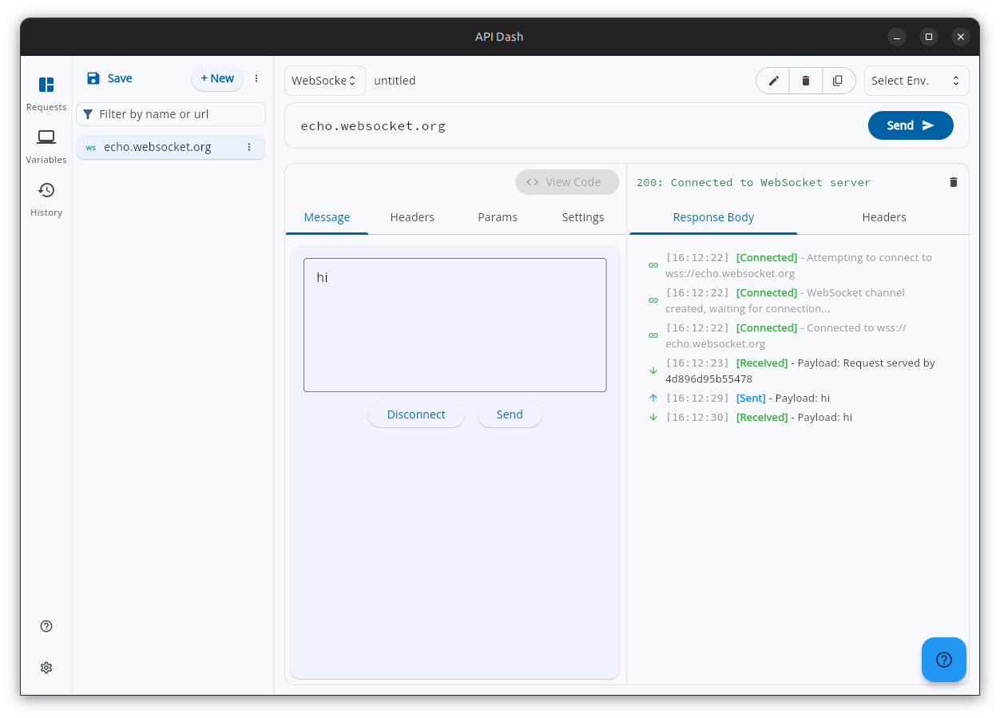
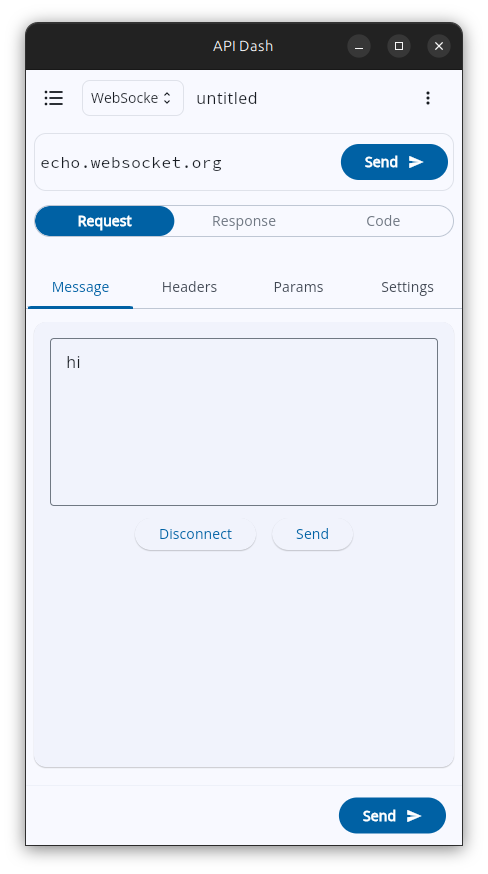
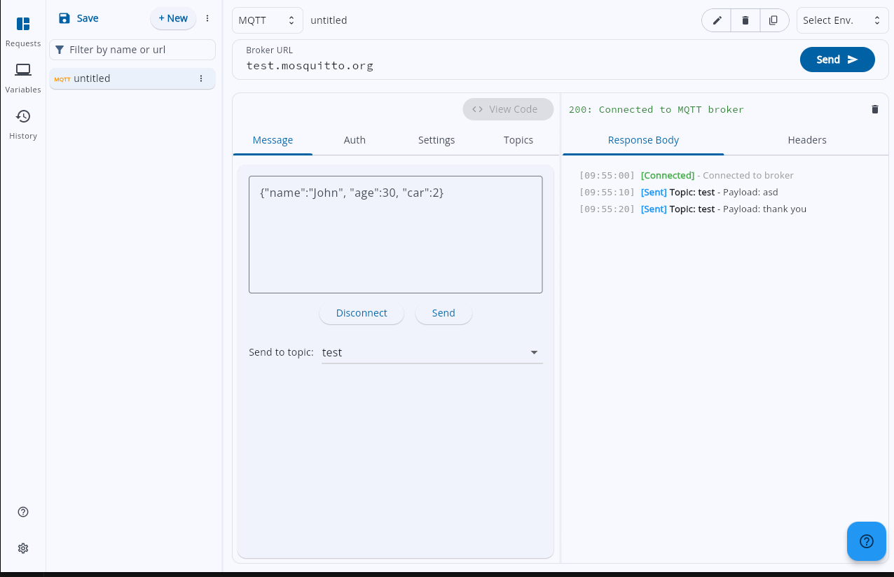
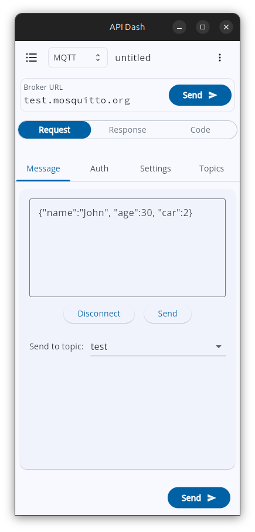
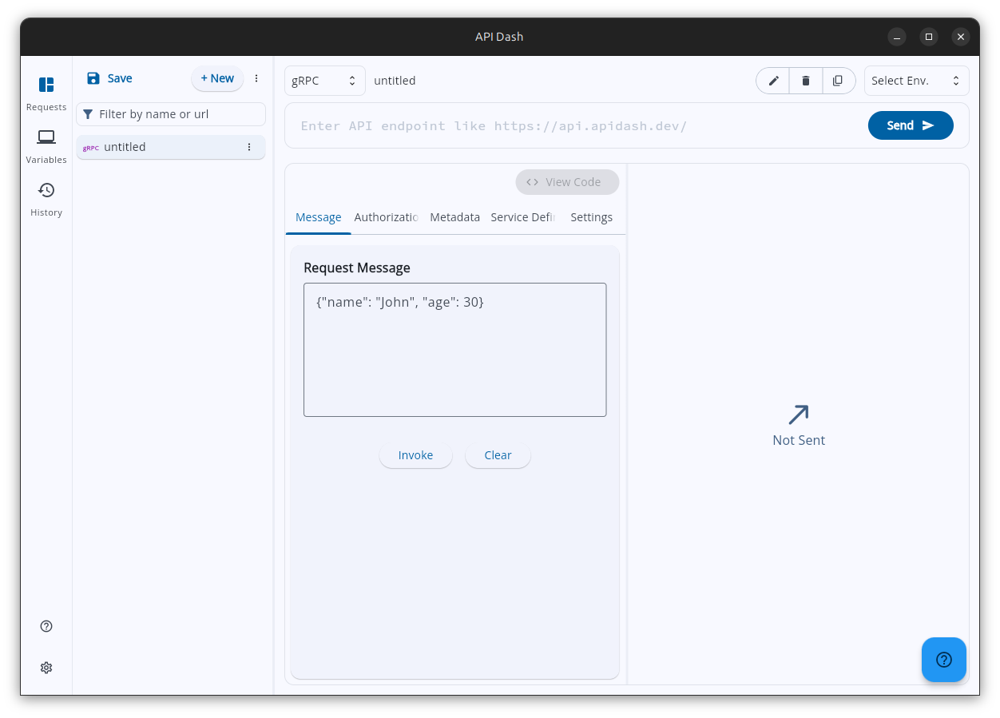
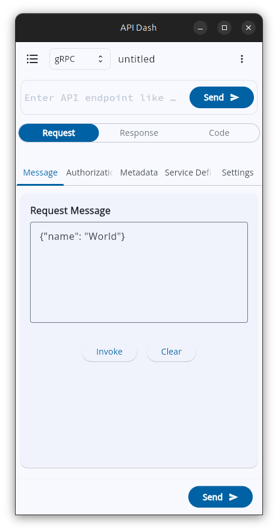

# WebSocket, MQTT , gRPC and CLI

### About

1. **Full Name:** Nikhil Ludder
2. **Contact Info:** +91 8708200907
3. **Discord Handle:** `badnikhil`
4. **GitHub Profile:** [https://github.com/badnikhil](https://github.com/badnikhil)
5. **LinkedIn:** [Nikhil Ludder](https://www.linkedin.com/in/badnikhil/)
6. **Time Zone:** GMT +05:30 (IST)
7. **Resume:** [Link](https://drive.google.com/file/d/1TtDq6t4nSLBefv_CyOUGLxXmY3EK9OWi/view?usp=sharing)

### University Info

1. **University Name:** KIET Group Of Institutions (KIET) , Ghaziabad , UP
2. **Program:** B.Tech, Computer Science and Engineering (AI&ML)
3. **Year:** 2nd Year
4. **Expected Graduation Date:** 2028

### Motivation & Past Experience

1. **Have you worked on or contributed to a FOSS project before?**  
   - Yes, I have actively contributed to API Dash, an open-source API development tool. I had started working on MQTT support earlier and opened a PR for it. While the PR was eventually closed , the process gave me a strong understanding of protocol integration challenges and influenced the architectural decisions in this proposal.

      My contributions include:

      - Implemented support for parameters with multiple values  
      - Worked on Swift code generation (Alamofire)  
      - Contributed to Rust code generation improvements  
      - Fixed UI issues (code pane horizontal scrolling ) 
      - Improved project documentation (README updates)  
      - Proposed and worked on new features like MQTT support  
2. **What is your one project/achievement that you are most proud of? Why?**
   - My most proud achievement is building an inventory management app from scratch during my internship. I developed it individually, which meant taking ownership of both the product experience and the implementation. What makes me most proud of it is that I did not approach it as just a coding task — I focused on creating a clear and practical user experience while also keeping the code modular and organized. Working on it taught me how good software depends not only on functionality, but also on thoughtful UX and maintainable structure. This experience strongly shaped the way I now think about building applications and contributing to projects like API Dash.

3. **What kind of problems or challenges motivate you the most?**
   - I am most motivated by challenges where I have to balance usability and implementation. I enjoy solving problems that make a product easier to use for users while also keeping the code modular and clean for future development. I like working on things that improve workflow, reduce complexity, and make software feel more polished and practical. These are the kinds of problems that keep me engaged because they create real value both for users and for the project itself

4. **Will you be working on GSoC full-time?**
   - Yes, I will be working on GSoC full-time. The program aligns well with my summer vacation, so I will be able to give it dedicated attention and maintain consistent progress throughout the coding period.

5. **Do you mind regularly syncing up with project mentors?**
   - Yes, I am comfortable with regularly syncing up with project mentors. Since I will be free throughout the day during the program, I can stay available for discussions, progress updates, and feedback whenever needed. I believe regular communication is important for keeping the work aligned with project expectations.

6. **What interests you the most about API Dash?**
   - What interests me most about API Dash is both the personal connection and the nature of the project itself. API Dash was my first open-source organization, and contributing to it was an important step in my growth as a developer. It gave me my first real experience with open-source collaboration and became the first project I could proudly mention on my resume for open-source contributions. That is one reason I feel genuinely connected to it. At the same time, I am drawn to API Dash because it is a practical developer tool where user experience, modularity, and maintainability truly matter, and those are exactly the aspects of software development that interest me the most.

7. **Can you mention some areas where the project can be improved?**
   - I think API Dash can be improved further by consistently making the overall experience more simplified for users. As an API client, it naturally includes many features, but the real challenge is presenting those features in a way that feels clear, smooth, and easy to understand. I believe there is strong scope for improving the UX by reducing friction in common workflows, organizing functionality more intuitively, and making powerful features feel more accessible rather than overwhelming. For me, that balance between capability and simplicity is one of the most important areas where API Dash can continue to improve.

---
## 1. Abstract
The goal of this project is to enhance API Dash by introducing support for WebSocket, MQTT, and gRPC, enabling developers to work with a broader range of modern communication protocols within a single API client. While API Dash already provides strong support for API testing and development workflows, many contemporary applications also depend on real-time, lightweight, and high-performance communication mechanisms that are not fully covered by traditional HTTP-focused tools.

This project will address that gap by designing and implementing protocol support in a way that is both technically robust and user-friendly. A major focus will be on keeping the interface simplified despite the added capabilities, so that users can interact with these protocols without unnecessary complexity. The implementation will also prioritize modularity and maintainability, ensuring that the new functionality integrates cleanly into the existing architecture and can support future enhancements more effectively.

By expanding protocol coverage while maintaining a strong emphasis on usability and code structure, this project aims to make API Dash a more complete and practical tool for developers working across diverse API ecosystems.

## 2. Detailed Description

The implementation of WebSocket, MQTT, and gRPC support in API Dash represents a significant leap from a traditional HTTP client to a comprehensive, multi-protocol communication suite. This section provides an exhaustive breakdown of the architectural shifts, protocol-specific engines, and user interface enhancements required to maintain API Dash's reputation for simplicity and power.

#### 2.1. Core Architectural Evolution: The "Protocol Agnostic" Shift

Currently, API Dash is optimized for the Request-Response cycle of REST and GraphQL. To support persistent, streaming, and RPC-based protocols, I will introduce a modular abstraction layer that decouples the UI from the underlying transport protocol.

**A. Unified Request Modeling & The ProtocolModel Rationale**
The existing `RequestModel` will be refactored into a polymorphic structure. To achieve this, I will introduce the `ProtocolModel` abstraction. 

**Why use `ProtocolModel`?**
1. **Type Safety & Polymorphism**: By having all protocol-specific models (WS, MQTT, gRPC) implement `ProtocolModel`, the core engine can handle any request type through a single interface without knowing the internal details of each protocol.
2. **Eliminating State Pollution**: Currently, `RequestModel` is tightly coupled with HTTP fields. If we simply added MQTT or gRPC fields to it, every REST request would carry empty MQTT/gRPC data. `ProtocolModel` allows us to "swap" the entire configuration block based on the `APIType`, keeping the state clean and lightweight.
3. **Extensibility**: If we want to add new protocols in the future (like AMQP or CoAP), we only need to create a new model that implements `ProtocolModel` and update the UI. The core collection management logic won't need a complete rewrite.
4. **Clean Code Architecture**: It separates "what" a request is (id, name, type) from "how" it works (protocol-specific parameters), following the Single Responsibility Principle.

``` dart
// lib/models/protocols/base_protocol_model.dart
abstract class ProtocolModel {
  String get id;
  APIType get type;
}

// lib/models/protocols/websocket_model.dart
@freezed
class WebSocketRequestModel with _$WebSocketRequestModel implements ProtocolModel {
  const factory WebSocketRequestModel({
    required String id,
    @Default(APIType.websocket) APIType type,
    required String url,
    @Default([]) List<WebSocketMessage> messageHistory,
    @Default({}) Map<String, String> customHeaders,
    @Default(false) bool autoReconnect,
  }) = _WebSocketRequestModel;
}

// lib/models/protocols/mqtt_model.dart
@freezed
class MQTTRequestModel with _$MQTTRequestModel implements ProtocolModel {
  const factory MQTTRequestModel({
    required String id,
    @Default(APIType.mqtt) APIType type,
    required String brokerUrl,
    required int port,
    String? clientId,
    String? username,
    String? password,
    @Default(MQTTVersion.v5) MQTTVersion version,
    @Default([]) List<String> subscribedTopics,
    @Default(false) bool useTLS,
  }) = _MQTTRequestModel;
}
```

**B. The Connection Manager (Service Layer)**
To handle long-lived connections, I will implement a `ConnectionManager` as a Singleton service. This service will maintain a registry of active connections, ensuring that:
1. Connections persist even when the user navigates between different requests in the sidebar.
2. Memory is managed effectively by closing idle connections based on a configurable timeout.
3. State changes (Connected, Disconnected, Error) are streamed back to the UI via Riverpod providers.

---

#### 2.2. WebSocket Implementation: Full-Duplex Real-Time Streaming

WebSockets require a stateful interaction model where the "Response" is not a single event but a continuous stream of frames.

**1. Transport Engine**
- **Library Selection**: I will utilize `web_socket_channel` due to its excellent abstraction over `dart:io` and `dart:html`, ensuring seamless functionality across Windows, macOS, Linux, and Web.
- **Handshake Customization**: Support for custom headers and sub-protocols during the initial HTTP upgrade request.
- **Heartbeat Mechanism**: Implementation of automated PING/PONG frames to keep connections alive through aggressive load balancers or firewalls.

**2. API Dash UI for WebSocket**



*Figure 1: WebSocket interface on desktop platform*



*Figure 2: WebSocket interface on mobile platform*

- **Stream Visualization**: A high-performance scrolling list using `ListView.builder` to handle thousands of messages without frame drops.
- **Directional UI**:
    - **Outgoing Messages**: Right-aligned, blue-tinted bubbles with "Sent" status and precision timestamps.
    - **Incoming Messages**: Left-aligned, green-tinted bubbles with "Received" status.
- **Message Inspection**: Clicking a message bubble will open a detailed inspector showing the raw frame data, opcodes (Text vs. Binary), and size in bytes.

**3. Binary Data Handling**
For developers working on low-level protocols or IoT, I will implement a "Binary Mode":
- **Hex Viewer**: Integration of a hex-dump visualization for non-UTF8 payloads.
- **Base64/Hex Input**: Allowing users to compose binary frames using hexadecimal strings or Base64 encoding.

---

#### 2.3. MQTT Implementation: The IoT Standard

MQTT (Message Queuing Telemetry Transport) follows a Publish/Subscribe pattern, which is fundamentally different from the 1-to-1 nature of HTTP.

**1. Broker Connectivity Engine**
- **Library Selection**: `mqtt_client` will be the backbone, providing support for MQTT v3.1, v3.1.1, and v5.0.
- **Advanced Security**:
    - **TLS/SSL**: Support for Secure Sockets.
    - **Certificate Management**: UI for uploading `.crt` and `.key` files for Mutual TLS (mTLS) authentication, common in industrial IoT environments.
- **Last Will and Testament (LWT)**: UI to configure the LWT message, topic, and QoS.

**2. API Dash UI for MQTT**



*Figure 3: MQTT interface on desktop platform*



*Figure 4: MQTT interface on mobile platform*

- **Subscription Dashboard**: A side-panel within the MQTT tab where users can manage multiple active subscriptions.
- **Wildcard Support**: Full support for `+` (single-level) and `#` (multi-level) wildcards.
- **Color Coding**: Each subscribed topic will be assigned a unique color, and incoming messages in the feed will be highlighted with that color for instant visual grouping.

**3. Publishing Workflow**
- **Topic Selector**: A searchable dropdown of previously used topics to speed up testing.
- **Payload Composition**: A multi-mode editor (Text, JSON, Hex) with syntax highlighting.
- **QoS Controls**: Detailed selection for:
    - **QoS 0**: At most once (Fire and forget).
    - **QoS 1**: At least once (Acknowledged).
    - **QoS 2**: Exactly once (Four-way handshake).

---

#### 2.4. gRPC Implementation: High-Performance Typed RPCs

gRPC requires a unique workflow involving Interface Definition Languages (IDL) and specialized serialization (Protobuf).

**1. The Protobuf Processing Engine**
- **Dynamic Parsing**: I will implement a service that accepts `.proto` files and uses the `protobuf` package to generate an in-memory descriptor set.
- **Service Discovery**: API Dash will parse the descriptors to list all available `Services` and their corresponding `Methods`.
- **Reflection Support**: For servers that support the gRPC Reflection Protocol, I will add a "Refresh" button that fetches service definitions directly over the wire, removing the need for local `.proto` files.

**2. API Dash UI for gRPC**

Instead of forcing users to write raw JSON for gRPC, I will build a dynamic form generator:



*Figure 5: gRPC interface on desktop platform*



*Figure 6: gRPC interface on mobile platform*

- **Type-Aware Inputs**: If a field is defined as `bool`, a toggle is shown. For `enum`, a dropdown. For `repeated` fields, a list-builder.
- **Validation**: Real-time validation against the Protobuf schema (e.g., preventing a string from being entered into an `int64` field).
- **Default Values**: Automatically pre-populating fields with their Protobuf defaults to minimize typing.

**3. Streaming Pattern UI**
gRPC supports four distinct patterns, each requiring a tailored UI:
- **Unary**: A simple Send/Receive flow.
- **Server Streaming**: A "Live Response" view where responses keep appearing as they are pushed by the server.
- **Client Streaming**: A "Commit" workflow where users push multiple messages and then "Close" the stream to receive the final response.
- **Bi-Directional**: An interleaved view showing both pushes and pops in chronological order, similar to the WebSocket console.

---

#### 2.5. User Experience (UX) Philosophy & Polishing

Adding three powerful protocols could easily lead to "feature bloat." I will prevent this through a strict **Context-First UI** design.

**A. Integration Code Generation (The "Codegen" Engine)**
I will extend the existing `codegen` module to generate production-ready snippets for the new protocols:
- **WebSocket**: Native JS, Dart (web_socket_channel), Python (websockets).
- **MQTT**: Python (paho-mqtt), Go (paho.mqtt.golang), Dart (mqtt_client).
- **gRPC**: Generated clients for Go, Dart, and Python including the necessary `protoc` command-line instructions.

**B. Global Interceptors & Scripting**
I will ensure that the existing Pre-request and Post-response scripting engine (JavaScript-based) works across all protocols:
- **WS Interceptors**: Modify outgoing frames programmatically.
- **MQTT Hooks**: Auto-respond to certain topics using scripts.
- **gRPC Metadata Scripts**: Dynamically generate Auth tokens for gRPC headers.

---

#### 2.6. Performance & Scalability Considerations

- **Memory Management**: Streaming protocols can generate large logs. I will implement a "Circular Buffer" for message history, allowing users to set a limit (e.g., 1000 messages) to prevent memory exhaustion during long soak tests. Circular Buffers are also used in Operating Systems at driver level for efficient data handling.
- **Isolate-Based Transport**: To keep the UI smooth, I will explore moving the core socket logic (especially for high-throughput MQTT) into Flutter **Isolates** (background threads). This prevents heavy serialization/deserialization logic from janking the main UI thread.
- **State Persistence**: Using the existing Hive-based storage, I will ensure that connection settings (but not necessarily large message histories) are persisted securely across app restarts.

---

#### 2.7. Technical Specification & Implementation Details

**A. WebSocket (WS/WSS) Protocol Suite**
WebSockets in API Dash will be implemented using a robust, layered architecture.

1. **Handshake Management**: 
   - Support for custom HTTP headers during the upgrade request. This is critical for APIs that require `Authorization` or `X-API-Key` during the initial handshake.
   - Sub-protocol negotiation (e.g., `v10.stomp`, `mqtt`, or custom protocols) via the `Sec-WebSocket-Protocol` header.

2. **Frame Handling & Serialization**:
   - **Text Frames**: Native UTF-8 support with real-time JSON pretty-printing.
   - **Binary Frames**: Implementation of a "Raw Mode" where users can view data as Hex, Base64, or Uint8Array.
   - **Ping/Pong Control**: Users can configure heartbeat intervals to prevent connection timeouts on load balancers with short idle periods.

3. **Message History & Logging**:
   - Every message will be stored with a high-precision timestamp (microseconds).
   - Export functionality to HAR (HTTP Archive) or custom JSON formats for easier debugging in external tools.

**B. MQTT  Implementation**

1. **Broker Connectivity Details**:
   - **Transport Layer**: Support for both standard TCP and WebSockets as the underlying transport for MQTT.
   - **Authentication Matrix**: 
     - No Auth (Anonymous)
     - Basic Auth (Username/Password)
     - Certificate-based Auth (mTLS) with file pickers for Client Certificate, Private Key, and CA Certificate.
   - **Session Persistence**: Configuration for "Clean Session" (v3.1.1) or "Session Expiry Interval" (v5.0).

2. **The Pub/Sub Interface**:
   - **Subscription Manager**: A dynamic list where users can subscribe to multiple topics (e.g., `sensors/+/temperature`, `commands/#`).
   - **Payload Formatting**: Intelligent detection of the payload type. If it's valid JSON, it gets syntax highlighting. If it's a Protobuf stream, it can be decoded using a provided `.proto` file (linking the MQTT and gRPC logic).

3. **MQTT v5.0 Specific Features**:
   - **User Properties**: Ability to send and receive custom key-value pairs in the packet header.
   - **Topic Aliasing**: Implementation of topic aliases to reduce bandwidth on repetitive messages.
   - **Payload Format Indicator**: Support for the new v5.0 header that explicitly states if the payload is UTF-8 or Binary.

**C. gRPC & Protocol Buffers (Protobuf) Depth**
gRPC implementation will focus on strict type safety and high-performance streaming.

1. **Descriptor Management**:
   - Instead of just parsing `.proto` files, API Dash will maintain a "Proto Library". Users can add folders of `.proto` files, and the app will resolve imports (e.g., `import "google/protobuf/timestamp.proto"`) correctly.
   - Support for `FileDescriptorSet` binary files generated by `protoc`.

2. **RPC Invocation Logic**:
   - **Deadlines & Timeouts**: UI to set per-call deadlines, crucial for testing gRPC's built-in timeout propagation.
   - **Compression**: Support for `gzip` and `deflate` message compression.
   - **Metadata (Headers)**: A dedicated tab for `grpc-metadata`, supporting both string and binary (trailing `-bin`) keys.

3. **Advanced Streaming Scenarios**:
   - **Flow Control**: Visual indicators of stream status (Active, Half-Closed, Closed).
   - **Error Handling**: Detailed gRPC error code mapping (e.g., `DEADLINE_EXCEEDED`, `PERMISSION_DENIED`, `UNAVAILABLE`) with the `Status-Message` and any `Status-Details` (any) messages returned by the server.

---

#### 2.8. User Experience (UX) & Design Rationale

API Dash's core value is its clean UI and Lightweight UX. Adding three protocols requires a "Polymorphic Design Pattern".

**1. The Intelligent Response Pane**:
Instead of a static "Response" tab, we introduce the **Event Stream View**:
- **Timeline Mode**: A vertical chronological list of events (Connect, Sent, Received, Disconnected).
- **Table Mode**: For high-frequency MQTT/WS data, a spreadsheet-like view where users can sort by Topic, Size, or Time.
- **Search & Filter**: A permanent filter bar at the top of the stream to quickly find messages matching a pattern.

**3. Code Generation (Codegen) Expansion**:
I will implement a "Protocol-to-Code" engine that supports(This is just for consistency, as the codegen feature is yet to be replaced):
- **WebSocket**: 
  - `dart` (web_socket_channel)
  - `python` (websockets library)
  - `js` (Browser Native & `ws` npm package)
- **MQTT**:
  - `python` (paho-mqtt)
  - `dart` (mqtt_client)
  - `c++` (Arduino/ESP32 snippets for IoT devs)
- **gRPC**:
  - `dart` (grpc package)
  - `go` (native grpc)
  - `python` (grpcio)
  It also Depends on whether the language have enough library support for these methods.I'll Cover all languages that does support.

---

#### 2.9. Engineering Challenges & Mitigation

**Challenge: Managing Flutter Web Limitations**
*Problem*: Flutter Web has restricted access to raw TCP sockets, affecting MQTT and gRPC.
*Solution*: I will implement a "Fallback to WebSockets" mode for MQTT and use `grpc-web` for gRPC calls when running in the browser.

**Challenge: Real-time Data Serialization Bottlenecks**
*Problem*: Decoding 1000+ JSON frames per second can cause UI jank.
*Solution*: I will use a **Worker Isolate Pool**. All message parsing (JSON, Protobuf) will happen on background threads, sending only the "ready-to-render" ViewModel back to the main UI thread.

**Challenge: Large File Descriptor Sets**
*Problem*: Complex gRPC services can have dozens of imported `.proto` files.
*Solution*: Implementation of a "Project-Level Proto Path" setting, where users define a root directory once, and API Dash handles recursive resolution of all imports.

---

#### 2.10. In-Depth Modular Component Architecture

To ensure the highest level of maintainability, I will divide the implementation into four distinct horizontal layers. This modular approach allows for independent testing and easier integration of future protocols.

**Layer 1: The Domain Models (Protocol Specifics)**
At the lowest level, I will define immutable data structures using the `freezed` package. This ensures that the application state is predictable and easy to debug.

- **WebSocket Domain**: Includes `WSOpCode` (Text, Binary, Close), `WSFrame` (payload, direction, timestamp), and `WSSession` (connection state, endpoint).
- **MQTT Domain**: Encompasses `MqttTopic`, `MqttQoS`, `MqttMessage` (with support for retained flags and duplicate delivery indicators), and `BrokerConfig`.
- **gRPC Domain**: Models the `ServiceDescriptor`, `MethodDescriptor`, `ProtoDefinition`, and `RpcInvocation` (tracking the lifecycle of a single call).

**Layer 2: The Infrastructure Layer (Transport Engines)**
This layer houses the actual network clients. Each client will be wrapped in a "Guard" that handles platform-specific nuances (e.g., using `dart:io` for Desktop and `dart:html` for Web).

- **The WebSocket Guard**: Manages the `WebSocketChannel`. It will include an "Auto-Reconnect" state machine that uses exponential backoff to restore connections during network instability.
- **The MQTT Guard**: Wraps the `MqttClient`. It will handle the complex MQTT v5.0 handshake and session persistence logic, abstracting away the low-level byte-array processing from the rest of the app.
- **The gRPC Guard**: A specialized client that handles the generation of HTTP/2 requests and the parsing of Protobuf-encoded responses. It will support both standard gRPC and `grpc-web` for maximum platform compatibility.

**Layer 3: The State Management Layer (Riverpod Notifiers)**
I will use Riverpod's `StateNotifier` to synchronize the network state with the UI.

- **`ActiveConnectionProvider`**: A global registry that tracks which requests have open connections. This allows for a "Live" status indicator in the sidebar history.
- **`MessageStreamProvider`**: A family-based provider that maintains a buffered list of messages for each active session. It will implement a "Circular Buffer" to prevent memory leaks during high-frequency data streams.
- **`ProtoLibraryProvider`**: A specialized store for parsed Protobuf descriptors, enabling service discovery across multiple requests.

**Layer 4: The Presentation Layer (Polymorphic Widgets)**
The UI will be built using a "Plug-and-Play" architecture. The `EditorPane` will act as a host for protocol-specific "Request Panes."

- **`MqttRequestPane`**: Features a dual-pane layout—one for managing persistent subscriptions and another for composing and publishing messages.
- **`WsRequestPane`**: Centered around a "Live Console" that provides a real-time, bi-directional view of the data stream.
- **`GrpcRequestPane`**: Utilizes a dynamic "Form Builder" that automatically generates input fields from `.proto` definitions.

---

#### 2.11. Comprehensive Engineering Challenges & Deep-Dive Solutions

**A. Challenge: Handling High-Throughput Streaming Data**
*Scenario*: An MQTT broker sending 500+ small telemetry packets per second.
*Impact*: The Flutter main thread becomes saturated with UI re-renders, causing the app to freeze.
*Solution*: I will implement a **Batching & Throttling Strategy**.
1. **Background Deserialization**: Incoming raw bytes will be sent to a background Isolate for decoding.
2. **Buffer Accumulation**: Messages will be collected in a buffer.
3. **Throttled Dispatch**: The UI will only be notified of new messages at a fixed interval (e.g., every 100ms), sending a batch of messages instead of individual events. This dramatically reduces the number of widget rebuilds.

**A. Challenge: Cross-Platform Protocol Support (Web vs. Desktop)**
*Scenario*: Raw TCP (required for standard MQTT/gRPC) is not available in browsers.
*Solution*: I will implement a **Transport Selection Logic**.
- **For Desktop**: Use native TCP sockets for maximum performance and compatibility with all MQTT/gRPC servers.
- **For Web**:
    - For MQTT: Automatically attempt to connect via WebSockets (standard for MQTT-over-WS).
    - For gRPC: Utilize `grpc-web` proxies, providing a seamless experience for the user regardless of the platform.

**B. Challenge: Protobuf Import Resolution**
*Scenario*: A `.proto` file importing other files from nested directories (e.g., `import "common/types.proto"`).
*Solution*: I will build a **Virtual File System (VFS)** for Protobuf. When a user adds a directory of `.proto` files, API Dash will build a dependency graph. During parsing, the custom `DescriptorRetriever` will resolve imports by looking up the VFS, ensuring that complex, multi-file services are supported without manual configuration.

**C. Challenge: Memory Leakage in Persistent Sessions**
*Scenario*: A user leaves a WebSocket connection open for hours, accumulating thousands of messages in memory.
*Solution*: Implementation of **State Eviction Policies**.
- **Soft Limit**: After 1000 messages, the oldest messages are moved to a temporary disk cache (Hive).
- **Hard Limit**: After 5000 messages, the oldest messages are purged entirely, with a notification to the user.
- **Auto-Disconnect**: An optional setting to disconnect idle sessions after a user-defined period.

---

#### 2.12. User Experience (UX) Rationales & Design Patterns

**1. The "Terminal-Style" Console**
For streaming protocols, the static "Response Body" view is insufficient. I will build a `StreamTerminal` widget that provides:
- **Timestamp Toggle**: Show/hide precision timing for each message.
- **Search & Regex**: Quickly find specific patterns in a massive stream.
- **Message Grouping**: Automatically group repetitive messages (e.g., "Heartbeat [x50]") to reduce clutter.

**2. Visual Connection States**
I will implement a "Connection Pulse" system.
- **Gray**: Idle / Never connected.
- **Pulsing Yellow**: Handshaking / Connecting.
- **Solid Green**: Connected and active.
- **Red**: Connection error with a tooltip showing the specific error code (e.g., MQTT Return Code 4: Bad Username/Password).

---

#### 2.14. CLI Technical Architecture

**A. Package Structure**
```
packages/apidash_cli/
├── bin/apidash.dart
├── lib/
│   ├── commands/
│   │   ├── run_command.dart
│   │   ├── create_command.dart
│   │   ├── ws_command.dart
│   │   ├── mqtt_command.dart
│   │   └── grpc_command.dart
│   ├── models/
│   │   └── cli_models.dart
│   ├── utils/
│   │   └── cli_utils.dart
│   └── core/
│       ├── cli_config.dart
│       └── output_formatter.dart
```

**B. Core Components**
- **Command Router**: Handles command parsing and routing using Dart's `args` package
- **Configuration Manager**: Manages CLI settings, profiles, and connection to API Dash data
- **Output Formatter**: Supports JSON, YAML, table, and colored terminal outputs
- **Progress Indicators**: Real-time feedback for long-running operations

**C. CLI Command Examples**
```bash
# Basic operations
apidash run <request-id> --format json
apidash list --type websocket --output table
apidash create --type mqtt --name "IoT Test" --url "mqtt://localhost:1883"
apidash delete <request-id>

# Protocol-specific commands
apidash ws connect --url "ws://echo.websocket.org" --send "Hello World"
apidash mqtt subscribe --topic "sensors/+/temperature" --broker "mqtt://localhost:1883"
apidash grpc call --service "UserService" --method "GetUser" --proto "user.proto" --data '{"id": 123}'

# Advanced operations
apidash export --format har --output collection.har
apidash import --file postman_collection.json
apidash test-suite --file test_config.yaml
```

**D. CLI-GUI Integration**
- Shared Hive database for request storage
- Real-time configuration synchronization
- Consistent request models across interfaces
- Cross-platform compatibility (Windows, macOS, Linux)

**E. Technical Implementation Details**
- Use Dart's `io` package for cross-platform compatibility
- Implement shell completion scripts (bash, zsh, fish)
- Add color-coded output using `ansi` package
- Support for environment variables and configuration files
- Error handling with helpful messages and suggestions

---


#### 2.13. Final Technical Deliverables & Milestones

**Milestone 1: The Multi-Protocol Core (Week 2)**
- Successful refactor of `RequestModel` into a polymorphic structure.
- Implementation of the `BaseProtocolClient` interface.
- Basic UI switching logic verified with unit tests.

**Milestone 2: The WebSocket Engine (Week 4)**
- Bi-directional text and binary frame support.
- Live message console with filtering and export capabilities.
- Codegen for Dart, JS, and Python.

**Milestone 3: The IoT (MQTT) Suite (Week 8)**
- Full MQTT v3.1.1 and v5.0 support.
- Dynamic subscription manager with multi-topic visualization.
- TLS/SSL and Certificate management for industrial security.

**Milestone 4: Completion of gRPC  (Week 12)**
- Dynamic `.proto` parsing and service discovery.
- No-code form generation for complex RPC calls.
- Support for Unary and all three streaming patterns (Server, Client, Bi-Di).
- Comprehensive documentation and final project report.

**Milestone 5: API Dash CLI Implementation (Week 14)**
- Comprehensive CLI tool for headless operations.
- Support for REST, WebSocket, MQTT, and gRPC via command line.
- CLI-GUI data synchronization and automation features.
---

### 3. Detailed Weekly Timeline

This timeline covers 14 weeks of coding plus community bonding period.

#### Phase 0: Community Bonding (May 4 - June 1)
- **Week 1-2**: Deep dive into `apidash_core` internals. Discuss the `RequestModel` refactor with mentors to ensure backward compatibility with existing REST collections.
- **Week 3-4**: Finalize the UI/UX mockups in Figma for the new protocol tabs. Research edge cases for `mqtt_client` on Desktop platforms.

#### Phase 1: Foundation & WebSocket (June 2 - June 29)
- **Week 1**: **Core Refactor**. Modify `APIType` and `RequestModel`. Implement the protocol switching logic in `EditorPane`.
- **Week 2**: **WS Connectivity**. Integrate `web_socket_channel`. Implement the background service to keep connections alive during navigation.
- **Week 3**: **WS Message UI**. Build the chat-like message feed. Implement "Clear History" and "Export Log" features.
- **Week 4**: **WS Polish**. Add support for custom headers in WS handshake. Implement WS code generation for Dart and JS. **Milestone: Beta WebSocket Support.**

#### Phase 2: MQTT Integration (June 30 - July 27)
- **Week 5**: **Broker Engine**. Implement the MQTT connection logic with support for Username/Password and TLS.
- **Week 6**: **Pub/Sub Logic**. Build the subscription manager. Handle incoming messages on multiple topics and route them to the UI.
- **Week 7**: **MQTT UI**. Create the dedicated MQTT configuration tab. Implement QoS and Retain flags.
- **Week 8**: **MQTT Testing**. Test against AWS IoT and HiveMQ brokers. Add MQTT code generation (Python/Paho, Dart/MqttClient). **Milestone: Stable MQTT Support.**

#### Phase 3: gRPC Power-up (July 28 - August 24)
- **Week 9**: **Proto Engine**. Implement the `.proto` file uploader and parser. Generate a JSON schema from Proto definitions.
- **Week 10**: **Dynamic Forms**. Build the UI that renders input fields based on Proto types. Support for nested messages and enums.
- **Week 11**: **gRPC Streaming**. Implement Server-side and Bi-directional streaming logic. Build the stream visualization pane.
- **Week 12**: **Metadata & Reflection**. Add gRPC Metadata (headers) support. Implement gRPC Reflection for auto-discovery. **Milestone: Full gRPC Support.**

#### Phase 4: CLI Implementation (September 8 - September 21)
- **Week 13**: **CLI Core Development**
  - Set up CLI package structure using Dart's `args` package
  - Implement basic commands: `run`, `list`, `create`, `delete`
  - Add protocol-specific commands for WebSocket, MQTT, gRPC
  - Create configuration management system

- **Week 14**: **CLI Polish & Integration**
  - Add advanced features: batch operations, export/import
  - Implement CLI-GUI data synchronization
  - Create comprehensive CLI documentation
  - Integration testing and bug fixes
  - Final project report and documentation

---

### 4. Technical Challenges & Solutions

**Challenge 1: State Management of Persistent Connections**
*Problem*: If a user switches from a WebSocket request to a REST request, the WebSocket connection shouldn't close.
*Solution*: I will move the active connection instances to a global `ConnectionManager` service that exists outside the UI lifecycle, indexed by the Request ID.

**Challenge 2: Dynamic Proto Parsing**
*Problem*: Parsing `.proto` files in a Flutter app without external CLI tools.
*Solution*: I will use the `protobuf` package and explore using a WASM-based parser if necessary to handle complex definitions directly in-app.

**Challenge 3: High-Frequency Data UI**
*Problem*: MQTT/WS can send hundreds of messages per second, which can lag the Flutter UI.
*Solution*: I will implement a "Throttled Rendering" strategy for the message feed, ensuring the UI only updates at 60fps even if data arrives faster.

---

### 5. Testing Strategy

- **Unit Tests**: Testing the serialization/deserialization of new Models (`MQTTRequestModel`, etc.).
- **Mock Servers**: Using `mock_web_socket_server` and local Mosquitto brokers for integration tests.
- **UI Tests**: Ensuring the polymorphic UI correctly swaps components when the protocol is changed.
---

### 6. Final Deliverables
- Functional WebSocket, MQTT, and gRPC clients integrated into API Dash.
- Real-time message visualization UI for streaming protocols.
- Automated code generation for the new protocols.
- Comprehensive CLI tool for headless API Dash operations
- Comprehensive unit and integration tests.
