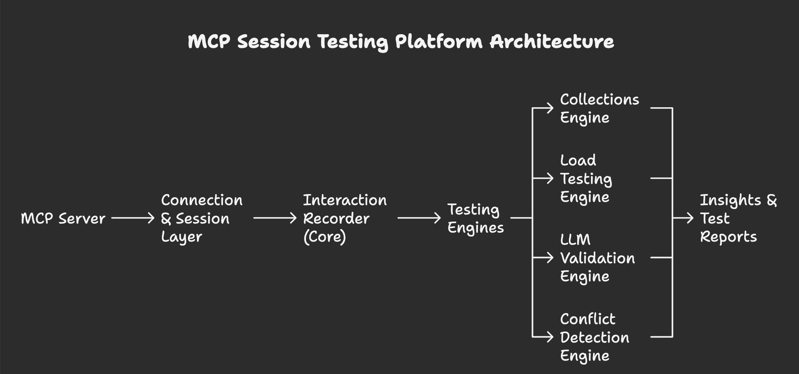
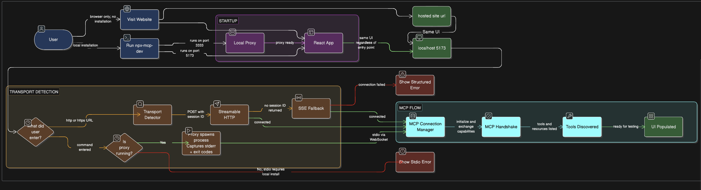
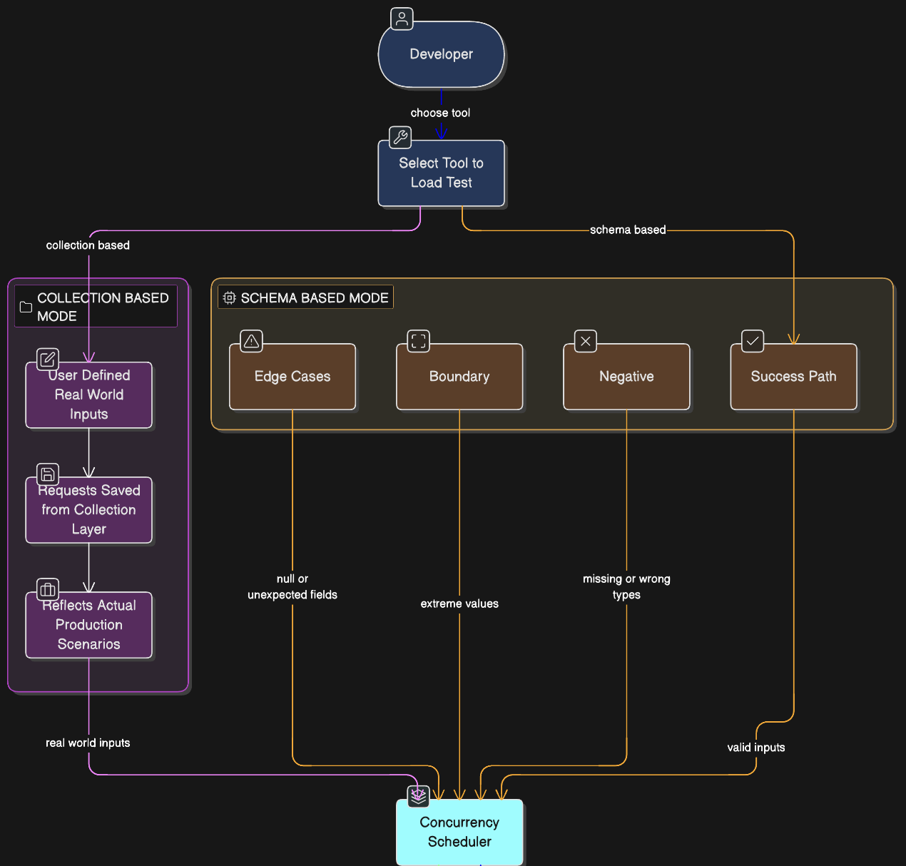
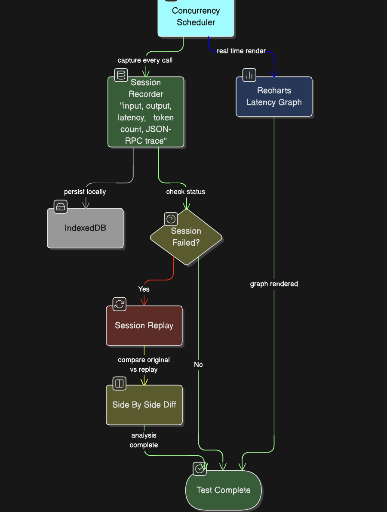
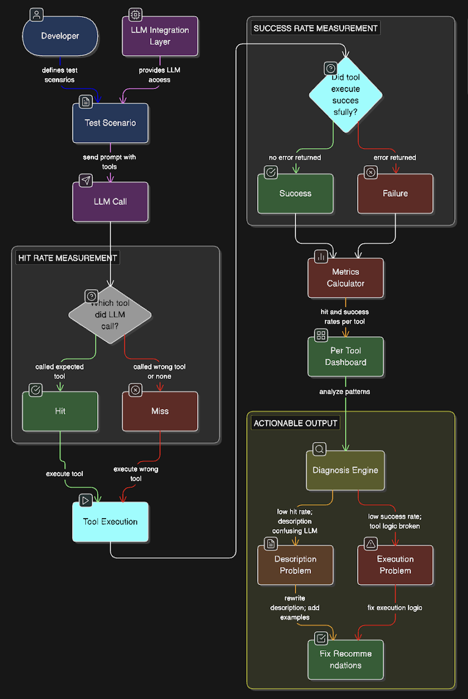
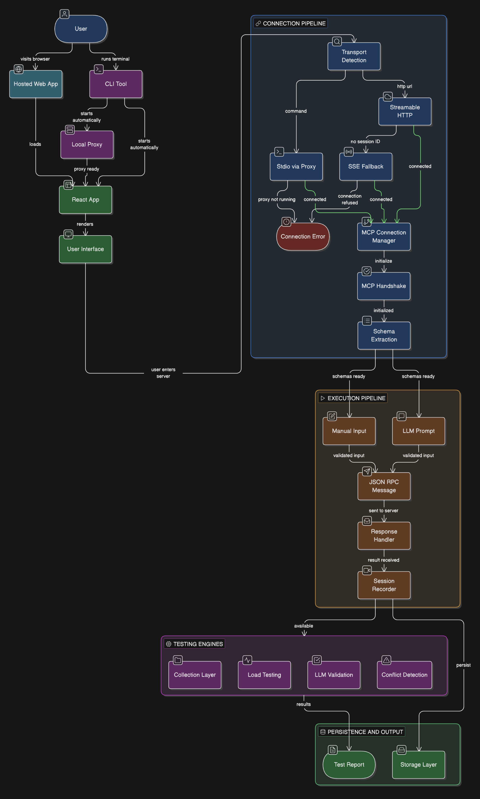

# GSOC Proposal

## About

- **Full Name:** Prajwal Benedict Norman
- **Contact Info:** [normanprajwal@gmail.com] | +91 8795675593
- **Discord Handle:** prajwal8767
- **Blog:** None
- **GitHub:** [https://github.com/PrajwalBenedictNorman]
- **LinkedIn:** [https://www.linkedin.com/in/prajwalbnorman]
- **Time Zone:** GMT+5:30 (IST)
- **Resume:** [https://drive.google.com/file/d/1uTs59u2OwAz8frNh2o_TYuf3VOPij-Rm/view?usp=sharing]

# University Info

1. University name - Dehradun Institute of Technology
2. Program - Bachelor of Technology in Computer Science
3. Year - 2nd
4. Expected graduation date - 2028

# Motivation & Past Experience

1. Have you worked on or contributed to a FOSS project before? Can you attach repo links or relevant PRs?
    - I have prior experience contributing to collaborative open source programs such as GirlScript Summer of Code, where my pull requests involving editor and UI improvements were reviewed and merged.
    More recently, I have been actively engaging with the API Dash repository exploring the codebase in depth, participating in community discussions, and familiarizing myself with the project's architecture and contribution workflow. I am currently working towards making direct code contributions to the repository as well.
2. What is your one project/achievement that you are most proud of? Why?
    - My most proud project is **EthLink** — a self-custodial Ethereum wallet platform that I built end-to-end. ([GitHub](https://github.com/PrajwalBenedictNorman/EthLink)) It implements client-side encryption for private keys and supports the full wallet lifecycle, including key generation, secure backup, balance tracking, and transaction signing. What I found most interesting was designing the developer-facing SDK, which enables applications to integrate wallet functionality through an OAuth-style flow without managing keys themselves. This required thinking carefully about security boundaries, protocol interactions, and developer experience.Through this project, I gained hands-on experience with cryptographic primitives, Ethereum's signing model, and building structured developer tooling.
3. What kind of problems or challenges motivate you the most to solve them?
    - I'm most motivated by problems that involve real systems with multiple moving parts especially where there's no clear solution upfront and I have to figure things out by experimenting and iterating. For example, while building my MCP testing PoC, handling concurrent requests and keeping the UI responsive required multiple iterations and debugging genuinely unexpected behaviour.I enjoy working on developer tooling and infrastructure-level problems, where the challenge isn't just writing code but designing something reliable, usable, and extensible. This includes working with APIs, integrating systems, and building abstractions that others can depend on.I'm particularly drawn to situations where I need to explore unfamiliar codebases, debug unexpected behaviour, and break complex problems into smaller, solvable pieces. Watching something evolve from an initial idea into a working system that others can interact with is what keeps me engaged long-term.
4. Will you be working on GSoC full-time? In case not, what will you be studying or working on while working on the project?
    - Yes, I will be working on GSoC full-time. The GSoC period coincides with my summer break, so I will have no academic commitments or distractions and can dedicate my complete focus to the project.
5. Do you mind regularly syncing up with the project mentors?
    - Not at all I genuinely value mentor feedback and regular sync-ups. I am available from 12:00 PM to 1:00 AM IST and can schedule calls or meetings at any time within that window based on what works best for the mentors.
6. What interests you the most about API Dash?
    - What interests me most about API Dash is its strong focus on being a lightweight, developer-centric tool that prioritises usability without adding unnecessary complexity. The emphasis on clean UI/UX for API testing makes it intuitive for developers to experiment, debug, and iterate quickly.I also find the direction towards supporting emerging workflows like MCP particularly interesting, as it goes beyond traditional API testing and moves into enabling agent-driven systems. This aligns closely with my interest in improving developer tooling for such ecosystems.
7. Can you mention some areas where the project can be improved?
    - While API Dash already shows basic response metadata like time taken for individual requests, there is scope to improve observability at a broader level. Having visibility into response timing trends across repeated executions or patterns in request behaviour over time would help developers better understand performance, instead of relying on a single data point per request.
8. Have you interacted with and helped API Dash community? (GitHub/Discord links)
    - I have been actively following the API Dash repository on GitHub, exploring the codebase, going through open issues and discussions, and familiarising myself with the project's architecture and contribution workflow. I have joined the API Dash Discord server and am in the process of engaging more actively with the community. I look forward to becoming a consistent and helpful presence throughout the GSoC period and beyond.

# Project Proposal Information

- Project Title - MCP Testing
    - [#1054]([#1] MCP Testing)
- **Issue Description:**
    
    Developers building MCP servers or agent-driven workflows currently lack reliable testing workflows for validating behaviour over time. While tools such as MCPJam, MCP Inspector, mcp-tef, and MCPCat provide useful capabilities, they address only isolated parts of the testing lifecycle. As a result, developers often need to switch across multiple tools to fully validate a single MCP integration.
    
    This fragmentation leaves several critical gaps before production deployment:
    
    1. **No reusable test scenarios** — tool inputs and configurations are session-bound, making it difficult to organise, share, or replay structured testing workflows across development cycles.
    2. **No production-like simulation** — developers cannot simulate concurrent usage patterns, observe performance degradation under load, or deterministically replay failed interactions for debugging.
    3. **No LLM-level validation** — tools are typically tested in isolation, without measuring whether a language model would select and execute the correct tool for realistic user prompts. Metrics such as tool selection accuracy (hit rate) and execution success are not captured by existing utilities.
    4. **No multi-server conflict detection** — when combining tools from multiple MCP servers, overlapping names or semantically similar descriptions can lead to incorrect tool invocation in production. Current tooling does not help developers identify or resolve such conflicts proactively.
- **Abstract:**
    
    This project proposes a lightweight MCP session testing platform that enables developers to record, replay, and validate interaction workflows while developing Model Context Protocol servers. The system introduces reusable testing scenarios, behavioural validation, performance simulation, and tool conflict analysis within a single local-first environment aligned with the API Dash ecosystem. By making MCP interactions reproducible and observable during development, the platform improves reliability and developer confidence before production deployment.
    
    
    

## Detailed Project Description

## Product Workflow

Current MCP testing tools force developers into fragmented workflows — re-entering inputs every session, manually tracking results, and switching between multiple utilities to validate different behaviours. This platform replaces that process with a single workflow where every interaction is automatically recorded, reusable, and debuggable.

---

### Connecting to an MCP Server

A developer begins by running:

```tsx
npx mpc-dev
```

This starts the React testing interface alongside a local Node.js proxy. The proxy connects to any MCP server over stdio, SSE,or Streamable HTTP using the official @modelcontextprotocol/sdk .

Once connected, the platform fetches available tools and their input schemas immediately.No additional configuration is required developers can start testing tools as soon as the connection is established.

All JSON-RPC communication between the interface, language model, and MCP server flows through a central session layer that powers the rest of the platform.

---

### Recording Interaction Sessions(Core Capability)

Every tool interaction is captured automatically during testing. Each recorded session includes:

- the exact inputs sent
- the tool selected by the model
- the full server response
- latency, token usage, stderr output, and process exit state

Sessions are stored locally in IndexedDB and can be replayed against the live server with identical inputs. Failures that only appear after repeated calls — the kind that are nearly impossible to reproduce manually become fully debuggable.Every other feature in the platform builds on these recordings.

---

### Organising Reusable Testing Scenarios(Collections Engine)

Recorded sessions can be saved into named collections and reused across testing runs. Developers can adjust parameters, define expected outcomes, and keep multiple scenario variations for regression testing.

Saving a request never clears the form a data loss bug present in every existing MCP testing tool. Collections export as JSON for team sharing and version control.

---

### Simulating Production Usage Patterns(Load Testing Engine)

Most MCP servers are tested one call at a time during development. Real agent workflows fire multiple concurrent requests. This engine bridges that gap.

Tests run in two modes:

- collection-based: saved real sessions replayed at configurable concurrency
- schema-based: inputs auto-generated from tool schemas covering valid inputs, missing fields, wrong types, and edge cases no manual input needed

Latency is plotted live as concurrency increases, showing exactly where the server starts struggling. Any failed session can be replayed with the exact same input to reproduce the failure.

---

### Evaluating Behaviour with Real Language Models (LLM Validation Engine)

Calling tools directly skips the most important question “will the LLM actually pick the right tool when a real user sends a real prompt?”

This engine sends natural language prompts to Claude, GPT-4o, Gemini, or Ollama with the server's tools available and records what happens:

- which tool the model picked
- whether the call succeeded
- how behaviour changes across models or prompt variations

Two metrics are tracked per tool hit rate and success rate. Tracking them separately tells developers whether the problem is a bad tool description or broken execution logic.

---

### Detecting Ambiguity Across Multiple MCP Servers (Conflict Detection Engine)

When combining a custom server with third-party servers like GitHub or Slack, the LLM sees all tools at once. Name collisions and similar descriptions cause it to pick wrong tools silently and
nobody finds out until users complain.

This engine loads multiple servers and checks three things:

- exact name collisions across servers
- descriptions too vague for reliable tool selection
- semantically similar descriptions using embedding cosine similarity

Each issue comes with a specific fix rename this tool, rewrite this description, add parameter context here.

---

### Reviewing Results

Every test run produces results that can be inspected, compared to previous runs, and exported as JSON. Developers can trace what happened in any session, replay failures, and see how server behaviour changes after each code update.

The goal is simple know how your MCP server works before it reaches production.

## **Technical Details:**

1. Core Connectivity Layer
    
    The Core Connectivity Layer manages communication between the testing interface and one or more connected MCP servers. It ensures session isolation, consistent message routing, and transport abstraction across stdio, SSE, and Streamable HTTP connections.
    
    
    
    Parts of Connectivity Layer:-
    
    - Proxy Layer (for stdio/sse calls):-The proxy maintains a session routing table mapping each connected server to its own isolated child process, enabling multiple MCP servers to be connected simultaneously without message cross-contamination a core requirement for the Conflict Detection Engine.
    
    ```tsx
    const wss = new WebSocketServer({ port: 3333 })
    
    wss.on('connection', (ws, req) => {
      console.log('Browser connected to proxy')
    
      const params = new URLSearchParams(
        parse(req.url ?? '').query ?? ''
      )
      const command = params.get('command')
    
      if (!command) {
        ws.close()
        return
      }
    
      const parts = command.split(' ')
      const cmd = parts[0]
      const args = parts.slice(1)
    
      if (!cmd) {
        ws.close()
        return
      }
    
      const proc: ChildProcess = spawn(cmd, args, {
        shell: true
      })
    
      let serverReady = false
      const messageQueue: string[] = []
      let buffer = ''
    
      // stdout handler with buffering
      proc.stdout?.on('data', (chunk: Buffer) => {
        buffer += chunk.toString()
        const lines = buffer.split('\n')
        buffer = lines.pop() ?? ''
    
        lines.forEach(line => {
          if (line.trim() && ws.readyState === ws.OPEN) {
            console.log('Server → Browser:', line)
            ws.send(line)
          }
        })
      })
    
      // stderr = server is ready
      proc.stderr?.on('data', (chunk: Buffer) => {
        const msg = chunk.toString()
        console.log('Server stderr:', msg)
    
        if (!serverReady) {
          serverReady = true
          console.log('Server ready — flushing queued messages')
    
          // Flush all queued messages now server is ready
          messageQueue.forEach(msg => {
            proc.stdin?.write(msg + '\n')
          })
          messageQueue.length = 0
        }
      })
    
      // Queue messages until server is ready
      ws.on('message', (data: Buffer) => {
        const msg = data.toString()
        console.log('Browser → Server:', msg)
    
        if (!serverReady) {
          console.log('Server not ready — queuing message')
          messageQueue.push(msg)
        } else {
          proc.stdin?.write(msg + '\n')
        }
      })
    
      ws.on('close', () => {
        console.log('Browser disconnected from proxy')
        proc.kill('SIGTERM')
      })
    
      proc.on('exit', (code: number | null) => {
        console.log(`Server exited: ${code}`)
        if (ws.readyState === ws.OPEN) {
          ws.close()
        }
      })
    })
    ```
    
    - Transport Layer:-It handles three transport protocols (stdio, SSE, and Streamable HTTP), auto detects the correct transport from user input, and manages the full connection lifecycle from handshake to graceful disconnect.
        - Auto Detection
        
        ```tsx
        export function detectTransport(input: string) {
          if (input.startsWith('http://') || 
              input.startsWith('https://')) {
            return 'streamable-http'
          }
          return 'stdio'
        }
        ```
        
        - Streamable HTTP with SSE Fallback
        
        ```tsx
        async function connectHTTP(url: string) {
          // Try Streamable HTTP first
          const res = await fetch(url, {
            method: 'POST',
            headers: {
              'Content-Type': 'application/json',
              'Accept': 'application/json, text/event-stream'
            },
            body: JSON.stringify({ 
              jsonrpc: '2.0', 
              method: 'initialize' 
            })
          })
          // Streamable HTTP returns session ID
          // No session ID = server only speaks SSE
          const sessionId = res.headers.get('Mcp-Session-Id')
          if (!sessionId) {
            return connectSSE(url)  // fallback
          }
          return { transport: 'streamable-http', sessionId }
        }
        // SSE fallback
        function connectSSE(url: string) {
          const source = new EventSource(url)
          return { transport: 'sse', source }
        }
        ```
        
        - Stdio via WebSocket to Proxy server
        
        ```tsx
        async function connectStdio(command: string) {
          const ws = new WebSocket('ws://localhost:3333')
          ws.onopen = () => {
            // Send command to proxy
            // Proxy spawns it as child process
            ws.send(JSON.stringify({
              type: 'connect',
              sessionId: crypto.randomUUID(),
              command  // e.g. "npx @mcp/server-filesystem /tmp"
            }))
          }
          ws.onerror = () => {
            throw new Error(
              'Proxy not running. Use npx mcp-dev ' +
              'to enable stdio support.'
            )
          }
          return { transport: 'stdio', ws }
        }
        ```
        
2. Schema Extraction Layer:-When a connection is established, the tool automatically calls tools/list and extracts the input schema for every registered tool.
    
    These schemas are used in two ways:
    
    - The UI renders correct input fields dynamically based on declared parameter types (`string`, `number`, `object`, `array`).
    - User input is validated client-side before sending any JSON-RPC request
    
    This catches type mismatches and missing required fields before they reach the server preventing cryptic error -32602 responses that existing tools surface with no actionable guidance.
    
3. Input Layer:-The Input Layer handles two paths — manual and LLM-driven. In the manual path, user input is taken from rendered schema fields, validated client-side against the tool schema, and converted to a JSON-RPC tools/call message.In the LLM-driven path, a natural language prompt is sent to the connected LLM with all available tools the LLM decides which tool to call and generates the arguments, which are then intercepted, validated against the same schema, and forwarded to the server.
    - LLM Path
    
    ```tsx
    // LLM decides tool + arguments
    const response = await llm.chat({
      messages: [{ role: 'user', content: prompt }],
      tools: availableTools  // from schema extraction
    })
    // Intercept LLM tool call decision
    const { name, arguments: args } = response.tool_call
    // Validate against schema before sending
    const validated = validateAgainstSchema(args, toolSchema)
    // Convert to JSON-RPC
    const jsonrpc = {
      jsonrpc: '2.0',
      id: crypto.randomUUID(),
      method: 'tools/call',
      params: { name, arguments: validated }
    }
    ```
    
4. Response + Error Layer:-Every tool response passes through the Response and Error Layer before reaching the UI. On the success path the JSON-RPC response is parsed and displayed with full trace. On the failure path error codes are mapped to human readable messages — -32602 becomes "Invalid arguments for tool X: expected object, received string" instead of a raw JSON dump. For stdio servers, stderr output and process exit codes captured by the proxy are surfaced as structured diagnostics. Requests exceeding 30 seconds are marked as timeout with a warning that
most LLM clients will have already abandoned the call.
    
    ```tsx
    function handleResponse(response: JSONRPCResponse) {
      // Success path
      if (!response.error) {
        return { status: 'success', result: response.result }
      }
      // Failure path — map to human readable
      const errorMap: Record<number, string> = {
        [-32600]: 'Invalid JSON-RPC request',
        [-32601]: `Tool "${response.id}" not found`,
        [-32602]: 'Invalid arguments — check parameter types',
        [-32603]: 'Internal server error',
      }
      return {
        status: 'failure',
        message: errorMap[response.error.code] 
          ?? `Unknown error: ${response.error.message}`,
        raw: response.error  // still show raw for advanced users
      }
    }
    // stderr from proxy
    ws.onmessage = (event) => {
      const msg = JSON.parse(event.data)
      if (msg.type === 'stderr') {
        showError(`Server error: ${msg.message}`)
      }
      if (msg.type === 'process_exit' && msg.code !== 0) {
        showError(`Server crashed — exit code ${msg.code}`)
      }
      // Timeout detection
      if (msg.type === 'timeout') {
        showError(
          `No response after 30s — server may be hanging. 
           Most LLM clients will have already timed out.`
        )
      }
    }
    ```
    
5. LLM Integration Layer:-The LLM Integration Layer provides a unified interface for connecting any LLM provider Claude, GPT-4o, or Gemini and Ollama.For cloud providers users bring their own API keys, stored locally in IndexedDB and never transmitted to any external server beyond the provider's own API.Ollama runs locally and require no api key this is available in the CLI version and not in the web hosted version as it cannot reach [localhost]servicer on user machine.  
    
    ```tsx
    type LLMProvider = 'claude' | 'gpt4o' | 'gemini'
    interface LLMConfig {
      provider: LLMProvider
      apiKey: string        // stored in IndexedDB
      model: string         // user selectable
    }
    async function callLLM(
      config: LLMConfig,
      prompt: string,
      tools: MCPTool[]
    ): Promise<LLMResponse> {
      switch(config.provider) {
        case 'claude':
          return await fetch('https://api.anthropic.com/v1/messages', {
            method: 'POST',
            headers: {
              'x-api-key': config.apiKey,
              'anthropic-version': '2023-06-01'
            },
            body: JSON.stringify({
              model: config.model,
              tools: tools.map(toAnthropicTool),
              messages: [{ role: 'user', content: prompt }]
            })
          })
        case 'gpt4o':
          return await fetch('https://api.openai.com/v1/chat/completions', {
            method: 'POST',
            headers: { 'Authorization': `Bearer ${config.apiKey}` },
            body: JSON.stringify({
              model: config.model,
              tools: tools.map(toOpenAITool),
              messages: [{ role: 'user', content: prompt }]
            })
          })
        case 'gemini':
          return await fetch(
            `https://generativelanguage.googleapis.com/v1beta/models/${config.model}:generateContent?key=${config.apiKey}`,
            {
              method: 'POST',
              body: JSON.stringify({
                tools: tools.map(toGeminiTool),
                contents: [{ role: 'user', parts: [{ text: prompt }] }]
              })
            }
          )
    		case 'ollama':
    		  // No API key required
    		  // CLI version only — localhost:11434
    		  return await fetch('http://localhost:11434/api/chat', {
    		    method: 'POST',
    		    body: JSON.stringify({
    		    model: config.model,  // e.g. "llama3", "mistral"
    	      tools: tools.map(toOllamaFormat),
    	      messages: [{ role: 'user', content: prompt }]
    		    })
    		  }
    		)
      }
    }
    ```
    
6. Storage Layer:-All data is persisted locally in IndexedDB via Dexie.js nothing leaves the developer's machine. Server configurations, collections, saved requests, session traces, and test reports are all stored client-side and exportable as JSON at any time for version control, team sharing, or backup (exact schema will be finalized in discussion with mentors)
7. Collection Layer:-The Collection Layer is the solution to the most fundamental gap in existing MCP testing tools the inability to save and replay test scenarios. Every tool call can be saved with its exact parameters into named collections, grouped by server or workflow. Saved collections
serve as direct input to the Load Testing Layer, meaning developers never re-enter test data manually. Form state is managed independently from save state — saving a request never clears
the form, directly fixing the data loss bug present in existing tools. Collections are exportable as JSON for team sharing and version control.
    
    ```tsx
    // Form state and save state are completely separate
    const [formState, setFormState] = useState(initialParams)
    async function saveRequest() {
      // Save to IndexedDB
      await db.requests.put({
        id: crypto.randomUUID(),
        collectionId,
        toolName,
        parameters: formState,  // snapshot of current form
        savedAt: new Date()
      })
      // formState untouched — form stays filled ✅
    }
    async function replayRequest(requestId: string) {
      const saved = await db.requests.get(requestId)
      return await callTool(saved.toolName, saved.parameters)
    }
    ```
    
8. Load Testing Layer
    
    
    
    
    
    The Load Testing Layer operates in two modes.In Collection-based mode, saved user-define requests are fired concurrently at configurable scale from 1 to 50 simultaneous calls using
    Promise.allSettled() which captures both successes and failures without cancelling on first error. In Schema-based mode, test data is auto-generated directly from the tool input schema covering four categories: success path with valid inputs, negative with missing required fields and wrong types, boundary with empty strings, 10,000 character payloads and SQL injection strings, and edge cases with null values and unexpected field combinations requiring zero manual input from the developer. Both modes feed the same session recorder and render a real-time latency degradation graph showing exactly where the server starts struggling under load.
    
    - Schema based test-driver
        
        ```tsx
        function generateTestData(schema: ToolInputSchema) {
          const { properties, required } = schema
          return {
            // Success path — valid inputs
            success: buildValid(properties),
            // Negative — missing required + wrong types
            negative: [
              omitRequired(properties, required),
              wrongTypes(properties)
            ],
            // Boundary — extreme values
            boundary: [
              { ...buildValid(properties), 
                [firstStringField(properties)]: 'x'.repeat(10000) },
              { ...buildValid(properties), 
                [firstStringField(properties)]: '' },
              { ...buildValid(properties), 
                [firstStringField(properties)]: "'; DROP TABLE users;--" }
            ],
            // Edge cases
            edge: [
              nullAllFields(properties),
              addExtraFields(buildValid(properties))
            ]
          }
        }
        ```
        
    - Concurrency Scheduler
        
        ```tsx
        async function runLoadTest(
          requests: SavedRequest[],
          concurrency: number,
          iterations: number
        ) {
          const results: SessionTrace[] = []
          for (let i = 0; i < iterations; i++) {
            // Fire concurrent batch
            const batch = Array(concurrency)
              .fill(null)
              .map(() => executeWithTrace(
                requests[i % requests.length]
              ))
            // allSettled — captures failures too
            // never cancels on first error
            const settled = await Promise.allSettled(batch)
            settled.forEach(result => {
              if (result.status === 'fulfilled') {
                results.push(result.value)
              }
            })
            // Emit progress → live graph update
            emit('progress', calculateMetrics(results))
          }
          return results
        }
        ```
        
    - Session Replay
        
        ```tsx
        // Any failed session replayable deterministically
        async function replaySession(sessionId: string) {
          // Fetch exact input from IndexedDB
          const session = await db.sessions.get(sessionId)
          // Re-execute with identical input
          const replay = await executeWithTrace({
            toolName: session.toolName,
            parameters: session.input  // exact same input
          })
          // Show side by side
          return {
            original: session,
            replay,
            diff: compareResults(session.output, replay.output)
          }
        }
        ```
        
9. LLM Validation Engine

    
    
    
    The LLM Validation Engine uses the LLM Integration Layer to test MCP tools the way they are actually used in production through a real LLM making real decisions. The developer defines test scenarios with a natural language prompt, the expected tool to be called, and the expected output shape. The engine sends the prompt to the connected LLM with all available tools, records which tool the LLM chose to call and whether it executed successfully, and calculates two metrics
    separately per tool hit rate measures whether the LLM picked the correct tool, success rate measures whether that tool executed without error. Tracking these separately is what makes the diagnosis precise: high hit rate with low success rate means the description is clear but execution logic is broken, low hit rate with high success rate means execution is fine but
    the description is confusing the LLM.
    
    - Test Scenario
        
        ```tsx
        interface TestScenario {
          prompt: string           
          expectedTool: string     
          expectedOutputShape: Record<string, unknown>
        }
        // Example
        const scenario: TestScenario = {
          prompt: "get john's profile",
          expectedTool: "get_user",
          expectedOutputShape: {
            name: 'string',
            email: 'string'
          }
        }
        ```
        
        - Hit Rate + Success Rate Calculation
        
        ```tsx
        async function validateScenario(
          scenario: TestScenario,
          config: LLMConfig,
          tools: MCPTool[]
        ): Promise<ValidationResult> {
          // Send prompt to real LLM with tools available
          const response = await callLLM(config, scenario.prompt, tools)
          const { toolCalled, args, error } = response
          // Hit rate — did LLM call the right tool?
          const hit = toolCalled === scenario.expectedTool
          // Execute the tool LLM decided to call
          const execution = await callTool(toolCalled, args)
          // Success rate — did it execute without error?
          const success = execution.error === null
          return { hit, success, toolCalled, execution }
        }
        // Calculate per tool metrics across all scenarios
        function calculateMetrics(results: ValidationResult[]) {
          return {
            hitRate: results.filter(r => r.hit).length/results.length * 100,
            successRate: results.filter(r => r.success).length/results.length * 100,
            // Diagnosis
            diagnosis: hitRate > 80 && successRate < 60
              ? 'Execution logic failing — description is clear'
              : hitRate < 60 && successRate > 80
              ? 'Description confusing LLM — execution is fine'
              : 'Both description and execution need review'
          }
        }
        ```
        
    
    10.Conflict Detection Layer:-The Conflict Detection Layer loads two or more MCP servers simultaneously and analyses all tools together as the LLM would see them.Three checks run in sequence — exact name collision detection, vagueness scoring for descriptions too generic for reliable LLM selection, and semantic similarity using text embeddings with cosine similarity scoring flagging tools above 0.80 as high conflict and above 0.90 as critical each with a
    specific fix recommendation.
    
    - Name Collision Detection
        
        ```tsx
        function detectNameCollisions(servers: MCPServer[]) {
          const toolMap = new Map<string, string[]>()
          // Map every tool name to which servers have it
          servers.forEach(server => {
            server.tools.forEach(tool => {
              const existing = toolMap.get(tool.name) ?? []
              toolMap.set(tool.name, [...existing, server.name])
            })
          })
          // Flag any tool name appearing in 2+ servers
          return Array.from(toolMap.entries())
            .filter(([_, servers]) => servers.length > 1)
            .map(([toolName, servers]) => ({
              toolName,
              servers,
              severity: 'critical',
              fix: `Rename to be server-specific e.g. "github_${toolName}" vs "your_${toolName}"`
            }))
        }
        ```
        
    - Semantic Similarity
        
        ```tsx
        async function detectSemanticConflicts(
          servers: MCPServer[]
        ) {
          const tools = servers.flatMap(s =>
            s.tools.map(t => ({ 
              ...t, 
              serverName: s.name 
            }))
          )
          // Generate embeddings for all descriptions
          const embeddings = await Promise.all(
            tools.map(t => generateEmbedding(t.description))
          )
          const conflicts = []
          // Compare every pair
          for (let i = 0; i < tools.length; i++) {
            for (let j = i + 1; j < tools.length; j++) {
              // Skip same server pairs
              if (tools[i].serverName === tools[j].serverName) 
                continue
              const similarity = cosineSimilarity(
                embeddings[i], 
                embeddings[j]
              )
              if (similarity > 0.80) {
                conflicts.push({
                  tool1: tools[i],
                  tool2: tools[j],
                  similarity,
                  severity: similarity > 0.90 
                    ? 'critical' 
                    : 'high',
                  fix: `Add server-specific context to 
                        distinguish these descriptions`
                })
              }
            }
          }
        
          return conflicts
        }
        ```
        

### **Complete Architecture Design**



### **POC Link:**

Poc Video : [https://youtu.be/ytTRZvD4WNQ](https://youtu.be/ytTRZvD4WNQ)

Repo Link:[https://github.com/PrajwalBenedictNorman/mcp-testing](https://github.com/PrajwalBenedictNorman/mcp-testing)

# Weekly Timeline

**Pre-Coding Period -** During the community bonding period, I will work closely with mentors to finalize the UI/UX and feature scope of the project. This includes reviewing wireframes for the MCP testing interface, agreeing on the transport layer architecture, confirming the schema extraction approach, and locking in the feature set before any code is written.

### Phase 1 — Foundation (Weeks 1–3)

**Week 1 — Transport Layer & Core Connectivity**

- Implement the stdio proxy transport for local MCP server connections
- Implement SSE (Server-Sent Events) transport support
- Implement Streamable HTTP transport support
- Build transport fallback logic — automatically detect and switch to the appropriate transport based on server capabilities
- Write basic connection health checks and surface connection errors clearly in the UI

**Deliverable:** A working connectivity layer that can establish a stable connection to any MCP server via stdio, SSE, or Streamable HTTP with automatic fallback. Prioritize stdio and SSE initially, followed by Streamable HTTP support.

---

**Week 2 — Schema Extraction & Tool Discovery**

- Implement MCP server introspection to extract available tools and their schemas automatically upon connection
- Parse and store tool input/output schemas in a structured internal format
- Display discovered tools in the UI with their names, descriptions, and parameter schemas
- Handle edge cases such as servers with no tools, malformed schemas, or partial schema definitions

**Deliverable:** Upon connecting to any MCP server, all available tools are automatically discovered and displayed with their full schema information.

---

**Week 3 — Input Validation & Error Surfacing**

- Build input validation layer against extracted schemas — type checking, required fields, enum constraints
- Surface validation errors inline in the UI before request execution
- Implement structured error parsing for MCP error responses and display them in a readable format
- Write unit tests for transport layer and schema extraction
- Buffer week for any spillover from Weeks 1–2

**Deliverable:** End-to-end working flow — connect any MCP server, discover tools, validate inputs, execute any tool, and surface errors clearly. This completes Phase 1.

---

### Phase 2 — Core Testing Features (Weeks 4–7)

**Week 4 — Collection Engine**

- Design and implement the collection data model for grouping MCP tool requests
- Build the ability to create, name, organise, and persist collections of tool calls
- Implement save/load functionality with no data loss across sessions
- Add import/export support for collections as JSON files
- Sync with mentors to validate collection architecture before building on top of it

**Deliverable:** A fully working collection engine that allows users to group, save, and reload MCP tool requests across sessions.

---

**Week 5 — Session Recorder**

- Implement a session recorder that captures all tool calls made during a testing session in order
- Store request parameters, responses, timestamps, and latency for each recorded call
- Build a session history viewer in the UI showing all recorded interactions
- Add the ability to name and save sessions for later replay

**Deliverable:** Any MCP testing session can be recorded in full and saved for future reference and replay.

---

**Week 6 — Load Testing & Concurrent Execution**

- Implement load testing mode for both stdio and SSE/HTTP transports
- Support configurable concurrency levels and request counts
- Build concurrent execution engine with proper queue management to prevent race conditions
- Implement a live latency graph that updates in real time during load test execution
- Surface per-request success/failure status during load runs

**Deliverable:** Any MCP tool can be load tested with configurable concurrency and real-time latency visualisation.

---

**Week 7 — Session Replay & Diff**

- Implement session replay functionality — re-execute a saved session's tool calls in the same order
- Build a diff view that compares original session responses against replay responses side by side
- Highlight additions, deletions, and changes between original and replayed responses
- Handle replay edge cases such as expired tokens, changed schemas, or unavailable tools gracefully

**Deliverable:** Any saved session can be replayed and its responses compared against the original via a structured diff view. This completes Phase 2.

**Midterm Milestone**: *A fully functional MCP testing workflow including connectivity, collections, load testing, and session replay.*

---

### Phase 3 — Intelligence Layer (Weeks 8–10)

*The intelligence layer will be implemented incrementally, ensuring stability of core testing features before advanced analysis components.*

**Week 8 — LLM Validation & Tool Selection Analysis**

- Integrate LLM-based validation to assess whether a tool was semantically the correct choice for a given input
- Implement hit rate and success rate tracking per tool across sessions and load runs
- Build a per-tool analytics panel showing execution stats, average latency, error rate, and success rate
- Surface validation results clearly in the UI alongside raw responses

**Deliverable:** Each tool call is validated semantically and tracked with detailed execution metrics.

---

**Week 9 — Conflict Detection & Multi-Server Analysis**

- Implement semantic similarity scoring between tool definitions across multiple connected MCP servers
- Build a conflict detection engine that identifies tools with overlapping functionality or ambiguous descriptions
- Surface detected conflicts in the UI with explanations and suggested resolutions
- Support multi-server comparison views showing tool overlap across connected servers

**Deliverable:** Users can connect multiple MCP servers simultaneously and detect conflicting or overlapping tools using semantic analysis.

---

**Week 10 — Diagnosis Engine & Intelligence Polish**

- Build a diagnosis engine that analyses failed tool calls, low hit rates, and recurring errors to surface actionable insights
- Add recommendations for improving tool descriptions based on conflict and validation results
- Run end-to-end tests on the full intelligence layer across diverse MCP server configurations
- Sync with mentors to validate intelligence layer output quality and refine as needed

**Deliverable:** A complete intelligence layer — LLM validation, conflict detection, semantic scoring, and diagnosis — fully integrated and tested. This completes Phase 3.

---

### Phase 4 — Polish & Delivery (Weeks 11–12)

**Week 11 — Edge Cases, Testing & Packaging**

- Conduct thorough edge case testing across all transport modes, collection types, and server configurations
- Write comprehensive unit and integration tests for all major modules
- Package the tool as an npx-compatible npm package for zero-install usage
- Test the npx package on clean environments across macOS, Windows, and Linux
- Fix any remaining bugs or UI inconsistencies identified during testing

**Deliverable:** A production-ready, fully tested npm package publishable via npx.

---

**Week 12 — Documentation & Final Report**

- Write complete user-facing documentation covering installation, connection, testing, load testing, session recording, replay, and the intelligence layer
- Write developer documentation covering architecture, module structure, and contribution guidelines
- Publish the npm package
- Submit the GSoC final report and wrap up all mentor feedback

**Deliverable:** Published npm package, complete documentation, and final GSoC report. Project is production-ready and publicly accessible.

### Relevant Skills & Experience

Over the past year, I have worked on projects that directly relate to the requirements of this proposal.

- **EthLink (React, TypeScript, Node.js):** Designed a developer-facing SDK involving protocol interactions, asynchronous workflows, and reliability considerations — shaping my approach to developer tooling and system design.
- **Order Book Visualizer (React, WebSockets):** Handled high-frequency real-time data while maintaining UI responsiveness. I used Recharts for visualisation, which aligns with the planned latency graph for load testing.
- **Go + gRPC Systems Work:** Gained practical experience with concurrency, inter-process communication, and handling failure scenarios — relevant for transport reliability and load simulation.
- **MCP Testing PoC:** Implemented schema-driven execution, concurrent request handling, session replay, and latency tracking, giving me direct exposure to the core challenges this project addresses.

Across these projects, I have consistently worked with TypeScript, React, Node.js, and real-time systems, which form the foundation of this project.