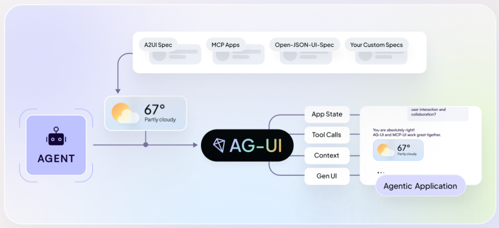

1. Full Name : Santhosh k
2. Contact info (public email) : santhoshprogrammer07@gmail.com
3. Discord handle in our server (mandatory) : santhoshsandy_40473
4. Home page (if any)
5. Blog (if any) 
6. GitHub profile link : https://github.com/Sandy-07-coder
7. LinkedIn : https://www.linkedin.com/in/santhosh2673/
8. Time zone : IST (UTC +5:30)
9. Link to a resume (PDF, publicly accessible via link and not behind any login-wall)

### University Info

1. University name : Saveetha Engineering College, Chennai
2. Program you are enrolled in (Degree & Major/Minor) : Computer Science Engineering
3. Year : 1st year
4. Expected graduation date : 2029

### Motivation & Past Experience

Short answers to the following questions (Add relevant links wherever you can):

---
#### 1. Have you worked on or contributed to a FOSS project before? Can you attach repo links or relevant PRs?

I have contributed to the CERN-led project Invenio-App-RDM, where I resolved a UI localization issue by leveraging i18next for browser-based language detection to ensure accurate number formatting across different locales.

Invenio-App-RDM (CERN): https://github.com/inveniosoftware/invenio-app-rdm
The issue I worked on: https://github.com/inveniosoftware/invenio-app-rdm

---

#### 2. What is your one project/achievement that you are most proud of? Why?

I am most proud of EnrollMate, a course enrollment system built with React and Tailwind CSS that features automated conflict detection and intuitive schedule visualization. While it initially started as a full-stack project, I pivoted the architecture toward a frontend-plus-extension model to overcome data reliability issues and evolving requirements. This project was a turning point for me in learning software architecture; it taught me how to move beyond "just coding" to build a stable, adaptable system that solves real-world data extraction challenges.

EnrollMate github repo: https://github.com/Sandy-07-coder/EnrollMate

---

#### 3. What kind of problems or challenges motivate you?

I am most motivated by "translation" problems—turning complex, messy data into intuitive user interfaces. My experience with EnrollMate taught me that raw data is useless without a clear visual bridge. I enjoy architectural challenges where I have to pivot to find the most reliable way to solve a user's pain point.

#### 4. Will you be working on GSoC full-time?

Yes, I will be working on this project full-time. I have no other internships or academic commitments planned for the summer. I am prepared to dedicate 30–40 hours per week to ensure all milestones are met on schedule.

#### 5. Do you mind regularly syncing up with the project mentors?

Not at all. I actually prefer frequent syncs to stay aligned with the project's standards. My time with the CERN project taught me that consistent feedback prevents "feature creep" and helps unblock technical issues much faster.

#### 6. What interests you the most about API Dash?

I love that it is a lightweight, developer-first alternative to bloated API clients. The move toward Generative UI is especially exciting because it's the future of API interaction. Being able to implement the Open Responses spec within a Flutter tool perfectly matches my skill set.

#### 7. Can you mention some areas where the project can be improved?

The visual feedback loop can be tighter; currently, there is a gap between receiving data and seeing it in an app. I also see an opportunity to improve Response History and add a Mock Server feature so developers can test UI states without constantly hitting expensive AI endpoints.

### Project Proposal Information

#### 1. Proposal Title
Open Responses & Generative UI: Visual AI Debugging Workspace for API Dash

#### 2. Abstract

This project integrates the Open Responses specification and Google's A2UI guidelines into API Dash. Currently, when developers test AI APIs, they only see raw JSON strings. This project will build a robust parsing and rendering pipeline to convert these standardized JSON blueprints into rich, interactive UI components directly inside API Dash.

This will help developers to see visual debugging workspace, allowing developers to test Generative UI responses and instantly export the corresponding Flutter (Dart) or React (TypeScript) code for their own applications.

#### 3. Detailed Description

**Overview**
The proposed system bridges the gap between raw LLM outputs and frontend execution. It consists of five core modules:
1. Open Responses JSON Parser
2. State Mapping Layer
3. Flutter GenUI Integration
4. Web UI Rendering
5. Code Export Module

**1. Open Responses JSON Parser**
* **Function:** Accept streaming and complete JSON payloads from multi-provider AI endpoints.
* **Validation:** Validate the schema strictly against the Open Responses specification.
* **Extraction:** Identify UI component blueprints (such as cards, tables, buttons) and their nested data.
* **Tech Stack:** Dart (`json_serializable`) for the Flutter desktop/mobile app and TypeScript (Zod or standard interfaces) for the React web app.

**2. State Mapping Layer**
* **Function:** Map the parsed JSON structures into standard UI state objects.
* **Consistency:** Ensure cross-platform visual parity. The exact same JSON payload must create an identical visual layout tree on both the desktop (Flutter) and web (React) versions of API Dash.
* **Resilience:** Safely handle malformed data, hallucinations, and incremental streaming text updates without crashing the UI.

**3. Flutter GenUI Integration (Desktop/Mobile)**
* **Function:** Integrate Flutter's GenUI SDK into the API Dash application.
* **Rendering:** Create a dynamic widget renderer in Dart that maps standard UI intents to native Flutter widgets (e.g : mapping a JSON `{"type": "button"}` to an `ElevatedButton`).

**4. Web UI Rendering (React/TypeScript)**
* **Function:** Replicate the dynamic rendering system for the API Dash web environment.
* **Rendering:** Use React and TypeScript to dynamically build DOM elements based on the parsed state, maintaining seamless state management during AI streams.

**5. Code Export Module**
* **Function:** Build an "Export Code" feature within the UI preview panel.
* **Generation:** Automatically generate ready-to-use Dart (Flutter) and TypeScript (React) code snippets based on the rendered widget.
* **UX:** Allow developers to copy-paste the fully styled UI directly into their own codebases, drastically reducing development time.

#### 4. Weekly Timeline (90 Hours)

* **Week 1: Research & Architecture (15 hours)**
    * Study API Dash UI architecture and state management.
    * Deep dive into Open Responses specification and Google A2UI guidelines.
    * Design the parsing logic and cross-platform data models.
* **Week 2: Parser Development (15 hours)**
    * Implement the Dart and TypeScript JSON parsers.
    * Build the validation and error-handling layer for malformed LLM outputs.
    * Write unit tests using sample Open Responses payloads.
* **Week 3: Flutter GenUI Implementation (15 hours)**
    * Integrate the Flutter GenUI SDK.
    * Build the dynamic widget renderer for the API Dash Flutter app.
    * Map core UI components (text blocks, buttons, data cards, lists).
* **Week 4: Web UI & React Implementation (15 hours)**
    * Implement the dynamic rendering logic for the React/Web version of API Dash.
    * Synchronize visual styling to ensure parity between the Flutter app and the Web app.
* **Week 5: Code Export & Streaming (15 hours)**
    * Develop the Code Export module (Dart and TS snippet generation).
    * Refine the UI to gracefully handle incremental updates during streaming AI responses.
* **Week 6: Polish & Documentation (15 hours)**
    * Conduct end-to-end testing and bug fixes.
    * Write user documentation on how to utilize the Generative UI workspace.
    * Final code cleanup, formatting, and PR submission.

#### The Image I used to understand about Generative UI :
 