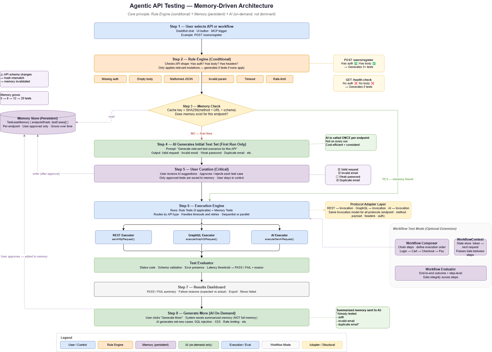

### About

1. Full Name: Aanish Bangre
2. Contact info (public email): blueverse20@gmail.com
3. Discord handle in our server (mandatory): aanishbangre_08720
4. GitHub profile link: https://github.com/Aanish-Bangre
5. LinkedIn: https://www.linkedin.com/in/aanish-bangre-a1825b289/
6. Time zone: IST (UTC+5:30)
7. Link to a resume: https://drive.google.com/file/d/1K42M8OYHbRdZUHn5LFuSLxNOkHqu5Fgg/view?usp=sharing 

---

### University Info

1. University name: Sardar Patel Institute of Technology
2. Program you are enrolled in (Degree & Major/Minor): B.Tech in Computer Science
3. Year: 3rd Year
4. Expected graduation date: August 2027

---

### Motivation & Past Experience

### Motivation & Past Experience

1. Have you worked on or contributed to a FOSS project before? Can you attach repo links or relevant PRs?

Not before, APIDash is the first one that I contributed on. I have been actively contributing as part of my GSoC preparation by exploring the codebase, participating in discussions, and building a working Proof of Concept for Agentic API Testing integrated into the app.

---

2. What is your one project/achievement that you are most proud of? Why?

I am most proud of my Appointment Management System project.

It is a production-ready full-stack system where I solved real-world distributed system problems like race conditions using Redis locks, idempotency keys, and rate limiting. I also implemented real-time synchronization using WebSockets and Redis Pub/Sub.

This project stands out to me because it goes beyond basic CRUD and focuses on building a reliable, scalable system that handles concurrency correctly, which is critical in real-world applications.

---

3. What kind of problems or challenges motivate you the most to solve them?

I am most motivated by problems that involve system design and real-world constraints.

For example, in my Appointment Management System, I worked on handling race conditions and ensuring consistency across concurrent users, which required thinking beyond simple logic and focusing on reliability and scalability.

I enjoy challenges where I need to design systems that are efficient, robust, and practical to use, especially in areas like distributed systems and real-time applications.

---

4. Will you be working on GSoC full-time? In case not, what will you be studying or working on while working on the project?

I have a research internship at IIT Bombay until June with a 9–5 schedule. After that, I will be fully available.

During the internship period, I will work on API Dash in the evenings and dedicate consistent time daily.

---

5. Do you mind regularly syncing up with the project mentors?

Not at all.

I am comfortable syncing:
- Weekdays: Evenings  
- Weekends: Anytime  

---

6. What interests you the most about API Dash?

I find API Dash interesting because it has the potential to evolve beyond a request client into an intelligent developer tool.

It already has strong foundations (UI, multi-protocol support, AI integration), and this project can turn it into a complete testing and agent-integrated platform.

---

7. Can you mention some areas where the project can be improved?

- Integration of various other API supports like WebSockets, gRPC, Socket, MQTT, and MCP support  
- Lack of a structured, automated API testing system  
- Limited support for multi-step stateful workflows  
- No persistent memory or system learning mechanism  
- Opportunity to evolve into an agent-native platform  

---

8. Have you interacted with and helped API Dash community? (GitHub/Discord links)

Yes, I have been actively engaging with the community through issues and pull requests:

- **Issues Created:** [foss42/apidash/1244](https://github.com/foss42/apidash/issues/1244) (via [created issues filter](https://github.com/issues/created?issue=foss42%7Capidash%7C1244))
- **Open PR:** [foss42/apidash/pull/1348](https://github.com/foss42/apidash/pull/1348)
- **Merged PR:** [foss42/apidash/pull/1200](https://github.com/foss42/apidash/pull/1200)

---

### Project Proposal Information

#### 1. Proposal Title
**Agentic API Testing: A Memory-Driven, Protocol-Agnostic Intelligence Layer for API Dash**

---

#### 2. Abstract

An analysis of the modern API testing landscape reveals a divide between two polarizing extremes:

- **Manual / Script-based systems:** These provide deterministic results, which is essential for reliability, but they are rigid. They require high maintenance overhead, and minor changes in the API often break the entire test suite.
- **AI-generated testing systems:** These offer flexibility and ease of use, but because Large Language Models (LLMs) are inherently non-deterministic, they can be unreliable for strict regression testing.

This project introduces a **Memory-Driven Agentic Testing Engine** designed to combine the strengths of both paradigms while mitigating their weaknesses. 

Instead of relying on an LLM to generate tests for every execution, the proposed system is built on a hybrid foundation:
- It uses **deterministic rule-based generation** to establish baseline reliability for standard edge cases.
- It systematically stores **user-approved test scenarios in a persistent memory layer**, treating the platform as a continuously learning system.
- It invokes **AI only when necessary**—specifically during a "cold start" (when no tests exist) or for intelligent expansion (generating complex edge cases).

By architecting the system this way, we ensure:
- **Strict Reproducibility:** Tests are consistent across runs.
- **Cost Efficiency:** We reduce unnecessary token usage and API latency.
- **Incremental Intelligence:** The system learns and adapts to the user's API over time.

Additionally, by integrating the **Model Context Protocol (MCP)**, this project will evolve API Dash into an agent-native API testing platform, enabling external AI agents (like Claude or Cursor) to directly execute, evaluate, and reason over API tests.

---

#### 3. Detailed Description

---

### Problem Analysis & Design Philosophy

#### Limitations of Existing Approaches

Before designing the solution, I analyzed why current testing approaches struggle at scale:

1. **Script-Based Testing**
   - **Static and brittle:** Lacks the ability to adapt gracefully to schema changes.
   - **High maintenance cost:** Developers spend excessive time maintaining tests rather than writing business logic.
   - **No adaptability:** Cannot automatically infer new test cases when API parameters evolve.

2. **AI-Only Testing Systems**
   - **Non-deterministic outputs:** The same input prompt might yield completely different test cases across different runs.
   - **Hallucinated expectations:** AI frequently assumes incorrect business logic or invents nonexistent required fields.
   - **Not reproducible:** Fluctuating outputs make these systems unsuited for dependable CI/CD pipeline regression testing.

3. **Multi-Agent Pipelines**
   - **High latency and cost:** Passing context back and forth between multiple AI agents is slow and computationally expensive.
   - **Complex orchestration:** Orchestrating multiple LLMs leads to a fragile system architecture.
   - **Difficult to debug:** When a test fails, it is difficult to trace whether the API failed or the agent hallucinated the test parameters.

---

### Key Insight

Through this analysis, I established a fundamental engineering philosophy for this project. A reliable testing system must follow a strict rule:

> **Deterministic Execution + Controlled Intelligence**

This realization leads directly to the core design of this proposal:
**Conditional Rules + Persistent Memory + On-Demand AI**

---

### Proposed Architecture

Instead of building a purely AI-driven application that acts as a black box, this proposal introduces a layered hybrid architecture. This ensures that we maintain control over the execution while leveraging the generative capabilities of AI.

---

### Core Execution Pipeline

The flow of data through the system is structured to minimize AI dependency and maximize reliability:

1. **Request:** Analyzes the base API request.
2. **Rule Engine (Deterministic):** Generates standard protocol-aware tests automatically.
3. **Memory Layer:** Fetches previously verified AI-generated tests to save time and compute tokens.
4. **AI Layer (Conditional):** Triggered only to discover new edge cases or if memory is empty.
5. **Execution Engine:** Runs the network calls in an isolated environment.
6. **Evaluator:** Deterministically checks status codes and responses.
7. **Memory Update:** Saves the results and verified tests back to storage for future runs.

---

### Key Design Decisions

#### 1. Why Not AI-First?

- **Unpredictability:** Providing the same API schema might result in different test payloads across runs.
- **Unsuited for regression:** Regression testing demands absolute consistency.
- **Conclusion:** AI is restricted to knowledge expansion rather than core execution.

#### 2. Why Memory-Centric?

- **Prevents repeated API calls:** Caching approved tests saves time and API costs.
- **Enables systemic learning:** The system builds a rich context regarding the user's specific API.
- **Conclusion:** It results in a workflow that is faster, cheaper, and consistent.

#### 3. Why a Conditional Rule Engine?

- **Avoids irrelevant generation:** Prevents wasting compute on generating an "Invalid Token" test if the endpoint doesn't require authentication.
- **Ensures protocol correctness:** The engine strictly adheres to standard protocols. For example, it will only generate an `EmptyBody` test for POST/PUT/PATCH methods, ignoring GET requests where bodies are irrelevant.

#### 4. Why Human-in-the-Loop?

- **Prevents storing incorrect tests:** The user has the final say on what gets saved to memory.
- **Builds trust:** Giving developers an approval step builds confidence in the tool.
- **Curated quality:** Over time, the memory layer becomes a highly refined, project-specific test suite.

---

### System Components

---

#### 1. Rule Engine (Deterministic Layer)

This layer acts as the foundational baseline. It generates standard tests instantly based purely on the request structure:

- Valid request baseline
- Missing or malformed authentication headers
- Empty payload submissions
- Malformed JSON payloads
- Parameter edge cases (e.g., sending strings instead of integers)

**Note:** These rules are strictly deterministic, protocol-aware, and 100% reproducible without internet access or API keys.

---

#### 2. Memory Layer (Core Innovation)

This is a persistent, local system that safely stores user-approved test cases for future use.

**Key Features:**
- **Endpoint-specific storage:** Implements a robust hashing strategy using `SHA256(method + URL + schema)` to uniquely identify and map tests to specific endpoints.
- **Storage contents:** Permanently caches curated test cases, associated payloads, and expected outcomes.
- **Automatic reuse:** On future runs, these tests are injected instantly into the execution pipeline.

**Significance:**
This converts API Dash from a simple client into a learning system, eliminates redundant AI usage, and natively enables reliable regression testing.

---

#### 3. AI Layer (On-Demand Intelligence)

AI is utilized strictly in two high-value scenarios:

1. **Cold Start:** When testing a brand-new endpoint where no memory exists, the AI generates an initial batch of test scenarios based on the request shape.
2. **Expansion ("Generate More"):** When deeper coverage is needed, the AI uses a summary of existing memory to avoid duplication, focusing on advanced edge cases like SQL injection attempts, complex boundary value analysis, and invalid data formats.

---

#### 4. Execution Engine

- Built utilizing API Dash's existing `better_networking` package to ensure seamless integration.
- Designed to run requests in isolation to prevent state leakage.
- Fully supports batch execution for rapid suite testing.

---

#### 5. Evaluator (Deterministic Validation)

Once tests run, strict, deterministic logic is used to check:
- Accurate HTTP status codes
- Correct response structure and schema validation
- Specific error message formats

Outputs are binary and clear: PASS / FAIL + the exact reason for failure.

---

#### 6. Workflow Testing Engine (Advanced Capability)

To support complex, multi-step flows (e.g., Login -> Extract JWT Token -> Use Token in subsequent API -> Evaluate final response).

**Components:**
- `WorkflowDefinition`: Maps sequential steps.
- `WorkflowRunner`: Executes the chain.
- `WorkflowContext`: Holds state across the session.
- `ResponseExtractor` & `ContextInterpolator`: Pulls dynamic data (like IDs or tokens) from one step and injects them into the next.

**Significance:**
Real APIs are stateful. Evaluating single, isolated requests is insufficient for enterprise-grade testing workflows.

---

### 7. Protocol-Agnostic Testing: REST, GraphQL, and AI APIs

A key strength of this architecture is that the testing engine is not limited to HTTP REST APIs. Built on a protocol-agnostic abstraction, it supports REST, GraphQL, and AI/LLM APIs through a shared conceptual model:

`Invocation -> Execution -> Response -> Evaluation`

#### 7.1 GraphQL API Testing

GraphQL APIs differ significantly from REST (single endpoint, query-driven, complex error responses). 

**Approach:**
A GraphQL Adapter Layer converts requests into a unified internal format. The Rule Engine generates GraphQL-specific deterministic tests (e.g., invalid query syntax, missing required variables).

**Evaluation Strategy:**
Unlike REST's status-code driven validation, GraphQL validation checks for the presence/absence of `errors` arrays and the structure of the `data` response.

#### 7.2 AI / LLM API Testing

Testing AI APIs introduces non-deterministic outputs and a lack of strict schema guarantees.

**Approach:**
A Prompt-Based Invocation Model treats each request as: `Prompt -> Model -> Generated Response`.

**Test Case Types:**
Supports both deterministic checks (response exists, latency thresholds) and heuristic assertions (output length constraints, required keywords, structured output validation).

**Evaluation Strategy:**
Responses are validated using structural checks (JSON validity) and heuristic rules, bridging the gap between backend APIs and AI systems.

#### 7.3 Unified Architecture Advantage

Instead of building separate systems, this introduces a single unified pipeline:

`ITestable -> Invocation -> Rule Engine -> Execution -> Evaluator`

**Benefits:**
- Code reuse across protocols.
- Easier extensibility for future protocols (e.g., gRPC, WebSocket).
- Consistent UI and testing experience.

**Competitive Advantage:**
| Approach | Limitation |
|----------|------------|
| HTTP-only testing | Cannot scale to GraphQL/AI |
| AI-only systems | Non-deterministic |
| Multi-agent pipelines | Expensive and slow |

This proposal uniquely combines determinism, system learning, AI flexibility, and protocol generalization.

---

### MCP Integration (Future-Ready Design)

API Dash will act as a Model Context Protocol (MCP) Tool Provider.

**Exposed Tools:**
- `run_test_suite(endpoint)`: Allows an agent to trigger tests.
- `get_memory_summary(endpoint)`: Allows an agent to read existing test coverage.
- `execute_workflow(workflow_id)`: Triggers multi-step scenarios remotely.

**Significance:**
This integrates API Dash into the broader AI ecosystem, enabling IDE agents (like Cursor or Claude) to interact directly with the platform and supporting automated developer workflows.

---

### 8. Self-Healing & Adaptive Test Evolution

A major limitation of traditional API testing systems is their fragility. When APIs undergo changes (e.g., new required fields or modified validation rules), existing tests break and require manual updates. 

This proposal introduces a **controlled, memory-aware self-healing mechanism** that allows the system to adapt safely without compromising determinism.

#### 🧠 Core Philosophy
Self-healing is a managed process, not an automatic blind fix. It follows a strict pipeline:
`Detect -> Analyze -> Suggest -> Approve -> Update Memory`

This ensures no uncontrolled AI changes occur and maintains full developer oversight.

#### 🔁 Self-Healing Pipeline
1. **Failure Detected:** Evaluator identifies a mismatch.
2. **Failure Analyzer:** Rule-based checks determine if it is a simple schema change.
3. **AI Diagnosis (Optional):** Triggered if deterministic reasoning is insufficient to explain the failure.
4. **Fix Suggestion:** System proposes a structured fix (e.g., updating an expected status code or adding a missing field).
5. **User Approval:** Human-in-the-loop validation of the suggested fix.
6. **Memory Update:** Once approved, the corrected test replaces the old one for all future runs.

#### 🛠️ Fix Suggestion Types
- **Expectation Update:** Adjusting expected status codes (e.g., 401 to 200).
- **Payload Adjustment:** Automatically identifying new required fields in the schema.
- **Test Evolution:** Marking tests as non-applicable or creating new validation tests for updated endpoints.

**Significance:**
Self-healing transforms API Dash into a low-maintenance, self-improving platform that evolves alongside the APIs it tests, drastically reducing technical debt for the developer.

---

### Proof of Concept

Video Link: https://drive.google.com/file/d/15gEFIqC2cMpQnRg8z6P8F-UrAwhRw-Lt/view?usp=sharing

---

### Technologies & Packages

- **Core Architecture:** Dart / Flutter (Ensuring cross-platform parity)
- **State Management:** Riverpod (For reactive, predictable state handling)
- **Local Storage:** hive_ce (For fast, lightweight memory persistence)
- **Security & Hashing:** crypto (For robust SHA256 endpoint mapping)
- **Network Layer:** better_networking (Leveraging API Dash's core package)
- **AI Integration:** genai (For interfacing with the LLM layer)

---

### Expected Outcomes

**Functional Outcomes:**
- A functional, automated test generation suite.
- A robust workflow-based testing engine for chained requests.
- A reliable, persistent test memory database.
- A controlled self-healing mechanism for test suite maintenance.

**System Outcomes:**
- A stable system relying on deterministic logic paired with intelligent expansion.
- Reduced AI API costs due to smart memory caching.
- Reproducible test results across multiple runs.

**Platform Outcomes:**
- API Dash evolves into an enterprise-grade testing platform, an adaptive learning system, and a fully Agent-integrated tool via MCP.

---

#### 4. Weekly Timeline (12 Weeks)

**Phase 1 (Weeks 1–2): Foundations**
- Define the core data models and state representations in Dart.
- Implement the SHA256 hashing strategy for endpoint identification.
- Set up the foundational architecture and folder structure for the testing engine.

**Phase 2 (Weeks 3–4): Deterministic Engine**
- Build out the Rule Engine to automatically generate baseline test structures.
- Implement the Evaluator for strict, deterministic pass/fail validation.
- Construct the basic execution pipeline to run baseline tests.

**Phase 3 (Weeks 5–6): Memory Layer**
- Integrate `hive_ce` for local persistence.
- Develop logic to safely store, retrieve, and update the test memory database.
- Connect the retrieved memory seamlessly into the execution pipeline.

**Phase 4 (Weeks 7–8): UI & Execution Flow**
- Design and build the interactive Testing Tab UI within Flutter.
- Implement test selection features and detailed result views.
- Finalize the orchestrator integration connecting the UI to the background engines.

**Phase 5 (Weeks 9–10): AI Integration & Self-Healing**
- Implement AI "Cold Start" and "Generate More" features.
- Develop the Failure Analyzer and Fix Suggestion UI for the self-healing pipeline.
- Refine memory-aware system prompts to ensure suggestion accuracy.

**Phase 6 (Week 11): MCP Integration**
- Define and structure the required MCP tools and schemas.
- Expose internal execution endpoints safely for external agent triggers.

**Phase 7 (Week 12): Finalization**
- Conduct rigorous end-to-end testing of the hybrid system.
- Write comprehensive documentation for users and future maintainers.
- Clean up code, resolve bugs, and prepare the final Pull Request.