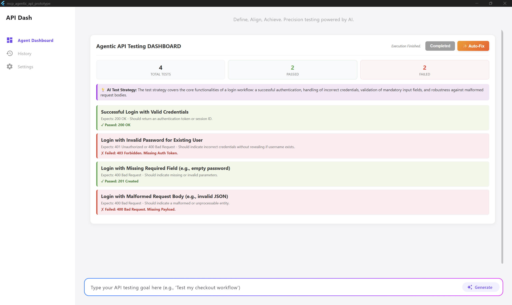

### About

1. **Full Name:** Abdelrahman ElBorgy
2. **Contact info:** abdelrahmanmoatazfouad@gmail.com
3. **Discord handle:** abdelrahmanelborgy
4. **Home page:** N/A
5. **Blog:** N/A
6. **GitHub profile link:** [AbdelrahmanELBORGY](https://github.com/AbdelrahmanELBORGY)
7. **Socials:** * [LinkedIn](https://www.linkedin.com/in/abdelrahmann-elborgy)
    * [DEV](https://dev.to/abdelrahmanelborgy)
8. **Time zone:** EET / UTC+2
9. **Link to a resume:** [Abdelrahman ElBorgy's CV 2026.pdf](https://drive.google.com/file/d/1p7uVXcy7my-TXgaMR-c6yhgn56xp1iL2/view?usp=sharing)

### University Info

1. **University name:** Alexandria University
2. **Program you are enrolled in:** Computer and Communication Engineering | Concentrated in Artificial Intelligence
3. **Year:** Senior - 5th year
4. **Expected graduation date:** June 2026

### Motivation & Past Experience

**1. Have you worked on or contributed to a FOSS project before? Can you attach repo links or relevant PRs?** Yes. I am currently an active contributor to the API Dash ecosystem.

**Merged PRs:**
* [PR #1332](https://github.com/foss42/apidash/pull/1332) - Got the **Hall of Fame** label by animator.
* [PR #1366](https://github.com/foss42/apidash/pull/1366) - Closes issue #1365 raised by me.

**Active PRs:**
* [PR #1344](https://github.com/foss42/apidash/pull/1344) - Resolves #1202 by fully wiring up and enabling real-time streaming AI responses in Dashbot.

**2. What is your one project/achievement that you are most proud of? Why?**

My final year graduation project. It is an AI-powered application built using Flutter, Python, Gemini AI, and Supabase. I am proud of it because I was able to:
* Develop a robust cross-platform mobile application (Android/iOS) emphasizing scalable software engineering principles.
* Integrate Google Gemini AI to build a context-aware system that intelligently processes dynamic user queries.
* Apply Computer Vision techniques using OCR to instantly fetch, process, and analyze real-world data.

**3. What kind of problems or challenges motivate you the most to solve them?**

I am most motivated by complex challenges at the intersection of artificial intelligence and software engineering. I thrive on building scalable, intelligent applications and leveraging tools like Python, Flutter, and LangChain, to solve real-world bottlenecks and automate complex workflows. Furthermore, I am deeply driven by collaborative problem-solving, particularly when contributing to open-source communities like API Dash and Mesa to tackle shared technical hurdles.

**4. Will you be working on GSoC full-time? In case not, what will you be studying or working on while working on the project?**

Yes, I am fully committing to this project.

**5. Do you mind regularly syncing up with the project mentors?**

Not at all. Regular communication and weekly syncs are crucial for me, making me aligned with the project requirements and able to get the appropriate guidance from the mentors.

**6. What interests you the most about API Dash?**

I see API Dash as a well-organized ecosystem and it aligns really well with my experience and knowledge. That got my attention to contribute, and I became even more interested after merging my PRs into the main repo; it indicated that I am capable of navigating, modifying, and adding beneficial features to their codebase.

**7. Can you mention some areas where the project can be improved?**

Currently, AI interactions in development tools are heavily chat-based (chatbots). The DX can be vastly improved by shifting to "Agentic Dashboards" where the AI dynamically generates visual test suites, highlights pass/fail states intuitively, and provides one-click visual diffs for autonomous self-healing, rather than printing walls of text.

**8. Have you interacted with and helped API Dash community?**
Yes.
* [Comment on PR #1332 (1)](https://github.com/foss42/apidash/pull/1332#issuecomment-4090115265)
* [Comment on PR #1332 (2)](https://github.com/foss42/apidash/pull/1332#issuecomment-4096965328)
* [Comment on Issue #1112](https://github.com/foss42/apidash/issues/1112#issuecomment-4059630760)
* [Comment on Issue #1328](https://github.com/foss42/apidash/issues/1328#issuecomment-4041976385)
* [Comment on Issue #1365](https://github.com/foss42/apidash/issues/1365#issuecomment-4083197423)

### Project Proposal Information

#### 1. Proposal Title
Autonomous Agentic API Testing using the Model Context Protocol (MCP) Architecture

#### 2. Abstract
Agentic AI transforms API testing from brittle, script-driven validation into an autonomous, intelligent quality layer. This project introduces a core Agentic AI Library within API Dash capable of ingesting OpenAPI specifications to automatically design, execute, and self-heal comprehensive test strategies. Because these agents execute complex, multi-step workflows with dynamic states, a static UI is insufficient.

To solve this, I will implement a Hybrid MCP (Model Context Protocol) Architecture. API Dash will act as an MCP Server, exposing its native high-performance execution engine as callable tools. Concurrently, the AI will generate interactive HTML/JS views (MCP Apps) rendered securely in an OS-Aware native WebView sandbox. This allows the AI to autonomously render interactive execution graphs and visual self-healing diffs on the fly, while bridging through JSON-RPC to trigger native API Dash HTTP clients—combining dynamic Agentic UI with native desktop performance.

>  **Proof of Concept Prototype**
> To validate this architecture, I have built a fully functional Windows Native prototype demonstrating the Dart Agentic Engine, the OS-Aware WebView sandbox, the JSON-RPC bridge, and the autonomous Self-Healing loop.
> 
> * **Prototype Repository:** [apidash-agentic-prototype](https://github.com/AbdelrahmanELBORGY/apidash-agentic-prototype)
> * **Demo Video:** [YouTube Demo](https://youtu.be/QvwZ_draFDk)
> * **Live Working Document:** [Google Doc Proposal](https://docs.google.com/document/d/135Kye-aFp6JgtOA5IqA43kHPhoGDi-uzBjDRb1X5ShE/edit?usp=sharing)

#### 3. Detailed Description

**The Core Mission: Building the Agentic Library** The primary goal is to build an intelligent testing layer within API Dash. The library will focus on three autonomous capabilities:
1. **Context-Aware Test Generation:** Ingesting OpenAPI specs and workspace data to design test suites (functional, edge cases, security).
2. **Multi-Step Workflow Execution:** Executing chained API calls, maintaining state and dynamic data across the workflow (e.g., extracting a token from a login response for subsequent requests).
3. **Continuous Self-Healing:** Capturing native HTTP errors (e.g., 401 Unauthorized), analyzing the root cause, and autonomously updating schemas to "heal" tests without manual intervention.

**The Architectural Challenge** Building this in a Flutter desktop app presents three hurdles:
1. **The Dynamic UI Problem:** Flutter is an AOT-compiled framework. An AI cannot dynamically invent and render new custom Flutter widgets to visualize complex, multi-step agent workflows.
2. **The Native Execution Problem:** If an AI operates in a web interface, it cannot make raw, high-performance HTTP socket connections (bypassing CORS).
3. **The OS Variation Problem (Desktop Support):** Flutter's official `webview_flutter` package is mobile-optimized and lacks production-ready support for native Windows desktop environments. Because API Dash is heavily utilized as a native Windows application, naively implementing the official webview package will result in compilation crashes or blank interfaces on desktop. The sandbox must be OS-aware to guarantee cross-platform stability.

**The Solution: A Hybrid MCP Architecture** I will implement a decoupled Client-Server Architecture using the Model Context Protocol (MCP) to bridge native execution with dynamic UI.

* **Phase 1: API Dash as the Native MCP Server** I will build a Dart library that turns API Dash's core capabilities into standard JSON-RPC tools. The host will expose resources (e.g., `workspace://openapi_spec`) and tools (e.g., `execute_native_http`, `save_test_assertions`). This ensures the AI never executes untrusted network code directly; it only requests API Dash to do so.

* **Phase 2: The OS-Aware Agentic Sandbox (WebView)** To provide a superior Developer Experience, the Agentic Console will be rendered via a WebView Adapter Pattern. For Windows, it securely injects `webview_windows` (Microsoft Edge WebView2), while utilizing `flutter_inappwebview` for Unix systems. This gives the LLM a secure HTML/JS canvas to dynamically "invent" UI—such as interactive execution graphs—without recompiling the Flutter app.

  *(Prototype UI rendering via MCP Sandbox)*
  

* **Phase 3: The JSON-RPC Bridge & Visual Self-Healing** The AI (living in the WebView sandbox) will autonomously trigger API Dash's native tools via the JSON-RPC bridge. When API Dash executes a multi-step test, it streams granular results back to the sandbox. If a test fails and triggers the Self-Healing Loop, the agent analyzes the failure, generates a fix, and passes both old and new test schemas to the HTML view. This renders a stacked Visual Diff, allowing users to explicitly approve the AI's autonomous modifications before saving them natively.

  *(Visual Diff generation after Self-Healing)*
  

#### 4. Weekly Timeline (175 Hours)
*Assuming a 10-12 week coding period at roughly 15-18 hours per week.*

**Community Bonding Period (May)**
* Sync with mentors to finalize the LLM orchestration approach (e.g., direct REST integration vs. Dart LangChain wrappers) and select the default supported models.
* Finalize Figma UIs for the Agent Console sandbox within the API Dash workspace.
* Establish testing standards for the Dart Agentic Engine logic.

**Week 1-2: Core Agentic Engine & API Parsing**
* **Goal:** Build the Dart logic that "understands" API contexts.
* **Tasks:** Develop context-ingestion parsers to feed OpenAPI specs and API Dash workspace data into the LLM context window. Engineer and test system prompts to reliably generate structured JSON test strategies (edge cases, auth handling, functional correctness).

**Week 3-4: The Cross-Platform MCP Host Sandbox**
* **Goal:** Build the secure desktop rendering environment.
* **Tasks:** Implement the Agent Console UI widget in Flutter. Build the WebView Adapter Pattern: integrate `webview_windows` for Windows and `flutter_inappwebview` for Unix systems. Implement empty-state handling and loading indicators in the native Flutter UI.

**Week 5-6: The JSON-RPC Communication Bridge**
* **Goal:** Enable secure two-way messaging between Flutter and the AI UI.
* **Tasks:** Implement the `McpHostChannel` message listener in Dart to handle the JSON-RPC standard. Develop the base HTML/JS/CSS templates that the AI will use, ensuring they match API Dash’s native light/dark themes and utilize custom WebKit scrollbars for a native feel.

**Week 7-8: Execution via `tools/call`**
* **Goal:** Allow the AI's dashboard to trigger native tests.
* **Tasks:** Map the MCP `tools/call` requests to API Dash's native HTTP execution engine. Implement granular state tracking so Dart can send an array of individual test results back to the JS sandbox, allowing the UI to dynamically update dashboard metrics counters and pass/fail indicators.

**Week 9-10: Autonomous Self-Healing & Visual Diffs**
* **Goal:** Close the autonomous loop and build user trust.
* **Tasks:** Implement the feedback loop: pass failed HTTP response bodies and status codes back to the Agentic Engine. Implement the `tools/heal` logic: instruct the LLM to strictly fix only the failed tests while preserving passing ones. Build the "Visual Diff" UI logic in the MCP HTML template to render stacked, color-coded comparisons of the old vs. new test parameters.

**Week 11-12: Polish, Testing, and Documentation**
* **Goal:** Ensure enterprise-grade stability.
* **Tasks:** Refine the UI/UX (animations, responsive layouts for the Agent Console). Write comprehensive documentation outlining how future contributors can add new MCP tools to API Dash. Submit final Pull Requests, resolve any merge conflicts, and record the final demonstration video for GSoC submission.