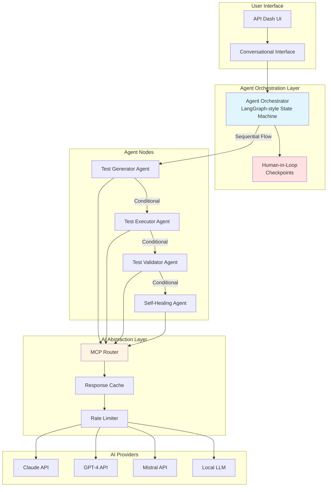
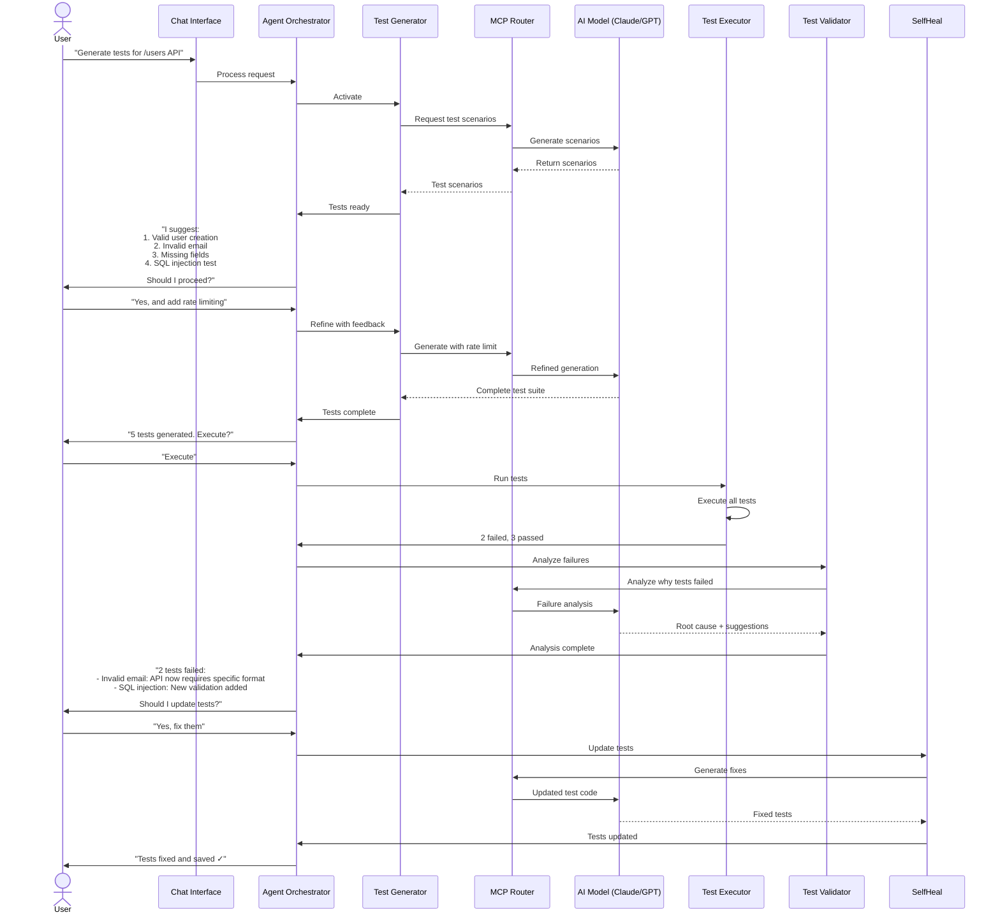
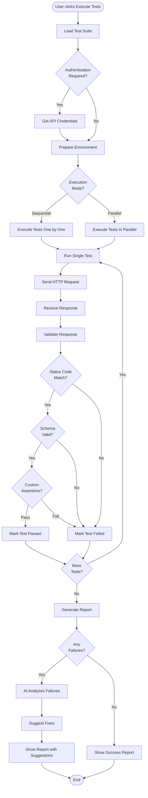
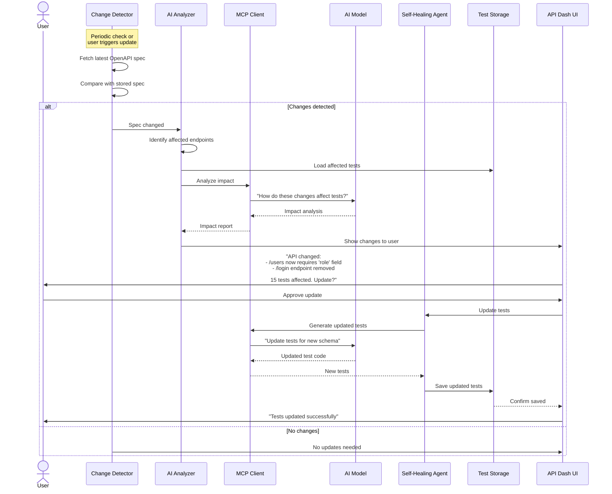

# GSoC 2026 Application: Agentic API Testing for API Dash

## About

1. **Full Name**: Aditya Suhane  
2. **Contact info (public email)**: adityasuhane01@gmail.com  
3. **Discord handle in API Dash server**: adityasuhane01  
4. **GitHub profile**: https://github.com/adityasuhane-06  
5. **Socials**: https://linkedin.com/in/aditya-suhane-530103255  
6. **Time zone**: IST (UTC+5:30)  
7. **Resume link (public)**: https://drive.google.com/file/d/12zJvrIma6cPOJ99OTc4Jiq7Fit1ld2_c/view?usp=sharing  

## University Info

1. **University name**: Gyan Ganga Institute of Technology and Sciences, Jabalpur  
2. **Program**: B.Tech, Computer Science Engineering (Data Science)  
3. **Year**: Final Year (4th year)  
4. **Expected graduation date**: June 2026  

## Motivation & Past Experience

### 1. Have you worked on or contributed to a FOSS project before? Can you attach repo links or relevant PRs?

Yes. I am actively contributing to API Dash while preparing for GSoC 2026 and discussing architecture with maintainers.

Relevant links:
- Idea discussion: https://github.com/foss42/apidash/discussions/1230#discussioncomment-15959507
- PR #1248 (docs: add Testing and Assertions guide with essential examples): https://github.com/foss42/apidash/pull/1248
- PR #1236 (closed: assertion framework exploration, then scope-aligned pivot): https://github.com/foss42/apidash/pull/1236
- PR #1223 (Add tests for APIDashAgentCaller #1221): https://github.com/foss42/apidash/pull/1223

What I learned from these contributions:
- Existing agentic and scripting infrastructure in API Dash must be reused, not duplicated.
- Fast feedback loops with maintainers are essential for correct scoping.
- Documentation quality and architecture clarity are as important as code.

### 2. What is your one project/achievement that you are most proud of? Why?

My proudest project is **Project Samarth** (AI-powered agricultural Q&A assistant):
- GitHub: https://github.com/adityasuhane-06/Project-Samarth
- Live demo: https://project-samarth-beta.vercel.app/

Why this is important for this proposal:
- I implemented agent-style orchestration using LangGraph-like flows.
- I built reliable fallback paths, retrieval components, and production deployment.
- I optimized latency and reliability under real user traffic.

This experience is directly relevant to building agentic test workflows in API Dash.

### 3. What kind of problems or challenges motivate you the most to solve them?

I am motivated by problems where:
- AI output must be reliable and auditable,
- workflows have multiple dependent steps,
- humans must stay in control at critical checkpoints,
- and systems need to adapt as external APIs evolve.

Agentic API testing is exactly this type of problem.

### 4. Will you be working on GSoC full-time? In case not, what will you be studying or working on while working on the project?

Yes, I will work on GSoC full-time. I am in my final year and can dedicate focused weekly hours to deliverables and mentor sync.

### 5. Do you mind regularly syncing up with the project mentors?

Not at all. I prefer frequent syncs and iterative review. I already attend mentor/community discussions and will continue weekly updates.

### 6. What interests you the most about API Dash?

Three things:
1. API Dash already has a practical base: request lifecycle scripting, agentic services, and DashBot.
2. Idea 4 is high-impact: converting partial AI assistance into a complete testing lifecycle.
3. The project values architecture discussion and iterative review, which matches how I work.

### 7. Can you mention some areas where the project can be improved?

1. **Testing lifecycle completeness**: generation exists, but execution-validation-healing orchestration can be stronger.
2. **Feature discoverability**: scripting/testing capabilities need easier in-product discovery and better guidance.
3. **Developer onboarding**: Docker-based local setup and clearer troubleshooting docs can reduce setup friction.

---

## Project Proposal Information

### 1. Proposal Title

**Agentic API Testing in API Dash: Human-in-the-Loop Orchestration for Generation, Execution, Validation, and Self-Healing**

### 2. Abstract: A brief summary about the problem that you will be tackling & how.

API Dash already has strong foundations (DashBot, scripting runtime, and agentic services), but end-to-end autonomous testing workflows are still fragmented. This project will build an agentic testing orchestration layer that enables users to conversationally generate tests, execute them, validate failures, and apply self-healing updates with explicit user approval.

The implementation will combine:
- a LangGraph-style state-machine orchestrator,
- MCP-based model flexibility,
- and human-in-the-loop checkpoints.

This proposal focuses on extending existing infrastructure (not replacing it) and delivering a practical testing workflow from prompt to stable test suite maintenance.

### 3. Detailed Description

#### 3.1 Problem and Why This Project is Needed

API Dash already helps with API productivity, but testing still has a major gap between **generation** and **maintenance**.

Current pain points in real workflows:
- Developers can generate or write tests, but there is no strong closed loop of generate → execute → validate → heal.
- Multi-step API flows (register → login → profile) are harder to manage reliably with manual scripts.
- When API contracts change, test suites break and updates are mostly manual.ea
- Teams need AI help, but they also need explicit control and approval before changes are applied.

This project solves that by building a controlled, agentic testing lifecycle where agents understand API specifications and workflows, generate comprehensive strategies across functional correctness, edge cases, error handling, security, and performance, execute end-to-end flows, validate outcomes, and apply self-healing with human checkpoints for trust and control.

#### 3.2 Existing Baseline and Reuse Strategy

This proposal is intentionally built on existing API Dash foundations:
- DashBot and agentic services
- JavaScript runtime for request/response scripting
- Existing request/response/environment models
- Existing provider/service architecture

Reuse strategy (important for scope and stability):
1. Reuse existing models and execution primitives where possible.
2. Add orchestration and validation layers as incremental modules.
3. Avoid replacing stable components; extend them with test lifecycle logic.

#### 3.3 What We Will Implement (Step-by-Step)

##### A) Workflow Orchestrator (State Machine Core)

Implementation approach:
1. Define workflow states (`idle`, `generating`, `awaitingApproval`, `executing`, `validating`, `healing`, `completed`, `failed`).
2. Define transition guards (example: no `healing` without failed validation).
3. Persist workflow context (request ids, generated test ids, execution reports, healing proposals).
4. Add resumability so interrupted runs can continue from last safe state.

Expected output:
- Deterministic orchestration with auditable transitions.

##### B) Test Generation Agent

Implementation approach:
1. Parse endpoint metadata / optional OpenAPI context.
2. Build prompt templates by test category (functional, edge, negative, security).
3. Generate structured test definitions (`input`, `expected`, `assertions`, `metadata`).
4. Present generated tests in review UI; user can approve/edit/regenerate.

Expected output:
- Useful, categorized test cases with explicit assertions.

##### C) Test Execution Agent

Implementation approach:
1. Convert approved test definitions into executable requests.
2. Support sequential and parallel execution modes.
3. Handle auth/environment context and inter-request variable extraction.
4. Store status, response payload, headers, latency, and assertion results.

Expected output:
- Repeatable test runs with complete telemetry for diagnosis.

##### D) Validation Agent

Implementation approach:
1. Validate status code, headers, schema, field-level assertions.
2. Classify failures (contract drift, invalid test assumption, flaky/network, auth, server-side error).
3. Generate human-readable summary + machine-readable validation report.

Expected output:
- Actionable failure insight, not only pass/fail counters.

##### E) Self-Healing Agent

Implementation approach:
1. Detect change impact (which endpoints/tests are affected).
2. Propose minimal patch for tests while preserving intent.
3. Show diff and confidence score to user.
4. Apply only after approval, then re-run changed tests.

Expected output:
- Controlled repair flow with verification after healing.

##### F) MCP Layer

Implementation approach:
1. Add model/provider abstraction for agent prompts.
2. Add provider fallback and retry policy.
3. Add optional caching for repeated prompts.

Expected output:
- Flexible AI model routing without changing agent business logic.

#### 3.4 Scope and Architecture

### Workflow Diagrams

#### High-Level Hybrid Architecture

What this diagram explains:
This diagram gives the full system picture at a glance. It starts from the API Dash UI, where the user interacts through a conversational interface, and then moves into the orchestrator that controls the testing lifecycle. From there, responsibility is split across specialized agents (generation, execution, validation, and healing), so each stage stays focused and maintainable. The MCP layer sits between these agents and model providers, which keeps the AI integration flexible and provider-agnostic. Most importantly, human-in-the-loop checkpoints are built into the orchestration path itself, so user control is part of the design, not an afterthought.

#### Conversational Test Generation Workflow (Human-in-the-Loop)

What this diagram explains:
This sequence shows how the user and agents collaborate in practice. The flow begins with a simple natural-language request, then the system proposes tests, accepts user refinement, and only executes after confirmation. If failures happen, the workflow does not stop at reporting; it analyzes root causes, explains what changed, and asks for approval before applying fixes. The key idea is iterative collaboration: generate, review, execute, diagnose, improve, and re-validate—until the suite is reliable.

#### Test Execution Workflow

What this diagram explains:
This diagram explains what happens once tests are approved and executed. The pipeline prepares the environment, chooses execution mode (sequential or parallel), runs requests, and validates responses in layers: status checks, schema checks, and custom assertions. Results are accumulated into a report, and when failures appear, the system routes them for AI-assisted analysis before presenting final output. In short, it describes a structured execution engine designed for reliability, observability, and actionable feedback.

#### Self-Healing Workflow

What this diagram explains:
This sequence explains how the system keeps test suites healthy as APIs evolve. It first detects spec changes, maps their impact to affected tests, and analyzes what needs to be updated. Instead of silently rewriting tests, it presents proposed changes to the user for approval, preserving transparency and trust. After approval, the updated tests are saved and re-validated, so healing is both controlled and verifiable.

#### 3.5 What is Different from Existing Capabilities

Existing DashBot capabilities include AI assistance and test generation support.  
This project’s added value is the **full lifecycle orchestration**:

1. Generation is connected to execution through a state machine.
2. Validation is explicit and structured, not ad-hoc.
3. Self-healing is approval-based and re-validated.
4. Multi-step workflow tests become first-class (shared state, chaining).
5. Human-in-the-loop checkpoints are enforced in lifecycle transitions.

In short: from "AI helps generate tests" to "AI + orchestration maintain trustworthy test suites over time".

#### 3.6 Research Depth and Technical Rationale

This design is based on practical constraints of API testing systems:
- AI output quality varies, so approval checkpoints are required.
- API specs drift, so impact-aware healing is needed.
- Real APIs need auth/state chaining, so workflow context must persist.
- Provider availability/cost varies, so MCP abstraction and fallback are necessary.

Quality strategy:
1. Unit tests for transitions, agents, and validators.
2. Integration tests for full lifecycle scenarios.
3. Dataset of representative API patterns (auth, pagination, CRUD, error flows).
4. Evaluation metrics: pass stability, healing success rate, false-heal rate, execution latency.

#### 3.7 Risks and Mitigation

- **Risk**: Over-scoping in 175 hours.  
  **Mitigation**: Core orchestrator + one provider + essential agent path first; advanced features phased later.
- **Risk**: Poor generated tests.  
  **Mitigation**: Human checkpoints, iterative refinement loop, validator gating.
- **Risk**: Provider instability/rate limits.  
  **Mitigation**: Retries, provider fallback, caching, and bounded concurrency.
- **Risk**: Incorrect self-healing suggestions.  
  **Mitigation**: Approval-required patches + automatic re-run verification.

### 4. Weekly Timeline: A week-wise timeline of activities that you would undertake.

**Week 1-2: Discovery and Architecture Finalization**
- Confirm reusable components in existing API Dash code.
- Finalize workflow states, contracts, and milestone acceptance criteria.
- Deliverable: architecture notes + implementation plan.

**Week 3-4: Orchestrator Foundation**
- Implement state machine and workflow persistence.
- Add initial human-in-the-loop checkpoints.
- Deliverable: generate/review flow working.

**Week 5-6: Test Execution Engine Integration**
- Add suite execution (sequential + parallel mode).
- Capture structured run results and logs.
- Deliverable: end-to-end generate → execute path.

**Week 7-8: Validation Layer**
- Add failure categorization and report generation.
- Add actionable suggestions for failed cases.
- Deliverable: execute → validate path with user-facing reports.

**Week 9-10: Self-Healing Workflow**
- Add change detection impact mapping.
- Add approval-based healing update flow.
- Deliverable: validate → heal → re-run loop.

**Week 11: MCP Provider Layer and Fallbacks**
- Add model routing, fallback strategy, and settings.
- Deliverable: multi-model support for core agent stages.

**Week 12: Hardening, Tests, Docs, Demo**
- Integration tests, performance checks, polish.
- Final documentation and demo walkthrough.
- Deliverable: stable, review-ready project handoff.

---

## References

- Idea discussion: https://github.com/foss42/apidash/discussions/1230
- PR #1248 (docs: add Testing and Assertions guide with essential examples): https://github.com/foss42/apidash/pull/1248
- PR #1236 (closed: assertion framework exploration, then scope-aligned pivot): https://github.com/foss42/apidash/pull/1236
- PR #1223 (Add tests for APIDashAgentCaller #1221): https://github.com/foss42/apidash/pull/1223
- Resume: https://drive.google.com/file/d/12zJvrIma6cPOJ99OTc4Jiq7Fit1ld2_c/view?usp=sharing

### Technical References
- Issue #96: Unit testing / auto tests discussion
- Issue #100: Stress testing with multiple concurrent requests
- Model Context Protocol: https://modelcontextprotocol.io/
- OpenAPI Specification: https://swagger.io/specification/
- Human-in-the-Loop Patterns: https://developers.cloudflare.com/agents/guides/human-in-the-loop/
- MCP Architecture: https://www.emergentmind.com/topics/mcp-architecture-and-workflow
- Temporal HITL AI Agent: https://docs.temporal.io/ai-cookbook/human-in-the-loop-python
- MLflow Conversation Simulation: https://mlflow.org/docs/latest/genai/eval-monitor/running-evaluation/conversation-simulation/
- LangGraph Orchestration: https://docs.langchain.com/oss/python/langgraph/overview?_gl=1*79mbgi*_gcl_au*MTYzNDQyMjYyNi4xNzcwMjg2MzE5*_ga*MTY3OTk4OTU3Mi4xNzcwMjg2MzIx*_ga_47WX3HKKY2*czE3NzI0NjUwMDYkbzIkZzAkdDE3NzI0NjUwMDYkajYwJGwwJGgw
- AI-assisted Test Generation Research: https://arxiv.org/pdf/2409.00411
- GSOC 2025 Project: https://summerofcode.withgoogle.com/archive/2025/projects/1Yf6TmCm