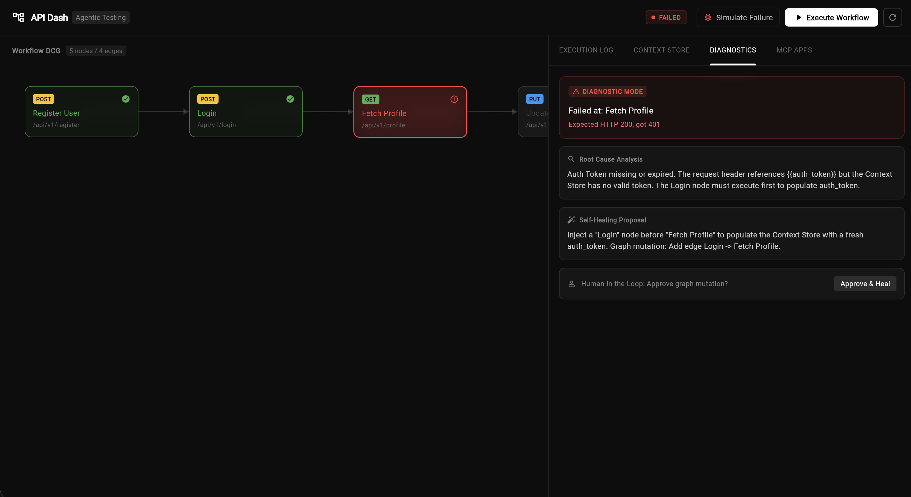
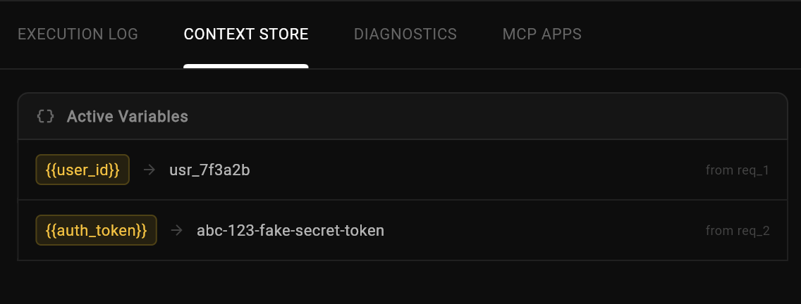
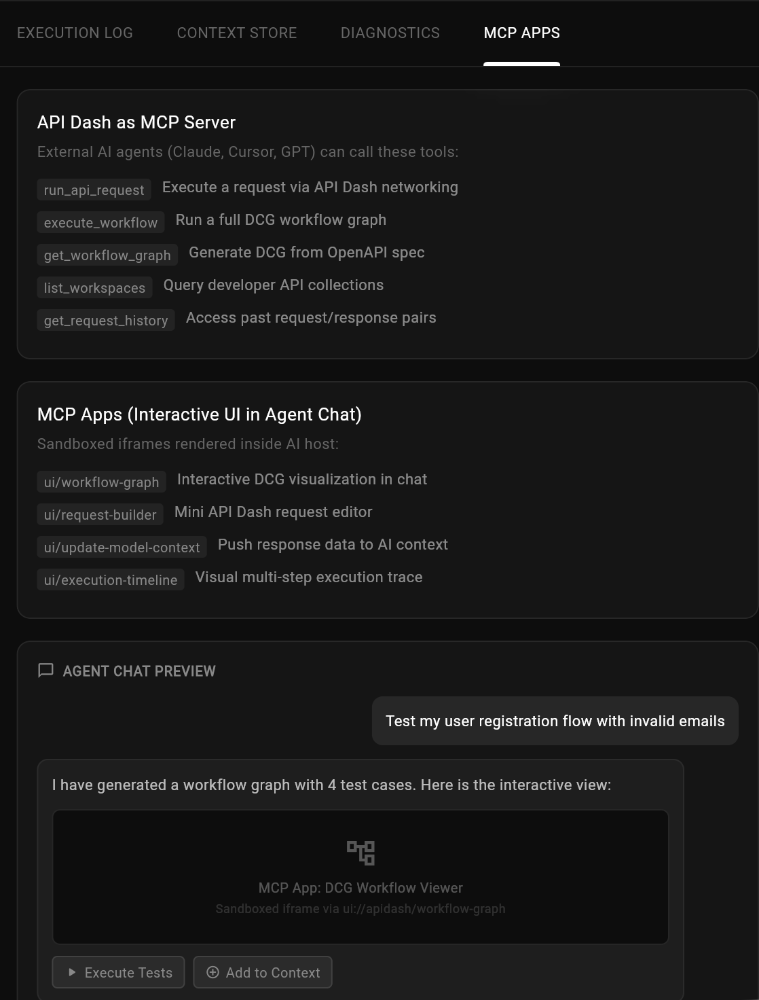
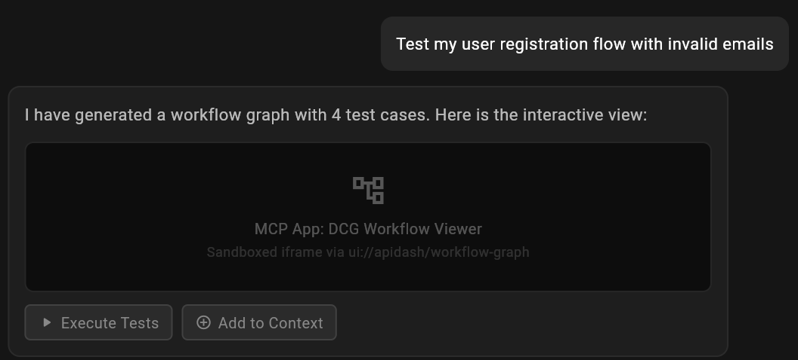

# GSoC 2026 Application: Agentic API Testing

### About

1. **Full Name:** Arun Kumar
2. **Contact info:** kumararun97429@gmail.com, +91-9193944687
3. **Discord handle:** no_arun_
4. **Home page:** [carbonFibreCode](http://carbonfibrecode.github.io)
5. **Blog:** [Click here](https://carbonfibrecode.github.io/blog/)
6. **GitHub profile link:** [carbonFibreCode](https://github.com/carbonfibrecode)
7. **Twitter, LinkedIn, other socials:** [LinkedIn](https://www.linkedin.com/in/arun-kumar-7a535b277/) , [Twitter](https://x.com/no_arun_)
8. **Time zone:** IST (UTC +5:30)
9. **Link to a resume:** [My Resume](https://drive.google.com/file/d/1VT3ugymBLbvvhAw6ka968c9pXqRa436e/view?usp=sharing)

### University Info

1. **University name:** Netaji Subhas University of Technology (NSUT), Delhi
2. **Program you are enrolled in:** B.Tech (Electrical Engineering)
3. **Year:** 3rd Year (Expected 2027)
4. **Expected graduation date:** 2027

### Motivation & Past Experience

**1. Have you worked on or contributed to a FOSS project before? Can you attach repo links or relevant PRs?**
Yes, I am a very active contributor to multiple FOSS projects:
- **Twenty (Modern Salesforce Alternative)**: Active contributor with [11 merged PRs](https://github.com/twentyhq/twenty/pulls?q=is%3Apr+author%3AcarbonFibreCode+is%3Aclosed) across frontend and backend layers. Features include date filtering (Fixes #16674), extending GraphQL filter logic (Fixes #18099), and resolving data staleness in virtualized tables (Fixes #16388). Tech Stack: TypeScript, React, NestJS, GraphQL, PostgreSQL.
- **CCExtractor**: Investigated and resolved a critical heap OOB buffer over-read in MP4 atom parsing [Fixes #2179](https://github.com/CCExtractor/ccextractor/pulls?q=+author%3AcarbonFibreCode+is%3Apr). Tech Stack: C, C++.
- **API Dash**: Active Participant & Contributor. Developing Agentic API Testing features.
- **chartjs_flutter**: A published package where I am the sole author of a core abstraction layer binding Chart.js natively to Flutter.

**2. What is your one project/achievement that you are most proud of? Why?**
I am most proud of my work on the **FaceSwapper AI** full-stack video processing platform. I built it using Next.js 15, TypeScript, PostgreSQL, Redis, Prisma, and Cloudflare R2. Overcoming challenges such as building a Redis sliding-window rate limiter for AI generation quotas and creating a custom async state machine to track external AI job polling were significantly complex and highly rewarding to deploy.

**3. What kind of problems or challenges motivate you the most to solve them?**
I am deeply motivated by architectural challenges that directly impact Developer Experience (DX) and system performance—such as creating clean abstraction layers (like my chartjs_flutter package), optimizing runtime extensibility to remove deployment friction, or ensuring strict memory safety and API predictability. 

**4. Will you be working on GSoC full-time? In case not, what will you be studying or working on while working on the project?**
I will commit a minimum of 40 hours per week during the coding period. I have no conflicting internships, courses, or competing projects during this time. I am committed to working with my mentors iteratively rather than building in isolation, filing a pull request for each deliverable as soon as it is ready for review.

**5. Do you mind regularly syncing up with the project mentors?**
Not at all. I value constant communication and iterative feedback, as demonstrated in my past open-source contributions communicating with core maintainers.

**6. What interests you the most about API Dash?**
API Dash provides beautiful and fast native tooling for API workflows. As a developer heavily involved in both frontend data flow and backend integrations (such as my internship at Digia Studio), I frequently rely on API testing. I'm fascinated by the potential to integrate Agentic behaviors and MCP protocols directly into the tool to make complex test workflows autonomous and intelligent.

**7. Can you mention some areas where the project can be improved?**
The capability for automated, multi-step API integration testing driven by an AI agent holds massive potential. API Dash can be improved by adding standard MCP-compatible protocols to let these agents orchestrate endpoints, dynamically parse responses, and handle state without manual configuration.

**8. Have you interacted with and helped API Dash community? (GitHub/Discord links)**
Yes, I have been actively participating as a contributor.
[Discord](https://discord.com/channels/920089648842293248/1033783279289110648/1482070122553409556)
[discussion Thread](https://github.com/foss42/apidash/discussions/1230#discussioncomment-15983018)

### Project Proposal Information

**1. Proposal Title:** 
Agentic API Testing: DCG Workflow Engine + MCP Apps

**2. Abstract:** 
API testing today requires manual chaining of requests or costly, non-deterministic execution loops when driven purely by AI generation. This project solves both problems by introducing a Dart-native Directed Cyclic Graph (DCG) workflow engine inside API Dash, paired with MCP Apps integration. The system natively executes complex multi-step workflows deterministically using state machines, extracting context variables continuously. AI is reserved strictly for interpreting specs to generate the initial graph, and for entering completely automated self-healing Root Cause Analysis (Diagnostic Mode) when a test fails. Finally, turning API Dash into an MCP server surfaces these tests inside any AI agent workspace.

**3. Detailed Description**
To separate AI generation (understanding what to test) from test execution, I will implement a native test execution layer combined with conversational test generation.

- **DCG Workflow Engine & State Machine:** Represents tests as Directed Cyclic Graphs. Nodes are individual requests; edges carry temporal logic/data dependencies. The engine uses `directed_graph` and `statemachine` to execute these natively, headless and fast.
- **Context Store:** Automatically extracts variables (auth tokens, IDs) and injects them into subsequent test requests via `{{variable}}` templates bridging data across the flow. 
- **Diagnostic Mode (Self-Healing):** When a response fails (e.g. 401 instead of 200), the system uses an LLM to compare the actual vs expected API spec constraint, proposing a targeted graph mutation and offering a Human-in-the-Loop "Approve & Heal" UI snippet.
- **MCP Server & Apps Integration:** API Dash will act as an MCP server surfacing tools like `run_api_request` and `execute_workflow`. MCP Apps standard will allow developers chatting with agents (e.g., in Cursor) to visualize the DCG map in-chat, interact with a Request Builder iframe, and click a button to seamlessly bridge API response context straight back to their agent.
- **Proof of Concept:** I have already built and tested a working POC demonstrating the DCG execution engine, context store, diagnostic mode, and MCP Apps conceptual integration inside the API Dash codebase

  

  
View Proof of Concept Visuals

  
  
  
  
  
  
  
  

**4. Weekly Timeline:**
- **Pre-Bonding (Mar 24 - May 8):** Submit application, study `apidash_core` assertion frameworks, iterate on the POC, and prototype MCP Apps handshake flow.
- **Community Bonding (May 8 - Jun 1):** Map dependencies, finalize technical design spec drafting, and prototype OpenAPI 3.0 parsing.
- **Week 1-2 (Jun 2 - Jun 15):** Build the core production DCG Workflow Engine and the Context Store with automatic variable extraction/injection logic.
- **Week 3-4 (Jun 16 - Jun 29):** Implement OpenAPI 3.0/3.1 and GraphQL parsing to generate DCG workflow graphs natively. Tie spec constraints to API Dash's existing assertion framework.
- **Week 5-6 (Jun 30 - Jul 13):** Build Diagnostic Mode: the LLM-powered Root Cause Analysis engine with Human-in-the-Loop self-healing graph mutations.
- **Midterm (Jul 14 - 18):** Buffer for Phase 1 merging and preparing for Phase 2 UI/MCP integrations.
- **Week 7-8 (Jul 15 - Jul 28):** Implement API Dash as an MCP Server (exposing tools to agents). Build interactive DCG Workflow graph UI in the Flutter app to visualize states and animate test progressions.
- **Week 9-10 (Jul 29 - Aug 11):** Implement MCP Apps integration so the AI agent chat renders the graph viewer, iframe request builder, and native styling hook. Add Time-Travel debugging capabilities for nodes.
- **Week 11 (Aug 12 - Aug 18):** Performance audit (for 50+ node graphs), test against real-world specs, and regression fixing.
- **Week 12 (Aug 18 - Aug 25):** Buffer, polish, contributor docs on how to add protocols/MCP tools, and prepare the finalized shipping features.