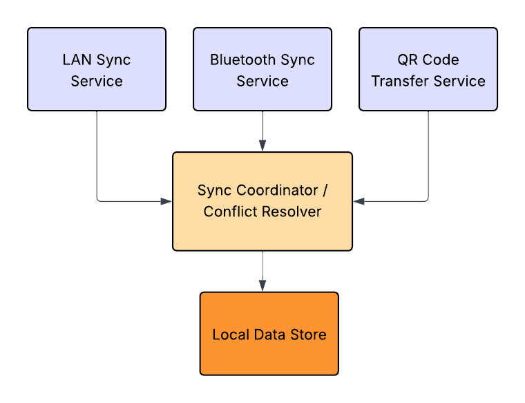

# GSoC 2026 Proposal: Cross-Device Sync for API Dash

---

### About

1. **Full Name:** Atharva Bedekar
2. **Contact Info (public email):** atharvabedekar527@gmail.com
3. **Discord Handle:** `AB527` *(in the API Dash server)*
4. **Home Page:** https://atharvabedekar.tech
5. **Blog:** https://medium.com/@atharvabedekar527
6. **GitHub Profile:** https://github.com/AB527
7. **Socials:**
   - Twitter/X: https://x.com/BedekarAtharva
   - LinkedIn: https://www.linkedin.com/in/atharva-bedekar-504045200/
8. **Time Zone:** IST (UTC+5:30)
9. **Resume:** [View Resume (PDF)](https://atharvabedekar.tech/resume.pdf)

---

### University Info

1. **University Name:** Dr. S. P. Mukherjee International Institute of Information Technology, Naya Raipur
2. **Program:** B.Tech in Computer Science and Engineering
3. **Year:** 2nd Year
4. **Expected Graduation Date:** July 2028

---

### Motivation & Past Experience

**1. Have you worked on or contributed to a FOSS project before? Can you attach repo links or relevant PRs?**

Yes, I have contributed to **BentoPDF**, a privacy-first, client-side PDF toolkit with 12.4k+ GitHub stars that lets users manipulate, merge, and process PDF files entirely in the browser with no server-side processing. Contributions include:

- [PR #1: Bug Fix: TypeError: Object of type Rect is not JSON serializable when using "Prepare PDF for AI"](https://github.com/alam00000/bentopdf-pymupdf-wasm/pull/1) - tracked down a serialization bug in the PyMuPDF WASM layer that caused the AI preparation feature to crash on certain PDFs.
- [Issue #320: Feature Request: Add drag-and-drop arrangement for JPG to PDF conversion](https://github.com/alam00000/bentopdf/issues/320) - proposed and detailed a UX improvement to let users reorder images before converting, which was well received by the maintainers.

I believe in tools that respect user privacy and work better than their closed-source competition. BentoPDF is a strong example of that philosophy in action, and it is the same reason I am drawn to API Dash.

---

**2. What is your one project/achievement that you are most proud of? Why?**

My proudest achievement is being listed in the **CERT-IN Hall of Fame (June 2025)** for responsible disclosure of a critical security vulnerability in the Mumbai Metro Connect 3 app, which serves 30,000+ daily users.

I reverse-engineered the live production Flutter APK to analyze its authorization trust boundaries and discovered a critical authorization bypass vector that could have allowed an attacker to gain unauthorized admin-level control over push notifications sent to all users. I documented structured reproduction steps that enabled the CERT-IN team to validate and remediate the issue safely without impacting production systems.

This achievement matters most to me because it sits at the intersection of everything I care about: systems-level thinking, user privacy and safety, and responsible engineering. It also gave me deep hands-on experience with Flutter internals, which is directly relevant to contributing to API Dash.

---

**3. What kind of problems or challenges motivate you the most to solve them?**

I am most motivated by problems that sit at the intersection of **privacy and real usability**. The best proof of this is BentoPDF: it outperforms ilovepdf because it processes files entirely client-side, giving users both speed and privacy without compromise. That is the kind of meaningful engineering I want to keep doing.

The cross-device sync problem in API Dash is exactly this type of challenge: most sync solutions require a central server, which trades user privacy for convenience. Building a serverless, peer-to-peer sync system that is fast and easy to use without leaking any data to a third party is the kind of problem I find genuinely exciting to solve.

---

**4. Will you be working on GSoC full-time? In case not, what will you be studying or working on while working on the project?**

I will not be working on GSoC fully full-time, as I am also committed to building a startup alongside my studies. However, I have managed demanding parallel workloads before (internships, competitive programming, security research, and academics simultaneously), so I am confident I can deliver the full project scope. I will dedicate a consistent **25 to 30 hours per week** to GSoC and will be transparent with mentors if any sprint needs to be adjusted.

---

**5. Do you mind regularly syncing up with the project mentors?**

I genuinely look forward to it. Mentor feedback is one of the fastest ways to find out where I went wrong before a problem compounds. I am comfortable with weekly video check-ins, async updates on Discord, and structured PR review cycles. I view mentorship as a core part of the GSoC experience, not an overhead.

---

**6. What interests you the most about API Dash?**

API Dash is simply a better tool than Postman and Thunder Client for developers who value their data and do not want to be locked into a cloud account. The fact that it is fully open-source and local-first is a genuine differentiator. I also find the AI integration feature technically exciting as a direction for the project. As someone who works in Flutter professionally, contributing to a Flutter-based tool that I would actually use daily is a great fit.

---

**7. Can you mention some areas where the project can be improved?**

Beyond cross-device sync (this proposal), one area I see strong potential in is an **animated onboarding guide for first-time users**. When someone opens API Dash for the first time, there is no guided introduction to the core features. Adding an interactive, animated walkthrough that highlights key areas of the UI (collections, request builder, environments, etc.) step by step would significantly reduce the learning curve and help new users get productive faster without having to dig through documentation.

---

**8. Have you interacted with and helped the API Dash community? (GitHub/Discord links)**

- Active on the API Dash Discord server under the handle `AB527`.
- [Issue #1007](https://github.com/foss42/apidash/issues/1007): I personally ran into this bug while using API Dash, raised the issue with a detailed report, and followed up with a fix.
- [Issue #178](https://github.com/foss42/apidash/issues/178): Picked up an existing bug reported by another community member and worked on resolving it.

---

### Project Proposal Information

---

#### 1. Proposal Title

**Cross-Device Sync for API Dash: LAN, Bluetooth and QR-Based Collection Sharing**

---

#### 2. Abstract

API Dash currently stores all collections, requests, and environments in local device storage with no built-in mechanism to synchronize data across devices. This forces users who work across desktop and mobile to rely on manual HAR export/import, which is a friction-heavy workaround that breaks any natural workflow.

This proposal introduces a **serverless, privacy-preserving cross-device sync system** for API Dash built around three complementary transfer modes:

| Mode | Mechanism | Best For |
|---|---|---|
| LAN / Hotspot Sync | WebSocket over local network | Full collection sync, real-time |
| Bluetooth Sync | BLE GATT | Offline / no-Wi-Fi scenarios |
| QR Code Transfer | Encoded payload in QR | Quick single-request sharing |

The solution requires no external server, no cloud account, and no third-party service, keeping API Dash's privacy-first philosophy fully intact.

---

#### 3. Detailed Description

---

##### 3.1 Problem Statement

When a developer tests APIs on their desktop and then needs to continue on mobile (or vice versa), they currently must:

1. Export the collection as a HAR file from one device.
2. Transfer the file manually (via email, USB, cloud storage, etc.).
3. Import it on the other device.

This is especially painful for **frequent incremental changes**: every edit requires repeating the entire cycle. There is no live sync, no delta propagation, and no cross-device awareness of any kind.

---

##### 3.2 Proposed Architecture

The sync system is designed around three independent but complementary modules, each implemented as a Dart service within the Flutter app.

A **Sync Coordinator** sits above the data store and acts as the single source of truth. All three transport mechanisms feed into it, and it applies a **last-write-wins with timestamp** conflict resolution strategy for v1, with hooks for CRDT-based merging as a future improvement.

---

##### 3.3 Module 1: LAN / Hotspot Sync

**How it works:**

- The **host device** (typically desktop) starts a lightweight HTTP + WebSocket server using the `shelf` and `shelf_web_socket` Dart packages.
- The **client device** (typically mobile) discovers the host by scanning a QR code displayed by the host (encoding the IP, port, and a one-time session token), or by manually entering the IP shown on screen.
- On connect, an **initial full sync** pushes the current collection state to the client.
- Subsequent changes are broadcast as **delta updates** (only the changed request/collection) over WebSocket messages in JSON.

**Key Dart packages:**
- `shelf` + `shelf_web_socket`: HTTP/WebSocket server on desktop
- `web_socket_channel`: WebSocket client on mobile
- `network_info_plus`: Retrieve local IP address
- `qr_flutter` + `mobile_scanner`: QR generation and scanning

**Security:** A one-time session token is embedded in the QR code and validated on first handshake. All communication stays within the LAN and nothing leaves the local network.

---

##### 3.4 Module 2: Bluetooth Sync

**How it works:**

- Uses the `flutter_blue_plus` package for BLE communication on both Android and iOS.
- The host advertises a custom GATT service with a known UUID.
- The client discovers and connects to the service.
- Data is chunked and transferred as BLE characteristic writes (max ~512 bytes/chunk with BLE 4.2+).
- A simple acknowledgement protocol ensures all chunks are received and correctly reassembled.

**Use case:** Situations with no Wi-Fi or hotspot, such as field testing or areas with network restrictions.

**Limitations (clearly communicated in-app):**
- Suitable for collections up to ~1 to 2 MB due to BLE throughput.
- Transfer is slower than LAN, estimated at 10 to 30 seconds for a medium-sized collection.
- Real-time delta sync is not practical over BLE; best used for one-shot transfers.

---

##### 3.5 Module 3: QR Code Transfer (Small Data)

**How it works:**

- For **individual requests or small collections** (under 2KB when serialized), the data is Base64-encoded and embedded directly in a QR code.
- The receiving device scans the QR using the in-app scanner and immediately imports the request.
- No network connection required; it is purely an optical transfer.

**Use case:** Sharing a single API request with a colleague quickly, or bootstrapping a new device with a starter collection.

**Limitations (shown in UI):**
- QR codes support a maximum of ~2.9 KB (version 40, binary mode).
- Only suitable for single requests or very small collections.
- The UI will warn users and suggest LAN sync if the payload exceeds the QR limit.

---

##### 3.6 Conflict Resolution

When two devices have independently modified the same request, the Sync Coordinator resolves conflicts using:

- **Timestamp-based last-write-wins (LWW)** as the default strategy.
- Each request and collection carries a `lastModifiedAt` (UTC epoch ms) and `deviceId` field.
- On receiving a delta, if the incoming `lastModifiedAt` is greater than the local value, the incoming version wins.
- A **conflict log** is maintained locally so users can review and manually override if needed (v1 stretch goal).

---

##### 3.7 UI/UX Design

A new **Sync panel** will be added to the API Dash sidebar with:

- **Host mode toggle:** start or stop acting as a sync host.
- **Connect options:** scan QR, enter IP manually, or scan Bluetooth.
- **Live sync status indicator:** connected devices and last sync time.
- **Transfer progress bar:** for Bluetooth and large LAN syncs.
- **Sync history log:** what was last synced and when.

The sync feature will be entirely **opt-in** and disabled by default to preserve the current offline-first behavior.

---

##### 3.8 Platform Support Matrix

| Feature | Android | iOS | macOS | Windows | Linux |
|---|---|---|---|---|---|
| LAN Sync (Host) | Yes | Yes | Yes | Yes | Yes |
| LAN Sync (Client) | Yes | Yes | Yes | Yes | Yes |
| Bluetooth Sync | Yes | Yes | Limited | Experimental | Experimental |
| QR Transfer | Yes | Yes | Yes | Yes | Yes |

---

#### 4. Weekly Timeline

**Total Duration:** 12 weeks (GSoC standard coding period)
**Commitment:** ~25 to 30 hours/week

| Week | Dates (Approx.) | Goals and Deliverables |
|------|-----------------|----------------------|
| **Week 1** | May 26 to Jun 1 | **Onboarding and Research:** Deep-dive into API Dash codebase (data models, Hive store, navigation). Audit existing HAR export/import code. Study `shelf`, `flutter_blue_plus`, and `web_socket_channel` APIs. Set up development environment for all target platforms. Document findings. |
| **Week 2** | Jun 2 to Jun 8 | **Data Layer and Sync Protocol Design:** Define the JSON sync schema (collection snapshot, delta message format, conflict metadata fields). Implement `SyncCoordinator` class with LWW conflict resolution. Write unit tests for merge and conflict logic. |
| **Week 3** | Jun 9 to Jun 15 | **LAN Sync (Host Side):** Implement WebSocket server using `shelf_web_socket`. Add session token generation and validation. Build IP discovery using `network_info_plus`. Display host IP and QR code on screen. |
| **Week 4** | Jun 16 to Jun 22 | **LAN Sync (Client Side):** Implement WebSocket client via `web_socket_channel`. Handle initial snapshot receive and merge. Implement delta message listener and local state update. Write integration tests for the LAN sync happy path. |
| **Week 5** | Jun 23 to Jun 29 | **QR Code Integration:** Implement QR code generation (`qr_flutter`) for connection URL (IP + port + token). Implement in-app QR scanner (`mobile_scanner`). Build QR-based small data transfer (encode/decode collection payload). Add payload size guard with user warning. |
| **Week 6** | Jun 30 to Jul 6 | **Buffer Week + LAN Polish:** Resolve issues from integration testing. Add reconnection logic for dropped LAN connections. Implement delta sync (not just full snapshots) for LAN mode. Document LAN sync module. *(Midterm evaluation prep)* |
| **Week 7** | Jul 7 to Jul 13 | **Bluetooth Sync (Discovery and Pairing):** Implement BLE GATT service advertisement and discovery using `flutter_blue_plus`. Build pairing flow in UI (scan nearby devices, select and connect). Handle permission requests for Android and iOS. |
| **Week 8** | Jul 14 to Jul 20 | **Bluetooth Sync (Data Transfer):** Implement chunked data transfer protocol over BLE characteristics. Build ACK/retry logic for reliable delivery. Implement JSON reassembly and merge on receiver side. Test on Android-to-Android and Android-to-iOS pairs. |
| **Week 9** | Jul 21 to Jul 27 | **Sync UI (Settings and Status Panel):** Build the Sync panel in the sidebar. Add host mode toggle, device connection list, and sync status indicators. Implement transfer progress UI for Bluetooth. Add sync history log. |
| **Week 10** | Jul 28 to Aug 3 | **Cross-Platform Testing:** Systematically test all three sync modes across Android to Android, Android to iOS, Android/iOS to macOS, and Android/iOS to Windows. Document platform-specific issues and apply fixes. |
| **Week 11** | Aug 4 to Aug 10 | **Edge Cases, Error Handling and Security Hardening:** Handle large collections (over 10MB), device disconnections mid-transfer, invalid QR data, and BLE permission denials. Add in-app error messages and recovery suggestions. Final security review of session token implementation. |
| **Week 12** | Aug 11 to Aug 17 | **Documentation, Final Testing and PR:** Write user-facing documentation (how to use each sync mode). Write developer documentation (architecture, adding new transport modules). Final end-to-end regression tests. Submit clean PR with full test coverage and changelog entry. |

---

##### Post-GSoC Plans

I intend to remain an active contributor to API Dash after GSoC concludes. Planned follow-up work includes:

- **CRDT-based conflict resolution** for more robust multi-device merges.
- **Sync for environment variables**, which are currently out of scope for v1.
- **Wi-Fi Direct sync** as an alternative to hotspot-based LAN sync on Android.
- Responding to community bug reports and feature requests related to this module.

---

*Thank you for considering this proposal. I am excited about the opportunity to make API Dash the go-to cross-device API testing tool for developers who value their privacy and prefer open-source alternatives.*
