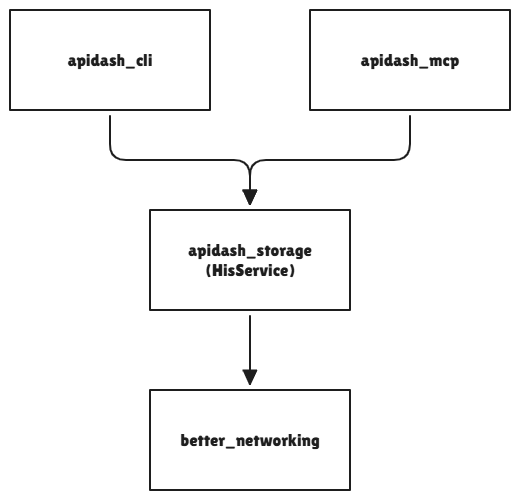
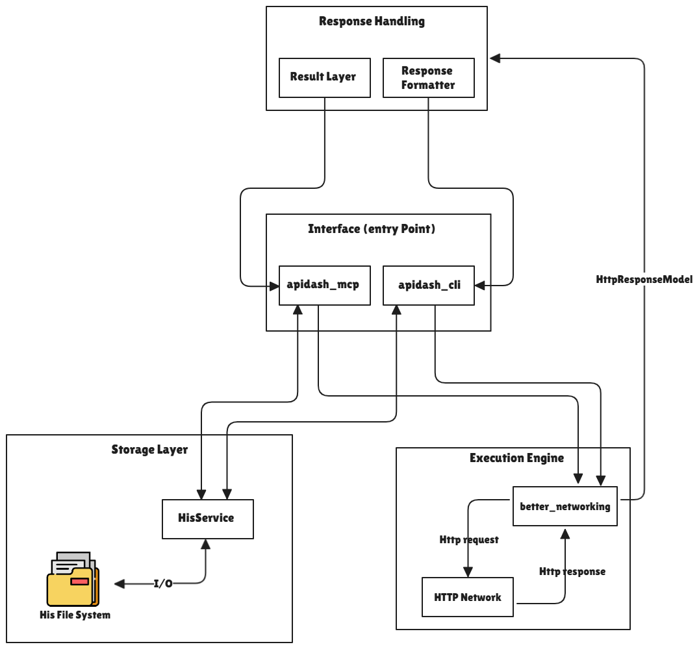
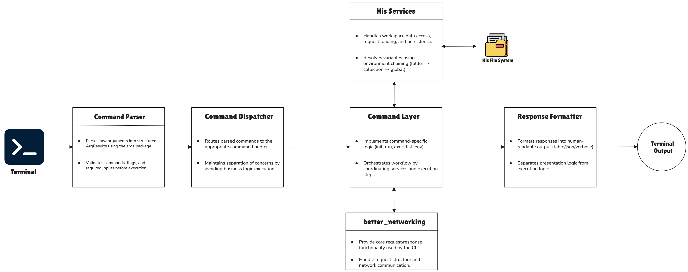
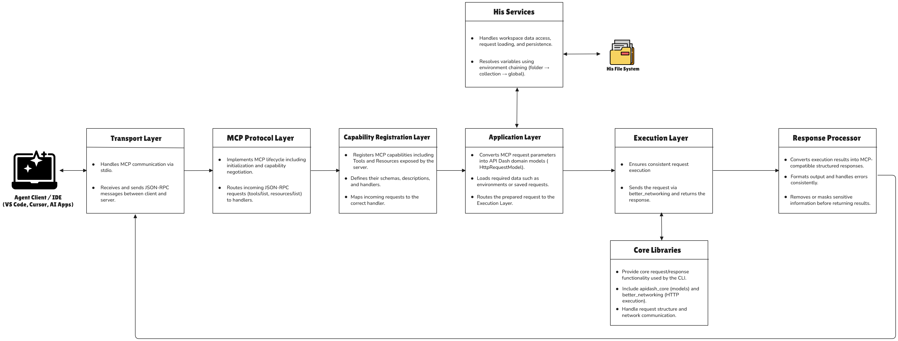

# CLI & MCP Support for API Dash
---

# Section 1 - About

Personal Information

1. Full Name - Bhavesh Mahesh More
2. Contact info - bhaveshmmore2006@gmail.com 
3. Discord handle in our server - `shibu_968_00060`
4. GitHub profile - https://github.com/Bhavesh-More
5. LinkedIn  profile - https://www.linkedin.com/in/bhavesh-moree/
6. Time zone - IST (GMT +05:30)
7. Resume - [resume](https://drive.google.com/file/d/1PDs0g5hOXz4SSx8t8jzYi1u9V3yGzJq-/view?usp=sharing)


####  University Info

1. University name - Vishwakarma Institute of Technology, Pune
2. Program you are enrolled  - B.Tech in Artificial Intelligence and Data Science (AI & DS)
3. Year - 2nd year
4. Expected graduation date - 2028


---

# Section 2 - Motivation & Past Experience

## 1. Have you worked on or contributed to a FOSS project before? Can you attach repo links or relevant PRs?

**Yes, I have contributed to the APIDash and it is my first open source  project by creating issues and submitting pull requests. While my PRs are currently under review, this experience helped me understand real-world collaboration, code standards, and working with existing codebases.**

**Pull Requests:**

- [#1169](https://github.com/foss42/apidash/pull/1169)
- [#1049](https://github.com/foss42/apidash/pull/1049)
- [#1000](https://github.com/foss42/apidash/pull/1000)

**Issues:**

- [#966](https://github.com/foss42/apidash/issues/966)

---

## 2. What is your one project/achievement that you are most proud of? Why?

**I am most proud of building a 2D metaverse application that solves a real-world problem I observed in online competitions and events. It allows organizers to create multiple rooms within a single virtual platform instead of managing multiple meeting links.**

While working on this project, I explored different frameworks and libraries and faced several challenges in integrating them smoothly. Solving this real world problem and successfully completing the project improved my problem-solving skills and gave me a deeper understanding of development.

---

## 3. What kind of problems or challenges motivate you the most to solve them?

I am most motivated by problems that solve real-world challenges and improve how people currently work. For example, while building my 2D metaverse application, I noticed that online competitions and events often require managing multiple meeting links, which can be inefficient. This motivated me to create a solution where multiple rooms can exist within a single platform.

I enjoy challenges that require integrating different technologies and thinking creatively to build practical solutions. Working on such problems helps me learn deeply and improve my skills.

---

## 4. Will you be working on GSoC full-time? In case not, what will you be studying or working on while working on the project?

**I will not be working full time in early phase. I have exams, course projects, and academic responsibilities, but they will not affect my commitment to the project.** However, I will be consistently dedicating time every day to ensure steady progress.

From 1-June-2026 onwards, during my summer break, I will be able to work full time and focus completely on the project.

---

## 5. Do you mind regularly syncing up with the project mentors?

**I am available after 6 PM IST and can join calls whenever needed. I am comfortable with regular sync-ups and discussions with mentors to ensure smooth progress.**

---

## 6. What interests you the most about API Dash?

**What interests me most about API Dash is its minimal design and developer-focused approach to API testing using flutter and dart as base. I like how this open-source project simplifies creating and managing API requests while still being powerful.**

I am especially interested in extending it beyond the GUI into CLI and MCP, making it more accessible in real developer workflows like terminals, automation, and AI-assisted development. The idea of making API Dash usable across multiple interfaces while maintaining consistency is something I find very exciting.

---

## 7. Can you mention some areas where the project can be improved?

**One area where API Dash can be improved is enhancing Dashbot with better history and state management. Currently, adding persistent conversation history and context awareness would make interactions more effective and useful.**

With proper state management, Dashbot could remember previous queries, understand context across multiple steps, and provide more accurate and relevant responses. This would make it more powerful for debugging APIs, iterating on requests, and assisting developers in a more intelligent way.

---

## 8. Have you interacted with and helped API Dash community? 

**Yes, I have interacted with the API Dash community by participating in discussions on GitHub and Discord. I have also collaborated with other contributors on issues and helped in dividing responsibilities to solve them.**

- [#1132](https://github.com/foss42/apidash/issues/1132)
- [#966](https://github.com/foss42/apidash/issues/966)
---

# Section 3 -  Project Details

**Project Title:** - CLI and MCP Support for API Dash

Relevant Discussion: **[#1228 - Idea #6](https://github.com/foss42/apidash/discussions/1228)**

# Problem Statement

API Dash is a powerful API testing client built entirely in Flutter and Dart. Developers can craft, save, and organize API requests through a beautiful GUI. But those saved requests are locked inside the Flutter application. The moment a developer steps outside the GUI, API Dash ceases to exist.

**Developers currently cannot:**

- Run a saved or new API request from the terminal without opening the GUI
- Use API Dash as a headless tool in server or containerized environments
- Allow an AI agent (Claude, Copilot, Cursor) to read, inspect, or execute their saved requests


# Abstract

This project aims to extend API Dash beyond its current GUI-based usage by introducing a command-line interface (CLI) and a Model Context Protocol (MCP) server, enabling developers to interact with their API requests across terminals and AI-assisted environments.

Currently, API Dash is limited to a GUI, limiting its usability in modern development workflows such as CI/CD, server environments, and AI-driven tooling. This project addresses that limitation by building a headless execution layer powered by a new storage architecture called Hierarchical Indexed Storage (HIS), which stores all request data as structured JSON files in a predictable, platform-independent format.

The proposed system introduces three main components: a storage layer (`apidash_storage`) for managing data through HIS, a CLI tool (`apidash_cli`) for executing and managing requests from the terminal, and an MCP server (`apidash_mcp`) that allows AI agents to programmatically access and execute API requests. All components share the same data models and execution engine, ensuring consistency across interfaces.

By making API Dash accessible beyond the GUI while maintaining its simplicity and reliability, this project enhances its role as a modern API testing tool that fits seamlessly into developer workflows, automation systems, and AI-assisted development environments.


## Project Goals

- Enable API Dash usage outside the GUI through a CLI
- Provide MCP support for AI-driven interaction with API requests
- Build a platform independent storage system (HIS) for shared access
- Ensure consistent behavior across CLI and MCP

---
# Detailed Description


# Section 4 - Storage: Hierarchical Indexed Storage (HIS)

## 4.1 Why Not Hive

API Dash currently uses Hive as its persistence layer inside the Flutter GUI. At first glance, sharing this same Hive database between the GUI, CLI, and MCP server seems like the simplest path as its one source of truth, no migration, no new format. However, deeper evaluation reveals two structural problems that make this approach unsuitable for a multi-interface system.

**Problem 1 - Platform dependency :** The GUI resolves its Hive storage path using `shared_preferences`, a Flutter-specific plugin. This plugin is unavailable in a pure Dart environment. A CLI or MCP server cannot call `shared_preferences` to find where the Hive database lives. Not without importing Flutter itself, which would defeat the purpose of a headless tool entirely.

**Problem 2 - No safe concurrent access :**  Hive is designed for single-process usage. When the GUI is open and a CLI command or MCP tool call attempts to read or write the same Hive box simultaneously, Hive does not coordinate between them. This results in `HiveError` exceptions.

These two problems together mean Hive cannot serve as the storage layer for a concurrent access. 

---

## 4.2 Design Philosophy

Hierarchical Indexed Storage (HIS) is a **file-system-first storage architecture with an indexed lookup layer**, designed specifically to solve both problems above while remaining simple enough to implement fully within the GSoC timeline.

The design is inspired by local-first tools such as Obsidian and Git, where the file system itself is the database where every piece of data is a plain, human-readable file, organized into a predictable directory structure, with no proprietary binary format and no runtime lock-in.

Three principles govern every decision in HIS:

**Platform independence** - every read and write operation uses only `dart:io`, which is available in any pure Dart environment. No Flutter plugins, no native bridges, no runtime-specific APIs.

**Safe concurrent access** - file-level `.lock` files coordinate writes between independent processes. CLI and MCP server can all operate simultaneously without corrupting each other's data.

**Transparent data representation** - all data is stored as plain JSON. A developer can open any file in a text editor, understand its contents immediately, and edit it manually if needed.

---

## 4.3 Workspace Structure

Every HIS workspace is a directory on the user's file system. Its layout is fixed and deterministic. Any tool that knows the workspace path can navigate it without any additional configuration.

```
<workspace_path>/
├── .apidash/
│   ├── workspace.json       # active environment, recently opened collections
│   └── meta.json            # HIS schema version for forward compatibility
│
├── collections/
│   ├── col_001/
│   │   ├── collection.json  # index: ordered list of all requests in this collection
│   │   ├── req_101.json     # individual request file
│   │   ├── req_102.json
│   │   └── fld_501/
│   │       ├── folder.json  # first-class index: ordered request list for this folder
│   │       ├── req_201.json
│   │       └── req_202.json
│   └── col_002/
│       ├── collection.json
│       └── req_301.json
│
└── environments/
    ├── global.json           # global variables, always applied as final fallback
    ├── staging.json          # named environment
    └── production.json       # named environment
```

The hierarchy has four levels: **workspace → collection → folder (optional) → request**. Folders are a single level of nesting only, there are no nested folders. This matches the current API Dash GUI model and keeps the directory traversal logic trivial.

`folder.json` is a first-class index file, not just metadata. It carries the same structure and purpose as `collection.json`, scoped to a single folder. The CLI and MCP server can execute an entire folder by reading `folder.json` alone, with no collection-level index read required.

---

## 4.4 The Index File - `collection.json`

The `collection.json` file is the **structural source of truth** for a collection - it knows every request that belongs to the collection, in what order they appear, and enough metadata about each to answer a `list` command without opening any individual request file.

This is the "zero-traversal read" design: the CLI can list an entire collection - names, methods, URLs with a single file read, regardless of how many requests the collection contains.

```json
{
  "id": "col_001",
  "name": "User API Tests",
  "version": "1.0",
  "created_at": "2025-03-01T10:00:00Z",
  "updated_at": "2025-03-24T14:32:00Z",
  "active_env": "staging",
  "requests": [
    {
      "id": "req_101",
      "name": "Get all users",
      "method": "GET",
      "url": "{{BASE_URL}}/users",
      "file": "req_101.json"
    },
    {
      "id": "req_102",
      "name": "Create user",
      "method": "POST",
      "url": "{{BASE_URL}}/users",
      "file": "req_102.json"
    }
  ],
  "folders": [
    {
      "id": "fld_501",
      "name": "Auth flows",
      "path": "fld_501/"
    }
  ]
}
```

The `requests` array defines display order. When a request is added, removed, or reordered, only `collection.json` is updated, the individual request files are untouched. This makes reordering a cheap, atomic operation on a single small file.

---

## 4.5 The Folder Index File - `folder.json`

`folder.json` is a first-class index file that mirrors the structure of `collection.json`, scoped to a single folder. It contains an ordered list of every request inside the folder with enough metadata for zero-traversal listing and execution.

```json
{
  "id": "fld_501",
  "name": "Auth flows",
  "created_at": "2025-03-01T10:00:00Z",
  "active_env": "production",
  "requests": [
    {
      "id": "req_201",
      "name": "Login",
      "method": "POST",
      "url": "{{BASE_URL}}/auth/login",
      "file": "req_201.json"
    },
    {
      "id": "req_202",
      "name": "Refresh token",
      "method": "POST",
      "url": "{{BASE_URL}}/auth/refresh",
      "file": "req_202.json"
    }
  ]
}
```

When the CLI or MCP executes a folder target, it reads `folder.json` directly, one file read and gets the complete ordered request list for that folder. No collection-level index read is required.

---

## 4.6 The Request File - `req_101.json`

Each individual request is stored as its own JSON file, directly serialized from `HttpRequestModel`, the same model used throughout the existing API Dash codebase. No new schema is introduced, no mapping layer is required.

```json
{
  "id": "req_101",
  "name": "Get all users",
  "method": "get",
  "url": "{{BASE_URL}}/users",
  "headers": [
    { "name": "Accept", "value": "application/json" }
  ],
  "params": [
    { "name": "page", "value": "1" }
  ],
  "isHeaderEnabledList": [true],
  "isParamEnabledList": [true],
  "authModel": { "type": "none" },
  "bodyContentType": "json",
  "body": null,
  "query": null,
  "formData": []
}
```

Because each request is its own file, a write to one request never touches any other request. A crash mid-write corrupts at most one file. Recovery is straightforward  the index still knows the request exists, the file can be restored or recreated independently.

---

## 4.7 Environment Files

Environment files are flat JSON key-value maps stored in the workspace-level `environments/` directory. All environments whether referenced by a workspace, collection, or folder  live in this single shared directory. What differs between levels is not where environments are stored, but which environment is declared active at each level.

```json
{
  "name": "production",
  "variables": [
    { "name": "BASE_URL", "value": "https://api.example.com", "enabled": true },
    { "name": "API_KEY",  "value": "prod-secret-key",         "enabled": true }
  ]
}
```

### Per-Level Active Environment Declaration

Every structural level in HIS - workspace, collection, and folder - independently declares its own active environment via an `active_env` field in its respective index file.

**`workspace.json`** - declares the workspace-level active environment, which serves as the final fallback:

```json
{
  "active_env": "global",
  "recently_opened": ["col_001", "col_002"]
}
```

**`collection.json`** - declares the collection-level active environment, overriding the workspace default for all requests in this collection (shown in Section 4.4 above).

**`folder.json`** - declares the folder-level active environment, overriding the collection default for all requests inside this folder (shown in Section 4.5 above).

If `active_env` is absent or `null` at any level, that level is skipped in resolution - the chain moves to the next level automatically.

### Three-Level Variable Resolution Chain

When the CLI or MCP resolves a `{{variable}}` in a request, it walks a deterministic three-level chain. Each level is checked in order. The first level that defines the variable wins - lower levels are never consulted for that variable once it is found.


```
Request is inside a folder
        │
        ▼
Step 1: Read folder.json → active_env field (e.g. "production")
        │
        ▼
Open environments/production.json
Does it define {{BASE_URL}}? → YES → use this value, stop.
                             → NO  → continue to Step 2
        │
        ▼
Step 2: Read collection.json → active_env field (e.g. "staging")
        │
        ▼
Open environments/staging.json
Does it define {{BASE_URL}}? → YES → use this value, stop.
                             → NO  → continue to Step 3
        │
        ▼
Step 3: Open environments/global.json
Does it define {{BASE_URL}}? → YES → use this value, stop.
                             → NO  → leave {{BASE_URL}} unreplaced,
                                      emit a warning to stderr
```

For a request at the collection level (not inside any folder), Step 1 is skipped. For a request with no `active_env` set at the collection level, Steps 1 and 2 are both skipped and resolution uses `global.json` directly.

### Resolution Implementation

```dart
Future<HttpRequestModel> resolveVariables(
  HttpRequestModel model,
  String collectionId, {
  String? folderId,
}) async {
  final envChain = <Map<String, String>>[];

  // folder level
  if (folderId != null) {
    final folderIndex = await getFolderIndex(collectionId, folderId);
    if (folderIndex.activeEnv != null) {
      final env = await loadEnvironment(folderIndex.activeEnv!);
      envChain.add(env);
    }
  }

  // collection level
  final collectionIndex = await getCollectionIndex(collectionId);
  if (collectionIndex.activeEnv != null) {
    final env = await loadEnvironment(collectionIndex.activeEnv!);
    envChain.add(env);
  }

  // global fallback
  final globalEnv = await loadEnvironment('global');
  envChain.add(globalEnv);

  // Apply variable resolution to the request model
  return applyChain(model, chain); 
}

```

The resolution chain is built once per request execution and applied across all fields - URL, headers, body, and query parameters in a single pass. 

The `--env` flag on `apidash run` and `apidash exec` acts as an **override** . When provided explicitly, it bypasses the automatic chain and forces a specific environment at all levels.

---

## 4.8 Workspace Path Resolution

HIS needs to know where the workspace directory lives. Resolution follows a two-step priority chain at startup:

**Step 1 - Environment variable.** The CLI and MCP server check for `APIDASH_WORKSPACE_PATH` at startup. If present, this path is used immediately.

```dart
String? resolveWorkspacePath() {
  return Platform.environment['APIDASH_WORKSPACE_PATH'];
}
```

**Step 2 - Config file fallback.** If the environment variable is absent, a platform-specific config file is read. This file is written during first-run setup by `apidash init` and never needs to be edited manually.

```dart
String? resolveWorkspacePathFromConfig() {  
final file = File('.apidash/config.json');  
if (!file.existsSync()) return null;  
  
final config = jsonDecode(file.readAsStringSync());  
return config['workspace_path'] as String?;  
}
```

```json
{
  "workspace_path": "~/apidash-workspace"
}
```

If neither step resolves a path, the CLI exits with a clear, actionable error message instructing the user to set `APIDASH_WORKSPACE_PATH` or run `apidash init`.

---

## 4.9 Concurrent Write Safety - File Locking

Because the CLI and MCP server are independent OS processes that may run simultaneously, write operations in HIS use a **file-level lock** to prevent conflicts. Before any process writes to a file, it acquires a `.lock` file alongside the target. If the lock file already exists, the process waits with short exponential backoff before retrying.

```dart
Future<void> writeLock(String filePath, String content) async {
  final lockFile = File('$filePath.lock');
  int retries = 0;

  while (lockFile.existsSync() && retries < 5) {
    await Future.delayed(Duration(milliseconds: 50 * (1 << retries)));
    retries++;
  }

  lockFile.writeAsStringSync('$pid');

  try {
    await File(filePath).writeAsString(content);
  } finally {
    if (lockFile.existsSync()) lockFile.deleteSync();
  }
}
```

A common risk in file-based locking is the **"Deadlock of the Crashed Process."** If the CLI or MCP server crashes after creating a `.lock` file but before deleting it, all future write operations would be permanently blocked.

To mitigate this, the `HisService` will implement a **Heartbeat & Stale Lock Detection** strategy:

**PID Validation:** as The `.lock` file will store the Process ID (PID) of the owner. Before waiting on a lock, `HisService` will check if the process with that PID is still active on the OS. If the process no longer exists, the lock is considered "stale" and will be forcibly removed.

---

## 4.10 The HIS Service - Public API

All interaction with HIS goes through a single `HisService` class. Neither the CLI command handlers nor the MCP tool handlers ever touch the file system directly. They call `HisService` and receive Dart objects.

```dart
class HisService {
  final String workspacePath;
  HisService(this.workspacePath);

  // Collection index
  Future<CollectionIndex> getCollectionIndex(String collectionId) async { ... }

  // Folder index
  Future<FolderIndex> getFolderIndex(
    String collectionId,
    String folderId,
  ) async { ... }

  Future<HttpRequestModel?> getRequest(
    String collectionId,
    String requestId, {
    String? folderId,
  }) async { ... }

  Future<void> saveRequest(
    String collectionId,
    HttpRequestModel request, {
    String? folderId,
  }) async { ... }

  // List all collection IDs in the workspace
  Future<List<String>> listCollections() async { ... }

  // Return the active environment chain for display (used by list and get_request_detail)
  Future<List<({String level, String envName})>> resolveEnvironmentChain(
    String collectionId, {
    String? folderId,
  }) async { ... }
}
```

Every method is `async` and returns typed results. Errors surface as typed exceptions - `HisNotFoundException`, `HisLockTimeoutException`, never raw `IOError`s reaching the command layer.

---

## 4.11 Data Flow Summary

Here is exactly what happens when a developer runs `apidash run col_001`:

1. `HisService` reads `APIDASH_WORKSPACE_PATH` from the environment.
2. It opens `collections/col_001/collection.json` - one file read  and gets the ordered list of requests.
3. For each request in sequence, it opens the individual `req_NNN.json` file and deserializes it into an `HttpRequestModel`.
4. It walks the three-level environment chain to resolve all `{{variables}}` in URL, headers, and body.
5. The fully resolved `HttpRequestModel` is passed to `better_networking` for execution.
6. The response is formatted and printed to stdout.

At no point does any step require Flutter, a running GUI, or any native plugin. The entire chain is pure Dart and pure file I/O.

---

# Section 5 - Architecture Overview

## 5.1 Design Philosophy

The architecture of this project follows a single governing principle: **every interface shares the same data, the same models, and the same execution logic.** A request run from the terminal, triggered by an AI agent through MCP, or executed inside the GUI produces identical results because all three paths ultimately converge on the same `HttpRequestModel`, the same `better_networking` execution engine, and the same underlying data in HIS.

This is not just an aesthetic choice, it is a correctness guarantee. If the CLI and the GUI produced different results for the same request, developers could not trust the CLI for automation. The architecture enforces consistency structurally, not through convention.

---

## 5.2 Package Structure

The project introduces three new packages into the existing APIDash monorepo, alongside one refactor of an existing package:

```
apidash/
├── packages/
│   ├── better_networking/     # existing - refactored to pure Dart (Section 8)
│   ├── apidash_storage/       # NEW - HIS implementation and HisService
│   ├── apidash_cli/           # NEW - command-line interface
│   └── apidash_mcp/           # NEW - MCP server
│
├── lib/                  
└── pubspec.yaml
```

---

## 5.3 Dependency Graph

The dependency relationships between all packages form a strict directed acyclic graph - no circular dependencies, no upward dependencies from infrastructure toward consumers.



---

## 5.4 What Each Package Is Responsible For

**`apidash_storage`** owns everything related to reading and writing HIS. It knows where the workspace lives, how to open `collection.json` and `folder.json`, how to deserialize a `req_NNN.json` into an `HttpRequestModel`, how to walk the three-level environment resolution chain, and how to coordinate concurrent writes using file locks. Neither the CLI nor the MCP server ever touch the file system directly.

**`apidash_cli`** owns the terminal interface. It parses command-line arguments, routes them to the correct command handler, calls `HisService` for data, passes `HttpRequestModel` objects to `better_networking` for execution, and formats the response for stdout. It knows nothing about MCP or JSON-RPC.

**`apidash_mcp`** owns the MCP server interface. It speaks JSON-RPC over stdio, registers tools and resources, translates incoming MCP tool calls into `HttpRequestModel` objects via `HisService`, and formats responses as MCP-compliant structured output. It knows nothing about CLI argument parsing.

**`better_networking`** (existing, refactored) performs the actual HTTP execution. After the refactor described in Section 8, it becomes a pure Dart package with no Flutter dependencies.

---

## 5.5 Architecture Diagram



---

# Section 6 - `apidash_cli` Package

## 6.1 Overview

`apidash_cli` is a pure Dart command-line package that exposes API Dash capabilities directly from the terminal. It allows developers to initialize a workspace, execute saved and ad-hoc API requests, manage collections, and control environment variables. All without opening the GUI.

The package has no Flutter dependencies. It imports `apidash_storage` for all data access, and `better_networking` for HTTP execution. It lives at `packages/apidash_cli/` inside the APIDash monorepo and exposes a single compiled executable named `apidash`.

---

## 6.2 Internal Architecture



Every stage is independently testable. No stage holds global state.

---

## 6.3 Command Parser

The `CommandParser` uses the Dart `args` package to define all commands, flags, and options. It converts raw `List<String> args` into a structured `ArgResults` object and validates that all required arguments are present before any execution. If validation fails, it prints a descriptive usage message and exits. The command layer never receives a malformed input.

```dart
ArgParser buildParser() {
  return ArgParser()
    ..addCommand('init')
    ..addCommand('run')
    ..addCommand('exec')
    ..addCommand('list')
    ..addCommand('env')
    ..addOption('method',     abbr: 'm', defaultsTo: 'GET')
    ..addOption('url',        abbr: 'u')
    ..addOption('header',     abbr: 'H', allowMultiple: true)
    ..addOption('body',       abbr: 'd')
    ..addOption('env',        abbr: 'e', defaultsTo: 'global')
    ..addOption('folder',     abbr: 'F')
    ..addOption('request',    abbr: 'r')
    ..addOption('collection', abbr: 'c')
    ..addOption('name',       abbr: 'n')
    ..addOption('format',     abbr: 'f', defaultsTo: 'table',
                allowed: ['table', 'json'])
    ..addFlag('save',         defaultsTo: false)
    ..addFlag('verbose',      abbr: 'v', defaultsTo: false);
}
```

Example terminal usage:

```bash
apidash exec "https://api.example.com/users" --method=POST
```

### Output (conceptually):

```json
ArgResults {  
  command: "exec",  
  url: "https://api.example.com/users",  
  method: "POST"  
}
```

---

## 6.4 Command Dispatcher

Takes the parsed `ArgResults` and routes execution to the correct handler based on the commands. It acts as a **router**. it doesn't execute business logic itself, it just decides _who_ should handle this command.

```dart
Future<void> dispatch(ArgResults results) async {
  switch (results.command?.name) {
    case 'init':  await InitCommand(results).execute();  break;
    case 'run':   await RunCommand(results).execute();   break;
    case 'exec':  await ExecCommand(results).execute();  break;
    case 'list':  await ListCommand(results).execute();  break;
    case 'env':   await EnvCommand(results).execute();   break;
    default:
      print(usageMessage);
  }
}
```

---

## 6.5 Commands

### `apidash init` - Workspace Initialization

`apidash init` is the entry point for first-time setup. It creates the full HIS workspace directory structure, writes `meta.json` and `workspace.json` with sensible defaults, and persists the workspace path to the platform-specific config file so all future commands can resolve it automatically.

```bash
apidash init --path ~/my-apidash-workspace
```

What it does step by step:

- Validates that the target path does not already contain an existing HIS workspace
- Creates the full directory structure defined in Section 4.3
- Writes `meta.json` with the current HIS schema version
- Writes `global.json` in `environments/` as an empty variable set
- Persists the workspace path to the system env variables as well as in  platform-specific config file

---

### `apidash run` - Execute a Collection or Folder

`apidash run` loads a collection or a specific folder from HIS by ID, resolves all environment variables using the three-level chain, and executes every request in the order defined by the target's index file. Results are printed as they complete.

```bash
apidash run <collection-id>
apidash run <collection-id> --folder=<folder-id>
apidash run <collection-id> --request=<request-id>
apidash run <collection-id> --folder=<folder-id> --request=<request-id>
apidash run <collection-id> --env=<environment-name>
apidash run <collection-id> --format=table|json
apidash run <collection-id> --verbose
```

When `--folder` is provided, the CLI reads `fld_NNN/folder.json` directly one file read. When `--folder` is omitted, the CLI reads `collection.json` and executes all requests across the entire collection, folders included, in their defined order. The `--env` flag overrides the automatic three-level resolution chain, forcing a specific environment at all levels.

What it does:

- Without `--folder` - reads `collection.json` to get the full ordered request list across the entire collection
- With `--folder` - reads `folder.json` scoped to that folder only - no collection-level index read required
- Optionally filters to a single request using `--request`, compatible with both collection and folder targets
- Resolves `{{variables}}` using the three-level environment chain (folder → collection → global)
- Executes requests sequentially via `better_networking`
- Prints each response immediately after it completes - not after the entire run finishes
- Exits with a non-zero status code if any request returns a `4xx` or `5xx` response - suitable for CI pipelines

```dart
Future<void> execute() async {
  final his = HisService(resolveWorkspacePath()!);

  final List<RequestIndexEntry> requests;

  if (folderId != null) {
    final folderIndex = await his.getFolderIndex(collectionId, folderId!);
    requests = folderIndex.requests;
  } else {
    final collectionIndex = await his.getCollectionIndex(collectionId);
    requests = collectionIndex.allRequests;
  }

  final targets = requestId != null
      ? requests.where((r) => r.id == requestId).toList()
      : requests;

  for (final entry in targets) {
    final model = await his.getRequest(collectionId, entry.id,
        folderId: entry.folderId);
    final resolved = await his.resolveVariables(model!, collectionId,
        folderId: entry.folderId);
    final response = await BetterNetworking.sendRequest(resolved);
    ResponseFormatter.format(response, format: outputFormat, verbose: verbose);
  }
}
```

---

### `apidash exec` - Execute an Ad-hoc Request

`apidash exec` sends a single HTTP request constructed entirely from command-line arguments, without requiring anything to be saved in HIS first.

```bash
apidash exec "https://api.example.com/users"
apidash exec "https://api.example.com/users" --method=POST
apidash exec "https://api.example.com/users" --method=POST --body='{"name":"Alice"}' --header="Content-Type: application/json"
apidash exec "https://api.example.com/users" --env=production
apidash exec "https://api.example.com/users" --name="Get users" --save
apidash exec "https://api.example.com/users" --format=table|json --verbose
```

The `--save` flag controls persistence. Without it, the request is executed and discarded. With `--save`, the request is written to HIS as a new `req_NNN.json` file under the default collection and the `collection.json` index is updated before execution. The `--name` flag sets the human-readable name stored in the index - omitting it auto-generates a name from the method and URL.

```dart
Future<void> execute() async {
  final model = HttpRequestModel(
    url: resolveEnvInline(url, envName),
    method: HTTPVerb.values.byName(method.toLowerCase()),
    headers: parseHeaders(headerArgs),
    body: body,
    bodyContentType: inferContentType(headerArgs),
  );

  if (save) {
    final his = HisService(resolveWorkspacePath()!);
    await his.saveRequest('default', model.copyWith(
      name: name ?? '${method.toUpperCase()} ${Uri.parse(url).path}',
    ));
  }

  final response = await BetterNetworking.sendRequest(model);
  ResponseFormatter.format(response, format: outputFormat, verbose: verbose);
}
```

---

### `apidash list` - List Saved Requests

`apidash list` reads HIS index files and displays saved data without executing any requests. It operates at four levels of granularity - workspace, collection, folder, and single request.

The first three levels work entirely from index files and never open individual request files, making them near-instant regardless of collection size. Only the single-request view opens an individual `req_NNN.json` file, since full request details are intentionally not duplicated in the index.

```bash
apidash list
apidash list <collection-id>
apidash list <collection-id> --folder=<folder-id>
apidash list <collection-id> --request=<request-id>
apidash list <collection-id> --folder=<folder-id> --request=<request-id>
apidash list <collection-id> --format=table|json
apidash list <collection-id> --folder=<folder-id> --format=table|json
```

**`apidash list`** - no arguments. Reads all `collection.json` files and prints a workspace-level summary:

```
ID         NAME               REQUESTS   ACTIVE ENV
col_001    User API Tests     5          staging
col_002    Auth Suite         3          production
```

**`apidash list <collection-id>`** - collection level. Prints every request and folder in the collection, sourced entirely from `collection.json`:

```
COLLECTION: User API Tests  (active env: staging)

TYPE       ID         NAME              METHOD   URL
request    req_101    Get all users     GET      {{BASE_URL}}/users
request    req_102    Create user       POST     {{BASE_URL}}/users
folder     fld_501    Auth flows        -        3 requests
```

**`apidash list <collection-id> --folder=<folder-id>`** - folder level. Reads `folder.json` only:

```
FOLDER: Auth flows  (active env: production)

ID         NAME              METHOD   URL
req_201    Login             POST     {{BASE_URL}}/auth/login
req_202    Refresh token     POST     {{BASE_URL}}/auth/refresh
req_203    Logout            DELETE   {{BASE_URL}}/auth/logout
```

**`apidash list <collection-id> --request=<request-id>`** - single request view. Opens `req_NNN.json` and displays the complete `HttpRequestModel` plus the active environment chain:

```
REQUEST: Get all users  (req_101)

Method:        GET
URL:           {{BASE_URL}}/users
Headers:       Accept: application/json  [enabled]
Query Params:  page: 1  [enabled]
Auth:          none
Body:          (none)

Environment chain:
  folder       production
  collection   staging
  global       global
```

---

### `apidash env` - Environment Management

`apidash env` provides full CRUD control over HIS environment files.

```bash
apidash env list                                     # list all environment names
apidash env list <environment-name>                  # list all variables in an environment
apidash env create <environment-name>                # create a new empty environment
apidash env delete <environment-name>                # delete an environment
apidash env set <environment-name> <key> <value>     # set a variable
apidash env unset <environment-name> <key>           # remove a variable
apidash env use <environment-name>                   # set as active environment in workspace.json
```

The `apidash env use` subcommand writes the active environment name to `workspace.json`, so subsequent commands automatically use that environment without requiring an explicit `--env` flag.

---

## 6.6 Response Formatter

```dart
abstract class BaseFormatter {
  void format(HttpResponseModel response, HttpRequestModel request);
}

class TableFormatter   extends BaseFormatter { ... }
class JsonFormatter    extends BaseFormatter { ... }
class VerboseFormatter extends BaseFormatter { ... }

class ResponseFormatter {
  static void format(
    HttpResponseModel response, {
    String format = 'table',
    bool verbose = false,
  }) {
    final formatter = switch (formatType) {  
		case 'json':  
		return JsonFormatter();  
		  
		case 'table':  
		default:  
		return TableFormatter();  
	}
    formatter.format(response);
    if (verbose) VerboseFormatter().format(response);
  }
}
```

**Table format** - prints status code, response time, content type, and a body preview. Readable at a glance by a human.

**JSON format** - prints the full response as structured JSON.

**Verbose mode** - available on top of either format via `--verbose`. Prints the full outgoing request before the response, useful for debugging variable resolution.

---

## 6.7 CLI Packages

|Package|Purpose|
|---|---|
|`args`|Command-line argument parsing and validation|
|`mason_logger`|Structured, colourful terminal output and progress indicators|


---

# Section 7 - `apidash_mcp` Package

## 7.1 Overview

`apidash_mcp` is a pure Dart Model Context Protocol server that exposes API Dash capabilities to AI agents. Once configured, any MCP compatible client - Claude Desktop, VS Code Copilot, Cursor can list collections, inspect requests, execute them, run entire collections, and query environment variables, all without the developer opening the GUI or writing any code.

The package has no Flutter dependencies. It imports `apidash_storage`,and `better_networking` the exact same dependency chain as `apidash_cli`. It communicates with AI clients exclusively over stdio using the JSON-RPC 2.0 protocol defined by the MCP specification.

The package lives at `packages/apidash_mcp/` inside the APIDash monorepo.

---

## 7.2 What MCP Makes Possible

Once `apidash_mcp` is running and connected to an AI client, a developer can have the following conversation with their AI assistant:

> _"Run the 'User API Tests' collection against the production environment and tell me which requests are failing."_

The agent calls `exec_collection`, receives structured responses for every request, identifies the failures, and reports back  without the developer opening a terminal, writing a script, or touching the GUI. This is the core value proposition of exposing API Dash as an MCP server.

A natural agent discovery workflow looks like this:

```
list_collections → list_requests → list_folder_requests
       → get_request_detail → exec_request
```

The agent navigates the workspace the same way a developer does on the terminal starting broad and drilling down before executing anything.

---

## 7.3 Six-Layer Architecture

`apidash_mcp` is structured as six discrete layers. Each layer has exactly one responsibility and communicates only with the layers immediately above and below it.



---

## 7.4 Layer 1 - Transport Layer

The Transport Layer manages the communication channel between the MCP server and the AI client. `apidash_mcp` uses `StdioServerTransport` as its sole transport. The server reads JSON-RPC messages from stdin and writes responses to stdout. The AI client launches the server as a child process and communicates through its standard streams.

This transport requires zero network configuration, works on all platforms, and is the default expected by every major MCP client.

```dart
Future<void> main() async {
  final server = McpServer(
    Implementation(name: 'apidash_mcp', version: '1.0.0'),
    options: ServerOptions(
      capabilities: ServerCapabilities(
        tools:     ServerCapabilitiesTools(),
        resources: ServerCapabilitiesResources(),
      ),
    ),
  );

  await registerCapabilities(server);
  final transport = StdioServerTransport();
  await server.connect(transport);
}
```

---

## 7.5 Layer 2 - Protocol Layer

The Protocol Layer implements the MCP lifecycle, the handshake that every compliant MCP server must complete before any tool or resource calls are accepted. It handles the `initialize` request, responds with the server's declared capabilities, and registers handlers for `tools/list` and `resources/list`.

```dart
server.onInitialize((params) async {
  return InitializeResult(
    serverInfo: Implementation(name: 'apidash_mcp', version: '1.0.0'),
    capabilities: server.options.capabilities,
  );
});

server.onListTools((params) async =>
  ListToolsResult(tools: CapabilityRegistry.getAllTools()));

server.onListResources((params) async =>
  ListResourcesResult(resources: CapabilityRegistry.getAllResources()));
```

---

## 7.6 Layer 3 - Capability Registry

### Tools

The MCP server exposes seven tools mirroring the four granularity levels of `apidash list` plus the three execution tools.

---

**`list_collections`** - workspace level. Returns all collections with ID, name, request count, and active environment. Reads only `collection.json` files.

```dart
server.addTool(
  'list_collections',
  description: 'List all collections in the API Dash workspace '
               'with their request count and active environment',
  inputSchema: {'type': 'object', 'properties': {}},
  handler: ApplicationLayer.handleListCollections,
);
```

---

**`list_requests`** - collection level. Returns the ordered list of every request and folder in a collection, sourced entirely from `collection.json`. No individual request files opened.

```dart
server.addTool(
  'list_requests',
  description: 'List all requests and folders in a collection '
               'in their defined execution order',
  inputSchema: {
    'type': 'object',
    'properties': {
      'collection_id': {'type': 'string'},
    },
    'required': ['collection_id'],
  },
  handler: ApplicationLayer.handleListRequests,
);
```

---

**`list_folder_requests`** - folder level. Returns the ordered list of every request inside a folder, sourced entirely from `folder.json`. No individual request files opened.

```dart
server.addTool(
  'list_folder_requests',
  description: 'List all requests inside a specific folder '
               'in their defined execution order',
  inputSchema: {
    'type': 'object',
    'properties': {
      'collection_id': {'type': 'string'},
      'folder_id':     {'type': 'string'},
    },
    'required': ['collection_id', 'folder_id'],
  },
  handler: ApplicationLayer.handleListFolderRequests,
);
```

---

**`get_request_detail`** - single request view. Opens `req_NNN.json` and returns the complete `HttpRequestModel` plus the active environment chain. This is the only listing tool that opens an individual request file.

```dart
server.addTool(
  'get_request_detail',
  description: 'Get the complete definition of a saved request including '
               'all headers, body, auth, params, and the active environment '
               'chain that will be applied during execution',
  inputSchema: {
    'type': 'object',
    'properties': {
      'collection_id': {'type': 'string'},
      'request_id':    {'type': 'string'},
      'folder_id':     {
        'type': 'string',
        'description': 'Required if the request is inside a folder',
      },
    },
    'required': ['collection_id', 'request_id'],
  },
  handler: ApplicationLayer.handleGetRequestDetail,
);
```

---

**`exec_request`** - executes either a saved request by ID or a fully ad-hoc request constructed from parameters. Environment variable resolution via the three-level chain is applied before execution.

```dart
server.addTool(
  'exec_request',
  description: 'Execute a saved or ad-hoc HTTP request and return the response',
  inputSchema: {
    'type': 'object',
    'properties': {
      'request_id':    {'type': 'string',
                        'description': 'ID of a saved request - omit for ad-hoc'},
      'collection_id': {'type': 'string'},
      'folder_id':     {'type': 'string'},
      'url':           {'type': 'string'},
      'method':        {'type': 'string',
                        'enum': ['GET','POST','PUT','DELETE','PATCH']},
      'headers':       {'type': 'object'},
      'body':          {'type': 'string'},
      'environment':   {'type': 'string'},
    },
  },
  handler: ApplicationLayer.handleExecRequest,
);
```

---

**`exec_collection`** - executes all requests in a collection sequentially and returns a structured result for each.

```dart
server.addTool(
  'exec_collection',
  description: 'Execute all requests in a collection and return all responses',
  inputSchema: {
    'type': 'object',
    'properties': {
      'collection_id': {'type': 'string'},
      'environment':   {'type': 'string'},
    },
    'required': ['collection_id'],
  },
  handler: ApplicationLayer.handleExecCollection,
);
```

---


**`exec_folder`** - executes all requests in a folder sequentially and returns a structured result for each.

```dart
server.addTool(
  'exec_folder',
  description: 'Execute all requests inside a specific folder '
               'in their defined execution order',
  inputSchema: {
    'type': 'object',
    'properties': {
      'collection_id': {'type': 'string'},
      'folder_id':     {'type': 'string'},
      'environment':   {'type': 'string'},
    },
    'required': ['collection_id', 'folder_id'],
  },
  handler: ApplicationLayer.handleExecFolder,
);
```

---


**`list_environments`** - returns the names of all environment files in the workspace.

```dart
server.addTool(
  'list_environments',
  description: 'List all available environments in the workspace',
  inputSchema: {'type': 'object', 'properties': {}},
  handler: ApplicationLayer.handleListEnvironments,
);
```

### Resources

**Request Resource** - exposes every saved request as a readable MCP resource including its full definition and environment chain.

```dart
server.addResource(
  uri: 'apidash://requests/{collection_id}/{request_id}',
  name: 'Saved request',
  description: 'Full definition of a saved API request including '
               'all fields and active environment chain',
  handler: ApplicationLayer.handleReadRequest,
);
```

**Environment Resource** - exposes every environment file as a readable resource.

```dart
server.addResource(
  uri: 'apidash://environments/{environment_name}',
  name: 'Environment variables',
  description: 'Key-value variable pairs in a named API Dash environment',
  handler: ApplicationLayer.handleReadEnvironment,
);
```

---

## 7.7 Layer 4 - Application Layer

The Application Layer bridges the MCP world and the API Dash domain. When a tool call arrives, this layer receives raw MCP parameters plain JSON and converts them into  API Dash objects. It calls `HisService` to load saved data from HIS, resolves environment variables, and produces a fully hydrated `HttpRequestModel` ready for execution.

```dart
class ApplicationLayer {

  static Future<CallToolResult> handleExecRequest(
    CallToolRequest request,
  ) async {
    final params = request.arguments;
    final his = HisService(resolveWorkspacePath());
    HttpRequestModel model;

    if (params['request_id'] != null) {
      final saved = await his.getRequest(
        params['collection_id'], params['request_id'],
        folderId: params['folder_id'],
      );
      if (saved == null) {
        return ResponseProcessor.formatError(
            'Request not found: ${params['request_id']}');
      }
      model = saved;
    } else {
      model = HttpRequestModel(
        url:    params['url'],
        method: HTTPVerb.values.byName(
            (params['method'] as String).toLowerCase()),
        headers: parseHeaders(params['headers']),
        body:    params['body'],
      );
    }

    final resolved = await his.resolveVariables(
      model, params['collection_id'],
      folderId: params['folder_id'],
    );
    return await ExecutionLayer.execute(resolved);
  }

}
```

---

## 7.8 Layer 5 - Execution Layer

The Execution Layer performs the actual HTTP operation by delegating to `better_networking`. It is identical in purpose to the executor in `apidash_cli`. Both ultimately call the same function with the same model. This guarantees that an `exec_request` tool call and an `apidash exec` command produce identical HTTP behaviour.

```dart
class ExecutionLayer {
  static Future<CallToolResult> execute(HttpRequestModel model) async {
    try {
      final response = await BetterNetworking.sendRequest(model);
      return ResponseProcessor.format(response);
    } catch (e) {
      return ResponseProcessor.formatError(e.toString());
    }
  }
}
```

---

## 7.9 Layer 6 - Response Processor

The Response Processor normalises all outputs into MCP compliant `CallToolResult` objects. Before any response reaches the AI agent, sensitive headers - `Authorization`, `x-api-key`, and `cookie` are replaced with `[REDACTED]` to prevent credentials from leaking into the agent's context window.

```dart
class ResponseProcessor {

  static CallToolResult format(HttpResponseModel response) {
    final redactedHeaders = _redactHeaders(response.headers ?? {});
    final body = _prettyPrint(response.body);
    return CallToolResult(
      content: [
        TextContent(
          text: 'Status: ${response.statusCode}\n'
                'Headers: ${jsonEncode(redactedHeaders)}\n'
                'Body:\n$body',
        ),
      ],
      isError: (response.statusCode ?? 0) >= 400,
    );
  }

  static CallToolResult formatCollection(List<CallToolResult> results) {
    final summary = results.map((r) => r.content.first).join('\n---\n');
    return CallToolResult(
      content: [TextContent(text: summary)],
      isError: results.any((r) => r.isError),
    );
  }
}
```

---

## 7.10 Client Configuration

**Claude Desktop** (`~/Library/Application Support/Claude/claude_desktop_config.json`):

```json
{
  "mcpServers": {
    "apidash": {
      "command": "dart",
      "args": ["run", "apidash_mcp"],
      "env": {
        "APIDASH_WORKSPACE_PATH": "~/apidash-workspace"
      }
    }
  }
}
```

**VS Code Copilot** (`.vscode/mcp.json`):

```json
{
  "servers": {
    "apidash": {
      "type": "stdio",
      "command": "dart",
      "args": ["run", "apidash_mcp"],
      "env": {
        "APIDASH_WORKSPACE_PATH": "${workspaceFolder}/.apidash-workspace"
      }
    }
  }
}
```


---

## 7.11 MCP Package Dependency

|Package|Purpose|
|---|---|
|`mcp_dart`|Dart implementation of the Model Context Protocol - MCP server, tool registration, resource registration, stdio transport|

---

# Section 8 - Refactoring `better_networking` to Pure Dart

## 8.1 Why This Refactor Must Come First

`apidash_cli` and `apidash_mcp` are pure Dart packages. They cannot import any package that transitively depends on Flutter. `better_networking` is the HTTP execution engine that both packages need but in its current state, it imports Flutter in three files.

This refactor is a hard prerequisite for everything else in this proposal. Until `better_networking` is pure Dart, neither `apidash_cli` nor `apidash_mcp` can compile. It is the first task in the implementation timeline and gates all subsequent work.

---

## 8.2 The  Flutter Dependencies

A personal audit of the `better_networking` codebase confirms exactly three files that import Flutter:

| File                                    | Flutter Import                                       | Used For                   |
| --------------------------------------- | ---------------------------------------------------- | -------------------------- |
| `lib/services/http_client_manager.dart` | `package:flutter/foundation.dart`                    | `kIsWeb` platform check    |
| `lib/utils/auth/handle_auth.dart`       | `package:flutter/foundation.dart`                    | `debugPrint` logging       |
| `lib/utils/auth/oauth2_utils.dart`      | `package:flutter_web_auth_2/flutter_web_auth_2.dart` | Mobile OAuth2 browser flow |
| lib/utils/platform_utils.dart           | `package:flutter/foundation.dart`                    | `kIsWeb` platform check    |

---

## 8.3 Fix 1 - Replace `kIsWeb` with a Pure Dart Compile-Time Check

**Current code in `http_client_manager.dart`:**

```dart
import 'package:flutter/foundation.dart';

void configureClient() {
  if (kIsWeb) {  }
}
```

**Fix:**

```dart
// Remove: import 'package:flutter/foundation.dart';
const bool kIsWeb = bool.fromEnvironment('dart.library.js_interop');

void configureClient() {
  if (kIsWeb) {  }
}
```

`dart.library.js_interop` is a Dart compile-time constant that evaluates to `true` when compiled for the web and `false` on all native platforms. It is semantically identical to Flutter's `kIsWeb` - same value, same meaning, zero Flutter dependency.

**Impact on GUI:** None. The Flutter GUI continues to function identically.

---

## 8.4 Fix 2 - Replace `debugPrint` with `dart:developer`

**Current code in `auth_utils.dart`:**

```dart
import 'package:flutter/foundation.dart';

void logAuthEvent(String message) {
  debugPrint('OAuth: $message');
}
```

**Fix:**

```dart
// Remove: import 'package:flutter/foundation.dart';
import 'dart:developer' as developer;

void logAuthEvent(String message) {
  developer.log(message, name: 'apidash.auth');
}
```

`developer.log` writes to the Dart VM's logging infrastructure, visible in both Flutter DevTools and pure Dart debugging environments. It supports structured metadata and log levels - strictly more capable than `debugPrint`.

**Impact on GUI:** None. `developer.log` is captured by Flutter DevTools exactly as `debugPrint` was.

---

## 8.5 Fix 3 - Decouple Mobile OAuth2 from `better_networking`

**Current situation in `oauth2_utils.dart`:**

```dart
import 'package:flutter_web_auth_2/flutter_web_auth_2.dart';

Future<String> getAuthorizationCode(String authUrl) async {
  final result = await FlutterWebAuth2.authenticate(
    url: authUrl,
    callbackUrlScheme: 'apidash',
  );
  return Uri.parse(result).queryParameters['code']!;
}
```

**Root cause analysis:** The OAuth2 flow has two distinct responsibilities currently mixed in one file:

1. **The browser step** - opening a native browser or webview and capturing the redirect callback URI. On mobile this requires `flutter_web_auth_2`. On desktop and CLI it uses a localhost callback server - pure Dart, no Flutter needed.
2. **The token exchange step** - exchanging the authorization code for an access token via HTTP POST. This is pure HTTP logic that belongs in `better_networking` regardless of platform.

**Fix - split responsibilities by platform:**

```
Before fix:
better_networking owns everything:
  └── open browser (flutter_web_auth_2) ← Flutter dependency
  └── capture callback URI
  └── exchange code for token (pure Dart)

After fix:
Flutter frontend owns:
  └── open browser (flutter_web_auth_2) - mobile only
  └── capture callback URI
  └── hand callback URI to better_networking

better_networking owns:
  └── localhost callback server (desktop + CLI) - pure Dart
  └── exchange code for token - pure Dart, all platforms
```

```dart
// In better_networking - pure Dart
typedef OAuth2AuthorizationCallback = Future<String> Function({
  required String url,
  required String callbackUrlScheme,
});

OAuth2AuthorizationCallback? oauth2AuthorizationCallback;

callbackUri = await oauth2AuthorizationCallback(
        url: authorizationUrl.toString(),
        callbackUrlScheme: actualRedirectUrl.scheme,
);
```

```dart
// In Flutter frontend
setOAuth2AuthorizationCallback(({
    required String url,
    required String callbackUrlScheme,
  }) {
    return FlutterWebAuth2.authenticate(
      url: url,
      callbackUrlScheme: callbackUrlScheme,
      options: const FlutterWebAuth2Options(
        useWebview: true,
        windowName: 'OAuth Authorization - API Dash',
      ),
    );
  });
```

**Impact on GUI:** The Flutter GUI's mobile OAuth2 flow continues to work exactly as before. The browser-opening step lives in the frontend; the token exchange stays in `better_networking` and is now reachable by CLI and MCP.

---

## 8.6 Result After All Three Fixes

||Before|After|
|---|---|---|
|`flutter/foundation.dart` imports|2 files|0 files|
|`flutter_web_auth_2` imports|1 file|0 files|
|Pure Dart compatible|No|Yes|
|Flutter GUI behaviour|Unchanged|Unchanged|
|Desktop OAuth2|Works|Works|
|Mobile OAuth2|Works|Works|
|CLI/MCP importable|No|Yes|

---

# Section 9 - Timeline & Deliverables

## 9.1 Scope Constraint

This project is **90-hour small project** size. Every hour is accounted for. The timeline is deliberately conservative  no phase assumes overtime, no phase compresses multiple complex deliverables into a single week.

The 90 hours are distributed across 9 weeks at approximately 10 hours per week. The ordering of phases is strict: each phase is a prerequisite for the next.

---

## 9.2 Phase Breakdown

### Phase 0 - Prerequisite: `better_networking` Refactor

**Weeks 1 - 10 hours**

This phase has the smallest scope and the most clearly defined success condition: `better_networking` must compile and pass all existing tests without any Flutter dependency. Nothing else can start until this is done.

| Task                                                         |
| ------------------------------------------------------------ |
| Remove `kIsWeb` Flutter import - Fix 1                       |
| Remove `debugPrint` Flutter import - Fix 2                   |
| Decouple mobile OAuth2 - Fix 3                               |
| Write pure Dart importability test                           |
| Run existing test suite, fix any bug                         |
| GUI test cases for new chnages - confirm no behaviour change |

**Deliverable:** `better_networking` is a pure Dart package. All existing tests pass. A new test passes. PR submitted for maintainer review.

---

### Phase 1 - `apidash_storage` (HIS Full Implementation)

**Weeks 2, 3, 4 - 30 hours**

This is the highest-risk phase and receives the most hours. HIS is the foundation of the entire project if it is wrong, both the CLI and MCP are wrong. It receives three full weeks and a dedicated buffer.

**Week 2 - Core file operations and workspace structure**

| Task                                                                                 |
| ------------------------------------------------------------------------------------ |
| Workspace directory creation (`apidash init` storage layer)                          |
| `collection.json` and `folder.json` read/write + schema                              |
| Individual `req_NNN.json` schema + read/write using `HttpRequestModel` serialization |
| `meta.json` and `workspace.json` read/write                                          |
| File locking (`writeWithLock`) implementation                                        |

**Week 3 - Environment system and variable resolution**

| Task                                                       |
| ---------------------------------------------------------- |
| Environment file read/write                                |
| Three-level variable resolution chain (`resolveVariables`) |
| `resolveEnvironmentChain` for display use                  |
| Workspace path resolution - env var + config file fallback |

**Week 4 - HisService public API, error handling, and tests**

| Task                                                                 |
| -------------------------------------------------------------------- |
| Complete `HisService` class - all public methods                     |
| Typed exceptions (`HisNotFoundException`, `HisLockTimeoutException`) |
| tests createion - read/write, locking, variable resolution, env      |

**Deliverable:** `apidash_storage` package is complete. `HisService` passes its full test suite. A base for `apidash init`, create collections and environments, and read them back correctly. PR submitted.

---

### Phase 2 - `apidash_cli`

**Weeks 5, 6 - 20 hours**

The CLI is built entirely on top of `HisService`. Every command is a thin layer over the storage and networking packages.

**Week 5 - Core commands**

| Task                                            |     |
| ----------------------------------------------- | --- |
| `CommandParser` and `CommandDispatcher`         |     |
| `apidash init` command                          |     |
| `apidash run` - collection and folder execution |     |
| `apidash exec` - ad-hoc request + `--save` flag |     |
| `ResponseFormatter` - table and JSON formats    |     |

**Week 6 - Listing, environment management, and tests**

| Task                                                 |
| ---------------------------------------------------- |
| `apidash list` - all four granularity levels         |
| `apidash env` - all subcommands                      |
| CLI integration tests - end-to-end command execution |
| Documentation - `--help` text for all commands       |

**Deliverable:** `apidash_cli` package is complete. All five commands work end-to-end against a real HIS workspace. PR submitted.

---

### Phase 3 - `apidash_mcp`

**Weeks 7, 8 - 20 hours**

The MCP server is also built on top of `HisService`. The six-layer architecture keeps the MCP-specific code minimal, most of the complexity is in the tool schemas and the Application Layer translation.

**Week 7 - Transport, protocol, and listing tools**

| Task                                                     |
| -------------------------------------------------------- |
| Transport Layer + Protocol Layer (stdio, handshake)      |
| Capability Registry setup                                |
| `list_collections` tool + handler                        |
| `list_requests` tool + handler                           |
| `list_folder_requests` tool + handler                    |
| `get_request_detail` tool + handler (includes env chain) |
| `list_environments` tool + handler                       |
| Request and Environment resources                        |

**Week 8 - Execution tools, response processor, and tests** 

| Task                                                        |
| ----------------------------------------------------------- |
| `exec_request` tool + Application Layer handler             |
| `exec_collection` tool + Application Layer handler          |
| Response Processor - normalise, redact, format              |
| Integration tests - tool calls against real HIS workspace   |
| Client configuration docs - Claude Desktop, VS Code, Cursor |

**Deliverable:** `apidash_mcp` package is complete. All seven tools and two resources work end-to-end. Server connects to Claude Desktop and VS Code Copilot. PR submitted.

---

### Phase 4 - Finalisation

**Week 9**

| Task                                                 |
| ---------------------------------------------------- |
| Final review of all three PRs with mentor feedback   |
| README for each new package - setup, usage, examples |
| GSoC final report                                    |
| Buffer - address any review comments, fix edge cases |

**Deliverable:** All PRs merged or in final review. Documentation complete. GSoC report submitted.

---

## 9.3 Full Timeline at a Glance

|Week|Phase|Focus|Hours|
|---|---|---|---|
|1|Phase 0|`better_networking` refactor + tests|10|
|2|Phase 1|HIS - workspace structure, file ops, locking|10|
|3|Phase 1|HIS - environment system, variable resolution|10|
|4|Phase 1|HIS - HisService API, error handling, tests|10|
|5|Phase 2|CLI - init, run, exec, response formatter|10|
|6|Phase 2|CLI - list, env, integration tests|10|
|7|Phase 3|MCP - transport, protocol, listing tools|10|
|8|Phase 3|MCP - execution tools, response processor, tests|10|
|9|Phase 4|Docs, final review, GSoC report, buffer|10|
|||**Total**|**90 hrs**|

---

# Section 10 - Benefits to the Community

## For Developers

API Dash users can now test their APIs from the terminal without opening the GUI. A developer working in a terminal-centric environment - SSH sessions, headless servers, containerized development, can use the same saved requests they built in the GUI directly from the command line.

The `--save` flag on `apidash exec` means the CLI is not just a consumer of requests created in the GUI - it is a first-class way to create and save new requests. Developers who prefer a CLI workflow never need to open the GUI at all.

## For AI-Assisted Development

The MCP server transforms API Dash from a GUI tool into an AI-native one. Developers using Claude, Copilot, or Cursor as part of their workflow can ask their AI assistant to run API tests, inspect request definitions, identify failing endpoints, and compare responses across environments - all without context-switching to a separate application.

The structured tool and resource design means AI agents can navigate a workspace intelligently: discovering what collections exist, understanding what a request does before running it, and reasoning about the full environment chain that will be applied.

## For the API Dash Ecosystem

The `apidash_storage` package establishes a clean, documented, file-based format for API Dash data. This format is the foundation for future extensions - plugins, automation scripts, integrations with other tools - that can all read and write the same format without depending on the Flutter runtime.

The `better_networking` refactor to pure Dart is an improvement for the entire codebase independent of this proposal: it reduces Flutter coupling in a package that has no reason to be Flutter-dependent, and makes it available to any future pure Dart tooling built on top of API Dash.

---

#### Why I should be selected for this project

My first meaningful exposure to open source came through API Dash, and it immediately resonated with me as a Flutter developer. Contributing to the project helped me understand the importance of thoughtful design, performance, and maintaining high standards in developer-focused tools.

If selected, I will commit consistent time and focused effort, not just during the program but beyond it. I approach development with a strong emphasis on precision, maintainability, and building solutions that are genuinely useful in real-world workflows.

This is more than just an internship for me, it is an opportunity to make a meaningful contribution while continuously improving my skills. I am committed to putting in the work required to deliver reliable, high-quality results and create a lasting impact through this project.