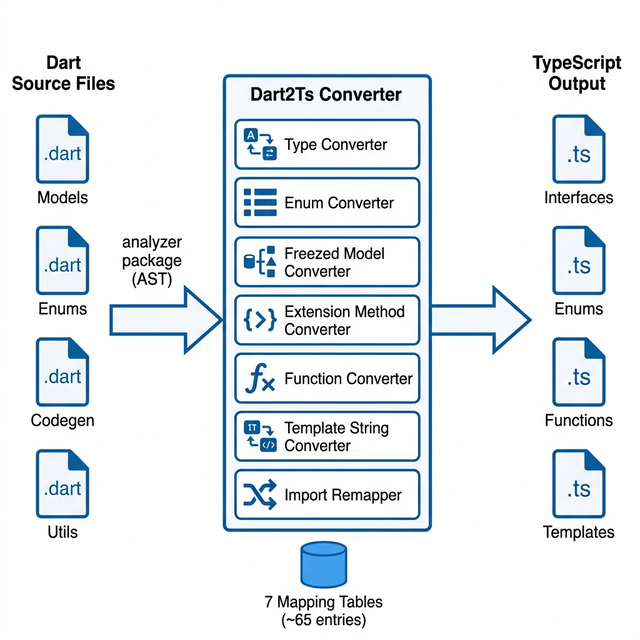

### About

1. **Full Name:** Deep Buha
2. **Contact Info:** +91 9687429520
3. **Discord Handle:** `deep_buha_73838`
4. **GitHub Profile:** [https://github.com/DeepBuha06](https://github.com/DeepBuha06)
5. **LinkedIn:** [deepbuha](https://www.linkedin.com/in/deepbuha/)
6. **Time Zone:** GMT +05:30 (IST)
7. **Resume:** [Link](https://drive.google.com/file/d/1Ea4RtjnlrXhAqbfkQEwWwrPqOGc4Z4QF/view?usp=sharing)

### University Info

1. **University Name:** Indian Institute of Technology, Gandhinagar (IIT Gandhinagar)
2. **Program:** B.Tech, Computer Science and Engineering
3. **Year:** 2nd Year
4. **Expected Graduation Date:** 2028

### Motivation & Past Experience

1. **Have you worked on or contributed to a FOSS project before?**
   - Yes. I've contributed to [NetworkX](https://github.com/networkx/networkx), a widely-used Python library for graph algorithms and network analysis. Apart from that, I built the [Professor Mailing Bot](https://github.com/DeepBuha06/prof_mailing_bot) as an open-source tool - it uses LangChain, Chroma vector stores, and Playwright+Gemini scraping to help students find and contact professors across IITs via semantic search. On the development side, I've worked on websites like TEDx IITGn, which is a responsive website with a frontend themed around a phoenix, made using React. [WEBSITE](https://tedxiitgandhinagar.com/)

2. **What is your one project/achievement that you are most proud of? Why?**
   - The [Professor Mailing Bot](https://github.com/DeepBuha06/prof_mailing_bot). It started as a personal need - finding professors with matching research interests across multiple IITs. It evolved into a full system with a three-stage scraping pipeline (basic Scrapy, then Playwright, then Playwright + Gemini AI), a semantic search engine using Chroma vector store with cosine similarity, and a Streamlit frontend. What makes me proud is the scraping evolution: I went from basic crawling to AI-assisted scraping where Gemini automatically detects department and faculty page URLs, making it work across any college website. It's deployed at [prof-mailing-bot.streamlit.app](https://prof-mailing-bot.streamlit.app/).

3. **What kind of problems or challenges motivate you the most?**
   - I like problems where i have to think from every angle - every edge case, every possible scenario. I find it fascinating to map out all the possibilities and come up with a solution that handles all of them. Finding the best, most complete solution is what keeps me going.

4. **Will you be working on GSoC full-time?**
   - Yes, primarily full-time. The GSoC period lines up with my summer break (May to July). There might be some end-semester exams at the start of May but I can manage them alongside the project.

5. **Do you mind regularly syncing up with project mentors?**
   - Not at all. I'm available after 5 PM IST on weekdays and flexible on weekends.

6. **What interests you the most about API Dash?**
   - Two things: the clean monorepo architecture and the fact that business logic is separated from the UI layer. `packages/seed`, `apidash_core`, and `better_networking` are all pure Dart with zero Flutter imports - which is exactly what makes the Dart-to-TypeScript converter possible. For my work, I only need to deal with the logic code, not the UI framework.

7. **Can you mention some areas where the project can be improved?**
   - **No VS Code presence:** most developers use VS Code or a similar IDE. Having to leave the editor to test APIs is unnecessary friction. An in-editor extension would capture this audience.
   - **No environment variables:** switching between dev/staging/prod requires manually changing URLs every time. A `{{base_url}}` system with environment profiles would save a lot of time.
   - **No import from Postman/Insomnia:** developers already have existing collections in other tools. Importing them (Postman collections, Insomnia exports, cURL commands) lowers the barrier to adoption.

---

## Project Details

- **Project Title:** VS Code Extension for API Dash via AST-based Dart-to-TypeScript Converter
- **Relevant Issues:** New idea proposal, [discussion PR](https://github.com/foss42/apidash/pull/1342)
- **PoC:** [Working Extension](https://github.com/DeepBuha06/APIDASH-Extension) | [Demo Video](https://youtu.be/zzto-fWGIdE)

---

## Abstract

This project brings API Dash into VS Code through two parts: an **AST-based Dart-to-TypeScript converter** that automates porting API Dash's business logic, and the **VS Code extension** itself built from the converter's output. The converter uses Dart's official `analyzer` package to parse source files into an AST, then applies ~65 pattern-matching rules across 7 modules to produce TypeScript. The extension uses VS Code's Extension Host (Node.js) for logic and a Webview for UI, communicating via `postMessage`. A working PoC already shows HTTP requests, code generation in 3 languages (using templates identical to API Dash's Dart code), and a sidebar with saved requests.

## Project Goals

**Core Deliverables (Weeks 1-12):**

1. Build an AST-based Dart-to-TypeScript converter that auto-ports API Dash's models, enums, codegen templates, and utility functions
2. Build a fully functional VS Code extension with all core API Dash features
3. Port all 33 code generators using the same Nunjucks template approach proven in the PoC
4. Add VS Code-native features: environment variables, cURL/Postman/Insomnia import, request history
5. Import `.env` files with auto-sync from the user's project directory
6. Request troubleshooting console that logs the full request/response lifecycle (resolved URLs, sent headers, redirects, timing)

**Stretch Goals (if core is completed ahead of schedule):**

7. **Visual Workflow Builder:** A node-based canvas where users can drag API request nodes, connect them into chains, and run the entire workflow with a single click
8. **Collection Runner:** Run all requests in a collection sequentially or in parallel with a single click, with a summary report showing pass/fail status for each request

Stretch goals won't be started until all 6 core deliverables are working, tested, and documented. If time doesn't permit, they'll be cut cleanly without affecting the core extension.

---

## Proposal Description

### Deliverables

1. **Dart2Ts Converter Tool:** A Dart CLI program with 7 converter modules that reads `.dart` files from API Dash's packages and outputs `.ts` files. Re-runnable whenever API Dash's upstream code changes.
2. **VS Code Extension Core:** Extension Host setup, commands, sidebar, storage - all the plumbing that has no Dart equivalent.
3. **HTTP Client:** Axios-based client replacing `better_networking`, with URL sanitization, error handling, and timeout support.
4. **Code Generation (33 languages):** All generators ported via Nunjucks (same `{{ }}` syntax as API Dash's Jinja), proven by PoC to work with identical templates.
5. **Webview Request Editor:** Full request editor with URL bar, method dropdown, params/headers/body tabs, response viewer with syntax highlighting.
6. **Environment Variable System:** `{{variable}}` substitution, env switching (dev/staging/prod), workspace-level configs.
7. **Import/Export:** cURL import, Postman collection import, Insomnia export import, `.env` file sync, export as `.json`.
8. **Request Troubleshooting Console:** A log panel showing the resolved request details, response headers, timing, and redirects for every request sent.

### Stretch Goals (If Time Permits)

1. **Visual Workflow Builder (Canvas):** A React Flow node-based canvas where users can drag API request nodes, connect them into chains, and map responses to subsequent requests.
2. **Collection Runner:** Execute all requests in a collection sequentially or in parallel with a single click, providing a summary report showing pass/fail status.
---

### Technical Details

### Part 1: Dart2Ts Converter Architecture



The converter reads API Dash's Dart source files using the official `analyzer` package, walks the AST, and applies pattern-matching rules to output TypeScript. Using the AST means the converter understands code structure - it knows `String` in `String url` is a type (convert to `string`) but `String` in `myStringBuilder` is part of a variable name (leave it alone). Regex can't make this distinction.

**7 Converter Modules:**

| Module | What It Converts | How It Works |
|---|---|---|
| Type Converter | `String` to `string`, `List<T>` to `T[]`, `Map<K,V>` to `Record<K,V>` | Lookup table with around 20 type mappings |
| Enum Converter | Dart enums to TypeScript string enums | Reads AST `EnumDeclaration` nodes |
| Freezed Model Converter | `@freezed` classes to TS classes with `copyWith()`, `toJson()`, `fromJson()` | Detects `@freezed`, extracts factory params, converts getters |
| Extension Method Converter | Dart extensions to standalone utility functions | Reads `ExtensionDeclaration`, rewrites call sites |
| Function Converter | Named params, return types, method calls | `.contains()` to `.includes()`, `.isNotEmpty` to `.length > 0` |
| Template String Converter | `"""..."""` / `'''...'''` / `r'...'` to JS backtick literals | Direct syntax swap |
| Import Remapper | `package:jinja` to `nunjucks`, `package:http` to `axios` | Reads from YAML config |

**Core Implementation - AST Visitor:**

```dart
class Dart2TsVisitor extends RecursiveAstVisitor<void> {
  final StringBuffer output = StringBuffer();

  @override
  void visitClassDeclaration(ClassDeclaration node) {
    // Check for @freezed annotation
    if (_hasFreezedAnnotation(node)) {
      _convertFreezedClass(node);
    } else {
      output.writeln('export class ${node.name.lexeme} {');
      super.visitClassDeclaration(node);
      output.writeln('}');
    }
  }

  @override
  void visitMethodInvocation(MethodInvocation node) {
    final method = node.methodName.name;
    // Pattern match: .contains() to .includes()
    if (_dartToTsMethodMap.containsKey(method)) {
      output.write('.${_dartToTsMethodMap[method]}(');
      node.argumentList.arguments.forEach((arg) => arg.accept(this));
      output.write(')');
    } else {
      super.visitMethodInvocation(node);
    }
  }
}
```

**Example Conversion - HttpRequestModel getter:**

```dart
// INPUT: Dart (from packages/apidash_core/lib/models/)
get hasFormData => kMethodsWithBody.contains(method) && formDataMapList.isNotEmpty
```
```typescript
// OUTPUT: TypeScript (auto-generated)
get hasFormData() { return kMethodsWithBody.includes(this.method) && this.formDataMapList.length > 0; }
```

**What gets auto-converted:**

| Source | Files | Output |
|---|---|---|
| `packages/seed/lib/models/` | 3 | `src/models/seed.ts` |
| `packages/better_networking/lib/models/` | 7 | `src/models/networking.ts` |
| `packages/apidash_core/lib/models/` | 4 | `src/models/core.ts` |
| `lib/codegen/**/` | 30+ | `src/codegen/**/*.ts` |
| `packages/*/lib/extensions/` | 2 | `src/utils/*.ts` |
| `packages/*/lib/utils/` | 5 | `src/utils/*.ts` |
| All `consts.dart` | 3 | `src/consts.ts` |

Around 55-60 files total, producing around 3000+ lines of TypeScript.

**Why a converter instead of manual rewrite?** Two reasons:
1. Saves time - 70% of translation is automated
2. **Sustainability** - when API Dash adds a new codegen language or updates a model, re-run the converter and get updated TypeScript instantly

**Why not dart2js or dart compile wasm?** I looked into this early on. Dart can compile to JavaScript via `dart2js` and to WebAssembly via `dart compile wasm`. But both produce optimized, minified output that isn't human-readable. `dart2js` does aggressive dead code elimination, function inlining, and minification - so while the output runs fine, no one can actually read, debug, or extend it. The whole point of the converter is to produce **clean, readable TypeScript** that works with VS Code's TypeScript tooling - IntelliSense, type checking, debugging all work naturally. A `dart2js` blob wouldn't give us any of that. `dart compile wasm` targets WasmGC which is designed for browser environments, not Node.js Extension Hosts. The Dart Dev Compiler (DDC) produces more readable output, but it's meant for development only and still doesn't generate TypeScript types. The custom converter is more work upfront (weeks 1-3), but it produces output that's actually maintainable - which matters for a project that needs to keep up with API Dash's core.

---

### Part 2: VS Code Extension Architecture


**Key Technical Decision - Nunjucks for Code Generation:**

The PoC already proves this works. API Dash's Dart codegen uses Jinja templates with `jj.Template(tmpl).render(data)`. The TypeScript version uses Nunjucks with `nunjucks.renderString(tmpl, data)`. The template strings are byte-for-byte identical:

```dart
// API Dash (Dart) - lib/codegen/python/requests.dart
String kTemplateStart = """import requests
url = '{{url}}'
""";
```
```typescript
// VS Code Extension (TypeScript) - src/codegen/python_requests.ts
const kTemplateStart = `import requests
url = '{{url}}'
`;
```

Same templates, different rendering engine. This is proven in the [PoC](https://github.com/DeepBuha06/APIDASH-Extension).

**Webview Request Editor Wireframe:**

The request editor is the main panel where you compose and send API requests. It has a method dropdown, URL bar with environment variable support, and tabs for params, headers, body, and auth.


**Sidebar Wireframe:**

The sidebar organizes collections, environments, and request history in a tree view. You can browse, create, rename, delete, and reorder requests without leaving the sidebar.


**Response Viewer Wireframe:**

After sending a request, the response viewer shows the status code with color-coded badges, response time, body size, and a syntax-highlighted response body with pretty/raw toggle.


---

### Part 3: Environment Variables (New Feature)

#### Why Do Developers Need Environments?

When building an API, the same endpoint exists in multiple places. During development you might run the server on `http://localhost:3000`. Before release, a staging copy runs at `https://staging.api.example.com`. And the live version your users hit is at `https://api.example.com`. All three serve the same endpoints (like `/api/users`), but the base URL changes.

Without environment variables, switching between these means manually editing the URL every time. Working on a feature locally, change the URL to localhost. Need to check if it works on staging? Go back and change it again. Ready to test production? Change it one more time. Multiply this by 20 saved requests in a collection, and you're wasting time doing the same edit over and over - and risking accidentally hitting the wrong server.

**Environment variables solve this completely.** Instead of hardcoding `https://api.prod.com/api/users`, you write `{{base_url}}/api/users`. Then you define what `base_url` means in each environment:

| Variable | Development | Staging | Production |
|---|---|---|---|
| `base_url` | `http://localhost:3000` | `https://staging.api.example.com` | `https://api.example.com` |
| `api_key` | `dev-key-12345` | `staging-key-67890` | `sk-prod-xxxxx` |
| `timeout` | `30000` | `10000` | `5000` |

Now switching from local to production is a single dropdown change - every request in your collection updates at once. No manual edits, no mistakes, no accidentally sending test data to production. This is how Postman, Insomnia, and pretty much every professional API tool works.

**Wireframe:**


**Implementation:**

```typescript
interface Environment {
    name: string;
    variables: Record<string, string>;
}

function resolveVariables(url: string, env: Environment): string {
    return url.replace(/\{\{(\w+)\}\}/g, (_, key) => env.variables[key] || `{{${key}}}`);
}
```

The environment dropdown lives in the Webview header. Switching environments triggers re-resolution of all `{{variables}}` across URL, headers, and body.

**Storage:** Environments are saved per-workspace in `.vscode/apidash-envs.json`, allowing different projects to have different environment configs.

**.env File Sync:** Most projects already have a `.env` file in the root with variables like `API_KEY=xxx` and `DATABASE_URL=yyy`. The extension watches for `.env` files in the workspace and offers to import them as an environment profile, so you don't have to re-enter values you already have. When the `.env` file changes on disk, the extension auto-syncs the updated values.

---

### Part 4: Import / Export

**cURL Import:**
```typescript
// User pastes: curl -X POST https://api.com -H "Auth: Bearer token" -d '{"name":"test"}'
// Extension parses into a RequestModel automatically
import { parseCurl } from 'curlconverter';
```

**Postman Import:** Postman collections are JSON files with a known schema. We parse them into our `RequestModel[]` format:

```typescript
function importPostmanCollection(json: PostmanCollection): RequestModel[] {
    return json.item.map(item => ({
        name: item.name,
        url: item.request.url.raw,
        method: item.request.method as HTTPVerb,
        headers: item.request.header.map(h => ({ name: h.key, value: h.value, enabled: true })),
        // ... map remaining fields
    }));
}
```

**Postman Environment Import:** Beyond collections, you can also import Postman environment files (`.postman_environment.json`), which map directly to our environment variable system. So a team already using Postman can switch to API Dash without losing any of their saved configs.

**Insomnia Import:** Insomnia exports collections as JSON (v4 format) or YAML. The structure is similar to Postman's - each request has a URL, method, headers, and body. We parse the Insomnia export into our `RequestModel[]` the same way we handle Postman, covering the other major API client developers might be migrating from.

---

### Part 5: Request Troubleshooting Console

When an API request fails or returns something unexpected, you need to see exactly what happened. The troubleshooting console logs the full request/response lifecycle for every request sent:

- **Resolved URL:** The final URL after all `{{variables}}` are replaced, so you can verify the right environment was used
- **Sent Headers:** Every header that actually went over the wire, including auto-added ones (Content-Type, User-Agent)
- **Redirect Chain:** If the server returned 301/302 redirects, the console shows the full chain of URLs
- **Timing Breakdown:** DNS lookup, TCP connection, TLS handshake, time to first byte, total time
- **Response Size:** Exact byte count of headers and body separately

This is similar to Postman's console. It's especially useful when debugging auth failures, CORS issues, or environment variable problems where the resolved URL doesn't match what you expected.

**Implementation:** The console is a VS Code Output Channel (the same mechanism that VS Code uses for its own logs). Every request logs a structured entry, and developers can filter by request name or status code.

```typescript
const console = vscode.window.createOutputChannel('API Dash Console');

function logRequest(req: ResolvedRequest, res: Response): void {
    console.appendLine(`[${new Date().toISOString()}] ${req.method} ${req.resolvedUrl}`);
    console.appendLine(`  Status: ${res.status} ${res.statusText}`);
    console.appendLine(`  Time: ${res.timing.total}ms (DNS: ${res.timing.dns}ms, TCP: ${res.timing.tcp}ms)`);
    console.appendLine(`  Size: ${res.headers['content-length']} bytes`);
    console.appendLine(`  Headers Sent: ${JSON.stringify(req.headers, null, 2)}`);
}
```

---

### Part 6: Visual Workflow Builder (Extra Feature)

> This is a stretch goal planned for the later weeks. It uses VS Code's Webview with React Flow to create a visual API chaining canvas.

**Concept:** A lot of the time you need to test a sequence of API calls where each one depends on the previous one's response. For example, you log in to get a token, use that token to fetch the current user, then use the user's ID to fetch their orders. Doing this manually means copying values from one response and pasting them into the next request - tedious and error-prone.

The workflow builder solves this with a drag-and-drop canvas. You place API request nodes, draw connections between them, and define data mappings (which field from the response feeds into which field of the next request). Then you click "Run All" and the entire chain executes in order.

**Wireframe:**


**Example Flow:**

```
[Login POST] --$.data.token--> [Get User GET] --$.user.id--> [Get Orders GET]
```

Each node is a `RequestModel`. Edges define data mappings (JSONPath from response to target field in next request). Execution runs in topological order.

**Why VS Code works well for this:** React Flow is a well-established library for node-based UIs. Flutter would need a custom canvas drawing solution. VS Code's Webview supports React out of the box, making this much simpler to build. Plus, you're already in your editor - build a workflow, run it, see failures, fix your code, and re-run without switching windows.

This feature is deliberately placed in the later weeks to ensure core features are solid first.

---

### Part 7: Collection Runner (Extra Feature)

> This feature lets developers run every request in a collection with a single click, providing a summary report at the end.

**The problem with existing tools:** Postman already has a Collection Runner, but it's buried deep in the interface - hidden behind menus and extra screens that most people never find unless someone shows them. A lot of Postman users don't even know the feature exists. A powerful testing capability goes unused just because it's hard to discover.

**Our approach:** In the API Dash extension, running a collection is as obvious as sending a single request. There's a "Run All" button right at the top of every collection in the sidebar, and right-clicking any collection shows "Run Collection" as the first context menu option. No hunting through menus, no hidden screens - the feature is where you'd expect it to be.

If you have a collection of 15 API requests for a "User Management" module, you shouldn't have to click Send on each one individually to verify everything works. The Collection Runner fires all requests in a collection sequentially (or in parallel, your choice) and presents a summary:

| Request | Status | Time | Pass/Fail |
|---|---|---|---|
| GET /users | 200 OK | 142ms | Pass |
| POST /users | 201 Created | 89ms | Pass |
| GET /users/:id | 200 OK | 67ms | Pass |
| DELETE /users/:id | 204 No Content | 45ms | Pass |
| GET /users/:id | 404 Not Found | 23ms | Pass (expected) |

Developers can define expected status codes per request, so a `404` after deleting a user counts as a pass, not a failure. The summary report highlights failures in red so issues are immediately visible.

**Implementation:** This uses the existing HTTP client and collection storage. The runner goes through each request, fires it, collects the result, and renders a summary table in the Webview. A progress bar shows real-time execution status, and you can cancel mid-run if you spot a failure early.

---

## Proof of Concept

I've already built and submitted a working PoC:

- **Repository:** [APIDASH-Extension](https://github.com/DeepBuha06/APIDASH-Extension)
- **Demo Video:** [YouTube](https://youtu.be/zzto-fWGIdE)

**What the PoC covers:**

| Feature | Status |
|---|---|
| Send HTTP requests (GET/POST/PUT/DELETE) with headers, params, body | Working |
| Code generation - Python, JavaScript, cURL | Working |
| Template strings identical to API Dash's Dart code | Proven |
| Sidebar with saved requests (TreeView API) | Working |
| VS Code theme integration (auto dark/light mode) | Working |
| URL auto-sanitization (adds `https://` if missing) | Working |
| Request persistence across sessions | Working |

**Key file:** `src/codegen/python_requests.ts` - the template strings are the exact same as `lib/codegen/python/requests.dart`. Only the render call changed from `jj.Template().render()` to `nunjucks.renderString()`.

---

## Technical Dependencies

| Package | Purpose |
|---|---|
| [`analyzer`](https://pub.dev/packages/analyzer) | Parses Dart code into AST for the converter |
| [`nunjucks`](https://www.npmjs.com/package/nunjucks) | Template engine (same `{{ }}` syntax as Jinja) |
| [`axios`](https://www.npmjs.com/package/axios) | HTTP client with interceptors, cancellation |
| [`highlight.js`](https://www.npmjs.com/package/highlight.js) | Syntax highlighting in response viewer |
| [`curlconverter`](https://www.npmjs.com/package/curlconverter) | cURL command parser for import |
| [`@vscode/test-electron`](https://www.npmjs.com/package/@vscode/test-electron) | Extension integration testing |
| [`reactflow`](https://www.npmjs.com/package/reactflow) | Node-based canvas for visual workflow builder |
| [`dotenv`](https://www.npmjs.com/package/dotenv) | Parsing `.env` files for environment variable sync |

---

## Weekly Timeline (175 hours over 12 weeks)

### Week 1: Converter Foundation
- Set up `dart2ts` project with `analyzer` package integration
- Implement the AST visitor skeleton (`RecursiveAstVisitor`)
- Build the **Type Converter** module (around 20 Dart-to-TS type mappings)
- Build the **Enum Converter** module (read `EnumDeclaration` nodes)
- Write unit tests for both modules against API Dash's actual enum and type files

**DELIVERABLE:** A tool that reads API Dash's `.dart` files and correctly converts all type annotations and enum declarations to TypeScript.

### Week 2: Converter Core Models
- Build the **Freezed Model Converter** - extract factory constructor params, generate TypeScript class with `copyWith()`, `toJson()`, `fromJson()`
- Convert all 20 computed getters in `HttpRequestModel` using the method mapping table
- Build the **Extension Method Converter** - read `ExtensionDeclaration`, generate standalone functions, rewrite call sites across codebase
- Test against `packages/seed/lib/models/`, `packages/apidash_core/lib/models/`

**DELIVERABLE:** All API Dash models and extension methods auto-converted to TypeScript. `HttpRequestModel` with all 20 getters working.

### Week 3: Converter Complete + Verify
- Build the **Function Converter** - handle named parameters, return types, body method calls (`.contains()` to `.includes()`, `.isNotEmpty` to `.length > 0`, etc.)
- Build the **Template String Converter** - `"""..."""` to backtick, `r'...'` to raw string
- Build the **Import Remapper** - `package:jinja` to `nunjucks`, `package:http` to `axios`, skip `dart:io`
- Run the complete converter on API Dash's full codebase and verify output compiles with `tsc`
- Fix edge cases discovered during full-codebase run

**DELIVERABLE:** Complete converter that processes all 55-60 Dart files and produces compiling TypeScript. Converter is re-runnable for future updates.

### Week 4: Extension Scaffold + Converter Output Integration
- Scaffold the VS Code extension with `yo code` - `package.json`, `tsconfig.json`, Activity Bar icon
- Plug in the converter's TypeScript output and verify it compiles
- Set up the Extension Host entry point (`activate()`/`deactivate()`)
- Register commands (New Request, Open Request, Delete Request)
- Set up CI: lint + compile check on every push

**DELIVERABLE:** A VS Code extension that loads, shows the Activity Bar icon, and has registered commands. Converter output is integrated and compiling.

### Week 5: HTTP Client + Storage
- Build the HTTP client using `axios` - request construction, URL sanitization, timeout, error handling, response timing, JSON pretty-printing
- Add request cancellation support using `AbortController`
- Build the storage service - each request collection saved as JSON via `globalState`
- Write unit tests for HTTP client (mock server) and storage (round-trip persistence)

**DELIVERABLE:** A working HTTP client that sends requests and returns formatted responses, plus a storage layer that persists requests across sessions.

### Week 6: Sidebar + Collections
- Implement `TreeDataProvider` for saved requests with method-specific icons
- Add collection support - group requests into folders
- Implement drag-to-reorder, rename, delete operations
- Register context menu commands (Right-click to Delete, Duplicate, Move to Collection)
- Connect sidebar clicks to opening requests in the Webview

**DELIVERABLE:** A fully functional sidebar showing collections and requests with all CRUD operations.

### Week 7: Webview Request Editor
- Build the Webview UI - URL bar, method dropdown, Send button
- Implement tabs for Params, Headers, Body with key-value table
- Add body type selector (none, JSON, text, form-data)
- Build `postMessage` communication between Webview and Extension Host
- Style using VS Code CSS variables for automatic theme support (dark, light, high contrast)

**DELIVERABLE:** A complete request editor UI that collects user input and communicates with the Extension Host.

### Week 8: Response Viewer + Syntax Highlighting
- Display response with status badge (color-coded: green 2xx, yellow 3xx, red 4xx/5xx), response time, size
- Integrate `highlight.js` for syntax-highlighted response body (JSON, XML, HTML)
- Add raw/preview toggle for response body
- Display response headers in a formatted table
- Build the loading overlay with spinner and cancel button

**DELIVERABLE:** A polished response viewer with syntax highlighting, status indicators, and all response metadata.

### Week 9: Code Generation (All 33 Languages)
- Wire up all 30+ Nunjucks generators from the converter output
- Build the code generation panel in the Webview - language picker dropdown, Generate button, Copy button
- Test each generator against sample requests to verify output is valid
- Add URL sanitization before code generation (proven in PoC)

**DELIVERABLE:** All 33 code generators working - Python, JavaScript, cURL, Rust, Go, Java, C#, Kotlin, Swift, Dart, PHP, Ruby, and more.

### Week 10: Environment Variables + Import
- Build the environment variable system - `{{variable}}` substitution in URL, headers, body
- Add environment dropdown in the Webview header (dev, staging, prod)
- Store environments per-workspace in `.vscode/apidash-envs.json`
- Implement `.env` file sync - watch for changes, auto-import variables
- Implement cURL import using `curlconverter` package
- Implement Postman collection and environment import (parse JSON schema to `RequestModel[]`)
- Build the request troubleshooting console (Output Channel with structured logging)

**DELIVERABLE:** Working environment variable switching, `.env` file sync, import from cURL/Postman, and request troubleshooting console.

### Week 11: History + Collection Runner + Polish
- Implement request history with date grouping (Today, Yesterday, Last Week)
- Build the Collection Runner - execute all requests in a collection, generate summary report
- Add keyboard shortcuts - `Ctrl+Enter` to send, `Ctrl+N` for new request
- Add status bar item showing active environment
- Error handling polish - friendly messages for network errors, timeouts, invalid URLs
- Fix edge cases and UI bugs discovered during testing

**DELIVERABLE:** A polished extension with history, collection runner, keyboard shortcuts, and comprehensive error handling.

### Week 12: Testing + Documentation + Release
- Write unit tests using Mocha for HTTP client, storage, codegen
- Write integration tests using `@vscode/test-electron` for end-to-end flows
- Write user documentation - README with screenshots, keyboard shortcut reference
- Write developer documentation - converter architecture, how to add new generators
- Package as `.vsix` and prepare for VS Code Marketplace submission
- Begin Visual Workflow Builder scaffolding (React Flow setup in Webview) if time permits

**DELIVERABLE:** Fully tested, documented extension ready for marketplace. Technical documentation and final GSoC report.

---

## Relevant Skills & Experience

### Skills
- **Languages:** Python, C++, JavaScript, TypeScript, Dart
- **Frameworks:** Flutter, Flask, Streamlit, LangChain
- **Tools:** Git, VS Code, Docker, Playwright, Scrapy, Chroma, Firebase
- **Competitive Programming:** Active problem solver in C++ and Python

### Experience
- **Senior Tech Team Member, TEDx IIT Gandhinagar** - Built and maintained the official TEDx IITGN website
- **Liquid Galaxy Project** - Developed a Flutter Controller App that controls multiple screens running Google Earth in sync, enabling coordinated multi-display visualization
- **Open Source Contributor** - Contributed to [NetworkX](https://github.com/networkx/networkx), a Python library for graph algorithms

### Projects

- **[Professor Mailing Bot](https://github.com/DeepBuha06/prof_mailing_bot)**
  - Semantic faculty recommender using LangChain, Chroma, and Playwright+Gemini AI scraping
  - Three-stage scraping evolution: Scrapy, then Playwright, then AI-assisted (Gemini auto-detects faculty page URLs)
  - Deployed: [prof-mailing-bot.streamlit.app](https://prof-mailing-bot.streamlit.app/)

- **Liquid Galaxy Controller App**
  - Flutter app controlling multiple screens running Google Earth in synchronized view
  - Inter-screen communication and real-time sync for multi-display setups

- **TEDx IITGN Website**
  - Official event website built as part of the senior tech team
  - Handled design, development, and deployment for the college TEDx chapter

---

### What I Have Done So Far

- Forked the repo, set up the dev environment, and ran the app on Windows
- Went through the codebase to understand how it's structured and how the packages fit together
- Looked into alternatives for the key technology choices
- **Built a working PoC** - a VS Code extension that sends HTTP requests, generates code in 3 languages, and has a sidebar with saved requests
- **Proven the key insight** - Nunjucks templates are byte-for-byte identical to API Dash's Jinja templates, which means all 33 codegen languages can be ported using the same approach
- [PoC Repository](https://github.com/DeepBuha06/APIDASH-Extension) | [Demo Video](https://youtu.be/zzto-fWGIdE)
