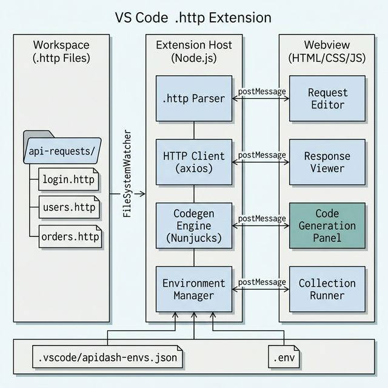
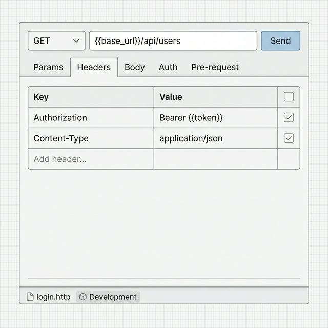
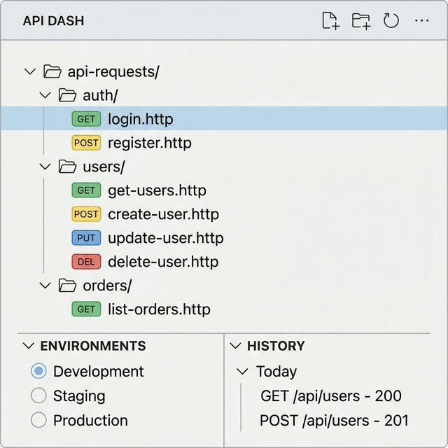
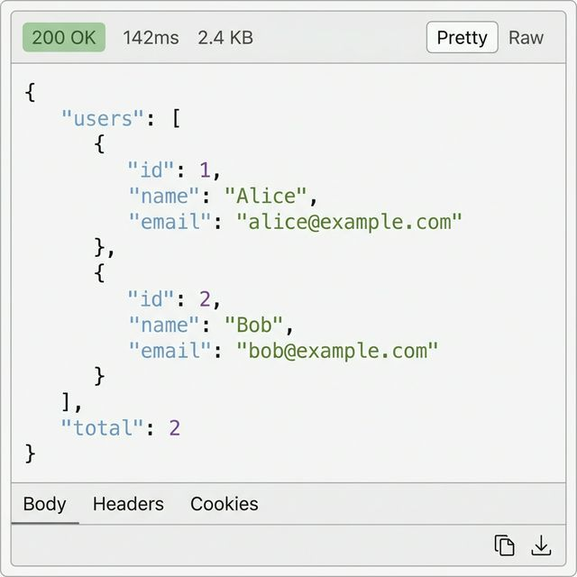
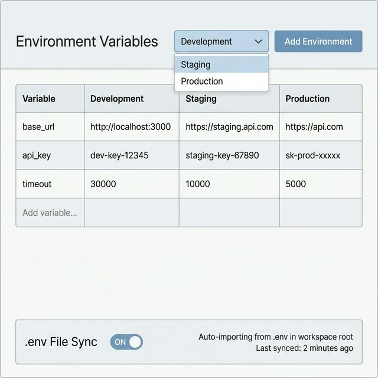
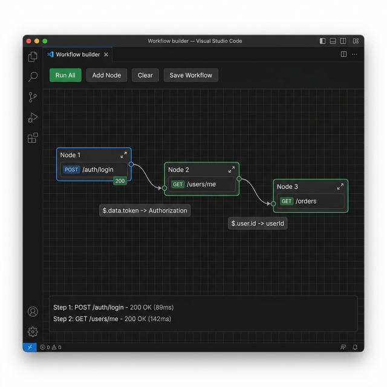

### About

1. **Full Name:** Deep Buha
2. **Contact Info:** +91 9687429520
3. **Discord Handle:** `deep_buha_73838`
4. **GitHub Profile:** [https://github.com/DeepBuha06](https://github.com/DeepBuha06)
5. **LinkedIn:** [deepbuha](https://www.linkedin.com/in/deepbuha/)
6. **Time Zone:** GMT +05:30 (IST)
7. **Resume:** [Link](https://drive.google.com/file/d/1Ea4RtjnlrXhAqbfkQEwWwrPqOGc4Z4QF/view?usp=sharing)

### University Info

1. **University Name:** Indian Institute of Technology, Gandhinagar (IIT Gandhinagar)
2. **Program:** B.Tech, Computer Science and Engineering
3. **Year:** 2nd Year
4. **Expected Graduation Date:** 2028

### Motivation & Past Experience

1. **Have you worked on or contributed to a FOSS project before?**
   - Yes. I've contributed to [NetworkX](https://github.com/networkx/networkx), a Python library for graph algorithms with 15k+ GitHub stars. I also built and open-sourced the [Professor Mailing Bot](https://github.com/DeepBuha06/prof_mailing_bot) - a tool that helps students find professors with matching research interests across IITs. It's deployed and publicly available at [prof-mailing-bot.streamlit.app](https://prof-mailing-bot.streamlit.app/).

2. **What is your one project/achievement that you are most proud of? Why?**
   - The [Professor Mailing Bot](https://github.com/DeepBuha06/prof_mailing_bot). It started as a personal need - finding professors with matching research interests across multiple IITs. It evolved into a full system with a three-stage scraping pipeline (basic Scrapy, then Playwright, then Playwright + Gemini AI), a semantic search engine using Chroma vector store with cosine similarity, and a Streamlit frontend. What makes me proud is the scraping evolution: I went from basic crawling to AI-assisted scraping where Gemini automatically detects department and faculty page URLs, making it work across any college website. It's deployed at [prof-mailing-bot.streamlit.app](https://prof-mailing-bot.streamlit.app/).

3. **What kind of problems or challenges motivate you the most?**
   - Making things work across messy edge cases. For example, when I was building the Prof Mailing Bot, basic scraping worked for 3 colleges but broke on the remaining 20 because every college website has a completely different structure. So I kept going - first Playwright for JS-rendered pages, then plugging in Gemini to auto-detect faculty page URLs on any website. That kind of "it works for 80% of cases, now make it work for 100%" problem is what I enjoy most.

4. **Will you be working on GSoC full-time?**
   - Yes, primarily full-time. The GSoC period lines up with my summer break (May to July). There might be some end-semester exams at the start of May but I can manage them alongside the project.

5. **Do you mind regularly syncing up with project mentors?**
   - Not at all. I'm available after 5 PM IST on weekdays and flexible on weekends.

6. **What interests you the most about API Dash?**
   - Two things: the clean monorepo architecture and the fact that business logic is separated from the UI layer. `packages/seed`, `apidash_core`, and `better_networking` are all pure Dart with zero Flutter imports. The logic code is clearly separated from the Flutter UI, which makes it straightforward to understand and rewrite natively in TypeScript for the VS Code extension.

7. **Can you mention some areas where the project can be improved?**
   - **No VS Code presence:** most developers use VS Code or a similar IDE. Having to leave the editor to test APIs is unnecessary friction. An in-editor extension would capture this audience.
   - **No environment variables:** switching between dev/staging/prod requires manually changing URLs every time. A `{{base_url}}` system with environment profiles would save a lot of time.
   - **No import from Postman/Insomnia:** developers already have existing collections in other tools. Importing them (Postman collections, Insomnia exports, cURL commands) lowers the barrier to adoption.

---

## Project Details

- **Project Title:** VS Code Extension for API Dash
- **Relevant Issues:** New idea proposal, [discussion PR](https://github.com/foss42/apidash/pull/1342)
- **PoC:** [Working Extension](https://github.com/DeepBuha06/APIDASH-Extension) | [Demo Video](https://youtu.be/zzto-fWGIdE)

---

## Abstract

This project brings API Dash into VS Code as a TypeScript extension, written natively from scratch. The codegen templates are the same ones API Dash uses (Jinja `{{ }}` syntax = Nunjucks `{{ }}` syntax, so they copy over directly). Requests are stored as **`.http` files** in the user's project folder - plain text, committable to git, visible in the file explorer. The extension uses VS Code's Extension Host (Node.js) for logic and a Webview for the UI, talking via `postMessage`. A working PoC already handles HTTP requests, code generation in 3 languages, and a sidebar with saved requests.

## Project Goals

**Core Deliverables (Weeks 1-12):**

1. Build the VS Code extension with all core API Dash features, written in TypeScript
2. **`.http` file-based request management** - requests saved as plain text files in the workspace, browsable through the sidebar
3. Port all 33 code generators using the same Nunjucks template approach proven in the PoC
4. Add VS Code-native features: environment variables, cURL/Postman/Insomnia import, request history
5. Import `.env` files with auto-sync from the user's project directory
6. Request troubleshooting console that logs the full request/response lifecycle (resolved URLs, sent headers, redirects, timing)
7. Collection Runner: run all requests in a collection with a single click, summary report with pass/fail

**Stretch Goal (if core is completed ahead of schedule):**

8. **Visual Workflow Builder:** A node-based canvas where users can drag API request nodes, connect them into chains, and run the entire workflow with a single click

The stretch goal won't be started until all 7 core deliverables are working, tested, and documented. If time doesn't permit, it'll be cut cleanly without affecting the core extension.

---

## Proposal Description

### Deliverables

1. **`.http` File Parser & Writer:** Read and write requests in the standard `.http` format. Plain text files that live in the workspace - you can commit them to git and share them like any other file.
2. **VS Code Extension Core:** Extension Host setup, commands, sidebar, file watcher - the full extension plumbing.
3. **HTTP Client:** Axios-based client with URL sanitization, error handling, timeout, and request cancellation.
4. **Code Generation (33 languages):** All generators written in TypeScript using Nunjucks (same `{{ }}` syntax as API Dash's Jinja), proven by PoC to work with identical templates.
5. **Webview Request Editor:** Full request editor with URL bar, method dropdown, params/headers/body tabs, response viewer with syntax highlighting.
6. **Environment Variable System:** `{{variable}}` substitution, env switching (dev/staging/prod), workspace-level configs, `.env` file sync.
7. **Import/Export:** cURL import, Postman collection import, Insomnia import, `.env` file sync, export as `.http` and `.json`.
8. **Request Troubleshooting Console:** A log panel showing the resolved request details, response headers, timing, and redirects for every request sent.
9. **Collection Runner:** Run all requests in a collection sequentially with a summary report showing pass/fail status.

### Stretch Goal (If Time Permits)

1. **Visual Workflow Builder (Canvas):** A React Flow node-based canvas where users can drag API request nodes, connect them into chains, and map responses to subsequent requests.
---

### Technical Details

### Part 1: `.http` File-Based Request Management

Postman and Insomnia store requests inside their own database. You can't see the files, can't commit them to git, and sharing means exporting JSON blobs back and forth.

We're doing it differently: **requests are just `.http` files in your project folder.** You can see them in the file explorer, commit them to git, share them like any other file. No database, no export/import headaches.

**The `.http` file format:**

```http
### Get all users
GET https://api.example.com/users
Authorization: Bearer {{token}}

### Create a new user
POST https://api.example.com/users
Content-Type: application/json

{
    "name": "Deep",
    "email": "deep@example.com"
}

### Delete user by ID
DELETE https://api.example.com/users/42
Authorization: Bearer {{token}}
```

Each request starts with `###` followed by a name. Then the method and URL on the next line, headers below that, and a blank line before the body. Multiple requests in one file, separated by `###`. This is the same format used by the REST Client extension, so any existing `.http` files work out of the box.

**Why this makes sense in VS Code:**

VS Code already has folders, search, and git built in. Instead of building our own storage system, we just use what's already there:

- **Collections = folders.** A folder called `api/users/` with `get-users.http` and `create-user.http` inside it IS your "Users" collection.
- **Git just works.** The `.http` files get committed with your code. Teammates pull the repo and get all the API requests too.
- **Search just works.** `Ctrl+Shift+F` for `POST /users` across all `.http` files.

```
my-project/
  src/
  api-requests/
    auth/
      login.http
      register.http
    users/
      crud.http
      search.http
    orders/
      list-orders.http
```

**Parser implementation:**

```typescript
interface ParsedRequest {
    name: string;
    method: string;
    url: string;
    headers: Record<string, string>;
    body?: string;
}

function parseHttpFile(content: string): ParsedRequest[] {
    const blocks = content.split(/^###\s*/m).filter(b => b.trim());
    return blocks.map(block => {
        const lines = block.split('\n');
        const name = lines[0].trim();
        const [method, url] = lines[1].trim().split(/\s+/, 2);

        const headers: Record<string, string> = {};
        let bodyStart = -1;

        for (let i = 2; i < lines.length; i++) {
            if (lines[i].trim() === '') {
                bodyStart = i + 1;
                break;
            }
            const [key, ...val] = lines[i].split(':');
            headers[key.trim()] = val.join(':').trim();
        }

        const body = bodyStart > 0 ? lines.slice(bodyStart).join('\n').trim() : undefined;
        return { name, method, url, headers, body };
    });
}
```

**File watcher:** The extension uses `vscode.workspace.createFileSystemWatcher('**/*.http')` to watch for changes. When you edit a `.http` file outside the extension (say, in a text editor or through git pull), the sidebar and request editor auto-refresh. When you edit through the extension's Webview, the changes are written back to the `.http` file.

**Writing requests back:**

```typescript
function serializeRequest(req: ParsedRequest): string {
    let result = `### ${req.name}\n${req.method} ${req.url}\n`;
    for (const [key, value] of Object.entries(req.headers)) {
        result += `${key}: ${value}\n`;
    }
    if (req.body) {
        result += `\n${req.body}\n`;
    }
    return result;
}
```


---

### Part 2: VS Code Extension Architecture



Two layers: the **Extension Host** (Node.js) does all the logic - parsing `.http` files, sending requests, running codegen, managing environments. The **Webview** (basically a browser panel) does the UI - request editor, response viewer, codegen panel. They talk via `postMessage`.

The actual flow: you open a `.http` file from the sidebar -> extension parses it -> Webview shows the editor -> you hit Send -> Extension Host fires the request with axios -> response comes back -> Webview shows it with syntax highlighting. Edits in the Webview get written back to the `.http` file.

**Key Technical Decision - Nunjucks for Code Generation:**

The PoC already proves this works. API Dash uses Jinja templates (`jj.Template(tmpl).render(data)`), and in TypeScript we use Nunjucks (`nunjucks.renderString(tmpl, data)`). The actual template strings don't change at all:

```dart
// API Dash (Dart) - lib/codegen/python/requests.dart
String kTemplateStart = """import requests
url = '{{url}}'
""";
```
```typescript
// VS Code Extension (TypeScript) - src/codegen/python_requests.ts
const kTemplateStart = `import requests
url = '{{url}}'
`;
```

Same templates, different rendering engine. This is proven in the [PoC](https://github.com/DeepBuha06/APIDASH-Extension).

**Webview Request Editor Wireframe:**

This is where you write and send requests. Method dropdown, URL bar with `{{variable}}` support, tabs for params, headers, body, and auth.



**Sidebar Wireframe:**

The sidebar shows your `.http` files organized by folder. Create, rename, delete requests, switch environments, and check history - all from here.



**Response Viewer Wireframe:**

Shows the response after you send a request - status code badge (green for 2xx, red for 4xx/5xx), response time, body size, and the response with syntax highlighting. You can toggle between pretty and raw view.



---

### Part 3: Environment Variables (New Feature)

#### Why Do Developers Need Environments?

When building an API, the same endpoint exists in multiple places. During development you might run the server on `http://localhost:3000`. Before release, a staging copy runs at `https://staging.api.example.com`. And the live version your users hit is at `https://api.example.com`. All three serve the same endpoints (like `/api/users`), but the base URL changes.

Without environment variables, switching between these means manually editing the URL every time. Working on a feature locally, change the URL to localhost. Need to check if it works on staging? Go back and change it again. Ready to test production? Change it one more time. Multiply this by 20 saved requests in a collection, and you're wasting time doing the same edit over and over - and risking accidentally hitting the wrong server.

**Environment variables fix this.** Instead of hardcoding `https://api.prod.com/api/users`, you write `{{base_url}}/api/users`. Then you set what `base_url` means in each environment:

| Variable | Development | Staging | Production |
|---|---|---|---|
| `base_url` | `http://localhost:3000` | `https://staging.api.example.com` | `https://api.example.com` |
| `api_key` | `dev-key-12345` | `staging-key-67890` | `sk-prod-xxxxx` |
| `timeout` | `30000` | `10000` | `5000` |

Now switching from local to production is a single dropdown change - every request in your collection updates at once. No manual edits, no mistakes, no accidentally sending test data to production. This is how Postman, Insomnia, and pretty much every professional API tool works.

**Wireframe:**



**Implementation:**

```typescript
interface Environment {
    name: string;
    variables: Record<string, string>;
}

function resolveVariables(url: string, env: Environment): string {
    return url.replace(/\{\{(\w+)\}\}/g, (_, key) => env.variables[key] || `{{${key}}}`);
}
```

The environment dropdown sits in the Webview header. When you switch environments, all `{{variables}}` in the URL, headers, and body update automatically.

**Storage:** Environments are saved per-workspace in `.vscode/apidash-envs.json`, allowing different projects to have different environment configs.

**.env File Sync:** Most projects already have a `.env` file in the root with variables like `API_KEY=xxx` and `DATABASE_URL=yyy`. The extension watches for `.env` files in the workspace and offers to import them as an environment profile, so you don't have to re-enter values you already have. When the `.env` file changes on disk, the extension auto-syncs the updated values.

---

### Part 4: Import / Export

**cURL Import:**
```typescript
// User pastes: curl -X POST https://api.com -H "Auth: Bearer token" -d '{"name":"test"}'
// Extension parses into a RequestModel automatically
import { parseCurl } from 'curlconverter';
```

**Postman Import:** Postman collections are JSON files with a known schema. We parse them into our `RequestModel[]` format:

```typescript
function importPostmanCollection(json: PostmanCollection): RequestModel[] {
    return json.item.map(item => ({
        name: item.name,
        url: item.request.url.raw,
        method: item.request.method as HTTPVerb,
        headers: item.request.header.map(h => ({ name: h.key, value: h.value, enabled: true })),
        // ... map remaining fields
    }));
}
```

**Postman Environment Import:** Beyond collections, you can also import Postman environment files (`.postman_environment.json`), which map directly to our environment variable system. So a team already using Postman can switch to API Dash without losing any of their saved configs.

**Insomnia Import:** Insomnia exports collections as JSON (v4 format) or YAML. The structure is similar to Postman's - each request has a URL, method, headers, and body. We parse the Insomnia export into our `RequestModel[]` the same way we handle Postman, covering the other major API client developers might be migrating from.

---

### Part 5: Request Troubleshooting Console

When an API request fails or returns something unexpected, you need to see exactly what happened. The troubleshooting console logs the full request/response lifecycle for every request sent:

- **Resolved URL:** The final URL after all `{{variables}}` are replaced, so you can verify the right environment was used
- **Sent Headers:** Every header that actually went over the wire, including auto-added ones (Content-Type, User-Agent)
- **Redirect Chain:** If the server returned 301/302 redirects, the console shows the full chain of URLs
- **Timing Breakdown:** DNS lookup, TCP connection, TLS handshake, time to first byte, total time
- **Response Size:** Exact byte count of headers and body separately

This is similar to Postman's console. It's especially useful when debugging auth failures, CORS issues, or environment variable problems where the resolved URL doesn't match what you expected.

**Implementation:** The console is a VS Code Output Channel (the same mechanism that VS Code uses for its own logs). Every request logs a structured entry, and developers can filter by request name or status code.

```typescript
const console = vscode.window.createOutputChannel('API Dash Console');

function logRequest(req: ResolvedRequest, res: Response): void {
    console.appendLine(`[${new Date().toISOString()}] ${req.method} ${req.resolvedUrl}`);
    console.appendLine(`  Status: ${res.status} ${res.statusText}`);
    console.appendLine(`  Time: ${res.timing.total}ms (DNS: ${res.timing.dns}ms, TCP: ${res.timing.tcp}ms)`);
    console.appendLine(`  Size: ${res.headers['content-length']} bytes`);
    console.appendLine(`  Headers Sent: ${JSON.stringify(req.headers, null, 2)}`);
}
```

---

### Part 6: Visual Workflow Builder (Extra Feature)

> This is a stretch goal planned for the later weeks. It uses VS Code's Webview with React Flow to create a visual API chaining canvas.

**Concept:** A lot of the time you need to test a sequence of API calls where each one depends on the previous one's response. For example, you log in to get a token, use that token to fetch the current user, then use the user's ID to fetch their orders. Doing this manually means copying values from one response and pasting them into the next request - tedious and error-prone.

The workflow builder solves this with a drag-and-drop canvas. You place API request nodes, draw connections between them, and define data mappings (which field from the response feeds into which field of the next request). Then you click "Run All" and the entire chain executes in order.

**Wireframe:**



**Example Flow:**

```
[Login POST] --$.data.token--> [Get User GET] --$.user.id--> [Get Orders GET]
```

Each node points to a `.http` file. The workflow definition itself (which nodes, which connections, which JSONPath mappings) is stored as a `.workflow.json` file in the same folder. This is separate from the requests - the `.http` files stay standard and compatible, while the `.workflow.json` stores the graph structure and data mappings that only our extension understands. Execution runs in topological order.

**Why VS Code works well for this:** React Flow is a well-established library for node-based UIs. Flutter would need a custom canvas drawing solution. VS Code's Webview supports React out of the box, making this much simpler to build. Plus, you're already in your editor - build a workflow, run it, see failures, fix your code, and re-run without switching windows.

This feature is deliberately placed in the later weeks to ensure core features are solid first.

---

### Part 7: Collection Runner

> Run every request in a collection with one click and get a summary at the end.

**The problem with existing tools:** Postman already has a Collection Runner, but it's buried deep in the interface - hidden behind menus and extra screens that most people never find unless someone shows them. A lot of Postman users don't even know the feature exists. A powerful testing capability goes unused just because it's hard to discover.

**Our approach:** In the API Dash extension, running a collection is as obvious as sending a single request. There's a "Run All" button right at the top of every collection in the sidebar, and right-clicking any collection shows "Run Collection" as the first context menu option. No hunting through menus, no hidden screens - the feature is where you'd expect it to be.

If you have a collection of 15 API requests for a "User Management" module, you shouldn't have to click Send on each one individually to verify everything works. The Collection Runner fires all requests in a collection sequentially (or in parallel, your choice) and presents a summary:

| Request | Status | Time | Pass/Fail |
|---|---|---|---|
| GET /users | 200 OK | 142ms | Pass |
| POST /users | 201 Created | 89ms | Pass |
| GET /users/:id | 200 OK | 67ms | Pass |
| DELETE /users/:id | 204 No Content | 45ms | Pass |
| GET /users/:id | 404 Not Found | 23ms | Pass (expected) |

You can set expected status codes per request using inline comments in the `.http` file:

```http
### Delete user by ID
# @expect 204
DELETE https://api.example.com/users/42

### Verify user is gone
# @expect 404
GET https://api.example.com/users/42
```

The `# @expect` comments are ignored by other tools like REST Client (they're just comments), so the files stay compatible. The Collection Runner reads them to decide pass/fail. If no `# @expect` is set, it defaults to 2xx = pass. Failures show up in red so you spot them right away.

**Implementation:** The runner goes through each `.http` file in the folder, fires each request, checks the status against `# @expect` (if present), and renders a summary table in the Webview. A progress bar shows real-time execution status, and you can cancel mid-run.

---

## Proof of Concept

I've already built and submitted a working PoC:

- **Repository:** [APIDASH-Extension](https://github.com/DeepBuha06/APIDASH-Extension)
- **Demo Video:** [YouTube](https://youtu.be/zzto-fWGIdE)

**What the PoC covers:**

| Feature | Status |
|---|---|
| Send HTTP requests (GET/POST/PUT/DELETE) with headers, params, body | Working |
| Code generation - Python, JavaScript, cURL | Working |
| Template strings identical to API Dash's Dart code | Proven |
| Sidebar with saved requests (TreeView API) | Working |
| VS Code theme integration (auto dark/light mode) | Working |
| URL auto-sanitization (adds `https://` if missing) | Working |
| Request persistence across sessions | Working |

**Key file:** `src/codegen/python_requests.ts` - the template strings are the exact same as `lib/codegen/python/requests.dart`. Only the render call changed from `jj.Template().render()` to `nunjucks.renderString()`.

---

## Technical Dependencies

| Package | Purpose |
|---|---|
| [`nunjucks`](https://www.npmjs.com/package/nunjucks) | Template engine (same `{{ }}` syntax as Jinja) |
| [`axios`](https://www.npmjs.com/package/axios) | HTTP client with interceptors, cancellation, AbortController |
| [`highlight.js`](https://www.npmjs.com/package/highlight.js) | Syntax highlighting in response viewer |
| [`curlconverter`](https://www.npmjs.com/package/curlconverter) | cURL command parser for import |
| [`@vscode/test-electron`](https://www.npmjs.com/package/@vscode/test-electron) | Extension integration testing |
| [`dotenv`](https://www.npmjs.com/package/dotenv) | Parsing `.env` files for environment variable sync |
| [`reactflow`](https://www.npmjs.com/package/reactflow) | Node-based canvas for visual workflow builder (stretch goal) |

---

## Weekly Timeline (175 hours over 12 weeks)

### Week 1: Extension Scaffold + `.http` File Parser
- Scaffold the VS Code extension with `yo code` - `package.json`, `tsconfig.json`, Activity Bar icon
- Set up the Extension Host entry point (`activate()`/`deactivate()`)
- Build the `.http` file parser - read `###`-separated request blocks, extract method, URL, headers, body
- Build the `.http` file writer - serialize requests back to the standard format
- Register core commands (New Request, Open `.http` File, Delete Request)
- Set up CI: lint + compile check on every push

**DELIVERABLE:** Extension that loads, parses `.http` files correctly, and has registered commands.

### Week 2: File Watcher + Workspace Integration
- Implement `FileSystemWatcher` for `**/*.http` to detect file changes, creates, deletes
- Build the sidebar `TreeDataProvider` that mirrors the workspace folder structure, filtered to `.http` files
- Collections are just folders - a folder with `.http` files IS a collection
- Implement create, rename, delete operations on `.http` files through the sidebar
- Add method-specific icons in the sidebar (GET = green, POST = yellow, DELETE = red)
- Connect sidebar clicks to opening the request in the Webview editor

**DELIVERABLE:** A sidebar that shows all `.http` files in the workspace, organized by folder, with file watching and CRUD operations.

### Week 3: HTTP Client + Request Execution
- Build the HTTP client using `axios` - request construction, URL sanitization, timeout, error handling, response timing, JSON pretty-printing
- Add request cancellation support using `AbortController`
- Wire up the full flow: parse `.http` file -> construct request -> send via axios -> return formatted response
- Write unit tests for the HTTP client (mock server) and `.http` parser (sample files)

**DELIVERABLE:** A working HTTP client that reads requests from `.http` files, sends them, and returns formatted responses.

### Week 4: Webview Request Editor
- Build the Webview UI - URL bar, method dropdown, Send button
- Implement tabs for Params, Headers, Body with key-value table
- Add body type selector (none, JSON, text, form-data)
- Build `postMessage` communication between Webview and Extension Host
- Style using VS Code CSS variables for automatic theme support (dark, light, high contrast)
- When user edits in the Webview, changes are written back to the `.http` file on disk

**DELIVERABLE:** A complete request editor UI that reads from and writes to `.http` files.

### Week 5: Response Viewer + Syntax Highlighting
- Display response with status badge (color-coded: green 2xx, yellow 3xx, red 4xx/5xx), response time, size
- Integrate `highlight.js` for syntax-highlighted response body (JSON, XML, HTML)
- Add raw/preview toggle for response body
- Display response headers in a formatted table
- Build the loading overlay with spinner and cancel button

**DELIVERABLE:** A polished response viewer with syntax highlighting, status indicators, and all response metadata.

### Week 6: Code Generation (All 33 Languages)
- Write the codegen engine in TypeScript using Nunjucks - the template strings copy directly from API Dash's Dart code, only the render call changes
- Port all 33 languages in one go since the pattern is the same for each: build data object from request, render through template. The PoC already proves this works for 3 languages, so the remaining 30 follow the same pattern
- Build the code generation panel in the Webview - language picker dropdown, Generate button, Copy to clipboard
- Test each generator against sample requests to verify the output is valid code

**DELIVERABLE:** All 33 code generators working. Code generation panel in the Webview.

### Week 7: Environment Variables + Midterm
- Build the environment variable system - `{{variable}}` substitution in URL, headers, body
- Add environment dropdown in the Webview header (dev, staging, prod)
- Store environments per-workspace in `.vscode/apidash-envs.json`
- Implement `.env` file sync - watch for changes, auto-import variables
- Variables in `.http` files (`{{base_url}}`) resolve based on the selected environment
- Midterm evaluation prep and documentation

**DELIVERABLE:** Working environment variable switching with `.env` file sync. Midterm report submitted.

### Week 8: Import/Export + Troubleshooting Console
- Implement cURL import using `curlconverter` package - paste a cURL command, get a request added to a `.http` file
- Implement Postman collection import - parse JSON, generate `.http` files from the collection items
- Implement Insomnia import - parse JSON/YAML, generate `.http` files
- Export: save current requests as `.http`, Postman collection JSON, or cURL commands
- Build the request troubleshooting console (Output Channel with structured logging - resolved URL, sent headers, redirect chain, timing)

**DELIVERABLE:** Import from cURL/Postman/Insomnia, export to `.http`/JSON/cURL, and troubleshooting console.

### Week 9: Collection Runner + Request History
- Build the Collection Runner - run all `.http` files in a folder with a single click
- Generate summary report showing pass/fail status, response times, status codes
- Read `# @expect` comments from `.http` files to determine expected status codes
- Progress bar with cancel support
- Implement request history with date grouping (Today, Yesterday, Last Week)

**DELIVERABLE:** Collection Runner that executes all requests in a folder and shows a summary report. Request history sidebar.

### Week 10: Polish + Keyboard Shortcuts + Error Handling
- Add keyboard shortcuts - `Ctrl+Enter` to send, `Ctrl+N` for new request, `Ctrl+Shift+C` to copy as cURL
- Add status bar item showing active environment
- Better error messages for network errors, timeouts, invalid URLs, broken `.http` files
- Fix edge cases and UI bugs found during testing
- Make sure it doesn't slow down when a workspace has lots of `.http` files

**DELIVERABLE:** A polished extension with keyboard shortcuts, status bar, and error handling.

### Week 11: Testing + Documentation + Release
- Write unit tests using Mocha for HTTP client, `.http` parser, codegen
- Write integration tests using `@vscode/test-electron` for end-to-end flows
- Write user documentation - README with screenshots, keyboard shortcut reference
- Write developer documentation - extension architecture, how to add new generators
- Package as `.vsix` and prepare for VS Code Marketplace submission

**DELIVERABLE:** Fully tested, documented extension ready for marketplace. Final GSoC report.

### Week 12: Buffer + Visual Workflow Builder (Stretch Goal)
- This week is kept as buffer for anything that overflows from earlier weeks
- If all core features are done: begin Visual Workflow Builder scaffolding (React Flow setup in Webview, `.workflow.json` format, basic node layout)
- Final polish, bug fixes, and release prep

**DELIVERABLE:** Fully tested, documented extension ready for marketplace. Final GSoC report.

---

## Relevant Skills & Experience

### Skills
- **Languages:** Python, C++, JavaScript, TypeScript, Dart
- **Frameworks:** Flutter, Flask, Streamlit, LangChain
- **Tools:** Git, VS Code, Docker, Playwright, Scrapy, Chroma, Firebase
- **Competitive Programming:** Active problem solver in C++ and Python

### Experience
- **Senior Tech Team Member, TEDx IIT Gandhinagar** - Built and maintained the official TEDx IITGN website
- **Liquid Galaxy Project** - Developed a Flutter Controller App that controls multiple screens running Google Earth in sync, enabling coordinated multi-display visualization
- **Open Source Contributor** - Contributed to [NetworkX](https://github.com/networkx/networkx), a Python library for graph algorithms

### Projects

- **[Professor Mailing Bot](https://github.com/DeepBuha06/prof_mailing_bot)**
  - Semantic faculty recommender using LangChain, Chroma, and Playwright+Gemini AI scraping
  - Three-stage scraping evolution: Scrapy, then Playwright, then AI-assisted (Gemini auto-detects faculty page URLs)
  - Deployed: [prof-mailing-bot.streamlit.app](https://prof-mailing-bot.streamlit.app/)

- **Liquid Galaxy Controller App**
  - Flutter app controlling multiple screens running Google Earth in synchronized view
  - Inter-screen communication and real-time sync for multi-display setups

- **TEDx IITGN Website**
  - Official event website built as part of the senior tech team
  - Handled design, development, and deployment for the college TEDx chapter

---

### What I Have Done So Far

- Forked the repo, set up the dev environment, and ran the app on Windows
- Went through the codebase to understand how it's structured and how the packages fit together
- Researched the `.http` file format and how REST Client handles it to plan our file-based approach
- Looked into alternatives for the key technology choices
- **Built a working PoC** - a VS Code extension that sends HTTP requests, generates code in 3 languages, and has a sidebar with saved requests
- **Proven that Nunjucks = Jinja** - the template strings copy over directly, so all 33 codegen languages can be ported the same way
- [PoC Repository](https://github.com/DeepBuha06/APIDASH-Extension) | [Demo Video](https://youtu.be/zzto-fWGIdE)
